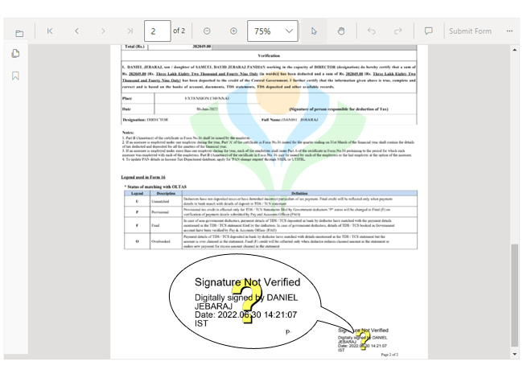

# Render digital signature appearance

The PDF Viewer control renders the digital signatures from the existing PDF document. The digital signatures are rendered as images if a PDF document has a digital signature.

