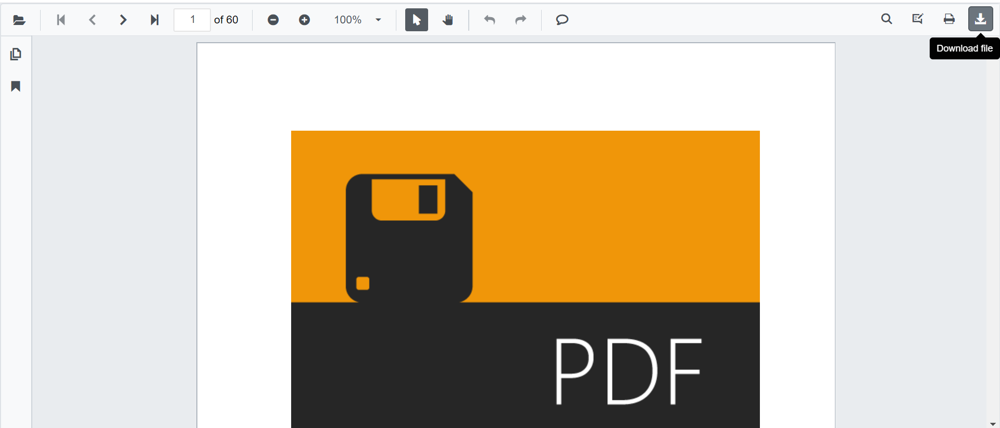

N> Syncfusion recommends using [Blazor PDF Viewer (NextGen)](https://blazor.syncfusion.com/documentation/pdfviewer-2/getting-started/server-side-application) Component which provides fast rendering of pages and improved performance. Also, there is no need of external Web service for processing the files and ease out the deployment complexity. It can be used in Blazor Server, WASM and MAUI applications without any changes.

# Download in Blazor PDF Viewer Component

The PDF Viewer supports downloading the loaded PDF file from the toolbar by default. You can enable or disable the download option by setting the `EnableDownload` API.

```cshtml
@using Syncfusion.Blazor.PdfViewerServer

<SfPdfViewerServer Width="1060px" Height="500px" DocumentPath="@DocumentPath" EnableDownload="true"/>

@code{
    public string DocumentPath { get; set; } = "wwwroot/data/PDF_Succinctly.pdf";
}
```




```cshtml
@using Syncfusion.Blazor.PdfViewerServer
@using Syncfusion.Blazor.Buttons

<SfButton OnClick="OnClick">Download</SfButton>
<SfPdfViewerServer Width="1060px" Height="500px" DocumentPath="@DocumentPath" @ref="@Viewer"/>

@code{
    SfPdfViewerServer Viewer;
    public string DocumentPath { get; set; } = "wwwroot/data/PDF_Succinctly.pdf";
    public void OnClick(MouseEventArgs args)
    {
        Viewer.Download();
    }
}
```

## Download Filename

The `DownloadFileName` property of the PDF Viewer enables you to sets the name of the file to be downloaded.

The following code example shows how to set default filename to the downloaded file.

```cshtml
@using Syncfusion.Blazor.PdfViewerServer
@using Syncfusion.Blazor.PdfViewer

<SfPdfViewerServer DocumentPath="@documentPath" DownloadFileName="@downloadFileName" Height="800px" Width="1000px"></SfPdfViewerServer>

@code
{
    //Sets the PDF document path for initial loading.
    public string documentPath { get; set; } = "wwwroot/Data/PDF Succinctly.pdf";

    //Sets the name of the file to be downloaded.
    private string downloadFileName { get; set; } = "TOP-View_CutSheets.pdf";

}
```
N> [View sample in GitHub](https://github.com/SyncfusionExamples/blazor-pdf-viewer-examples/tree/master/Load%20and%20Save/Modify%20the%20file%20name).

N> You can refer to the [Blazor PDF Viewer](https://www.syncfusion.com/blazor-components/blazor-pdf-viewer) feature tour page for its groundbreaking feature representations. You can also explore the [Blazor PDF Viewer example](https://blazor.syncfusion.com/demos/pdf-viewer/default-functionalities?theme=bootstrap4) to understand how to explain core features of PDF Viewer.