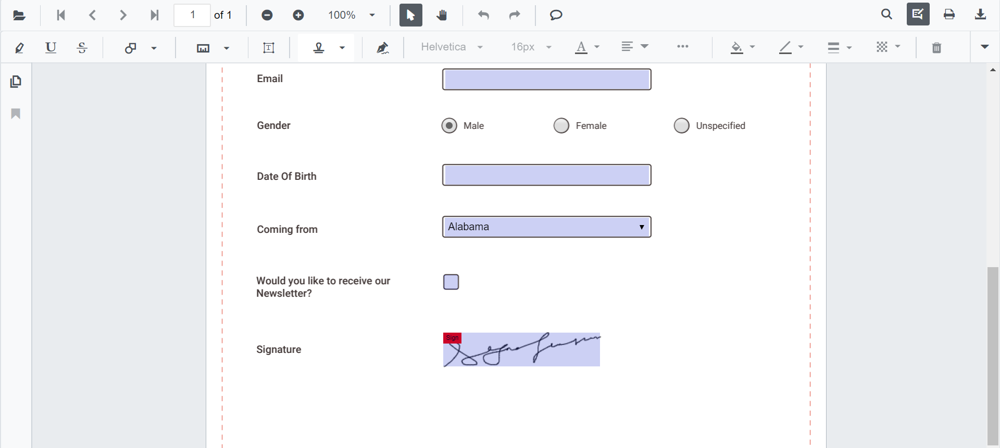
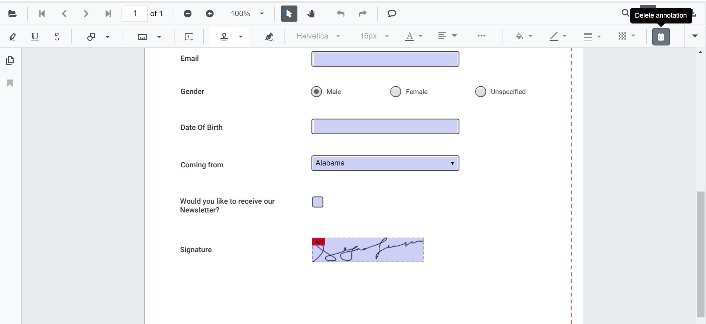

N> Syncfusion recommends using [Blazor PDF Viewer (NextGen)](https://blazor.syncfusion.com/documentation/pdfviewer-2/getting-started/server-side-application) Component which provides fast rendering of pages and improved performance. Also, there is no need of external Web service for processing the files and ease out the deployment complexity. It can be used in Blazor Server, WASM and MAUI applications without any changes.

# Form filling in Blazor PDF Viewer Component

PDF Viewer component allows to display the form fields available in the PDF document. By using this, you can edit and download the form fields.

The form fields displayed in the PDF Viewer are:

* Text box
* Password box
* Combo box
* Check box
* Radio Button
* Signature Field
* List box


## Disabling form fields

The PDF Viewer control provides an option to disable the form fields feature. The code snippet for disabling the feature is as follows.

```cshtml
@using Syncfusion.Blazor.PdfViewerServer

<SfPdfViewerServer Width="1060px" Height="500px" EnableFormFields=false />
@code{
    public string DocumentPath { get; set; } = "wwwroot/data/PDF_Succinctly.pdf";
}
```

## How to draw handwritten signature in the signature field

Signature can be added to the Signature field by using the following steps:

* Click the Signature Field in the PDF document. The signature panel will appear.


* Draw the signature in the signature panel.


* Click the **CREATE** button, the drawn signature will be added in the signature field.



## Delete the signature inside the signature field

You can also delete the signature in the signature field by using Delete Option in the annotation toolbar.



## Export and import form fields

The PDF Viewer control supports exporting and importing the form field data in the following formats using the `ImportFormFieldsAsync` and `ExportFormFieldsAsync` methods.

* XML
* FDF
* XFDF
* JSON

> N The form field data will be exported as stream, and that data from the stream will be imported into the current PDF document.

### Export and import as XML

The following code shows how to export the form fields as an XML data stream and import that data from the stream into the current PDF document via a button click.

```cshtml
<SfButton OnClick="@ExportAsStream">Export XML</SfButton>
<SfButton OnClick="@ImportFromStream">Import XML</SfButton>
<SfPdfViewerServer @ref=Viewer DocumentPath="@DocumentPath" />

@code 
{
    SfPdfViewerServer Viewer;
    public string DocumentPath { get; set; } = "wwwroot/data/FormDesigner.pdf";
    Stream stream;

    // Event triggers on Export XML button click.
    public async void ExportAsStream()
    {
        // Export the form field data to an XML format stream.
        stream = await Viewer.ExportFormFieldsAsync(FormFieldDataFormat.Xml);
    }

    // Event triggers on Import XML button click.
    public async void ImportFromStream()
    {
        // Import the form field data from the XML format stream into the current PDF document.
        await Viewer.ImportFormFieldsAsync(stream, FormFieldDataFormat.Xml);
    }
}

```

### Export and import as FDF

The following code shows how to export the form fields as an FDF data stream and import that data from the stream into the current PDF document via a button click.

```cshtml
<SfButton OnClick="@ExportAsStream">Export FDF</SfButton>
<SfButton OnClick="@ImportFromStream">Import FDF</SfButton>
<SfPdfViewerServer @ref=Viewer DocumentPath="@DocumentPath" />

@code 
{
    SfPdfViewerServer Viewer;
    public string DocumentPath { get; set; } = "wwwroot/data/FormDesigner.pdf";
    Stream stream;

    // Event triggers on Export FDF button click.
    public async void ExportAsStream()
    {
        // Export the form field data to an FDF format stream.
        stream = await Viewer.ExportFormFieldsAsync(FormFieldDataFormat.Fdf);
    }

    // Event triggers on Import FDF button click.
    public async void ImportFromStream()
    {
        // Import the form field data from the FDF format stream into the current PDF document.
        await Viewer.ImportFormFieldsAsync(stream, FormFieldDataFormat.Fdf);
    }
}

```

###  Export and import as XFDF

The following code shows how to export the form fields as an XFDF data stream and import that data from the stream into the current PDF document via a button click.

```cshtml
<SfButton OnClick="@ExportAsStream">Export XFDF</SfButton>
<SfButton OnClick="@ImportFromStream">Import XFDF</SfButton>
<SfPdfViewerServer @ref=Viewer DocumentPath="@DocumentPath" />

@code 
{
    SfPdfViewerServer Viewer;
    public string DocumentPath { get; set; } = "wwwroot/data/FormDesigner.pdf";
    Stream stream;

    // Event triggers on Export XFDF button click.
    public async void ExportAsStream()
    {
        // Export the form field data to XFDF format stream.
        stream = await Viewer.ExportFormFieldsAsync(FormFieldDataFormat.Xfdf);
    }

    // Event triggers on Import XFDF button click.
    public async void ImportFromStream()
    {
        // Import the form field data from the XFDF format stream into the current PDF document.
        await Viewer.ImportFormFieldsAsync(stream, FormFieldDataFormat.Xfdf);
    }
}

```

### Export and import as JSON

The following code shows how to export the form fields as a JSON data stream and import that data from the stream into the current PDF document via a button click.

```cshtml
<SfButton OnClick="@ExportAsStream">Export JSON</SfButton>
<SfButton OnClick="@ImportFromStream">Import JSON</SfButton>
<SfPdfViewerServer @ref=Viewer DocumentPath="@DocumentPath" />

@code 
{
    SfPdfViewerServer Viewer;
    public string DocumentPath { get; set; } = "wwwroot/data/FormDesigner.pdf";
    Stream stream;

    // Event triggers on Export JSON button click.
    public async void ExportAsStream()
    {
        // Export the form field data to JSON format stream.
        stream = await Viewer.ExportFormFieldsAsync(FormFieldDataFormat.Json);
    }

    // Event triggers on Import JSON button click.
    public async void ImportFromStream()
    {
        // Import the form field data from the JSON format stream into the current PDF document.
        await Viewer.ImportFormFieldsAsync(stream, FormFieldDataFormat.Json);
    }
}

```

### Export form fields as Json file

```cshtml
@using Syncfusion.Blazor.PdfViewerServer
@using Syncfusion.Blazor.PdfViewer
@using Syncfusion.Blazor.Buttons

<SfButton OnClick="@OnExportFormFieldsClick">Export JSON</SfButton>
<SfPdfViewerServer Width="1060px" Height="500px" DocumentPath="@DocumentPath" @ref="@Viewer" />
@code{
    SfPdfViewerServer Viewer;
    public string DocumentPath { get; set; } = "wwwroot/data/PDF_Succinctly.pdf";
    
    // Event triggers on Export JSON button click.
    public async void OnExportFormFieldsClick(MouseEventArgs args)
    {
        // Exports to a JSON file in the existing document name.
        await Viewer.ExportFormFieldsAsync("");
    }
}
```

### Export and import as object

```cshtml
@using Syncfusion.Blazor.PdfViewerServer
@using Syncfusion.Blazor.PdfViewer
@using Syncfusion.Blazor.Buttons

<SfButton OnClick="@OnExportFormFieldsClick">Export Data</SfButton>
<SfButton OnClick="@OnImportFormFieldsClick">Import Data</SfButton>
<SfPdfViewerServer @ref=Viewer Width="1060px" Height="500px" DocumentPath="@DocumentPath"/>

@code
{
    SfPdfViewerServer Viewer;
    public string DocumentPath { get; set; } = "wwwroot/Data/form-filling-document.pdf";
    Dictionary<string,string> dictionary;

    // Event triggers on Export Data button click.
    public async void OnExportFormFieldsClick(MouseEventArgs args)
    {
        // Export the form field data to a dictionary.
        dictionary = await Viewer.ExportFormFieldsAsObjectAsync();
    }

    // Event triggers on Import Data button click.
    public async void OnImportFormFieldsClick(MouseEventArgs args)
    {
        // Import the form field data from the dictionary into the current PDF document.
        await Viewer.ImportFormFieldsAsync(dictionary);
    }
}
```

N> You can refer to the [Blazor PDF Viewer](https://www.syncfusion.com/blazor-components/blazor-pdf-viewer) feature tour page for its groundbreaking feature representations. You can also explore the [Blazor PDF Viewer example](https://blazor.syncfusion.com/demos/pdf-viewer/default-functionalities?theme=bootstrap5) to understand how to explain core features of PDF Viewer.