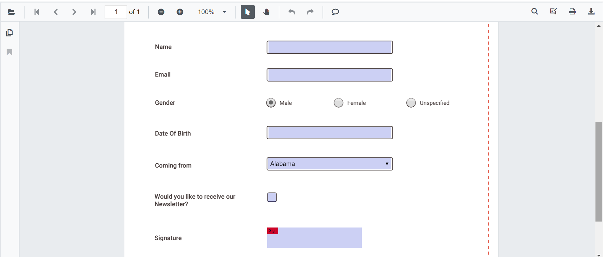
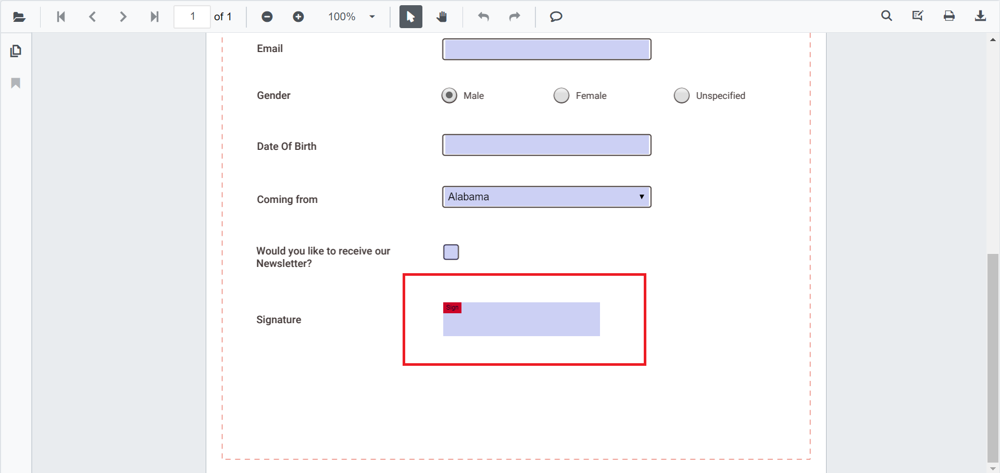
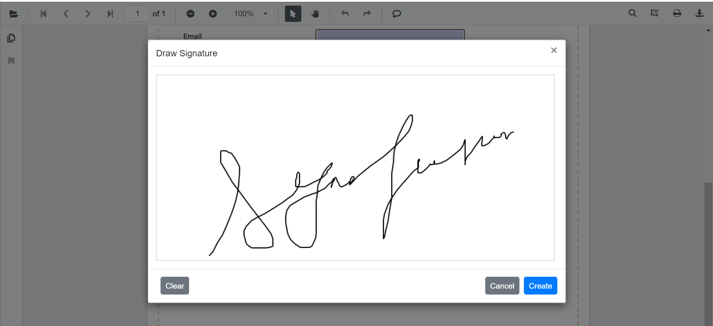

# Form filling and signature fields

PDF Viewer component allows you to display the form fields available in the PDF document. By using this you can edit and download the form fields.

The form fields displayed in the PDF Viewer are:

* Text box
* Password box
* Combo box
* Check box
* Radio Button
* Signature Field
* List box



## Disabling form fields

The PDF Viewer control provides an option to disable the form fields feature . The code snippet for disabling the feature is as follows.

```csharp
@using Syncfusion.Blazor.PdfViewerServer

<SfPdfViewerServer Width="1060px" Height="500px" EnableFormFields=false />
@code{
    public string DocumentPath { get; set; } = "wwwroot/data/PDF_Succinctly.pdf";
}
```

## How to draw handwritten signature in the signature field

Signature can be added to the Signature field by using the following steps:

* Click the Signature Field in the PDF document. The signature panel will appear.



* Draw the signature in the signature panel.



* Click the **CREATE** button, the drawn signature will be added in the signature field.


## Delete the signature inside the signature field

You can also delete the signature in the signature field by using Delete Option in the annotation toolbar.


## Import and export FormFields

The PDF Viewer control provides the support to import and export formfields using a JSON object in the PDF document.

## Importing FormFields using PDF Viewer API

You can import the formfields using JSON file or JSON object in code behind like the below code snippet

```csharp
@using Syncfusion.Blazor.PdfViewerServer
@using Syncfusion.Blazor.Buttons

<SfButton OnClick="@OnImportFormFieldsClick">Import FormFields</SfButton>
<SfPdfViewerServer @ref=Viewer Width="1060px" Height="500px" DocumentPath="@DocumentPath" />
@code{
        SfPdfViewerServer Viewer;
public string DocumentPath { get; set; } = "wwwroot/data/FormFillingDocument.pdf";
    public void OnImportFormFieldsClick(MouseEventArgs args)
    {
        Viewer.ImportFormFields("wwwroot/data/ImportedFormFields.json"); //The json file has been placed inside the data folder.
    }
}
```

>The JSON file for importing the formfields should be placed in the desired location and the path should be provided correctly.

## Exporting FormFields from the PDF document using PDF Viewer API

You can export the formfields as JSON file in code behind as the following code snippet

```csharp
@using Syncfusion.Blazor.PdfViewerServer
@using Syncfusion.Blazor.Buttons

<SfButton OnClick="@OnExportFormFieldsClick">Export FormFields</SfButton>
<SfPdfViewerServer Width="1060px" Height="500px" DocumentPath="@DocumentPath" @ref="@Viewer" />
@code{
    SfPdfViewerServer Viewer;
    public string DocumentPath { get; set; } = "wwwroot/data/PDF_Succinctly.pdf";
    public void OnExportFormFieldsClick(MouseEventArgs args)
    {
        Viewer.ExportFormFields();
    }
}
```