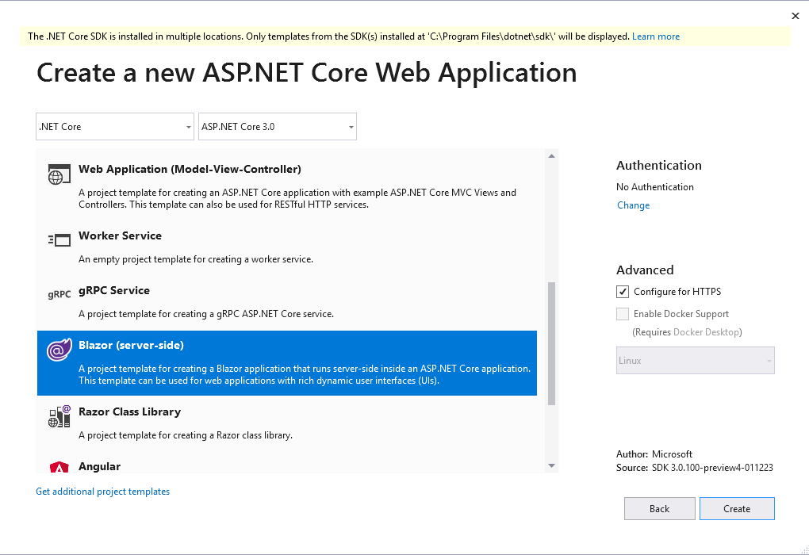
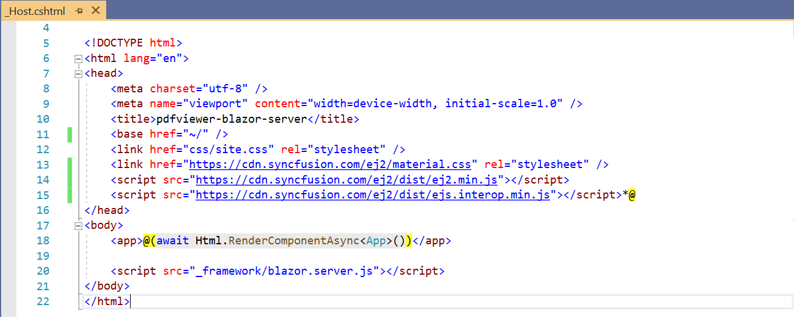

<!-- markdownlint-disable MD033 -->
<!-- markdownlint-disable MD009 -->

# Getting Started with Essential JS 2 for ASP.NET Core Razor Components in Visual Studio 2019

This article provides a step-by-step introduction to configure Essential JS 2 setup, build and publish a simple .NET Core Razor Components web application using the [Visual Studio 2019](https://visualstudio.microsoft.com/vs/preview/).

## Prerequisites

The official prerequisites to create and run an ASP.NET Core Razor Components on Windows environment are described in the [.NET Core Razor components documentation website](https://docs.microsoft.com/en-us/aspnet/core/client-side/spa/blazor/get-started?view=aspnetcore-3.0&tabs=visual-studio).

* [Visual Studio 2019 Preview](https://visualstudio.microsoft.com/vs/preview/) with the ASP.NET and web development workload
* [.NET Core SDK 3.0 Preview](https://dotnet.microsoft.com/download/dotnet-core/3.0)

## Create a Blazor application from VS 2019

**Step 1:** Choose **File > New > Project...** in the Visual Studio menu bar.


**Step 2:** Make sure **.NET Core** and **ASP.NET Core 3.0** are selected at the top.



**Step 3:** Choose the Blazor template and change the application name, and then click **OK**.

## Importing Essential JS 2 Razor components in the application

**Step 1:** Now, add the **Syncfusion.EJ2.AspNet.Core.RazorComponents** NuGet package to the new application by using the NuGet Package Manager. Right-click the project and select Manage NuGet Packages.


**Step 2:** Search the **Syncfusion.EJ2.AspNet.Core.RazorComponents** keyword in the Browse tab and install **Syncfusion.EJ2.AspNet.Core.RazorComponents** NuGet package in the application.


**Step 3:** The Essential JS 2 package will be included in the project, after the installation process is completed.

**Step 4:** Open **~/_ViewImports.cshtml** file and import the `Syncfusion.EJ2.RazorComponents`.

```cshtml

    @addTagHelper *, Syncfusion.EJ2.RazorComponents

```

**Step 5:** Add the client-side resources through CDN or local npm package in the `<head>` element of the **~/wwwroot/index.html** page.



**Step 6:** Now, add the Syncfusion Essential JS 2 components in any web page (cshtml) in the `Pages` folder. For example, the PDF Viewer component is added in the **~/Pages/Index.cshtml** page.

```cshtml

<div class="col-lg-12 control-section">
    <EjsPdfViewer id='pdfviewer' documentPath='PDF_Succinctly.pdf' serviceUrl='https://ej2services.syncfusion.com/production/web-services/api/pdfviewer' style='height: 640px;width: 100%' />
</div>

```

> For PDF Viewer serviceUrl creation, follow the steps provided in the [link](https://ej2.syncfusion.com/documentation/pdfviewer/how-to/create-pdfviewer-service/)

**Step 7:** Run the application. The Essential JS 2 PDF Viewer component will render in the web browser.

