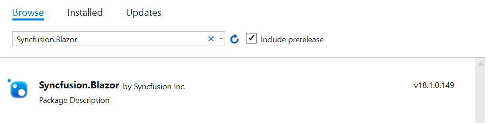

# Client-side application in Blazor PDF Viewer Component

> There is a separate PDF Viewer component for Blazor server-side and Blazor client-side applications.
>* The `SfPdfViewerServer` control is for Blazor server-side application. This control resides with Syncfusion.Blazor.PdfViewerServer.Windows NuGet package. This server-side control is highly recommended.
>* The `SfPdfViewer` control is for Blazor client-side application. This control requires server-side processing to render the PDF files through web service. It resides with Syncfusion.Blazor.PdfViewer NuGet package.

**Step 1:** Create a new ASP.NET Core Web application. Click Next.


**Step 2:** Provide a project name and click Create.


**Step 3:** In the create a new ASP.NET Core Web application dialog.

* Confirm that .NET Core and ASP.NET Core 3.0 is selected

* Choose the Blazor (client-side) template and click Create

 

 **Step 4:** Install the [Syncfusion.Blazor](https://www.nuget.org/packages/Syncfusion.Blazor) from NuGet.org

  
> Please ensure to check the Include prerelease option for our Beta release.

 **Step 5:** Open **~/_Imports.razor** file and import the `Syncfusion.Blazor`.

```cshtml
@using Syncfusion.Blazor
@using Syncfusion.Blazor.PdfViewer
```

**Step 6:** Add the client-side style resources through CDN in the `<head>` element of the **~/wwwroot/index.html** page.

```html
<head>
    <link href="https://cdn.syncfusion.com/blazor/{:version:}/styles/bootstrap4.css" rel="stylesheet" />
</head>
```

For **Internet Explorer 11** kindly refer the polyfills. Refer the [documentation](https://ej2.syncfusion.com/blazor/documentation/common/how-to/render-blazor-server-app-in-ie/) for more information.

```html
<head>
    <link href="https://cdn.syncfusion.com/blazor/{:version:}/styles/bootstrap4.css" rel="stylesheet" />
    <script src="https://github.com/Daddoon/Blazor.Polyfill/releases/download/3.0.1/blazor.polyfill.min.js"></script>
</head>
```

**Step 7:** Add **SyncfusionBlazor** service in **Startup.cs** file.

Open the **Startup.cs** file and add services required by Syncfusion components using **services.AddSyncfusionBlazor()** method. Add this method in the ConfigureServices function as follows.

```c#
using Syncfusion.Blazor

namespace BlazorApplication
{
    public class Startup
    {
        ....
        ....
        public void ConfigureServices(IServiceCollection services)
        {
            ....
            ....
            services.AddSyncfusionBlazor();
        }
    }
}
```

> To enable custom client side resource loading from CRG or CDN. You need to disable resource loading by **AddSyncfusionBlazor(true)** and load the scripts in the HEAD element of the ~/Pages/_Host.cshtml page.

**Step 8:** Now, add the PDF Viewer (Client-side) component to the **~/Pages/Index.razor** page.

```cshtml
<SfPdfViewer DocumentPath="PDF_Succinctly.pdf" ServiceUrl="https://ej2services.syncfusion.com/production/web-services/api/pdfviewer" Height="500px" Width="1060px">
</SfPdfViewer>
```

> Since Syncfusion PDF Viewer (Blazor client-side) control depends on server-side processing to render the PDF files, it is mandatory to create a web service as mentioned [here](https://www.syncfusion.com/kb/10346/how-to-create-pdf-viewer-web-service-application-in-asp-net-core)

**Step 9:**: Run the application, the PDF Viewer component will be rendered in the web browser as shown in the following screenshot.


