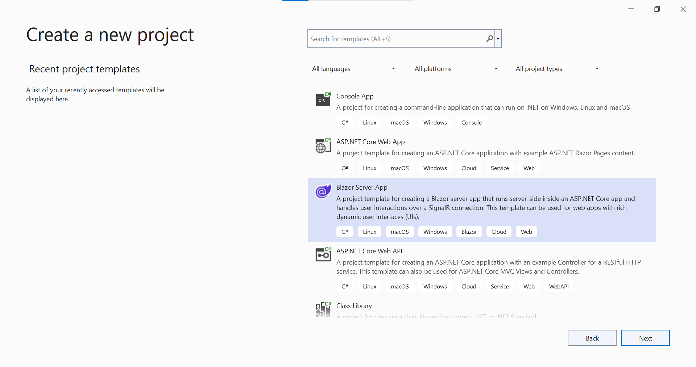
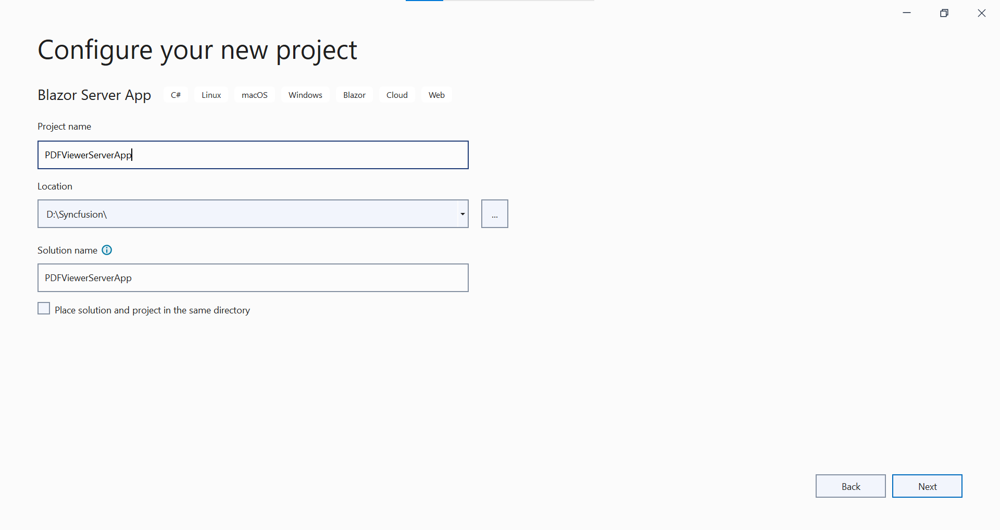
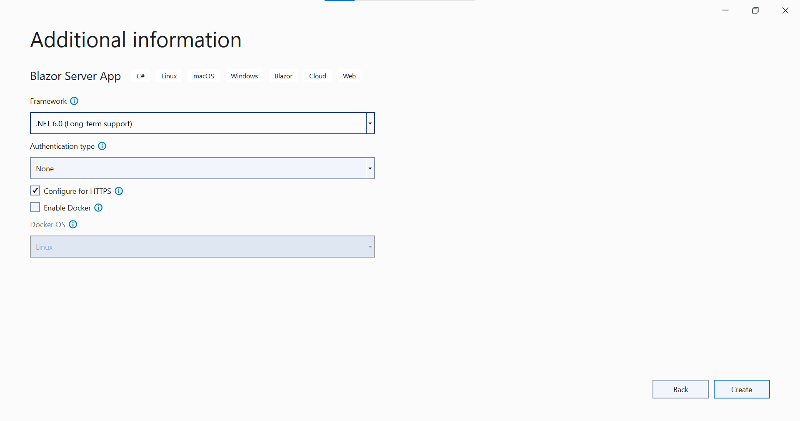

# Getting Started with Blazor PDF Viewer Component in Blazor Server App

This section briefly explains about how to integrate [Blazor PDF Viewer](https://www.syncfusion.com/blazor-components/blazor-pdf-viewer) component in your Blazor Server App using Visual Studio.

## Prerequisites

* [System requirements for Blazor components](https://blazor.syncfusion.com/documentation/system-requirements)

## Integrate PDF Viewer into Blazor Server App

1. Start Visual Studio and select **Create a new project**.
2. For a Blazor Server experience, choose the **Blazor Server App** template. Select **Next**. 

3. Provide a **Project Name** and confirm that the *Location* is correct. Select Next. 

4. In the **Additional information** dialog, set the target framework. 

## Install Blazor PDF Viewer NuGet package in Blazor Server App

To add Blazor PDF Viewer component in Blazor Server App, use `SfPdfViewerServer` component in corresponding NuGet based on the operating system of the server you intend to host, as shown below.,
* For **Windows**, use [Syncfusion.Blazor.PdfViewerServer.Windows](https://www.nuget.org/packages/Syncfusion.Blazor.PdfViewerServer.Windows)
* For **Linux**, use [Syncfusion.Blazor.PdfViewerServer.Linux](https://www.nuget.org/packages/Syncfusion.Blazor.PdfViewerServer.Linux)
* For **macOs**, use [Syncfusion.Blazor.PdfViewerServer.OSX](https://www.nuget.org/packages/Syncfusion.Blazor.PdfViewerServer.OSX)

## Register Syncfusion Blazor Service

Open **~/_Imports.razor** file and import the Syncfusion.Blazor namespace.




@using Syncfusion.Blazor




Now, register the Syncfusion Blazor Service in the Blazor Server App. Here, Syncfusion Blazor Service is registered by setting [IgnoreScriptIsolation](https://help.syncfusion.com/cr/blazor/Syncfusion.Blazor.GlobalOptions.html#Syncfusion_Blazor_GlobalOptions_IgnoreScriptIsolation) property as true to load the scripts externally in the [next steps](#add-script-reference).

> From 2022 Vol-1 (20.1) version, the default value of `IgnoreScriptIsolation` is changed to `true`. It is not necessary to set the `IgnoreScriptIsolation` property to refer scripts externally, since the default value has already been changed to true, and this property is obsolete.

* For **.NET 6** app, open the **~/Program.cs** file and register the Syncfusion Blazor Service.

* For **.NET 5 and .NET 3.X** app, open the **~/Startup.cs** file and register the Syncfusion Blazor Service.




using Microsoft.AspNetCore.Components;
using Microsoft.AspNetCore.Components.Web;
using Syncfusion.Blazor;

var builder = WebApplication.CreateBuilder(args);

// Add services to the container.
builder.Services.AddRazorPages();
builder.Services.AddServerSideBlazor().AddHubOptions(o => { o.MaximumReceiveMessageSize = 102400000; });
builder.Services.AddSyncfusionBlazor();

var app = builder.Build();
....





using Syncfusion.Blazor;

namespace BlazorApplication
{
    public class Startup
    {
        ...
        public void ConfigureServices(IServiceCollection services)
        {
            services.AddRazorPages();
            services.AddServerSideBlazor();
            services.AddSyncfusionBlazor();
        }
        ...
    }
}




## Add Style Sheet

To add theme to the app, open the NuGet package manager in Visual Studio (*Tools → NuGet Package Manager → Manage NuGet Packages for Solution*), search for [Syncfusion.Blazor.Themes](https://www.nuget.org/packages/Syncfusion.Blazor.Themes/) and then install it. Then, the theme style sheet from NuGet can be referred as follows,

* For .NET 6 app, add the Syncfusion bootstrap5 theme in the `<head>` of the **~/Pages/_Layout.cshtml** file.

* For .NET 5 and .NET 3.X app, add the Syncfusion bootstrap5 theme in the `<head>` of the **~/Pages/_Host.cshtml** file.




<head>
    <link href="_content/Syncfusion.Blazor.Themes/bootstrap5.css" rel="stylesheet" />
</head>





<head>
    <link href="_content/Syncfusion.Blazor.Themes/bootstrap5.css" rel="stylesheet" />
</head>




N> Checkout the [Blazor Themes topic](https://blazor.syncfusion.com/documentation/appearance/themes) to learn different ways ([Static Web Assets](https://blazor.syncfusion.com/documentation/appearance/themes#static-web-assets), [CDN](https://blazor.syncfusion.com/documentation/appearance/themes#cdn-reference) and [CRG](https://blazor.syncfusion.com/documentation/common/custom-resource-generator)) to refer themes in Blazor application, and to have the expected appearance for Syncfusion Blazor components. Here, the theme is referred using [Static Web Assets](https://blazor.syncfusion.com/documentation/appearance/themes#static-web-assets). Refer to [Enable static web assets usage](https://blazor.syncfusion.com/documentation/appearance/themes#enable-static-web-assets-usage) topic to use static assets in your project.

## Add Script Reference

 In this getting started walk-through, the required scripts are referred using [Static Web Assets](https://blazor.syncfusion.com/documentation/common/adding-script-references#static-web-assets) externally inside the `<head>` as follows. Refer to [Enable static web assets usage](https://blazor.syncfusion.com/documentation/common/adding-script-references#enable-static-web-assets-usage) topic to use static assets in your project.

* For **.NET 6** app, Refer script in the `<head>` of the **~/Pages/_Layout.cshtml** file.

* For **.NET 5 and .NET 3.X** app, Refer script in the `<head>` of the **~/Pages/_Host.cshtml** file.




<head>
    ....
    <link href="_content/Syncfusion.Blazor.Themes/bootstrap5.css" rel="stylesheet" />
    
</head>





<head>
    ....
    <link href="_content/Syncfusion.Blazor.Themes/bootstrap5.css" rel="stylesheet" />
    
</head>




N> Checkout [Adding Script Reference topic](https://blazor.syncfusion.com/documentation/common/adding-script-references) to learn different ways to add script reference in Blazor Application. 

> Syncfusion recommends to reference scripts using [Static Web Assets](https://blazor.syncfusion.com/documentation/common/adding-script-references#static-web-assets), [CDN](https://blazor.syncfusion.com/documentation/common/adding-script-references#cdn-reference) and [CRG](https://blazor.syncfusion.com/documentation/common/custom-resource-generator) by [disabling JavaScript isolation](https://blazor.syncfusion.com/documentation/common/adding-script-references#disable-javascript-isolation) for better loading performance of the Blazor application.

## Add Blazor PDF Viewer Component

* Open **~/_Imports.razor** file or any other page under the `~/Pages` folder where the component is to be added and import the **Syncfusion.Blazor.PdfViewer** namespace.




@using Syncfusion.Blazor
@using Syncfusion.Blazor.PdfViewerServer




* Now, add the Syncfusion PDF Viewer component in razor file. Here, the PDF Viewer component is added in the **~/Pages/Index.razor** file under the **~/Pages** folder.




<SfPdfViewerServer DocumentPath="@DocumentPath" Height="500px" Width="1060px" ></SfPdfViewerServer>

@code{
private string DocumentPath { get; set; } = "wwwroot/Data/PDF_Succinctly.pdf";
}




> If the `DocumentPath` property value is not provided, the PDF Viewer component will be rendered without loading the PDF document. The users can then use the open option from the toolbar to browse and open the PDF as required.

Press <kbd>Ctrl</kbd>+<kbd>F5</kbd> (Windows) or <kbd>⌘</kbd>+<kbd>F5</kbd> (macOS) to run the application. Then, the Syncfusion `Blazor PDF Viewer` component will be rendered in the default web browser.

>[View Sample in GitHub](https://github.com/SyncfusionExamples/blazor-pdf-viewer-examples/tree/master/Getting%20Started/Simple%20Sample%20PDFViewer%20-%20Server).
