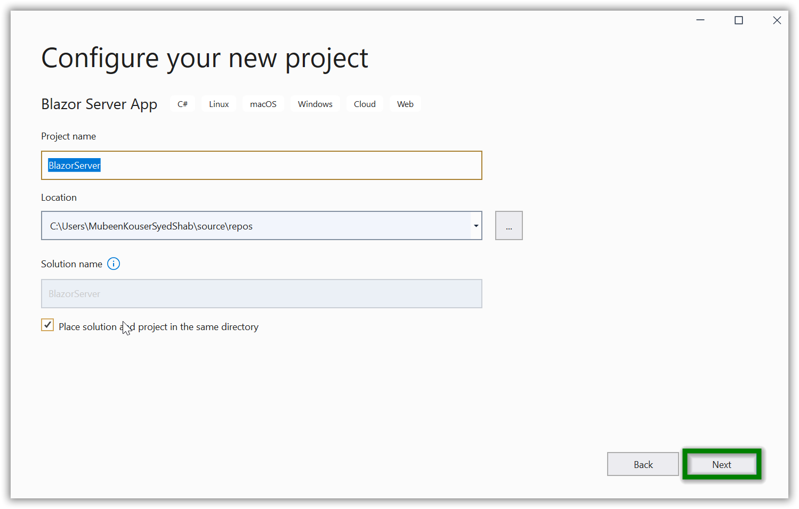

# Server-side application in Blazor PDF Viewer Component

>Note: There is a separate PDF Viewer component for Blazor server-side and Blazor WebAssembly applications.
>* The `SfPdfViewerServer` control is for Blazor server-side application. This control resides with Syncfusion.Blazor.PdfViewerServer.Windows NuGet package. This server-side control is highly recommended.
>* The `SfPdfViewer` control is for Blazor WebAssembly application. This control requires server-side processing to render the PDF files through web service. It resides with Syncfusion.Blazor.PdfViewer NuGet package.

This section briefly explains how to include a PDF Viewer in your  Blazor server-side application.

**Step 1:** Choose **Create a new project** from the Visual Studio dashboard.Click Next.


**Step 2:** Select **Blazor Server App** from the template, and then click **Next** button..


**Step 3:** Now, the project configuration window will popup. Click **Next** button to modify the additional information.

 

 **Step 4:** Select the target Framework **.NET 5.0** at the top of the Application based on your required target and then click **Create** button to create a new Blazor Server application.

  

**Step 5:** Installing Syncfusion Blazor packages in the application

You can use any one of the below standard to install the Syncfusion Blazor library in your application.

* **Using Syncfusion Blazor individual NuGet Packages [New standard]**

> Starting with Volume 4, 2020 (v18.4.0.30) release, Syncfusion provides [individual NuGet packages](https://blazor.syncfusion.com/documentation/nuget-packages/) for our Syncfusion Blazor components. We highly recommend this new standard for your Blazor production applications. Refer to [this section](https://blazor.syncfusion.com/documentation/nuget-packages/#benefits-of-using-individual-nuget-packages) to know the benefits of the individual NuGet packages.

1. Install **Syncfusion.Blazor.PdfViewerServer.Windows** NuGet package to the new application using the `NuGet Package Manager`. For more details about available NuGet packages, refer to the [Individual NuGet Packages](https://blazor.syncfusion.com/documentation/nuget-packages/) documentation.

2. Right-click the project,and then select `Manage NuGet Packages`.

    

3. Search **Syncfusion.Blazor.PdfViewerServer.Windows** keyword in the Browse tab and install **Syncfusion.Blazor.PdfViewerServer.Windows** NuGet package in the application.

    

4. The `Syncfusion.Blazor.PdfViewerServer.Windows` package will be included in the newly created project once the installation process is completed.

> If you are developing for Linux or Mac (OSX) operating system, use the following corresponding libraries as follows:
>* For Linux, use [Syncfusion.Blazor.PdfViewerServer.Linux](https://www.nuget.org/packages/Syncfusion.Blazor.PdfViewerServer.Linux)
>* For Mac (OSX), use [Syncfusion.Blazor.PdfViewerServer.OSX](https://www.nuget.org/packages/Syncfusion.Blazor.PdfViewerServer.OSX)

* **Using Syncfusion.Blazor NuGet Package [Old standard]**

W>If you prefer the above new standard (individual NuGet packages), then skip this section. Using both old and new standards in the same application will throw ambiguous compilation errors.

1. Now, install **Syncfusion.Blazor** NuGet package to the newly created application by using the `NuGet Package Manager`. Right-click the project and then select Manage NuGet Packages.

    

2. Search **Syncfusion.Blazor** keyword in the Browse tab and install **Syncfusion.Blazor** NuGet package in the application.

    

3. The `Syncfusion Blazor` package will be installed in the project once the installation process is completed.

**Step 6:** Open **~/_Imports.razor** file and import the `Syncfusion.Blazor` namespace.

```csharp
@using Syncfusion.Blazor
@using Syncfusion.Blazor.PdfViewerServer
@using Syncfusion.Blazor.PdfViewer
```

**Step 7:** Add the Syncfusion bootstrap4 theme in the `<head>` element of the **~/Pages/_Host.html** page.

```html
<head>
    ....
    ....
        <link href="_content/Syncfusion.Blazor/styles/bootstrap4.css" rel="stylesheet" />
</head>
```

> **Note:** The same theme file can be referred through the CDN version by using [https://cdn.syncfusion.com/blazor/{{ site.blazorversion }}/styles/bootstrap4.css](https://cdn.syncfusion.com/blazor/{{ site.blazorversion }}/styles/bootstrap4.css).

For **Internet Explorer 11** kindly refer the polyfills. Refer the [documentation](https://blazor.syncfusion.com/documentation/common/how-to/render-blazor-server-app-in-ie) for more information.

```html
<head>
    <link href="https://cdn.syncfusion.com/blazor/{{ site.blazorversion }}/styles/bootstrap4.css" rel="stylesheet" />
    <script src="https://github.com/Daddoon/Blazor.Polyfill/releases/download/3.0.1/blazor.polyfill.min.js"></script>
</head>
```

**Step 8:** Add SyncfusionBlazor service in **Startup.cs** file.

Open the **Startup.cs** file and add services required by Syncfusion components using **services.AddSyncfusionBlazor()** method. Add this method in the ConfigureServices function as follows.

```csharp
using Syncfusion.Blazor;

namespace BlazorServer
{
    public class Startup
    {
        public void ConfigureServices(IServiceCollection services)
        {
            ....
            ....
            services.AddSyncfusionBlazor();
        }
    }
}
```

> To enable custom WebAssembly resource loading from CRG or CDN. You need to disable resource loading by **AddSyncfusionBlazor(true)** and load the scripts in the HEAD element of the `~/Pages/_Host.cshtml` page.

**Step 9:**  Add the Syncfusion PDF Viewer component to the **~/Pages/Index.razor** page by using the `SfPdfViewerServer` tag. Also,you can load the PDF Viewer with a document from `wwwroot/Data` location. while initial rendering itself by specifying it in the **DocumentPath** property of the PDF Viewer component.

```csharp
<SfPdfViewerServer DocumentPath="@DocumentPath" Height="500px" Width="1060px" ></SfPdfViewerServer>

@code{
private string DocumentPath { get; set; } = "wwwroot/Data/PDF_Succinctly.pdf";
}
```

> If the DocumentPath property value is not provided, the PDF Viewer component will be rendered without loading the PDF document. The users can then use the open option from the toolbar to browse and open the PDF as required.

**Step 10:** Run the application, the PDF Viewer component will be rendered in the web browser as shown in the following screenshot.


Download the Server side application from [here](https://www.syncfusion.com/downloads/support/directtrac/general/ze/BlazorServer1089926850.zip)

> You can refer to our [Blazor PDF Viewer](https://www.syncfusion.com/blazor-components/blazor-pdf-viewer) feature tour page for its groundbreaking feature representations. You can also explore our [Blazor PDF Viewer example](https://blazor.syncfusion.com/demos/pdf-viewer/default-functionalities?theme=bootstrap4) to understand how to explains core features of PDF Viewer.