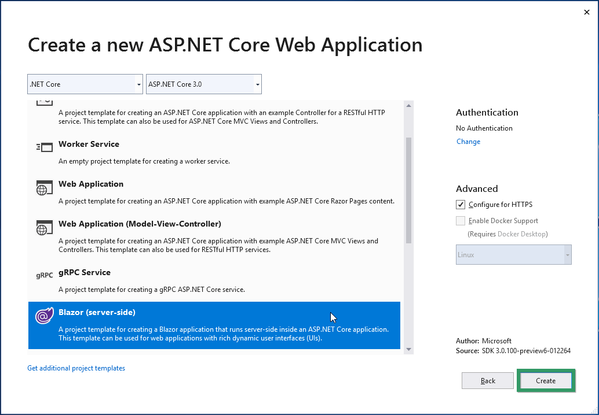
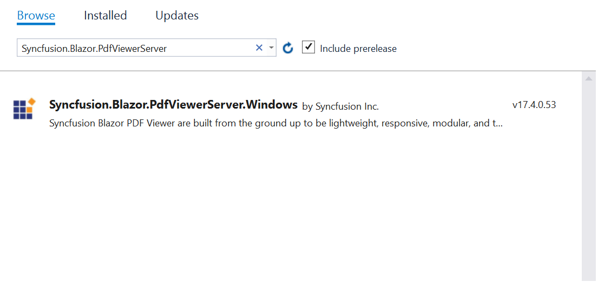

# Create a PDF Viewer in Blazor server-side application

This section briefly explains how to include a PDF Viewer in your  Blazor server-side application.

**Step 1:** Create a new ASP.NET Core Web application. Click Next.


**Step 2:** Provide a project name and click Create.


**Step 3:** In the create a new ASP.NET Core Web application dialog.

* Confirm that .NET Core and ASP.NET Core 3.0 is selected

* Choose the Blazor (server-side) template and click Create

 

 **Step 4:** Install the [Syncfusion.Blazor.PdfViewerServer.Windows](https://www.nuget.org/packages/Syncfusion.Blazor.PdfViewerServer.Windows) from NuGet.org

  

  > If you are developing for Linux or Mac (OSX) operating system, use the following corresponding libraries as follows:
>* For Linux, use [Syncfusion.Blazor.PdfViewerServer.Linux](https://www.nuget.org/packages/Syncfusion.Blazor.PdfViewerServer.Linux)
>* For Mac (OSX), use [Syncfusion.Blazor.PdfViewerServer.OSX](https://www.nuget.org/packages/Syncfusion.Blazor.PdfViewerServer.OSX)

**Step 5:** Open the **~/_Imports.razor** file and import the following namespaces

```cshtml
@using Syncfusion.Blazor
@using Syncfusion.Blazor.PdfViewerServer
@using Syncfusion.Blazor.PdfViewer
```

**Step 6:** Add the client-side resources through CDN in the `<head>` element of the **~/Pages/_Host.cshtml** page.

```html
<head>
    <link href="https://cdn.syncfusion.com/blazor/{:version:}/styles/bootstrap4.css" rel="stylesheet" />
</head>
```

For **Internet Explorer 11** kindly refer the polyfills. Refer the [documentation](https://ej2.syncfusion.com/blazor/documentation/common/how-to/render-blazor-server-app-in-ie/) for more information.

```html
<head>
    <link href="https://cdn.syncfusion.com/blazor/{:version:}/styles/bootstrap4.css" rel="stylesheet" />
    <script src="https://github.com/Daddoon/Blazor.Polyfill/releases/download/3.0.1/blazor.polyfill.min.js"></script>
</head>
```

**Step 7:** Add **SyncfusionBlazor** service in **Startup.cs** file.

Open the **Startup.cs** file and add services required by Syncfusion components using **services.AddSyncfusionBlazor()** method. Add this method in the ConfigureServices function as follows.

```cshtml
@using Syncfusion.Blazor

namespace BlazorApplication
{
    public class Startup
    {
        ....
        ....
        public void ConfigureServices(IServiceCollection services)
        {
            ....
            ....
            services.AddSyncfusionBlazor();
        }
    }
}

```

>Note: To enable custom client side resource loading from CRG or CDN. You need to disable resource loading by **AddSyncfusionBlazor(true)** and load the scripts in the HEAD element of the ~/Pages/_Host.cshtml page.

**Step 8:** Add the Syncfusion PDF Viewer component to the **~/Pages/Index.razor** page by using the `SfPdfViewerServer` tag. Also,you can load the PDF Viewer with a document from **wwwroot/Data** location. while initial rendering itself by specifying it in the  **DocumentPath** property of the PDF Viewer component.

```csharp
<SfPdfViewerServer DocumentPath="@DocumentPath" Height="500px" Width="1060px" ></SfPdfViewerServer>

@code{
    private string DocumentPath { get; set; } = "wwwroot/Data/PDF_Succinctly.pdf";
}
```

>Note: If the DocumentPath property value is not provided, the PDF Viewer component will be rendered without loading the PDF document. The users can then use the open option from the toolbar to browse and open the PDF as required.

**Step:9**: The Blazor application uses SignalR connection to manage communication between the server and client. By default, SignalR limits the [buffer size](https://docs.microsoft.com/en-us/aspnet/core/signalr/security?view=aspnetcore-2.1#buffer-management) to 32 KB. So,increase the buffer size of the blazor application to upload large documents from client to server.  To increase the connection buffer size, set  `MaximumReceiveMessageSize` property shown below in the **startup.cs**  file with in  **(ConfigureServices)** method.

```csharp
public void ConfigureServices(IServiceCollection services)
        {
          services.AddServerSideBlazor().AddHubOptions(o => { o.MaximumReceiveMessageSize = 102400000;  });
        }
```

**Step:10**: Run the application, the PDF Viewer component will be rendered in the web browser as shown in the following screenshot.


>Note: There is a separate PDF Viewer component for Blazor server-side and Blazor client-side applications.
>* The `SfPdfViewerServer` control is for Blazor server-side application. This control resides with Syncfusion.Blazor.PdfViewerServer.Windows NuGet package. This server-side control is highly recommended.
>* The `SfPdfViewer` control is for Blazor client-side application. This control requires server-side processing to render the PDF files through web service. It resides with Syncfusion.Blazor.PdfViewer NuGet package.