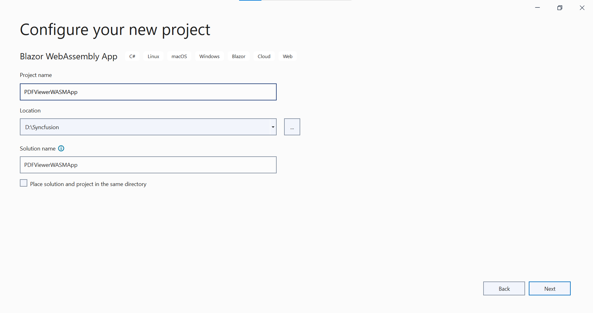
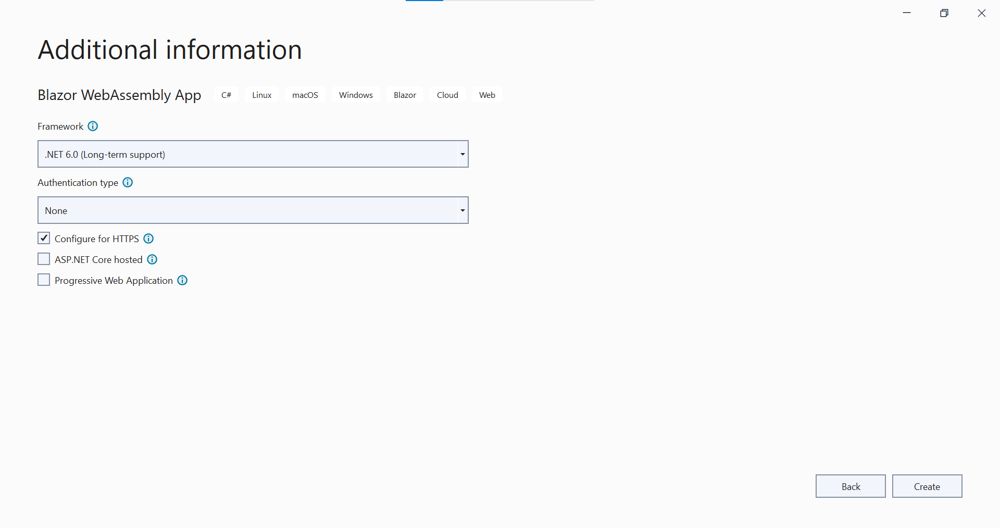

# Getting Started with Blazor PDF Viewer Component in Blazor WASM App

This section briefly explains about how to include [Blazor PDF Viewer](https://www.syncfusion.com/blazor-components/blazor-pdf-viewer) component in your Blazor WebAssembly (WASM) App using Visual Studio.

## Prerequisites

* [System requirements for Blazor components](https://blazor.syncfusion.com/documentation/system-requirements)

## Integrate PDF Viewer into Blazor WebAssembly App

1. Start Visual Studio and select **Create a new project**.
2. For a Blazor WebAssembly experience, choose the **Blazor WebAssembly App** template and select **Next**. 

3. Provide a **Project name** and confirm that the *Location* is correct. Select **Next**.

4. In **Additional information dialog**, set target framework.  


## Install Blazor PDFViewer NuGet package in WASM App

To add Blazor PDF Viewer component in Blazor WebAssembly App, use `SfPdfViewer` component in [Syncfusion.Blazor.PdfViewer](https://www.nuget.org/packages/Syncfusion.Blazor.PdfViewer) NuGet package and [Syncfusion.Blazor.Themes](https://www.nuget.org/packages/Syncfusion.Blazor.Themes/) NuGet package for theme style sheet. 

> This component requires server-side processing to render the PDF files through web service

## Register Syncfusion Blazor Service

1. Open **~/_Imports.razor** file and import the **Syncfusion.Blazor** and **Syncfusion.Blazor.PdfViewer** namespaces.




@using Syncfusion.Blazor
@using Syncfusion.Blazor.PdfViewer




Now, register the Syncfusion Blazor Service in the Blazor WebAssembly App. Here, Syncfusion Blazor Service is registered by setting [IgnoreScriptIsolation](https://help.syncfusion.com/cr/blazor/Syncfusion.Blazor.GlobalOptions.html#Syncfusion_Blazor_GlobalOptions_IgnoreScriptIsolation) property as true to load the scripts externally in the [next steps](#add-script-reference).

> From 2022 Vol-1 (20.1) version, the default value of `IgnoreScriptIsolation` is changed to `true`. It is not necessary to set the `IgnoreScriptIsolation` property to refer scripts externally, since the default value has already been changed to true, and this property is obsolete.

2. Open **~/Program.cs** file and register the Syncfusion Blazor Service in the client web app.




using Microsoft.AspNetCore.Components.Web;
using Microsoft.AspNetCore.Components.WebAssembly.Hosting;
using Syncfusion.Blazor;

var builder = WebAssemblyHostBuilder.CreateDefault(args);
builder.RootComponents.Add<App>("#app");
builder.RootComponents.Add<HeadOutlet>("head::after");

builder.Services.AddScoped(sp => new HttpClient { BaseAddress = new Uri(builder.HostEnvironment.BaseAddress) });

// Add Syncfusion Blazor service to the container.
builder.Services.AddSyncfusionBlazor();
await builder.Build().RunAsync();
....





using Syncfusion.Blazor;

namespace WebApplication1
{
    public class Program
    {
        public static async Task Main(string[] args)
        {
            ....
            // Add Syncfusion Blazor service to the container.
            builder.Services.AddSyncfusionBlazor();
            await builder.Build().RunAsync();
        }
    }
}




## Adding Style Sheet

Add the theme style sheet from NuGet in the `<head>` of **wwwroot/index.html** file in the client web app.




<head>
    <!-- Syncfusion Blazor PDF Viewer controls theme style sheet -->
    <link href="_content/Syncfusion.Blazor.Themes/bootstrap5.css" rel="stylesheet" />
</head>




> Checkout the [Blazor Themes topic](https://blazor.syncfusion.com/documentation/appearance/themes) to learn different ways ([Static Web Assets](https://blazor.syncfusion.com/documentation/appearance/themes#static-web-assets), [CDN](https://blazor.syncfusion.com/documentation/appearance/themes#cdn-reference) and [CRG](https://blazor.syncfusion.com/documentation/common/custom-resource-generator)) to refer themes in Blazor application, and to have the expected appearance for Syncfusion Blazor components. Here, the theme is referred using [Static Web Assets](https://blazor.syncfusion.com/documentation/appearance/themes#static-web-assets). Refer to [Enable static web assets usage](https://blazor.syncfusion.com/documentation/appearance/themes#enable-static-web-assets-usage) topic to use static assets in your project.

## Adding Script Reference

Add the required scripts using [Static Web Assets](https://blazor.syncfusion.com/documentation/common/adding-script-references#static-web-assets) externally inside the `<head>` of the **~/index.html** file as follows. Refer to [Enable static web assets usage](https://blazor.syncfusion.com/documentation/common/adding-script-references#enable-static-web-assets-usage) topic to use static assets in your project.




<head>
    ....
    <!-- Syncfusion Blazor PDF Viewer controls theme style sheet -->
    <link href="_content/Syncfusion.Blazor.Themes/bootstrap5.css" rel="stylesheet" />
    <!-- Syncfusion Blazor PDF Viewer controls scripts -->
    <script src="_content/Syncfusion.Blazor.PdfViewer/scripts/syncfusion-blazor-pdfviewer.min.js" type="text/javascript"></script>
</head>




> Checkout [Adding Script Reference topic](https://blazor.syncfusion.com/documentation/common/adding-script-references) to learn different ways to add script reference in Blazor Application. 

> Syncfusion recommends to reference scripts using [Static Web Assets](https://blazor.syncfusion.com/documentation/common/adding-script-references#static-web-assets), [CDN](https://blazor.syncfusion.com/documentation/common/adding-script-references#cdn-reference) and [CRG](https://blazor.syncfusion.com/documentation/common/custom-resource-generator) by [disabling JavaScript isolation](https://blazor.syncfusion.com/documentation/common/adding-script-references#disable-javascript-isolation) for better loading performance of the Blazor application.

## Adding Blazor PDF Viewer Component

Add the Syncfusion PDF Viewer component in the **~/Pages/Index.razor** file.




@page "/"
<SfPdfViewer DocumentPath="PDF_Succinctly.pdf" ServiceUrl="https://ej2services.syncfusion.com/production/web-services/api/pdfviewer" Height="500px" Width="1060px"></SfPdfViewer>




> [View Sample in GitHub](https://github.com/SyncfusionExamples/blazor-pdf-viewer-examples/tree/master/Getting%20Started/Client-side%20application).

## Server side processing

Since Syncfusion PDF Viewer (Blazor WebAssembly) component depends on server-side processing to render the PDF files, it is mandatory to create a web service as mentioned [here](https://www.syncfusion.com/kb/10346/how-to-create-pdf-viewer-web-service-application-in-asp-net-core).

**Follow the steps to run the PDF Viewer web service**
1. Download the sample from the [Web service sample in GitHub](https://github.com/SyncfusionExamples/EJ2-PDFViewer-WebServices) link.
2. Navigate to the `ASP.NET Core` folder and open it in the command prompt.
3. Use the below command to restore the required packages.
```sh
dotnet restore
```
4. Use the below command to run the web service.
```sh
dotnet run
```
5. You can see that the PDF Viewer server instance runs in the localhost with the port number `https://localhost:5001` and navigate to the PDF Viewer Web control `https://localhost:5001/pdfviewer` which returns the default get response method. We can bind the link to the `serviceUrl` property of PDF Viewer.

> For ex:  
<SfPdfViewer DocumentPath="PDF_Succinctly.pdf" ServiceUrl="https://localhost:5001/pdfviewer" Height="500px" Width="1060px"></SfPdfViewer>

Press <kbd>Ctrl</kbd>+<kbd>F5</kbd> (Windows) or <kbd>⌘</kbd>+<kbd>F5</kbd> (macOS) to run the application. Then, the Syncfusion `Blazor PDF Viewer` component will be rendered in the default web browser.


> [View Sample in GitHub](https://github.com/SyncfusionExamples/Blazor-Getting-Started-Examples/tree/main/PDFViewer).

## Load the desired PDF at initial loading and change the document path at runtime

You can load your PDF document for initial loading as well as change the document at run-time in PDF Viewer WebAssembly projects. To achieve that, you need to create the web services and add your documents to that web service project. Then mention that web service localhost path as the service URL in your web assembly project.

```cshtml
@page "/"
@using Syncfusion.Blazor.Buttons
@using Syncfusion.Blazor.PdfViewer
@using System.Web
@inject HttpClient Http

<SfButton OnClick="LoadAnotherDocument">Load Another Document</SfButton>

<!--ServiceUrl must be the webservice output path and you have to run the webservice first to get the serviceurl. Also it should be in runnable state-->
<SfPdfViewer DocumentPath="@DocumentPath" 
             ServiceUrl="https://localhost:5001/pdfviewer" 
             Height="500px" Width="1060px"></SfPdfViewer>

@code
{
    //Sets the PDF document path for initial loading.
    private string DocumentPath { get; set; } = "PDF Succinctly.pdf";

    private async Task LoadAnotherDocument()
    {
        //Sends a GET request to a specified Uri and return the response body as a byte array. 
        byte[] byteArray = await Http.GetByteArrayAsync("Data/FormFillingDocument.pdf");
        //Converts the byte array into base64 string.
        string base64String = Convert.ToBase64String(byteArray);
        //Sets the base64 string as document path for the PDF Viewer.
        DocumentPath = "data:application/pdf;base64," + base64String;
    }
}
```
N> Add the PDF document to the `wwwroot\Data` directory in the Blazor application.

> [View sample in GitHub](https://github.com/SyncfusionExamples/blazor-pdf-viewer-examples/tree/master/Load%20and%20Save/Load%20a%20PDF%20file%20using%20local%20service).
