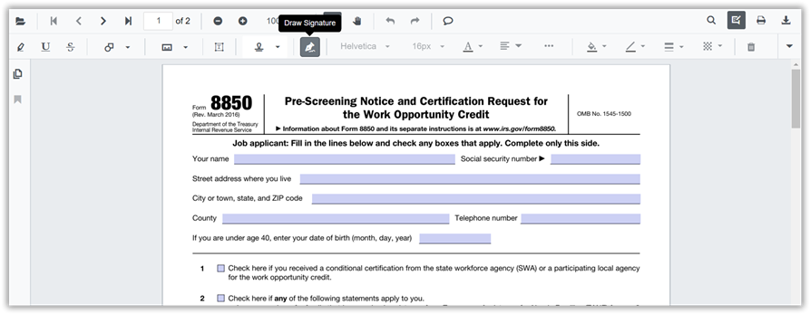
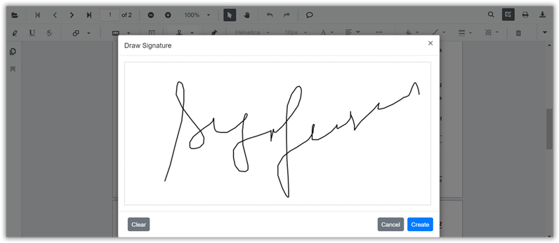

N> Syncfusion recommends using [Blazor PDF Viewer (NextGen)](https://blazor.syncfusion.com/documentation/pdfviewer-2/getting-started/server-side-application) Component which provides fast rendering of pages and improved performance. Also, there is no need of external Web service for processing the files and ease out the deployment complexity. It can be used in Blazor Server, WASM and MAUI applications without any changes.

# Handwritten Signature in Blazor PDF Viewer Component

The PDF Viewer control supports adding handwritten signatures to a PDF document. The handwritten signature reduces the paper work of reviewing the content and verifies it digitally.

## Adding a handwritten signature to the PDF document

The handwritten signature can be added to the PDF document using the annotation toolbar.

* Click the **Edit Annotation** button in the PDF Viewer toolbar. A toolbar appears below it.
* Select the **HandWritten Signature** button in the annotation toolbar. The signature panel will appear.

* Draw the signature in the signature panel.

* Then click **Create** button and move the signature using the mouse and place them in the desired location.

## Editing the properties of handwritten signature

The stroke color, border thickness, and opacity of the handwritten signature can be edited using the edit stroke color tool, edit thickness tool, and edit opacity tool in the annotation toolbar.

N> You can refer to the [Blazor PDF Viewer](https://www.syncfusion.com/blazor-components/blazor-pdf-viewer) feature tour page for its groundbreaking feature representations. You can also explore the [Blazor PDF Viewer example](https://blazor.syncfusion.com/demos/pdf-viewer/default-functionalities?theme=bootstrap4) to understand how to explain core features of PDF Viewer.