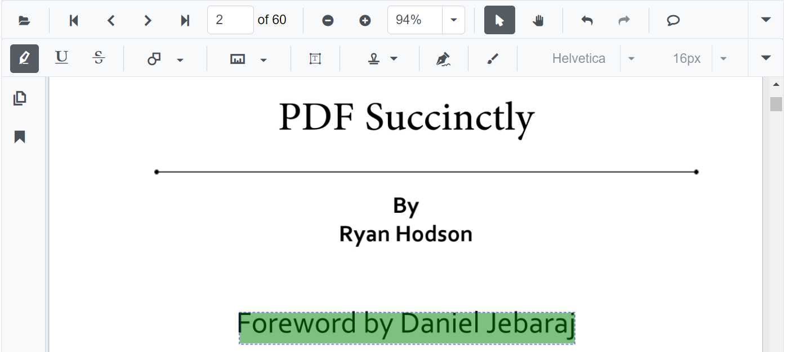

# Change the highlight color of the text in Blazor PDF Viewer Component

You can change the highlight color of the selected annotation using the `Color` property of the [PdfViewerHighlightSettings](https://help.syncfusion.com/cr/blazor/Syncfusion.Blazor.PdfViewer.PdfViewerHighlightSettings.html) class.

The following code illustrates how to change the highlight color of the text.

```cshtml
@using Syncfusion.Blazor.Buttons
@using Syncfusion.Blazor.PdfViewer

<!--Render simple PDF Viewer with customized highlight options-->
<SfPdfViewer @ref="PDFViewer" 
             DocumentPath="@DocumentPath" 
             ServiceUrl="https://ej2services.syncfusion.com/production/web-services/api/pdfviewer">
    <PdfViewerHighlightSettings Color="@highlightColor"></PdfViewerHighlightSettings>
</SfPdfViewer>

@code{
    SfPdfViewer PDFViewer;

    //Sets the PDF document path for initial loading.
    private string DocumentPath { get; set; } = "PDF_Succinctly.pdf";

    //Defines the color for text markup annotations like highlight.
    private string highlightColor = "Green";

}
```


N> [View sample in GitHub](https://github.com/SyncfusionExamples/blazor-pdf-viewer-classic-examples/tree/master/Annotations/Text%20Markup/Customize%20highlight%20annotation).
