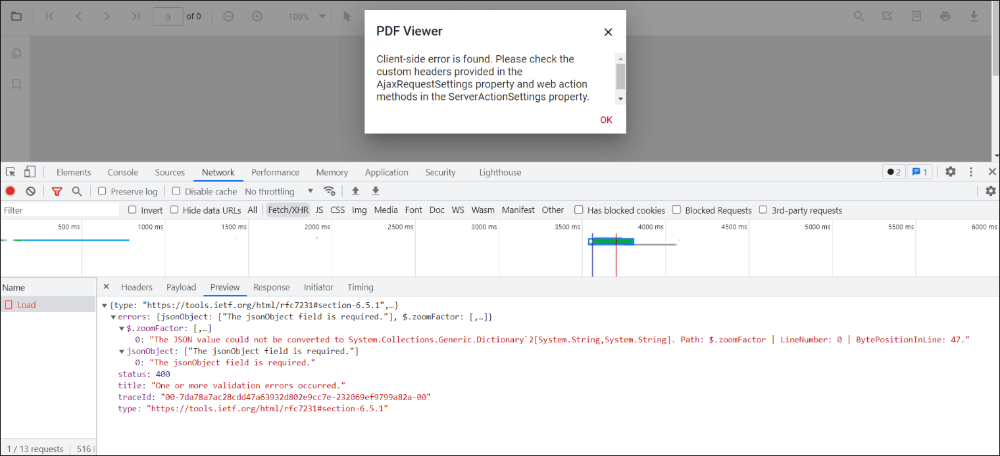

# Resolve the “Client-side error…” issue in .Net 6.0

Issue: “Client-side error is found. Check the custom headers provided in the AjaxRequestSettings property and web action methods in the ServerActionSettings” issue in .Net 6.0 which uses System.Text.Json for serialization instead of Newtonsoft.Json

Earlier versions of .Net support non-string values for string values during serialization using Newtonsoft.Json. However, .Net 6.0 uses System.Text.Json for serialization and System.Text.Json doesn't support non-string values for string values during serialization and it throws the error like below.



Hence, we have to do the below non-string value to string value conversion. Find the changes for resolving the issue from the following sample code snippet.

```csharp

1)

public IActionResult Load([FromBody] jsonObjects response)

        {

            PdfRenderer pdfviewer = new PdfRenderer(_cache);

            MemoryStream stream = new MemoryStream();

            var jsonObject = JsonConverterstring(response)

2)

public Dictionary<string, string> JsonConverterstring(jsonObjects results)

        {

            Dictionary<string, object> resultObjects = new Dictionary<string, object>();

            resultObjects = results.GetType().GetProperties(BindingFlags.Instance | BindingFlags.Public)

                .ToDictionary(prop => prop.Name, prop => prop.GetValue(results, null));

            var emptyObjects = (from kv in resultObjects

                                where kv.Value != null

                                select kv).ToDictionary(kv => kv.Key, kv => kv.Value);

            Dictionary<string, string> jsonResult = emptyObjects.ToDictionary(k => k.Key, k => k.Value.ToString());

            return jsonResult;

        }

3) public class jsonObjects

    {

        public string document { internal get; set; }

        public string password { internal get; set; }

        public int zoomFactor { internal get; set; }

        public bool isFileName { internal get; set; }

        public int xCoordinate { internal get; set; }

        public int yCoordinate { internal get; set; }

        public int pageNumber { internal get; set; }

        public int tilexcount { internal get; set; }

        public int tileycount { internal get; set; }

        public string extratext { internal get; set; }

        public string documentId { internal get; set; }

        public string hashId { internal get; set; }

```

[Sample](https://www.syncfusion.com/downloads/support/directtrac/general/ze/WebService_6.0_-_fixed-203064907.zip)