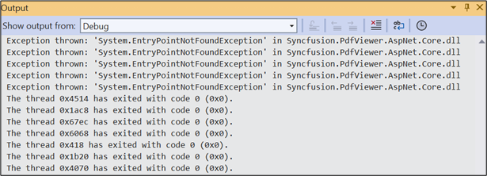

# Resolve System.EntryPointNotFound exception in Blazor PdfViewer

From the release of version **21.1.0.35 (2023 Volume 1)** of Essential Studio®, the Pdfium package has been upgraded to improve various functionalities like text search, text selection, rendering, and even performance. If you are updating your project to this version of the Syncfusion PDF Viewer, you may encounter the **“System.EntryPointNotFoundException”** error in the output window. Moreover, the spinner keeps spinning without loading any document on server projects. This is typically caused by an old version of the pdfium assembly being referenced in the local web service project. Below are the assemblies to be referred to in the respective operating systems.

* Windows – pdfium.dll
* Linux – libpdfium.so
* OSX – libpdfium.dylib

## To solve this issue, you should follow the below steps:

1. Clear the bin and obj files of the web-service project.
2. Re-publish the web-service project.

N> **Note:** If you are hosting your application in Azure, AWS, or in Linux environments, delete the older published files and republish the application.