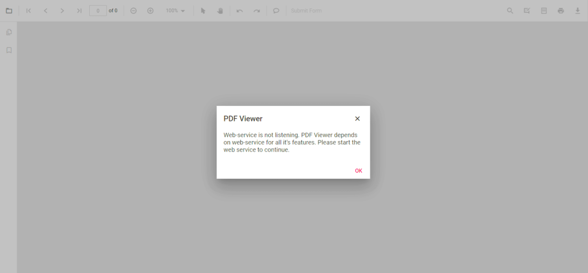
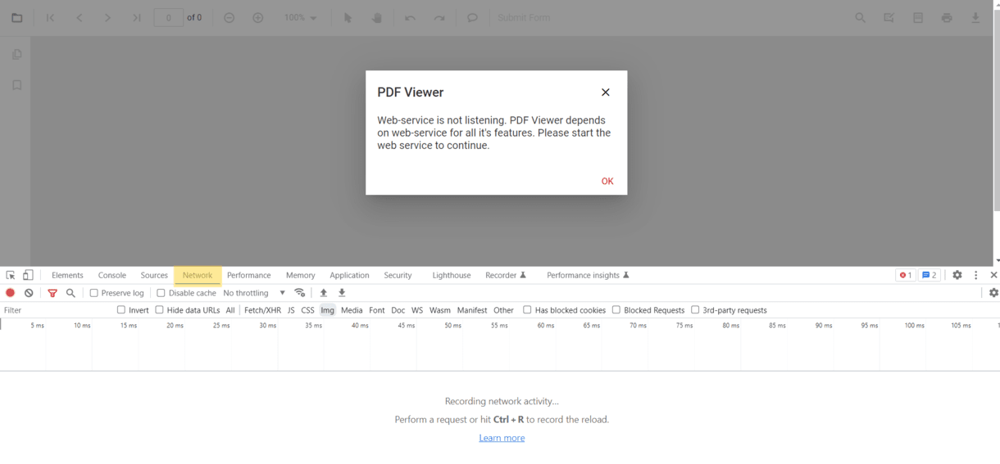

# How to clear the "Web-service is not listening" to error

If you are facing a **Web-service is not listening** to error in the Syncfusion&reg; PDF Viewer, there could be several reasons for this. To troubleshoot the issue, you can use the Network tab in your browser's developer tools to gather more information. Here are the steps you can follow:

**Step 1:** Open the browser's developer tools by right-clicking on the page and selecting `Inspect` from the dropdown menu. Then Navigate to the `Network` tab. This will show you all of the requests that are being made by the page.

**Step 2:** Try to request the web service. If the service is not listening, the request will fail, and you should see an error message in the Network tab. Click on the failing request to see the details of the error, such as the error message or stack trace. This can help you identify the root cause of the issue. Check the server logs for any errors or warnings that may indicate the cause of the issue and help you to troubleshoot the problem.

**Step 3:** Check the request URL and parameters to see if they are correct. If there is a type or an incorrect parameter, the web service may be unable to process the request.

By following these steps and using the Network tab in your browser's developer tools, you can gather more information about the issue and troubleshoot the problem more effectively.

N> Make sure you are connected to the internet and that your connection is stable. You can try accessing other websites or services to see if they are working, and make sure the URL you are using to access the web service is correct and properly formatted.

## Here are some common exceptions

* File not found.
* Document cache not found.
* Document pointer does not exist in the cache.

## File not found

If you are encountering an error message stating that the web service is not listening due to a file not being found in the Syncfusion&reg; PDF viewer, you can try the following steps to resolve the issue:

### Check the file path

Ensure that the file path you use to access the PDF file is correct and that the file exists in that location. You will need to update the file path if the file does not exist.

## Document cache not found

The `Document cache not found` exception in Syncfusion&reg; PDF Viewer typically occurs when the cache used to store the rendered pages of a PDF document is not found or has been deleted. This can happen if the cache directory is changed or deleted or if the application is running in a different environment than it was previously.

### Check for multiple instances

It's possible that you have multiple instances of the Syncfusion&reg; PDF Viewer running simultaneously, which can cause issues with the document cache. To check for this, open the Task Manager on your computer and look for any instances of the Syncfusion&reg; PDF Viewer running. If you find multiple instances, try closing them all and reopening the viewer.

We can use Redis cache and distributive cache for this issue.

### Check your network connection

Ensure that your network connection is stable and strong enough to support the web service you are trying to use. Sometimes, simply restarting the web service can resolve the issue. Try stopping and starting the service again to see if it resolves the problem.

## The document pointer does not exist in the cache.

The `Document pointer does not exist in the cache` exception in the Syncfusion&reg; PDF Viewer usually occurs when there is an issue with loading or caching the PDF document. This error can be caused by a variety of reasons, including:

To clear this error in the Syncfusion&reg; PDF Viewer, you can try the following steps:

**Step 1:** Clearing the cache may help resolve the issue. To clear the cache, navigate to the cache location, which can be found in the Syncfusion&reg; PDF Viewer's settings or configuration files. Once you locate the cache folder, delete its contents.

**Step 2:** Try reloading the document to ensure it is loaded correctly. You can do this by calling the controller's Load() method. Ensure the document is not already loaded before attempting to load it again.

**Step 3:** Restart the application. If clearing the cache does not work, you can try restarting the PDF Viewer application. This will reload all the necessary components and may resolve the error.

## Internal server error

Server-side exceptions happen for various use cases. We can't just define them if they are document-specific, provide the document, or you may need to contact Syncfusion&reg; support for further assistance.