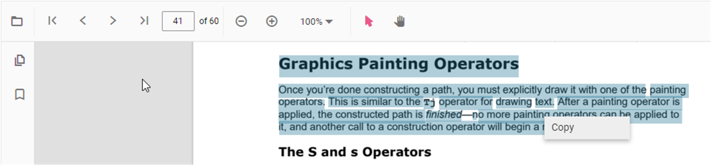
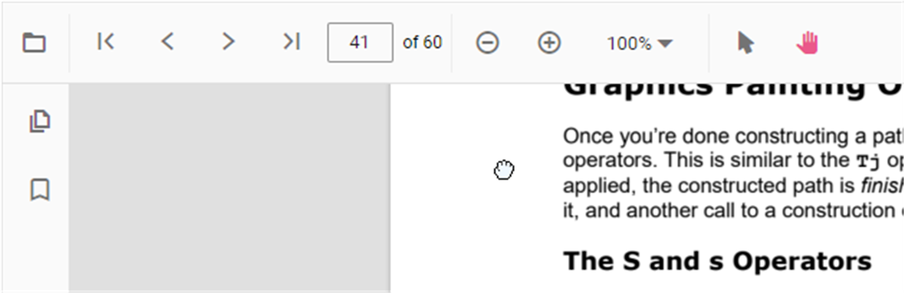

# Interaction Mode

The PDF Viewer provides interaction mode for easy interaction with the loaded PDF document.  Selection mode and panning mode are the two interactions modes.

## Selection mode

In this mode, the text selection can be performed in the PDF document loaded in PDF Viewer. The panning and scrolling of the pages by touch cannot be performed in this mode. It allows users to select and copy text from the PDF files. This is helpful for copying and sharing text content. You can enable/disable the text selection using the following code snippet.

```html
    <div style="width:100%;height:600px">
        <EjsPdfViewer id="pdfviewer" documentPath="PDF_Succinctly.pdf" enableTextSelection="true"
         serviceUrl="https://ej2services.syncfusion.com/production/web-services/api/pdfviewer" style="height: 640px;width: 100%" />
    </div>
    @functions{
    }
```



## Panning Mode

In this mode, the panning and scrolling of the pages by touch can be performed in the PDF document loaded in the PDF Viewer, but the text selection cannot be performed.



You can switch the interaction mode of PDF Viewer by using the following code snippet.,

```html
    <div style="width:100%;height:600px">
        <EjsPdfViewer id="pdfviewer" documentPath="PDF_Succinctly.pdf" enableTextSelection="false" interactionMode="@Syncfusion.EJ2.RazorComponents.PdfViewer.InteractionMode.Pan"
         serviceUrl="https://ej2services.syncfusion.com/production/web-services/api/pdfviewer" style="height: 640px;width: 100%" />
    </div>
    @functions{
    }
```

## See also

* [Toolbar items](./toolbar)
* [Feature Modules](./feature-module)