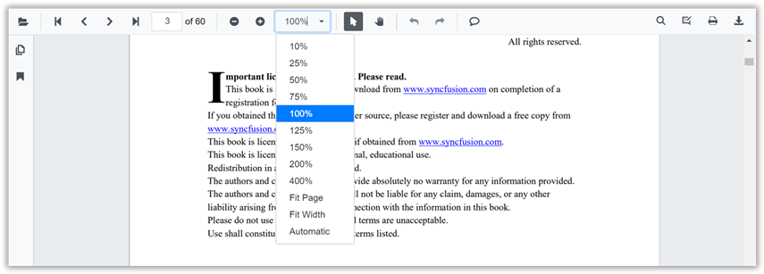

# Magnification in Blazor PDF Viewer Component

The built-in toolbar of PDF Viewer contains the following zooming options:

* **Zoom** **In**: Increases the zoom value (document magnification) from the current value by preset levels.
* **Zoom** **Out**: Decreases the zoom value from the current value by preset levels.
* **Zoom** **To**: Magnifies the pages to the specified zoom value.
* **Fit** **Page**: Fits the page entirely in the available document view port size.
* **Fit** **Width**: Fits the page to the width of the view port size.



You can enable or disable the magnification option in PDF Viewer default toolbar by setting the `EnableMagnification` property.

```cshtml
@using Syncfusion.Blazor.PdfViewerServer

<SfPdfViewerServer Width="1060px" Height="500px" DocumentPath="@DocumentPath" EnableMagnification="true"/>

@code{
    public string DocumentPath { get; set; } = "wwwroot/data/PDF_Succinctly.pdf";
}
```

Also, you can programmatically perform zooming operations as follows.

```cshtml
@using Syncfusion.Blazor.PdfViewerServer
@using Syncfusion.Blazor.Buttons
@using Syncfusion.Blazor.Inputs

<div style="display:inline-block">
    <SfButton OnClick="OnZoomInClick">Zoom In</SfButton>
</div>
<div style="display:inline-block">
    <SfButton OnClick="OnZoomOutClick">Zoom Out</SfButton>
</div>
<div style="display:inline-block">
    <SfTextBox @ref="@TextBox"></SfTextBox>
</div>
<div style="display:inline-block">
    <SfButton OnClick="OnZoomClick">Zoom</SfButton>
</div>
<div style="display:inline-block;">
    <SfButton OnClick="OnFitPageClick">Fit To Page</SfButton>
</div>
<div style="display:inline-block">
    <SfButton OnClick="OnFitWidthClick">Fit To Width</SfButton>
</div>

<SfPdfViewerServer Width="1060px" Height="500px" DocumentPath="@DocumentPath" @ref="@Viewer" />

@code{
    SfPdfViewerServer Viewer;
    SfTextBox TextBox;
    public string DocumentPath { get; set; } = "wwwroot/data/PDF_Succinctly.pdf";

    public void OnZoomInClick(MouseEventArgs args)
    {
        Viewer.ZoomIn();
    }

    public void OnZoomOutClick(MouseEventArgs args)
    {
        Viewer.ZoomOut();
    }

    public void OnFitPageClick(MouseEventArgs args)
    {
        Viewer.FitToPage();
    }

    public void OnZoomClick(MouseEventArgs args)
    {
        double zoomValue =  double.Parse(TextBox.Value.ToString());
        Viewer.ZoomTo(zoomValue);
    }

    public void OnFitWidthClick(MouseEventArgs args)
    {
        Viewer.FitToWidth();
    }
}
```

> PDF Viewer can support zoom value ranges from 50% to 400%.

> You can refer to our [Blazor PDF Viewer](https://www.syncfusion.com/blazor-components/blazor-pdf-viewer) feature tour page for its groundbreaking feature representations. You can also explore the [Blazor PDF Viewer example](https://blazor.syncfusion.com/demos/pdf-viewer/default-functionalities?theme=bootstrap4) to understand how to explain core features of PDF Viewer.