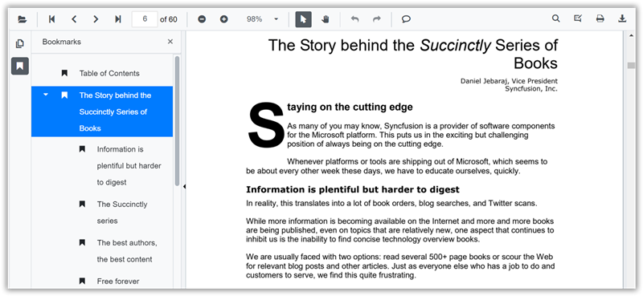

N> Syncfusion recommends using [Blazor PDF Viewer (NextGen)](https://blazor.syncfusion.com/documentation/pdfviewer-2/getting-started/server-side-application) Component which provides fast rendering of pages and improved performance. Also, there is no need of external Web service for processing the files and ease out the deployment complexity. It can be used in Blazor Server, WASM and MAUI applications without any changes.

# Navigation in Blazor PDF Viewer Component

You can navigate between pages in Syncfusion PDF Viewer in the following ways:

* Scroll through the pages.
* Click Go to pages in the built-in toolbar.
* Click the desired bookmark in bookmark pane.
* Click the desired page in thumbnail pane.
* Click hyperlink and table of contents.

## Page navigation

The built-in toolbar of PDF Viewer contains the following page navigation tools:

* **First** **Page**: Navigates you to the first page in the document.
* **Last** **Page**: Navigates you to the last page in the document.
* **Next** **Page**: Scrolls forwards through pages, one page at a time.
* **Go** **To**: Allows you to quickly jump to the desired page number.
* **Previous** **Page**: Scrolls backwards through pages, one page at a time.


You can enable or disable the page navigation option in PDF Viewer default toolbar by setting the `EnableNavigation` property.

```cshtml
@using Syncfusion.Blazor.PdfViewerServer

<SfPdfViewerServer Width="1060px" Height="500px" DocumentPath="@DocumentPath" EnableNavigation="false" />

@code{
    public string DocumentPath { get; set; } = "wwwroot/data/PDF_Succinctly.pdf";
}
```

Also, you can programmatically perform page navigation as follows.

```cshtml
@using Syncfusion.Blazor.PdfViewerServer
@using Syncfusion.Blazor.Buttons
@using Syncfusion.Blazor.Inputs

<div style="display:inline-block">
    <SfButton OnClick="OnFirstPageClick">Go To First Page</SfButton>
</div>
<div style="display:inline-block">
    <SfButton OnClick="OnLastPageClick">Go To Last Page</SfButton>
</div>
<div style="display:inline-block">
    <SfButton OnClick="OnNextPageClick">Go To Next Page</SfButton>
</div>
<div style="display:inline-block">
    <SfTextBox @ref="@TextBox"></SfTextBox>
</div>
<div style="display:inline-block;">
    <SfButton OnClick="OnPageClick">Go To Page</SfButton>
</div>
<div style="display:inline-block">
    <SfButton OnClick="OnPreviousPageClick">Go To Previous Page</SfButton>
</div>

<SfPdfViewerServer Width="1060px" Height="500px" DocumentPath="@DocumentPath" @ref="@Viewer" />

@code{
    SfPdfViewerServer Viewer;
    SfTextBox TextBox;
    public string DocumentPath { get; set; } = "wwwroot/data/PDF_Succinctly.pdf";

    public void OnFirstPageClick(MouseEventArgs args)
    {
        Viewer.GoToFirstPage();
    }

    public void OnLastPageClick(MouseEventArgs args)
    {
        Viewer.GoToLastPage();
    }

    public void OnNextPageClick(MouseEventArgs args)
    {
        Viewer.GoToNextPage();
    }

    public void OnPageClick(MouseEventArgs args)
    {
        double pageIndex =  double.Parse(TextBox.Value.ToString());
        Viewer.GoToPage(pageIndex);
    }

    public void OnPreviousPageClick(MouseEventArgs args)
    {
        Viewer.GoToPreviousPage();
    }
}
```

## Bookmark navigation

The bookmarks saved in PDF files are loaded and listed in the bookmark pane (in the left navigation pane). The users can jump to areas of interest by clicking the desired bookmark easily.



You can enable or disable the bookmark navigation pane by setting the `EnableBookmark` property.

```cshtml
@using Syncfusion.Blazor.PdfViewerServer

<SfPdfViewerServer Width="1060px" Height="500px" DocumentPath="@DocumentPath" EnableBookmarkPanel="true"/>

@code{
    public string DocumentPath { get; set; } = "wwwroot/data/PDF_Succinctly.pdf";
}

```

## Page thumbnail navigation

Page thumbnails is the miniature representation of actual pages in the PDF files. This feature displays thumbnails of the pages and represents a link to the respective pages. Clicking a page thumbnail will display the respective page in the document view.


You can enable or disable the thumbnail navigation pane by setting the `EnableThumbnail` property.

```cshtml
@using Syncfusion.Blazor.PdfViewerServer

<SfPdfViewerServer Width="1060px" Height="500px" DocumentPath="@DocumentPath" EnableThumbnailPanel="true"/>

@code{
    public string DocumentPath { get; set; } = "wwwroot/data/PDF_Succinctly.pdf";
}
```

### Open thumbnail panel programmatically

You can view the thumbnail navigation initially while loading the PDF document in the PDFViewer using the `IsThumbnailPanelOpen` property.

The following code illustrates how to open thumbnail panel programmatically.

```cshtml
@using Syncfusion.Blazor.PdfViewerServer
@using Syncfusion.Blazor.PdfViewer

<!--IsThumbnailPanelOpen property will enable the thumbnail panel on initial rendering itself-->
<SfPdfViewerServer @ref="@PDFViewer" DocumentPath="@DocumentPath" IsThumbnailPanelOpen="true" Height="894px" Width="100%"> </SfPdfViewerServer>

@code{
    public SfPdfViewerServer PDFViewer { get; set; }

    //Sets the PDF document path for initial loading.
    private string DocumentPath { get; set; } = "wwwroot/data/PDF Succinctly.pdf";
}
```

N> [View sample in GitHub](https://github.com/SyncfusionExamples/blazor-pdf-viewer-examples/tree/master/Thumbnail/Show%20Thumbnail%20Panel).

## Hyperlink navigation

Hyperlink navigation features enables navigation to the URLs (website links) in a PDF file.


## Table of content navigation

Table of contents navigation allows users to navigate to different parts of a PDF file that are listed in the table of contents section.


You can enable or disable both hyperlink and table of content navigation by setting the `EnableHyperlink` property.

```cshtml
@using Syncfusion.Blazor.PdfViewerServer

<SfPdfViewerServer Width="1060px" Height="500px" DocumentPath="@DocumentPath" EnableHyperlink="true"/>

@code{
    public string DocumentPath { get; set; } = "wwwroot/data/PDF_Succinctly.pdf";
}
```

You can set the target attribute for a hyperlink in PDF Viewer using the `HyperlinkOpenState` property.

```cshtml
@using Syncfusion.Blazor.PdfViewer
@using Syncfusion.Blazor.PdfViewerServer

<SfPdfViewerServer Width="1060px" Height="500px" DocumentPath="@DocumentPath" EnableHyperlink="true" HyperlinkOpenState="LinkTarget.NewTab"/>

@code{
    public string DocumentPath { get; set; } = "wwwroot/data/PDF_Succinctly.pdf";
}
```

N> You can refer to the [Blazor PDF Viewer](https://www.syncfusion.com/blazor-components/blazor-pdf-viewer) feature tour page for its groundbreaking feature representations. You can also explore the [Blazor PDF Viewer example](https://blazor.syncfusion.com/demos/pdf-viewer/default-functionalities?theme=bootstrap4) to understand how to explain core features of PDF Viewer.