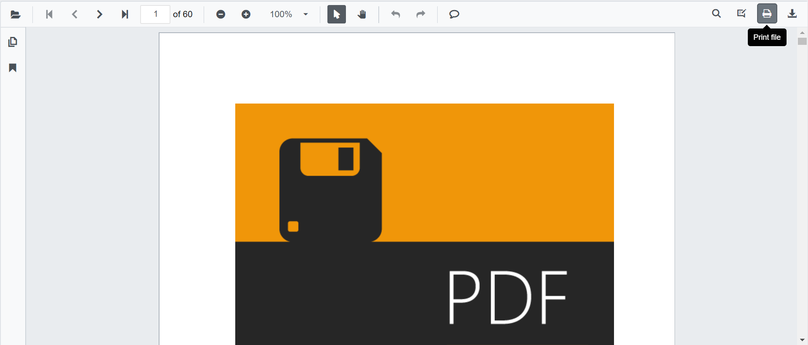

# Print

The PDF Viewer supports printing the loaded PDF file by default. You can enable or disable printing by setting the `EnablePrint` property.

```csharp
@using Syncfusion.Blazor.PdfViewerServer

<SfPdfViewerServer Width="1060px" Height="500px" DocumentPath="@DocumentPath" EnablePrint="true"/>

@code{
    public string DocumentPath { get; set; } = "wwwroot/data/PDF_Succinctly.pdf";
}
```



You can programmatically invoke print action as follows.

```csharp
@using Syncfusion.Blazor.PdfViewerServer
@using Syncfusion.Blazor.Buttons

<SfButton OnClick="OnClick">Print</SfButton>
<SfPdfViewerServer Width="1060px" Height="500px" DocumentPath="@DocumentPath" @ref="@Viewer"/>

@code{
    SfPdfViewerServer Viewer;
    public string DocumentPath { get; set; } = "wwwroot/data/PDF_Succinctly.pdf";
    public void OnClick(MouseEventArgs args)
    {
        Viewer.Print();
    }
}
```