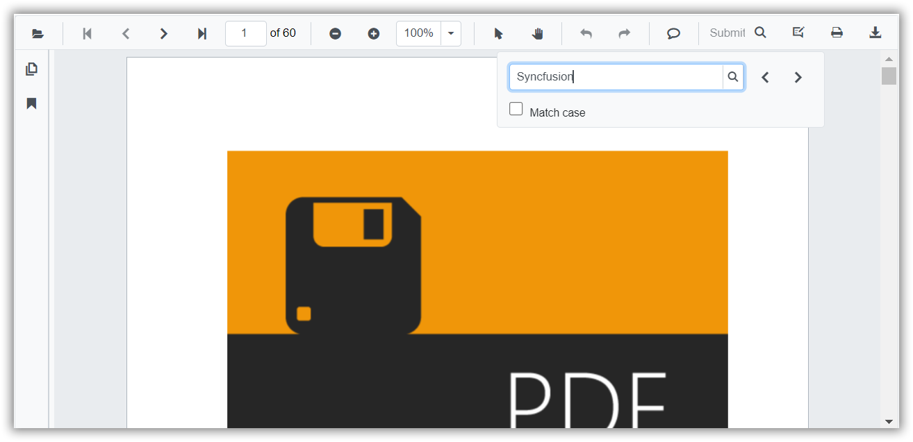

# Text search

You can find the specified text content in the PDF document using the built-in options provided with the toolbar. On initiating the search operation, the control searches for the specified text and highlights all the occurrences in the pages.



You can enable or disable the text search by setting the `EnableTextSearch` API.

```cshtml
@using Syncfusion.Blazor.PdfViewerServer

<SfPdfViewerServer Width="1060px" Height="500px" DocumentPath="@DocumentPath" EnableTextSearch="true"/>

@code{
    public string DocumentPath { get; set; } = "wwwroot/data/PDF_Succinctly.pdf";
}
```

Also, you can programmatically perform search operation as given in the following code example.

```cshtml
@using Syncfusion.Blazor.PdfViewerServer
@using Syncfusion.Blazor.Buttons

<div style="display:inline-block">
    <SfButton OnClick="OnSearchClick">Search Text</SfButton>
</div>
<div style="display:inline-block">
    <SfButton OnClick="OnSearchNext">Search Next</SfButton>
</div>
<div style="display:inline-block">
    <SfButton OnClick="OnSearchPrevious">Search Previous</SfButton>
</div>
<div style="display:inline-block">
    <SfButton OnClick="OnCancelSearch">Cancel Search</SfButton>
</div>

<SfPdfViewerServer Width="1060px" Height="500px" DocumentPath="@DocumentPath" @ref="@Viewer" />

@code{
    SfPdfViewerServer Viewer;
    public string DocumentPath { get; set; } = "wwwroot/data/PDF_Succinctly.pdf";

    public void OnSearchClick(MouseEventArgs args)
    {
        //Here PDF is to be serached from the loaded document
        Viewer.SearchText("pdf", false);
    }

    public void OnSearchNext(MouseEventArgs args)
    {
        Viewer.SearchNext();
    }

    public void OnSearchPrevious(MouseEventArgs args)
    {
        Viewer.SearchPrevious();
    }

    public void OnCancelSearch(MouseEventArgs args)
    {
        Viewer.CancelTextSearch();
    }
}
```