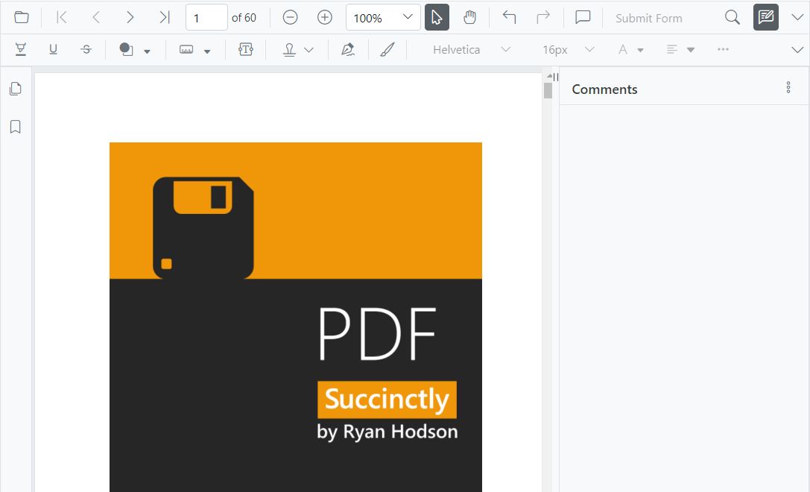
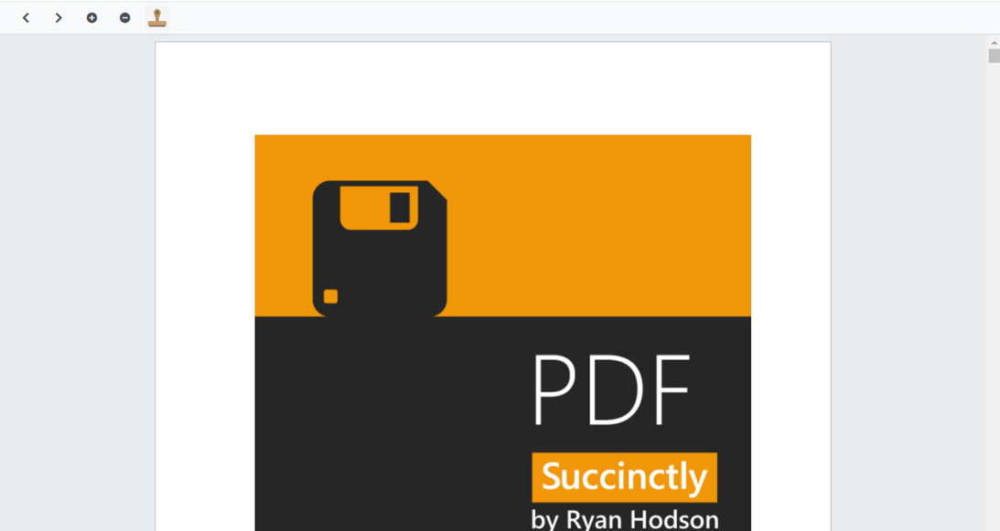

N> Syncfusion recommends using [Blazor PDF Viewer (NextGen)](https://blazor.syncfusion.com/documentation/pdfviewer-2/getting-started/server-side-application) Component which provides fast rendering of pages and improved performance. Also, there is no need of external Web service for processing the files and ease out the deployment complexity. It can be used in Blazor Server, WASM and MAUI applications without any changes.

# Toolbar Customization in Blazor PDF Viewer Component

The PDF Viewer comes with a powerful built-in toolbar with the following important options,
* Open PDF file
* Page navigation
* Magnification
* Pan tool
* Text selection tool
* Text search
* Print
* Download
* Undo and redo
* Various annotation tools
* Bookmark panel
* Thumbnail panel


## Show or hide toolbar

At times, you might need to create your own toolbar. In that case, you need to hide the built-in toolbar. For that customization purpose, the PDF Viewer control provides an option to show or hide the main (top) toolbar either by using the `EnableToolbar` property or `ShowToolbar` method.

The following code snippet explains how to show or hide toolbar using the EnableToolbar property.

```cshtml
@using Syncfusion.Blazor.PdfViewerServer

<SfPdfViewerServer EnableToolbar="false" Width="1060px" Height="500px">
</SfPdfViewerServer>
```

The following code snippet explains how to show or hide toolbar using the ShowToolbar method.

```cshtml
@using Syncfusion.Blazor.Buttons
@using Syncfusion.Blazor.PdfViewerServer

<SfButton @onclick="OnClick">Hide Toolbar</SfButton>
<SfPdfViewerServer Width="1060px" Height="500px" @ref="@pdfViewer" DocumentPath="@DocumentPath">
</SfPdfViewerServer>

@code{

   SfPdfViewerServer pdfViewer;
   public string DocumentPath { get; set; } = "wwwroot/data/PDF_Succinctly.pdf";

    public void OnClick(MouseEventArgs args)
    {
        pdfViewer.ShowToolbar(false);
    }
}
```

N> [View sample in GitHub](https://github.com/SyncfusionExamples/blazor-pdf-viewer-classic-examples/tree/master/Toolbar/Custom%20Toolbar/Custom%20toolbar).

## Show or hide navigation toolbar

Navigation toolbar is the side bar, which contains the options to expand and collapse the bookmark panel and page thumbnail panel. This navigation toolbar visibility can be toggled either by using the `EnableNavigationToolbar` property or `ShowNavigationToolbar` method.

The following code snippet explains how to show or hide navigation toolbar using the EnableNavigationToolbar property.

```cshtml
@using Syncfusion.Blazor.PdfViewerServer

<SfPdfViewerServer EnableNavigationToolbar="false" Width="1060px" Height="500px">
</SfPdfViewerServer>
```

The following code snippet explains how to show or hide navigation toolbar using the ShowNavigationToolbar method.

```cshtml
@using Syncfusion.Blazor.Buttons
@using Syncfusion.Blazor.PdfViewerServer

<SfButton @onclick="OnClick">Hide Navigation Toolbar</SfButton>
<SfPdfViewerServer EnableNavigationToolbar="true" Width="1060px" Height="500px" @ref="@pdfViewer" DocumentPath="@DocumentPath">
</SfPdfViewerServer>

@code{

    SfPdfViewerServer pdfViewer;
    public string DocumentPath { get; set; } = "wwwroot/data/PDF_Succinctly.pdf";

    public void OnClick(MouseEventArgs args)
    {
        pdfViewer.ShowNavigationToolbar(false);
    }
}
```

## Show or hide the toolbar item

You can show or hide the toolbar items using the “PdfViewerToolbarSettings” class. The following code snippet explains how to show only the desired options in the toolbar. The resultant PDF Viewer’s toolbar will have these options - Open file, magnification tools, comment tool, and download option.

```cshtml
@using Syncfusion.Blazor.PdfViewerServer
@using Syncfusion.Blazor.PdfViewer

<SfPdfViewerServer Width="1060px" Height="500px" DocumentPath="@DocumentPath">
    <PdfViewerToolbarSettings ToolbarItems="ToolbarItems"></PdfViewerToolbarSettings>
</SfPdfViewerServer>

@code{

    public string DocumentPath { get; set; } = "wwwroot/data/PDF_Succinctly.pdf";

    List<ToolbarItem> ToolbarItems = new List<ToolbarItem>()
    {
        ToolbarItem.PageNavigationTool,
        ToolbarItem.MagnificationTool,
        ToolbarItem.CommentTool,
        ToolbarItem.SelectionTool,
        ToolbarItem.PanTool,
        ToolbarItem.UndoRedoTool,
        ToolbarItem.CommentTool,
        ToolbarItem.AnnotationEditTool,
        ToolbarItem.SearchOption,
        ToolbarItem.PrintOption,
        ToolbarItem.DownloadOption
    };
}
```

## Show or hide annotation toolbar

Annotation toolbar appears below the main toolbar, which contains the options to edit the annotations. This annotation toolbar visibility can be toggled either by using the `EnableAnnotationToolbar` or `ShowAnnotationToolbar` method.

The following code snippet explains how to show or hide annotation toolbar using the ShowAnnotationToolbar method.

```cshtml
@using Syncfusion.Blazor.PdfViewerServer
@using Syncfusion.Blazor.PdfViewer

<SfPdfViewerServer @ref="viewer" Width="1000" Height="700" DocumentPath="@documentPath">
    <PdfViewerEvents DocumentLoaded="DocumentLoad"></PdfViewerEvents>
</SfPdfViewerServer>

@code{

    private string documentPath { get; set; } = "wwwroot/Data/PDF_Succinctly.pdf";    

    SfPdfViewerServer viewer;

    //Invokes while loading document in the PDFViewer. 
    public void DocumentLoad(LoadEventArgs args)
    {
        //Shows the annotation toolbar on initial loading.
        viewer.ShowAnnotationToolbar(true);
        //Code to hide the annoatation toolbar.
        //viewer.ShowAnnotationToolbar(false);
    }

}
```
N> [View sample in GitHub](https://github.com/SyncfusionExamples/blazor-pdf-viewer-classic-examples/tree/master/Toolbar/Annotation%20Toolbar/Show%20or%20hide%20on%20loading).

N> You can refer to the [Blazor PDF Viewer](https://www.syncfusion.com/blazor-components/blazor-pdf-viewer) feature tour page for its groundbreaking feature representations. You can also explore the [Blazor PDF Viewer example](https://blazor.syncfusion.com/demos/pdf-viewer/default-functionalities?theme=bootstrap4) to understand how to explain core features of PDF Viewer.

## How to create custom Toolbar with Save option

You can create your own Toolbar in PDFViewer by disabling the default toolbar using the EnableNavigationToolbar, EnableAnnotationToolbar, and EnableToolbar properties of PDFViewer class.

The following code represnts how to create custom toolbar with save and some custom options.

```cshtml
@using Syncfusion.Blazor.Navigations
@using Syncfusion.Blazor.PdfViewer
@using Syncfusion.Blazor.PdfViewerServer

<SfToolbar>
    <ToolbarItems>
        <ToolbarItem PrefixIcon="e-pv-previous-page-navigation-icon" TooltipText="Previous Page" id="previousPage" Align=@Syncfusion.Blazor.Navigations.ItemAlign.Left OnClick="@previousClicked"></ToolbarItem>
        <ToolbarItem PrefixIcon="e-pv-next-page-navigation-icon" TooltipText="Next Page" id="nextPage" Align=@Syncfusion.Blazor.Navigations.ItemAlign.Left OnClick="@nextClicked"></ToolbarItem>
        <ToolbarItem PrefixIcon="e-pv-zoom-in-icon" TooltipText="Zoom in" id="zoomIn" OnClick="@zoomInClicked"></ToolbarItem>
        <ToolbarItem PrefixIcon="e-pv-zoom-out-icon" TooltipText="Zoom out" id="zoomOut" OnClick="@zoomoutClicked"></ToolbarItem>
        <ToolbarItem Text="Save" TooltipText="Save Document" id="save" Align=@Syncfusion.Blazor.Navigations.ItemAlign.Right OnClick="@save"></ToolbarItem>
        <ToolbarItem Text="Edit Annotation" TooltipText="Annotation Toolbar" id="annotation" Align=@Syncfusion.Blazor.Navigations.ItemAlign.Right OnClick="@annotations"></ToolbarItem>
        <ToolbarItem PrefixIcon="e-pv-print-document-icon" TooltipText="Print" id="print" Align=@Syncfusion.Blazor.Navigations.ItemAlign.Right OnClick="@print"></ToolbarItem>
        <ToolbarItem PrefixIcon="e-pv-download-document-icon" TooltipText="Download" id="Download" Align=@Syncfusion.Blazor.Navigations.ItemAlign.Right OnClick="@download"></ToolbarItem>
    </ToolbarItems>
</SfToolbar>

<SfPdfViewerServer @ref="PDFViewer" CommentPanelVisible="true" DocumentPath="PDF_Succinctly.pdf" ServiceUrl="https://ej2services.syncfusion.com/production/web-services/api/pdfviewer" EnableNavigationToolbar="false" EnableToolbar="false"  Height="100%" Width="100%"></SfPdfViewerServer>

@code
{
    SfPdfViewerServer PDFViewer;

    public void nextClicked(ClickEventArgs args)
    {
        //Navigate to next page of the PDF document loaded in the PDF Viewer.
        PDFViewer.GoToNextPageAsync();
    }

    public void previousClicked(ClickEventArgs args)
    {
        //Navigate to previous page of the PDF document.
        PDFViewer.GoToPreviousPageAsync();
    }

    MemoryStream stream;
    public async void save(ClickEventArgs args)
    {
       //Gets the loaded PDF document with the changes.
        byte[] data = await PDFViewer.GetDocumentAsync();
        //Save the PDF document to a MemoryStream.
        stream = new MemoryStream(data);
        //Load a PDF document from the MemoryStream.
        await PDFViewer.LoadAsync(stream);
    }

    public void annotations(ClickEventArgs args)
    {
        //Shows or hides the annotation toolbar in the PDF Viewer.
        PDFViewer.ShowAnnotationToolbar(true);
    }

    public void print(ClickEventArgs args)
    {
        //Print the PDF document being loaded in the PDF Viewer.
        PDFViewer.PrintAsync();
    }

    public void download(ClickEventArgs args)
    {
        //Downloads the PDF document being loaded in the PDF Viewer.
        PDFViewer.DownloadAsync();
    }

    public void zoomInClicked(ClickEventArgs args)
    {
        //Scale the page to the next value in the zoom drop down list.
        PDFViewer.ZoomInAsync();
    }

    public void zoomoutClicked(ClickEventArgs args)
    {
        //Magnifies the page to the previous value in the zoom drop down list.
        PDFViewer.ZoomOutAsync();
    }
}

<style>
     .e-pv-previous-page-navigation-icon::before {
        content: '\e70d';
    }
    .e-pv-next-page-navigation-icon::before {
        content: '\e76a';
    }
    
   .e-pv-download-document-icon::before {
        content: '\e75d';
    }
    .e-pv-print-document-icon::before {
        content: '\e743';
    }
      .e-pv-zoom-out-icon::before {
        content: '\e742';
    }
    .e-pv-zoom-in-icon::before {
        content:  '\e755';
    }
    .e-pv-fit-page::before {
        content: '\e91b';
    }
</style>
```


N> [View sample in GitHub](https://github.com/SyncfusionExamples/blazor-pdf-viewer-classic-examples/tree/master/Toolbar/Custom%20Toolbar/Custom%20toolbar%20with%20save%20option).

The following sample mimics all the options of the PDF Viewer default toolbar in a custom toolbar along with the save button.

N> [View sample in GitHub](https://github.com/SyncfusionExamples/blazor-pdf-viewer-classic-examples/tree/master/Toolbar/Custom%20Toolbar/Custom%20toolbar).

## Customize the toolbar icon in Blazor PDF Viewer Component

You can customize the appearance of the toolbar icons by disabling the default toolbar and creating custom toolbar with template. The below code illustrates how to create custom toolbar with custom toolbar icon.

```cshtml
@using Syncfusion.Blazor.Navigations;
@using Syncfusion.Blazor.PdfViewer;
@using Syncfusion.Blazor.PdfViewerServer;

<!--Created custom toolbar with desired set of features such as page navigations, zoom options and stamp button-->
<SfToolbar>
    <ToolbarItems>
        <ToolbarItem PrefixIcon="e-pv-previous-page-navigation-icon" TooltipText="Previous Page" id="previousPage" Align=@Syncfusion.Blazor.Navigations.ItemAlign.Left OnClick="@previousClicked"></ToolbarItem>
        <ToolbarItem PrefixIcon="e-pv-next-page-navigation-icon" TooltipText="Next Page" id="nextPage" Align=@Syncfusion.Blazor.Navigations.ItemAlign.Left OnClick="@nextClicked"></ToolbarItem>
        <ToolbarItem TooltipText="Stamp" id="stamp" OnClick="@stampClicked"> <Template>
         </Template> </ToolbarItem>
    </ToolbarItems>
</SfToolbar>

<!--Rendering PDF Viewer with custom toolbar by disabling the default toolbar-->
<SfPdfViewerServer @ref="PDFViewer" DocumentPath="@DocumentPath" EnableNavigationToolbar="false" EnableAnnotationToolbar="false" EnableToolbar="false" Height="800px" Width="100%">
    <PdfViewerCustomStampSettings CustomStamps="@pdfViewerCustomStamps">
    </PdfViewerCustomStampSettings>
</SfPdfViewerServer>

@code
{
    SfPdfViewerServer PDFViewer;

    //Sets the PDF document path for initial loading.
    public string DocumentPath { get; set; } = "wwwroot/Data/PDF_Succinctly.pdf";
    
    public List<PdfViewerCustomStamp> pdfViewerCustomStamps { get; set; }

    public void nextClicked(ClickEventArgs args)
    {
        //Navigate to next page of the PDF document loaded in the PDF Viewer.
        PDFViewer.GoToNextPageAsync();
    }

    public void stampClicked(ClickEventArgs args)
    {
        pdfViewerCustomStamps = new List<PdfViewerCustomStamp>()
        {
            new PdfViewerCustomStamp()
            {
                //Defines the custom stamp name to be added in stamp menu of the PDF Viewer toolbar.
                CustomStampName = "Stamp",                
            }
        };

    }

    public void previousClicked(ClickEventArgs args)
    {
        //Navigate to previous page of the PDF document.
        PDFViewer.GoToPreviousPageAsync();
    }
}
<style>
    .e-pv-previous-page-navigation-icon::before {
        content: '\e70d';
     }
    .e-pv-next-page-navigation-icon::before {
          content: '\e76a';
      }     
    .e-pv-stamp-icon::before {
        content: '\e74c';
    }
</style>
Footer
```


N> [View sample in GitHub](https://github.com/SyncfusionExamples/blazor-pdf-viewer-classic-examples/tree/master/Toolbar/Custom%20Toolbar/Custom%20toolbar%20with%20PNG%20image).

N> This is applicable only for custom toolbar.