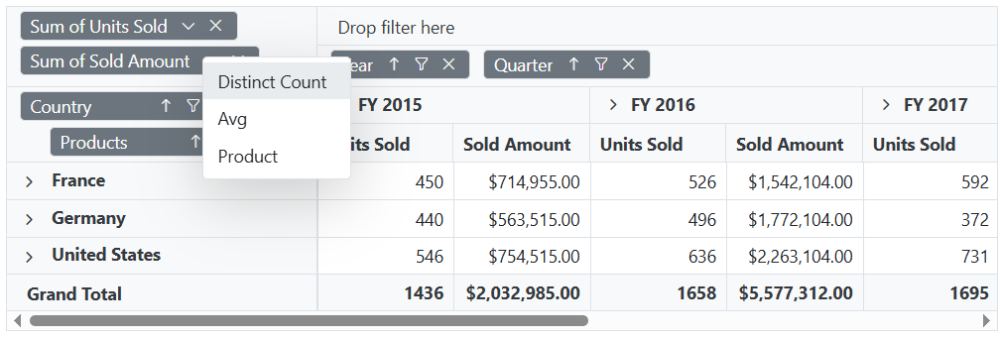

# Aggregation in Blazor Pivot Table Component

N> This feature is applicable only for the relational data source.

End users can perform calculations on groups of values (specifically for value fields placed in the value axis) by using different aggregation types. By default, values are combined by summing them. Additional aggregation types are described below.

N> Numeric fields support all aggregation types listed below, except **CalculatedField**. Fields of type string, date, datetime, boolean, and similar types support only **Count** and **DistinctCount** aggregation.

| Operator | Description |
|------|-------------|
| Sum| Displays the total sum for the selected field values.|
| Product| Displays the product of the selected field values.|
| Count| Displays the number of records for the selected field.|
| DistinctCount| Displays the number of unique records for the selected field.|
| Min| Displays the minimum value for the selected field.|
| Max| Displays the maximum value for the selected field.|
| Avg| Displays the average (mean) of the selected field values.|
| Median| Displays the median value for the selected field.|
| Index| Displays the index value for the selected field data.|
| PopulationStDev| Displays the standard deviation of the population for the selected field.|
| SampleStDev| Displays the sample standard deviation for the selected field.|
| PopulationVar| Displays the variance of the population for the selected field.|
| SampleVar| Displays the sample variance for the selected field.|
| RunningTotals| Displays the running total for the selected field values.|
| DifferenceFrom| Displays the pivot table values with difference from the value of the base item in the base field.|
| PercentageOfDifferenceFrom| Displays the pivot table values with percentage difference from the value of the base item in the base field.|
| PercentageOfGrandTotal| Displays the pivot table values with percentage of grand total of all values.|
| PercentageOfColumnTotal| Displays the pivot table values in each column with percentage of total values for the column.|
| PercentageOfRowTotal| Displays the pivot table values in each row with percentage of total values for the row.|
| PercentageOfParentTotal| Displays the pivot table values with percentage of total of all values based on selected field.|
| PercentageOfParentColumnTotal| Displays the pivot table values with percentage of its parent total in each column.|
| PercentageOfParentRowTotal| Displays the pivot table values with percentage of its parent total in each row.|
| CalculatedField| Displays the pivot table with calculated field values. It allows user to create a new calculated field alone.|

## Assigning aggregation type for value fields through API

For each value field, the aggregation type can be set using the property [Type](https://help.syncfusion.com/cr/blazor/Syncfusion.Blazor.PivotView.PivotFieldOptions.html#Syncfusion_Blazor_PivotView_PivotFieldOptions_Type) in [PivotViewValue](https://help.syncfusion.com/cr/blazor/Syncfusion.Blazor.PivotView.PivotViewValue.html) class. Meanwhile, aggregation types like [SummaryTypes.DifferenceFrom](https://help.syncfusion.com/cr/blazor/Syncfusion.Blazor.PivotView.SummaryTypes.html#Syncfusion_Blazor_PivotView_SummaryTypes_DifferenceFrom) and [SummaryTypes.PercentageOfDifferenceFrom](https://help.syncfusion.com/cr/blazor/Syncfusion.Blazor.PivotView.SummaryTypes.html#Syncfusion_Blazor_PivotView_SummaryTypes_PercentageOfDifferenceFrom) can check for specific field of specific item using [BaseField](https://help.syncfusion.com/cr/blazor/Syncfusion.Blazor.PivotView.PivotFieldOptions.html#Syncfusion_Blazor_PivotView_PivotFieldOptions_BaseField) and [BaseItem](https://help.syncfusion.com/cr/blazor/Syncfusion.Blazor.PivotView.PivotFieldOptions.html#Syncfusion_Blazor_PivotView_PivotFieldOptions_BaseItem) properties. Likewise, [SummaryTypes.PercentageOfParentTotal](https://help.syncfusion.com/cr/blazor/Syncfusion.Blazor.PivotView.SummaryTypes.html#Syncfusion_Blazor_PivotView_SummaryTypes_PercentageOfParentTotal) type can check for specific field using [BaseField](https://help.syncfusion.com/cr/blazor/Syncfusion.Blazor.PivotView.PivotFieldOptions.html#Syncfusion_Blazor_PivotView_PivotFieldOptions_BaseField) property. For instance, the aggregation type [SummaryTypes.DifferenceFrom](https://help.syncfusion.com/cr/blazor/Syncfusion.Blazor.PivotView.SummaryTypes.html#Syncfusion_Blazor_PivotView_SummaryTypes_DifferenceFrom) would intake the specified field and its corresponding member as input and its value is compared across other members in the same field and also across different fields to formulate an appropriate output value.  

* [Type](https://help.syncfusion.com/cr/blazor/Syncfusion.Blazor.PivotView.PivotFieldOptions.html#Syncfusion_Blazor_PivotView_PivotFieldOptions_Type): It allows to set the aggregate type of the field.
* [BaseField](https://help.syncfusion.com/cr/blazor/Syncfusion.Blazor.PivotView.PivotFieldOptions.html#Syncfusion_Blazor_PivotView_PivotFieldOptions_BaseField): It allows to set the specific field to aggregate the values.
* [BaseItem](https://help.syncfusion.com/cr/blazor/Syncfusion.Blazor.PivotView.PivotFieldOptions.html#Syncfusion_Blazor_PivotView_PivotFieldOptions_BaseItem): It allows to set the specific member to aggregate the values.

```cshtml
@using Syncfusion.Blazor.PivotView

<SfPivotView TValue="ProductDetails">
     <PivotViewDataSourceSettings DataSource="@data">
        <PivotViewColumns>
            <PivotViewColumn Name="Year"></PivotViewColumn>
            <PivotViewColumn Name="Quarter"></PivotViewColumn>
        </PivotViewColumns>
        <PivotViewRows>
            <PivotViewRow Name="Country"></PivotViewRow>
            <PivotViewRow Name="Products"></PivotViewRow>
        </PivotViewRows>
        <PivotViewValues>
            <PivotViewValue Name="Sold" Caption="Unit Sold" Type="SummaryTypes.DifferenceFrom" BaseField="Country" BaseItem="France"></PivotViewValue>
            <PivotViewValue Name="Amount" Caption="Sold Amount" Type=SummaryTypes.Min></PivotViewValue>
        </PivotViewValues>
        <PivotViewFormatSettings>
            <PivotViewFormatSetting Name="Amount" Format="C"></PivotViewFormatSetting>
        </PivotViewFormatSettings>
    </PivotViewDataSourceSettings>
</SfPivotView>

@code{
    public List<ProductDetails> data { get; set; }
    protected override void OnInitialized()
    {
        this.data = ProductDetails.GetProductData().ToList();
        //Bind the data source collection here. Refer "Assigning sample data to the pivot table" section in getting started for more details.
    }
}

```


N> By default, the aggregation will be considered as [SummaryTypes.Sum](https://help.syncfusion.com/cr/blazor/Syncfusion.Blazor.PivotView.SummaryTypes.html#Syncfusion_Blazor_PivotView_SummaryTypes_Sum) to the value fields which had number type and for the value fields which had non-number type values such as string, date, datetime, boolean, etc., the aggregation type will be considered as [SummaryTypes.Count](https://help.syncfusion.com/cr/blazor/Syncfusion.Blazor.PivotView.SummaryTypes.html#Syncfusion_Blazor_PivotView_SummaryTypes_Count).

## Show desired aggregation types in its dropdown menu

By default, the dropdown menu for value fields includes all available aggregation types. However, you can customize this menu to display only specific aggregation types relevant to your application using the [AggregateTypes](https://help.syncfusion.com/cr/blazor/Syncfusion.Blazor.PivotView.SfPivotView-1.html#Syncfusion_Blazor_PivotView_SfPivotView_1_AggregateTypes) property. This allows you to tailor the user experience by limiting the options to those that best fit your use case.

The following code demonstrates how to configure the pivot table component to display only the **DistinctCount**, **Average**, and **Product** aggregation types in the dropdown menu.

```cshtml
@using Syncfusion.Blazor.PivotView

<SfPivotView TValue="ProductDetails" ShowGroupingBar="true" AggregateTypes="@aggregateType">
     <PivotViewDataSourceSettings DataSource="@dataSource">
        <PivotViewColumns>
            <PivotViewColumn Name="Year"></PivotViewColumn>
            <PivotViewColumn Name="Quarter"></PivotViewColumn>
        </PivotViewColumns>
        <PivotViewRows>
            <PivotViewRow Name="Country"></PivotViewRow>
            <PivotViewRow Name="Products"></PivotViewRow>
        </PivotViewRows>
        <PivotViewValues>
            <PivotViewValue Name="Sold" Caption="Units Sold"></PivotViewValue>
            <PivotViewValue Name="Amount" Caption="Sold Amount"></PivotViewValue>
        </PivotViewValues>
        <PivotViewFormatSettings>
            <PivotViewFormatSetting Name="Amount" Format="C"></PivotViewFormatSetting>
        </PivotViewFormatSettings>
    </PivotViewDataSourceSettings>
</SfPivotView>

@code{
    public List<AggregateTypes> aggregateType = new List<AggregateTypes> {
        AggregateTypes.DistinctCount,
        AggregateTypes.Avg,
        AggregateTypes.Product
    };
    public List<ProductDetails> dataSource { get; set; }
    protected override void OnInitialized()
    {
        this.dataSource = ProductDetails.GetProductData().ToList();
        //Bind the data source collection here. Refer "Assigning sample data to the pivot table" section in getting started for more details.
    }
}

```



## Modifying aggregation type for value fields at runtime

You can dynamically modify the aggregation type for value fields in the Pivot Table component through the UI at runtime. Value fields, displayed in the grouping bar and field list, include a dropdown icon that allows you to select from various aggregation types (e.g., **Sum**, **Average**, **Count**). Once you select a new aggregation type, the pivot table updates instantly to reflect the change, providing a seamless experience for data analysis.

<!-- markdownlint-disable MD012 -->

<br/>


## Hiding aggregation type from button text

By default, each field in the value axis is displayed with its name and aggregation type (e.g., "Sum of Units Sold"). To display only the field name (e.g., "Units Sold") and hide the aggregation type, set the [ShowAggregationOnValueField](https://help.syncfusion.com/cr/blazor/Syncfusion.Blazor.PivotView.PivotViewDataSourceSettings-1.html#Syncfusion_Blazor_PivotView_PivotViewDataSourceSettings_1_ShowAggregationOnValueField) property in [PivotViewDataSourceSettings](https://help.syncfusion.com/cr/blazor/Syncfusion.Blazor.PivotView.PivotViewDataSourceSettings-1.html) class to **false**.

This customization enhances the clarity of the pivot table’s interface by simplifying the button text, making it more concise and user-friendly.

```cshtml
@using Syncfusion.Blazor.PivotView

<SfPivotView TValue="ProductDetails" ShowGroupingBar="true" ShowFieldList="true">
     <PivotViewDataSourceSettings DataSource="@data" ShowAggregationOnValueField="false">
        <PivotViewColumns>
            <PivotViewColumn Name="Year"></PivotViewColumn>
            <PivotViewColumn Name="Quarter"></PivotViewColumn>
        </PivotViewColumns>
        <PivotViewRows>
            <PivotViewRow Name="Country"></PivotViewRow>
            <PivotViewRow Name="Products"></PivotViewRow>
        </PivotViewRows>
        <PivotViewValues>
            <PivotViewValue Name="Sold" Caption="Unit Sold"></PivotViewValue>
            <PivotViewValue Name="Amount" Caption="Sold Amount"></PivotViewValue>
        </PivotViewValues>
        <PivotViewFormatSettings>
            <PivotViewFormatSetting Name="Amount" Format="C"></PivotViewFormatSetting>
        </PivotViewFormatSettings>
    </PivotViewDataSourceSettings>
</SfPivotView>

@code{
    public List<ProductDetails> data { get; set; }
    protected override void OnInitialized()
    {
        this.data = ProductDetails.GetProductData().ToList();
        //Bind the data source collection here. Refer "Assigning sample data to the pivot table" section in getting started for more details.
    }
}

```


<br/>


## Hiding aggregation type icon from UI

By default, the dropdown icon to change the aggregation type is visible in the grouping bar. To hide this icon, set the [ShowValueTypeIcon](https://help.syncfusion.com/cr/blazor/Syncfusion.Blazor.PivotView.PivotViewGroupingBarSettings.html#Syncfusion_Blazor_PivotView_PivotViewGroupingBarSettings_ShowValueTypeIcon) property within [PivotViewGroupingBarSettings](https://help.syncfusion.com/cr/blazor/Syncfusion.Blazor.PivotView.PivotViewGroupingBarSettings.html) class to **false**.

N> The aggregation type icon can only be hidden in the Grouping Bar, not in the Field List.

```cshtml
@using Syncfusion.Blazor.PivotView

<SfPivotView TValue="ProductDetails" ShowGroupingBar="true">
    <PivotViewDataSourceSettings DataSource="@data">
        <PivotViewColumns>
            <PivotViewColumn Name="Year"></PivotViewColumn>
            <PivotViewColumn Name="Quarter"></PivotViewColumn>
        </PivotViewColumns>
        <PivotViewRows>
            <PivotViewRow Name="Country"></PivotViewRow>
            <PivotViewRow Name="Products"></PivotViewRow>
        </PivotViewRows>
        <PivotViewValues>
            <PivotViewValue Name="Sold" Caption="Unit Sold"></PivotViewValue>
            <PivotViewValue Name="Amount" Caption="Sold Amount"></PivotViewValue>
        </PivotViewValues>
        <PivotViewFormatSettings>
            <PivotViewFormatSetting Name="Amount" Format="C"></PivotViewFormatSetting>
        </PivotViewFormatSettings>
    </PivotViewDataSourceSettings>
    <PivotViewGroupingBarSettings ShowValueTypeIcon="false"></PivotViewGroupingBarSettings>
</SfPivotView>

@code{
    public List<ProductDetails> data { get; set; }
    protected override void OnInitialized()
    {
        this.data = ProductDetails.GetProductData().ToList();
        //Bind the data source collection here. Refer "Assigning sample data to the pivot table" section in getting started for more details.
    }
}
```


## Events

### OnActionBegin

The event [OnActionBegin](https://help.syncfusion.com/cr/blazor/Syncfusion.Blazor.PivotView.PivotViewEvents-1.html#Syncfusion_Blazor_PivotView_PivotViewEvents_1_OnActionBegin) triggers when clicking and selecting the aggregate type via the dropdown icon in the value field button, which is present in both grouping bar and field list UI. This allows the user to identify the current action being performed at runtime. It has the following parameters:

* [DataSourceSettings](https://help.syncfusion.com/cr/blazor/Syncfusion.Blazor.PivotView.PivotActionBeginEventArgs.html#Syncfusion_Blazor_PivotView_PivotActionBeginEventArgs_DataSourceSettings): Contains the current data source settings such as input data source, rows, columns, values, filters, format settings and more.

* [ActionName](https://help.syncfusion.com/cr/blazor/Syncfusion.Blazor.PivotView.PivotActionBeginEventArgs.html#Syncfusion_Blazor_PivotView_PivotActionBeginEventArgs_ActionName): Provides the name of the current action initiated. For example, when selecting aggregation, the action name is **Aggregate field**.

* [FieldInfo](https://help.syncfusion.com/cr/blazor/Syncfusion.Blazor.PivotView.PivotActionBeginEventArgs.html#Syncfusion_Blazor_PivotView_PivotActionBeginEventArgs_FieldInfo): Contains information regarding the selected value field.

N> This option applies only to actions performed through the field-based UI, such as filtering, sorting, removing a field from the grouping bar, editing, and changing the aggregation type.

* [Cancel](https://help.syncfusion.com/cr/blazor/Syncfusion.Blazor.PivotView.PivotActionBeginEventArgs.html#Syncfusion_Blazor_PivotView_PivotActionBeginEventArgs_Cancel): Allows restricting the current action.

In the following example, an action taken during aggregation type selection via the dropdown icon can be prevented by setting the **args.Cancel** option to **true** in the `OnActionBegin` event.

```cshtml
@using Syncfusion.Blazor.PivotView

<SfPivotView TValue="ProductDetails" ShowFieldList="true" ShowGroupingBar="true">
     <PivotViewDataSourceSettings DataSource="@data">
        <PivotViewColumns>
            <PivotViewColumn Name="Year"></PivotViewColumn>
            <PivotViewColumn Name="Quarter"></PivotViewColumn>
        </PivotViewColumns>
        <PivotViewRows>
            <PivotViewRow Name="Country"></PivotViewRow>
            <PivotViewRow Name="Products"></PivotViewRow>
        </PivotViewRows>
        <PivotViewValues>
            <PivotViewValue Name="Sold" Caption="Unit Sold"></PivotViewValue>
            <PivotViewValue Name="Amount" Caption="Sold Amount"></PivotViewValue>
        </PivotViewValues>
        <PivotViewFormatSettings>
            <PivotViewFormatSetting Name="Amount" Format="C"></PivotViewFormatSetting>
        </PivotViewFormatSettings>
    </PivotViewDataSourceSettings>
   <PivotViewEvents TValue="ProductDetails" OnActionBegin="ActionBegin"></PivotViewEvents>
</SfPivotView>

@code{
    private List<ProductDetails> data { get; set; }
    protected override void OnInitialized()
    {
        data = ProductDetails.GetProductData().ToList();
        //Bind the data source collection here. Refer "Assigning sample data to the pivot table" section in getting started for more details.
    }
    // Triggers when the UI action begins.
    public void ActionBegin(PivotActionBeginEventArgs args)
    {
        if(args.ActionName == "Aggregate field")
        {
          args.Cancel = true;
        }       
    }
}
```

### OnActionComplete

The [OnActionComplete](https://help.syncfusion.com/cr/blazor/Syncfusion.Blazor.PivotView.PivotViewEvents-1.html#Syncfusion_Blazor_PivotView_PivotViewEvents_1_OnActionComplete) event is triggered when a UI action is completed, such as changing the aggregation type using the dropdown icon in the value field button, available within both the grouping bar and field list user interfaces. This event enables users to identify which UI action has been completed at runtime. The event provides the following parameters:

* [DataSourceSettings](https://help.syncfusion.com/cr/blazor/Syncfusion.Blazor.PivotView.PivotActionCompleteEventArgs-1.html#Syncfusion_Blazor_PivotView_PivotActionCompleteEventArgs_1_DataSourceSettings): The current data source settings, including input data source, rows, columns, values, filters, format settings, and related properties.
* [ActionName](https://help.syncfusion.com/cr/blazor/Syncfusion.Blazor.PivotView.PivotActionCompleteEventArgs-1.html#Syncfusion_Blazor_PivotView_PivotActionCompleteEventArgs_1_ActionName): Specifies the name of the completed action. For example, after changing the aggregation type, the action name will be **Field aggregated**.
* [FieldInfo](https://help.syncfusion.com/cr/blazor/Syncfusion.Blazor.PivotView.PivotActionCompleteEventArgs-1.html#Syncfusion_Blazor_PivotView_PivotActionCompleteEventArgs_1_FieldInfo): Contains information about the selected value field.
* [ActionInfo](https://help.syncfusion.com/cr/blazor/Syncfusion.Blazor.PivotView.PivotActionCompleteEventArgs-1.html#Syncfusion_Blazor_PivotView_PivotActionCompleteEventArgs_1_ActionInfo): Defines the unique information about the current UI action performed.

N> This option is applicable only when field-based UI actions are performed, such as filtering, sorting, removing a field from the grouping bar, editing, and changing the aggregation type.

```cshtml
@using Syncfusion.Blazor.PivotView

<SfPivotView TValue="ProductDetails" ShowFieldList="true" ShowGroupingBar="true">
     <PivotViewDataSourceSettings DataSource="@data">
        <PivotViewColumns>
            <PivotViewColumn Name="Year"></PivotViewColumn>
            <PivotViewColumn Name="Quarter"></PivotViewColumn>
        </PivotViewColumns>
        <PivotViewRows>
            <PivotViewRow Name="Country"></PivotViewRow>
            <PivotViewRow Name="Products"></PivotViewRow>
        </PivotViewRows>
        <PivotViewValues>
            <PivotViewValue Name="Sold" Caption="Unit Sold"></PivotViewValue>
            <PivotViewValue Name="Amount" Caption="Sold Amount"></PivotViewValue>
        </PivotViewValues>
        <PivotViewFormatSettings>
            <PivotViewFormatSetting Name="Amount" Format="C"></PivotViewFormatSetting>
        </PivotViewFormatSettings>
    </PivotViewDataSourceSettings>
   <PivotViewEvents TValue="ProductDetails" OnActionComplete="ActionComplete"></PivotViewEvents>
</SfPivotView>

@code{
    private List<ProductDetails> data { get; set; }
    protected override void OnInitialized()
    {
        data = ProductDetails.GetProductData().ToList();
        //Bind the data source collection here. Refer "Assigning sample data to the pivot table" section in getting started for more details.
    }
    public void ActionComplete(PivotActionCompleteEventArgs<ProductDetails> args)
    {
        if(args.ActionName == "Field aggregated")
        {
          // Triggers when the aggregation type is applied.
        }       
    }
}
```

### OnActionFailure

The [OnActionFailure](https://help.syncfusion.com/cr/blazor/Syncfusion.Blazor.PivotView.PivotViewEvents-1.html#Syncfusion_Blazor_PivotView_PivotViewEvents_1_OnActionFailure) event is triggered when a UI action fails to produce the expected result. This event provides detailed information about the failure through the following parameters:

* [ActionName](https://help.syncfusion.com/cr/blazor/Syncfusion.Blazor.PivotView.PivotActionFailureEventArgs.html#Syncfusion_Blazor_PivotView_PivotActionFailureEventArgs_ActionName): Specifies the name of the failed action. For example, if the failure occurs during aggregation, the action name will be **Aggregate field**.
* [ErrorInfo](https://help.syncfusion.com/cr/blazor/Syncfusion.Blazor.PivotView.PivotActionFailureEventArgs.html#Syncfusion_Blazor_PivotView_PivotActionFailureEventArgs_ErrorInfo): Contains detailed error information related to the failed UI action.

```cshtml
@using Syncfusion.Blazor.PivotView

<SfPivotView TValue="ProductDetails" AllowExcelExport="true" AllowPdfExport="true" Width="100%" ShowToolbar="true" Toolbar="@toolbar" ShowGroupingBar="true" AllowCalculatedField="true"  AllowDrillThrough="true" AllowConditionalFormatting="true" AllowNumberFormatting="true" ShowFieldList="true" Height="350">
     <PivotViewDataSourceSettings DataSource="@data">
        <PivotViewColumns>
            <PivotViewColumn Name="Year"></PivotViewColumn>
            <PivotViewColumn Name="Quarter"></PivotViewColumn>
        </PivotViewColumns>
        <PivotViewRows>
            <PivotViewRow Name="Country"></PivotViewRow>
            <PivotViewRow Name="Products"></PivotViewRow>
        </PivotViewRows>
        <PivotViewValues>
            <PivotViewValue Name="Sold" Caption="Unit Sold"></PivotViewValue>
            <PivotViewValue Name="Amount" Caption="Sold Amount"></PivotViewValue>
        </PivotViewValues>
        <PivotViewFormatSettings>
            <PivotViewFormatSetting Name="Amount" Format="C"></PivotViewFormatSetting>
        </PivotViewFormatSettings>
    </PivotViewDataSourceSettings>
   <PivotViewEvents TValue="ProductDetails" OnActionFailure="ActionFailure"></PivotViewEvents>
</SfPivotView>

@code{
    private List<ProductDetails> data { get; set; }
    private List<Syncfusion.Blazor.PivotView.ToolbarItems> toolbar = new List<Syncfusion.Blazor.PivotView.ToolbarItems> {
        ToolbarItems.New,
        ToolbarItems.Save,
        ToolbarItems.Grid,
        ToolbarItems.Chart,
        ToolbarItems.Export,
        ToolbarItems.SubTotal,
        ToolbarItems.GrandTotal,
        ToolbarItems.ConditionalFormatting,
        ToolbarItems.NumberFormatting,
        ToolbarItems.FieldList            
    };
    protected override void OnInitialized()
    {
        data = ProductDetails.GetProductData().ToList();
        //Bind the data source collection here. Refer "Assigning sample data to the pivot table" section in getting started for more details.
    }
    public void ActionFailure(PivotActionFailureEventArgs args)
    {
        if(args.ActionName == "Aggregate field")
        {
          // Triggers when the current UI action fails to achieve the desired result.
        }       
    }
}
```

N> You can refer to the [Blazor Pivot Table](https://www.syncfusion.com/blazor-components/blazor-pivot-table) feature tour page for its groundbreaking feature representations. You can also explore the [Blazor Pivot Table example](https://blazor.syncfusion.com/demos/pivot-table/default-functionalities?theme=bootstrap5) to know how to render and configure the pivot table.