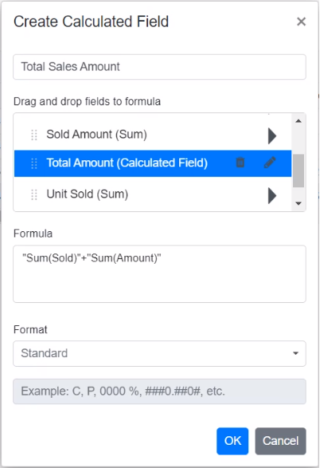

# Calculated Field in Blazor Pivot Table Component

Allows end user to create a new calculated field in the pivot table, based on the available fields from the bound data source or using simple formula with basic arithmetic operators. It can be added at runtime through the built-in dialog, invoked from Field List UI. To do so, set the [AllowCalculatedField](https://help.syncfusion.com/cr/blazor/Syncfusion.Blazor.PivotView.SfPivotView-1.html#Syncfusion_Blazor_PivotView_SfPivotView_1_AllowCalculatedField) property in [SfPivotView](https://help.syncfusion.com/cr/blazor/Syncfusion.Blazor.PivotView.SfPivotView-1.html) class to **true** in the pivot table. End user can now see a "CALCULATED FIELD" button enabled in Field List UI automatically, which on clicking will invoke the calculated field dialog and perform necessary operation.

Calculated field can also be included in the pivot table through code behind using the [PivotViewCalculatedFieldsSettings](https://help.syncfusion.com/cr/blazor/Syncfusion.Blazor.PivotView.PivotViewCalculatedFieldSetting.html) class. The required properties to create a new calculate field are:
* [Name](https://help.syncfusion.com/cr/blazor/Syncfusion.Blazor.PivotView.PivotViewCalculatedFieldSetting.html#Syncfusion_Blazor_PivotView_PivotViewCalculatedFieldSetting_Name): It allows to indicate the calculated field with a unique name.
* [Formula](https://help.syncfusion.com/cr/blazor/Syncfusion.Blazor.PivotView.PivotViewCalculatedFieldSetting.html#Syncfusion_Blazor_PivotView_PivotViewCalculatedFieldSetting_Formula): It allows to set the formula.
* [Format](https://help.syncfusion.com/cr/blazor/Syncfusion.Blazor.PivotView.FormatSettings.html#Syncfusion_Blazor_PivotView_FormatSettings_Format):  It helps to set the number format for the resultant value.

N> The calculated field is applicable only for value fields. By default, the calculated fields created through code-behind are only added to the field list and calculated field dialog UI. To display the calculated field in the pivot table UI, it must be added to the [`PivotViewValues`](https://help.syncfusion.com/cr/blazor/Syncfusion.Blazor.PivotView.PivotViewValue.html) class, as shown in the code below.

```cshtml
@using Syncfusion.Blazor.PivotView

<SfPivotView TValue="ProductDetails" ShowFieldList="true" AllowCalculatedField="true">
     <PivotViewDataSourceSettings DataSource="@data">
        <PivotViewColumns>
            <PivotViewColumn Name="Year"></PivotViewColumn>
            <PivotViewColumn Name="Quarter"></PivotViewColumn>
        </PivotViewColumns>
        <PivotViewRows>
            <PivotViewRow Name="Country"></PivotViewRow>
            <PivotViewRow Name="Products"></PivotViewRow>
        </PivotViewRows>
        <PivotViewValues>
            <PivotViewValue Name="Sold" Caption="Unit Sold"></PivotViewValue>
            <PivotViewValue Name="Amount" Caption="Sold Amount"></PivotViewValue>
            <PivotViewValue Name="Total" Caption="Total Amount" Type=SummaryTypes.CalculatedField></PivotViewValue>
        </PivotViewValues>
        <PivotViewFormatSettings>
            <PivotViewFormatSetting Name="Amount" Format="C"></PivotViewFormatSetting>
            <PivotViewFormatSetting Name="Total" Format="C"></PivotViewFormatSetting>
        </PivotViewFormatSettings>
         <PivotViewCalculatedFieldSettings>
            <PivotViewCalculatedFieldSetting Name="Total" Formula="@totalPrice"></PivotViewCalculatedFieldSetting>
        </PivotViewCalculatedFieldSettings>
    </PivotViewDataSourceSettings>
</SfPivotView>

@code{
    public string totalPrice = "\"" + "Sum(Amount)" + "\"" + "+" + "\"" + "Sum(Sold)" + "\"";
    public List<ProductDetails> data { get; set; }
    protected override void OnInitialized()
    {
        this.data = ProductDetails.GetProductData().ToList();
        //Bind the data source collection here. Refer "Assigning sample data to the pivot table" section in getting started for more details.
    }
}

```


Meanwhile, the user can also view calculated field dialog in UI by invoking [CreateCalculatedFieldDialogAsync](https://help.syncfusion.com/cr/blazor/Syncfusion.Blazor.PivotView.SfPivotView-1.html#Syncfusion_Blazor_PivotView_SfPivotView_1_CreateCalculatedFieldDialog) method on an external button click.

```cshtml
@using Syncfusion.Blazor.PivotView
@using Syncfusion.Blazor.Buttons

<SfButton OnClick="@calc" IsPrimary="true">Calculated Field</SfButton>

<SfPivotView TValue="ProductDetails" @ref="pivot" AllowCalculatedField="true">
     <PivotViewDataSourceSettings DataSource="@data">
        <PivotViewColumns>
            <PivotViewColumn Name="Year"></PivotViewColumn>
            <PivotViewColumn Name="Quarter"></PivotViewColumn>
        </PivotViewColumns>
        <PivotViewRows>
            <PivotViewRow Name="Country"></PivotViewRow>
            <PivotViewRow Name="Products"></PivotViewRow>
        </PivotViewRows>
        <PivotViewValues>
            <PivotViewValue Name="Sold" Caption="Unit Sold"></PivotViewValue>
            <PivotViewValue Name="Amount" Caption="Sold Amount"></PivotViewValue>
        </PivotViewValues>
        <PivotViewFormatSettings>
            <PivotViewFormatSetting Name="Amount" Format="C"></PivotViewFormatSetting>
            <PivotViewFormatSetting Name="Total" Format="C"></PivotViewFormatSetting>
        </PivotViewFormatSettings>
    </PivotViewDataSourceSettings>
</SfPivotView>

@code{
    public SfPivotView<ProductDetails> pivot;
    public List<ProductDetails> data { get; set; }
    protected override void OnInitialized()
    {
        this.data = ProductDetails.GetProductData().ToList();
        //Bind the data source collection here. Refer "Assigning sample data to the pivot table" section in getting started for more details.
    }
    public void calc(Microsoft.AspNetCore.Components.Web.MouseEventArgs args)
    {
        this.pivot.CreateCalculatedFieldDialogAsync();
    }
}

```


## Editing through the field list and the grouping bar

User can also modify the existing calculated field using the built-in edit option available directly in the field list (or) grouping bar. To do so, click the "Edit" icon available in the calculated field button. Now the calculated field dialog is opened and the current calculated field name, formula and format can be changed at runtime.


<br/>
<br/>


## Renaming the existing calculated field

Existing calculated field can be renamed only through the UI at runtime. To do so, open the calculated field dialog, select the target field and click "Edit" icon. User can now see the existing name getting displayed in the text box at the top of the dialog. Now, change the name based on user requirement and click "OK".

<!-- markdownlint-disable MD012 -->

<br/>
<br/>


## Editing the existing calculated field formula

Existing calculated field formula can be edited only through the UI at runtime. To do so, open the calculated field dialog, select the target field and click "Edit" icon. User can now see the existing formula getting displayed in a multiline text box at the bottom of the dialog. Now, change the formula based on user requirement and click "OK".


<br/>
<br/>


## Reusing the existing formula in a new calculate field

While creating a new calculated field, if the user wants to the add the formula of an existing calculated field, it can be done easily. To do so, simply drag-and-drop the existing calculated field to the "Formula" section.


<br/>
<br/>

<br/>
<br/>


## Apply the format to the calculated field values

Values in a new or existing calculated field can be formatted via the calculated field UI or code behind. The [PivotViewFormatSettings](https://help.syncfusion.com/cr/blazor/Syncfusion.Blazor.PivotView.PivotViewFormatSetting.html) property in code-behind can be used to specify the desired format. For more information about the supported formats [refer here](https://blazor.syncfusion.com/documentation/pivot-table/number-formatting).

To apply format to calculated field values at runtime via UI, a built-in dropdown under the "Format" label is available, from which the user can select the pre-defined format options listed below.

* **Standard** - Denotes the numeric type.
* **Currency** - Denotes the currency type.
* **Percentage** - Denotes the percentage type.
* **Custom** - Denotes the custom format. For example: "C2". This shows the value "9584.3" as "$9584.30."
* **None** - Denotes that no format will be applied.

N> By default, **None** will be selected from the dropdown.


In addition, you can specify the desired custom formats by selecting the **Custom** option from the "Format" dropdown.


## Supported operators and functions for the calculated field formula

Below is a list of operators and functions that can be used in the formula to create the calculated fields.

* `+` – addition operator.

```typescript
 Syntax: X + Y
```

* `-` – subtraction operator.

```typescript
Syntax: X - Y
```

* `*` – multiplication operator.

```typescript
Syntax: X * Y
```

* `/` – division operator.

```typescript
Syntax: X / Y
```

* `^` – power operator.

```typescript
Syntax: X^2
```

* `<` - less than operator.

```typescript
Syntax: X < Y
```

* `<=` – less than or equal operator.

```typescript
Syntax: X <= Y
```

* `>` – greater than operator.

```typescript
Syntax: X > Y
```

* `>=` – greater than or equal operator.

```typescript
Syntax: X >= Y
```

* `==` – equal operator.

```typescript
Syntax: X == Y
```

* `!=` – not equal operator.

```typescript
Syntax: X != Y
```

* `|` – OR operator.

```typescript
Syntax: X | Y
```

* `&` – AND operator.

```typescript
Syntax: X & Y
```

* `?` – conditional operator.

```typescript
Syntax: condition ? then : else
```

* `Min` – function that returns the minimum value.

```typescript
Syntax: Min(number1, number2)
```

* `Max` – function that returns the maximum value.

```typescript
Syntax: Max(number1, number2)
```

```cshtml
@using Syncfusion.Blazor.PivotView

<SfPivotView TValue="ProductDetails" ShowFieldList="true" AllowCalculatedField="true">
     <PivotViewDataSourceSettings DataSource="@data">
        <PivotViewColumns>
            <PivotViewColumn Name="Year"></PivotViewColumn>
            <PivotViewColumn Name="Quarter"></PivotViewColumn>
        </PivotViewColumns>
        <PivotViewRows>
            <PivotViewRow Name="Country"></PivotViewRow>
            <PivotViewRow Name="Products"></PivotViewRow>
        </PivotViewRows>
        <PivotViewValues>
            <PivotViewValue Name="Sold" Caption="Unit Sold"></PivotViewValue>
            <PivotViewValue Name="Amount" Caption="Sold Amount"></PivotViewValue>
            <PivotViewValue Name="Total" Caption="Total Amount"></PivotViewValue>
        </PivotViewValues>
        <PivotViewFormatSettings>
            <PivotViewFormatSetting Name="Amount" Format="C"></PivotViewFormatSetting>
            <PivotViewFormatSetting Name="Total" Format="C"></PivotViewFormatSetting>
        </PivotViewFormatSettings>
         <PivotViewCalculatedFieldSettings>
            <PivotViewCalculatedFieldSetting Name="Total" Formula="@totalPrice"></PivotViewCalculatedFieldSetting>
        </PivotViewCalculatedFieldSettings>
    </PivotViewDataSourceSettings>
</SfPivotView>

@code{
    public string totalPrice = "\"" + "Round(" + "\"" + "Sum(Amount)" + "\"" + ") > Abs(" + "\"" + "Sum(Sold)" + "\"" + ") ? Min(" + "\"" + "Sum(Amount)" + "\"" + "," + "\"" + "Sum(Sold)" + "\"" + ") : Sqrt(" + "\"" + "Sum(Sold)" + "\"" + ")";
    public List<ProductDetails> data { get; set; }
    protected override void OnInitialized()
    {
        this.data = ProductDetails.GetProductData().ToList();
        //Bind the data source collection here. Refer "Assigning sample data to the pivot table" section in getting started for more details.
    }
}

```


## Event

### CalculatedFieldCreate

The event [CalculatedFieldCreate](https://help.syncfusion.com/cr/blazor/Syncfusion.Blazor.PivotView.PivotViewEvents-1.html#Syncfusion_Blazor_PivotView_PivotViewEvents_1_CalculatedFieldCreate) fires while closing the dialog on "OK" button click. It allows to customize the new or existing calculated field information obtained from the dialog. It has the following parameters.  

* [CalculatedField](https://help.syncfusion.com/cr/blazor/Syncfusion.Blazor.PivotView.CalculatedFieldCreateEventArgs.html#Syncfusion_Blazor_PivotView_CalculatedFieldCreateEventArgs_CalculatedField): It holds the new or existing calculated field information obtained from the dialog.

* [CalculatedFieldSettings](https://help.syncfusion.com/cr/blazor/Syncfusion.Blazor.PivotView.CalculatedFieldCreateEventArgs.html#Syncfusion_Blazor_PivotView_CalculatedFieldCreateEventArgs_CalculatedFieldSettings): It holds the [CalculatedFieldSettings](https://help.syncfusion.com/cr/blazor/Syncfusion.Blazor.PivotView.PivotViewCalculatedFieldSetting.html) property of the pivot report.

* [Cancel](https://help.syncfusion.com/cr/blazor/Syncfusion.Blazor.PivotView.CalculatedFieldCreateEventArgs.html#Syncfusion_Blazor_PivotView_CalculatedFieldCreateEventArgs_Cancel): It is a boolean property and by setting this to true , the customization done in calculated field dialog won’t be applied to the calculated field.


```cshtml
 @using Syncfusion.Blazor.PivotView

<SfPivotView TValue="ProductDetails" ShowFieldList="true" AllowCalculatedField="true">
     <PivotViewDataSourceSettings DataSource="@data">
        <PivotViewColumns>
            <PivotViewColumn Name="Year"></PivotViewColumn>
            <PivotViewColumn Name="Quarter"></PivotViewColumn>
        </PivotViewColumns>
        <PivotViewRows>
            <PivotViewRow Name="Country"></PivotViewRow>
            <PivotViewRow Name="Products"></PivotViewRow>
        </PivotViewRows>
        <PivotViewValues>
            <PivotViewValue Name="Sold" Caption="Unit Sold"></PivotViewValue>
            <PivotViewValue Name="Amount" Caption="Sold Amount"></PivotViewValue>
            <PivotViewValue Name="Total" Caption="Total Amount"></PivotViewValue>
        </PivotViewValues>
        <PivotViewFormatSettings>
            <PivotViewFormatSetting Name="Amount" Format="C"></PivotViewFormatSetting>
            <PivotViewFormatSetting Name="Total" Format="C"></PivotViewFormatSetting>
        </PivotViewFormatSettings>
         <PivotViewCalculatedFieldSettings>
            <PivotViewCalculatedFieldSetting Name="Total" Formula="@totalPrice"></PivotViewCalculatedFieldSetting>
        </PivotViewCalculatedFieldSettings>
    </PivotViewDataSourceSettings>
    <PivotViewEvents TValue="ProductDetails" CalculatedFieldCreate="calculatedFieldCreate"></PivotViewEvents>
</SfPivotView>

@code{
    public string totalPrice = "\"" + "Round(" + "\"" + "Sum(Amount)" + "\"" + ") > Abs(" + "\"" + "Sum(Sold)" + "\"" + ") ? Min(" + "\"" + "Sum(Amount)" + "\"" + "," + "\"" + "Sum(Sold)" + "\"" + ") : Sqrt(" + "\"" + "Sum(Sold)" + "\"" + ")";
    public List<ProductDetails> data { get; set; }
    protected override void OnInitialized()
    {
        this.data = ProductDetails.GetProductData().ToList();
        //Bind the data source collection here. Refer "Assigning sample data to the pivot table" section in getting started for more details.
    }
    public void calculatedFieldCreate(CalculatedFieldCreateEventArgs args) {
        if(args.CalculatedField.FormatString == "") {
            args.Cancel = true;
        }
    }
}

```

### OnActionBegin

The event [OnActionBegin](https://help.syncfusion.com/cr/blazor/Syncfusion.Blazor.PivotView.PivotViewEvents-1.html#Syncfusion_Blazor_PivotView_PivotViewEvents_1_OnActionBegin) when clicking calculated field button, calculated field edit icon and context menu in the tree view inside the calculated field dialog. This allows user to identify the current action being performed at runtime. It has the following parameters:

* [DataSourceSettings](https://help.syncfusion.com/cr/blazor/Syncfusion.Blazor.PivotView.PivotActionBeginEventArgs.html#Syncfusion_Blazor_PivotView_PivotActionBeginEventArgs_DataSourceSettings): It holds the current data source settings such as input data source, rows, columns, values, filters, format settings and so on.

* [ActionName](https://help.syncfusion.com/cr/blazor/Syncfusion.Blazor.PivotView.PivotActionBeginEventArgs.html#Syncfusion_Blazor_PivotView_PivotActionBeginEventArgs_ActionName): It holds the name of the current action began. The following are the UI actions and their names:

| Action | Action Name|
|----------------|-------------|
| [Calculated field button](https://blazor.syncfusion.com/documentation/pivot-table/calculated-field)| Open calculated field dialog|
| [Edit icon in calculated field](https://blazor.syncfusion.com/documentation/pivot-table/calculated-field#editing-through-the-field-list-and-the-groupingbar)| Edit calculated field|
| [Context menu in the tree view inside the calculated field dialog](./calculated-field)| Calculated field context menu|

* [FieldInfo](https://help.syncfusion.com/cr/blazor/Syncfusion.Blazor.PivotView.PivotActionBeginEventArgs.html#Syncfusion_Blazor_PivotView_PivotActionBeginEventArgs_FieldInfo): It holds the selected value field information.

N> This option is applicable only when the field based UI actions are performed such as filtering, sorting, removing field from grouping bar, editing and aggregation type change.

* [Cancel](https://help.syncfusion.com/cr/blazor/Syncfusion.Blazor.PivotView.PivotActionBeginEventArgs.html#Syncfusion_Blazor_PivotView_PivotActionBeginEventArgs_Cancel): It allows user to restrict the current action.

In the following example, the calculated field button click action, that is, opening of the calculated field dialog can be restricted by setting the **args.Cancel** option to **true** in the `OnActionBegin` event.

```cshtml
 @using Syncfusion.Blazor.PivotView

<SfPivotView TValue="ProductDetails" ShowFieldList="true" AllowCalculatedField="true">
     <PivotViewDataSourceSettings DataSource="@data">
        <PivotViewColumns>
            <PivotViewColumn Name="Year"></PivotViewColumn>
            <PivotViewColumn Name="Quarter"></PivotViewColumn>
        </PivotViewColumns>
        <PivotViewRows>
            <PivotViewRow Name="Country"></PivotViewRow>
            <PivotViewRow Name="Products"></PivotViewRow>
        </PivotViewRows>
        <PivotViewValues>
            <PivotViewValue Name="Sold" Caption="Unit Sold"></PivotViewValue>
            <PivotViewValue Name="Amount" Caption="Sold Amount"></PivotViewValue>
            <PivotViewValue Name="Total" Caption="Total Amount"></PivotViewValue>
        </PivotViewValues>
        <PivotViewFormatSettings>
            <PivotViewFormatSetting Name="Amount" Format="C"></PivotViewFormatSetting>
            <PivotViewFormatSetting Name="Total" Format="C"></PivotViewFormatSetting>
        </PivotViewFormatSettings>
         <PivotViewCalculatedFieldSettings>
            <PivotViewCalculatedFieldSetting Name="Total" Formula="@totalPrice"></PivotViewCalculatedFieldSetting>
        </PivotViewCalculatedFieldSettings>
    </PivotViewDataSourceSettings>
    <PivotViewEvents TValue="ProductDetails" OnActionBegin="ActionBegin"></PivotViewEvents>
</SfPivotView>

@code{
    private string totalPrice = "\"" + "Round(" + "\"" + "Sum(Amount)" + "\"" + ") > Abs(" + "\"" + "Sum(Sold)" + "\"" + ") ? Min(" + "\"" + "Sum(Amount)" + "\"" + "," + "\"" + "Sum(Sold)" + "\"" + ") : Sqrt(" + "\"" + "Sum(Sold)" + "\"" + ")";
    private List<ProductDetails> data { get; set; }
    protected override void OnInitialized()
    {
        data = ProductDetails.GetProductData().ToList();
        //Bind the data source collection here. Refer "Assigning sample data to the pivot table" section in getting started for more details.
    }
    // Triggers when the UI action begins.
    public void ActionBegin(PivotActionBeginEventArgs args)
    {
        if(args.ActionName == "Open calculated field dialog")
        {
          args.Cancel = true;
        }       
    }
}
```
### OnActionComplete

The event [OnActionComplete](https://help.syncfusion.com/cr/blazor/Syncfusion.Blazor.PivotView.PivotViewEvents-1.html#Syncfusion_Blazor_PivotView_PivotViewEvents_1_OnActionComplete) triggers when the calculated field is completely created or edited. This allows user to identify the current UI action being completed at runtime. It has the following parameters:

* [DataSourceSettings](https://help.syncfusion.com/cr/blazor/Syncfusion.Blazor.PivotView.PivotActionCompleteEventArgs-1.html#Syncfusion_Blazor_PivotView_PivotActionCompleteEventArgs_1_DataSourceSettings): It holds the current data source settings such as input data source, rows, columns, values, filters, format settings and so on.

* [ActionName](https://help.syncfusion.com/cr/blazor/Syncfusion.Blazor.PivotView.PivotActionCompleteEventArgs-1.html#Syncfusion_Blazor_PivotView_PivotActionCompleteEventArgs_1_ActionName): It holds the name of the current action completed. The following are the UI actions and their names:

| Action | Action Name|
|----------------|-------------|
| [Calculated field button](https://blazor.syncfusion.com/documentation/pivot-table/calculated-field)| Calculated field applied|
| [Edit icon in calculated field](https://blazor.syncfusion.com/documentation/pivot-table/calculated-field#editing-through-the-field-list-and-the-groupingbar)| Calculated field edited|


* [FieldInfo](https://help.syncfusion.com/cr/blazor/Syncfusion.Blazor.PivotView.PivotActionCompleteEventArgs-1.html#Syncfusion_Blazor_PivotView_PivotActionCompleteEventArgs_1_FieldInfo): It holds the selected value field information.

N> This option is applicable only when the field based UI actions are performed such as filtering, sorting, removing field from grouping bar, editing and aggregation type change.

* [ActionInfo](https://help.syncfusion.com/cr/blazor/Syncfusion.Blazor.PivotView.PivotActionCompleteEventArgs-1.html#Syncfusion_Blazor_PivotView_PivotActionCompleteEventArgs_1_ActionInfo): It holds the unique information about the current UI action. For example, if the edit action is completed, this event will be triggered, and the argument will display information such as the entire calculated field information and its formula, including the field name.

```cshtml
 @using Syncfusion.Blazor.PivotView

<SfPivotView TValue="ProductDetails" ShowFieldList="true" AllowCalculatedField="true">
     <PivotViewDataSourceSettings DataSource="@data">
        <PivotViewColumns>
            <PivotViewColumn Name="Year"></PivotViewColumn>
            <PivotViewColumn Name="Quarter"></PivotViewColumn>
        </PivotViewColumns>
        <PivotViewRows>
            <PivotViewRow Name="Country"></PivotViewRow>
            <PivotViewRow Name="Products"></PivotViewRow>
        </PivotViewRows>
        <PivotViewValues>
            <PivotViewValue Name="Sold" Caption="Unit Sold"></PivotViewValue>
            <PivotViewValue Name="Amount" Caption="Sold Amount"></PivotViewValue>
            <PivotViewValue Name="Total" Caption="Total Amount"></PivotViewValue>
        </PivotViewValues>
        <PivotViewFormatSettings>
            <PivotViewFormatSetting Name="Amount" Format="C"></PivotViewFormatSetting>
            <PivotViewFormatSetting Name="Total" Format="C"></PivotViewFormatSetting>
        </PivotViewFormatSettings>
         <PivotViewCalculatedFieldSettings>
            <PivotViewCalculatedFieldSetting Name="Total" Formula="@totalPrice"></PivotViewCalculatedFieldSetting>
        </PivotViewCalculatedFieldSettings>
    </PivotViewDataSourceSettings>
    <PivotViewEvents TValue="ProductDetails" OnActionComplete="ActionComplete"></PivotViewEvents>
</SfPivotView>

@code{
    private string totalPrice = "\"" + "Round(" + "\"" + "Sum(Amount)" + "\"" + ") > Abs(" + "\"" + "Sum(Sold)" + "\"" + ") ? Min(" + "\"" + "Sum(Amount)" + "\"" + "," + "\"" + "Sum(Sold)" + "\"" + ") : Sqrt(" + "\"" + "Sum(Sold)" + "\"" + ")";
    private List<ProductDetails> data { get; set; }
    protected override void OnInitialized()
    {
        data = ProductDetails.GetProductData().ToList();
        //Bind the data source collection here. Refer "Assigning sample data to the pivot table" section in getting started for more details.
    }
    // Triggers when the UI action completed.
    public void ActionComplete(PivotActionCompleteEventArgs<ProductDetails> args)
    {
        if(args.ActionName == "Calculated field applied")
        {
          // Triggers when the calculated field is applied.
        }
    }
}
```
### OnActionFailure

The event [OnActionFailure](https://help.syncfusion.com/cr/blazor/Syncfusion.Blazor.PivotView.PivotViewEvents-1.html#Syncfusion_Blazor_PivotView_PivotViewEvents_1_OnActionFailure) triggers when the current UI action fails to achieve the desired result. It has the following parameters:

* [ActionName](https://help.syncfusion.com/cr/blazor/Syncfusion.Blazor.PivotView.PivotActionFailureEventArgs.html#Syncfusion_Blazor_PivotView_PivotActionFailureEventArgs_ActionName): It holds the name of the current action failed. The following are the UI actions and their names:

| Action | Action Name|
|----------------|-------------|
| [Calculated field button](./calculated-field)| Open calculated field dialog|
| [Edit icon in calculated field](https://blazor.syncfusion.com/documentation/pivot-table/calculated-field#editing-through-the-field-list-and-the-groupingbar)| Edit calculated field|
| [Context menu in the tree view inside the calculated field dialog](./calculated-field)| Calculated field context menu|


* [ErrorInfo](https://help.syncfusion.com/cr/blazor/Syncfusion.Blazor.PivotView.PivotActionFailureEventArgs.html#Syncfusion_Blazor_PivotView_PivotActionFailureEventArgs_ErrorInfo): It holds the error information of the current UI action.

```cshtml
 @using Syncfusion.Blazor.PivotView

<SfPivotView TValue="ProductDetails" ShowFieldList="true" AllowCalculatedField="true">
     <PivotViewDataSourceSettings DataSource="@data">
        <PivotViewColumns>
            <PivotViewColumn Name="Year"></PivotViewColumn>
            <PivotViewColumn Name="Quarter"></PivotViewColumn>
        </PivotViewColumns>
        <PivotViewRows>
            <PivotViewRow Name="Country"></PivotViewRow>
            <PivotViewRow Name="Products"></PivotViewRow>
        </PivotViewRows>
        <PivotViewValues>
            <PivotViewValue Name="Sold" Caption="Unit Sold"></PivotViewValue>
            <PivotViewValue Name="Amount" Caption="Sold Amount"></PivotViewValue>
            <PivotViewValue Name="Total" Caption="Total Amount"></PivotViewValue>
        </PivotViewValues>
        <PivotViewFormatSettings>
            <PivotViewFormatSetting Name="Amount" Format="C"></PivotViewFormatSetting>
            <PivotViewFormatSetting Name="Total" Format="C"></PivotViewFormatSetting>
        </PivotViewFormatSettings>
         <PivotViewCalculatedFieldSettings>
            <PivotViewCalculatedFieldSetting Name="Total" Formula="@totalPrice"></PivotViewCalculatedFieldSetting>
        </PivotViewCalculatedFieldSettings>
    </PivotViewDataSourceSettings>
    <PivotViewEvents TValue="ProductDetails" OnActionFailure="ActionFailure"></PivotViewEvents>
</SfPivotView>

@code{
    private string totalPrice = "\"" + "Round(" + "\"" + "Sum(Amount)" + "\"" + ") > Abs(" + "\"" + "Sum(Sold)" + "\"" + ") ? Min(" + "\"" + "Sum(Amount)" + "\"" + "," + "\"" + "Sum(Sold)" + "\"" + ") : Sqrt(" + "\"" + "Sum(Sold)" + "\"" + ")"; 
    private List<ProductDetails> data { get; set; }
    private List<Syncfusion.Blazor.PivotView.ToolbarItems> toolbar = new List<Syncfusion.Blazor.PivotView.ToolbarItems> {
        ToolbarItems.New,
        ToolbarItems.Save,
        ToolbarItems.Grid,
        ToolbarItems.Chart,
        ToolbarItems.Export,
        ToolbarItems.SubTotal,
        ToolbarItems.GrandTotal,
        ToolbarItems.ConditionalFormatting,
        ToolbarItems.NumberFormatting,
        ToolbarItems.FieldList            
    };
    protected override void OnInitialized()
    {
        data = ProductDetails.GetProductData().ToList();
        //Bind the data source collection here. Refer "Assigning sample data to the pivot table" section in getting started for more details.
    }
    public void ActionFailure(PivotActionFailureEventArgs args)
    {
        if(args.ActionName == "Open calculated field dialog")
        {
          // Triggers when the current UI action fails to achieve the desired result.
        }       
    }
}
```
N> You can refer to the [Blazor Pivot Table](https://www.syncfusion.com/blazor-components/blazor-pivot-table) feature tour page for its groundbreaking feature representations. You can also explore the [Blazor Pivot Table example](https://blazor.syncfusion.com/demos/pivot-table/default-functionalities?theme=bootstrap5) to know how to render and configure the pivot table.