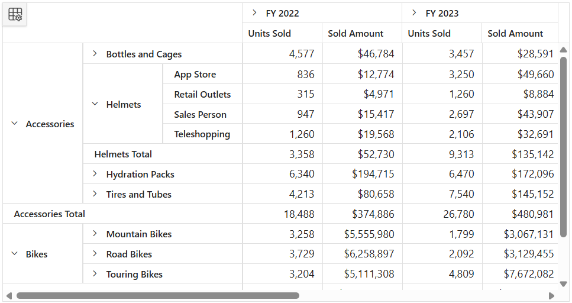

# Classic Layout in Blazor Pivot Table Component

N> The classic layout is compatible only with relational data sources and works exclusively with the client‑side engine.

The classic layout, also known as the *tabular layout*, in the Syncfusion<sup style="font-size:70%">®</sup> Pivot Table provides a structured, tabular presentation of data that enhances readability and usability. In this layout, fields placed on the row axis are displayed side by side in separate columns, making data interpretation and analysis more easier.

By default, grand totals appear at the end of all rows, while subtotals are displayed in a separate row beneath each group. All other features of the Pivot Table, such as filtering, sorting, drag‑and‑drop operations, expand/collapse functionality, and more, remain the same as in the compact layout, which serves as the default hierarchical format of the pivot table.

To enable the classic layout, set the `Layout` property in the [PivotViewGridSettings](https://help.syncfusion.com/cr/blazor/Syncfusion.Blazor.PivotView.PivotViewGridSettings.html) of the Pivot Table to **PivotLayout.Tabular**.

```cshtml

@using Syncfusion.Blazor.PivotView

<SfPivotView TValue="ProductDetails" @ref="pivot" Height="450" Width="100%" ShowFieldList=true>
    <PivotViewDataSourceSettings DataSource="@dataSource">
        <PivotViewColumns>
            <PivotViewColumn Name="Year"></PivotViewColumn>
            <PivotViewColumn Name="Quarter"></PivotViewColumn>
        </PivotViewColumns>
        <PivotViewRows>
            <PivotViewRow Name="Product_Categories"></PivotViewRow>
            <PivotViewRow Name="Products"></PivotViewRow>
            <PivotViewRow Name="Order_Source"></PivotViewRow>
        </PivotViewRows>
        <PivotViewValues>
            <PivotViewValue Name="Sold" Caption="Units Sold"></PivotViewValue>
            <PivotViewValue Name="Amount" Caption="Sold Amount"></PivotViewValue>
        </PivotViewValues>
        <PivotViewFormatSettings>
            <PivotViewFormatSetting Name="Amount" Format="C0"></PivotViewFormatSetting>
            <PivotViewFormatSetting Name="Sold" Format="N0"></PivotViewFormatSetting>
        </PivotViewFormatSettings>
        <PivotViewDrilledMembers>
            <PivotViewDrilledMember Name="Product_Categories" Items="@(new string[] { "Accessories", "Bikes" })"></PivotViewDrilledMember>
            <PivotViewDrilledMember Name="Products" Delimiter="##" Items="@(new string[] { "Accessories##Helmets" })"></PivotViewDrilledMember>
        </PivotViewDrilledMembers>
        <PivotViewFilterSettings>
            <PivotViewFilterSetting Name="Products" Type="FilterType.Exclude" Items="@(new string[] { "Cleaners", "Fenders" })"></PivotViewFilterSetting>
        </PivotViewFilterSettings>
    </PivotViewDataSourceSettings>
    <PivotViewGridSettings ColumnWidth="120" Layout=layout></PivotViewGridSettings>
</SfPivotView>

@code {
    public SfPivotView<ProductDetails>? pivot;
    public List<ProductDetails> dataSource { get; set; }
    public PivotLayout layout = PivotLayout.Tabular;

    protected override void OnInitialized()
    {
        this.dataSource = ProductDetails.GetProductData().ToList();
    }

    public class ProductDetails
    {
        public int In_Stock { get; set; }
        public int Sold { get; set; }
        public double Amount { get; set; }
        public string Country { get; set; } = string.Empty;
        public string Product_Categories { get; set; } = string.Empty;
        public string Products { get; set; } = string.Empty;
        public string Order_Source { get; set; } = string.Empty;
        public string Year { get; set; } = string.Empty;
        public string Quarter { get; set; } = string.Empty;
    }
}

```



**Limitations**

*   Positioning row subtotals at the **Top** is not supported.
*   The following features are currently not supported in the Pivot Table:
    1.  Column resizing
    2.  Auto-fit
    3.  Column reordering when the grouping bar feature is enabled
    4.  Clip mode