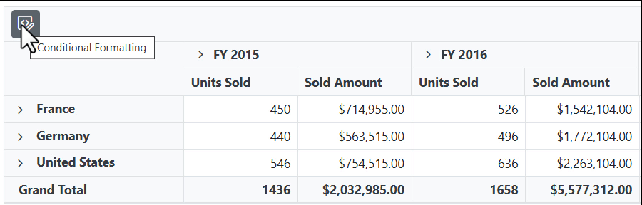
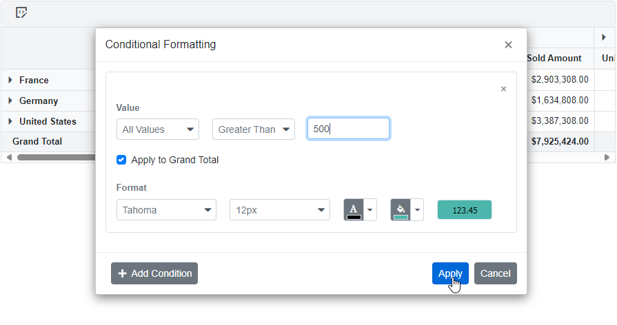
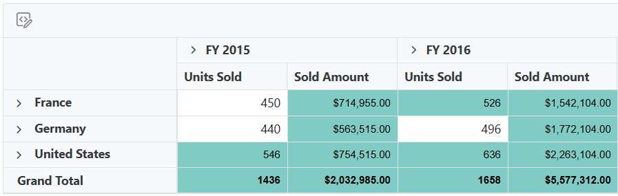
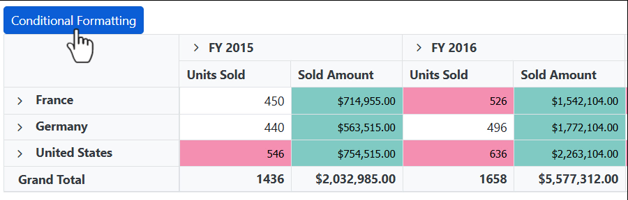
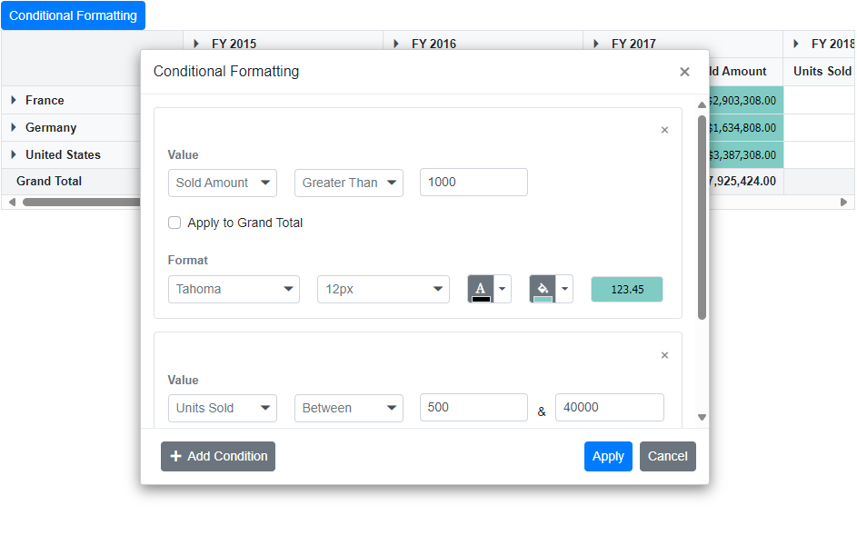
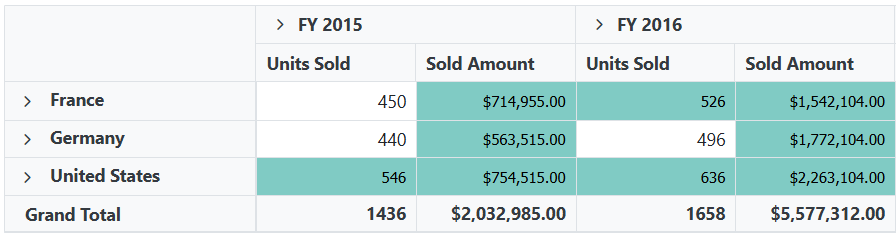
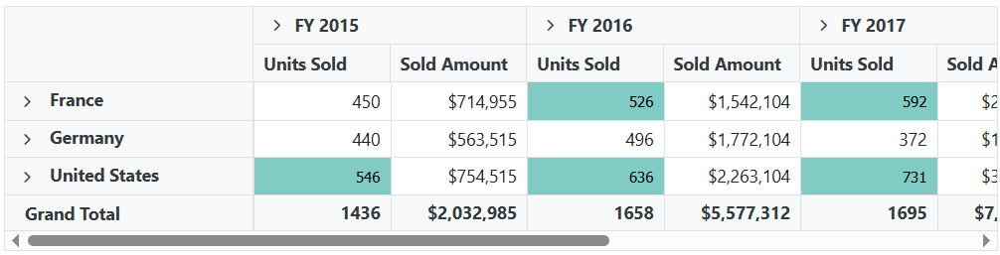
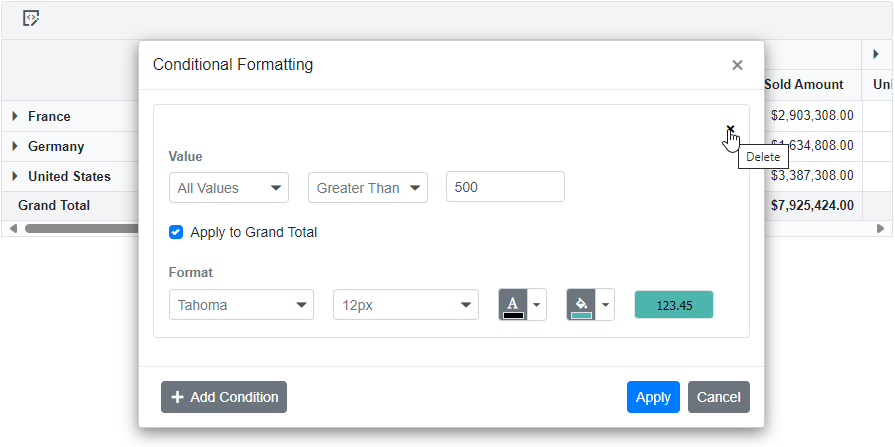

# Conditional Formatting in Blazor Pivot Table Component

The conditional formatting feature enables users to customize the appearance of pivot table value cells by modifying background color, font color, font family, and font size based on specific conditions. This powerful visualization feature helps highlight important value cells and makes them stand out in the pivot table.

To know about **Conditional Formatting** feature in Blazor Pivot Table component, you can check this video.



The conditional formatting can be applied at runtime through the built-in dialog, invoked from the toolbar. To enable this functionality, set the [AllowConditionalFormatting](https://help.syncfusion.com/cr/blazor/Syncfusion.Blazor.PivotView.SfPivotView-1.html#Syncfusion_Blazor_PivotView_SfPivotView_1_AllowConditionalFormatting) and [ShowToolbar](https://help.syncfusion.com/cr/blazor/Syncfusion.Blazor.PivotView.SfPivotView-1.html#Syncfusion_Blazor_PivotView_SfPivotView_1_ShowToolbar) properties in [SfPivotView](https://help.syncfusion.com/cr/blazor/Syncfusion.Blazor.PivotView.SfPivotView-1.html) class to **true**. Additionally, include the item [ToolbarItems.ConditionalFormatting](https://help.syncfusion.com/cr/blazor/Syncfusion.Blazor.PivotView.ToolbarItems.html) within the [Toolbar](https://help.syncfusion.com/cr/blazor/Syncfusion.Blazor.PivotView.SfPivotView-1.html#Syncfusion_Blazor_PivotView_SfPivotView_1_Toolbar) property in the [SfPivotView](https://help.syncfusion.com/cr/blazor/Syncfusion.Blazor.PivotView.SfPivotView-1.html) class. Users will see the "Conditional Formatting" icon in the toolbar UI automatically, which opens the formatting dialog when clicked.

```cshtml
@using Syncfusion.Blazor.PivotView

<SfPivotView TValue="ProductDetails" ShowToolbar="true" Toolbar="@toolbar" AllowConditionalFormatting="true">
        <PivotViewDataSourceSettings DataSource="@data">
            <PivotViewColumns>
                <PivotViewColumn Name="Year"></PivotViewColumn>
                <PivotViewColumn Name="Quarter"></PivotViewColumn>
            </PivotViewColumns>
            <PivotViewRows>
                <PivotViewRow Name="Country"></PivotViewRow>
                <PivotViewRow Name="Products"></PivotViewRow>
            </PivotViewRows>
            <PivotViewValues>
                <PivotViewValue Name="Sold" Caption="Units Sold"></PivotViewValue>
                <PivotViewValue Name="Amount" Caption="Sold Amount"></PivotViewValue>
            </PivotViewValues>
            <PivotViewFormatSettings>
                <PivotViewFormatSetting Name="Amount" Format="C"></PivotViewFormatSetting>
            </PivotViewFormatSettings>
        </PivotViewDataSourceSettings>
</SfPivotView>

@code{
    public List<ToolbarItems> toolbar = new List<ToolbarItems> {
        ToolbarItems.ConditionalFormatting
    };
    public List<ProductDetails> data { get; set; }
    protected override void OnInitialized()
    {
        this.data = ProductDetails.GetProductData().ToList();
        //Bind the data source collection here. Refer "Assigning sample data to the pivot table" section in getting started for more details.
    }
}

```


<br/>
<br/>

<br/>
<br/>

<br/>
<br/>


## Configure conditional formatting through code-behind

Conditional formatting can also be applied programmatically during component initialization using the [PivotViewConditionalFormatSetting](https://help.syncfusion.com/cr/blazor/Syncfusion.Blazor.PivotView.PivotViewConditionalFormatSetting.html) class in the [PivotViewDataSourceSettings](https://help.syncfusion.com/cr/blazor/Syncfusion.Blazor.PivotView.PivotViewDataSourceSettings-1.html). This approach allows you to define formatting rules directly in the code-behind, ensuring that specific styling conditions are automatically applied when the pivot table loads. The required properties to apply a new conditional formatting are,

* [ApplyGrandTotals](https://help.syncfusion.com/cr/blazor/Syncfusion.Blazor.PivotView.PivotViewConditionalFormatSetting.html#Syncfusion_Blazor_PivotView_PivotViewConditionalFormatSetting_ApplyGrandTotals): This boolean property allows you to restrict conditional formatting for grand totals in the row and column axes. By default, this property is set to true.
* [Measure](https://help.syncfusion.com/cr/blazor/Syncfusion.Blazor.PivotView.PivotViewConditionalFormatSetting.html#Syncfusion_Blazor_PivotView_PivotViewConditionalFormatSetting_Measure): Specifies the value field name for which style will be applied.
* [Conditions](https://help.syncfusion.com/cr/blazor/Syncfusion.Blazor.PivotView.PivotViewConditionalFormatSetting.html#Syncfusion_Blazor_PivotView_PivotViewConditionalFormatSetting_Conditions): Defines the operator type used for conditional formatting, such as equals, greater than, less than, etc.
* [Value1](https://help.syncfusion.com/cr/blazor/Syncfusion.Blazor.PivotView.PivotViewConditionalFormatSetting.html#Syncfusion_Blazor_PivotView_PivotViewConditionalFormatSetting_Value1): Specifies the starting value for the conditional formatting.
* [Value2](https://help.syncfusion.com/cr/blazor/Syncfusion.Blazor.PivotView.PivotViewConditionalFormatSetting.html#Syncfusion_Blazor_PivotView_PivotViewConditionalFormatSetting_Value2): Specifies the ending value for the conditional formatting range. This property is applicable only for conditions like **Between** and **NotBetween**.
* [PivotViewStyle](https://help.syncfusion.com/cr/blazor/Syncfusion.Blazor.PivotView.PivotViewStyle.html): Specifies the custom styling applied to the cell.

The [PivotViewStyle](https://help.syncfusion.com/cr/blazor/Syncfusion.Blazor.PivotView.PivotViewStyle.html) class includes the following properties, which you can use to customize the appearance of value cells:

* [BackgroundColor](https://help.syncfusion.com/cr/blazor/Syncfusion.Blazor.PivotView.PivotViewStyle.html#Syncfusion_Blazor_PivotView_PivotViewStyle_BackgroundColor): It allows to set the background color to the value cell in the pivot table.
* [Color](https://help.syncfusion.com/cr/blazor/Syncfusion.Blazor.PivotView.PivotViewStyle.html#Syncfusion_Blazor_PivotView_PivotViewStyle_Color): It allows to set the font color to the value cell in the pivot table.
* [FontFamily](https://help.syncfusion.com/cr/blazor/Syncfusion.Blazor.PivotView.PivotViewStyle.html#Syncfusion_Blazor_PivotView_PivotViewStyle_FontFamily): It allows to set the font family to the value cell in the pivot table.
* [FontSize](https://help.syncfusion.com/cr/blazor/Syncfusion.Blazor.PivotView.PivotViewStyle.html#Syncfusion_Blazor_PivotView_PivotViewStyle_FontSize): It allows to set the font size to the value cell in the pivot table.

## Opening conditional formatting dialog programmatically

Users can also access the conditional formatting dialog through external UI elements by calling the [ShowConditionalFormattingDialogAsync](https://help.syncfusion.com/cr/blazor/Syncfusion.Blazor.PivotView.SfPivotView-1.html#Syncfusion_Blazor_PivotView_SfPivotView_1_ShowConditionalFormattingDialog) method. In the following example, an external button is used to open the conditional formatting dialog programmatically.

```cshtml
@using Syncfusion.Blazor.PivotView
@using Syncfusion.Blazor.Buttons

<SfButton OnClick="@OnCondFormatting" IsPrimary="true">Conditional Formatting</SfButton>

<SfPivotView TValue="ProductDetails" @ref="pivot" AllowConditionalFormatting="true">
    <PivotViewDataSourceSettings DataSource="@data">
        <PivotViewColumns>
            <PivotViewColumn Name="Year"></PivotViewColumn>
            <PivotViewColumn Name="Quarter"></PivotViewColumn>
        </PivotViewColumns>
        <PivotViewRows>
            <PivotViewRow Name="Country"></PivotViewRow>
            <PivotViewRow Name="Products"></PivotViewRow>
        </PivotViewRows>
        <PivotViewValues>
            <PivotViewValue Name="Sold" Caption="Units Sold"></PivotViewValue>
            <PivotViewValue Name="Amount" Caption="Sold Amount"></PivotViewValue>
        </PivotViewValues>
        <PivotViewFilters>
            <PivotViewFilter Name="Product_Categories" Caption="Product Categories"></PivotViewFilter>
        </PivotViewFilters>
        <PivotViewFormatSettings>
            <PivotViewFormatSetting Name="Amount" Format="C"></PivotViewFormatSetting>
        </PivotViewFormatSettings>
        <PivotViewConditionalFormatSettings>
            <PivotViewConditionalFormatSetting Measure="Amount" Conditions=Condition.GreaterThan Value1=1000>
                <PivotViewStyle BackgroundColor="#80cbc4" Color="black" FontFamily="Tahoma" FontSize="12px">
                </PivotViewStyle>
            </PivotViewConditionalFormatSetting>
            <PivotViewConditionalFormatSetting Measure="Sold" Conditions=Condition.Between  Value1=500 Value2=40000>
                <PivotViewStyle BackgroundColor="#f48fb1" Color="black" FontFamily="Tahoma" FontSize="12px">
                </PivotViewStyle>
            </PivotViewConditionalFormatSetting>
        </PivotViewConditionalFormatSettings>
    </PivotViewDataSourceSettings>
</SfPivotView>

@code{
    SfPivotView<ProductDetails> pivot;
    public List<ProductDetails> data { get; set; }
    protected override void OnInitialized()
    {
        this.data = ProductDetails.GetProductData().ToList();
        //Bind the data source collection here. Refer "Assigning sample data to the pivot table" section in getting started for more details.
    }
    public void OnCondFormatting(Microsoft.AspNetCore.Components.Web.MouseEventArgs args)
    {
        this.pivot.ShowConditionalFormattingDialogAsync();
    }
}

```





## Conditional formatting for all fields

The Pivot Table component allows you to apply conditional formatting to all value fields simultaneously. This approach ensures consistent highlighting and styling of value cells across the entire pivot table, removing the need to configure formatting for each value field individually.

To format all value fields together, use the [PivotViewConditionalFormatSetting](https://help.syncfusion.com/cr/blazor/Syncfusion.Blazor.PivotView.PivotViewConditionalFormatSetting.html) class without specifying the [Measure](https://help.syncfusion.com/cr/blazor/Syncfusion.Blazor.PivotView.PivotViewConditionalFormatSetting.html#Syncfusion_Blazor_PivotView_PivotViewConditionalFormatSetting_Measure) property. When the [Measure](https://help.syncfusion.com/cr/blazor/Syncfusion.Blazor.PivotView.PivotViewConditionalFormatSetting.html#Syncfusion_Blazor_PivotView_PivotViewConditionalFormatSetting_Measure) property is omitted, the formatting rules are automatically applied to every value field in your pivot table, resulting in a uniform appearance for all value cells.

```cshtml
@using Syncfusion.Blazor.PivotView

<SfPivotView TValue="ProductDetails" AllowConditionalFormatting="true">
    <PivotViewDataSourceSettings DataSource="@data">
        <PivotViewColumns>
            <PivotViewColumn Name="Year"></PivotViewColumn>
            <PivotViewColumn Name="Quarter"></PivotViewColumn>
        </PivotViewColumns>
        <PivotViewRows>
            <PivotViewRow Name="Country"></PivotViewRow>
            <PivotViewRow Name="Products"></PivotViewRow>
        </PivotViewRows>
        <PivotViewValues>
            <PivotViewValue Name="Sold" Caption="Units Sold"></PivotViewValue>
            <PivotViewValue Name="Amount" Caption="Sold Amount"></PivotViewValue>
        </PivotViewValues>
        <PivotViewFilters>
            <PivotViewFilter Name="Product_Categories" Caption="Product Categories"></PivotViewFilter>
        </PivotViewFilters>
        <PivotViewFormatSettings>
            <PivotViewFormatSetting Name="Amount" Format="C"></PivotViewFormatSetting>
        </PivotViewFormatSettings>
        <PivotViewConditionalFormatSettings>
            <PivotViewConditionalFormatSetting Conditions=Condition.GreaterThan Value1=500>
                <PivotViewStyle BackgroundColor="#80cbc4" Color="black" FontFamily="Tahoma" FontSize="12px">
                </PivotViewStyle>
            </PivotViewConditionalFormatSetting>
        </PivotViewConditionalFormatSettings>
    </PivotViewDataSourceSettings>
</SfPivotView>

@code{
    public List<ProductDetails> data { get; set; }
    protected override void OnInitialized()
    {
        this.data = ProductDetails.GetProductData().ToList();
        //Bind the data source collection here. Refer "Assigning sample data to the pivot table" section in getting started for more details.
    }
}

```



## Conditional formatting for specific value field

To apply conditional formatting exclusively to a particular value field, set the [Measure](https://help.syncfusion.com/cr/blazor/Syncfusion.Blazor.PivotView.PivotViewConditionalFormatSetting.html#Syncfusion_Blazor_PivotView_PivotViewConditionalFormatSetting_Measure) property with the specific value field name in [PivotViewConditionalFormatSetting](https://help.syncfusion.com/cr/blazor/Syncfusion.Blazor.PivotView.PivotViewConditionalFormatSetting.html) class.

```cshtml
@using Syncfusion.Blazor.PivotView

<SfPivotView TValue="ProductDetails" AllowConditionalFormatting="true">
    <PivotViewDataSourceSettings DataSource="@data">
        <PivotViewColumns>
            <PivotViewColumn Name="Year"></PivotViewColumn>
            <PivotViewColumn Name="Quarter"></PivotViewColumn>
        </PivotViewColumns>
        <PivotViewRows>
            <PivotViewRow Name="Country"></PivotViewRow>
            <PivotViewRow Name="Products"></PivotViewRow>
        </PivotViewRows>
        <PivotViewValues>
            <PivotViewValue Name="Sold" Caption="Units Sold"></PivotViewValue>
            <PivotViewValue Name="Amount" Caption="Sold Amount"></PivotViewValue>
        </PivotViewValues>
        <PivotViewFilters>
            <PivotViewFilter Name="Product_Categories" Caption="Product Categories"></PivotViewFilter>
        </PivotViewFilters>
        <PivotViewFormatSettings>
            <PivotViewFormatSetting Name="Amount" Format="C0"></PivotViewFormatSetting>
        </PivotViewFormatSettings>
        <PivotViewConditionalFormatSettings>
            <PivotViewConditionalFormatSetting Measure="Sold" Conditions=Condition.GreaterThan Value1=500>
                <PivotViewStyle BackgroundColor="#80cbc4" Color="black" FontFamily="Tahoma" FontSize="12px">
                </PivotViewStyle>
            </PivotViewConditionalFormatSetting>
        </PivotViewConditionalFormatSettings>
    </PivotViewDataSourceSettings>
</SfPivotView>

@code{
    public List<ProductDetails> data { get; set; }
    protected override void OnInitialized()
    {
        this.data = ProductDetails.GetProductData().ToList();
        //Bind the data source collection here. Refer "Assigning sample data to the pivot table" section in getting started for more details.
    }
}

```



## Editing and removing existing conditional format

Editing and removing existing conditional format can be done through the UI at runtime. To do so, open the conditional formatting dialog and edit the "Value", "Condition" and "Format" options based on user requirement and click "OK". To remove a conditional format, click the "Delete" icon besides the respective condition.



N> You can refer to the [Blazor Pivot Table](https://www.syncfusion.com/blazor-components/blazor-pivot-table) feature tour page for its groundbreaking feature representations. You can also explore the [Blazor Pivot Table example](https://blazor.syncfusion.com/demos/pivot-table/default-functionalities?theme=bootstrap5) to know how to render and configure the pivot table.