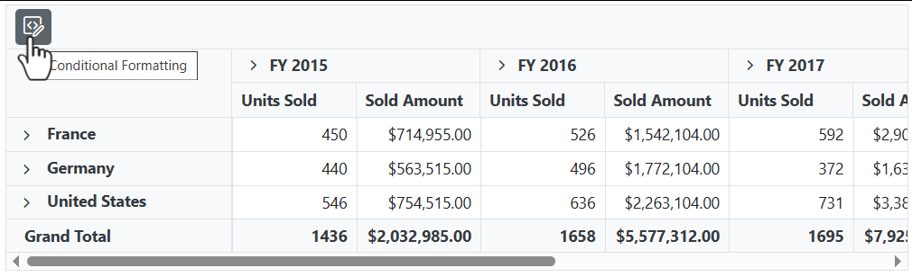
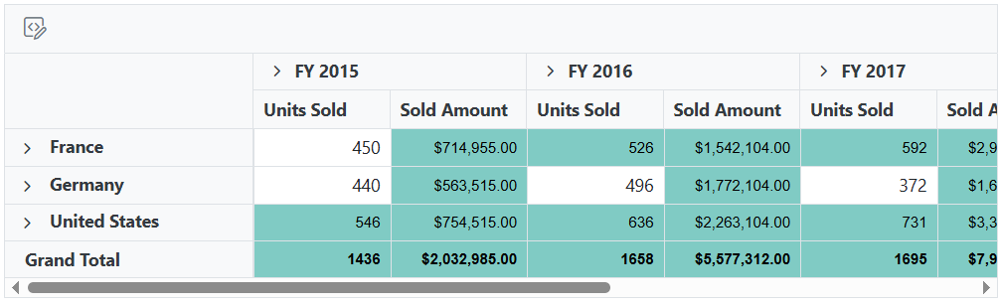
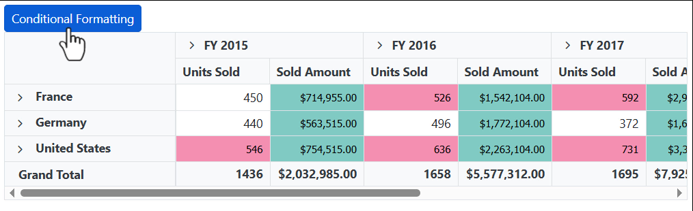

# Conditional Formatting in Blazor Pivot Table Component

It allows the end user to change the appearance of the pivot table value cells with its background color, font color, font family, and font size based on the specific conditions.

To know about **Conditional Formatting** feature in Blazor Pivot Table component, you can check this video.



The conditional formatting can be applied at runtime through the built-in dialog, invoked from the toolbar. To do so, set the [AllowConditionalFormatting](https://help.syncfusion.com/cr/blazor/Syncfusion.Blazor.PivotView.SfPivotView-1.html#Syncfusion_Blazor_PivotView_SfPivotView_1_AllowConditionalFormatting) and [ShowToolbar](https://help.syncfusion.com/cr/blazor/Syncfusion.Blazor.PivotView.SfPivotView-1.html#Syncfusion_Blazor_PivotView_SfPivotView_1_ShowToolbar) properties in [SfPivotView](https://help.syncfusion.com/cr/blazor/Syncfusion.Blazor.PivotView.SfPivotView-1.html) class to **true**. Also, include the item [ToolbarItems.ConditionalFormatting](https://help.syncfusion.com/cr/blazor/Syncfusion.Blazor.PivotView.ToolbarItems.html) within the [Toolbar](https://help.syncfusion.com/cr/blazor/Syncfusion.Blazor.PivotView.SfPivotView-1.html#Syncfusion_Blazor_PivotView_SfPivotView_1_Toolbar) property in the [SfPivotView](https://help.syncfusion.com/cr/blazor/Syncfusion.Blazor.PivotView.SfPivotView-1.html) class. End user can now see the "Conditional Formatting" icon in toolbar UI automatically, which on clicking will invoke the formatting dialog to perform necessary operations.

```cshtml
@using Syncfusion.Blazor.PivotView

<SfPivotView TValue="ProductDetails" ShowToolbar="true" Toolbar="@toolbar" AllowConditionalFormatting="true">
        <PivotViewDataSourceSettings DataSource="@data">
            <PivotViewColumns>
                <PivotViewColumn Name="Year"></PivotViewColumn>
                <PivotViewColumn Name="Quarter"></PivotViewColumn>
            </PivotViewColumns>
            <PivotViewRows>
                <PivotViewRow Name="Country"></PivotViewRow>
                <PivotViewRow Name="Products"></PivotViewRow>
            </PivotViewRows>
            <PivotViewValues>
                <PivotViewValue Name="Sold" Caption="Units Sold"></PivotViewValue>
                <PivotViewValue Name="Amount" Caption="Sold Amount"></PivotViewValue>
            </PivotViewValues>
            <PivotViewFormatSettings>
                <PivotViewFormatSetting Name="Amount" Format="C"></PivotViewFormatSetting>
            </PivotViewFormatSettings>
        </PivotViewDataSourceSettings>
</SfPivotView>

@code{
    public List<ToolbarItems> toolbar = new List<ToolbarItems> {
        ToolbarItems.ConditionalFormatting
    };
    public List<ProductDetails> data { get; set; }
    protected override void OnInitialized()
    {
        this.data = ProductDetails.GetProductData().ToList();
        //Bind the data source collection here. Refer "Assigning sample data to the pivot table" section in getting started for more details.
    }
}

```

<!-- markdownlint-disable MD012 -->

<br/>
<br/>

<br/>
<br/>

<br/>
<br/>


Conditional formatting can also be included in the pivot table through the code-behind using the [PivotViewConditionalFormatSetting](https://help.syncfusion.com/cr/blazor/Syncfusion.Blazor.PivotView.PivotViewConditionalFormatSetting.html) class. The required properties to apply a new conditional formatting are,

* [ApplyGrandTotals](https://help.syncfusion.com/cr/blazor/Syncfusion.Blazor.PivotView.PivotViewConditionalFormatSetting.html#Syncfusion_Blazor_PivotView_PivotViewConditionalFormatSetting_ApplyGrandTotals): This boolean property allows you to restrict conditional formatting for grand totals in the row and column axes. By default, this property is set to true.
* [Measure](https://help.syncfusion.com/cr/blazor/Syncfusion.Blazor.PivotView.PivotViewConditionalFormatSetting.html#Syncfusion_Blazor_PivotView_PivotViewConditionalFormatSetting_Measure): Specifies the value field name for which style will be applied.
* [Conditions](https://help.syncfusion.com/cr/blazor/Syncfusion.Blazor.PivotView.PivotViewConditionalFormatSetting.html#Syncfusion_Blazor_PivotView_PivotViewConditionalFormatSetting_Conditions): Defines the operator type used for conditional formatting, such as equals, greater than, less than, etc.
* [Value1](https://help.syncfusion.com/cr/blazor/Syncfusion.Blazor.PivotView.PivotViewConditionalFormatSetting.html#Syncfusion_Blazor_PivotView_PivotViewConditionalFormatSetting_Value1): Specifies the starting value for the conditional formatting.
* [Value2](https://help.syncfusion.com/cr/blazor/Syncfusion.Blazor.PivotView.PivotViewConditionalFormatSetting.html#Syncfusion_Blazor_PivotView_PivotViewConditionalFormatSetting_Value2): Specifies the ending value for the conditional formatting range. This property is applicable only for conditions like **Between** and **NotBetween**.
* [PivotViewStyle](https://help.syncfusion.com/cr/blazor/Syncfusion.Blazor.PivotView.PivotViewStyle.html):  Specifies the custom styling applied to the cell.

The available style properties in [PivotViewStyle](https://help.syncfusion.com/cr/blazor/Syncfusion.Blazor.PivotView.PivotViewStyle.html) class, to set in value cells are:

* [BackgroundColor](https://help.syncfusion.com/cr/blazor/Syncfusion.Blazor.PivotView.PivotViewStyle.html#Syncfusion_Blazor_PivotView_PivotViewStyle_BackgroundColor): It allows to set the background color to the value cell in the pivot table.
* [Color](https://help.syncfusion.com/cr/blazor/Syncfusion.Blazor.PivotView.PivotViewStyle.html#Syncfusion_Blazor_PivotView_PivotViewStyle_Color): It allows to set the font color to the value cell in the pivot table.
* [FontFamily](https://help.syncfusion.com/cr/blazor/Syncfusion.Blazor.PivotView.PivotViewStyle.html#Syncfusion_Blazor_PivotView_PivotViewStyle_FontFamily): It allows to set the font family to the value cell in the pivot table.
* [FontSize](https://help.syncfusion.com/cr/blazor/Syncfusion.Blazor.PivotView.PivotViewStyle.html#Syncfusion_Blazor_PivotView_PivotViewStyle_FontSize): It allows to set the font size to the value cell in the pivot table.

Meanwhile, user can also view conditional formatting dialog in UI by invoking [ShowConditionalFormattingDialogAsync](https://help.syncfusion.com/cr/blazor/Syncfusion.Blazor.PivotView.SfPivotView-1.html#Syncfusion_Blazor_PivotView_SfPivotView_1_ShowConditionalFormattingDialog) method on an external button click.

```cshtml
@using Syncfusion.Blazor.PivotView
@using Syncfusion.Blazor.Buttons

<SfButton OnClick="@OnCondFormatting" IsPrimary="true">Conditional Formatting</SfButton>

<SfPivotView TValue="ProductDetails" @ref="pivot" AllowConditionalFormatting="true">
    <PivotViewDataSourceSettings DataSource="@data">
        <PivotViewColumns>
            <PivotViewColumn Name="Year"></PivotViewColumn>
            <PivotViewColumn Name="Quarter"></PivotViewColumn>
        </PivotViewColumns>
        <PivotViewRows>
            <PivotViewRow Name="Country"></PivotViewRow>
            <PivotViewRow Name="Products"></PivotViewRow>
        </PivotViewRows>
        <PivotViewValues>
            <PivotViewValue Name="Sold" Caption="Units Sold"></PivotViewValue>
            <PivotViewValue Name="Amount" Caption="Sold Amount"></PivotViewValue>
        </PivotViewValues>
        <PivotViewFilters>
            <PivotViewFilter Name="Product_Categories" Caption="Product Categories"></PivotViewFilter>
        </PivotViewFilters>
        <PivotViewFormatSettings>
            <PivotViewFormatSetting Name="Amount" Format="C"></PivotViewFormatSetting>
        </PivotViewFormatSettings>
        <PivotViewConditionalFormatSettings>
            <PivotViewConditionalFormatSetting Measure="Amount" Conditions=Condition.GreaterThan Value1=1000>
                <PivotViewStyle BackgroundColor="#80cbc4" Color="black" FontFamily="Tahoma" FontSize="12px">
                </PivotViewStyle>
            </PivotViewConditionalFormatSetting>
            <PivotViewConditionalFormatSetting Measure="Sold" Conditions=Condition.Between  Value1=500 Value2=40000>
                <PivotViewStyle BackgroundColor="#f48fb1" Color="black" FontFamily="Tahoma" FontSize="12px">
                </PivotViewStyle>
            </PivotViewConditionalFormatSetting>
        </PivotViewConditionalFormatSettings>
    </PivotViewDataSourceSettings>
</SfPivotView>

@code{
    SfPivotView<ProductDetails> pivot;
    public List<ProductDetails> data { get; set; }
    protected override void OnInitialized()
    {
        this.data = ProductDetails.GetProductData().ToList();
        //Bind the data source collection here. Refer "Assigning sample data to the pivot table" section in getting started for more details.
    }
    public void OnCondFormatting(Microsoft.AspNetCore.Components.Web.MouseEventArgs args)
    {
        this.pivot.ShowConditionalFormattingDialogAsync();
    }
}

```




## Conditional formatting for all fields

It allows end user to apply conditional formatting commonly for all value fields just by ignoring the [Measure](https://help.syncfusion.com/cr/blazor/Syncfusion.Blazor.PivotView.PivotViewConditionalFormatSetting.html#Syncfusion_Blazor_PivotView_PivotViewConditionalFormatSetting_Measure) property and setting rest of the properties in [PivotViewConditionalFormatSetting](https://help.syncfusion.com/cr/blazor/Syncfusion.Blazor.PivotView.PivotViewConditionalFormatSetting.html) class.

```cshtml
@using Syncfusion.Blazor.PivotView

<SfPivotView TValue="ProductDetails" AllowConditionalFormatting="true">
    <PivotViewDataSourceSettings DataSource="@data">
        <PivotViewColumns>
            <PivotViewColumn Name="Year"></PivotViewColumn>
            <PivotViewColumn Name="Quarter"></PivotViewColumn>
        </PivotViewColumns>
        <PivotViewRows>
            <PivotViewRow Name="Country"></PivotViewRow>
            <PivotViewRow Name="Products"></PivotViewRow>
        </PivotViewRows>
        <PivotViewValues>
            <PivotViewValue Name="Sold" Caption="Units Sold"></PivotViewValue>
            <PivotViewValue Name="Amount" Caption="Sold Amount"></PivotViewValue>
        </PivotViewValues>
        <PivotViewFilters>
            <PivotViewFilter Name="Product_Categories" Caption="Product Categories"></PivotViewFilter>
        </PivotViewFilters>
        <PivotViewFormatSettings>
            <PivotViewFormatSetting Name="Amount" Format="C"></PivotViewFormatSetting>
        </PivotViewFormatSettings>
        <PivotViewConditionalFormatSettings>
            <PivotViewConditionalFormatSetting Conditions=Condition.GreaterThan Value1=500>
                <PivotViewStyle BackgroundColor="#80cbc4" Color="black" FontFamily="Tahoma" FontSize="12px">
                </PivotViewStyle>
            </PivotViewConditionalFormatSetting>
        </PivotViewConditionalFormatSettings>
    </PivotViewDataSourceSettings>
</SfPivotView>

@code{
    public List<ProductDetails> data { get; set; }
    protected override void OnInitialized()
    {
        this.data = ProductDetails.GetProductData().ToList();
        //Bind the data source collection here. Refer "Assigning sample data to the pivot table" section in getting started for more details.
    }
}

```


## Conditional formatting for specific value field

It allows the end user to apply conditional formatting to a specific value field by setting the [Measure](https://help.syncfusion.com/cr/blazor/Syncfusion.Blazor.PivotView.PivotViewConditionalFormatSetting.html#Syncfusion_Blazor_PivotView_PivotViewConditionalFormatSetting_Measure) property with specific value field name in [PivotViewConditionalFormatSetting](https://help.syncfusion.com/cr/blazor/Syncfusion.Blazor.PivotView.PivotViewConditionalFormatSetting.html) class.

```cshtml
@using Syncfusion.Blazor.PivotView

<SfPivotView TValue="ProductDetails" AllowConditionalFormatting="true">
    <PivotViewDataSourceSettings DataSource="@data">
        <PivotViewColumns>
            <PivotViewColumn Name="Year"></PivotViewColumn>
            <PivotViewColumn Name="Quarter"></PivotViewColumn>
        </PivotViewColumns>
        <PivotViewRows>
            <PivotViewRow Name="Country"></PivotViewRow>
            <PivotViewRow Name="Products"></PivotViewRow>
        </PivotViewRows>
        <PivotViewValues>
            <PivotViewValue Name="Sold" Caption="Units Sold"></PivotViewValue>
            <PivotViewValue Name="Amount" Caption="Sold Amount"></PivotViewValue>
        </PivotViewValues>
        <PivotViewFilters>
            <PivotViewFilter Name="Product_Categories" Caption="Product Categories"></PivotViewFilter>
        </PivotViewFilters>
        <PivotViewFormatSettings>
            <PivotViewFormatSetting Name="Amount" Format="C0"></PivotViewFormatSetting>
        </PivotViewFormatSettings>
        <PivotViewConditionalFormatSettings>
            <PivotViewConditionalFormatSetting Measure="Sold" Conditions=Condition.GreaterThan Value1=500>
                <PivotViewStyle BackgroundColor="#80cbc4" Color="black" FontFamily="Tahoma" FontSize="12px">
                </PivotViewStyle>
            </PivotViewConditionalFormatSetting>
        </PivotViewConditionalFormatSettings>
    </PivotViewDataSourceSettings>
</SfPivotView>

@code{
    public List<ProductDetails> data { get; set; }
    protected override void OnInitialized()
    {
        this.data = ProductDetails.GetProductData().ToList();
        //Bind the data source collection here. Refer "Assigning sample data to the pivot table" section in getting started for more details.
    }
}

```


## Editing and removing existing conditional format

Editing and removing existing conditional format can be done through the UI at runtime. To do so, open the conditional formatting dialog and edit the "Value", "Condition" and "Format" options based on the user requirement and click "OK". To remove a conditional format, click the "Delete" icon besides the respective condition.  


N> You can refer to the [Blazor Pivot Table](https://www.syncfusion.com/blazor-components/blazor-pivot-table) feature tour page for its groundbreaking feature representations. You can also explore the [Blazor Pivot Table example](https://blazor.syncfusion.com/demos/pivot-table/default-functionalities?theme=bootstrap5) to know how to render and configure the pivot table.