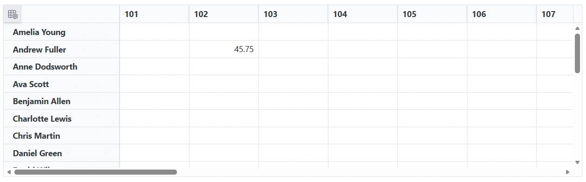
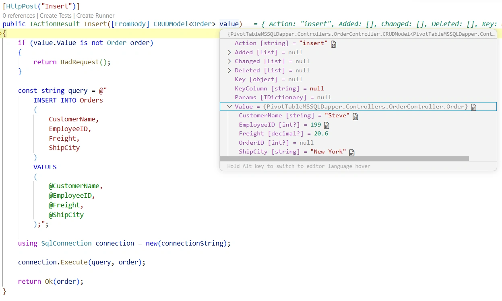
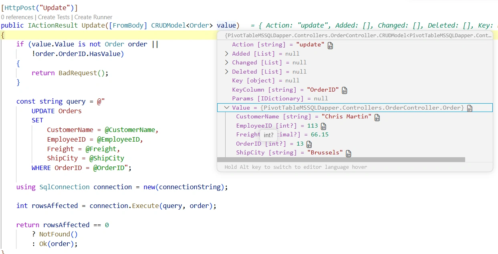
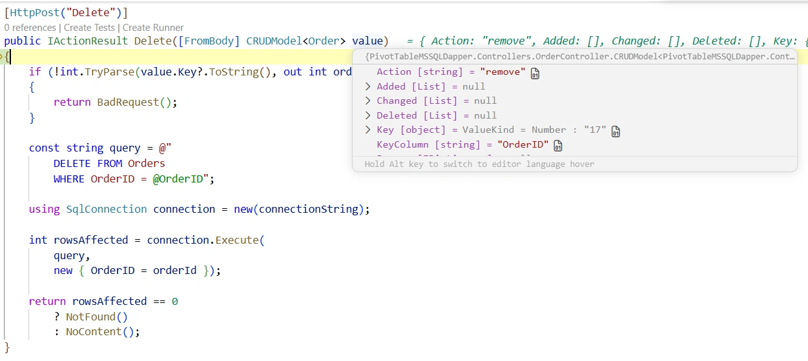

# Connecting SQL Server to Blazor Pivot Table Using Dapper

The [Blazor Pivot Table](https://www.syncfusion.com/blazor-components/blazor-pivottable) can be connected to a Microsoft SQL Server database using the lightweight Dapper micro-ORM. This approach provides a simple way to execute parameterized SQL statements while keeping the data access layer minimal and performant.

**What is Dapper?**

Dapper is a lightweight, high-performance ORM that provides a minimal abstraction over ADO.NET. It maps query results directly to C# objects with very low overhead, making it well suited for applications that need direct SQL control and fast data access.

**Key Benefits of Dapper**

- **High Performance**: Minimal overhead with direct ADO.NET access for fast execution.
- **SQL Control**: Write direct SQL queries when needed, with full control over database operations.
- **Simple and Lightweight**: Requires minimal configuration and a small learning curve.
- **Flexible Mapping**: Maps query results to C# objects automatically using property names.
- **Built-in Security**: Parameterized queries help prevent SQL injection.

## Prerequisites

Ensure the following software and packages are installed before proceeding:

| Software/Package | Version | Purpose |
|------------------|---------|---------|
| Visual Studio 2022 / VS Code | Latest | Development environment with the Blazor workload |
| .NET SDK | net10.0 or compatible | Runtime and build tools |
| SQL Server | 2019 or later | Database server |
| Syncfusion.Blazor.PivotTable | Latest | Pivot Table UI component |
| Syncfusion.Blazor.Themes | Latest | Styling for Pivot Table components |
| Microsoft.Data.SqlClient | Latest | SQL Server ADO.NET provider |
| Dapper | Latest | Lightweight ORM and object mapper |
| Newtonsoft.Json | Latest | JSON serialization for CRUD models |

## Architecture and Data Flow

The sample follows a remote data binding architecture where the Blazor Pivot Table does not communicate with SQL Server directly.

```text
Blazor Pivot Table
       ↓
ASP.NET Core Controller
       ↓
Dapper
       ↓
Microsoft.Data.SqlClient
       ↓
SQL Server
```

The request flow is as follows:

1. The Pivot Table sends data requests through the URL adaptor.
2. The ASP.NET Core controller receives the request and prepares the appropriate SQL statement.
3. Dapper executes the query against SQL Server using Microsoft.Data.SqlClient.
4. The returned rows are mapped to C# objects and sent back to the Pivot Table.

## Setting Up the SQL Server Environment with Dapper

### Step 1: Create the database and table in SQL Server

Create a database named `OrderDB` and an `Orders` table for the sample application.

Run the following SQL script:

```sql
CREATE DATABASE OrderDB;
GO

USE OrderDB;
GO

CREATE TABLE Orders
(
    OrderID        INT IDENTITY(1, 1) PRIMARY KEY,
    CustomerName   VARCHAR(100) NULL,
    EmployeeID     INT NULL,
    ShipCity       VARCHAR(100) NULL,
    Freight        DECIMAL(10, 2) NULL
);
GO
```

Optional sample data:

```sql
INSERT INTO Orders (CustomerName, EmployeeID, ShipCity, Freight) VALUES
('Toms',   1, 'New York',  35.30),
('Ravi',   2, 'London',    80.20),
('Sven',   1, 'Berlin',    52.10),
('Sara',   3, 'Madrid',    18.40),
('Paul',   2, 'Tokyo',     64.75);
GO
```

After executing these statements, the SQL Server database is ready for integration with the Blazor Pivot Table.

The following SQL statement is used to read the records from the `Orders` table and supply them to the Pivot Table through Dapper:

```sql
SELECT OrderID, CustomerName, EmployeeID, ShipCity, Freight
FROM Orders
ORDER BY OrderID;
```

This query provides the source rows that the controller maps to the `Order` model and sends to the Pivot Table for aggregation and display.

The screenshot below shows the SQL query and the resulting rows from the `Orders` table that Dapper uses to populate the Pivot Table data model.


## Step 2: Install Required NuGet Packages

Create a new Blazor Web App and install the required packages.

### Using the .NET CLI

```bash
dotnet add package Syncfusion.Blazor.PivotTable --version 34.1.32
dotnet add package Syncfusion.Blazor.Themes --version 34.1.32
dotnet add package Newtonsoft.Json --version 13.0.3
dotnet add package Microsoft.Data.SqlClient --version 6.1.1
dotnet add package Dapper --version 2.1.79
```

### Using NuGet Package Manager UI

Search for and install the following packages:

- `Syncfusion.Blazor.PivotTable`
- `Syncfusion.Blazor.Themes`
- `Newtonsoft.Json`
- `Microsoft.Data.SqlClient`
- `Dapper`

All required packages are now installed.

## Step 3: Configure the Connection String

The connection string is stored in `appsettings.json` under the `ConnectionStrings` section.

```json
{
  "ConnectionStrings": {
    "SQLServer": "Server=<SERVER_NAME>;Database=OrderDB;User Id=<USER_ID>;Password=<PASSWORD>;TrustServerCertificate=True;"
  },
  "Logging": {
    "LogLevel": {
      "Default": "Information",
      "Microsoft.AspNetCore": "Warning"
    }
  },
  "AllowedHosts": "*"
}
```

Replace the placeholder values with the values that match your SQL Server environment:

- `Server`: SQL Server host name or instance name.
- `Database`: Database name, such as `OrderDB`.
- `User Id`: SQL Server login name.
- `Password`: SQL Server login password.
- `TrustServerCertificate`: Set to `True` for local development scenarios when needed.

## Step 4: Create the Controller with Dapper

The Pivot Table sample uses an ASP.NET Core controller to expose REST endpoints for the Pivot Table. The controller uses Dapper to open a SQL connection and execute queries against the SQL Server database.

Create a controller named `OrderController` in the `Controllers` folder with the following implementation:

```csharp
using System.ComponentModel.DataAnnotations;
using System.Text.Json.Serialization;
using Dapper;
using Microsoft.AspNetCore.Mvc;
using Microsoft.Data.SqlClient;
using Syncfusion.Blazor.Data;
using Syncfusion.Blazor;

namespace PivotTableMSSQLDapper.Controllers
{
    [ApiController]
    [Route("api/[controller]")]
    public class OrderController : ControllerBase
    {
        private readonly string connectionString;

        public OrderController(IConfiguration configuration)
        {
            connectionString = configuration.GetConnectionString("SQLServer")
                ?? throw new InvalidOperationException(
                    "The SQL Server connection string is not configured.");
        }

        [HttpPost]
        public object Post([FromBody] DataManagerRequest request)
        {
            _ = request;

            List<Order> orders = GetOrderData();

            return new
            {
                result = orders,
                count = orders.Count
            };
        }

        private List<Order> GetOrderData()
        {
            const string query = @"
                SELECT
                    OrderID,
                    CustomerName,
                    EmployeeID,
                    Freight,
                    ShipCity
                FROM Orders
                ORDER BY OrderID";

            using SqlConnection connection = new(connectionString);

            return connection.Query<Order>(query).ToList();
        }

        [HttpPost("Insert")]
        public IActionResult Insert([FromBody] CRUDModel<Order> value)
        {
            if (value.Value is not Order order)
            {
                return BadRequest();
            }

            const string query = @"
                INSERT INTO Orders
                (
                    CustomerName,
                    EmployeeID,
                    Freight,
                    ShipCity
                )
                VALUES
                (
                    @CustomerName,
                    @EmployeeID,
                    @Freight,
                    @ShipCity
                );";

            using SqlConnection connection = new(connectionString);

            connection.Execute(query, order);

            return Ok(order);
        }

        [HttpPost("Update")]
        public IActionResult Update([FromBody] CRUDModel<Order> value)
        {
            if (value.Value is not Order order ||
                !order.OrderID.HasValue)
            {
                return BadRequest();
            }

            const string query = @"
                UPDATE Orders
                SET
                    CustomerName = @CustomerName,
                    EmployeeID = @EmployeeID,
                    Freight = @Freight,
                    ShipCity = @ShipCity
                WHERE OrderID = @OrderID";

            using SqlConnection connection = new(connectionString);

            int rowsAffected = connection.Execute(query, order);

            return rowsAffected == 0
                ? NotFound()
                : Ok(order);
        }

        [HttpPost("Delete")]
        public IActionResult Delete([FromBody] CRUDModel<Order> value)
        {
            if (!int.TryParse(value.Key?.ToString(), out int orderId))
            {
                return BadRequest();
            }

            const string query = @"
                DELETE FROM Orders
                WHERE OrderID = @OrderID";

            using SqlConnection connection = new(connectionString);

            int rowsAffected = connection.Execute(
                query,
                new { OrderID = orderId });

            return rowsAffected == 0
                ? NotFound()
                : NoContent();
        }

        public class Order
        {
            [Key]
            public int? OrderID { get; set; }

            public string? CustomerName { get; set; }

            public int? EmployeeID { get; set; }

            public decimal? Freight { get; set; }

            public string? ShipCity { get; set; }
        }

        public class CRUDModel<T> where T : class
        {
            [JsonPropertyName("action")]
            public string? Action { get; set; }

            [JsonPropertyName("keyColumn")]
            public string? KeyColumn { get; set; }

            [JsonPropertyName("key")]
            public object? Key { get; set; }

            [JsonPropertyName("value")]
            public T? Value { get; set; }

            [JsonPropertyName("added")]
            public List<T>? Added { get; set; }

            [JsonPropertyName("changed")]
            public List<T>? Changed { get; set; }

            [JsonPropertyName("deleted")]
            public List<T>? Deleted { get; set; }

            [JsonPropertyName("params")]
            public IDictionary<string, object>? Params { get; set; }
        }
    }
}
```

### How Dapper maps data to C# objects

Dapper performs object mapping by matching SQL column names to C# property names. In the controller, the query returns rows from the `Orders` table and Dapper maps those rows to the `Order` class using `connection.Query<Order>(query)`.

This means the following SQL columns:

- `OrderID`
- `CustomerName`
- `EmployeeID`
- `Freight`
- `ShipCity`

are mapped directly to the corresponding properties of the `Order` model.

## Step 5: Register Services in Program.cs

Update `Program.cs` to register the required Syncfusion and MVC services.

```csharp
using PivotTableMSSQLDapper.Components;
using Syncfusion.Blazor;
var builder = WebApplication.CreateBuilder(args);
builder.Services.AddSyncfusionBlazor();
// Add services to the container.
builder.Services.AddRazorComponents()
    .AddInteractiveServerComponents();
builder.Services.AddControllers();
var app = builder.Build();

// Configure the HTTP request pipeline.
if (!app.Environment.IsDevelopment())
{
    app.UseExceptionHandler("/Error", createScopeForErrors: true);
    // The default HSTS value is 30 days. You may want to change this for production scenarios, see https://aka.ms/aspnetcore-hsts.
    app.UseHsts();
}

app.UseHttpsRedirection();
app.MapControllers();

app.UseAntiforgery();

app.MapStaticAssets();
app.MapRazorComponents<App>()
    .AddInteractiveServerRenderMode();

app.Run();
```

## Step 6: Configure the Pivot Table with the URL Adaptor

The pivot table binds to the SQL Server-backed API through the `SfDataManager` configured with `Adaptors.UrlAdaptor`. The `Url`, `InsertUrl`, `UpdateUrl`, and `RemoveUrl` properties point at the controller actions created in the previous step.

**Instructions:**

1. Open the file named `Home.razor` in the `Components/Pages` folder.
2. Replace its contents with the following markup:

```razor
@page "/"
@using Syncfusion.Blazor.Data
@using Syncfusion.Blazor.PivotView

<SfPivotView TValue="Order" Width="1000" Height="300" ShowFieldList="true">
    <PivotViewDataSourceSettings TValue="Order" ExpandAll=false EnableSorting=true>
    <SfDataManager Url="http://localhost:5145/api/Order"
                   InsertUrl="http://localhost:5145/api/Order/Insert"
                   UpdateUrl="http://localhost:5145/api/Order/Update"
                   RemoveUrl="http://localhost:5145/api/Order/Delete"
                   Adaptor="Adaptors.UrlAdaptor"></SfDataManager>
        <PivotViewColumns>
            <PivotViewColumn Name="EmployeeID"></PivotViewColumn>
        </PivotViewColumns>
        <PivotViewRows>
            <PivotViewRow Name="CustomerName"></PivotViewRow>
        </PivotViewRows>
        <PivotViewValues>
            <PivotViewValue Name="Freight" Caption="Freight"></PivotViewValue>
        </PivotViewValues>
    </PivotViewDataSourceSettings>
    <PivotViewGridSettings ColumnWidth="120"></PivotViewGridSettings>
    <PivotViewEvents TValue="Order" BeginDrillThrough="beginDrillThrough"></PivotViewEvents>
    <PivotViewCellEditSettings AllowEditing=true AllowAdding=true AllowDeleting=true
                               Mode=Syncfusion.Blazor.PivotView.EditMode.Normal></PivotViewCellEditSettings>
</SfPivotView>

@code{
    private void beginDrillThrough(BeginDrillThroughEventArgs args)
    {
        for (int i = 0; i < args.GridObj.Columns.Count; i++)
        {
            if (args.GridObj.Columns[i].Field == "OrderID")
            {
                args.GridObj.Columns[i].IsPrimaryKey = true;
            }
            else
            {
                args.GridObj.Columns[i].Visible = true;
            }
        }
    }

    SfPivotView<Order> pivot { get; set; }

    public List<Order> Orders { get; set; }

    public class Order
    {
        public int OrderID { get; set; }
        public string CustomerName { get; set; }
        public int EmployeeID { get; set; }
        public decimal Freight { get; set; }
        public string ShipCity { get; set; }
    }
}
```

**Component Explanation:**

- **`<SfPivotView TValue="Order">`**: The pivot table component bound to the `Order` type.
- **`ShowFieldList="true"`**: Displays the field list UI so end users can drag fields between rows, columns, and values at runtime.
- **`<PivotViewDataSourceSettings>`**: Defines the default field arrangement—`EmployeeID` as a column, `CustomerName` as a row, and `Freight` as a value.
- **`<SfDataManager>`**: Wires the pivot table to the API via the URL Adaptor. The four URLs map directly to the controller actions.
- **`<PivotViewCellEditSettings>`**: Enables cell-level editing, adding, and deleting in `Normal` edit mode.
- **`BeginDrillThrough` event**: When a user opens the Edit Dialog from a pivot cell, this handler runs and marks `OrderID` as the primary key of the Edit Dialog grid so insert/update/delete operations can target the correct record.

> **URL Note (MySQL → SQL Server difference):** The MySQL sample uses absolute URLs (`http://localhost:5145/api/Order`) that match the `applicationUrl` declared in `Properties/launchSettings.json` (`http://localhost:5145`). This SQL Server sample follows the same absolute-URL convention so the same first-run-validation behaviour applies. Absolute URLs are simpler for first-run validation, but relative URLs are recommended for production so the adaptor follows scheme/port changes automatically. If you switch to HTTPS or change the port, update the absolute URLs in `Home.razor` to match `launchSettings.json`.

The Home component has been updated successfully with the Pivot Table.

**Pivot Table with SQL Server Data:**

When `dotnet run` launches the application and the browser loads the URL shown in the terminal, the Pivot Table renders the SQL Server `Orders` data with the configured field arrangement: `CustomerName` as rows, `EmployeeID` as columns, and `Freight` aggregated as a value. The Field List panel is available so end users can rearrange fields at runtime.



**Image Content:**
- The Blazor application running in the browser at `http://localhost:5145`.
- The `SfPivotView` rendered with the configured rows (`CustomerName`), columns (`EmployeeID`), and value (`Freight`).
- The **Field List** panel open or accessible, demonstrating runtime layout customization.
- Aggregated subtotals and grand totals visible in the pivot body.
- No records edited yet — this is the pristine pre-CRUD state.

**Purpose:** Confirms that the data flow (SQL Server → Microsoft.Data.SqlClient → OrderController → URL Adaptor → Pivot Table) is wired correctly before the CRUD sections show modified states.

**Capture Source:** Run `dotnet run`, open the browser at the URL shown in the terminal, and capture the full Pivot Table with the field list immediately after the first render (before any insert/update/delete).

The following SQL statement is used to read the records from the `Orders` table and supply them to the Pivot Table through Dapper:

```sql
SELECT OrderID, CustomerName, EmployeeID, ShipCity, Freight
FROM Orders
ORDER BY OrderID;
```

This query provides the source rows that the controller maps to the `Order` model and sends to the Pivot Table for aggregation and display.

## Step 7: Run the Application

Build and run the application.

```bash
dotnet build
dotnet run
```

Open the application in your browser and navigate to the local development URL. The Pivot Table loads data from SQL Server through the controller and Dapper.

## URL Adaptor Configuration

The URL Adaptor is the contract between the Blazor Pivot Table and the SQL Server-backed API. It works as follows:

1. The Pivot Table serializes its current data state into a `DataManagerRequest`.
2. The `SfDataManager` posts that object to the `Url` endpoint.
3. The controller deserializes the request, queries SQL Server through Dapper, and returns `{ result, count }`.
4. For write operations, the Pivot Table posts a `CRUDModel<Order>` payload to the matching insert, update, or remove endpoint.

```razor
<SfDataManager Url="http://localhost:5145/api/Order"
               InsertUrl="http://localhost:5145/api/Order/Insert"
               UpdateUrl="http://localhost:5145/api/Order/Update"
               RemoveUrl="http://localhost:5145/api/Order/Delete"
               Adaptor="Adaptors.UrlAdaptor">
</SfDataManager>
```

| Property | Purpose | Controller Action |
|----------|---------|-------------------|
| `Url` | Reads data from the server | `POST /api/Order` |
| `InsertUrl` | Adds a new record | `POST /api/Order/Insert` |
| `UpdateUrl` | Updates an existing record | `POST /api/Order/Update` |
| `RemoveUrl` | Deletes a record | `POST /api/Order/Delete` |

## API Endpoints

The `OrderController` exposes the following REST endpoints:

| Method | Route | Payload | Description |
|--------|-------|---------|-------------|
| `POST` | `/api/Order` | `DataManagerRequest` | Returns all order records as `{ result, count }`. |
| `POST` | `/api/Order/Insert` | `CRUDModel<Order>` | Inserts a new order into the `Orders` table. |
| `POST` | `/api/Order/Update` | `CRUDModel<Order>` | Updates an existing order filtered by `OrderID`. |
| `POST` | `/api/Order/Delete` | `CRUDModel<Order>` | Deletes an order using the numeric key. |

**Sample read response:**

```json
{
  "result": [
    { "orderID": 1, "customerName": "Toms", "employeeID": 1, "shipCity": "New York", "freight": 35.30 },
    { "orderID": 2, "customerName": "Ravi", "employeeID": 2, "shipCity": "London", "freight": 80.20 }
  ],
  "count": 2
}
```

## CRUD Operations

The Pivot Table performs CRUD operations through the edit dialog and cell editing. Each operation calls the corresponding controller endpoint, which executes the appropriate SQL command through Dapper.

### Data retrieval operation

**Purpose:**
The read operation loads the SQL Server rows into the Pivot Table so the summarized view can render. The controller receives the request from the URL Adaptor and executes a Dapper `Query<T>()` call against the `Orders` table.

**Request flow:**
1. The Pivot Table sends a `DataManagerRequest` to the `Url` endpoint.
2. The controller receives the request and calls `GetOrderData()`.
3. Dapper executes the `SELECT` statement and maps the result to the `Order` model.
4. The controller returns `{ result, count }` to the Pivot Table.

**How it works:**
The `GetOrderData()` helper opens a SQL connection and runs a parameterized SQL query that selects the required columns from the `Orders` table. Dapper maps each row directly to the `Order` model using the matching property names, so the controller does not need to manually build a data table or map each column one by one.

**Controller code snippet:**

```csharp
private List<Order> GetOrderData()
{
    const string query = @"
        SELECT
            OrderID,
            CustomerName,
            EmployeeID,
            Freight,
            ShipCity
        FROM Orders
        ORDER BY OrderID";

    using SqlConnection connection = new(connectionString);

    return connection.Query<Order>(query).ToList();
}
```

The screenshot below shows the SQL query used by the get-order method and the row set returned to the Pivot Table through Dapper.

**Image Content:**
- The SQL `SELECT` statement executed against the `Orders` table.
- The data rows returned from SQL Server.
- The `Order` model values populated by Dapper for the Pivot Table.

### Insert operation

**Purpose:**
The insert operation adds a new order to the SQL Server database from the Pivot Table edit dialog. The request is posted to `/api/Order/Insert`, where the controller validates the payload and calls Dapper to execute an `INSERT` statement.

**Request flow:**
1. The user adds a row in the Pivot Table edit dialog.
2. The Pivot Table posts the `CRUDModel<Order>` payload to the `InsertUrl` endpoint.
3. The controller validates the values and runs `connection.Execute(query, order)` with Dapper.
4. SQL Server stores the new record and the Pivot Table refreshes its summarized view.

**How it works:**
The insert action receives the new row through the `value` property of the `CRUDModel<Order>`. The controller checks that the payload is present and then constructs a parameterized `INSERT` statement. The `OrderID` column is omitted from the insert list because it is an identity column in SQL Server; the database generates the value automatically. On success, the action returns `Ok(order)` so the client can refresh the data source.

**Controller code snippet:**

```csharp
[HttpPost("Insert")]
public IActionResult Insert([FromBody] CRUDModel<Order> value)
{
    if (value.Value is not Order order)
    {
        return BadRequest();
    }

    const string query = @"
        INSERT INTO Orders
        (
            CustomerName,
            EmployeeID,
            Freight,
            ShipCity
        )
        VALUES
        (
            @CustomerName,
            @EmployeeID,
            @Freight,
            @ShipCity
        );";

    using SqlConnection connection = new(connectionString);

    connection.Execute(query, order);

    return Ok(order);
}
```

The screenshot below shows the `CRUDModel<Order>` value received by the insert action.



**Image Content:**
- The `Insert` action of `OrderController` open in the editor.
- The `Value` parameter carrying the new order fields.
- The insert payload mapped to the `Order` object that Dapper sends to SQL Server.

### Update operation

**Purpose:**
The update operation modifies an existing order directly from the Pivot Table edit dialog. The request is posted to `/api/Order/Update`, where the controller validates the payload and uses Dapper to execute an `UPDATE` statement filtered by `OrderID`.

**Request flow:**
1. The user edits a row in the edit dialog and saves the change.
2. The Pivot Table posts the edited row to the `UpdateUrl` endpoint.
3. The controller builds a parameterized `UPDATE` statement and runs it with Dapper.
4. SQL Server updates the matching record and the Pivot Table refreshes the aggregated view.

**How it works:**
The update action uses the edited row from the `value` property and relies on `OrderID` as the key to identify the existing record. This is why the drill-through grid must mark `OrderID` as the primary key before the edit dialog is used. The controller builds an `UPDATE ... WHERE OrderID = @OrderID` statement so only the selected row changes, and it returns `NotFound` when the update affects zero rows.

**Controller code snippet:**

```csharp
[HttpPost("Update")]
public IActionResult Update([FromBody] CRUDModel<Order> value)
{
    if (value.Value is not Order order ||
        !order.OrderID.HasValue)
    {
        return BadRequest();
    }

    const string query = @"
        UPDATE Orders
        SET
            CustomerName = @CustomerName,
            EmployeeID = @EmployeeID,
            Freight = @Freight,
            ShipCity = @ShipCity
        WHERE OrderID = @OrderID";

    using SqlConnection connection = new(connectionString);

    int rowsAffected = connection.Execute(query, order);

    return rowsAffected == 0
        ? NotFound()
        : Ok(order);
}
```

The screenshot below shows the `CRUDModel<Order>` value received by the update action.



**Image Content:**
- The `Update` action of `OrderController` open in the editor.
- The `Value` parameter carrying the modified order fields.
- The `OrderID` used as the filter for the SQL update.

### Delete operation

**Purpose:**
The delete operation removes an order from the SQL Server table. The Pivot Table posts a key value to `/api/Order/Delete`, and the controller uses Dapper to run a parameterized `DELETE` statement.

**Request flow:**
1. The user selects a row in the edit dialog and deletes it.
2. The Pivot Table posts the primary key to the `RemoveUrl` endpoint.
3. The controller validates the numeric key and executes the `DELETE` statement with Dapper.
4. SQL Server removes the record and the Pivot Table refreshes to reflect the change.

**How it works:**
The delete action receives the primary key in the `key` property of the `CRUDModel<Order>`. The controller parses that value, runs `DELETE FROM Orders WHERE OrderID = @OrderID`, and returns `NoContent()` when the removal succeeds. If the key does not match any row, the action returns `NotFound`, which helps distinguish between a valid but missing record and a bad request.

**Controller code snippet:**

```csharp
[HttpPost("Delete")]
public IActionResult Delete([FromBody] CRUDModel<Order> value)
{
    if (!int.TryParse(value.Key?.ToString(), out int orderId))
    {
        return BadRequest();
    }

    const string query = @"
        DELETE FROM Orders
        WHERE OrderID = @OrderID";

    using SqlConnection connection = new(connectionString);

    int rowsAffected = connection.Execute(
        query,
        new { OrderID = orderId });

    return rowsAffected == 0
        ? NotFound()
        : NoContent();
}
```

The screenshot below shows the `CRUDModel<Order>` value received by the delete action.



**Image Content:**
- The `Delete` action of `OrderController` open in the editor.
- The `Key` parameter carrying the primary key of the deleted record.
- The `DELETE` statement executed by Dapper against the SQL Server `Orders` table.

### Enabling CRUD through the edit dialog

For CRUD operations to work correctly, the primary key column must be marked. The `BeginDrillThrough` event handler does this dynamically when the edit dialog opens:

```csharp
private void beginDrillThrough(BeginDrillThroughEventArgs args)
{
    for (int i = 0; i < args.GridObj.Columns.Count; i++)
    {
        if (args.GridObj.Columns[i].Field == "OrderID")
        {
            args.GridObj.Columns[i].IsPrimaryKey = true;
        }
        else
        {
            args.GridObj.Columns[i].Visible = true;
        }
    }
}
```

This step is required so the URL Adaptor knows which column to send as the key for update and delete operations.

## Run the Application

**Build the Application**

1. Open the terminal or Package Manager Console in Visual Studio.
2. Navigate to the project directory.
3. Run the following command to restore packages and build:

```powershell
dotnet restore
dotnet build
```

**Run the Application**

Execute the following command:

```powershell
dotnet run
```

**Access the Application**

1. Open a web browser.
2. Navigate to the URL shown in the terminal output (for example, `http://localhost:5145`).
3. The SQL Server-backed Pivot Table is now running with read and CRUD support.

## Troubleshooting

| Symptom | Likely Cause | Resolution |
|---------|--------------|------------|
| Pivot Table shows no data | Controller not reachable or API returned an error | Verify the application is running and inspect the browser network panel. |
| `405 Method Not Allowed` on read | The `POST /api/Order` action is missing or routed incorrectly | Confirm `OrderController` is decorated with `[ApiController]`, the `Post` action has `[HttpPost]`, and `AddControllers()` + `MapControllers()` are present in `Program.cs`. |
| `SqlException` or `Cannot connect to server` | SQL Server is not running or configuration is wrong | Start the SQL Server service and confirm the `Server`, `Database`, `User Id`, and `Password` values in the connection string. |
| `Invalid object name 'Orders'` | Table not created or wrong database | Run the SQL script in Step 1 against the `OrderDB` database. |
| Insert/Update/Delete does nothing | The edit dialog does not send a valid primary key | Confirm `OrderID` is present in the payload and marked with `[Key]` in the model. |
| CRUD changes do not persist | Validation or database command failed | Inspect the API response and server logs; verify required fields and table permissions. |
| `Login failed for user '<USER_ID>'` | SQL Server login not mapped to a database user, or wrong credentials | Verify the SQL Server login exists and has the required permissions on `OrderDB.Orders`. |

## Complete Implementation

The complete implementation is assembled across the earlier steps:

1. The `appsettings.json` connection-string configuration and the controller are provided in Steps 3 and 4.
2. Service registration for Syncfusion Blazor, Razor components, and API controllers is provided in Step 5.
3. `Home.razor`, the URL adaptor configuration, and the `BeginDrillThrough` event handler are provided in Step 6.

The sample uses the `appsettings.json`-based connection string, Dapper-based object mapping, parameterized SQL, and the URL Adaptor to connect the Syncfusion Blazor Pivot Table to SQL Server.

## Complete Sample Repository

A complete, working sample implementation is available in the [GitHub repository](https://github.com/SyncfusionExamples/syncfusion-blazor-pivot-table-dapper-multi-database-binding-sample/tree/master)

## Summary

This guide demonstrates how to:

1. Create a SQL Server database with order records using SQL Server Management Studio.
2. Create the Blazor Web App and install the Syncfusion, Dapper, and `Microsoft.Data.SqlClient` packages.
3. Configure the connection string in `appsettings.json` and read it through `IConfiguration`.
4. Implement an `OrderController` with read and CRUD endpoints using Dapper.
5. Register Syncfusion Blazor services and API controllers in `Program.cs`.
6. Configure the Pivot Table with `SfDataManager` and `Adaptors.UrlAdaptor`.
7. Run the application and verify the wired-up Pivot Table against the validation checklist and troubleshooting steps.

The application now provides a complete sample for summarizing and editing SQL Server data with a modern Pivot Table interface using Dapper.