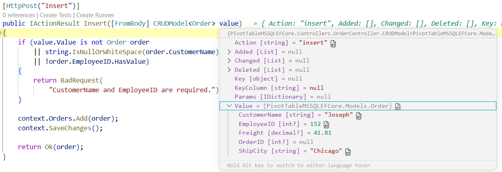
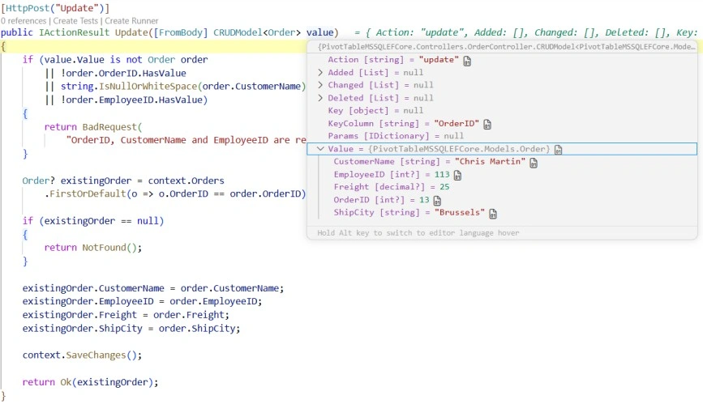
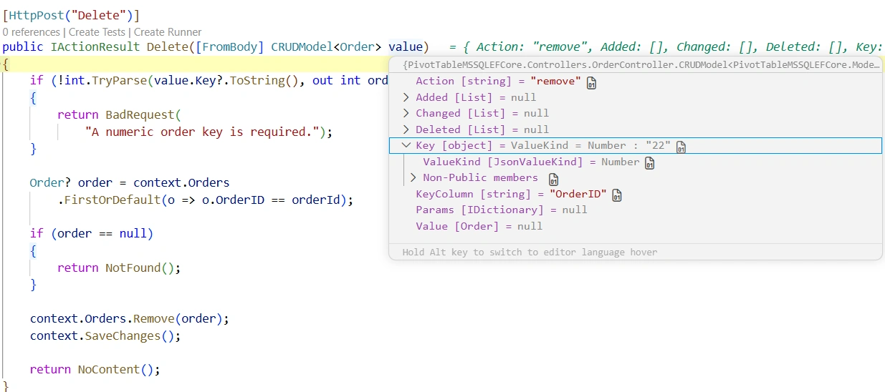

# Connecting SQL Server to Blazor Pivot Table Using Entity Framework Core

The [Blazor Pivot Table](https://www.syncfusion.com/blazor-components/blazor-pivottable) can be connected to a Microsoft SQL Server database using Entity Framework Core. This approach provides a clean and maintainable data-access layer for Blazor applications while keeping the Pivot Table integration simple and scalable.

**What is Entity Framework Core?**

Entity Framework Core is a modern object-relational mapper (ORM) for .NET. It lets developers work with strongly typed .NET objects while EF Core translates these operations into SQL statements for SQL Server. This makes the application easier to maintain and reduces the amount of manual SQL code required.

**Key Benefits of Entity Framework Core**

- **Structured Data Access**: Work with entities and DbContext instead of manually composing SQL statements.
- **Strongly Typed Models**: Build applications around C# classes that map directly to database tables.
- **Simplified CRUD**: Perform create, read, update, and delete operations through EF Core methods.
- **Database Abstraction**: Focus on application logic while EF Core handles the database interaction.
- **Scalable Architecture**: Separate models, DbContext, and controllers for cleaner application design.

## Prerequisites

Ensure the following software and packages are installed before proceeding:

| Software/Package | Version | Purpose |
|------------------|---------|---------|
| Visual Studio 2022 / VS Code | Latest | Development environment with the Blazor workload |
| .NET SDK | net10.0 or compatible | Runtime and build tools |
| SQL Server | 2019 or later | Database server |
| Syncfusion.Blazor.PivotTable | Latest | Pivot Table UI component |
| Syncfusion.Blazor.Themes | Latest | Styling for Pivot Table components |
| Microsoft.EntityFrameworkCore.SqlServer | Latest | SQL Server provider for EF Core |
| Microsoft.EntityFrameworkCore.Tools | Latest | EF Core tooling support |
| Newtonsoft.Json | Latest | JSON serialization for CRUD models |

## Architecture and Data Flow

The sample follows a remote data binding architecture where the Blazor Pivot Table does not communicate with SQL Server directly.

```text
Syncfusion Blazor Pivot Table
       ↓
ASP.NET Core Controller
       ↓
ApplicationDbContext
       ↓
Entity Framework Core
       ↓
SQL Server
```

The request flow is as follows:

1. The Pivot Table sends data requests through the URL adaptor.
2. The ASP.NET Core controller receives the request and uses ApplicationDbContext.
3. Entity Framework Core translates the request into the appropriate SQL operation against SQL Server.
4. The returned rows are mapped to C# entity objects and sent back to the Pivot Table.

## Setting Up the SQL Server Environment with Entity Framework Core

### Step 1: Create the database and table in SQL Server

First, create the SQL Server database structure that will store the order records used by the Pivot Table.

**Instructions (SQL Server Management Studio or Azure Data Studio):**

1. Open SQL Server Management Studio (SSMS) and connect to your local SQL Server instance.
2. Right-click **Databases** and choose **New Database**.
3. Enter the name `OrderDB` and create the database.
4. Open a new query window and run the SQL script below.
5. Verify the table and sample rows with the query shown after the script.

Run the following SQL script:

```sql
CREATE DATABASE OrderDB;
GO

USE OrderDB;
GO

CREATE TABLE Orders
(
    OrderID        INT IDENTITY(1, 1) PRIMARY KEY,
    CustomerName   VARCHAR(100) NULL,
    EmployeeID     INT NULL,
    ShipCity       VARCHAR(100) NULL,
    Freight        DECIMAL(10, 2) NULL
);
GO
```

Optional sample data:

```sql
INSERT INTO Orders (CustomerName, EmployeeID, ShipCity, Freight) VALUES
('Toms',   1, 'New York',  35.30),
('Ravi',   2, 'London',    80.20),
('Sven',   1, 'Berlin',    52.10),
('Sara',   3, 'Madrid',    18.40),
('Paul',   2, 'Tokyo',     64.75);
GO
```

After executing these statements, the SQL Server database is ready for integration with the Blazor Pivot Table.

The following SQL statement is used to read the records from the `Orders` table and provide them to the Pivot Table through Entity Framework Core:

```sql
SELECT OrderID, CustomerName, EmployeeID, ShipCity, Freight
FROM Orders
ORDER BY OrderID;
```

This query provides the source rows that EF Core materializes into `Order` entities and sends to the Pivot Table for aggregation and display.

The screenshot below shows the SQL query and the resulting rows from the `Orders` table that EF Core uses to populate the Pivot Table data model.


**Purpose:** This validation step confirms that the database table is available and that the sample rows can be read before the Blazor application is connected to SQL Server.

## Step 2: Install Required NuGet Packages

The Blazor Web App project is the one that will receive the Syncfusion and EF Core packages.

### Method 1: Using the .NET CLI

```bash
dotnet add package Syncfusion.Blazor.PivotTable --version 34.1.32
dotnet add package Syncfusion.Blazor.Themes --version 34.1.32
dotnet add package Newtonsoft.Json --version 13.0.3
dotnet add package Microsoft.EntityFrameworkCore.SqlServer --version 9.0.0
dotnet add package Microsoft.EntityFrameworkCore.Tools --version 9.0.0
```

### Method 2: Using NuGet Package Manager UI

1. Open Visual Studio and navigate to **Tools → NuGet Package Manager → Manage NuGet Packages for Solution**.
2. Search for and install each package individually:

- `Syncfusion.Blazor.PivotTable`
- `Syncfusion.Blazor.Themes`
- `Newtonsoft.Json`
- `Microsoft.EntityFrameworkCore.SqlServer`
- `Microsoft.EntityFrameworkCore.Tools`

All required packages are now installed.

**Project file reference:** The installed packages appear in the project file as package references for the Syncfusion UI components and EF Core SQL provider.

## Step 3: Configure the Connection String

The connection string is stored in `appsettings.json` under the `ConnectionStrings` section.

```json
{
  "ConnectionStrings": {
    "SQLServer": "Server=<SERVER_NAME>;Database=OrderDB;User Id=<USER_ID>;Password=<PASSWORD>;TrustServerCertificate=True;"
  },
  "Logging": {
    "LogLevel": {
      "Default": "Information",
      "Microsoft.AspNetCore": "Warning"
    }
  },
  "AllowedHosts": "*"
}
```

Replace the placeholder values with the values that match your SQL Server environment:

- `Server`: SQL Server host name or instance name.
- `Database`: Database name, such as `OrderDB`.
- `User Id`: SQL Server login name.
- `Password`: SQL Server login password.
- `TrustServerCertificate`: Set to `True` for local development scenarios when needed.

**Connection string components:**

| Component | Description |
|-----------|-------------|
| Server | The name of the SQL Server instance or host address |
| Database | The database that contains the `Orders` table |
| User Id | The SQL login used to connect to the database |
| Password | The password for that SQL login |
| TrustServerCertificate | Enables trusted local-development connections when required |

**Security note:** Avoid storing production credentials directly in source control. For local development, consider using user secrets or environment variables such as `ConnectionStrings__SQLServer`.

## Step 4: Create the Entity Model

The sample uses a `Order` entity model to represent each row in the `Orders` table. This model is defined in the `Models` folder.

Create a file named `Models/Order.cs` with the following implementation:

```csharp
using System.ComponentModel.DataAnnotations;

namespace PivotTableMSSQLEFCore.Models
{
    public class Order
    {
        [Key]
        public int? OrderID { get; set; }

        public string? CustomerName { get; set; }

        public int? EmployeeID { get; set; }

        public decimal? Freight { get; set; }

        public string? ShipCity { get; set; }
    }
}
```

This model is the shape used by EF Core when reading data from and writing data to the `Orders` table.

**Important details:**
- The property names should align closely with the SQL column names to reduce mapping confusion.
- The `[Key]` attribute marks `OrderID` as the primary key and helps the CRUD operations identify the record to update or delete.
- Nullable properties are used here because the sample table allows null values for several columns.

## Step 5: Create the DbContext

Entity Framework Core uses `DbContext` to manage the entity model and expose the database set. Create a `Data/ApplicationDbContext.cs` file with the following implementation:

```csharp
using Microsoft.EntityFrameworkCore;
using PivotTableMSSQLEFCore.Models;

namespace PivotTableMSSQLEFCore.Data
{
    public class ApplicationDbContext : DbContext
    {
        public ApplicationDbContext(
            DbContextOptions<ApplicationDbContext> options)
            : base(options)
        {
        }

        public DbSet<Order> Orders { get; set; }
    }
}
```

The `DbSet<Order>` property maps the `Order` entity to the `Orders` table in SQL Server.

**Why this matters:** The `DbContext` is the bridge between the ASP.NET Core application and SQL Server. It tracks entities, generates SQL commands, and exposes the `Orders` set that the controller uses for reading and writing data.

## Step 6: Register Services in Program.cs

Update `Program.cs` to register the required Syncfusion, Razor component, API controller, and Entity Framework Core services.

```csharp
using Microsoft.EntityFrameworkCore;
using PivotTableMSSQLEFCore.Components;
using PivotTableMSSQLEFCore.Data;
using Syncfusion.Blazor;

var builder = WebApplication.CreateBuilder(args);

builder.Services.AddSyncfusionBlazor();

builder.Services.AddRazorComponents()
    .AddInteractiveServerComponents();

builder.Services.AddControllers();

builder.Services.AddDbContext<ApplicationDbContext>(options =>
    options.UseSqlServer(
        builder.Configuration.GetConnectionString("SQLServer")));

var app = builder.Build();

if (!app.Environment.IsDevelopment())
{
    app.UseExceptionHandler("/Error", createScopeForErrors: true);
    app.UseHsts();
}

app.UseHttpsRedirection();
app.MapControllers();

app.UseAntiforgery();

app.MapStaticAssets();
app.MapRazorComponents<App>()
    .AddInteractiveServerRenderMode();

app.Run();
```

This registration ensures that the controller receives an `ApplicationDbContext` instance that is already configured to use the SQL Server connection string.

**What each registration does:**
- `AddSyncfusionBlazor()` enables the Pivot Table component and its supporting services.
- `AddRazorComponents()` and `AddInteractiveServerComponents()` prepare the Blazor app for interactive rendering.
- `AddControllers()` exposes the API endpoints used by the URL Adaptor.
- `AddDbContext<ApplicationDbContext>()` wires EF Core to the SQL Server connection string from `appsettings.json`.

## Step 7: Create the Controller with Entity Framework Core

The controller acts as the bridge between the Blazor Pivot Table and the EF Core data layer. It exposes the API endpoints that the `SfDataManager` uses for reading and CRUD operations. By keeping the database logic in the controller and the entity mapping in the model and DbContext, the sample remains clean and easy to extend.

The Pivot Table sample uses an ASP.NET Core controller to expose REST endpoints for the Pivot Table. The controller uses `ApplicationDbContext` and EF Core to read and write records. The read action returns the data in the `{ result, count }` format expected by the URL Adaptor, while the insert, update, and delete actions accept `CRUDModel<Order>` payloads sent by the pivot table.

Create a controller named `OrderController` in the `Controllers` folder with the following implementation:

```csharp
using System.Text.Json.Serialization;
using Microsoft.AspNetCore.Mvc;
using PivotTableMSSQLEFCore.Data;
using PivotTableMSSQLEFCore.Models;
using Syncfusion.Blazor.Data;
using Syncfusion.Blazor;

namespace PivotTableMSSQLEFCore.Controllers
{
    [ApiController]
    [Route("api/[controller]")]
    public class OrderController : ControllerBase
    {
        private readonly ApplicationDbContext context;

        public OrderController(ApplicationDbContext context)
        {
            this.context = context;
        }

        [HttpPost]
        public object Post([FromBody] DataManagerRequest request)
        {
            _ = request;

            List<Order> dataSource = GetOrderData();

            return new
            {
                result = dataSource,
                count = dataSource.Count
            };
        }

        private List<Order> GetOrderData()
        {
            return context.Orders
                .OrderBy(o => o.OrderID)
                .ToList();
        }

        [HttpPost("Insert")]
        public IActionResult Insert([FromBody] CRUDModel<Order> value)
        {
            if (value.Value is not Order order
                || string.IsNullOrWhiteSpace(order.CustomerName)
                || !order.EmployeeID.HasValue)
            {
                return BadRequest(
                    "CustomerName and EmployeeID are required.");
            }

            context.Orders.Add(order);
            context.SaveChanges();

            return Ok(order);
        }

        [HttpPost("Update")]
        public IActionResult Update([FromBody] CRUDModel<Order> value)
        {
            if (value.Value is not Order order
                || !order.OrderID.HasValue
                || string.IsNullOrWhiteSpace(order.CustomerName)
                || !order.EmployeeID.HasValue)
            {
                return BadRequest(
                    "OrderID, CustomerName and EmployeeID are required.");
            }

            Order? existingOrder = context.Orders
                .FirstOrDefault(o => o.OrderID == order.OrderID);

            if (existingOrder == null)
            {
                return NotFound();
            }

            existingOrder.CustomerName = order.CustomerName;
            existingOrder.EmployeeID = order.EmployeeID;
            existingOrder.Freight = order.Freight;
            existingOrder.ShipCity = order.ShipCity;

            context.SaveChanges();

            return Ok(existingOrder);
        }

        [HttpPost("Delete")]
        public IActionResult Delete([FromBody] CRUDModel<Order> value)
        {
            if (!int.TryParse(value.Key?.ToString(), out int orderId))
            {
                return BadRequest(
                    "A numeric order key is required.");
            }

            Order? order = context.Orders
                .FirstOrDefault(o => o.OrderID == orderId);

            if (order == null)
            {
                return NotFound();
            }

            context.Orders.Remove(order);
            context.SaveChanges();

            return NoContent();
        }

        public class CRUDModel<T> where T : class
        {
            [JsonPropertyName("action")]
            public string? Action { get; set; }

            [JsonPropertyName("keyColumn")]
            public string? KeyColumn { get; set; }

            [JsonPropertyName("key")]
            public object? Key { get; set; }

            [JsonPropertyName("value")]
            public T? Value { get; set; }

            [JsonPropertyName("added")]
            public List<T>? Added { get; set; }

            [JsonPropertyName("changed")]
            public List<T>? Changed { get; set; }

            [JsonPropertyName("deleted")]
            public List<T>? Deleted { get; set; }

            [JsonPropertyName("params")]
            public IDictionary<string, object>? Params { get; set; }
        }
    }
}
```

### How Entity Framework Core maps data to C# objects

Entity Framework Core maps rows from the `Orders` table into the `Order` class using the `DbSet<Order>` exposed by `ApplicationDbContext`. The controller retrieves the data by calling `context.Orders` and uses LINQ to order the results before materializing them into `Order` objects.

This means the following table columns:

- `OrderID`
- `CustomerName`
- `EmployeeID`
- `Freight`
- `ShipCity`

are mapped directly to the corresponding properties of the `Order` model.

The benefit of this approach is that the controller does not need to manually build a data table or manually map each column. EF Core handles the translation between SQL rows and .NET objects so the application code stays focused on business and UI logic.

## Step 8: Configure the Pivot Table with the URL Adaptor

The pivot table binds to the SQL Server-backed API through the `SfDataManager` configured with `Adaptors.UrlAdaptor`. The `Url`, `InsertUrl`, `UpdateUrl`, and `RemoveUrl` properties point at the controller actions created in the previous step.

Open the file named `Home.razor` in the `Components/Pages` folder and replace its contents with the following markup:

```razor
@page "/"
@using Syncfusion.Blazor.Data
@using Syncfusion.Blazor.PivotView

<SfPivotView TValue="Order" Width="1000" Height="300" ShowFieldList="true">
    <PivotViewDataSourceSettings TValue="Order" ExpandAll=false EnableSorting=true>
    <SfDataManager Url="http://localhost:5145/api/Order"
                   InsertUrl="http://localhost:5145/api/Order/Insert"
                   UpdateUrl="http://localhost:5145/api/Order/Update"
                   RemoveUrl="http://localhost:5145/api/Order/Delete"
                   Adaptor="Adaptors.UrlAdaptor"></SfDataManager>
        <PivotViewColumns>
            <PivotViewColumn Name="EmployeeID"></PivotViewColumn>
        </PivotViewColumns>
        <PivotViewRows>
            <PivotViewRow Name="CustomerName"></PivotViewRow>
        </PivotViewRows>
        <PivotViewValues>
            <PivotViewValue Name="Freight" Caption="Freight"></PivotViewValue>
        </PivotViewValues>
    </PivotViewDataSourceSettings>
    <PivotViewGridSettings ColumnWidth="120"></PivotViewGridSettings>
    <PivotViewEvents TValue="Order" BeginDrillThrough="beginDrillThrough"></PivotViewEvents>
    <PivotViewCellEditSettings AllowEditing=true AllowAdding=true AllowDeleting=true
                               Mode=Syncfusion.Blazor.PivotView.EditMode.Normal></PivotViewCellEditSettings>
</SfPivotView>

@code{
    private void beginDrillThrough(BeginDrillThroughEventArgs args)
    {
        for (int i = 0; i < args.GridObj.Columns.Count; i++)
        {
            if (args.GridObj.Columns[i].Field == "OrderID")
            {
                args.GridObj.Columns[i].IsPrimaryKey = true;
            }
            else
            {
                args.GridObj.Columns[i].Visible = true;
            }
        }
    }

    SfPivotView<Order> pivot { get; set; }

    public List<Order> Orders { get; set; }

    public class Order
    {
        public int OrderID { get; set; }
        public string CustomerName { get; set; }
        public int EmployeeID { get; set; }
        public decimal Freight { get; set; }
        public string ShipCity { get; set; }
    }
}
```

The Home component has been updated successfully with the Pivot Table.

**Important implementation details:**
- Absolute URLs such as `http://localhost:5145/api/Order` are convenient for first-time validation, but relative URLs also work when the Blazor app and API share the same origin.
- The `BeginDrillThrough` event is essential for CRUD because it marks `OrderID` as the primary key of the edit dialog grid so update and delete operations can target the correct record.
- The field arrangement in `PivotViewDataSourceSettings` defines the default layout that the Pivot Table uses when it first renders.

**Component Explanation:**

- **`<SfPivotView TValue="Order">`**: The pivot table component bound to the `Order` type.
- **`ShowFieldList="true"`**: Displays the field list UI so end users can drag fields between rows, columns, and values at runtime.
- **`<PivotViewDataSourceSettings>`**: Defines the default field arrangement—`EmployeeID` as a column, `CustomerName` as a row, and `Freight` as a value.
- **`<SfDataManager>`**: Wires the pivot table to the API through the URL Adaptor. The four URLs map directly to the controller actions.
- **`<PivotViewCellEditSettings>`**: Enables cell-level editing, adding, and deleting in `Normal` edit mode.
- **`BeginDrillThrough` event**: When a user opens the edit dialog from a pivot cell, this handler runs and marks `OrderID` as the primary key so insert, update, and delete operations can target the correct record.

The screenshot below shows the Blazor Pivot Table rendered with EF Core-backed data from SQL Server.


**Image Content:**
- The Blazor application running in the browser.
- The `SfPivotView` rendered with rows, columns, and values configured for the sample.
- The Field List panel open or accessible, demonstrating runtime layout customization.
- Aggregated subtotals and grand totals visible in the pivot body.

## Step 9: Run the Application

> **URL Note:** The sample uses absolute URLs such as `http://localhost:5145/api/Order` in the `SfDataManager` configuration. These values match the application URL defined in `Properties/launchSettings.json` and make the first-run validation straightforward. If you switch to HTTPS or change the port, update the URLs in `Home.razor` to match the running application URL.

Build and run the application.

```bash
dotnet build
dotnet run
```

Open the application in your browser and navigate to the local development URL. The Pivot Table loads data from SQL Server through the controller and Entity Framework Core.

## URL Adaptor Configuration

The URL Adaptor is the contract between the Blazor Pivot Table and the SQL Server-backed API. It works as follows:

1. The Pivot Table serializes its current data state into a `DataManagerRequest`.
2. The `SfDataManager` posts that object to the `Url` endpoint.
3. The controller deserializes the request, uses EF Core to read or change data, and returns the response in the format expected by the Pivot Table.
4. For write operations, the Pivot Table posts a `CRUDModel<Order>` payload to the matching insert, update, or remove endpoint.

1. The Pivot Table serializes its current data state into a `DataManagerRequest`.
2. The `SfDataManager` posts that object to the `Url` endpoint.
3. The controller uses `ApplicationDbContext` and EF Core to retrieve or change data.
4. For write operations, the Pivot Table posts a `CRUDModel<Order>` payload to the matching insert, update, or remove endpoint.

```razor
<SfDataManager Url="http://localhost:5145/api/Order"
               InsertUrl="http://localhost:5145/api/Order/Insert"
               UpdateUrl="http://localhost:5145/api/Order/Update"
               RemoveUrl="http://localhost:5145/api/Order/Delete"
               Adaptor="Adaptors.UrlAdaptor">
</SfDataManager>
```

| Property | Purpose | Controller Action |
|----------|---------|-------------------|
| `Url` | Reads data from the server | `POST /api/Order` |
| `InsertUrl` | Adds a new record | `POST /api/Order/Insert` |
| `UpdateUrl` | Updates an existing record | `POST /api/Order/Update` |
| `RemoveUrl` | Deletes a record | `POST /api/Order/Delete` |

## API Endpoints

The `OrderController` exposes the following REST endpoints:

| Method | Route | Payload | Description |
|--------|-------|---------|-------------|
| `POST` | `/api/Order` | `DataManagerRequest` | Returns all order records as `{ result, count }`. |
| `POST` | `/api/Order/Insert` | `CRUDModel<Order>` | Inserts a new order into the `Orders` table. |
| `POST` | `/api/Order/Update` | `CRUDModel<Order>` | Updates an existing order filtered by `OrderID`. |
| `POST` | `/api/Order/Delete` | `CRUDModel<Order>` | Deletes an order using the numeric key. |

**Sample read response:**

```json
{
  "result": [
    { "orderID": 1, "customerName": "Toms", "employeeID": 1, "shipCity": "New York", "freight": 35.30 },
    { "orderID": 2, "customerName": "Ravi", "employeeID": 2, "shipCity": "London", "freight": 80.20 }
  ],
  "count": 2
}
```

## CRUD Operations

The Pivot Table performs CRUD operations through the edit dialog and cell editing. Each operation calls the corresponding controller endpoint, which uses Entity Framework Core to persist the change to SQL Server.

The flow is consistent for every action:

1. The user edits or adds data in the Pivot Table UI.
2. The Pivot Table posts the relevant payload to the controller endpoint.
3. The controller validates the payload and uses `ApplicationDbContext` to interact with SQL Server.
4. EF Core executes the appropriate database operation and returns a response to the client.

### Data retrieval operation

**Purpose:**
The read operation loads the SQL Server rows into the Pivot Table so the summarized view can render. The controller receives the request from the URL Adaptor and executes a LINQ query through `ApplicationDbContext`.

**Request flow:**
1. The Pivot Table sends a `DataManagerRequest` to the `Url` endpoint.
2. The controller receives the request and calls `GetOrderData()`.
3. EF Core executes the query against the `Orders` table and maps the rows to `Order` entities.
4. The controller returns `{ result, count }` to the Pivot Table.

**How it works:**
The `GetOrderData()` helper uses the `Orders` DbSet to query the database in a strongly typed way. The result is materialized as a list of `Order` objects and returned to the Pivot Table.

**Controller code snippet:**

```csharp
private List<Order> GetOrderData()
{
    return context.Orders
        .OrderBy(o => o.OrderID)
        .ToList();
}
```

This code sample shows how the controller executes the EF Core query, materializes the results into `Order` entities, and returns them to the Pivot Table.

> Note: the repository does not include a dedicated read-operation screenshot for this EF Core sample.

**Image Content:**
- The `GetOrderData` method in the controller.
- The `Order` records retrieved through Entity Framework Core.
- The data model values returned to the Pivot Table.

### Insert operation

**Purpose:**
The insert operation adds a new order to the SQL Server database from the Pivot Table edit dialog. The request is posted to `/api/Order/Insert`, where the controller validates the payload and asks EF Core to add the entity.

**Request flow:**
1. The user adds a row in the Pivot Table edit dialog.
2. The Pivot Table posts the `CRUDModel<Order>` payload to the `InsertUrl` endpoint.
3. The controller validates the values and calls `context.Orders.Add(order)`.
4. EF Core persists the new record to SQL Server and the Pivot Table refreshes its summarized view.

**How it works:**
The insert action receives the new row through the `value` property of the `CRUDModel<Order>`. The controller checks that the payload is present and then adds the entity to the EF Core context. The `OrderID` column is omitted from the insert because it is an identity column in SQL Server. On success, the action returns `Ok(order)` so the client can refresh the data source.

**Controller code snippet:**

```csharp
[HttpPost("Insert")]
public IActionResult Insert([FromBody] CRUDModel<Order> value)
{
    if (value.Value is not Order order
        || string.IsNullOrWhiteSpace(order.CustomerName)
        || !order.EmployeeID.HasValue)
    {
        return BadRequest(
            "CustomerName and EmployeeID are required.");
    }

    context.Orders.Add(order);
    context.SaveChanges();

    return Ok(order);
}
```

The screenshot below shows the `CRUDModel<Order>` value received by the insert action.



**Image Content:**
- The `Insert` action of `OrderController` open in the editor.
- The `Value` parameter carrying the new order fields.
- The new entity being added to the EF Core context.

### Update operation

**Purpose:**
The update operation modifies an existing order directly from the Pivot Table edit dialog. The request is posted to `/api/Order/Update`, where the controller locates the entity and applies the changes through EF Core.

**Request flow:**
1. The user edits a row in the edit dialog and saves the change.
2. The Pivot Table posts the edited row to the `UpdateUrl` endpoint.
3. The controller loads the tracked entity from `context.Orders`, updates its values, and calls `SaveChanges()`.
4. SQL Server updates the matching record and the Pivot Table refreshes the aggregated view.

**How it works:**
The update action uses the edited row from the `value` property and relies on `OrderID` as the key to identify the existing record. This is why the drill-through grid must mark `OrderID` as the primary key before the edit dialog is used. EF Core tracks the entity and generates the appropriate SQL update when `SaveChanges()` is called.

**Controller code snippet:**

```csharp
[HttpPost("Update")]
public IActionResult Update([FromBody] CRUDModel<Order> value)
{
    if (value.Value is not Order order
        || !order.OrderID.HasValue
        || string.IsNullOrWhiteSpace(order.CustomerName)
        || !order.EmployeeID.HasValue)
    {
        return BadRequest(
            "OrderID, CustomerName and EmployeeID are required.");
    }

    Order? existingOrder = context.Orders
        .FirstOrDefault(o => o.OrderID == order.OrderID);

    if (existingOrder == null)
    {
        return NotFound();
    }

    existingOrder.CustomerName = order.CustomerName;
    existingOrder.EmployeeID = order.EmployeeID;
    existingOrder.Freight = order.Freight;
    existingOrder.ShipCity = order.ShipCity;

    context.SaveChanges();

    return Ok(existingOrder);
}
```

The screenshot below shows the `CRUDModel<Order>` value received by the update action.



**Image Content:**
- The `Update` action of `OrderController` open in the editor.
- The `Value` parameter carrying the modified order fields.
- The `OrderID` used as the filter for the update.

### Delete operation

**Purpose:**
The delete operation removes an order from the SQL Server table. The Pivot Table posts a key value to `/api/Order/Delete`, and the controller uses EF Core to remove the entity.

**Request flow:**
1. The user selects a row in the edit dialog and deletes it.
2. The Pivot Table posts the primary key to the `RemoveUrl` endpoint.
3. The controller loads the entity and calls `context.Orders.Remove(order)`.
4. EF Core deletes the matching row in SQL Server and the Pivot Table refreshes to reflect the change.

**How it works:**
The delete action receives the primary key in the `key` property of the `CRUDModel<Order>`. The controller parses that value, finds the matching entity, removes it from the EF Core context, and commits the change with `SaveChanges()`. If the key does not match any row, the action returns `NotFound`.

**Controller code snippet:**

```csharp
[HttpPost("Delete")]
public IActionResult Delete([FromBody] CRUDModel<Order> value)
{
    if (!int.TryParse(value.Key?.ToString(), out int orderId))
    {
        return BadRequest(
            "A numeric order key is required.");
    }

    Order? order = context.Orders
        .FirstOrDefault(o => o.OrderID == orderId);

    if (order == null)
    {
        return NotFound();
    }

    context.Orders.Remove(order);
    context.SaveChanges();

    return NoContent();
}
```

The screenshot below shows the `CRUDModel<Order>` value received by the delete action.



**Image Content:**
- The `Delete` action of `OrderController` open in the editor.
- The `Key` parameter carrying the primary key of the deleted record.
- The entity being removed from the EF Core context.

### Enabling CRUD through the edit dialog

For CRUD operations to work correctly, the primary key column must be marked. The `BeginDrillThrough` event handler does this dynamically when the edit dialog opens:

```csharp
private void beginDrillThrough(BeginDrillThroughEventArgs args)
{
    for (int i = 0; i < args.GridObj.Columns.Count; i++)
    {
        if (args.GridObj.Columns[i].Field == "OrderID")
        {
            args.GridObj.Columns[i].IsPrimaryKey = true;
        }
        else
        {
            args.GridObj.Columns[i].Visible = true;
        }
    }
}
```

This step is required so the URL Adaptor knows which column to send as the key for update and delete operations.

## Run the Application

**Build the Application**

1. Open the terminal or Package Manager Console in Visual Studio.
2. Navigate to the project directory.
3. Run the following command to restore packages and build:

```powershell
dotnet restore
dotnet build
```

**Run the Application**

Execute the following command:

```powershell
dotnet run
```

**Access the Application**

1. Open a web browser.
2. Navigate to the URL shown in the terminal output (for example, `http://localhost:5145`).
3. The SQL Server-backed Pivot Table is now running with read and CRUD support.

## Troubleshooting

| Symptom | Likely Cause | Resolution |
|---------|--------------|------------|
| Pivot Table shows no data | Controller not reachable or API returned an error | Verify the application is running and inspect the browser network panel. |
| `405 Method Not Allowed` on read | The `POST /api/Order` action is missing or routed incorrectly | Confirm `OrderController` is decorated with `[ApiController]`, the `Post` action has `[HttpPost]`, and `AddControllers()` + `MapControllers()` are present in `Program.cs`. |
| `SqlException` or `Cannot connect to server` | SQL Server is not running or configuration is wrong | Start the SQL Server service and confirm the `Server`, `Database`, `User Id`, and `Password` values in the connection string. |
| `Invalid object name 'Orders'` | Table not created or wrong database | Run the SQL script in Step 1 against the `OrderDB` database. |
| Insert/Update/Delete does nothing | The edit dialog does not send a valid primary key | Confirm `OrderID` is present in the payload and marked with `[Key]` in the model. |
| CRUD changes do not persist | Validation or database command failed | Inspect the API response and server logs; verify required fields and table permissions. |
| `Login failed for user '<USER_ID>'` | SQL Server login not mapped to a database user, or wrong credentials | Verify the SQL Server login exists and has the required permissions on `OrderDB.Orders`. |

## Complete Implementation

The complete implementation is assembled across the earlier steps:

1. The `appsettings.json` connection-string configuration and the controller are provided in Steps 3 and 7.
2. Service registration for Syncfusion Blazor, Razor components, API controllers, and EF Core is provided in Step 6.
3. `Home.razor`, the URL adaptor configuration, and the `BeginDrillThrough` event handler are provided in Step 8.

The sample uses the `appsettings.json`-based connection string, EF Core entity mapping, and the URL Adaptor to connect the Syncfusion Blazor Pivot Table to SQL Server.

## Complete Sample Repository

A complete, working sample implementation is available in the [GitHub repository](https://github.com/SyncfusionExamples/syncfusion-blazor-pivot-table-entity-framework-multi-database-binding-sample/tree/master)

## Summary

This guide demonstrates how to:

1. Create a SQL Server database with order records using SQL Server Management Studio.
2. Create the Blazor Web App and install the Syncfusion and Entity Framework Core packages.
3. Configure the connection string in `appsettings.json` and read it through the EF Core service registration.
4. Implement an `OrderController` with read and CRUD endpoints using Entity Framework Core.
5. Register Syncfusion Blazor services, Razor components, and EF Core in `Program.cs`.
6. Configure the Pivot Table with `SfDataManager` and `Adaptors.UrlAdaptor`.
7. Run the application and verify the wired-up Pivot Table against the validation checklist and troubleshooting steps.

The application now provides a complete sample for summarizing and editing SQL Server data with a modern Pivot Table interface using Entity Framework Core.