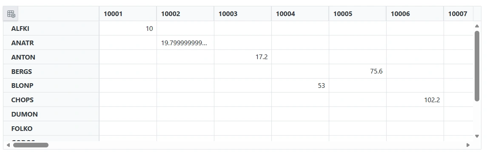
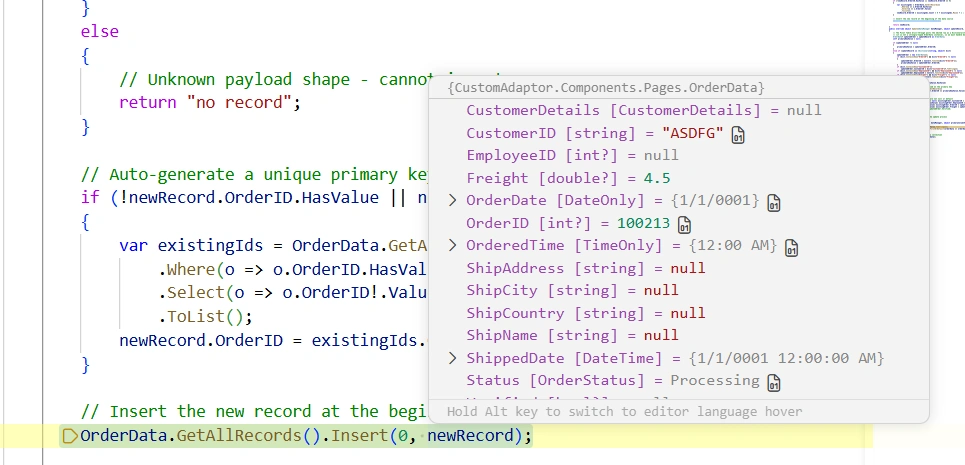
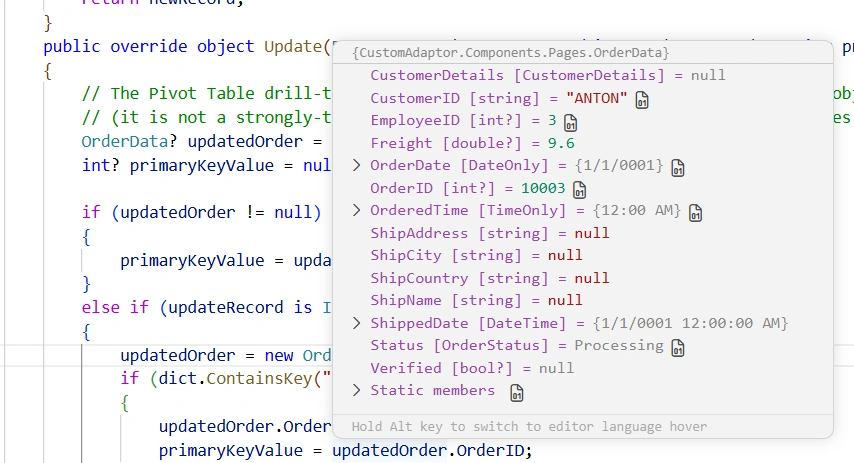
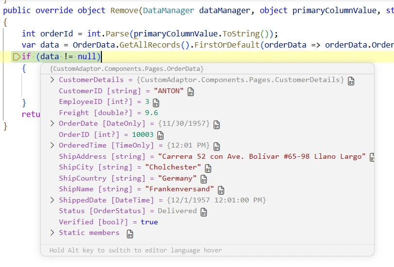

# Custom Binding in Blazor PivotView

The [SfDataManager](https://help.syncfusion.com/cr/blazor/Syncfusion.Blazor.Data.SfDataManager.html) supports custom adaptors, enabling you to perform manual operations on the data. This feature is useful for implementing custom data binding and CRUD operations in the Blazor PivotView.

To implement custom data binding in the PivotView, the **DataAdaptor** abstract class is used as the base class for the custom adaptor.

## Prerequisites

Before implementing a custom adaptor, ensure the following are in place:

- A Blazor Server or Blazor Web App project (.NET 6.0 or later).
- The **Syncfusion.Blazor.PivotView** NuGet package added to the project. Register the Syncfusion Blazor service in `Program.cs` (`builder.Services.AddSyncfusionBlazor()`).
- The `@using Syncfusion.Blazor.Data` and `@using Syncfusion.Blazor.PivotView` directives available in the component (or registered in `_Imports.razor`).
- The **DataAdaptor** abstract class lives in the `Syncfusion.Blazor.Data` namespace.

> The async CRUD variants (`InsertAsync`, `UpdateAsync`, `RemoveAsync`, `ReadAsync`) follow the same signatures as their synchronous counterparts and can be overridden when non-blocking data access is required. The samples below use the synchronous forms for brevity.

The **DataAdaptor** abstract class includes both synchronous and asynchronous method signatures, which can be overridden in the custom adaptor. The following are the method signatures available in this class:

```csharp
public abstract class DataAdaptor
{
    /// <summary>
    /// Performs data read operation synchronously.
    /// </summary>
    public virtual object Read(DataManagerRequest dataManagerRequest, string key = null)

    /// <summary>
    /// Performs data read operation asynchronously.
    /// </summary>
    public virtual Task<object> ReadAsync(DataManagerRequest dataManagerRequest, string key = null)

    /// <summary>
    /// Performs insert operation synchronously.
    /// </summary>
    public virtual object Insert(DataManager dataManager, object data, string additionalParam)
    /// <summary>
    /// Performs insert operation asynchronously.
    /// </summary>
    public virtual Task<object> InsertAsync(DataManager dataManager, object data, string additionalParam)

    /// <summary>
    /// Performs remove operation synchronously.
    /// </summary>
    public virtual object Remove(DataManager dataManager, object data, string keyField, string additionalParam)

    /// <summary>
    /// Performs remove operation asynchronously.
    /// </summary>
    public virtual Task<object> RemoveAsync(DataManager dataManager, object data, string keyField, string additionalParam)

    /// <summary>
    /// Performs update operation synchronously.
    /// </summary>
    public virtual object Update(DataManager dataManager, object data, string keyField, string additionalParam)

    /// <summary>
    /// Performs update operation asynchronously.
    /// </summary>
    public virtual Task<object> UpdateAsync(DataManager dataManager, object data, string keyField, string additionalParam)
}
```

## Overview of Custom Adaptor in PivotView

Unlike the built-in `UrlAdaptor` or `WebApiAdaptor`, the Custom Adaptor gives you direct control over the data binding workflow. In the PivotView, the Custom Adaptor is used only for **CRUD operations** in the editing popup — all aggregation, grouping, sorting, filtering, and paging of the pivot result are performed client-side by the PivotView engine itself.

- **Data Retrieval**: The `Read` method returns the raw data source; aggregation/grouping happens in the PivotView, not in the adaptor.
- **CRUD Operations**: Handle Insert, Update, and Delete operations raised by the editing popup (`Insert`, `Update`, `Remove`).

The Custom Adaptor is particularly useful for the PivotView's editing popup, which allows users to edit, add, or delete records directly from the pivot table's detailed view (referred to throughout this document as the "editing popup").

## Data Binding

Custom data binding in the Blazor PivotView requires a custom adaptor class. The adaptor extends the **DataAdaptor** abstract class by overriding the **Read** or **ReadAsync** method.

> The `OrderData` model used in this sample is defined in the [OrderData Model Class](#orderdata-model-class) section below.

The following sample code demonstrates how to implement custom data binding using a custom adaptor in a PivotView:

```cshtml
@page "/"

@using Syncfusion.Blazor.PivotView
@using Syncfusion.Blazor.Data

<SfPivotView TValue="OrderData" Width="1000" Height="300" ShowFieldList="true">
    <PivotViewDataSourceSettings TValue="OrderData" ExpandAll=false EnableSorting=true>
        <SfDataManager AdaptorInstance="@typeof(CustomAdaptor)" Adaptor="Adaptors.CustomAdaptor"></SfDataManager>
        <PivotViewColumns>
            <PivotViewColumn Name="OrderID"></PivotViewColumn>
        </PivotViewColumns>
        <PivotViewRows>
            <PivotViewRow Name="CustomerID"></PivotViewRow>
        </PivotViewRows>
        <PivotViewValues>
            <PivotViewValue Name="Freight" Caption="Freight"></PivotViewValue>
        </PivotViewValues>
    </PivotViewDataSourceSettings>
    <PivotViewGridSettings ColumnWidth="120"></PivotViewGridSettings>
    <PivotViewEvents TValue="OrderData" BeginDrillThrough="BeginDrillThrough"></PivotViewEvents>
    <PivotViewCellEditSettings AllowEditing=true AllowAdding=true AllowDeleting=true Mode=Syncfusion.Blazor.PivotView.EditMode.Normal></PivotViewCellEditSettings>
</SfPivotView>

@code {
    // Configure BeginDrillThrough event to set the primary key for CRUD operations
    private void BeginDrillThrough(BeginDrillThroughEventArgs args)
    {
        // Iterate through all columns in the editing popup
        for (int index = 0; index < args.GridObj.Columns.Count; index++)
        {
            // Check if the current column is the primary key column
            if (args.GridObj.Columns[index].Field == "OrderID")
            {
                // Mark this column as the primary key
                // This tells DataManager to use this column's value to uniquely identify records
                args.GridObj.Columns[index].IsPrimaryKey = true;
            }
        }
    }

    // Custom adaptor implementation by extending the DataAdaptor class.
    public class CustomAdaptor : DataAdaptor
    {
        // Performs the data read operation.
        // The PivotView performs aggregation/grouping client-side, so Read simply
        // returns the full data source. Do not apply paging/sorting/filtering here —
        // those are handled by the PivotView engine, not by the adaptor.
        public override object Read(DataManagerRequest dm, string key = null)
        {
            // Retrieves the data source.
            IEnumerable<OrderData> dataSource = OrderData.GetAllRecords();

            // The PivotView does not paginate the raw source, so the count equals the
            // source length when RequiresCounts is true; otherwise just return the data.
            return dm.RequiresCounts
                ? new DataResult() { Result = dataSource, Count = dataSource.Count() }
                : (object)dataSource;
        }
    }
}
```

> If the **DataManagerRequest.RequiresCounts** is **true**, the `Read/ReadAsync` return value must be of type **DataResult** with properties **Result** (a collection of records) and **Count** (the total number of records). If **RequiresCounts** is **false**, simply return the collection of records.



> If the `Read/ReadAsync` method is not overridden in the custom adaptor, it will be handled by the default read handler.

### How It Works

1. The `SfDataManager` is configured with `AdaptorInstance="@typeof(CustomAdaptor)"` and `Adaptor="Adaptors.CustomAdaptor"`, which tells the Pivot Table to route every data request through the `CustomAdaptor` class.
2. The `CustomAdaptor` extends `DataAdaptor` and overrides the `Read` method to return the full raw data source from `OrderData.GetAllRecords()`.
3. The PivotView engine performs all aggregation, grouping, sorting, filtering, and paging client-side on the records returned by `Read`. The adaptor does not perform these operations.
4. When a user double-clicks a cell, the editing popup opens; the `BeginDrillThrough` event marks the `OrderID` column as the primary key so that subsequent Insert, Update, and Remove operations target the correct record.

## OrderData Model Class

The `OrderData` class serves as the data model for the PivotView and contains all order information, including order details, customer information, and order status. This model is used throughout the Custom Adaptor implementation for data binding and CRUD operations.

> The `OrderData` class below uses the namespace `CustomAdaptor.Components.Pages`, matching a Blazor project where the project is named `CustomAdaptor` and the component lives under `Components/Pages`. Adjust the namespace to match your project name and folder layout so it resolves correctly from your `.razor` components.

### OrderData Class Structure

```csharp
namespace CustomAdaptor.Components.Pages
{
    public enum OrderStatus
    {
        Processing,
        Shipped,
        Delivered,
        Cancelled
    }

    // Complex Type for Customer Details
    public class CustomerDetails
    {
        public CustomerDetails() { } // Parameterless constructor for OData compatibility

        public CustomerDetails(string name, string email)
        {
            Name = name;
            Email = email;
        }
        public string? Name { get; set; }
        public string? Email { get; set; }
    }

    public class OrderData
    {
        public static List<OrderData> Orders = new List<OrderData>();

        public OrderData()
        {
        }

        public OrderData(
            int orderID, string customerID, int employeeID, double freight, bool verified,
            DateOnly orderDate, TimeOnly orderedTime, string shipCity, string shipName, string shipCountry,
            DateTime shippedDate, string shipAddress, OrderStatus status, CustomerDetails customerDetails)
        {
            OrderID = orderID;
            CustomerID = customerID;
            EmployeeID = employeeID;
            Freight = freight;
            Verified = verified;
            OrderDate = orderDate;
            OrderedTime = orderedTime;
            ShipCity = shipCity;
            ShipName = shipName;
            ShipCountry = shipCountry;
            ShippedDate = shippedDate;
            ShipAddress = shipAddress;
            Status = status;
            CustomerDetails = customerDetails;
        }

        // Static method to retrieve all records
        public static List<OrderData> GetAllRecords()
        {
            if (Orders.Count == 0)
            {
                int code = 10000;
                int employeecode = 1;
                for (int i = 1; i <= 10; i++)
                {
                    Orders.Add(new OrderData(code + 1, "ALFKI", employeecode++, 2.3 * (i % 10 + 1), false,
                        new DateOnly(1991, 05, 15), new TimeOnly(10, i % 60, 0), "Berlin", "Simons Bistro", "Denmark",
                        new DateTime(1991, 05, 16, 10, i % 60, 0), "Kirchgasse 6", OrderStatus.Processing,
                        new CustomerDetails("John Doe", "johndoe@example.com")));

                    Orders.Add(new OrderData(code + 2, "ANATR", employeecode++, 3.3 * (i % 10 + 2), true,
                        new DateOnly(1990, 04, 04), new TimeOnly(11, i % 60, 0), "Madrid", "Queen Cozinha", "Brazil",
                        new DateTime(1990, 04, 05, 11, i % 60, 0), "Avda. Azteca 123", OrderStatus.Shipped,
                        new CustomerDetails("Jane Smith", "janesmith@example.com")));

                    Orders.Add(new OrderData(code + 3, "ANTON", employeecode++, 4.3 * (i % 10 + 3), true,
                        new DateOnly(1957, 11, 30), new TimeOnly(12, i % 60, 0), "Cholchester", "Frankenversand", "Germany",
                        new DateTime(1957, 12, 01, 12, i % 60, 0), "Carrera 52 con Ave. Bol\u00edvar #65-98 Llano Largo", OrderStatus.Delivered,
                        new CustomerDetails("Alice Johnson", "alicej@example.com")));

                    Orders.Add(new OrderData(code + 4, "BLONP", employeecode++, 5.3 * (i % 10 + 4), false,
                        new DateOnly(1930, 10, 22), new TimeOnly(13, i % 60, 0), "Marseille", "Ernst Handel", "Austria",
                        new DateTime(1930, 10, 23, 13, i % 60, 0), "Magazinweg 7", OrderStatus.Cancelled,
                        new CustomerDetails("Bob Brown", "bobbrown@example.com")));

                    Orders.Add(new OrderData(code + 5, "BERGS", employeecode++, 6.3 * (i % 10 + 5), true,
                        new DateOnly(2000, 12, 10), new TimeOnly(14, i % 60, 0), "London", "Victoria's Deli", "United Kingdom",
                        new DateTime(2000, 12, 11, 14, i % 60, 0), "221B Baker Street", OrderStatus.Processing,
                        new CustomerDetails("Charlie Green", "charliegreen@example.com")));

                    Orders.Add(new OrderData(code + 6, "CHOPS", employeecode++, 7.3 * (i % 10 + 6), false,
                        new DateOnly(2015, 06, 20), new TimeOnly(15, i % 60, 0), "Sydney", "Harbor Delight", "Australia",
                        new DateTime(2015, 06, 21, 15, i % 60, 0), "Opera House St.", OrderStatus.Shipped,
                        new CustomerDetails("Diana Prince", "dianap@example.com")));

                    Orders.Add(new OrderData(code + 7, "DUMON", employeecode++, 8.3 * (i % 10 + 7), true,
                        new DateOnly(2010, 03, 15), new TimeOnly(16, i % 60, 0), "Toronto", "Maple Leaf Bistro", "Canada",
                        new DateTime(2010, 03, 16, 16, i % 60, 0), "Maple Street 10", OrderStatus.Delivered,
                        new CustomerDetails("Edward Norton", "edwardn@example.com")));

                    Orders.Add(new OrderData(code + 8, "FOLKO", employeecode++, 9.3 * (i % 10 + 8), false,
                        new DateOnly(2020, 01, 05), new TimeOnly(17, i % 60, 0), "Paris", "Eiffel Caf\u00e9", "France",
                        new DateTime(2020, 01, 06, 17, i % 60, 0), "Louvre Lane", OrderStatus.Cancelled,
                        new CustomerDetails("Fiona Scott", "fiona.scott@example.com")));

                    Orders.Add(new OrderData(code + 9, "GODOS", employeecode++, 10.3 * (i % 10 + 9), true,
                        new DateOnly(2005, 07, 12), new TimeOnly(18, i % 60, 0), "Rome", "Colosseum Cuisine", "Italy",
                        new DateTime(2005, 07, 13, 18, i % 60, 0), "Via Roma 20", OrderStatus.Shipped,
                        new CustomerDetails("George Clooney", "georgec@example.com")));

                    Orders.Add(new OrderData(code + 10, "HUNGO", employeecode++, 11.3 * (i % 10 + 10), false,
                        new DateOnly(1985, 09, 18), new TimeOnly(19, i % 60, 0), "New York", "Statue Grill", "USA",
                        new DateTime(1985, 09, 19, 19, i % 60, 0), "Liberty Street", OrderStatus.Processing,
                        new CustomerDetails("Harvey Specter", "harveys@example.com")));

                    code += 10;
                }
            }
            return Orders;
        }

        // OrderData Properties
        public int? OrderID { get; set; }
        public string? CustomerID { get; set; }
        public int? EmployeeID { get; set; }
        public double? Freight { get; set; }
        public string? ShipCity { get; set; }
        public bool? Verified { get; set; }
        public DateOnly OrderDate { get; set; }
        public TimeOnly OrderedTime { get; set; }
        public string? ShipName { get; set; }
        public string? ShipCountry { get; set; }
        public DateTime ShippedDate { get; set; }
        public string? ShipAddress { get; set; }
        public OrderStatus Status { get; set; }
        public CustomerDetails? CustomerDetails { get; set; }
    }
}
```

### OrderData Properties Description

| Property | Type | Description |
|----------|------|-------------|
| `OrderID` | int? | Primary key for the order (auto-generated if not provided) |
| `CustomerID` | string? | Customer identifier (e.g., "ALFKI", "ANATR") |
| `EmployeeID` | int? | Employee handling the order |
| `Freight` | double? | Shipping cost for the order |
| `Verified` | bool? | Flag indicating if the order is verified |
| `OrderDate` | DateOnly | Date when the order was placed |
| `OrderedTime` | TimeOnly | Time when the order was placed |
| `ShipCity` | string? | City to which the order is shipped |
| `ShipName` | string? | Name of the shipping address |
| `ShipCountry` | string? | Country to which the order is shipped |
| `ShippedDate` | DateTime | Date and time when the order was shipped |
| `ShipAddress` | string? | Complete shipping address |
| `Status` | OrderStatus | Current status of the order (Processing, Shipped, Delivered, Cancelled) |
| `CustomerDetails` | CustomerDetails? | Complex nested object with customer name and email |

### GetAllRecords() Static Method

The `GetAllRecords()` static method initializes sample data on first call and returns the complete list of orders:

```csharp
public static List<OrderData> GetAllRecords()
{
    if (Orders.Count == 0)
    {
        // Initialize sample data (performed only once)
        // Creates multiple OrderData records with sample values
    }
    return Orders; // Returns the in-memory orders list
}
```

**Key Features:**
- Lazy initialization on first call
- Returns in-memory list that can be modified
- Used by the CustomAdaptor to fetch data
- Supports CRUD operations (Insert, Update, Delete)

## Injecting a Service into the Custom Adaptor

If you want to inject a service into the Custom Adaptor and use it, you can achieve this as shown below.

First, register the required services in the `Program.cs` file. Add the `OrderDataAccessLayer` as a singleton, and the `CustomAdaptor` and `ServiceClass` as scoped services.

> The `OrderDataAccessLayer` and `ServiceClass` types are application-defined data-access and helper classes you provide; they are not part of the Syncfusion library. Register them in DI so the adaptor's constructor-injected dependencies can be resolved. When `AdaptorInstance` is set to a type, Syncfusion resolves that type from the application's service provider, so constructor injection works when the adaptor is registered in `Program.cs`.

```csharp
// Registering services in the Program.cs file.
builder.Services.AddSingleton<OrderDataAccessLayer>();
builder.Services.AddScoped<CustomAdaptor>();
builder.Services.AddScoped<ServiceClass>();
```

The following sample code demonstrates how to inject a service into the Custom Adaptor and use it for data operations:

```cshtml
@using Syncfusion.Blazor.Data
@using Syncfusion.Blazor.PivotView

<SfPivotView TValue="OrderData" ShowFieldList="true">
    <PivotViewDataSourceSettings TValue="OrderData">
        <SfDataManager AdaptorInstance="@typeof(CustomAdaptor)" Adaptor="Adaptors.CustomAdaptor"></SfDataManager>
        <PivotViewColumns>
            <PivotViewColumn Name="OrderID"></PivotViewColumn>
        </PivotViewColumns>
        <PivotViewRows>
            <PivotViewRow Name="CustomerID"></PivotViewRow>
        </PivotViewRows>
        <PivotViewValues>
            <PivotViewValue Name="Freight" Caption="Freight"></PivotViewValue>
        </PivotViewValues>
    </PivotViewDataSourceSettings>
</SfPivotView>

@code{
    // Custom adaptor class that extends the DataAdaptor class.
    public class CustomAdaptor : DataAdaptor
    {
        // Injected service for data access.
        public OrderDataAccessLayer context { get; set; }

        // Constructor to initialize the injected service.
        public CustomAdaptor(OrderDataAccessLayer _context)
        {
            context = _context;
        }

        // Performs the data read operation.
        // The PivotView aggregates/groups client-side, so Read returns the full
        // source from the injected service. Paging/sorting/filtering are not
        // applied here — they are handled by the PivotView engine, not the adaptor.
        public override object Read(DataManagerRequest dm, string key = null)
        {
            // Retrieves the data source from the injected service.
            IEnumerable<OrderData> DataSource = context.GetAllOrders();

            // Returns the result with or without counts based on the request.
            return dm.RequiresCounts
                ? new DataResult() { Result = DataSource, Count = DataSource.Count() }
                : (object)DataSource;
        }
    }
}
```

## Handling CRUD Operations

In the PivotView, the custom adaptor's server-side role is limited to CRUD — `Insert`, `Update`, and `Remove` — raised by the editing popup. Aggregation, sorting, filtering, and paging are not performed server-side; they are handled by the PivotView engine on the records returned by `Read`. Override the following methods of the **DataAdaptor** abstract class to handle CRUD:

* **Insert/InsertAsync** - For adding new records through the editing popup
* **Remove/RemoveAsync** - For deleting records through the editing popup
* **Update/UpdateAsync** - For updating records through the editing popup

> When editing data in the editing popup of the PivotView, the record is sent as a `Dictionary<string, object>` rather than a strongly-typed `OrderData` instance. The Custom Adaptor must handle both data types for robust CRUD operations. The samples below only map a subset of `OrderData` properties (`OrderID`, `CustomerID`, `EmployeeID`, `Freight`) from the dictionary; extend the mapping to include the remaining properties (`ShipCity`, `ShipName`, `ShipCountry`, `ShippedDate`, `ShipAddress`, `Status`, `OrderDate`, `OrderedTime`, `Verified`, `CustomerDetails`) if your scenario requires them.

### Configuring the Editing Popup

The `BeginDrillThrough` event shown earlier in the [Data Binding](#data-binding) sample is what configures the primary key required for Update and Remove operations. It is repeated here for completeness:

> To open the editing popup at runtime, enable the cell edit settings on the `SfPivotView` (with `AllowEditing`, `AllowAdding`, and `AllowDeleting` set to `true`), then double-click a value cell. The editing popup lists the underlying records; from there a user can edit, add, or delete a row, which raises `Insert`, `Update`, or `Remove` on the custom adaptor.

```csharp
private void BeginDrillThrough(BeginDrillThroughEventArgs args)
{
    // Configure BeginDrillThrough event to set the primary key for CRUD operations
    // Iterate through all columns in the editing popup
    for (int index = 0; index < args.GridObj.Columns.Count; index++)
    {
        // Check if the current column is the primary key column
        if (args.GridObj.Columns[index].Field == "OrderID")
        {
            // Mark this column as the primary key
            // This tells DataManager to use this column's value to uniquely identify records
            args.GridObj.Columns[index].IsPrimaryKey = true;
        }
    }
}
```

### Insert Operation

The `Insert` method is called when a user adds a new record through the editing popup. The method receives the new record data as either a strongly-typed object or a `Dictionary<string, object>`.

```csharp
public override object Insert(DataManager dataManager, object record, string additionalParam)
{
    if (record == null)
    {
        return "no record";
    }

    OrderData newRecord;

    if (record is OrderData orderData)
    {
        newRecord = orderData;
    }
    else if (record is IDictionary<string, object> dict)
    {
        newRecord = new OrderData
        {
            OrderID = dict.ContainsKey("OrderID") && dict["OrderID"] != null
                ? Convert.ToInt32(dict["OrderID"])
                : (int?)null,
            CustomerID = dict.ContainsKey("CustomerID") ? dict["CustomerID"]?.ToString() : null,
            EmployeeID = dict.ContainsKey("EmployeeID") && dict["EmployeeID"] != null
                ? Convert.ToInt32(dict["EmployeeID"])
                : (int?)null,
            Freight = dict.ContainsKey("Freight") && dict["Freight"] != null
                ? Convert.ToDouble(dict["Freight"])
                : (double?)null
        };
    }
    else
    {
        // Unknown payload shape - cannot insert
        return "no record";
    }

    // Auto-generate a unique OrderID for the new record when not provided
    if (!newRecord.OrderID.HasValue || newRecord.OrderID == 0)
    {
        var existingIds = OrderData.GetAllRecords()
            .Where(o => o.OrderID.HasValue)
            .Select(o => o.OrderID!.Value)
            .ToList();
        newRecord.OrderID = existingIds.Count > 0 ? existingIds.Max() + 1 : 1;
    }

    // Insert the new record at the beginning of the data source
    OrderData.GetAllRecords().Insert(0, newRecord);

    return newRecord;
}
```

**Insert Operation Workflow:**
1. Receive the new record data (may be Dictionary or OrderData)
2. Convert Dictionary to OrderData if needed
3. Auto-generate OrderID if not provided
4. Insert record into data source
5. Return the new record



### Update Operation

The `Update` method is called when a user edits an existing record through the editing popup. The method must identify the record by its primary key and update the corresponding properties.

```csharp
public override object Update(DataManager dataManager, object updateRecord, string primaryColumnName, string additionalParam)
{
    OrderData? updatedOrder = updateRecord as OrderData;
    int? primaryKeyValue = null;

    if (updatedOrder != null)
    {
        primaryKeyValue = updatedOrder.OrderID;
    }
    else if (updateRecord is IDictionary<string, object> dict)
    {
        updatedOrder = new OrderData();
        if (dict.ContainsKey("OrderID") && dict["OrderID"] != null)
        {
            updatedOrder.OrderID = Convert.ToInt32(dict["OrderID"]);
            primaryKeyValue = updatedOrder.OrderID;
        }
        if (dict.ContainsKey("CustomerID"))
            updatedOrder.CustomerID = dict["CustomerID"]?.ToString();
        if (dict.ContainsKey("EmployeeID") && dict["EmployeeID"] != null)
            updatedOrder.EmployeeID = Convert.ToInt32(dict["EmployeeID"]);
        if (dict.ContainsKey("Freight") && dict["Freight"] != null)
            updatedOrder.Freight = Convert.ToDouble(dict["Freight"]);
    }

    if (updatedOrder != null && primaryKeyValue.HasValue)
    {
        // Retrieve the existing order based on the primary key
        var existingOrder = OrderData.GetAllRecords()
            .FirstOrDefault(order => order.OrderID == primaryKeyValue.Value);

        if (existingOrder != null)
        {
            // Update editable properties when the new value is not null.
            // OrderID is intentionally not reassigned because it is the primary key
            // used to locate the record; reassigning it would break record identity.
            if (updatedOrder.CustomerID != null) existingOrder.CustomerID = updatedOrder.CustomerID;
            if (updatedOrder.EmployeeID.HasValue) existingOrder.EmployeeID = updatedOrder.EmployeeID;
            if (updatedOrder.Freight.HasValue) existingOrder.Freight = updatedOrder.Freight;
        }
    }

    // Call the base method to complete the update process
    return (updateRecord);
}
```

**Update Operation Workflow:**
1. Receive the updated record data (may be Dictionary or OrderData)
2. Extract the primary key value from the record
3. Convert Dictionary to OrderData if needed
4. Locate the existing record by primary key
5. Update the properties with new values
6. Return the updated record



### Delete Operation

The `Remove` method is called when a user deletes a record through the editing popup. The method receives the primary key value and removes the corresponding record from the data source.

> This implementation assumes the primary key is the `OrderID` field (matching the `IsPrimaryKey` column configured in `BeginDrillThrough`). The `primaryColumnName` and `additionalParam` parameters are unused because the only editable key in this sample is `OrderID`.

```csharp
public override object Remove(DataManager dataManager, object primaryColumnValue, string primaryColumnName, string additionalParam)
{
    int orderId = int.Parse(primaryColumnValue.ToString());
    var data = OrderData.GetAllRecords().FirstOrDefault(orderData => orderData.OrderID == orderId);
    if (data != null)
    {
        // Remove the record from the data collection
        OrderData.GetAllRecords().Remove(data);
    }
    return (primaryColumnValue);
}
```

**Remove Operation Workflow:**
1. Receive the primary key value of the record to delete
2. Parse the primary key as an integer
3. Find the record with the matching primary key
4. Remove the record from the data source
5. Return the primary key value



### Complete CRUD Implementation Example

The following sample assembles the Read/Insert/Update/Remove overrides shown individually above into one complete component, ready to copy into a single `.razor` file. Refer to the per-method subsections above for explanations of each override; the code here is the consolidated reference, also available in the [GitHub sample](https://github.com/SyncfusionExamples/syncfusion-blazor-pivot-table-remote-data-binding/tree/master/CustomAdaptor).

```cshtml
@page "/"

@using Syncfusion.Blazor.PivotView
@using Syncfusion.Blazor.Data

<SfPivotView TValue="OrderData" Width="1000" Height="300" ShowFieldList="true">
    <PivotViewDataSourceSettings TValue="OrderData" ExpandAll=false EnableSorting=true>
        <SfDataManager AdaptorInstance="@typeof(CustomAdaptor)" Adaptor="Adaptors.CustomAdaptor"></SfDataManager>
        <PivotViewColumns>
            <PivotViewColumn Name="OrderID"></PivotViewColumn>
        </PivotViewColumns>
        <PivotViewRows>
            <PivotViewRow Name="CustomerID"></PivotViewRow>
        </PivotViewRows>
        <PivotViewValues>
            <PivotViewValue Name="Freight" Caption="Freight"></PivotViewValue>
        </PivotViewValues>
    </PivotViewDataSourceSettings>
    <PivotViewGridSettings ColumnWidth="120"></PivotViewGridSettings>
    <PivotViewEvents TValue="OrderData" BeginDrillThrough="BeginDrillThrough"></PivotViewEvents>
    <PivotViewCellEditSettings AllowEditing=true AllowAdding=true AllowDeleting=true Mode=Syncfusion.Blazor.PivotView.EditMode.Normal></PivotViewCellEditSettings>
</SfPivotView>

@code {
    // Configure BeginDrillThrough event to set the primary key for CRUD operations
    private void BeginDrillThrough(BeginDrillThroughEventArgs args)
    {
        for (int index = 0; index < args.GridObj.Columns.Count; index++)
        {
            if (args.GridObj.Columns[index].Field == "OrderID")
            {
                args.GridObj.Columns[index].IsPrimaryKey = true;
            }
        }
    }

    // Custom adaptor with complete CRUD implementation
    public class CustomAdaptor : DataAdaptor
    {
        // The PivotView aggregates/groups client-side, so Read returns the full
        // data source. Paging/sorting/filtering happen in the PivotView, not here.
        public override object Read(DataManagerRequest dm, string key = null)
        {
            IEnumerable<OrderData> dataSource = OrderData.GetAllRecords();

            return dm.RequiresCounts
                ? new DataResult() { Result = dataSource, Count = dataSource.Count() }
                : (object)dataSource;
        }

        public override object Insert(DataManager dataManager, object record, string additionalParam)
        {
            if (record == null)
                return "no record";

            OrderData newRecord;

            if (record is OrderData orderData)
            {
                newRecord = orderData;
            }
            else if (record is IDictionary<string, object> dict)
            {
                newRecord = new OrderData
                {
                    OrderID = dict.ContainsKey("OrderID") && dict["OrderID"] != null
                        ? Convert.ToInt32(dict["OrderID"])
                        : (int?)null,
                    CustomerID = dict.ContainsKey("CustomerID") ? dict["CustomerID"]?.ToString() : null,
                    EmployeeID = dict.ContainsKey("EmployeeID") && dict["EmployeeID"] != null
                        ? Convert.ToInt32(dict["EmployeeID"])
                        : (int?)null,
                    Freight = dict.ContainsKey("Freight") && dict["Freight"] != null
                        ? Convert.ToDouble(dict["Freight"])
                        : (double?)null
                };
            }
            else
            {
                return "no record";
            }

            // Auto-generate unique OrderID if not provided
            if (!newRecord.OrderID.HasValue || newRecord.OrderID == 0)
            {
                var existingIds = OrderData.GetAllRecords()
                    .Where(o => o.OrderID.HasValue)
                    .Select(o => o.OrderID!.Value)
                    .ToList();
                newRecord.OrderID = existingIds.Count > 0 ? existingIds.Max() + 1 : 1;
            }

            OrderData.GetAllRecords().Insert(0, newRecord);
            return newRecord;
        }

        public override object Update(DataManager dataManager, object updateRecord, string primaryColumnName, string additionalParam)
        {
            OrderData? updatedOrder = updateRecord as OrderData;
            int? primaryKeyValue = null;

            if (updatedOrder != null)
            {
                primaryKeyValue = updatedOrder.OrderID;
            }
            else if (updateRecord is IDictionary<string, object> dict)
            {
                updatedOrder = new OrderData();
                if (dict.ContainsKey("OrderID") && dict["OrderID"] != null)
                {
                    updatedOrder.OrderID = Convert.ToInt32(dict["OrderID"]);
                    primaryKeyValue = updatedOrder.OrderID;
                }
                if (dict.ContainsKey("CustomerID"))
                    updatedOrder.CustomerID = dict["CustomerID"]?.ToString();
                if (dict.ContainsKey("EmployeeID") && dict["EmployeeID"] != null)
                    updatedOrder.EmployeeID = Convert.ToInt32(dict["EmployeeID"]);
                if (dict.ContainsKey("Freight") && dict["Freight"] != null)
                    updatedOrder.Freight = Convert.ToDouble(dict["Freight"]);
            }

            if (updatedOrder != null && primaryKeyValue.HasValue)
            {
                var existingOrder = OrderData.GetAllRecords()
                    .FirstOrDefault(order => order.OrderID == primaryKeyValue.Value);

                if (existingOrder != null)
                {
                    if (updatedOrder.CustomerID != null) existingOrder.CustomerID = updatedOrder.CustomerID;
                    if (updatedOrder.EmployeeID.HasValue) existingOrder.EmployeeID = updatedOrder.EmployeeID;
                    if (updatedOrder.Freight.HasValue) existingOrder.Freight = updatedOrder.Freight;
                }
            }

            return updateRecord;
        }

        public override object Remove(DataManager dataManager, object primaryColumnValue, string primaryColumnName, string additionalParam)
        {
            int orderId = int.Parse(primaryColumnValue.ToString());
            var data = OrderData.GetAllRecords().FirstOrDefault(orderData => orderData.OrderID == orderId);
            if (data != null)
            {
                OrderData.GetAllRecords().Remove(data);
            }
            return primaryColumnValue;
        }
    }
}
```

## Complete Sample Repository

A complete, working sample implementation of the Custom Adaptor CRUD operations described in this document is available in the [GitHub repository](https://github.com/SyncfusionExamples/syncfusion-blazor-pivot-table-remote-data-binding/tree/master/CustomAdaptor).

Download or clone the repository to explore the project structure, run the sample locally, and adapt the pattern to your own data source.

## See Also

- [Blazor PivotView Component](https://www.syncfusion.com/blazor-components/blazor-pivot-table)
- [Syncfusion Blazor DataManager](https://help.syncfusion.com/cr/blazor/Syncfusion.Blazor.Data.SfDataManager.html)
- [DataAdaptor Abstract Class](https://help.syncfusion.com/cr/blazor/Syncfusion.Blazor.DataAdaptor.html)
- [PivotView Cell Edit Settings](https://help.syncfusion.com/cr/blazor/Syncfusion.Blazor.PivotView.PivotViewCellEditSettings.html)
