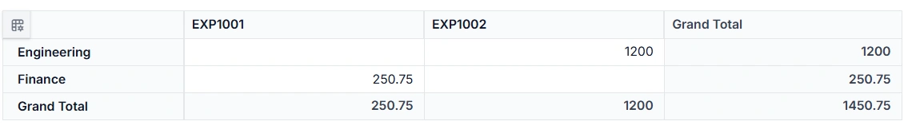

# Connect Blazor PivotTable to GraphQL

GraphQL is a query language that allows applications to request exactly the data needed, nothing more and nothing less. Unlike traditional REST APIs that return fixed data structures, GraphQL enables the client to specify the shape and content of the response. When paired with the [Syncfusion Blazor Pivot Table](https://www.syncfusion.com/blazor-components/blazor-pivot-table), GraphQL provides a convenient data source for loading the raw relational records that the pivot aggregates, sorts, filters, and pages on the client. The only server-side work for the pivot flow is data access (the read query) and persistence of CRUD edits (the mutations).

**Traditional REST APIs** and **GraphQL** differ mainly in how data is requested and returned: **REST APIs expose** multiple endpoints that return fixed data structures, often including unnecessary fields and requiring several requests to fetch related data, while **GraphQL** uses a single endpoint where queries define the exact fields needed, enabling precise responses and allowing related data to be retrieved efficiently in one request. This makes **GraphQL** especially useful for **Blazor PivotTable integration**, the **reason** is pivot‑centric UI components require well‑structured and selective datasets to support fast aggregation, drill‑through navigation, reduce network calls, and improve overall performance.

**Key GraphQL Concepts**

- **Queries**: A query is a request to read data. Queries do not modify data; they only retrieve it.
- **Mutations**: A mutation is a request to modify data. Mutations create, update, or delete records.
- **Resolvers**: Each query or mutation is handled by a resolver, which is a function responsible for fetching data or executing an operation. **Query resolvers** handle **read operations**, while **mutation resolvers** handle **write operations**.
- **Schema**: Defines the structure of the API. The schema describes available data types, the fields within those types, and the operations that can be executed. Query definitions specify how data can be retrieved, and mutation definitions specify how data can be modified. 

[Hot Chocolate](https://chillicream.com/docs/hotchocolate/v15) is an open‑source GraphQL server framework for .NET. Hot Chocolate enables the creation of GraphQL APIs using ASP.NET Core and integrates seamlessly with modern .NET applications, including Blazor.

## Prerequisites

Install the following software and packages before starting the process:

| Software/Package | Version | Purpose |
|-----------------|---------|---------|
| Visual Studio 2026 | 18.0 or later | Development IDE with Blazor workload |
| .NET SDK | net10.0 (matches the `net10.0` `TargetFramework` in the sample `.csproj`) | Runtime and build tools |
| HotChocolate.AspNetCore | Latest Stable Version (15.1.12 used in the sample) | GraphQL server framework |
| Syncfusion.Blazor.PivotTable | Latest Stable Version | Pivot Table component |
| Syncfusion.Blazor.Themes | Latest Stable Version | Styling for Pivot Table |

> **Note:** This sample targets `net10.0` and uses APIs introduced in .NET 9 (`MapStaticAssets`) and .NET 10 (`@Assets[...]` in `App.razor`). To target an earlier framework such as `net8.0`, replace `MapStaticAssets()` with `app.UseStaticFiles()` and the `@Assets["_framework/blazor.web.js"]` script reference with the standard `<script src="_framework/blazor.web.js"></script>` form.

## Setting Up the GraphQL Backend

### Step 1: Install Required NuGet Packages and Configure Launch Settings

Before installing NuGet packages, a new Blazor Web Application must be created using the default template. Run the following command in a terminal to scaffold the project, then open it in Visual Studio 2026:

```powershell
dotnet new blazor -n GraphQLAdaptor
cd GraphQLAdaptor
```

The template automatically generates essential starter files—such as **Program.cs, appsettings.json, launchSettings.json, the wwwroot folder, and the Components folder**.

For this guide, a Blazor application named **GraphQLAdaptor** has been created. The GraphQL server and the Pivot Table consumer both live in the same project, so no separate host configuration is needed.

**Install NuGet Packages**

NuGet packages are software libraries that add functionality to applications. The following packages enable GraphQL server functionality and Pivot Table components.

**Required Packages:**

- **HotChocolate.AspNetCore** (Latest Stable Version) - GraphQL server framework
- **Syncfusion.Blazor.PivotTable** (version {{site.blazorversion}}) - Pivot Table component
- **Syncfusion.Blazor.Themes** (version {{site.blazorversion}}) - Styling for Pivot Table

**Method 1: Using Package Manager Console**

1. Open Visual Studio 2026.
2. Navigate to **Tools → NuGet Package Manager → Package Manager Console**.
3. Run the following commands:

```powershell
Install-Package HotChocolate.AspNetCore -Version <Latest Stable Version>
Install-Package Syncfusion.Blazor.PivotTable -Version <Latest Stable Version>
Install-Package Syncfusion.Blazor.Themes -Version <Latest Stable Version>
```

**Method 2: Using NuGet Package Manager UI**

1. Open **Visual Studio 2026 → Tools → NuGet Package Manager → Manage NuGet Packages for Solution**.
2. Search for and install each package individually (always pick the **Latest Stable Version** offered by the NuGet feed):
   - **HotChocolate.AspNetCore** (Latest Stable Version)   
   - **[Syncfusion.Blazor.PivotTable](https://www.nuget.org/packages/Syncfusion.Blazor.PivotTable/)** (Latest Stable Version)
   - **[Syncfusion.Blazor.Themes](https://www.nuget.org/packages/Syncfusion.Blazor.Themes/)** (Latest Stable Version)

All required packages are now installed.

> **Note:** The sample pins `HotChocolate.AspNetCore` to `15.1.12`. The Syncfusion package versions use the `{{site.blazorversion}}` placeholder, which is resolved to the latest published Syncfusion Blazor version at render time. Replace `<Latest Stable Version>` in the `Install-Package` commands with the concrete version shown on the NuGet feed when you run them.

**Project File Reference**

The `.csproj` file confirms the package configuration. When using the public NuGet feed, the file uses the package references shown below (this workspace references the same packages via the public NuGet feed; a project reference is only used when developing the Syncfusion components locally):

```xml
<Project Sdk="Microsoft.NET.Sdk.Web">

  <PropertyGroup>
    <TargetFramework>net10.0</TargetFramework>
    <Nullable>enable</Nullable>
    <ImplicitUsings>enable</ImplicitUsings>
    <RootNamespace>GraphQLAdaptor</RootNamespace>
  </PropertyGroup>

  <ItemGroup>
    <PackageReference Include="HotChocolate.AspNetCore" Version="15.1.12" />
    <PackageReference Include="Syncfusion.Blazor.PivotTable" Version="{{site.blazorversion}}" />
    <PackageReference Include="Syncfusion.Blazor.Themes" Version="{{site.blazorversion}}" />
  </ItemGroup>

</Project>
```

---

### Step 2: Register Hot Chocolate Services in Program.cs

The `Program.cs` file configures and registers the GraphQL services, the Syncfusion Blazor services, and the interactive server render mode used by the Pivot Table.

**Instructions:**

1. Open the `Program.cs` file at the project root.
2. Add the following code in full or merge it with the default Blazor bootstrap:

```csharp
[Program.cs]

using GraphQLAdaptor.Components;
using GraphQLAdaptor.Models;
using Syncfusion.Blazor;

var builder = WebApplication.CreateBuilder(args);

// Add Razor Components with interactive server-side rendering.
builder.Services.AddRazorComponents()
    .AddInteractiveServerComponents();

// Register the Syncfusion Blazor service (required for all Syncfusion components).
builder.Services.AddSyncfusionBlazor();

// Register Hot Chocolate GraphQL services.
builder.Services
    .AddGraphQLServer()
    .AddQueryType<GraphQLQuery>()
    .AddMutationType<GraphQLMutation>();

var app = builder.Build();

// Configure the HTTP request pipeline.
if (!app.Environment.IsDevelopment())
{
    app.UseExceptionHandler("/Error", createScopeForErrors: true);
    app.UseHsts();
}

app.UseStatusCodePagesWithReExecute("/Error", createScopeForStatusCodePages: true);
app.UseHttpsRedirection();
app.UseAntiforgery();
app.MapStaticAssets();
app.MapRazorComponents<App>()
    .AddInteractiveServerRenderMode();

// Map the GraphQL endpoint (default: /graphql)
app.MapGraphQL();

app.Run();
```

**Cross‑Origin / HTTPS Notes**

The sample runs the Blazor app and the GraphQL endpoint from the **same origin**, so no CORS configuration is required. If you split the backend and frontend across different origins (for example, a separate GraphQL host), add a CORS policy and apply it before `MapGraphQL()`:

```csharp
builder.Services.AddCors(options =>
    options.AddDefaultPolicy(policy =>
        policy.AllowAnyOrigin().AllowAnyHeader().WithMethods("GET", "POST")));

// ...

app.UseCors();
app.MapGraphQL();
```

In the same‑origin HTTPS case, the Blazor `Home.razor` `SfDataManager` `Url` value should match the HTTPS profile (`https://localhost:7009/graphql`) when the `https` launch profile is used, and the HTTP value when the `http` profile is used.

**Details:**

- `AddRazorComponents().AddInteractiveServerComponents()` - Enables interactive server‑side rendering required by the Pivot Table.
- `AddSyncfusionBlazor()` - Initializes the Syncfusion Blazor service container so the Pivot Table and its child controls can resolve their dependencies.
- `AddGraphQLServer()` - Initializes the Hot Chocolate GraphQL server.
- `AddQueryType<GraphQLQuery>()` - Registers query resolvers for read operations.
- `AddMutationType<GraphQLMutation>()` - Registers mutation resolvers for write operations.
- `MapGraphQL()` - Exposes the GraphQL endpoint at `/graphql`.
- `MapRazorComponents<App>().AddInteractiveServerRenderMode()` - Wires the Blazor component pipeline using the `App` component from the `Components` folder.

The GraphQL backend is now configured and ready. The GraphQL endpoint is accessible at `https://localhost:xxxx/graphql`.

---

### Step 3: Configure Launch Settings (Port Configuration)

The **launchsettings.json** file controls the port number where the application runs. This file is located in the **Properties** folder at **Properties/launchsettings.json**.

**Instructions to Change the Port:**

1. Open the **Properties** folder in the project root.
2. Double-click **launchsettings.json** to open the file.
3. Locate the profile sections. The `http` profile is used by default and the `https` profile is selected when HTTPS is required:

```json
"http": {
  "commandName": "Project",
  "dotnetRunMessages": true,
  "launchBrowser": true,
  "applicationUrl": "http://localhost:5272",
  "environmentVariables": {
    "ASPNETCORE_ENVIRONMENT": "Development"
  }
},
"https": {
  "commandName": "Project",
  "dotnetRunMessages": true,
  "launchBrowser": true,
  "applicationUrl": "https://localhost:7009;http://localhost:5272",
  "environmentVariables": {
    "ASPNETCORE_ENVIRONMENT": "Development"
  }
}
```

4. Modify the `applicationUrl` property to change the port numbers:
   - `https://localhost:7009` - HTTPS port (change 7009 to desired port)
   - `http://localhost:5272` - HTTP port (change 5272 to desired port)

5. Example configuration with custom ports:

```json
"https": {
  "commandName": "Project",
  "dotnetRunMessages": true,
  "launchBrowser": true,
  "applicationUrl": "https://localhost:7777;http://localhost:5555",
  "environmentVariables": {
    "ASPNETCORE_ENVIRONMENT": "Development"
  }
}
```

6. Save the file and restart the application for the changes to take effect.

**Important Notes:**

- Port numbers must be between 1024 and 65535.
- Avoid using ports already in use by other applications.
- The GraphQL endpoint will be accessible at the configured HTTPS URL (e.g., `https://localhost:7777/graphql`).

All configuration steps are now complete.

---

### Step 4: Create the Data Model

A data model represents the structure of data that the application stores. It defines the properties (fields) that make up a record. Each property corresponds to a column in the database table. The data model acts as the blueprint for how data is organized and accessed throughout the application.

In the context of an expense tracker, the data model defines what information is stored for each expense entry. Properties include the expense identifier, the department, the category, and the amount. These four properties are sufficient to demonstrate the Pivot Table behaviour because the pivot layout will derive a value cell (sum of **Amount**) per intersection of **Department** rows and **ExpenseId** columns.

**Instructions**:

1. Create a new folder named **Models** in the project root directory.
2. Inside the **Models** folder, create a new file named **ExpenseRecord.cs**.
3. Define the **ExpenseRecord** class with the following code:

**File Location:** `Models/ExpenseRecord.cs`

```csharp
using System.Collections.Generic;
using System.Text.Json.Serialization;

namespace GraphQLAdaptor.Models
{
    public class ExpenseRecord
    {
        /// <summary>
        /// Static in-memory store for expense records.
        /// This persists data across mutations and queries during application lifetime.
        /// </summary>
        private static List<ExpenseRecord> _expenseStore = null;

        /// <summary>
        /// Initializes the expense store with seed data if not already initialized.
        /// </summary>
        private static void InitializeStore()
        {
            if (_expenseStore != null) return;

            // Seed with a representative set of expense records (the actual implementation ships 30 records spanning Finance, Engineering, Marketing, Sales, Human Resources, Operations, IT Infrastructure, Security, and more)
            _expenseStore = new List<ExpenseRecord>
            {
                new ExpenseRecord
                {
                    ExpenseId = "EXP1001",
                    Department = "Finance",
                    Category = "Travel & Mileage",
                    Amount = 250.75
                },
                new ExpenseRecord
                {
                    ExpenseId = "EXP1002",
                    Department = "Engineering",
                    Category = "Software & SaaS",
                    Amount = 1200.00
                },
                new ExpenseRecord
                {
                    ExpenseId = "EXP1003",
                    Department = "Human Resources",
                    Category = "Training & Development",
                    Amount = 450.00
                }
                // ...additional records omitted for brevity; the full seed list contains 30 records
            };
        }

        /// <summary>
        /// Retrieves all expense records from the in-memory store.
        /// This list persists across mutations and queries.
        /// </summary>
        public static List<ExpenseRecord> GetAllRecords()
        {
            InitializeStore();
            return _expenseStore;
        }

        /// <summary>
        /// Clears the expense store and reinitializes with seed data.
        /// Useful for testing or resetting the application state.
        /// </summary>
        public static void ResetStore()
        {
            _expenseStore = null;
            InitializeStore();
        }

        [JsonPropertyName("expenseId")]
        public string? ExpenseId { get; set; }

        [JsonPropertyName("department")]
        public string? Department { get; set; }

        [JsonPropertyName("category")]
        public string? Category { get; set; }

        [JsonPropertyName("amount")]
        public double Amount { get; set; }
    }
}
```

**Property Mapping Reference**

The following table shows how C# properties map to database columns and GraphQL field names:

| Property Name (C#) | Database Column | GraphQL Field Name | Data Type | Purpose |
|---|---|---|---|---|
| `ExpenseId` | `expense_id` | `expenseId` | `String` | Unique identifier for the expense record (used as the pivot column) |
| `Department` | `department` | `department` | `String` | Organizational department (used as the pivot row) |
| `Category` | `category` | `category` | `String` | Type or classification of expense |
| `Amount` | `amount` | `amount` | `Double` | Expense amount (aggregated as the pivot value) |

**Important Convention: Camel Case Conversion**

**Hot Chocolate GraphQL** automatically converts C# property names (**PascalCase**) to GraphQL field names (**camelCase**). This convention ensures consistent naming in the GraphQL schema. The `[JsonPropertyName]` attributes used above are honoured by the Syncfusion GraphQL adaptor when serializing and deserializing the request and response payloads.

- C# Property: `ExpenseId` → GraphQL Field: `expenseId`
- C# Property: `Department` → GraphQL Field: `department`
- C# Property: `Category` → GraphQL Field: `category`
- C# Property: `Amount` → GraphQL Field: `amount`

**Explanation**:

- The `ExpenseId` property is the primary key (a unique identifier for each record) and is also used as the Pivot Table column field.
- The `Department` property is used as the Pivot Table row field.
- The `Category` property carries descriptive data about the expense.
- The `Amount` property is the numeric field aggregated by the Pivot Table.
- The static `GetAllRecords()` method returns the shared in‑memory list that backs both the query and the mutation resolvers, so that data created at runtime is visible to subsequent reads.

The expense data model has been successfully created.

---

### Step 5: GraphQL Query Resolvers

A query resolver is a method in the backend that handles read requests from the client. When the Blazor Pivot Table needs to fetch data, the **DataManager** sends a GraphQL query to the server. The query resolver receives this request, processes it, and returns the appropriate data. Query resolvers do not modify data; they only retrieve and return it. The Pivot Table performs all aggregation, sorting, paging, and filtering on its client‑side engine. The GraphQL server is responsible only for returning the raw relational records.

In simple terms, a **GraphQL query** asks a question, and a **resolver** is the one who answers it.

**Instructions:**

1. Inside the **Models** folder, create a new file named **GraphQLQuery.cs**.
2. Add the following code to define the query resolver:

```csharp
using GraphQLAdaptor.Models;

namespace GraphQLAdaptor.Models
{
    public class GraphQLQuery
    {
        /// <summary>
        /// Retrieves all expense records and returns them along with the total record count.
        /// </summary>
        /// <param name="dataManager">The data manager request input containing query parameters.</param>
        /// <returns>An instance of <see cref="ExpenseRecordDataResponse"/> containing the expense records and count.</returns>
        public ExpenseRecordDataResponse GetExpenseRecordData(DataManagerRequestInput dataManager)
        {
            List<ExpenseRecord> dataSource = ExpenseRecord.GetAllRecords();

            return new ExpenseRecordDataResponse
            {
                Count = dataSource.Count,
                Result = dataSource
            };
        }
    }

    /// <summary>
    /// Response structure for query results. Must include Count (total records) and Result (current page).
    /// </summary>
    public class ExpenseRecordDataResponse
    {
        public int Count { get; set; }
        public List<ExpenseRecord> Result { get; set; } = new List<ExpenseRecord>();
    }
}
```

**Details:**

- The `GetExpenseRecordData` method receives `DataManagerRequestInput`, which the Pivot Table populates with parameters such as the requested fields, the `Params` dictionary (which includes the row, column, value, and filter axes the user has configured), aggregates, and the `LazyLoad` flag.
- Hot Chocolate automatically converts the method name `GetExpenseRecordData` to camelCase: `expenseRecordData` in the GraphQL schema.
- The response contains `Count` (total records) and `Result` (the full list of expense records). The Pivot Table reads `Count` for internal paging metadata and uses the array under `Result` as its raw data source.
- Because the Pivot Table performs aggregation, grouping, sorting, paging, and filtering on the client, this resolver simply returns every record. The server is not required to perform any of those operations — the request input type exists only to remain compatible with the standard `DataManagerRequestInput` shape the adaptor sends.

The query resolver has been created successfully.

---

### Step 6: Create the DataManagerRequestInput Class

A **DataManagerRequestInput** class is a GraphQL input type that represents the parameters the Blazor Pivot Table sends to the backend when requesting data. This class acts as a container for the pivot configuration (row/column/value/filter axes), the aggregate descriptors, and the requested field list. The Pivot Table performs its own sorting, filtering, and paging on the client, so the server-side filter/sort/paging members of the request are ignored by the pivot flow and are not required.

**Purpose**
When the Pivot Table performs a fetch — either the initial load, a field‑list change, a value‑axis change, or a drill‑through — it packages the pivot-relevant parameters into a `DataManagerRequestInput` object and sends it to the GraphQL backend. The backend returns the full data set; aggregation, grouping, sorting, and paging remain on the client.

**Instructions**:

1. Inside the **Models** folder, create a new file named **DataManagerRequest.cs**.
2. Define the **DataManagerRequestInput** class and supporting classes with the following code:

```csharp
using System.Collections.Generic;
using HotChocolate;

namespace GraphQLAdaptor.Models;

public class DataManagerRequestInput
{
    [GraphQLName("Skip")]
    public int Skip { get; set; }

    [GraphQLName("Take")]
    public int Take { get; set; }

    [GraphQLName("RequiresCounts")]
    public bool RequiresCounts { get; set; } = false;

    [GraphQLName("Params")]
    [GraphQLType(typeof(AnyType))]
    public IDictionary<string, object>? Params { get; set; }

    [GraphQLName("Aggregates")]
    [GraphQLType(typeof(AnyType))]
    public List<Aggregate>? Aggregates { get; set; }

    [GraphQLName("Select")]
    public List<string>? Select { get; set; }

    [GraphQLName("LazyLoad")]
    public bool? LazyLoad { get; set; }

    [GraphQLName("IdMapping")]
    public string? IdMapping { get; set; }
}

/// <summary>
/// Represents an aggregate operation in the data manager request.
/// </summary>
public class Aggregate
{
    [GraphQLName("Field")]
    public string Field { get; set; }

    [GraphQLName("Type")]
    public string Type { get; set; }
}
```

**Understanding the DataManagerRequestInput Class**

The Pivot Table populates the `DataManagerRequestInput` whenever it requests data. The members that matter for a pivot-specific flow are:

- `Params` — A free‑form dictionary that carries the pivot configuration: the fields assigned to **Columns**, **Rows**, **Values**, **Filters** axes, and any custom parameters the consumer wishes to send.
- `Aggregates` — One entry per value field, describing the aggregate type (`Sum`, `Count`, `Average`, `Min`, `Max`, etc.) and the field it applies to.
- `Select` — The list of fields the client wants returned. When the user drops a new field into the field list, the Pivot Table re‑issues the query with an updated `Select` list so the resolver returns only the columns that matter.
- `LazyLoad` — Indicates that the pivot is requesting data for a particular node (drill‑through) instead of the full data set.
- `Skip` / `Take` / `RequiresCounts` — The pivot requests the full data set, so `Skip`/`Take` are `0` and `RequiresCounts` is `false`; the resolver returns the entire `List<ExpenseRecord>` and lets the client engine handle paging metadata.

> **Note on server-side filtering/sorting/paging:** The Pivot Table aggregates, sorts, filters, and pages on the client. Although `DataManagerRequestInput` historically exposes `Where`, `Sorted`, `Group`, `Search`, `Expand`, `Distinct`, and `ServerSideGroup` properties for generic DataManager consumers, the pivot ignores those members. They are omitted from this sample's input type to keep the schema minimal. Add them back only if you reuse the same backend for a non-pivot Grid that requires server-side filtering/sorting.

**Example Payload from the Pivot Table**

```json
{
  "dataManager": {
    "Skip": 0,
    "Take": 0,
    "RequiresCounts": false,
    "Params": {
      "columns": ["ExpenseId"],
      "rows": ["Department"],
      "values": [{ "name": "Amount", "type": "Sum", "caption": "Amount" }],
      "filters": []
    },
    "Aggregates": [
      { "Field": "Amount", "Type": "Sum" }
    ],
    "Select": ["ExpenseId", "Department", "Category", "Amount"],
    "LazyLoad": false
  }
}
```

**DataManagerRequestInput Properties:**

| Property | Purpose | Type | Pivot Relevance |
|----------|---------|------|-----------------|
| `Skip` / `Take` | Paging window | `int` | Pivot requests `0`/`0` for full data |
| `RequiresCounts` | Whether to return the total count | `bool` | Set to `true` for the initial load |
| `Params` | Pivot row/column/value/filter configuration | `IDictionary<string, object>` | The core of a pivot request |
| `Aggregates` | Aggregations applied to value fields | `List<Aggregate>` | One per pivot value field |
| `Select` | Fields the client wants returned | `List<string>` | Updated as the user changes the field list |
| `LazyLoad` | Whether this is a drill‑through request | `bool` | `true` when drilling through a cell |
| `IdMapping` | Primary key field name | `string` | Used by the drill-through grid |

**Key Attributes Explained**
`[GraphQLName]`: Maps C# property names to GraphQL schema field names. **Hot Chocolate** automatically converts PascalCase to camelCase.
`[GraphQLType(typeof(AnyType))]`: Allows flexible typing for complex nested structures (such as `Params` and `Aggregates`) that can contain various data types.

---

### Step 7: GraphQL Mutation Resolvers

A **GraphQL mutation resolver** is a method in the backend that handles write requests (data modifications) from the client. While queries only read data, mutations create, update, or delete records. The Pivot Table uses these mutations when cell editing is enabled and the user opens the editing popup on the underlying row grid. The mutation resolver receives the request, processes it, and persists the changes to the data source.

In simple terms, a **GraphQL mutation** asks for a change, and a **resolver** is the one who makes it.

**Instructions:**
1. Inside the Models folder, create a new file named **GraphQLMutation.cs**.
2. Define the **GraphQLMutation** class with the following code:

```csharp
using GraphQLAdaptor.Models;
using HotChocolate;

namespace GraphQLAdaptor.Models
{
    public class GraphQLMutation
    {
        /// <summary>
        /// Creates a new expense record.
        /// </summary>
        public ExpenseRecord CreateExpense(
            ExpenseRecord record,
            int index,
            string action,
            [GraphQLType(typeof(AnyType))] IDictionary<string, object> additionalParameters)
        {
            var expenses = ExpenseRecord.GetAllRecords();

            // Generate ExpenseId as Prefix + (max numeric + 1) when adding
            if (string.IsNullOrWhiteSpace(record.ExpenseId))
            {
                record.ExpenseId = GenerateExpenseId(expenses);
            }

            if (index >= 0 && index <= expenses.Count)
            {
                expenses.Insert(index, record);
            }
            else
            {
                expenses.Add(record);
            }

            return record;
        }

        /// <summary>
        /// Updates an existing expense record.
        /// </summary>
        public ExpenseRecord UpdateExpense(
            ExpenseRecord record,
            string action,
            string primaryColumnName,
            string primaryColumnValue,
            [GraphQLType(typeof(AnyType))] IDictionary<string, object> additionalParameters)
        {
            var expenses = ExpenseRecord.GetAllRecords();
            var existingExpense = expenses.FirstOrDefault(x => x.ExpenseId == primaryColumnValue);

            if (existingExpense != null)
            {
                UpdateExpenseProperties(existingExpense, record);
            }

            return existingExpense ?? record;
        }

        /// <summary>
        /// Deletes an expense record.
        /// </summary>
        public bool DeleteExpense(
            string primaryColumnValue,
            [GraphQLType(typeof(AnyType))] IDictionary<string, object> additionalParameters)
        {
            var expenses = ExpenseRecord.GetAllRecords();
            var expenseToDelete = expenses.FirstOrDefault(x => x.ExpenseId == primaryColumnValue);

            if (expenseToDelete != null)
            {
                expenses.Remove(expenseToDelete);
                return true;
            }

            return false;
        }

        public List<ExpenseRecord> BatchUpdate(
            List<ExpenseRecord>? changed,
            List<ExpenseRecord>? added,
            List<ExpenseRecord>? deleted,
            string action,
            string primaryColumnName,
            [GraphQLType(typeof(AnyType))] IDictionary<string, object> additionalParameters,
            int? dropIndex)
        {
            var expenses = ExpenseRecord.GetAllRecords();

            // Update existing expenses
            if (changed != null)
            {
                foreach (var changedItem in changed)
                {
                    var existing = expenses.FirstOrDefault(e => e.ExpenseId == changedItem.ExpenseId);
                    if (existing != null)
                    {
                        UpdateExpenseProperties(existing, changedItem);
                    }
                }
            }

            // Add new expenses
            if (added != null)
            {
                foreach (var newItem in added)
                {
                    if (string.IsNullOrWhiteSpace(newItem.ExpenseId))
                    {
                        newItem.ExpenseId = GenerateExpenseId(expenses);
                    }

                    if (dropIndex.HasValue && dropIndex >= 0 && dropIndex <= expenses.Count)
                        expenses.Insert(dropIndex.Value, newItem);
                    else
                        expenses.Add(newItem);
                }
            }

            // Delete expenses
            if (deleted != null)
            {
                foreach (var del in deleted)
                {
                    var toRemove = expenses.FirstOrDefault(e => e.ExpenseId == del.ExpenseId);
                    if (toRemove != null) expenses.Remove(toRemove);
                }
            }

            return expenses;
        }

        /// <summary>
        /// Generates a unique ExpenseId by extracting prefix from existing IDs and incrementing the sequence number.
        /// </summary>
        private string GenerateExpenseId(List<ExpenseRecord> expenses)
        {
            string detectedPrefix = "EXP";
            var firstWithLetters = expenses
                .Select(e => e.ExpenseId)
                .FirstOrDefault(id => !string.IsNullOrWhiteSpace(id) && char.IsLetter(id[0]));
            if (!string.IsNullOrWhiteSpace(firstWithLetters))
            {
                int i = 0;
                while (i < firstWithLetters.Length && char.IsLetter(firstWithLetters[i])) i++;
                if (i > 0) detectedPrefix = firstWithLetters.Substring(0, i);
            }

            int maxSeq = expenses
                .Select(e => e.ExpenseId)
                .Where(id => !string.IsNullOrWhiteSpace(id))
                .Select(id =>
                {
                    int j = id.Length - 1;
                    while (j >= 0 && char.IsDigit(id[j])) j--;
                    var numPart = id.Substring(j + 1);
                    return int.TryParse(numPart, out var n) ? n : 0;
                })
                .DefaultIfEmpty(1000)
                .Max();

            return $"{detectedPrefix}{maxSeq + 1}";
        }

        /// <summary>
        /// Updates all properties of an existing expense record with values from a source record.
        /// </summary>
        private void UpdateExpenseProperties(ExpenseRecord target, ExpenseRecord source)
        {
            target.Department = source.Department;
            target.Category = source.Category;
            target.Amount = source.Amount;
        }
    }
}
```


A mutation resolver is a C# method decorated with GraphQL attributes that:

- **Receives input parameters** from the Pivot Table's editing popup (record data, primary keys, etc.).
- **Processes the operation** (validation, ID generation, data modification).
- **Persists changes** to the data source (in‑memory list, database, or external service).
- **Returns results** to the client (the modified record or a success/failure status).

**Resolver Reference**

| Resolver | Action | Signature | Purpose |
|----------|--------|-----------|---------|
| `createExpense` | Insert | `(record, index, action, additionalParameters) → ExpenseRecord` | Adds a new record at the requested index or appends it. Generates an `ExpenseId` if one is not supplied. |
| `updateExpense` | Update | `(record, action, primaryColumnName, primaryColumnValue, additionalParameters) → ExpenseRecord` | Looks up the record by `primaryColumnValue` and overwrites the editable properties. |
| `deleteExpense` | Delete | `(primaryColumnValue, additionalParameters) → bool` | Removes the record matching `primaryColumnValue` and returns a success flag. |
| `batchUpdate` | Batch | `(changed, added, deleted, action, primaryColumnName, additionalParameters, dropIndex) → List<ExpenseRecord>` | Applies all three operations in a single call. |

**Test the Mutation Resolvers**

After `dotnet run`, open `http://localhost:5272/graphql` (Banana Cake Pop) and execute a sample mutation to confirm the resolver is registered:

```html
mutation testCreate {
  createExpense(
    record: { expenseId: "EXP1003", department: "Sales", category: "Lodging", amount: 480.0 }
    index: 0
    action: "add"
    additionalParameters: {}
  ) {
    expenseId
    department
    category
    amount
  }
}
```

A successful response confirms the GraphQL input type, the `Any` scalar, and the resolver are all wired correctly.

The GraphQL Mutation class has been successfully created and is ready to handle all data modification operations issued from the Pivot Table's editing popup.

---

## Integrating Blazor PivotView

### Step 1: Install and Configure Blazor PivotView Components with GraphQL

Syncfusion provides UI components—including the Pivot Table—that display multi‑dimensional data with aggregation, filtering, and drill‑through capabilities. The Syncfusion Blazor packages were added in **Step 1** of the backend setup.

**Instructions:**

* The Syncfusion.Blazor.PivotTable package was installed in **Step 1** of the previous heading.
* Import the required namespaces in the `Components/_Imports.razor` file:

```csharp
@using System.Net.Http
@using System.Net.Http.Json
@using Microsoft.AspNetCore.Components.Forms
@using Microsoft.AspNetCore.Components.Routing
@using Microsoft.AspNetCore.Components.Web
@using static Microsoft.AspNetCore.Components.Web.RenderMode
@using Microsoft.AspNetCore.Components.Web.Virtualization
@using Microsoft.JSInterop
@using GraphQLAdaptor
@using GraphQLAdaptor.Components
@using GraphQLAdaptor.Models
@using GraphQLAdaptor.Components.Layout
@using Syncfusion.Blazor
@using Syncfusion.Blazor.Data
@using Syncfusion.Blazor.PivotView
```

> `Syncfusion.Blazor.Data` is imported because the GraphQL adaptor (`GraphQLAdaptorOptions`, `Adaptors.GraphQLAdaptor`, `Syncfusion.Blazor.Data.GraphQLMutation`) lives there. `Syncfusion.Blazor.PivotView` provides the `SfPivotView` component and its child types (such as `BeginDrillThroughEventArgs` and `EditMode`). The editing popup is hosted in a Syncfusion Grid under the hood, but the `GridColumn` type used in the `BeginDrillThrough` handler is reachable through the `Syncfusion.Blazor.PivotView` namespace, so a separate `Syncfusion.Blazor.Grids` import is not required.

* Add the Syncfusion stylesheet inside the `<head>` element of `Components/App.razor` (after the default `<HeadOutlet>` and any base stylesheet):

```html
<!-- Blazor Pivot Stylesheet -->
<link href="_content/Syncfusion.Blazor.Themes/tailwind3.css" rel="stylesheet" />
```

The Blazor framework script (`_framework/blazor.web.js`) and the Syncfusion Blazor script (`_content/Syncfusion.Blazor.Core/scripts/syncfusion-blazor.min.js`) are placed at the end of the `<body>` element so the framework is fully loaded before the Syncfusion runtime is initialised. The default Blazor template already includes the framework script; add the Syncfusion script line immediately after it:

```html
<script src="@Assets["_framework/blazor.web.js"]"></script>
<script src="_content/Syncfusion.Blazor.Core/scripts/syncfusion-blazor.min.js" type="text/javascript"></script>
```

For this project, the **tailwind3** theme is used. A different theme can be selected or the existing theme can be customized based on project requirements. Refer to the [Blazor Components Appearance](https://blazor.syncfusion.com/documentation/appearance/themes) documentation to learn more about theming and customization options.

Blazor components are now configured and ready to use. For additional guidance, refer to the [Pivot Table component's getting‑started](https://blazor.syncfusion.com/documentation/pivot-table/getting-started-webapp) documentation.

---

### Step 2: Create the Blazor PivotView

The `Home.razor` component renders the expense data inside an `SfPivotView` configured with a GraphQL `DataManager`. The pivot layout groups records by **Department** (rows) and **ExpenseId** (columns), then aggregates the **Amount** field as a Sum.

**Instructions:**

1. Open the file named `Home.razor` in the `Components/Pages` folder.
2. Add the following code to create a Pivot Table wired to the GraphQL endpoint:

```cshtml
@page "/"
<PageTitle>Expense Tracker</PageTitle>

<SfPivotView TValue="ExpenseRecord" Width="1000" Height="600" ShowFieldList="true">
    <PivotViewDataSourceSettings TValue="ExpenseRecord" ExpandAll=false EnableSorting=true>
        <SfDataManager Url="http://localhost:5272/graphql" 
                       GraphQLAdaptorOptions="@adaptorOptions" 
                       Adaptor="Adaptors.GraphQLAdaptor">
        </SfDataManager>
        <PivotViewColumns>
            <PivotViewColumn Name="ExpenseId"></PivotViewColumn>
        </PivotViewColumns>
        <PivotViewRows>
            <PivotViewRow Name="Department"></PivotViewRow>
        </PivotViewRows>
        <PivotViewValues>
            <PivotViewValue Name="Amount" Caption="Amount" Type="SummaryType.Sum"></PivotViewValue>
        </PivotViewValues>
    </PivotViewDataSourceSettings>
    <PivotViewGridSettings ColumnWidth="120"></PivotViewGridSettings>
    <PivotViewEvents TValue="ExpenseRecord" BeginDrillThrough="beginDrillThrough"></PivotViewEvents>
    <PivotViewCellEditSettings AllowEditing=true AllowAdding=true AllowDeleting=true Mode=Syncfusion.Blazor.PivotView.EditMode.Normal></PivotViewCellEditSettings>
</SfPivotView>

@code {
    // The GraphQLAdaptorOptions configuration is added in the next step.
}
```

**Component Explanation:**

- **`@page "/"`**: Marks the component as the home page of the Blazor app.
- **`<SfPivotView>`**: The Pivot Table component that displays aggregated data.
- **`ShowFieldList="true"`**: Enables the field list panel that lets users drag fields between the **Rows**, **Columns**, **Values**, and **Filters** axes at runtime.
- **`<PivotViewDataSourceSettings>`**: Configures the data source and the row/column/value axes.
- **`<PivotViewColumns>`**: Lists the fields that appear as columns in the cross‑tab.
- **`<PivotViewRows>`**: Lists the fields that appear as rows in the cross‑tab.
- **`<PivotViewValues>`**: Lists the fields that are aggregated (e.g. `Sum` of `Amount`).
- **`<PivotViewGridSettings>`**: Cosmetic settings for the inner grid (column width, etc.).
- **`<PivotViewEvents>`**: Wires up the `BeginDrillThrough` event used to mark the primary key column inside the editing popup so that CRUD mutations can identify the record.
- **`<PivotViewCellEditSettings>`**: Enables inline CRUD on value cells (`Add`, `Edit`, `Delete`) of the pivot.

The `SfDataManager` component connects the Pivot Table to the GraphQL backend using the adaptor options configured below:

```cshtml
<SfDataManager Url="http://localhost:5272/graphql" 
               GraphQLAdaptorOptions="@adaptorOptions" 
               Adaptor="Adaptors.GraphQLAdaptor">
</SfDataManager>
```

**Component Attributes Explained:**

| Attribute | Purpose | Value |
|-----------|---------|-------|
| `Url` | GraphQL endpoint location | `http://localhost:5272/graphql` (must match backend port) |
| `GraphQLAdaptorOptions` | References the adaptor configuration object | `@adaptorOptions` (defined in the next section) |
| `Adaptor` | Specifies the adaptor type to use | `Adaptors.GraphQLAdaptor` (tells Syncfusion to use the GraphQL adaptor) |

**Important Notes:**

- The `Url` must match the port configured in `launchSettings.json`.
- If the backend runs on port `5272`, then the URL must be `http://localhost:5272/graphql` (or `https://localhost:7009/graphql` for the HTTPS profile).
- The `/graphql` path is set by `app.MapGraphQL()` in `Program.cs`.

---

### Step 3: Configure GraphQL Adaptor and Data Binding

The GraphQL adaptor is a bridge that connects the Blazor Pivot Table with the GraphQL backend. The adaptor translates DataManager operations (initial fetch, drill‑through, value‑axis change, cell edits) into GraphQL queries and mutations. When the user interacts with the pivot, the adaptor automatically sends the appropriate GraphQL request to the backend, receives the response, and updates the pivot display.

**What is a GraphQL Adaptor?**

An adaptor is a translator between two different systems. The GraphQL adaptor specifically:

- Receives interaction events generated by the Pivot Table, including initial load, field‑list changes, drill‑through navigation, and cell edit actions.
- Converts these actions into GraphQL query or mutation syntax.
- Sends the **GraphQL request** to the backend **GraphQL endpoint**.
- Receives the response data from the backend.
- Formats the response back into a structure the Pivot Table understands.
- Updates the pivot display with the new data.

The adaptor enables bidirectional communication between the frontend (Pivot Table) and backend (GraphQL server).

---

**GraphQL Adaptor Configuration**

The `@code` block in `Home.razor` contains C# code that configures how the adaptor behaves. This configuration is critical because it defines:

- Which GraphQL query to use for reading data.
- Which GraphQL mutations to use for creating, updating, and deleting data.
- How to connect to the GraphQL backend endpoint.

**Instructions:**

1. Open the `Home.razor` file located at `Components/Pages/Home.razor`.
2. Scroll to the `@code` block at the bottom of the file.
3. Replace the `@code` block created in **Step 2** with the following complete configuration:

> In **Step 2**, the markup referenced `@adaptorOptions` and `beginDrillThrough` before they were defined. The complete `@code` block below defines both, so when you copy this step you should also remove the placeholder `@code { }` block from Step 2.

```csharp
@code {
    private GraphQLAdaptorOptions adaptorOptions = new GraphQLAdaptorOptions
    {
        Query = @"query expenseRecordData($dataManager: DataManagerRequestInput!) {
                    expenseRecordData(dataManager: $dataManager) {
                        count
                        result {
                            expenseId
                            department
                            category
                            amount
                        }
                    }
                }",

        ResolverName = "expenseRecordData",

        Mutation = new Syncfusion.Blazor.Data.GraphQLMutation
        {
            Insert = @"mutation create($record: ExpenseRecordInput!, $index: Int!, $action: String!, $additionalParameters: Any) {
                createExpense(record: $record, index: $index, action: $action, additionalParameters: $additionalParameters) {
                    expenseId
                    department
                    category
                    amount
                }
            }",

            Update = @"mutation update($record: ExpenseRecordInput!, $action: String!, $primaryColumnName: String!, $primaryColumnValue: String!, $additionalParameters: Any) {
                updateExpense(record: $record, action: $action, primaryColumnName: $primaryColumnName, primaryColumnValue: $primaryColumnValue, additionalParameters: $additionalParameters) {
                    expenseId
                    department
                    category
                    amount
                }
            }",

            Delete = @"mutation delete($primaryColumnValue: String!, $additionalParameters: Any) {
                deleteExpense(primaryColumnValue: $primaryColumnValue, additionalParameters: $additionalParameters)
            }",

            Batch = @"mutation batch($changed: [ExpenseRecordInput!], $added: [ExpenseRecordInput!], $deleted: [ExpenseRecordInput!], $action: String!, $primaryColumnName: String!, $additionalParameters: Any, $dropIndex: Int) {
                batchUpdate(changed: $changed, added: $added, deleted: $deleted, action: $action, primaryColumnName: $primaryColumnName, additionalParameters: $additionalParameters, dropIndex: $dropIndex) {
                    expenseId
                    department
                    category
                    amount
                }
            }"
        },
    };

    private void beginDrillThrough(BeginDrillThroughEventArgs args)
    {
        // Configure the editing popup to mark ExpenseId as the primary key.
        // The inner grid's column Field values use the PascalCase C# property names
        // (ExpenseId, Department, Category, Amount) because the GraphQL response
        // deserializes into ExpenseRecord objects, not the camelCase field names.
        for (int i = 0; i < args.GridObj.Columns.Count; i++)
        {
            if (args.GridObj.Columns[i].Field == "ExpenseId")
            {
                args.GridObj.Columns[i].IsPrimaryKey = true;
            }
        }
    }
}
```

**GraphQL Query Structure Explained in Detail**

The `Query` property is critical for understanding how data flows. Each component of the query has a specific purpose:

```
query expenseRecordData($dataManager: DataManagerRequestInput!) {}
```

- `query` - GraphQL keyword indicating a read operation.
- `expenseRecordData` - Name of the query (must match the resolver name in camelCase).
- `($dataManager: DataManagerRequestInput!)` - Parameter declaration. The `!` means this parameter is **required** (not optional).

```
expenseRecordData(dataManager: $dataManager) {}
```

- `expenseRecordData(...)` - Calls the resolver method in the backend.
- `dataManager: $dataManager` - Passes the variable to the resolver.

```
count
result {
    expenseId
    department
    category
    amount
}
```

- `count` - Returns total number of records. The Pivot Table uses this for internal metadata.
- `result` - Contains the array of expense records. Only requested fields are returned (no over‑fetching).

**`ResolverName`**

The `ResolverName` property (`"expenseRecordData"`) tells the GraphQL adaptor which top-level field in the response contains the data payload. It must match the query name (and therefore the Hot Chocolate resolver method name in camelCase). If it is omitted or misnamed, the adaptor cannot locate the `result`/`count` node in the GraphQL response and the pivot shows no data.

**`ExpenseRecordInput` input type**

Hot Chocolate automatically generates a GraphQL input type named `ExpenseRecordInput` from the `ExpenseRecord` class whenever `ExpenseRecord` is used as an argument to a mutation method (as in `CreateExpense(ExpenseRecord record, ...)`). No `[InputType]` attribute or `.AddInputObjectType<>()` call is required for the sample as written, because the same class is reused for both input and output. If you separate read and write models, register the input type explicitly and update the `Insert`/`Update`/`Batch` mutation strings to reference the new input type name.

---

**Response Structure Example**

When the backend executes the query, it returns a **JSON response** in this structure:

```json
{
  "data": {
    "expenseRecordData": {
      "count": 2,
      "result": [
        {
          "expenseId": "EXP1001",
          "department": "Finance",
          "category": "Travel & Mileage",
          "amount": 250.75
        },
        {
          "expenseId": "EXP1002",
          "department": "Engineering",
          "category": "Software & SaaS",
          "amount": 1200.00
        }
      ]
    }
  }
}
```

**Response Structure Explanation:**

| Part | Purpose | Example |
|------|---------|---------|
| `data` | Root object containing the query result | Always present in successful responses |
| `expenseRecordData` | Matches the query name (camelCase) | Contains `count` and `result` |
| `count` | Total number of records available | `2` |
| `result` | Array of `ExpenseRecord` objects | `[{ ... }, { ... }]` |
| Each field in `result` | Matches GraphQL field names | Field values from the data source |

Once this raw data is received, the Pivot Table aggregates it on the client and renders the cross‑tab.

---

### Step 4: Configure Drill‑Through and the Primary Key

Cell‑level editing in the Pivot Table happens through a **drill‑through** dialog (referred to here as the editing popup). The editing popup is a Syncfusion Grid that lists the underlying records that contributed to a particular aggregated cell. Because CRUD mutations on the backend expect a primary key (the `ExpenseId`), the editing popup must mark the `ExpenseId` column as its primary key.

The `BeginDrillThrough` event handler and the `<PivotViewEvents>` wiring already appear in the markup and `@code` block defined in **Step 2** and **Step 3**. The handler iterates the inner grid's columns and sets `IsPrimaryKey = true` on the `ExpenseId` column. This section explains *why* that wiring is required.

```cshtml
<PivotViewEvents TValue="ExpenseRecord" BeginDrillThrough="beginDrillThrough"></PivotViewEvents>
```

**Why This Step Is Required**

The `BeginDrillThrough` event fires just before the editing popup is shown. Inside the event, the `args.GridObj` exposes the inner Grid that lists the underlying records. The `Syncfusion.Blazor.Data.GraphQLAdaptor` needs the inner Grid to have a primary key column so it can:

- Send the `primaryColumnValue` to the `updateExpense` and `deleteExpense` mutations.
- Send the matching record inside the `record` argument of the `createExpense` mutation when adding a new row through the editing popup.
- Track which records were added, changed, or removed in the `batchUpdate` mutation.

Without this event handler, the inner Grid would not have a primary key, and CRUD operations issued from the editing popup would fail because the adaptor would not know which record to send to the backend.

---

### Step 5: Enable Cell Editing on the Pivot

`<PivotViewCellEditSettings>` enables inline CRUD on value cells. With this configuration, the user can right‑click a value cell in the pivot and choose **Add**, **Edit**, or **Delete** to open the editing popup pre‑filtered to that cell's underlying records.

The `<PivotViewCellEditSettings>` element already appears in the `Home.razor` markup from **Step 2**. The settings applied are:

**Settings Reference**

| Property | Value | Effect |
|----------|-------|--------|
| `AllowEditing` | `true` | Allows the user to update existing records from the editing popup. |
| `AllowAdding` | `true` | Allows the user to insert new records from the editing popup. |
| `AllowDeleting` | `true` | Allows the user to delete records from the editing popup. |
| `Mode` | `EditMode.Normal` | Uses the default Syncfusion dialog. |

When the user makes a change and clicks **Update**, the GraphQL adaptor picks the corresponding mutation (`createExpense`, `updateExpense`, `deleteExpense`, or `batchUpdate`) from the `Mutation` block of `GraphQLAdaptorOptions` and posts it to the configured `Url`.

---

### Step 6: Running the Application

**Build the Application**

1. Open the terminal or Package Manager Console.
2. Navigate to the project directory.
3. Run the following command:

```powershell
dotnet build
```

**Run the Application**

Execute the following command:

```powershell
dotnet run
```

**Access the Application**

1. Open a web browser.
2. Navigate to `http://localhost:5272` (or the port shown in the terminal).
3. The Expense Tracker Pivot Table is now running and ready to use.



---

## Perform CRUD Operations

CRUD operations (Create, Read, Update, Delete) provide complete data‑management capabilities within the Pivot Table. The Pivot Table's CRUD flow is unique compared to a flat Grid: the user **opens the editing popup** on an aggregated value cell to view the underlying records, and the CRUD actions are then performed on the inner Grid using the GraphQL adaptor. The backend resolvers execute the corresponding data modifications.

The `GridEditSettings` and the toolbar configuration used by the regular Grid are replaced here by `<PivotViewCellEditSettings>`, the `BeginDrillThrough` event, and the GraphQL mutations defined in the `GraphQLAdaptorOptions`.

**Insert**

The Insert operation enables adding a new expense record through the editing popup. After the user picks an aggregated cell, opens the editing popup, adds a row, and submits, the GraphQL adaptor sends a `createExpense` mutation to the backend.

**How Insert Mutation Parameters are Passed:**

Unlike the read flow, which uses `DataManagerRequestInput`, CRUD operations pass values directly to the corresponding GraphQL mutation. When the Add action is triggered in the editing popup and the form is submitted, the GraphQL adaptor constructs the mutation using the provided field values and sends the following parameters:

**GraphQL Mutation Request:**

```
mutation create($record: ExpenseRecordInput!, $index: Int!, $action: String!, $additionalParameters: Any) {
  createExpense(record: $record, index: $index, action: $action, additionalParameters: $additionalParameters) {
    expenseId
    department
    category
    amount
  }
}
```

**Variables Sent with the Request:**

```json
{
  "record": {
    "expenseId": null,
    "department": "Finance",
    "category": "Travel & Mileage",
    "amount": 750.00
  },
  "index": 0,
  "action": "add",
  "additionalParameters": {}
}
```

**Parameter Explanation:**

| Parameter | Type | Purpose | Example |
|-----------|------|---------|---------|
| `record` | `ExpenseRecordInput` | The new expense record object with all field values | Expense data filled in the dialog |
| `index` | `Int` | The position where the new record should be inserted (0 = top) | `0` for insert at beginning |
| `action` | `String` | Type of action being performed (usually `"add"` for insert) | `"add"` |
| `additionalParameters` | `Any` | Extra context or custom parameters from the Grid | Empty object `{}` or additional metadata |

**Backend Response:**

The mutation returns the created record directly:

```json
{
  "data": {
    "createExpense": {
      "expenseId": "EXP1003",
      "department": "Finance",
      "category": "Travel & Mileage",
      "amount": 750
    }
  }
}
```

**Update**

The Update operation enables modifying existing expense records. When the user picks a value cell, opens the editing popup, edits a row, and submits, the GraphQL adaptor sends an `updateExpense` mutation.

**How Update Mutation Parameters are Passed:**

**GraphQL Mutation Request:**

```
mutation update($record: ExpenseRecordInput!, $action: String!, $primaryColumnName: String!, $primaryColumnValue: String!, $additionalParameters: Any) {
  updateExpense(record: $record, action: $action, primaryColumnName: $primaryColumnName, primaryColumnValue: $primaryColumnValue, additionalParameters: $additionalParameters) {
    expenseId
    department
    category
    amount
  }
}
```

**Variables Sent with the Request:**

```json
{
  "record": {
    "expenseId": "EXP1002",
    "department": "Engineering",
    "category": "Software & SaaS",
    "amount": 1500.00
  },
  "action": "save",
  "primaryColumnName": "ExpenseId",
  "primaryColumnValue": "EXP1002",
  "additionalParameters": {}
}
```

**Parameter Explanation:**

| Parameter | Type | Purpose | Example |
|-----------|------|---------|---------|
| `record` | `ExpenseRecordInput` | The modified record with updated values | New values for the edited row |
| `action` | `String` | Type of action being performed | `"save"` |
| `primaryColumnName` | `String` | Name of the primary key column | `"ExpenseId"` |
| `primaryColumnValue` | `String` | Value of the primary key identifying the record | `"EXP1002"` |
| `additionalParameters` | `Any` | Extra context from the Grid | `{}` |

**Delete**

The Delete operation enables removing expense records. When the user picks a value cell, opens the editing popup, and deletes a row, the GraphQL adaptor sends a `deleteExpense` mutation with only the primary key value.

**GraphQL Mutation Request:**

```
mutation delete($primaryColumnValue: String!, $additionalParameters: Any) {
  deleteExpense(primaryColumnValue: $primaryColumnValue, additionalParameters: $additionalParameters)
}
```

**Variables Sent with the Request:**

```json
{
  "primaryColumnValue": "EXP1002",
  "additionalParameters": {}
}
```

**Parameter Explanation:**

| Parameter | Type | Purpose | Example |
|-----------|------|---------|---------|
| `primaryColumnValue` | `String` | Value of the primary key identifying which record to delete | `"EXP1002"` |
| `additionalParameters` | `Any` | Extra context from the Grid | `{}` |

**Backend Response:**

The mutation returns a boolean success/failure indicator:

```json
{
  "data": {
    "deleteExpense": true
  }
}
```

If the record does not exist:

```json
{
  "data": {
    "deleteExpense": false
  }
}
```

**Batch Update**

The Batch Update operation allows adding, updating, and deleting multiple records in a single request. The Pivot Table's GraphQL adaptor dispatches a `batchUpdate` mutation when more than one change is queued up in the editing popup.

**GraphQL Mutation Request:**

```
mutation batch($changed: [ExpenseRecordInput!], $added: [ExpenseRecordInput!], $deleted: [ExpenseRecordInput!], $action: String!, $primaryColumnName: String!, $additionalParameters: Any, $dropIndex: Int) {
  batchUpdate(changed: $changed, added: $added, deleted: $deleted, action: $action, primaryColumnName: $primaryColumnName, additionalParameters: $additionalParameters, dropIndex: $dropIndex) {
    expenseId
    department
    category
    amount
  }
}
```

**Variables Sent with the Request:**

```json
{
  "changed": [
    {
      "expenseId": "EXP1002",
      "department": "Engineering",
      "category": "Software & SaaS",
      "amount": 1500.00
    }
  ],
  "added": [
    {
      "expenseId": null,
      "department": "Marketing",
      "category": "Training & Education",
      "amount": 199.99
    }
  ],
  "deleted": [
    { "expenseId": "EXP1001" }
  ],
  "action": "batch",
  "primaryColumnName": "ExpenseId",
  "additionalParameters": {},
  "dropIndex": 0
}
```

**Parameter Explanation:**

| Parameter | Type | Purpose | Example |
|-----------|------|---------|---------|
| `changed` | `[ExpenseRecordInput]` | Records to update | Modified rows with an existing `ExpenseId` |
| `added` | `[ExpenseRecordInput]` | Records to insert | New rows; `ExpenseId` is optional |
| `deleted` | `[ExpenseRecordInput]` | Records to delete | Objects with the `ExpenseId` of the row to remove |
| `action` | `String` | Batch action indicator | `"batch"` |
| `primaryColumnName` | `String` | Name of the primary key column | `"ExpenseId"` |
| `additionalParameters` | `Any` | Extra context from the Grid | `{}` |
| `dropIndex` | `Int` | Target index for insertion/reorder | `0` |

**Backend Response:**

```json
{
  "data": {
    "batchUpdate": [
      {
        "expenseId": "EXP1001",
        "department": "Finance",
        "category": "Travel & Mileage",
        "amount": 250.75
      },
      {
        "expenseId": "EXP1002",
        "department": "Engineering",
        "category": "Software & SaaS",
        "amount": 1500.00
      }
    ]
  }
}
```

---

## Data Persistence and Reset Behavior

> The `ExpenseRecord` class stores data in a **static in‑memory list** (see `Models/ExpenseRecord.cs`). All mutations modify this list, so records added, updated, or deleted at runtime are visible to subsequent queries. However, because the data is held in process memory:
> - **Restarting the application resets the store** to the seed records (three records are shown in the listing above; the full sample ships a richer seed list).
> - **Scaling out** (running multiple server instances) is not supported — each instance has its own copy of the list.
> - For production scenarios, replace the in‑memory list with a database, Entity Framework Core, or another persistent store, and update the query and mutation resolvers to read from and write to that store.

## Troubleshooting

The most common issues encountered when wiring the Pivot Table to a Hot Chocolate GraphQL endpoint are listed below.

| Symptom | Likely Cause | Fix |
|---|---|---|
| Pivot shows a loading indicator and never renders. | `Url` on `SfDataManager` does not match the active `launchSettings.json` profile. | Match the URL to the port shown in the terminal (e.g., `http://localhost:5272/graphql` for the `http` profile, `https://localhost:7009/graphql` for the `https` profile). |
| Network error: "Failed to fetch" in the browser console. | CORS — the GraphQL host and the Blazor host are on different origins. | Add a CORS policy in `Program.cs` (see the CORS snippet above) and apply it before `app.MapGraphQL()`. |
| Hot Chocolate schema error: "The scalar type `Any` was not found." | The `Any` scalar is not registered with the GraphQL server. | Hot Chocolate registers `Any` automatically when you reference `HotChocolate.AspNetCore`, but if you have customized the schema, add `.AddAnyType()` to the `AddGraphQLServer()` chain in `Program.cs`. |
| Hot Chocolate schema error: "The input type `ExpenseRecordInput` was not found." | Hot Chocolate did not generate the input type from the mutation parameter. | This happens when the `record` parameter on a mutation is annotated as `object` or when a class is reused. The sample uses `ExpenseRecord` for both input and output, which works because the same class defines both shapes; if you split them, also call `.AddInputObjectType<ExpenseRecordInput>()` and ensure the `Insert`/`Update`/`Batch` mutation strings reference the correct input type name. |
| CRUD buttons are disabled or the editing popup opens with no primary key. | The `BeginDrillThrough` event was not wired, so `IsPrimaryKey` is never set on the inner Grid. | Verify the `PivotViewEvents` element in `Home.razor` references `beginDrillThrough` and that the handler marks the `ExpenseId` column. |
| `CS0103`: name 'AnyType' does not exist. | The file using `[GraphQLType(typeof(AnyType))]` is missing `using HotChocolate;`. | Add `using HotChocolate;` to the top of `Models/DataManagerRequest.cs` and `Models/GraphQLMutation.cs`. |
| `CS0246`: type 'DataManagerRequestInput' could not be found. | The query resolver is in a different namespace than the input type, or the input file is not compiled. | Ensure `Models/DataManagerRequest.cs` compiles and is included in the project. The sample uses the `GraphQLAdaptor.Models` namespace consistently. |
| Pivot view loads but value cells show `0` for every row. | The GraphQL response is correct, but the value field's `Type` in the `<PivotViewValue>` is not set. | Set `Type="SummaryType.Sum"` (or the desired aggregate) on the `PivotViewValue` element, or rely on the default (Sum for numeric fields). |
| In‑memory data is lost on every page refresh / app restart. | The `ExpenseRecord` static store is process‑memory only. | This is by design in the sample; see the **Data Persistence and Reset Behavior** callout above. |

## Complete Sample Repository

A complete, working sample implementation is available in the [GitHub repository](https://github.com/SyncfusionExamples/syncfusion-blazor-pivot-table-remote-data-binding/tree/master/GraphQLAdaptor).

---
## Summary

This guide demonstrates how to:

1. Install required NuGet packages for Hot Chocolate and Syncfusion Blazor Pivot Table. [🔗](#step-1-install-required-nuget-packages-and-configure-launch-settings)
2. Register Hot Chocolate services and expose the GraphQL endpoint. [🔗](#step-2-register-hot-chocolate-services-in-programcs)
3. Configure launch settings and ports for the GraphQL endpoint. [🔗](#step-3-configure-launch-settings-port-configuration)
4. Create the `ExpenseRecord` data model used across the GraphQL schema. [🔗](#step-4-create-the-data-model)
5. Implement the GraphQL query resolver that returns the raw records the pivot aggregates. [🔗](#step-5-graphql-query-resolvers)
6. Create the `DataManagerRequestInput` input type to carry pivot configuration to the backend. [🔗](#step-6-create-the-datamanagerrequestinput-class)
7. Define GraphQL mutation resolvers for Create, Update, Delete, and Batch operations. [🔗](#step-7-graphql-mutation-resolvers)
8. Integrate the Blazor Pivot Table and configure the GraphQL adaptor with a query, mutations, and a primary key. [🔗](#step-2-create-the-blazor-pivotview)
9. Configure the drill‑through event so the inner Grid can identify the record's primary key for CRUD. [🔗](#step-4-configure-drill-through-and-the-primary-key)
10. Enable cell editing on the pivot and perform CRUD operations from the editing popup. [🔗](#perform-crud-operations)

The application now provides a complete solution for managing expenses with a modern [Blazor Pivot Table](https://www.syncfusion.com/blazor-components/blazor-pivot-table) integrated with a Hot Chocolate GraphQL backend.
