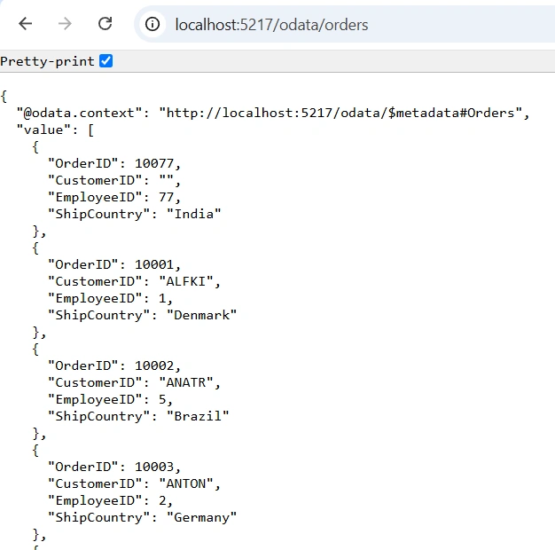
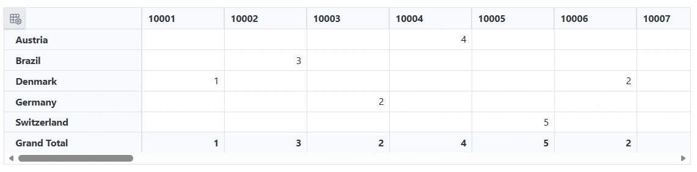
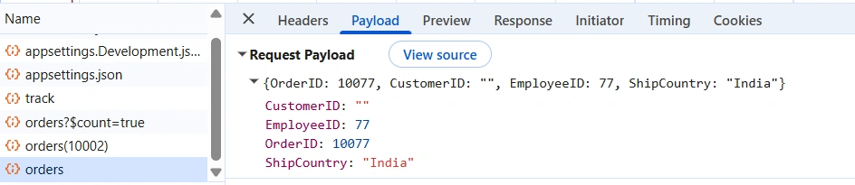
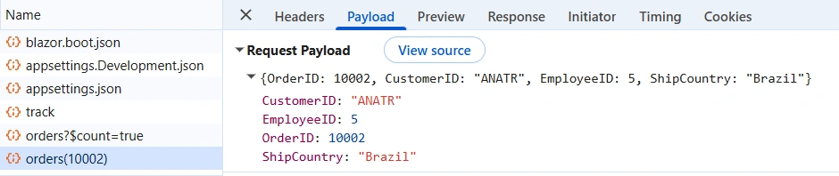
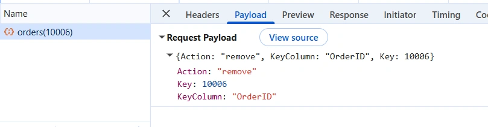

# OData Remote Data Binding in Blazor Pivot Table

The [ODataV4Adaptor](https://blazor.syncfusion.com/documentation/data/adaptors#odatav4-adaptor) in the [Blazor Pivot Table](https://www.syncfusion.com/blazor-components/blazor-pivot-table) enables the Pivot engine to fetch the complete data set from an OData V4 service and perform aggregation client-side, and to push Create, Update, and Delete operations back to the server. This guide provides detailed instructions for binding data and performing CRUD (Create, Read, Update, and Delete) actions using the `ODataV4Adaptor` in your Blazor Pivot Table.

## Overview

The Pivot Table is configured with the `SfDataManager` component using `Adaptor="Adaptors.ODataV4Adaptor"`. The adaptor handles data fetching and serializes CRUD operations (cell-level edits performed through the editing popup) into the corresponding HTTP methods (`GET`, `POST`, `PATCH`, `DELETE`). The Pivot engine loads all records in a single `GET` request and performs aggregation, grouping, and summarization on the client, so the server is not involved in pivot-specific filtering, sorting, or paging. All CRUD operations are routed through the OData endpoint, so no custom adaptor logic is required.

The sample described in this guide uses:

- A Blazor Web App named **ODataV4Adaptor** with **Interactive Auto** render mode.
- The `Microsoft.AspNetCore.OData` package to expose an OData V4 service.
- The `Syncfusion.Blazor.PivotTable` and `Syncfusion.Blazor.Themes` packages for the Pivot Table and theming.
- An in-memory data source based on the `OrdersDetails` model.

## Prerequisites

| Component | Version | Purpose |
|-----------|---------|---------|
| Visual Studio 2022 | 17.0 or later | Development IDE with ASP.NET and Blazor workloads |
| .NET SDK | net9.0 or compatible | Runtime and build tools |
| `Syncfusion.Blazor.PivotTable` | Latest available version | Pivot Table and UI components |
| `Syncfusion.Blazor.Themes` | Latest available version | Styling for Pivot Table components |
| `Microsoft.AspNetCore.OData` | 9.x or later (compatible with .NET 9) | OData V4 server-side framework |

> **License registration:** Syncfusion components require a license key to be registered at application startup via `SyncfusionLicenser.RegisterLicense(...)`. During the 30-day trial evaluation period, registration is optional. Refer to the [licensing topic](https://blazor.syncfusion.com/documentation/getting-started/license-key/overview) for details on obtaining and registering a license key.

## Create the OData Service

**1. Create a Blazor Web App**

Create a **Blazor Web App** named **ODataV4Adaptor** using Visual Studio 2022 via [Microsoft Templates](https://learn.microsoft.com/en-us/aspnet/core/blazor/tooling?view=aspnetcore-9.0) or the [Syncfusion Blazor Extension](https://blazor.syncfusion.com/documentation/visual-studio-integration/template-studio). Configure the **Interactive Auto** render mode and place the **Interactivity Location** on the per-page/component basis so that the Pivot Table can issue HTTP requests to the OData service.

**2. Install NuGet packages**

Using the NuGet package manager in Visual Studio (*Tools → NuGet Package Manager → Manage NuGet Packages for Solution*), install the following packages for the **server** project (`ODataV4Adaptor`):

- `Microsoft.AspNetCore.OData`

For the **client** project (`ODataV4Adaptor.Client`), install:

- `Syncfusion.Blazor.PivotTable`
- `Syncfusion.Blazor.Themes`

Alternatively, run the following Package Manager commands:

```powershell
Install-Package Microsoft.AspNetCore.OData
Install-Package Syncfusion.Blazor.PivotTable
Install-Package Syncfusion.Blazor.Themes
```

> Blazor components are available on [nuget.org](https://www.nuget.org/packages?q=syncfusion.blazor). Refer to the [NuGet packages](https://blazor.syncfusion.com/documentation/nuget-packages) topic for a complete list.

## Create the Model Class

Create a new folder named **Models** in the `ODataV4Adaptor.Client` project. Add a model class named **OrdersDetails.cs** to the **Models** folder to represent the order data exposed by the OData service.

```csharp
using System.ComponentModel.DataAnnotations;

namespace ODataV4Adaptor.Client.Models
{
    public class OrdersDetails
    {
        public static List<OrdersDetails> order = new List<OrdersDetails>();

        public OrdersDetails() { }

        public OrdersDetails(int OrderID, string CustomerId, int EmployeeId, string ShipCountry)
        {
            this.OrderID = OrderID;
            this.CustomerID = CustomerId;
            this.EmployeeID = EmployeeId;
            this.ShipCountry = ShipCountry;
        }

        public static List<OrdersDetails> GetAllRecords()
        {
            if (order.Count == 0)
            {
                int code = 10000;
                for (int i = 1; i < 10; i++)
                {
                    order.Add(new OrdersDetails(code + 1, "ALFKI", i + 0, "Denmark"));
                    order.Add(new OrdersDetails(code + 2, "ANATR", i + 2, "Brazil"));
                    order.Add(new OrdersDetails(code + 3, "ANTON", i + 1, "Germany"));
                    order.Add(new OrdersDetails(code + 4, "BLONP", i + 3, "Austria"));
                    order.Add(new OrdersDetails(code + 5, "BOLID", i + 4, "Switzerland"));
                    code += 5;
                }
            }
            return order;
        }

        [Key]
        public int OrderID { get; set; }
        public string? CustomerID { get; set; }
        public int? EmployeeID { get; set; }
        public string? ShipCountry { get; set; }
    }
}
```

> **Project reference:** Because the model lives in the `ODataV4Adaptor.Client` project while the controller and `Program.cs` (in the server project) both reference `using ODataV4Adaptor.Client.Models;`, the server project must have a project reference to `ODataV4Adaptor.Client`. This reference is established automatically when the Blazor Web App template creates the Interactive Auto solution, but confirm the entry exists in the server project's `.csproj` (`<ProjectReference Include="..\ODataV4Adaptor.Client\ODataV4Adaptor.Client.csproj" />`) before building.

## Configure the OData Endpoint

The OData V4 service is configured in the server project's `Program.cs` file. Because `Microsoft.AspNetCore.OData` exposes the `Microsoft.OData.ModelBuilder` namespace (used by `ODataConventionModelBuilder` below), confirm the package is installed on the server project before adding the `using Microsoft.OData.ModelBuilder;` directive. The configuration registers the `Orders` entity set and mounts the OData route components under the `odata` prefix. The Pivot Table fetches the entire entity set in a single `GET` request, so server-side filtering, sorting, and paging query options are not required.

```csharp
using ODataV4Adaptor.Client.Models;
using ODataV4Adaptor.Client.Pages;
using ODataV4Adaptor.Components;
using Microsoft.AspNetCore.OData;
using Microsoft.OData.ModelBuilder;
using Syncfusion.Blazor;

// Create a new instance of the web application builder.
var builder = WebApplication.CreateBuilder(args);
builder.Services.AddSyncfusionBlazor();

// Create an ODataConventionModelBuilder to build the OData model.
var modelBuilder = new ODataConventionModelBuilder();

// Register the "Orders" entity set with the OData model builder.
modelBuilder.EntitySet<OrdersDetails>("Orders");

// Add controllers with OData support to the service collection.
builder.Services.AddControllers().AddOData(
    options => options
        .AddRouteComponents("odata", modelBuilder.GetEdmModel())
);

// Add services to the container.
builder.Services.AddRazorComponents()
    .AddInteractiveServerComponents()
    .AddInteractiveWebAssemblyComponents();

var app = builder.Build();

// Configure the HTTP request pipeline.
if (app.Environment.IsDevelopment())
{
    app.UseWebAssemblyDebugging();
}
else
{
    app.UseExceptionHandler("/Error", createScopeForErrors: true);
    app.UseHsts();
}

app.UseHttpsRedirection();
app.UseAntiforgery();

// Map controller routes.
app.MapControllers();
app.MapStaticAssets();
app.MapRazorComponents<App>()
    .AddInteractiveServerRenderMode()
    .AddInteractiveWebAssemblyRenderMode()
    .AddAdditionalAssemblies(typeof(ODataV4Adaptor.Client._Imports).Assembly);

app.Run();
```

The service is registered through `ODataConventionModelBuilder` and exposed under the `odata` route prefix. The Pivot Table fetches all records in a single `GET` request and performs aggregation on the client, so no server-side query options (`$filter`, `$orderby`, `$count`, `$top`, `$skip`) need to be enabled for the pivot.

## Create the API Controller

Create an API controller named **OrdersController.cs** under the **Controllers** folder of the `ODataV4Adaptor` project. This controller exposes the `Orders` entity set and handles all CRUD requests from the Pivot Table.

```csharp
using Microsoft.AspNetCore.Mvc;
using Microsoft.AspNetCore.OData.Query;
using ODataV4Adaptor.Client.Models;

namespace ODataV4Adaptor.Controllers
{
    /// <summary>
    /// Handles HTTP requests for pivot data operations via OData.
    /// </summary>
    [ApiController]
    [Route("[controller]")]
    public class OrdersController : ControllerBase
    {
        /// <summary>
        /// Retrieves all order records from the data source.
        /// </summary>
        /// <remarks>
        /// The Pivot Table fetches the full record set in a single GET request; aggregation,
        /// grouping, and summarization are performed client-side by the pivot engine, so this
        /// endpoint simply returns the complete collection.
        /// </remarks>
        /// <returns>Returns an IActionResult that contains a queryable list of ordersdetails.</returns>
        [HttpGet]
        [EnableQuery]
        public IActionResult Get()
        {
            var data = OrdersDetails.GetAllRecords().AsQueryable();
            return Ok(data);
        }

        /// <summary>
        /// Inserts a new order to the collection. Returns 200 OK with the inserted entity on success,
        /// or 400 Bad Request if the request body is null.
        /// </summary>
        [HttpPost]
        public IActionResult Post([FromBody] OrdersDetails addRecord)
        {
            if (addRecord == null)
            {
                return BadRequest("Null order");
            }
            OrdersDetails.GetAllRecords().Insert(0, addRecord);
            return new JsonResult(addRecord);
        }

        /// <summary>
        /// Updates an existing order. Returns 200 OK with the updated entity, or 400 Bad Request
        /// if the request body is null. If no order matches the supplied key, the action returns
        /// 200 OK with the incoming payload; no change is made to the data set.
        /// </summary>
        [HttpPatch("{key}")]
        public IActionResult Patch(int key, [FromBody] OrdersDetails updateRecord)
        {
            if (updateRecord == null)
            {
                return BadRequest("No records");
            }
            var existingOrder = OrdersDetails.GetAllRecords().FirstOrDefault(order => order.OrderID == key);
            if (existingOrder != null)
            {
                existingOrder.CustomerID = updateRecord.CustomerID ?? existingOrder.CustomerID;
                existingOrder.EmployeeID = updateRecord.EmployeeID ?? existingOrder.EmployeeID;
                existingOrder.ShipCountry = updateRecord.ShipCountry ?? existingOrder.ShipCountry;
            }
            return new JsonResult(updateRecord);
        }

        /// <summary>
        /// Deletes an order.
        /// </summary>
        [HttpDelete("{key}")]
        public IActionResult Delete(int key)
        {
            var deleteRecord = OrdersDetails.GetAllRecords().FirstOrDefault(order => order.OrderID == key);
            if (deleteRecord != null)
            {
                OrdersDetails.GetAllRecords().Remove(deleteRecord);
            }
            return new JsonResult(deleteRecord);
        }
    }
}
```

The `OrdersController` exposes the following routes under the `odata` prefix:

| Method | Route | Purpose |
|--------|-------|---------|
| `GET` | `/odata/orders` | Returns the complete entity set for the pivot engine to aggregate client-side |
| `POST` | `/odata/orders` | Inserts a new order at the beginning of the in-memory list |
| `PATCH` | `/odata/orders/{key}` | Updates the matching order's `CustomerID`, `EmployeeID`, or `ShipCountry` |
| `DELETE` | `/odata/orders/{key}` | Removes the order with the matching `OrderID` |

The `GET` endpoint returns the full in-memory collection. The pivot engine loads all records in a single `GET` and performs aggregation, grouping, and summarization on the client.

> **Routing note:** The `[Route("[controller]")]` attribute on the controller exposes an additional MVC route (`/orders`) alongside the OData route (`/odata/orders`) registered by `AddRouteComponents("odata", ...)`. The Pivot Table should target the `/odata/orders` route. The controller's `[HttpPatch("{key}")]` and `[HttpDelete("{key}")]` templates use MVC route-style `{key}` substitution, so these actions are reached via the MVC `/orders/{key}` route (for example, `/orders/10002`) rather than the OData `/odata/orders(10002)` parenthesized form. The editing popup in this sample issues MVC-style keyed requests, which the `{key}` route template handles correctly. Ensure your client request URL matches the route template your action actually exposes.

After running the application, you can verify that the server-side API controller successfully returns the order data at the URL `http://localhost:5217/odata/orders`:



## Configure the Pivot Table

**1. Register the Blazor service**

In an Interactive Auto Blazor Web App, Syncfusion Blazor components may render on the server (during prerender and Server render mode) and in the browser (WebAssembly render mode). `AddSyncfusionBlazor()` must therefore be registered in **both** the server project's `Program.cs` (shown in [Configure the OData Endpoint](#configure-the-odata-endpoint)) and the client project's `Program.cs` below. The server registration supports prerendering and Server rendering; the client registration supports WebAssembly rendering.

- Open the **~/_Imports.razor** file in the `ODataV4Adaptor.Client` project and import the required namespaces.

```cs
@using Syncfusion.Blazor
@using Syncfusion.Blazor.PivotView
```

- Register the Blazor service in the **~/Program.cs** file of the `ODataV4Adaptor.Client` project.

```csharp
using Microsoft.AspNetCore.Components.WebAssembly.Hosting;
using Syncfusion.Blazor;

var builder = WebAssemblyHostBuilder.CreateDefault(args);
builder.Services.AddSyncfusionBlazor();
await builder.Build().RunAsync();
```

**2. Add stylesheet and script resources**

Include the theme stylesheet and script references in the **~/Components/App.razor** file of the server project.

```html
<head>
    ....
    <link href="_content/Syncfusion.Blazor.Themes/bootstrap5.css" rel="stylesheet" />
</head>
....
<body>
    ....
    <script src="_content/Syncfusion.Blazor.Core/scripts/syncfusion-blazor.min.js" type="text/javascript"></script>
</body>
```

> Refer to the [Blazor Themes](https://blazor.syncfusion.com/documentation/appearance/themes) topic for various methods of including themes (Static Web Assets, CDN, or CRG).

> **Static web assets:** In the .NET 9 Blazor Web App template, `MapStaticAssets()` (called in the server project's `Program.cs`) replaces the older `app.UseStaticFiles()` middleware and automatically serves static web assets — including the Syncfusion theme stylesheet and `syncfusion-blazor.min.js` script produced by the `Syncfusion.Blazor.Themes` and `Syncfusion.Blazor.Core` client-project references. No additional `UseStaticFiles()` call is required. Confirm the `_content/Syncfusion.Blazor.Themes/` and `_content/Syncfusion.Blazor.Core/` paths resolve after building.

## Data Binding using ODataV4Adaptor

To connect the Blazor Pivot Table to an OData V4 service, use the [Url](https://help.syncfusion.com/cr/blazor/Syncfusion.Blazor.DataManager.html#Syncfusion_Blazor_DataManager_Url) property of [SfDataManager](https://help.syncfusion.com/cr/blazor/Syncfusion.Blazor.DataManager.html) and set the [Adaptor](https://help.syncfusion.com/cr/blazor/Syncfusion.Blazor.DataManager.html#Syncfusion_Blazor_DataManager_Adaptor) property to `Adaptors.ODataV4Adaptor`. The `SfDataManager` is nested inside `PivotViewDataSourceSettings` so that the pivot engine can drive the OData requests.

Update the **Index.razor** file in the `ODataV4Adaptor.Client` project as follows.

```cshtml
@page "/"

@using Syncfusion.Blazor.PivotView
@using Syncfusion.Blazor.Data
@using ODataV4Adaptor.Client.Models

<SfPivotView TValue="OrdersDetails" Width="1000" Height="300" ShowFieldList="true">
    <PivotViewDataSourceSettings TValue="OrdersDetails" ExpandAll="false">
        <SfDataManager Url="http://localhost:5217/odata/orders" Adaptor="Adaptors.ODataV4Adaptor"></SfDataManager>
        <PivotViewColumns>
            <PivotViewColumn Name="OrderID"></PivotViewColumn>
        </PivotViewColumns>
        <PivotViewRows>
            <PivotViewRow Name="ShipCountry"></PivotViewRow>
        </PivotViewRows>
        <PivotViewValues>
            <PivotViewValue Name="EmployeeID"></PivotViewValue>
        </PivotViewValues>
    </PivotViewDataSourceSettings>
    <PivotViewGridSettings ColumnWidth="120"></PivotViewGridSettings>
    <PivotViewEvents TValue="OrdersDetails" BeginDrillThrough="beginDrillThrough"></PivotViewEvents>
    <PivotViewCellEditSettings AllowEditing="true" AllowAdding="true" AllowDeleting="true" Mode="EditMode.Normal"></PivotViewCellEditSettings>
</SfPivotView>

@code {
    private void beginDrillThrough(BeginDrillThroughEventArgs args)
    {
        // Configure BeginDrillThrough event to set the primary key for CRUD operations.
        // The editing popup hosts a separate Grid component that uses its own DataManager
        // instance distinct from the main Pivot Table, so IsPrimaryKey must be set on the
        // popup grid's columns explicitly for PATCH/DELETE requests to target the
        // correct record.
        // Iterate through all columns in the editing popup grid.
        for (int i = 0; i < args.GridObj.Columns.Count; i++)
        {
            // Check if the current column is the primary key column.
            if (args.GridObj.Columns[i].Field == "OrderID")
            {
                // Mark this column as the primary key so DataManager can uniquely identify records
                // when issuing PATCH and DELETE requests.
                args.GridObj.Columns[i].IsPrimaryKey = true;
            }
        }
    }
}
```

Key points from the configuration:

- **Url** points to `http://localhost:5217/odata/orders` so that the `ODataV4Adaptor` targets the `Orders` entity set registered in `Program.cs`.
- **Adaptor** is set to `Adaptors.ODataV4Adaptor` to activate the built-in OData V4 pipeline that handles data fetching and serializes CRUD operations into HTTP methods.
- `ShowFieldList="true"` enables the field list so users can drag fields between **Rows**, **Columns**, and **Values** at runtime.
- `PivotViewCellEditSettings` enables CRUD operations within the editing popup. The `Mode="EditMode.Normal"` setting renders the selected row's data in an exclusive dialog window — the editing popup — where users can modify cell values and save them to the data source by clicking **Save**.

> Replace `http://localhost:5217/odata/orders` with the actual URL of your OData V4 endpoint. The default HTTP profile in `Properties/launchSettings.json` listens on `http://localhost:5217` and the HTTPS profile listens on `https://localhost:7078` (with HTTP fallback to `http://localhost:5217`). In this single-hosted Blazor Web App the client and server share an origin, so no CORS configuration is required. If you deploy the WebAssembly client separately from the OData server, configure CORS on the server and use a placeholder URL resolvable from the browser; avoid mixing `http` and `https` schemes within a single response to prevent CORS and anti-forgery errors.

The `BeginDrillThrough` event marks `OrderID` as the primary key column so that the editing popup can target the correct record for `PATCH` and `DELETE` operations.



## CRUD Operations

The Pivot Table supports cell-level CRUD operations against the OData service. The `PivotViewCellEditSettings` element with `Mode="EditMode.Normal"` opens an editing popup containing a data Grid when a value cell is double-clicked, and the `BeginDrillThrough` event handler configures the primary key for the popup Grid so that the same operations can be performed from the editing popup.

### Insert a Record

**1. Editing popup level**

To insert a new order from the editing popup:

1. Double-click an aggregated value cell in the pivot view to open the editing popup.
2. In the editing popup, click **Add** and enter the new order details (for example, `OrderID: 10077`, `CustomerID: ""`, `EmployeeID: 77`, `ShipCountry: "India"`) and click **Save**.
3. The Pivot Table issues a `POST` request to `/odata/orders` with the new order as the request body. The server inserts the new record at the beginning of the in-memory list and returns the inserted entity as a `JsonResult`.

The corresponding controller action is:

```csharp
[HttpPost]
public IActionResult Post([FromBody] OrdersDetails addRecord)
{
    if (addRecord == null)
    {
        return BadRequest("Null order");
    }
    OrdersDetails.GetAllRecords().Insert(0, addRecord);
    return new JsonResult(addRecord);
}
```

> **Insert-at-0 behavior:** Each `POST` inserts the new record at index 0 of the in-memory list. On subsequent reads, the newly inserted record will appear in the returned set and the pivot engine will re-aggregate from the complete data.

> **Thread-safety:** `OrdersDetails.GetAllRecords()` returns a single shared static `List<OrdersDetails>`. Concurrent `POST`/`PATCH`/`DELETE` requests can mutate this list without synchronization, which is acceptable for this local sample but should be replaced with a thread-safe store (or a real database) in production.

The browser network panel confirms the request payload sent to the server:



### Update a Record

**1. Drill-through level**

To update an existing order from the drill-through view:

1. Double-click an aggregated value cell in the pivot view to open the drill-through grid.
2. Edit a record inline (for example, modify `OrderID: 10002`, `CustomerID: "ANATR"`, `EmployeeID: 5`, `ShipCountry: "Brazil"`) and save the change.
3. The drill-through grid uses the `OrderID` primary key (configured in the `BeginDrillThrough` event) to issue a `PATCH` request to the keyed route — `http://localhost:5217/odata/orders` for the OData convention `/odata/orders(10002)`, which maps onto the controller's `[HttpPatch("{key}")]` MVC template as `/orders/10002` — with the modified record as the request body.
4. The server locates the matching order and updates its `CustomerID`, `EmployeeID`, and `ShipCountry` fields.

The corresponding controller action is:

```csharp
[HttpPatch("{key}")]
public IActionResult Patch(int key, [FromBody] OrdersDetails updateRecord)
{
    if (updateRecord == null)
    {
        return BadRequest("No records");
    }
    var existingOrder = OrdersDetails.GetAllRecords().FirstOrDefault(order => order.OrderID == key);
    if (existingOrder != null)
    {
        existingOrder.CustomerID = updateRecord.CustomerID ?? existingOrder.CustomerID;
        existingOrder.EmployeeID = updateRecord.EmployeeID ?? existingOrder.EmployeeID;
        existingOrder.ShipCountry = updateRecord.ShipCountry ?? existingOrder.ShipCountry;
    }
    return new JsonResult(updateRecord);
}
```

> **JSON vs OData response:** This sample's `Post`, `Patch`, and `Delete` actions return `JsonResult` rather than OData-formatted results such as `CreatedODataResult`. This is intentional for the sample so the editing popup can consume standard JSON. Strict OData clients that require `{ "@odata.context": ... }` envelopes should switch to OData results (for example, `Created(...)`).

The browser network panel confirms the request payload sent to the server:



### Delete a Record

**1. Drill-through level**

To delete an existing order from the drill-through view:

1. Double-click an aggregated value cell in the pivot view to open the drill-through grid.
2. In the drill-through grid, select a record (for example, the record with `OrderID: 10006`) and click **Delete**.
3. The drill-through grid issues a `DELETE` request to the keyed route — `/orders/10006` per the controller's `[HttpDelete("{key}")]` MVC template (OData convention `/odata/orders(10006)`) — with a payload that identifies the record to remove (`{ Action: "remove", KeyColumn: "OrderID", Key: 10006 }`).
4. The server locates the matching order and removes it from the in-memory list.
5. Close the drill-through window to return to the pivot view.

The corresponding controller action is:

```csharp
[HttpDelete("{key}")]
public IActionResult Delete(int key)
{
    var deleteRecord = OrdersDetails.GetAllRecords().FirstOrDefault(order => order.OrderID == key);
    if (deleteRecord != null)
    {
        OrdersDetails.GetAllRecords().Remove(deleteRecord);
    }
    return new JsonResult(deleteRecord);
}
```

The browser network panel confirms the request payload sent to the server:



> **Delete of non-existent key:** If no order matches the supplied `key`, `deleteRecord` will be `null` and the action still returns `200 OK` with a `JsonResult(null)` body. The caller should treat a `null` body as "no record matched" rather than a successful deletion.

## Running the Application

1. Set the **ODataV4Adaptor** server project as the startup project. For a Blazor Web App with Interactive Auto, only the server project needs to be set as the startup — it hosts both the server-side rendering pipeline and serves the WebAssembly client assets via `MapStaticAssets` and `MapRazorComponents` configured in `Program.cs`. You do **not** need to configure multiple startup projects.
2. Run the application in Visual Studio. It will be hosted at `http://localhost:5217` (or the URL shown in the terminal).
3. After running the application, verify that the server-side API controller successfully returns the order data at the URL `http://localhost:5217/odata/orders`.

## Expected Output

When the application runs successfully, the Pivot Table is rendered with:

- **Rows**: `ShipCountry` (Denmark, Brazil, Germany, Austria, Switzerland)
- **Columns**: `OrderID`
- **Values**: Sum of `EmployeeID`

Double-clicking any aggregated value cell opens the drill-through editor, where you can perform Insert, Update, and Delete operations against the OData service. The field list is available so that the layout can be reconfigured at runtime.

## GitHub Sample

A complete reference sample is available on [GitHub](https://github.com/SyncfusionExamples/syncfusion-blazor-pivot-table-remote-data-binding/tree/master/ODataV4Adaptor).
