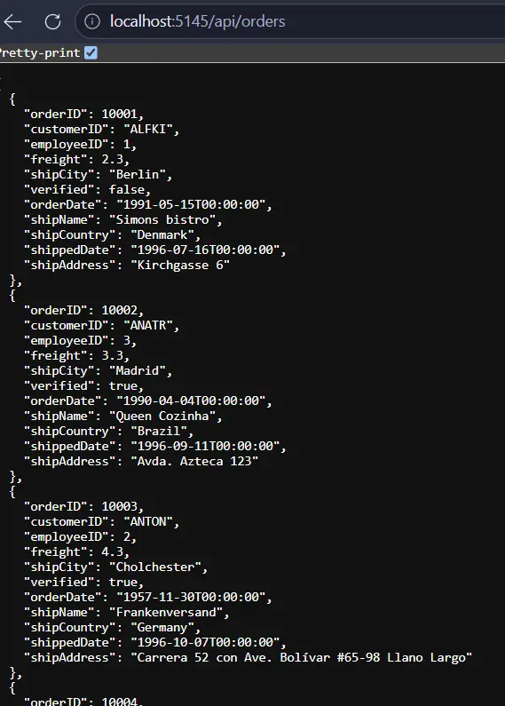
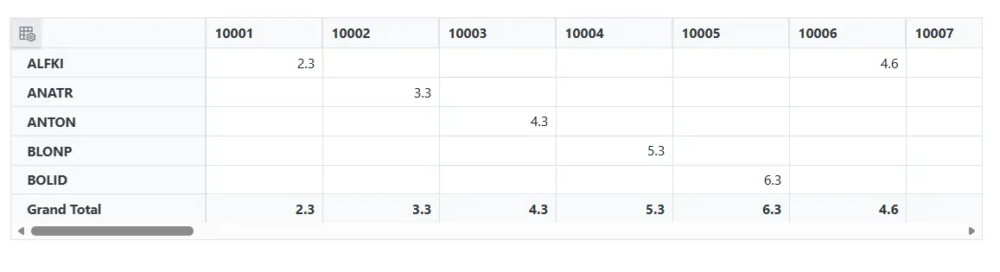
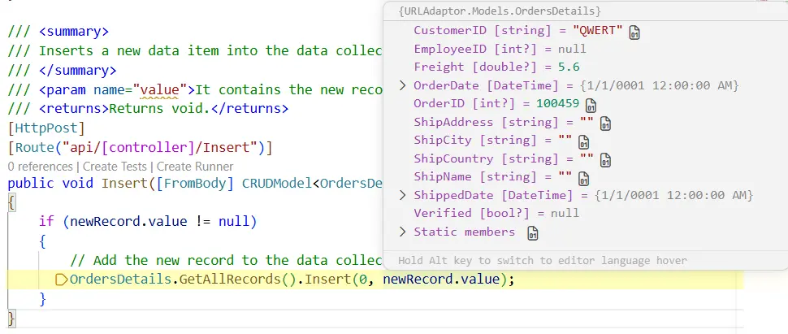
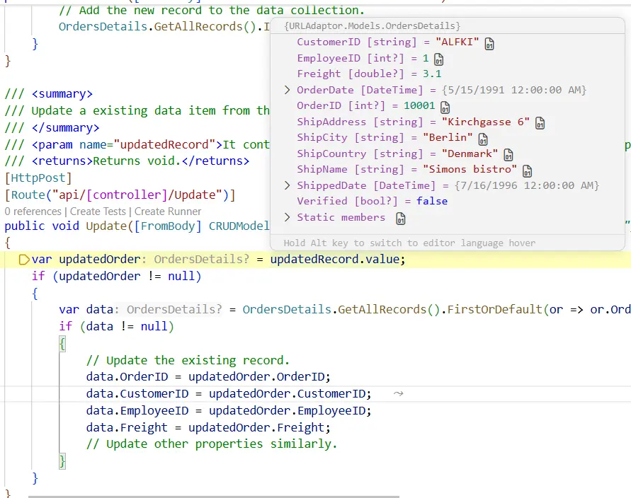
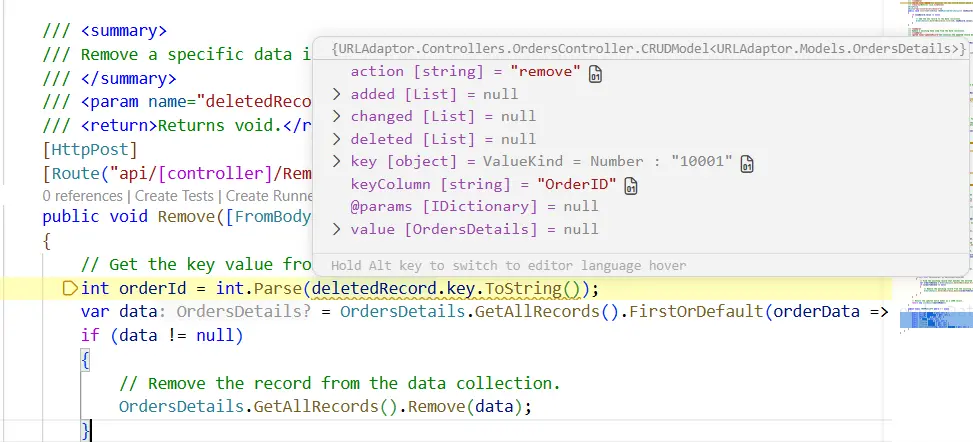
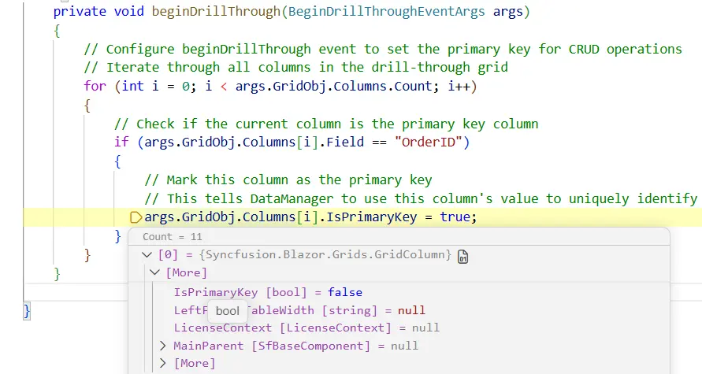

# UrlAdaptor in Blazor Pivot Table

The [UrlAdaptor](https://blazor.syncfusion.com/documentation/data/adaptors#url-adaptor) serves as the base adaptor for facilitating communication between remote data services and the Blazor Pivot Table component. It enables seamless data binding and interaction with custom API services or any remote service through URLs. The `UrlAdaptor` is particularly useful in scenarios where a custom API service with unique logic for handling data and CRUD operations is in place. This approach allows for custom handling of data, with the resultant data returned in the `result` and `count` format for display in the [Blazor Pivot Table](https://www.syncfusion.com/blazor-components/blazor-pivot-table).

This section describes a step-by-step process for retrieving data using the `UrlAdaptor` and binding it to the Blazor Pivot Table to facilitate data and CRUD operations.

## Creating an API Service

To configure a server with the Blazor Pivot Table, follow these steps:

**1. Create a Blazor web app**

You can create a **Blazor Web App** using Visual Studio 2022, either via [Microsoft Templates](https://learn.microsoft.com/en-us/aspnet/core/blazor/tooling?view=aspnetcore-8.0) or the [Syncfusion® Blazor Extension](https://blazor.syncfusion.com/documentation/visual-studio-integration/template-studio). Make sure to configure the appropriate [interactive render mode](https://learn.microsoft.com/en-us/aspnet/core/blazor/components/render-modes?view=aspnetcore-8.0#render-modes) and [interactivity location](https://learn.microsoft.com/en-us/aspnet/core/blazor/tooling?view=aspnetcore-8.0&pivots=windows).

**2. Create a model class**

Create a new folder named **Models**. Then, add a model class named **OrdersDetails.cs** in the **Models** folder to represent the order data for the Pivot Table.

```csharp
namespace URLAdaptor.Models
{
    public class OrdersDetails
    {
        // Static list to hold order data.
        public static List<OrdersDetails> order = new List<OrdersDetails>();

        // Default constructor.
        public OrdersDetails() { }

        // Parameterized constructor to initialize order details.
        public OrdersDetails(int OrderID, string CustomerId, int EmployeeId, double Freight, bool Verified, DateTime OrderDate, string ShipCity, string ShipName, string ShipCountry, DateTime ShippedDate, string ShipAddress)
        {
            this.OrderID = OrderID;
            this.CustomerID = CustomerId;
            this.EmployeeID = EmployeeId;
            this.Freight = Freight;
            this.ShipCity = ShipCity;
            this.Verified = Verified;
            this.OrderDate = OrderDate;
            this.ShipName = ShipName;
            this.ShipCountry = ShipCountry;
            this.ShippedDate = ShippedDate;
            this.ShipAddress = ShipAddress;
        }

        // Method to generate sample order records.
        public static List<OrdersDetails> GetAllRecords()
        {
            if (order.Count() == 0)
            {
                int code = 10000;
                for (int i = 1; i < 10; i++)
                {
                    order.Add(new OrdersDetails(code + 1, "ALFKI", i + 0, 2.3 * i, false, new DateTime(1991, 05, 15), "Berlin", "Simons bistro", "Denmark", new DateTime(1996, 7, 16), "Kirchgasse 6"));
                    order.Add(new OrdersDetails(code + 2, "ANATR", i + 2, 3.3 * i, true, new DateTime(1990, 04, 04), "Madrid", "Queen Cozinha", "Brazil", new DateTime(1996, 9, 11), "Avda. Azteca 123"));
                    order.Add(new OrdersDetails(code + 3, "ANTON", i + 1, 4.3 * i, true, new DateTime(1957, 11, 30), "Cholchester", "Frankenversand", "Germany", new DateTime(1996, 10, 7), "Carrera 52 con Ave. Bolívar #65-98 Llano Largo"));
                    order.Add(new OrdersDetails(code + 4, "BLONP", i + 3, 5.3 * i, false, new DateTime(1930, 10, 22), "Marseille", "Ernst Handel", "Austria", new DateTime(1996, 12, 30), "Magazinweg 7"));
                    order.Add(new OrdersDetails(code + 5, "BOLID", i + 4, 6.3 * i, true, new DateTime(1953, 02, 18), "Tsawassen", "Hanari Carnes", "Switzerland", new DateTime(1997, 12, 3), "1029 - 12th Ave. S."));
                    code += 5;
                }
            }
            return order;
        }

        // Properties representing order details.
        public int? OrderID { get; set; }
        public string? CustomerID { get; set; }
        public int? EmployeeID { get; set; }
        public double? Freight { get; set; }
        public string? ShipCity { get; set; }
        public bool? Verified { get; set; }
        public DateTime OrderDate { get; set; }
        public string? ShipName { get; set; }
        public string? ShipCountry { get; set; }
        public DateTime ShippedDate { get; set; }
        public string? ShipAddress { get; set; }
    }
}
```

**3. Create an API controller**

Create an API controller (aka, **OrdersController.cs**) file under **Controllers** folder that helps to establish data communication with the Blazor Pivot Table. This controller includes endpoints for reading data and performing CRUD operations (Insert, Update, Delete) in the drill-through grid.

```csharp
using Microsoft.AspNetCore.Mvc;
using Syncfusion.Blazor.Data;
using Syncfusion.Blazor;
using URLAdaptor.Models;

namespace URLAdaptor.Controllers
{
    [ApiController]
    public class OrdersController : ControllerBase
    {
        /// <summary>
        /// Retrieve data from the data source.
        /// </summary>
        /// <returns>Returns a list of ordersdetails records.</returns>
        [HttpGet]
        [Route("api/[controller]")]
        public List<OrdersDetails> GetOrderData()
        {
            return OrdersDetails.GetAllRecords().ToList();
        }

        /// <summary>
        /// Handles data retrieval for the Pivot Table and returns the processed data.
        /// </summary>
        /// <param name="DataManagerRequest">The request object for data retrieval.</param>
        /// <returns>Returns a response containing all data records and the total record count.</returns>
        [HttpPost]
        [Route("api/[controller]")]
        public object Post([FromBody] DataManagerRequest DataManagerRequest)
        {
            // Retrieve data from the data source.
            IQueryable<OrdersDetails> DataSource = GetOrderData().AsQueryable();

            // Get the total records count.
            int totalRecordsCount = DataSource.Count();

            // Return data and count.
            return new { result = DataSource, count = totalRecordsCount };
        }

        /// <summary>
        /// Inserts a new data item into the data collection.
        /// </summary>
        /// <param name="newRecord">It contains the new record detail which is need to be inserted.</param>
        /// <returns>Returns void.</returns>
        [HttpPost]
        [Route("api/[controller]/Insert")]
        public void Insert([FromBody] CRUDModel<OrdersDetails> newRecord)
        {
            if (newRecord.value != null)
            {
                // Add the new record to the data collection.
                OrdersDetails.GetAllRecords().Insert(0, newRecord.value);
            }
        }

        /// <summary>
        /// Update a existing data item from the data collection.
        /// </summary>
        /// <param name="updatedRecord">It contains the updated record detail which is need to be updated.</param>
        /// <returns>Returns void.</returns>
        [HttpPost]
        [Route("api/[controller]/Update")]
        public void Update([FromBody] CRUDModel<OrdersDetails> updatedRecord)
        {
            var updatedOrder = updatedRecord.value;
            if (updatedOrder != null)
            {
                var data = OrdersDetails.GetAllRecords().FirstOrDefault(or => or.OrderID == updatedOrder.OrderID);
                if (data != null)
                {
                    // Update the existing record.
                    data.OrderID = updatedOrder.OrderID;
                    data.CustomerID = updatedOrder.CustomerID;
                    data.EmployeeID = updatedOrder.EmployeeID;
                    data.Freight = updatedOrder.Freight;
                    // Update other properties similarly.
                }
            }
        }

        /// <summary>
        /// Remove a specific data item from the data collection.
        /// </summary>
        /// <param name="deletedRecord">It contains the specific record detail which is need to be removed.</param>
        /// <return>Returns void.</return>
        [HttpPost]
        [Route("api/[controller]/Remove")]
        public void Remove([FromBody] CRUDModel<OrdersDetails> deletedRecord)
        {
            // Get the key value from the deletedRecord.
            int orderId = int.Parse(deletedRecord.key?.ToString() ?? "0");
            var data = OrdersDetails.GetAllRecords().FirstOrDefault(orderData => orderData.OrderID == orderId);
            if (data != null)
            {
                // Remove the record from the data collection.
                OrdersDetails.GetAllRecords().Remove(data);
            }
        }

        /// <summary>
        /// CRUD Model for handling data operations.
        /// </summary>
        public class CRUDModel<T> where T : class
        {
            public string? action { get; set; }
            public string? keyColumn { get; set; }
            public object? key { get; set; }
            public T? value { get; set; }
            public List<T>? added { get; set; }
            public List<T>? changed { get; set; }
            public List<T>? deleted { get; set; }
            public IDictionary<string, object>? @params { get; set; }
        }
    }
}
```

> The **GetOrderData** method retrieves sample order data. Replace it with your custom logic to fetch data from a database or other sources.

**4. Register controllers in `Program.cs`**

Add the following lines in the `Program.cs` file to register controllers:

```csharp
// Register controllers in the service container.
builder.Services.AddControllers();

// Map controller routes.
app.MapControllers();
```

The complete `Program.cs` file should look like this:

```csharp
using URLAdaptor.Components;
using Syncfusion.Blazor;

var builder = WebApplication.CreateBuilder(args);
builder.Services.AddSyncfusionBlazor();

// Add services to the container.
builder.Services.AddRazorComponents()
    .AddInteractiveServerComponents();

builder.Services.AddControllers();

var app = builder.Build();

// Configure the HTTP request pipeline.
if (!app.Environment.IsDevelopment())
{
    app.UseExceptionHandler("/Error", createScopeForErrors: true);
    // The default HSTS value is 30 days. You may want to change this for production scenarios, see https://aka.ms/aspnetcore-hsts.
    app.UseHsts();
}

app.UseHttpsRedirection();
app.MapControllers();

app.UseAntiforgery();

app.MapStaticAssets();
app.MapRazorComponents<App>()
    .AddInteractiveServerRenderMode();

app.Run();
```

**5. Run the application**

Run the application in Visual Studio. The API will be accessible at the URL configured in `Properties/launchSettings.json` (for the default HTTP profile: **http://localhost:5145/api/orders**, or for the HTTPS profile: **https://localhost:7169/api/orders**). Verify that the API returns the order data.



## Connecting Blazor Pivot Table to an API service

To integrate the Blazor Pivot Table into your project using Visual Studio, follow the below steps:

**1. Install Blazor Pivot Table and Themes NuGet packages**

To add the Blazor Pivot Table in the app, open the NuGet Package Manager in Visual Studio (*Tools → NuGet Package Manager → Manage NuGet Packages for Solution*), search and install [Syncfusion.Blazor.PivotTable](https://www.nuget.org/packages/Syncfusion.Blazor.PivotTable/) and [Syncfusion.Blazor.Themes](https://www.nuget.org/packages/Syncfusion.Blazor.Themes/).

Alternatively, use the following Package Manager commands:

```powershell
Install-Package Syncfusion.Blazor.PivotTable -Version {{ site.releaseversion }}
Install-Package Syncfusion.Blazor.Themes -Version {{ site.releaseversion }}
```

> Blazor components are available on [nuget.org](https://www.nuget.org/packages?q=syncfusion.blazor). Refer to the [NuGet packages](https://blazor.syncfusion.com/documentation/nuget-packages) topic for a complete list of available packages.

**2. Register Blazor service**

- Open the **~/_Imports.razor** file and import the required namespaces.

```cs
@using Syncfusion.Blazor
@using Syncfusion.Blazor.PivotView
@using Syncfusion.Blazor.Data
```

- Register the Blazor service in the **~/Program.cs** file.

```csharp
using Syncfusion.Blazor;

builder.Services.AddSyncfusionBlazor();
```

**3. Add stylesheet and script resources**

Include the theme stylesheet and script references in the **~/Components/App.razor** file. The `App.razor` file in the .NET 8+ Blazor Web App template also requires the render mode to be applied to the `<HeadOutlet>` and `<Routes>` components for the Pivot Table to function correctly.

```html
<head>
    ....
    <link href="_content/Syncfusion.Blazor.Themes/bootstrap5.css" rel="stylesheet" />
</head>
....
<body>
    ....
    <script src="_framework/blazor.web.js"></script>
    <script src="_content/Syncfusion.Blazor.Core/scripts/syncfusion-blazor.min.js" type="text/javascript"></script>
</body>
```

> * Refer to the [Blazor Themes](https://blazor.syncfusion.com/documentation/appearance/themes) topic for various methods to include themes (e.g., Static Web Assets, CDN, or CRG).
> * Set the render mode to **InteractiveServer** or **InteractiveAuto** in your Blazor Web App configuration.

**4. Add Blazor Pivot Table and Configure with Server**

To connect the Blazor Pivot Table to a hosted API, use the [Url](https://help.syncfusion.com/cr/blazor/Syncfusion.Blazor.DataManager.html#Syncfusion_Blazor_DataManager_Url) property of [SfDataManager](https://help.syncfusion.com/cr/blazor/Syncfusion.Blazor.DataManager.html). Update the **Index.razor** file as follows.

The `SfDataManager` offers multiple adaptor options to connect with remote database based on an API service. Below is an example of the [UrlAdaptor](https://blazor.syncfusion.com/documentation/data/adaptors#url-adaptor) configuration where an API service is set up to return the resulting data in the result and count format. The full controller (including CRUD endpoints) was created in Step 3 above; only the read actions are referenced here.




@page "/"
@using Syncfusion.Blazor.Data
@using Syncfusion.Blazor.PivotView
@using URLAdaptor.Models

<SfPivotView TValue="OrdersDetails" Width="1000" Height="300" ShowFieldList="true">
    <PivotViewDataSourceSettings TValue="OrdersDetails" ExpandAll=false EnableSorting=true>
        <SfDataManager Url="http://localhost:5145/api/orders" Adaptor="Adaptors.UrlAdaptor"></SfDataManager>
        <PivotViewColumns>
            <PivotViewColumn Name="OrderID"></PivotViewColumn>
        </PivotViewColumns>
        <PivotViewRows>
            <PivotViewRow Name="CustomerID"></PivotViewRow>
        </PivotViewRows>
        <PivotViewValues>
            <PivotViewValue Name="Freight" Caption="Freight"></PivotViewValue>
        </PivotViewValues>
    </PivotViewDataSourceSettings>
    <PivotViewGridSettings ColumnWidth="120"></PivotViewGridSettings>
</SfPivotView>





using Microsoft.AspNetCore.Mvc;
using Syncfusion.Blazor.Data;
using Syncfusion.Blazor;
using URLAdaptor.Models;

namespace URLAdaptor.Controllers
{
    [ApiController]
    public class OrdersController : ControllerBase
    {
        /// <summary>
        /// Retrieve data from the data source.
        /// </summary>
        /// <returns>Returns a list of ordersdetails records.</returns>
        [HttpGet]
        [Route("api/[controller]")]
        public List<OrdersDetails> GetOrderData()
        {
            return OrdersDetails.GetAllRecords().ToList();
        }

        /// <summary>
        /// Handles server-side data operations such as searching, filtering, sorting, paging, and returns the processed data.
        /// </summary>
        /// <param name="DataManagerRequest">The request object contains data operation parameters such as search, filter, sort, and pagination details.</param>
        /// <returns>Returns a response containing the processed data and the total record count.</returns>
        [HttpPost]
        [Route("api/[controller]")]
        public object Post([FromBody] DataManagerRequest DataManagerRequest)
        {
            // Retrieve data from the data source.
            IQueryable<OrdersDetails> DataSource = GetOrderData().AsQueryable();

            // Get total records count.
            int totalRecordsCount = DataSource.Count();

            // Return data and count.
            return new { result = DataSource, count = totalRecordsCount };
        }
    }
}




> Replace `http://localhost:5145/api/orders` with the actual URL of your API endpoint that provides the data in a consumable format (e.g., JSON). The default port comes from the `http` profile in `Properties/launchSettings.json`; if you change it, update the `Url` property in `Index.razor` to match.

**5. Run the application**

When you run the application, the Blazor Pivot Table will display data fetched from the API.




## Handling CRUD operations

The Blazor Pivot Table seamlessly integrates CRUD (Create, Read, Update, and Delete) operations with server-side controller actions through specific properties: [InsertUrl](https://help.syncfusion.com/cr/blazor/Syncfusion.Blazor.DataManager.html#Syncfusion_Blazor_DataManager_InsertUrl), [RemoveUrl](https://help.syncfusion.com/cr/blazor/Syncfusion.Blazor.DataManager.html#Syncfusion_Blazor_DataManager_RemoveUrl), and [UpdateUrl](https://help.syncfusion.com/cr/blazor/Syncfusion.Blazor.DataManager.html#Syncfusion_Blazor_DataManager_UpdateUrl). These properties let the Pivot Table communicate with the data service for every action, enabling server-side operations.

**CRUD Operations Mapping**

CRUD operations within the Pivot Table can be mapped to server-side controller actions using specific properties:

1. **InsertUrl**: Specifies the URL for inserting new data.
2. **RemoveUrl**: Specifies the URL for removing existing data.
3. **UpdateUrl**: Specifies the URL for updating existing data.

**Edit Modes Available**

The Pivot Table supports different edit modes for handling data modifications in the drill-through grid. The edit mode is configured through the `Mode` property of [PivotViewCellEditSettings](https://help.syncfusion.com/cr/blazor/Syncfusion.Blazor.PivotView.PivotViewCellEditSettings.html):

- **EditMode.Normal (Inline Editing)**: Edits occur directly in the grid cells. This is the default and recommended mode for quick edits.
- **EditMode.Dialog (Modal Editing)**: Opens a modal dialog for editing record details. Useful for forms with many fields.
- **EditMode.Batch (Bulk Editing)**: Allows editing multiple records before saving all changes at once through a batch operation.

To enable editing in the Blazor Pivot Table, refer to the editing [documentation](https://blazor.syncfusion.com/documentation/pivot-table/editing). The example below demonstrates inline edit mode (Normal mode), which is the default and most common approach for CRUD operations in the drill-through grid. CRUD URLs are configured for managing data operations on the server side.

**Edit Mode: Normal (Inline Editing)**

In Normal edit mode, users can edit data directly within the cells of the drill-through grid. This mode is ideal for quick edits and single-field updates.




@page "/"
@using Syncfusion.Blazor.Data
@using Syncfusion.Blazor.PivotView
@using URLAdaptor.Models

<SfPivotView TValue="OrdersDetails" Width="1000" Height="300" ShowFieldList="true">
    <PivotViewDataSourceSettings TValue="OrdersDetails" ExpandAll=false EnableSorting=true>
        <SfDataManager Url="http://localhost:5145/api/orders" InsertUrl="http://localhost:5145/api/orders/Insert" UpdateUrl="http://localhost:5145/api/orders/Update" RemoveUrl="http://localhost:5145/api/orders/Remove" Adaptor="Adaptors.UrlAdaptor"></SfDataManager>
        <PivotViewColumns>
            <PivotViewColumn Name="OrderID"></PivotViewColumn>
        </PivotViewColumns>
        <PivotViewRows>
            <PivotViewRow Name="CustomerID"></PivotViewRow>
        </PivotViewRows>
        <PivotViewValues>
            <PivotViewValue Name="Freight" Caption="Freight"></PivotViewValue>
        </PivotViewValues>
    </PivotViewDataSourceSettings>
    <PivotViewGridSettings ColumnWidth="120"></PivotViewGridSettings>
    <PivotViewEvents TValue="OrdersDetails" BeginDrillThrough="beginDrillThrough"></PivotViewEvents>
    <PivotViewCellEditSettings AllowEditing=true AllowAdding=true AllowDeleting=true Mode=Syncfusion.Blazor.PivotView.EditMode.Normal></PivotViewCellEditSettings>
</SfPivotView>

@code{
    private void beginDrillThrough(BeginDrillThroughEventArgs args)
    {
        // Configure beginDrillThrough event to set the primary key for CRUD operations
        // Iterate through all columns in the drill-through grid
        for (int i = 0; i < args.GridObj.Columns.Count; i++)
        {
            // Check if the current column is the primary key column
            if (args.GridObj.Columns[i].Field == "OrderID")
            {
                // Mark this column as the primary key
                // This tells DataManager to use this column's value to uniquely identify records
                args.GridObj.Columns[i].IsPrimaryKey = true;
            }
        }
    }
}




> To enable CRUD operations, ensure that the primary key is properly configured in the drill-through grid event handler. The example above wires the `BeginDrillThrough` event so the `OrderID` column is marked as the primary key on the drill-through grid; without this, Insert, Update, and Delete operations in the drill-through grid will not be able to uniquely identify records.

The below class is used to structure data sent during CRUD operations.

```cs
public class CRUDModel<T> where T : class
{
  public string? action { get; set; }
  public string? keyColumn { get; set; }
  public object? key { get; set; }
  public T? value { get; set; }
  public List<T>? added { get; set; }
  public List<T>? changed { get; set; }
  public List<T>? deleted { get; set; }
  public IDictionary<string, object>? @params { get; set; }
}
```

### Insert operation

To insert a new record, use the [InsertUrl](https://help.syncfusion.com/cr/blazor/Syncfusion.Blazor.DataManager.html#Syncfusion_Blazor_DataManager_InsertUrl) property to specify the controller action mapping URL for the insert operation. The details of the newly added record are passed to the **newRecord** parameter.






/// <summary>
/// Inserts a new data item into the data collection.
/// </summary>
/// <param name="newRecord">It contains the new record detail which is need to be inserted.</param>
/// <returns>Returns void.</returns>
[HttpPost]
[Route("api/[controller]/Insert")]
public void Insert([FromBody] CRUDModel<OrdersDetails> newRecord)
{
    if (newRecord.value != null)
    {
        // Add the new record to the data collection.
        OrdersDetails.GetAllRecords().Insert(0, newRecord.value);
    }
}




### Update operation

For updating existing records, use the [UpdateUrl](https://help.syncfusion.com/cr/blazor/Syncfusion.Blazor.DataManager.html#Syncfusion_Blazor_DataManager_UpdateUrl) property to specify the controller action mapping URL for the update operation. The details of the updated record are passed to the **updatedRecord** parameter.






/// <summary>
/// Update a existing data item from the data collection.
/// </summary>
/// <param name="updatedRecord">It contains the updated record detail which is need to be updated.</param>
/// <returns>Returns void.</returns>
[HttpPost]
[Route("api/[controller]/Update")]
public void Update([FromBody] CRUDModel<OrdersDetails> updatedRecord)
{
    var updatedOrder = updatedRecord.value;
    if (updatedOrder != null)
    {
        var data = OrdersDetails.GetAllRecords().FirstOrDefault(or => or.OrderID == updatedOrder.OrderID);
        if (data != null)
        {
            // Update the existing record.
            data.OrderID = updatedOrder.OrderID;
            data.CustomerID = updatedOrder.CustomerID;
            data.EmployeeID = updatedOrder.EmployeeID;
            data.Freight = updatedOrder.Freight;
            // Update other properties similarly.
        }
    }
}




### Delete operation

To delete existing records, use the [RemoveUrl](https://help.syncfusion.com/cr/blazor/Syncfusion.Blazor.DataManager.html#Syncfusion_Blazor_DataManager_RemoveUrl) property to specify the controller action mapping URL for the delete operation. The primary key value of the deleted record is passed to the **deletedRecord** parameter.






/// <summary>
/// Remove a specific data item from the data collection.
/// </summary>
/// <param name="deletedRecord">It contains the specific record detail which is need to be removed.</param>
/// <return>Returns void.</return>
[HttpPost]
[Route("api/[controller]/Remove")]
public void Remove([FromBody] CRUDModel<OrdersDetails> deletedRecord)
{
    // Get the key value from the deletedRecord.
    int orderId = int.Parse(deletedRecord.key?.ToString() ?? "0");
    var data = OrdersDetails.GetAllRecords().FirstOrDefault(orderData => orderData.OrderID == orderId);
    if (data != null)
    {
        // Remove the record from the data collection.
        OrdersDetails.GetAllRecords().Remove(data);
    }
}




### Handling CRUD Events

The Pivot Table provides several events to handle CRUD operations:

| Event | Purpose |
|-------|---------|
| **BeginDrillThrough** | Fired before the drill-through grid is rendered. Configure the primary key here (see [Configuring Primary Key for CRUD Operations](#configuring-primary-key-for-crud-operations)). |
| **ActionBegin** | Fired before a CRUD action starts (add, edit, delete). |
| **ActionComplete** | Fired after a CRUD operation completes successfully. |
| **ActionFailure** | Fired when a CRUD operation fails. Use for error handling. |

**Example: Handling ActionComplete Event**

```razor
<SfPivotView TValue="OrdersDetails" Width="1000" Height="300" ShowFieldList="true">
    <PivotViewEvents TValue="OrdersDetails" 
        BeginDrillThrough="beginDrillThrough" 
        ActionComplete="OnActionComplete"
        ActionFailure="OnActionFailure">
    </PivotViewEvents>
    <!-- Other settings -->
</SfPivotView>

@code{
    private void OnActionComplete(PivotActionCompleteEventArgs args)
    {
        if (args.ActionType == PivotActionType.Insert)
        {
            // Handle successful insert
            Console.WriteLine("Record inserted successfully");
        }
    }

    private void OnActionFailure(PivotActionFailureEventArgs args)
    {
        // Handle error
        Console.WriteLine($"Error: {args.Error}");
    }
}
```

### Configuring Primary Key for CRUD Operations

For CRUD operations to function correctly in the Drill-Through mode of the Pivot Table, you must configure the primary key column. This is done by handling the `BeginDrillThrough` event and marking the primary key column before the drill-through grid is rendered.



@page "/"
@using Syncfusion.Blazor.Data
@using Syncfusion.Blazor.PivotView
@using URLAdaptor.Models

<SfPivotView TValue="OrdersDetails" Width="1000" Height="300" ShowFieldList="true">
    <PivotViewDataSourceSettings TValue="OrdersDetails" ExpandAll=false EnableSorting=true>
        <SfDataManager Url="http://localhost:5145/api/orders" InsertUrl="http://localhost:5145/api/orders/Insert" UpdateUrl="http://localhost:5145/api/orders/Update" RemoveUrl="http://localhost:5145/api/orders/Remove" Adaptor="Adaptors.UrlAdaptor"></SfDataManager>
        <PivotViewColumns>
            <PivotViewColumn Name="OrderID"></PivotViewColumn>
        </PivotViewColumns>
        <PivotViewRows>
            <PivotViewRow Name="CustomerID"></PivotViewRow>
        </PivotViewRows>
        <PivotViewValues>
            <PivotViewValue Name="Freight" Caption="Freight"></PivotViewValue>
        </PivotViewValues>
    </PivotViewDataSourceSettings>
    <PivotViewGridSettings ColumnWidth="120"></PivotViewGridSettings>
    <PivotViewEvents TValue="OrdersDetails" BeginDrillThrough="beginDrillThrough"></PivotViewEvents>
    <PivotViewCellEditSettings AllowEditing=true AllowAdding=true AllowDeleting=true Mode=Syncfusion.Blazor.PivotView.EditMode.Normal></PivotViewCellEditSettings>
</SfPivotView>

@code{
    private void beginDrillThrough(BeginDrillThroughEventArgs args)
    {
        // Configure beginDrillThrough event to set the primary key for CRUD operations
        // Iterate through all columns in the drill-through grid
        for (int i = 0; i < args.GridObj.Columns.Count; i++)
        {
            // Check if the current column is the primary key column
            if (args.GridObj.Columns[i].Field == "OrderID")
            {
                // Mark this column as the primary key
                // This tells DataManager to use this column's value to uniquely identify records
                args.GridObj.Columns[i].IsPrimaryKey = true;
            }
        }
    }
}





> The `BeginDrillThrough` event is triggered when drilling through the Pivot Table data. This is where you configure the primary key column for the drill-through grid, which is essential for CRUD operations to work correctly.

### Edit Mode: Dialog (Modal Form Editing)

In Dialog edit mode, a modal dialog form appears when users add or edit records. This mode is ideal for complex forms with multiple fields or when you need better control over data entry validation.



@page "/"
@using Syncfusion.Blazor.Data
@using Syncfusion.Blazor.PivotView
@using URLAdaptor.Models

<SfPivotView TValue="OrdersDetails" Width="1000" Height="300" ShowFieldList="true">
    <PivotViewDataSourceSettings TValue="OrdersDetails" ExpandAll=false EnableSorting=true>
        <SfDataManager Url="http://localhost:5145/api/orders" InsertUrl="http://localhost:5145/api/orders/Insert" UpdateUrl="http://localhost:5145/api/orders/Update" RemoveUrl="http://localhost:5145/api/orders/Remove" Adaptor="Adaptors.UrlAdaptor"></SfDataManager>
        <PivotViewColumns>
            <PivotViewColumn Name="OrderID"></PivotViewColumn>
        </PivotViewColumns>
        <PivotViewRows>
            <PivotViewRow Name="CustomerID"></PivotViewRow>
        </PivotViewRows>
        <PivotViewValues>
            <PivotViewValue Name="Freight" Caption="Freight"></PivotViewValue>
        </PivotViewValues>
    </PivotViewDataSourceSettings>
    <PivotViewGridSettings ColumnWidth="120"></PivotViewGridSettings>
    <PivotViewEvents TValue="OrdersDetails" BeginDrillThrough="beginDrillThrough"></PivotViewEvents>
    <!-- Dialog edit mode -->
    <PivotViewCellEditSettings AllowEditing=true AllowAdding=true AllowDeleting=true Mode=Syncfusion.Blazor.PivotView.EditMode.Dialog></PivotViewCellEditSettings>
</SfPivotView>

@code{
    private void beginDrillThrough(BeginDrillThroughEventArgs args)
    {
        for (int i = 0; i < args.GridObj.Columns.Count; i++)
        {
            if (args.GridObj.Columns[i].Field == "OrderID")
            {
                args.GridObj.Columns[i].IsPrimaryKey = true;
            }
        }
    }
}



> In Dialog mode, a form dialog appears for adding or editing records, which provides a better UX for complex data entry scenarios.

## Understanding the Data Flow

The request and response flow between the Blazor Pivot Table, `SfDataManager`, `UrlAdaptor`, Controller, and data source follows this pattern:

**1. Initial Data Load (Read Operation)**

- The Blazor Pivot Table with `UrlAdaptor` sends an HTTP POST request to the API endpoint specified in the `Url` property.
- The request includes a [DataManagerRequest](https://help.syncfusion.com/cr/blazor/Syncfusion.Blazor.DataManagerRequest.html) object to retrieve all data records.
- The Controller's `Post` method processes the request and returns a response object containing:
  - `result`: The data records to be displayed in the Pivot Table
  - `count`: The total number of records

**Example Request:**
```
POST http://localhost:5145/api/orders
Content-Type: application/json

{}
```

**Example Response:**
```json
{
  "result": [
    {
      "OrderID": 10001,
      "CustomerID": "ALFKI",
      "EmployeeID": 1,
      "Freight": 2.3,
      "ShipCity": "Berlin",
      "Verified": false,
      "OrderDate": "1991-05-15T00:00:00",
      "ShipName": "Simons bistro",
      "ShipCountry": "Denmark",
      "ShippedDate": "1996-07-16T00:00:00",
      "ShipAddress": "Kirchgasse 6"
    },
    {
      "OrderID": 10002,
      "CustomerID": "ANATR",
      "EmployeeID": 2,
      "Freight": 3.3,
      "ShipCity": "Madrid",
      "Verified": true,
      "OrderDate": "1990-04-04T00:00:00",
      "ShipName": "Queen Cozinha",
      "ShipCountry": "Brazil",
      "ShippedDate": "1996-09-11T00:00:00",
      "ShipAddress": "Avda. Azteca 123"
    }
  ],
  "count": 45
}
```

**2. CRUD Operations (Insert, Update, Delete)**

- When a user performs an insert, update, or delete operation in the Pivot Table's drill-through grid, the `SfDataManager` sends a request to the appropriate URL (InsertUrl, UpdateUrl, or RemoveUrl).
- The request includes a [CRUDModel](https://help.syncfusion.com/cr/blazor/Syncfusion.Blazor.DataManager.html) object containing:
  - `action`: The CRUD operation type (e.g., "insert", "update", "remove")
  - `key`: The primary key value of the record
  - `value`: The complete record data
  - `keyColumn`: The name of the primary key column

**Example Insert Request:**
```
POST http://localhost:5145/api/orders/Insert
Content-Type: application/json

{
  "value": {
    "OrderID": 10050,
    "CustomerID": "NEWCUST",
    "EmployeeID": 5,
    "Freight": 10.5,
    "ShipCity": "NewCity",
    "Verified": true,
    "OrderDate": "2024-01-15T00:00:00",
    "ShipName": "New Ship",
    "ShipCountry": "NewCountry",
    "ShippedDate": "2024-01-20T00:00:00",
    "ShipAddress": "123 New Street"
  }
}
```

> The field values shown above (for example, `"CustomerID": "NEWCUST"`, `"ShipAddress": "123 New Street"`) are illustrative. The actual values depend on the customer data being inserted by the end user.

**Example Update Request:**
```
POST http://localhost:5145/api/orders/Update
Content-Type: application/json

{
  "key": 10001,
  "keyColumn": "OrderID",
  "value": {
    "OrderID": 10001,
    "CustomerID": "ALFKI",
    "EmployeeID": 2,
    "Freight": 5.5,
    "ShipCity": "Berlin"
  }
}
```

**Example Delete Request:**
```
POST http://localhost:5145/api/orders/Remove
Content-Type: application/json

{
  "key": 10001,
  "keyColumn": "OrderID"
}
```

## API Endpoint Reference

### GET /api/orders
Retrieves the complete list of order records from the data source. This endpoint is intended for manual testing or external tools (such as Postman or Swagger) and is **not** called by the Pivot Table at runtime; the Pivot Table always uses `POST /api/orders`.

**Response:**
```json
[
  {
    "OrderID": 10001,
    "CustomerID": "ALFKI",
    "EmployeeID": 1,
    "Freight": 2.3,
    ...
  }
]
```

### POST /api/orders
Retrieves all data records for the Pivot Table based on the incoming [DataManagerRequest](https://help.syncfusion.com/cr/blazor/Syncfusion.Blazor.DataManagerRequest.html).

**Request Body:**
```json
{}
```

**Response:**
```json
{
  "result": [
    {
      "OrderID": 10001,
      "CustomerID": "ALFKI",
      "EmployeeID": 1,
      "Freight": 2.3,
      ...
    },
    {
      "OrderID": 10002,
      "CustomerID": "ANATR",
      ...
    }
  ],
  "count": 45
}
```

### POST /api/orders/Insert
Inserts a new record into the data collection.

**Request Body:**
```json
{
  "value": {
    "OrderID": 10050,
    "CustomerID": "NEWCUST",
    "EmployeeID": 5,
    "Freight": 10.5,
    "ShipCity": "NewCity",
    "Verified": true,
    "OrderDate": "2024-01-15T00:00:00",
    "ShipName": "New Ship",
    "ShipCountry": "NewCountry",
    "ShippedDate": "2024-01-20T00:00:00",
    "ShipAddress": "123 New Street"
  }
}
```

> The values shown in request/response examples are illustrative. The actual data depends on what the end user enters.

### POST /api/orders/Update
Updates an existing record in the data collection.

**Request Body:**
```json
{
  "key": 10001,
  "keyColumn": "OrderID",
  "value": {
    "OrderID": 10001,
    "CustomerID": "ALFKI",
    ...
  }
}
```

### POST /api/orders/Remove
Deletes a record from the data collection.

**Request Body:**
```json
{
  "key": 10001,
  "keyColumn": "OrderID"
}
```

## Configuration Summary

### Application Startup Configuration (Program.cs)

The following configurations are required in `Program.cs`:

1. **Add Syncfusion Blazor service**
   ```csharp
   builder.Services.AddSyncfusionBlazor();
   ```

2. **Add Razor Components with Interactive Server Render Mode**
   ```csharp
   builder.Services.AddRazorComponents()
       .AddInteractiveServerComponents();
   ```

3. **Add Controllers Support**
   ```csharp
   builder.Services.AddControllers();
   ```

4. **Map Controller Routes**
   ```csharp
   app.MapControllers();
   ```

### Dependency Injection

The application uses ASP.NET Core's built-in dependency injection:

- **Syncfusion.Blazor**: Registered via `AddSyncfusionBlazor()` to enable Syncfusion Blazor components
- **Razor Components**: Registered via `AddRazorComponents()` to support server-side rendering

### API Response Format

All API endpoints return data in a standardized format:

```csharp
new { result = DataSource, count = totalRecordsCount }
```

This format is consumed by the `UrlAdaptor` to:
- Display records in the Pivot Table
- Enable drill-through functionality

> The `count` value is used by the `UrlAdaptor` for record-count tracking. Server-side paging (`Skip` / `Take`) is not implemented in the read endpoint shown above; if you need paging, apply `DataOperations.PerformSkip` / `PerformTake` to the `IQueryable` before returning the result.

## Summary
Key points covered in this documentation:

- **Remote Data Binding**: Connect the Blazor Pivot Table to any API service using the `Url` property of `SfDataManager` with `Adaptors.UrlAdaptor`.
- **CRUD Operations**: Perform Insert, Update, and Delete operations through dedicated API endpoints in the drill-through grid via `InsertUrl`, `UpdateUrl`, and `RemoveUrl`.
- **Primary Key Configuration**: Use the `BeginDrillThrough` event to mark the primary key column so the `DataManager` can uniquely identify records during edits.
- **Standardized Request/Response Format**: Use `DataManagerRequest` for read operations and `CRUDModel<T>` for write operations.
- **In-Memory Sample Data**: The `OrdersDetails.GetAllRecords()` method seeds an in-memory list that resets on application restart; replace it with your own data-access logic for production scenarios

By following the steps outlined in this documentation, you can successfully implement a Blazor Pivot Table application that communicates with a remote API service using the UrlAdaptor, enabling full CRUD functionality within the drill-through mode.

## Complete Sample Repository

A complete, working sample implementation is available in the [GitHub repository](https://github.com/SyncfusionExamples/syncfusion-blazor-pivot-table-remote-data-binding/tree/master/UrlAdaptor).
