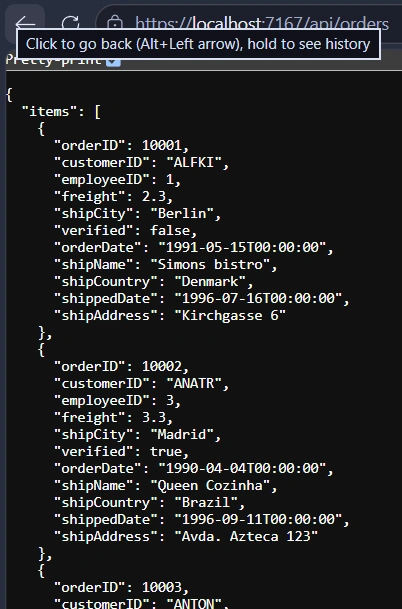
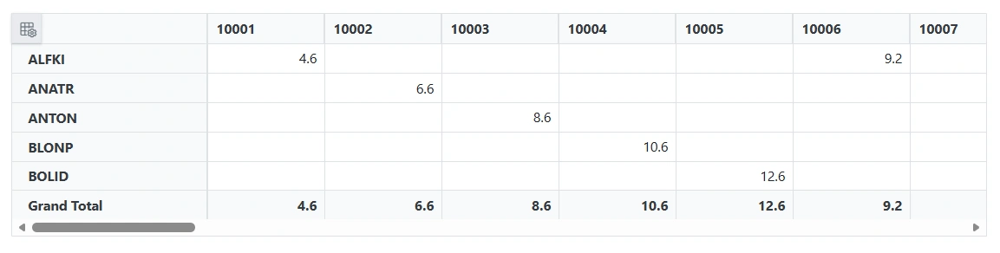
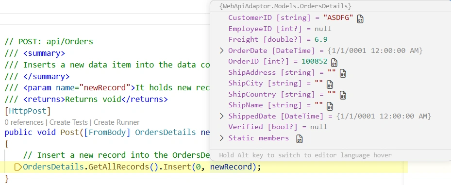
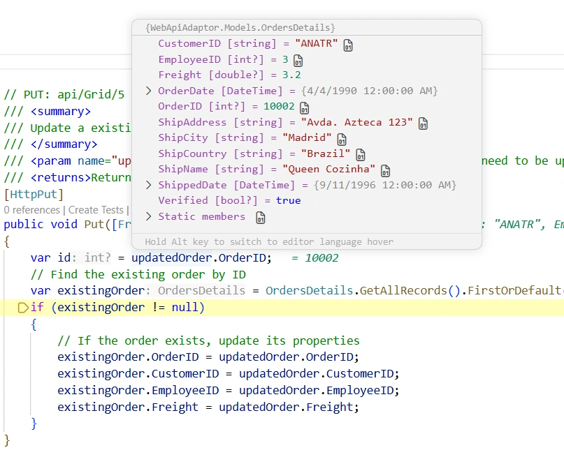
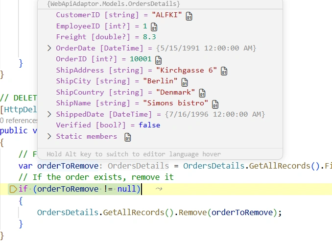

# WebApiAdaptor in Blazor Pivot Table

The [WebApiAdaptor](https://blazor.syncfusion.com/documentation/data/adaptors#web-api-adaptor) is an extension of the [ODataAdaptor](https://blazor.syncfusion.com/documentation/data/adaptors#odata-adaptor), designed to interact with Web APIs that expose OData endpoints. This adaptor ensures seamless communication between the [Blazor Pivot Table](https://www.syncfusion.com/blazor-components/blazor-pivot-table) and OData-endpoint-based Web APIs, enabling efficient data retrieval and CRUD operations. The Blazor Pivot Table fetches the entire data set from the server in a single request and performs aggregation, sorting, filtering, and paging on the client side; the server is only responsible for returning the raw data and handling CRUD (insert/update/delete) requests.

> **Note:** Server-side query parameters such as `$top`, `$skip`, `$filter`, and `$orderby` are **not** sent or processed by the Blazor Pivot Table — all grouping, aggregation, sorting, and paging happen client-side after the full data set is loaded. Only CRUD requests (POST/PUT/DELETE) are sent to the server after the initial load. To learn more about the `WebApiAdaptor`'s general request format, refer to the [ASP.NET Core OData documentation](https://learn.microsoft.com/en-us/odata/webapi-8/overview).

This section describes a step-by-step process for retrieving data using the `WebApiAdaptor` and binding it to the Blazor Pivot Table to facilitate data and CRUD operations.

## Creating an API service

To configure a server with the Blazor Pivot Table, follow these steps:

**1. Create a Blazor web app**

You can create a **Blazor Web App** named **WebApiAdaptor** using Visual Studio 2022, either via [Microsoft Templates](https://learn.microsoft.com/en-us/aspnet/core/blazor/tooling?view=aspnetcore-8.0) or the [Syncfusion® Blazor Extension](https://blazor.syncfusion.com/documentation/visual-studio-integration/template-studio). When prompted, choose the **Interactive Server** render mode and **Global** interactivity location; these settings are used throughout this guide. This sample targets **.NET 9** (required for `app.MapStaticAssets()`); on .NET 8, substitute `app.UseStaticFiles()` as noted in Step 4.

**2. Create a model class**

Create a new folder named **Models**. Then, add a model class named **OrdersDetails.cs** in the **Models** folder to represent the order data.

```csharp
namespace WebApiAdaptor.Models
{
    public class OrdersDetails
    {
        public static List<OrdersDetails> Order = new List<OrdersDetails>();
        public OrdersDetails()
        {

        }
        public OrdersDetails(
        int OrderID, string CustomerID, int EmployeeID, double Freight, bool Verified, DateTime OrderDate, string ShipCity, string ShipName, string ShipCountry, DateTime ShippedDate, string ShipAddress)
        {
            this.OrderID = OrderID;
            this.CustomerID = CustomerID;
            this.EmployeeID = EmployeeID;
            this.Freight = Freight;
            this.ShipCity = ShipCity;
            this.Verified = Verified;
            this.OrderDate = OrderDate;
            this.ShipName = ShipName;
            this.ShipCountry = ShipCountry;
            this.ShippedDate = ShippedDate;
            this.ShipAddress = ShipAddress;
        }

        public static List<OrdersDetails> GetAllRecords()
        {
            if (Order.Count == 0)
            {
                int code = 10000;
                for (int i = 1; i < 10; i++)
                {
                    Order.Add(new OrdersDetails(code + 1, "ALFKI", i + 0, 2.3 * i, false, new DateTime(1991, 05, 15), "Berlin", "Simons bistro", "Denmark", new DateTime(1996, 7, 16), "Kirchgasse 6"));
                    Order.Add(new OrdersDetails(code + 2, "ANATR", i + 2, 3.3 * i, true, new DateTime(1990, 04, 04), "Madrid", "Queen Cozinha", "Brazil", new DateTime(1996, 9, 11), "Avda. Azteca 123"));
                    Order.Add(new OrdersDetails(code + 3, "ANTON", i + 1, 4.3 * i, true, new DateTime(1957, 11, 30), "Cholchester", "Frankenversand", "Germany", new DateTime(1996, 10, 7), "Carrera 52 con Ave. Bolívar #65-98 Llano Largo"));
                    Order.Add(new OrdersDetails(code + 4, "BLONP", i + 3, 5.3 * i, false, new DateTime(1930, 10, 22), "Marseille", "Ernst Handel", "Austria", new DateTime(1996, 12, 30), "Magazinweg 7"));
                    Order.Add(new OrdersDetails(code + 5, "BOLID", i + 4, 6.3 * i, true, new DateTime(1953, 02, 18), "Tsawassen", "Hanari Carnes", "Switzerland", new DateTime(1997, 12, 3), "1029 - 12th Ave. S."));
                    code += 5;
                }
            }
            return Order;
        }

        public int? OrderID { get; set; }
        public string? CustomerID { get; set; }
        public int? EmployeeID { get; set; }
        public double? Freight { get; set; }
        public string? ShipCity { get; set; }
        public bool? Verified { get; set; }
        public DateTime OrderDate { get; set; }
        public string? ShipName { get; set; }
        public string? ShipCountry { get; set; }
        public DateTime ShippedDate { get; set; }
        public string? ShipAddress { get; set; }
    }
}
```

The `OrdersDetails` class contains a static method `GetAllRecords()` that generates sample order data used for demonstration purposes. In a production environment, this method should be replaced with logic to retrieve data from a database. Because `GetAllRecords()` mutates a static `List<>` to simulate persistence across requests, it is **not thread-safe** and must not be used as-is under concurrent load.

**3. Create an API controller**

Create a new folder named **Controllers**. Then, add a controller named **OrdersController.cs** in the **Controllers** folder to handle data communication with Blazor Pivot Table. Implement the `Get` method in the controller to return data in JSON format, including the `Items` and `Count` properties as required by the `WebApiAdaptor`.

The sample response object should look like this:

```
{
    Items: [{..}, {..}, {..}, ...],
    Count: 45
}
```




using Microsoft.AspNetCore.Mvc;
using WebApiAdaptor.Models;
using System.Collections.Generic;
using System.Linq;

namespace WebApiAdaptor.Controllers
{
    [ApiController]
    [Route("api/[controller]")]
    public class OrdersController : ControllerBase
    {
        /// <summary>
        /// Retrieve data from the data source.
        /// </summary>
        /// <returns>Returns a JSON object with the list of orders and the total count.</returns>
        [HttpGet]
        public object GetOrderData()
        {
            List<OrdersDetails> data = OrdersDetails.GetAllRecords().ToList();

            // Return the data and total count.
            return new { Items = data, Count = data.Count() };
        }
    }
}




> **Note:** The Blazor Pivot Table does not perform server-side paging, sorting, or filtering — it fetches the full data set from the server in a single GET request and processes aggregation, sorting, filtering, and paging on the client side. The `Get` method above simply returns all records in the `{ Items, Count }` shape expected by the `WebApiAdaptor`. The "Connecting" section below shows the consolidated, CRUD-enabled version of this controller.

> When using the WebApiAdaptor with the Blazor Pivot Table, the data source is returned as a pair of **Items** and **Count**. The Pivot Table makes a single request to fetch all the data from the server and performs all aggregation, sorting, filtering, and paging on the client side; only subsequent CRUD requests (POST/PUT/DELETE) are sent to the server. See the `SfDataManager` usage in [Connecting Blazor Pivot Table to an API service](#connecting-blazor-pivot-table-to-an-api-service).

**4. Register controllers in `Program.cs`**

Add the following lines to the existing `Program.cs` file to register controllers:

```csharp
// Register controllers in the service container.
builder.Services.AddControllers();

// Map controller routes.
app.MapControllers();
```

The complete `Program.cs` file should include these registrations:

```csharp
using Syncfusion.Blazor;
using WebApiAdaptor.Components;

var builder = WebApplication.CreateBuilder(args);

// Add services to the container.
builder.Services.AddRazorComponents()
    .AddInteractiveServerComponents();

builder.Services.AddControllers();

builder.Services.AddSyncfusionBlazor();
var app = builder.Build();

// Configure the HTTP request pipeline.
if (!app.Environment.IsDevelopment())
{
    app.UseExceptionHandler("/Error", createScopeForErrors: true);
    // The default HSTS value is 30 days. You may want to change this for production scenarios, see https://aka.ms/aspnetcore-hsts.
    app.UseHsts();
}

app.UseHttpsRedirection();
app.MapControllers();

app.UseAntiforgery();

app.MapStaticAssets(); // .NET 9+; on .NET 8 use app.UseStaticFiles()
app.MapRazorComponents<App>()
    .AddInteractiveServerRenderMode();

app.Run();
```

> **Note:** `AddSyncfusionBlazor()` and `app.UseAntiforgery()` require the Syncfusion Blazor packages from the [Connecting](#connecting-blazor-pivot-table-to-an-api-service) section; install those packages before running the app. If you prefer to run the API service on its own first, you can comment out `AddSyncfusionBlazor()` and the `<SfPivotView>`/`SfDataManager` references until the packages are installed.

The configuration performs the following key tasks:

- Registers ASP.NET Core Razor components with interactive server-side rendering
- Adds controller support using `AddControllers()`
- Registers Syncfusion Blazor services
- Maps controller routes using `MapControllers()`
- Configures static assets and Razor components rendering

**5. Run the application** (API service only)

Run the application in Visual Studio using the `https` launch profile defined in **Properties/launchSettings.json**. The API will be accessible at a URL like **https://localhost:7167/api/orders** for the HTTPS profile, or **http://localhost:5198/api/orders** for the HTTP profile. Verify that the API returns the order data by browsing to the HTTPS URL in a browser, then copy the **base URL of the profile actually running** (e.g. `https://localhost:7167`) — you will paste it into the `SfDataManager Url` in [Connecting Blazor Pivot Table to an API service](#connecting-blazor-pivot-table-to-an-api-service). Use the same scheme (`https`) the app is hosted on to avoid mixed-content blocking.



## Connecting Blazor Pivot Table to an API service

To integrate the Blazor Pivot Table into your project using Visual Studio, follow the below steps:

**1. Install Blazor Pivot Table and Themes NuGet packages**

To add the Blazor Pivot Table in the app, open the NuGet Package Manager in Visual Studio (*Tools → NuGet Package Manager → Manage NuGet Packages for Solution*), search and install the following packages: [Syncfusion.Blazor.PivotTable](https://www.nuget.org/packages/Syncfusion.Blazor.PivotTable/), [Syncfusion.Blazor.Themes](https://www.nuget.org/packages/Syncfusion.Blazor.Themes/), and [Syncfusion.Blazor.Data](https://www.nuget.org/packages/Syncfusion.Blazor.Data/) (required for the `SfDataManager` and `WebApiAdaptor`).

If your Blazor Web App uses `WebAssembly` or `Auto` render modes, install the Blazor NuGet packages in the client project.

Alternatively, use the following Package Manager commands (replace `<latest>` with the current release version from [nuget.org](https://www.nuget.org/packages?q=syncfusion.blazor)):

```powershell
Install-Package Syncfusion.Blazor.PivotTable -Version {{ site.releaseversion }}
Install-Package Syncfusion.Blazor.Themes -Version {{ site.releaseversion }}
Install-Package Syncfusion.Blazor.Data -Version {{ site.releaseversion }}
```

> Blazor components are available on [nuget.org](https://www.nuget.org/packages?q=syncfusion.blazor). Refer to the [NuGet packages](https://blazor.syncfusion.com/documentation/nuget-packages) topic for a complete list of available packages. The Syncfusion Blazor packages target **.NET 8 / .NET 9**; use the package version that matches your target framework.

**2. Register Blazor service**

- Open the **~/_Imports.razor** file and import the required namespaces.

```cs
@using Syncfusion.Blazor
@using Syncfusion.Blazor.PivotView
@using Syncfusion.Blazor.Data
@using Syncfusion.Blazor.Grids
@using WebApiAdaptor
@using WebApiAdaptor.Components
```

- Register the Blazor service in the **~/Program.cs** file.

```csharp
using Syncfusion.Blazor;

builder.Services.AddSyncfusionBlazor();
```

For apps using `WebAssembly` or `Auto (Server and WebAssembly)` render modes, register the service in both **~/Program.cs** files.

**3. Add stylesheet and script resources**

Include the theme stylesheet and script references in the **~/Components/App.razor** file.

```html
<head>
    ....
    <link href="_content/Syncfusion.Blazor.Themes/bootstrap5.css" rel="stylesheet" />
</head>
....
<body>
    ....
    <script src="_content/Syncfusion.Blazor.Core/scripts/syncfusion-blazor.min.js" type="text/javascript"></script>
</body>
```

> **Note:** Refer to the [Blazor Themes](https://blazor.syncfusion.com/documentation/appearance/themes) topic for various methods to include themes (e.g., Static Web Assets, CDN, or CRG). Set the render mode to **InteractiveServer** or **InteractiveAuto** in your Blazor Web App configuration. The sample applies `RenderMode.InteractiveServer` in `Components/App.razor` (`<HeadOutlet @rendermode="InteractiveServer" />` and `<Routes @rendermode="InteractiveServer" />`) and in the `Home.razor` component as needed.

**4. Add Blazor Pivot Table and configure with server**

To connect the Blazor Pivot Table to a hosted API, use the [Url](https://help.syncfusion.com/cr/blazor/Syncfusion.Blazor.DataManager.html#Syncfusion_Blazor_DataManager_Url) property of [SfDataManager](https://help.syncfusion.com/cr/blazor/Syncfusion.Blazor.Data.SfDataManager.html). The `SfDataManager` offers multiple adaptor options to connect with remote database based on an API service. Below is an example of the [WebApiAdaptor](https://blazor.syncfusion.com/documentation/data/adaptors#web-api-adaptor) configuration where an API service is set up to return the resulting data in the **Items** and **Count** format. Update the **Home.razor** file as follows.




@page "/"
@using Syncfusion.Blazor.PivotView
@using Syncfusion.Blazor.Data
@using Syncfusion.Blazor
@using WebApiAdaptor.Models

<SfPivotView TValue="OrdersDetails" Width="1000" Height="300" ShowFieldList="true">
    <PivotViewDataSourceSettings TValue="OrdersDetails" ExpandAll="false" EnableSorting="true">
    <SfDataManager Url="https://localhost:7167/api/Orders" Adaptor="Adaptors.WebApiAdaptor"></SfDataManager>
        <PivotViewColumns>
            <PivotViewColumn Name="OrderID"></PivotViewColumn>
        </PivotViewColumns>
        <PivotViewRows>
            <PivotViewRow Name="CustomerID"></PivotViewRow>
        </PivotViewRows>
        <PivotViewValues>
            <PivotViewValue Name="Freight" Caption="Freight"></PivotViewValue>
        </PivotViewValues>
    </PivotViewDataSourceSettings>
    <PivotViewGridSettings ColumnWidth="120"></PivotViewGridSettings>
</SfPivotView>





See the consolidated controller in [Creating an API service](#creating-an-api-service) → Step 3 and the [CRUD methods added in Handling CRUD operations](#handling-crud-operations).




The Blazor Pivot Table is configured with the following key components:

- **SfPivotView**: The main Pivot Table component configured with `TValue="OrdersDetails"` to specify the data type
- **SfDataManager**: Configured with the `Url` property pointing to the API endpoint and `Adaptor="Adaptors.WebApiAdaptor"` to use the WebApiAdaptor
- **PivotViewDataSourceSettings**: Defines the data source configuration and pivot field settings
- **PivotViewColumns, PivotViewRows, PivotViewValues**: Define the field layout for the Pivot Table
- **PivotViewGridSettings**: Configure grid-specific properties

> Replace `https://localhost:7167/api/Orders` with the actual URL of your API endpoint — keep the scheme (`https`/`http`) the same as the profile the app is hosted on to avoid mixed-content blocking, and ensure the API is reachable from the Blazor app origin (configure CORS if the API and app are hosted on different origins).

**5. Run the application**

When you run the application, the Blazor Pivot Table will display data fetched from the API.



## Handling CRUD operations

To manage CRUD (Create, Read, Update, and Delete) operations using the WebApiAdaptor in Blazor Pivot Table, follow the provided guide for configuring the Pivot Table for [editing](https://blazor.syncfusion.com/documentation/pivot-table/editing) and add the sample `Post`, `Put`, and `Delete` methods below to the `OrdersController` created in [Creating an API service](#creating-an-api-service) → Step 3. This controller then handles HTTP requests for CRUD operations such as **GET, POST, PUT,** and **DELETE**.

To enable CRUD operations in the Pivot Table, follow the steps below. The Pivot Table must allow drill-through so the underlying grid is rendered with the records that can be edited, added, or deleted; set `AllowDrillThrough="true"` on `SfPivotView` before adding the `PivotViewCellEditSettings` and `BeginDrillThrough` handler shown below.




@page "/"
@using Syncfusion.Blazor.PivotView
@using Syncfusion.Blazor.Data
@using Syncfusion.Blazor
@using WebApiAdaptor.Models

<SfPivotView TValue="OrdersDetails" Width="1000" Height="300" ShowFieldList="true" AllowDrillThrough="true">
    <PivotViewDataSourceSettings TValue="OrdersDetails" ExpandAll="false" EnableSorting="true">
    <SfDataManager Url="https://localhost:7167/api/Orders" Adaptor="Adaptors.WebApiAdaptor"></SfDataManager>
        <PivotViewColumns>
            <PivotViewColumn Name="OrderID"></PivotViewColumn>
        </PivotViewColumns>
        <PivotViewRows>
            <PivotViewRow Name="CustomerID"></PivotViewRow>
        </PivotViewRows>
        <PivotViewValues>
            <PivotViewValue Name="Freight" Caption="Freight"></PivotViewValue>
        </PivotViewValues>
    </PivotViewDataSourceSettings>
    <PivotViewGridSettings ColumnWidth="120"></PivotViewGridSettings>
    <PivotViewEvents TValue="OrdersDetails" BeginDrillThrough="beginDrillThrough"></PivotViewEvents>
    <PivotViewCellEditSettings AllowEditing="true" AllowAdding="true" AllowDeleting="true" Mode="Syncfusion.Blazor.PivotView.EditMode.Normal"></PivotViewCellEditSettings>
</SfPivotView>

@code{
    private void beginDrillThrough(BeginDrillThroughEventArgs args)
    {
        // Configure beginDrillThrough event to set the primary key for CRUD operations
        // Iterate through all columns in the editing popup grid
        for (int i = 0; i < args.GridObj.Columns.Count; i++)
        {
            // Check if the current column is the primary key column
            if (args.GridObj.Columns[i].Field == "OrderID")
            {
                // Mark this column as the primary key
                // This tells DataManager to use this column's value to uniquely identify records
                args.GridObj.Columns[i].IsPrimaryKey = true;
            }
        }
    }
}




This is the edit-enabled version of the `Home.razor` shown in [Connecting Blazor Pivot Table to an API service](#connecting-blazor-pivot-table-to-an-api-service); the additions are `AllowDrillThrough="true"`, the `PivotViewEvents`/`BeginDrillThrough` handler, and the `PivotViewCellEditSettings`. The `OrdersController` `Get` method from the earlier section remains unchanged.

To enable CRUD operations in the Pivot Table, configure the following:

1. **PivotViewCellEditSettings**: Enable editing, adding, and deleting capabilities
   - `AllowEditing="true"`: Allows users to edit existing records
   - `AllowAdding="true"`: Allows users to add new records
   - `AllowDeleting="true"`: Allows users to delete records
   - `Mode="Syncfusion.Blazor.PivotView.EditMode.Normal"`: Uses inline edit mode for quick edits

2. **BeginDrillThrough Event**: Configure the primary key for the editing popup
   - Iterate through columns in the editing popup grid
   - Mark the `OrderID` column as the primary key using `IsPrimaryKey = true`
   - This ensures the DataManager can uniquely identify records for CRUD operations

> Normal/inline editing is the default edit [Mode](https://help.syncfusion.com/cr/blazor/Syncfusion.Blazor.PivotView.PivotViewCellEditSettings.html#Syncfusion_Blazor_PivotView_PivotViewCellEditSettings_Mode) for the Pivot Table. To enable CRUD operations, ensure that the [IsPrimaryKey](https://help.syncfusion.com/cr/blazor/Syncfusion.Blazor.Grids.GridColumn.html#Syncfusion_Blazor_Grids_GridColumn_IsPrimaryKey) property is set to **true** for the primary key column in the drill-through grid, ensuring that its value is unique.

### Insert operation

To insert a new record into your Pivot Table, you can utilize the `HttpPost` method in your server application. The details of the newly added record are passed through the request body. Below is a sample implementation of inserting a record using the **OrdersController**:






/// <summary>
/// Inserts a new data item into the data collection.
/// </summary>
/// <param name="newRecord">Holds the details of the new record to be inserted.</param>
[HttpPost]
public void Post([FromBody] OrdersDetails newRecord)
{
    // Insert a new record into the OrdersDetails model
    OrdersDetails.GetAllRecords().Insert(0, newRecord);
}




The insert operation performs the following steps:

1. Receives the new record via HTTP POST request
2. The `newRecord` parameter contains the complete order details
3. Inserts the new record at the beginning of the data collection using `Insert(0, newRecord)`
4. The inserted record is now available to all subsequent data operations

When a user adds a new record in the Pivot Table's editing popup and saves it, the `SfDataManager` sends an HTTP POST request to the API endpoint with the new record data.

### Update operation

Updating a record in the Pivot Table can be achieved by utilizing the `HttpPut` method in your controller. The details of the updated record are passed through the request body. Here's a sample implementation of updating a record:






/// <summary>
/// Updates an existing data item in the data collection.
/// </summary>
/// <param name="updatedOrder">Contains the updated record details to be persisted.</param>
[HttpPut]
public void Put([FromBody] OrdersDetails updatedOrder)
{
    var id = updatedOrder.OrderID;
    // Find the existing order by ID.
    var existingOrder = OrdersDetails.GetAllRecords().FirstOrDefault(o => o.OrderID == id);
    if (existingOrder != null)
    {
        // Persist every editable field from the request body.
        existingOrder.OrderID = updatedOrder.OrderID;
        existingOrder.CustomerID = updatedOrder.CustomerID;
        existingOrder.EmployeeID = updatedOrder.EmployeeID;
        existingOrder.Freight = updatedOrder.Freight;
        existingOrder.ShipCity = updatedOrder.ShipCity;
        existingOrder.Verified = updatedOrder.Verified;
        existingOrder.OrderDate = updatedOrder.OrderDate;
        existingOrder.ShipName = updatedOrder.ShipName;
        existingOrder.ShipCountry = updatedOrder.ShipCountry;
        existingOrder.ShippedDate = updatedOrder.ShippedDate;
        existingOrder.ShipAddress = updatedOrder.ShipAddress;
    }
}




The update operation performs the following steps:

1. Receives the updated record via HTTP PUT request
2. Extracts the primary key (`OrderID`) from the updated record
3. Searches for the existing record in the data collection by matching the primary key
4. If found, updates the record's properties with the new values
5. The updated record is immediately reflected in the data collection

When a user edits a record in the Pivot Table's editing popup and saves the changes, the `SfDataManager` sends an HTTP PUT request with the updated record data.

### Delete operation

To delete a record from your Pivot Table, you can use the `HttpDelete` method in your controller. The primary key value of the deleted record is passed as a route parameter. The following is a sample implementation:






/// <summary>
/// Deletes a specific order record from the data collection.
/// </summary>
/// <param name="id">The id of the order to delete (matches the non-nullable route value).</param>
[HttpDelete("{id}")]
public void Delete(int id)
{
    // Find the order to remove by ID. OrderID is int? on the model, but the route
    // binds a non-nullable int, so null-key deletes are not supported by this endpoint.
    var orderToRemove = OrdersDetails.GetAllRecords().FirstOrDefault(order => order.OrderID == id);
    // If the order exists, remove it
    if (orderToRemove != null)
    {
        OrdersDetails.GetAllRecords().Remove(orderToRemove);
    }
}




The delete operation performs the following steps:

1. Receives the primary key value (`id`) as a route parameter in the HTTP DELETE request.
2. Searches for the record in the data collection by matching the primary key.
3. If a matching record is found, removes it from the data collection using the `Remove()` method.
4. The record is permanently deleted and no longer available in the Pivot Table.

When a user deletes a record in the Pivot Table's editing popup and confirms the deletion, the `SfDataManager` sends an HTTP DELETE request with the record's primary key.

> **Note:** ASP.NET Core (Blazor) Web API with batch handling is not yet supported by ASP.NET Core v3+. Therefore, it is currently not feasible to support **Batch** mode CRUD operations until ASP.NET Core provides support for batch handling. For more details, refer to [this GitHub issue](https://github.com/dotnet/aspnetcore/issues/14722).

## Understanding the data flow

The request and response flow between the Blazor Pivot Table, `SfDataManager`, `WebApiAdaptor`, controller, and data source is summarized below. For the full request/response payloads and route details, see [API endpoint reference](#api-endpoint-reference).

### Initial data load (read operation)

- The Blazor Pivot Table with `WebApiAdaptor` sends a **single** HTTP GET request to the API endpoint specified in the `Url` property; no `$top`/`$skip`/`$filter`/`$orderby` query parameters are sent.
- The request retrieves the **full** data set for client-side binding; the Pivot Table then performs aggregation, sorting, filtering, and paging on the client.
- The Controller's `Get` method processes the request and returns a response object containing:
  - `Items`: The full set of raw records
  - `Count`: The total number of records

Example: `GET https://localhost:7167/api/Orders` returns `{ "Items": [...], "Count": 45 }` (full payload in [API endpoint reference](#api-endpoint-reference)).

### CRUD operations (insert, update, delete)

When a user performs CRUD operations in the Pivot Table's editing popup, the `SfDataManager` sends HTTP requests to the corresponding endpoints:

- **Insert**: `POST https://localhost:7167/api/Orders` with the new record in the JSON body.
- **Update**: `PUT https://localhost:7167/api/Orders` with the updated record in the JSON body.
- **Delete**: `DELETE https://localhost:7167/api/Orders/{id}` with the primary key as the route parameter.

The Controller executes the corresponding CRUD operation and returns a successful response. Wire-level request/response examples for each verb are in [API endpoint reference](#api-endpoint-reference).

## API endpoint reference

### GET /api/orders

Retrieves the complete list of order records from the data source for the Pivot Table.

**Example:** `GET https://localhost:7167/api/Orders`

**Response (truncated — `Items` contains all 45 records in practice):**
```json
{
  "Items": [
    {
      "OrderID": 10001,
      "CustomerID": "ALFKI",
      "EmployeeID": 1,
      "Freight": 2.3,
      "ShipCity": "Berlin",
      "Verified": false,
      "OrderDate": "1991-05-15T00:00:00",
      "ShipName": "Simons bistro",
      "ShipCountry": "Denmark",
      "ShippedDate": "1996-07-16T00:00:00",
      "ShipAddress": "Kirchgasse 6"
    }
    // ... remaining records ...
  ],
  "Count": 45
}
```

### POST /api/orders

Inserts a new record into the data collection.

**Request Body:**
```json
{
  "OrderID": 10050,
  "CustomerID": "NEWCUST",
  "EmployeeID": 5,
  "Freight": 10.5,
  "ShipCity": "New York",
  "Verified": false,
  "OrderDate": "2024-01-15T00:00:00",
  "ShipName": "New Store",
  "ShipCountry": "USA",
  "ShippedDate": "2024-01-20T00:00:00",
  "ShipAddress": "123 Main St"
}
```

### PUT /api/orders

Updates an existing record in the data collection.

**Request Body:**
```json
{
  "OrderID": 10001,
  "CustomerID": "ALFKI",
  "EmployeeID": 2,
  "Freight": 3.5,
  "ShipCity": "Berlin",
  "Verified": true,
  "OrderDate": "1991-05-15T00:00:00",
  "ShipName": "Simons bistro",
  "ShipCountry": "Denmark",
  "ShippedDate": "1996-07-16T00:00:00",
  "ShipAddress": "Kirchgasse 6"
}
```

### DELETE /api/orders/{id}

Deletes a record from the data collection by its primary key.

**Route Parameters:**
- `id`: The primary key value (OrderID) of the record to delete

**Example:**
```
DELETE https://localhost:7167/api/Orders/10001
```

## Configuration Summary

The required `Program.cs` registrations are covered in [Creating an API service](#creating-an-api-service) → Step 4, which includes the full `Program.cs` listing. The key registrations are:

- **Razor components** (interactive server render mode): `AddRazorComponents().AddInteractiveServerComponents()`
- **Controllers**: `AddControllers()` + `app.MapControllers()`
- **Syncfusion Blazor services**: `AddSyncfusionBlazor()`
- **Razor component endpoints**: `app.MapRazorComponents<App>().AddInteractiveServerRenderMode()`
- **Static assets** (.NET 9): `app.MapStaticAssets()` — on .NET 8 use `app.UseStaticFiles()`

The app uses ASP.NET Core's built-in dependency injection for all three service groups above. For `WebAssembly` or `Auto` render modes, register services in both `Program.cs` files.

### API Response Format

All read endpoints return data in the standardized `{ Items, Count }` shape required by the `WebApiAdaptor`:

```csharp
return new { Items = data, Count = data.Count() };
```

The `WebApiAdaptor` consumes this `{ Items, Count }` payload to load the full data set into the Pivot Table. After the initial load, the Pivot Table performs aggregation, sorting, filtering, and paging on the client side; only CRUD (insert/update/delete) requests are sent back to the server.

## Complete sample repository

A complete, working sample implementation is available in the [GitHub repository](https://github.com/SyncfusionExamples/syncfusion-blazor-pivot-table-remote-data-binding/tree/master/WebApiAdaptor).

## Summary

The Blazor Pivot Table WebApiAdaptor provides a seamless integration pattern for connecting Blazor Pivot Table components to remote ASP.NET Core Web API services. By following the architecture described in this documentation:

1. Create an ASP.NET Core Web API with a `Get` endpoint that returns the full data set in the `{ Items, Count }` shape, plus `Post`, `Put`, and `Delete` endpoints for CRUD (server-side query parameters such as `$top`/`$skip`/`$filter`/`$orderby` are not used by the Pivot Table)
2. Implement the `OrdersDetails` model to represent your data
3. Create an `OrdersController` with GET, POST, PUT, and DELETE methods to handle CRUD operations
4. Configure the Blazor Pivot Table with `SfDataManager` using the `WebApiAdaptor`
5. Enable editing and configure the primary key for CRUD operations

The WebApiAdaptor automatically handles the communication between the client-side Pivot Table and the server-side API, fetching the full data set on initial load and sending only CRUD (insert/update/delete) requests back to the server. All aggregation, sorting, filtering, and paging are performed on the client side once the data is loaded.

## See also

- [Syncfusion Blazor Pivot Table documentation](https://blazor.syncfusion.com/documentation/pivot-table/getting-started)
- [WebApiAdaptor reference](https://blazor.syncfusion.com/documentation/data/adaptors#web-api-adaptor)
- [Live demo on GitHub](https://github.com/SyncfusionExamples/syncfusion-blazor-pivot-table-remote-data-binding/tree/master/WebApiAdaptor)
