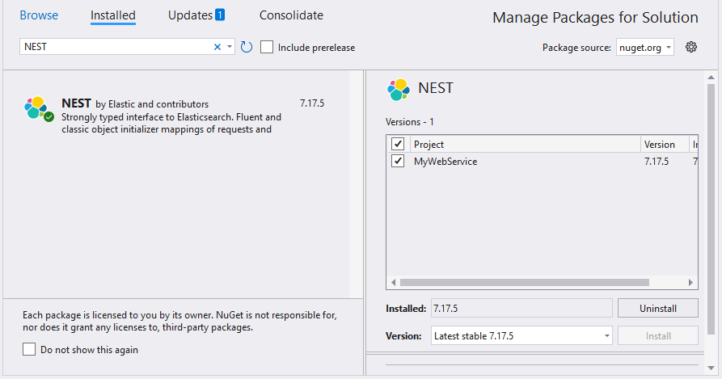

# Elasticsearch Data Binding

This guide explains how to connect an Elasticsearch database to the [Blazor Pivot Table](https://www.syncfusion.com/blazor-components/blazor-pivot-table) using the [NEST](https://www.nuget.org/packages/Nest) library. It describes two approaches: directly retrieving and binding data to the Pivot Table, and using a Web API service to fetch and display Elasticsearch data efficiently.

## Connecting an Elasticsearch Database to a Syncfusion<sup style="font-size:70%">&reg;</sup> Blazor Pivot Table

This section explains how to connect the Pivot Table component to an Elasticsearch database by directly retrieving data using the [NEST](https://www.nuget.org/packages/Nest) library.

### Step 1: Create a Pivot Table in Blazor
1. Set up a Blazor Pivot Table as described in the [Getting Started](../getting-started) documentation.

### Step 2: Install the NEST NuGet Package
1. Open the **NuGet Package Manager** in your project solution.
2. Search for the **NEST** package and install it to enable connectivity with the Elasticsearch server.



### Step 3: Configure Elasticsearch Connection
1. In the **Index.razor** page, within the `OnInitialized` method, use the **ElasticClient** class from the NEST library to establish a connection to the Elasticsearch database.
2. Use the **Search** method to query an Elasticsearch index and retrieve data.
3. Convert the retrieved data from the `Hits` collection of the `SearchResponse` into a list using `JTokenReader`.

### Step 4: Bind Data to the Pivot Table
1. Assign the populated list to the [DataSource](https://help.syncfusion.com/cr/blazor/Syncfusion.Blazor.PivotView.PivotViewDataSourceSettings-1.html#Syncfusion_Blazor_PivotView_PivotViewDataSourceSettings_1_DataSource) property within the [PivotViewDataSourceSettings](https://help.syncfusion.com/cr/blazor/Syncfusion.Blazor.PivotView.PivotViewDataSourceSettings-1.html).
2. Configure the Pivot Table report to structure the data retrieved from the Elasticsearch database.
3. Add fields to the [PivotViewRows](https://help.syncfusion.com/cr/blazor/Syncfusion.Blazor.PivotView.PivotViewDataSourceSettings-1.html#Syncfusion_Blazor_PivotView_PivotViewDataSourceSettings_1_Rows), [PivotViewColumns](https://help.syncfusion.com/cr/blazor/Syncfusion.Blazor.PivotView.PivotViewDataSourceSettings-1.html#Syncfusion_Blazor_PivotView_PivotViewDataSourceSettings_1_Columns), [PivotViewValues](https://help.syncfusion.com/cr/blazor/Syncfusion.Blazor.PivotView.PivotViewDataSourceSettings-1.html#Syncfusion_Blazor_PivotView_PivotViewDataSourceSettings_1_Values), and [PivotViewFilters](https://help.syncfusion.com/cr/blazor/Syncfusion.Blazor.PivotView.PivotViewDataSourceSettings-1.html#Syncfusion_Blazor_PivotView_PivotViewDataSourceSettings_1_Filters) properties of [PivotViewDataSourceSettings](https://help.syncfusion.com/cr/blazor/Syncfusion.Blazor.PivotView.PivotViewDataSourceSettings-1.html) to define the report structure, specifying how data fields are organized and aggregated in the Pivot Table.

Below is the sample code to bind and configure the Pivot Table with Elasticsearch data.

```cshtml
@using System.Data
@using Newtonsoft.Json
@using Newtonsoft.Json.Linq
@using Nest
@using Syncfusion.Blazor.PivotView

<SfPivotView TValue="ElasticSearchService" Width="1000" Height="300" ShowFieldList="true">
    <PivotViewDataSourceSettings TValue="ElasticSearchService" DataSource="dataList" ExpandAll="false" EnableSorting="true">
        <PivotViewColumns>
            <PivotViewColumn Name="Product"></PivotViewColumn>
        </PivotViewColumns>
        <PivotViewRows>
            <PivotViewRow Name="Date"></PivotViewRow>
        </PivotViewRows>
        <PivotViewValues>
            <PivotViewValue Name="Amount"></PivotViewValue>
        </PivotViewValues>
        <PivotViewFormatSettings>
            <PivotViewFormatSetting Name="Amount" Format="C2"></PivotViewFormatSetting>
        </PivotViewFormatSettings>
    </PivotViewDataSourceSettings>
</SfPivotView>

@code {
    private static List<ElasticSearchService> dataList = new List<ElasticSearchService>();

    protected override void OnInitialized()
    {
        // Replace with your own connection string.
        var connectionString = "<Enter your valid connection string here>";
        var uri = new Uri(connectionString);
        var connectionSettings = new ConnectionSettings(uri);
        var client = new ElasticClient(connectionSettings);
        var searchResponse = client.Search<object>(s => s
            .Index("your_index")
            .Size(1000)
        );
        var serializer = new JsonSerializer();
        foreach (var hit in searchResponse.Hits)
        {
            var source = hit.Source;
            JToken sourceToken = JToken.FromObject(source);
            using (var reader = new JTokenReader(sourceToken))
            {
                ElasticSearchService elasticResult = serializer.Deserialize<ElasticSearchService>(reader);
                dataList.Add(elasticResult);
            }
        }
    }

    public class ElasticSearchService
    {
        public int Quantity { get; set; }
        public string Product { get; set; }
        public string Date { get; set; }
        public string Country { get; set; }
        public double Amount { get; set; }
    }
}
```

### Step 5: Run and Verify the Pivot Table
1. Run the Blazor application.
2. The Pivot Table will display the data fetched from the Elasticsearch database, structured according to the defined report.
3. The resulting Pivot Table will appear as follows:


## Connecting an Elasticsearch Database to a Syncfusion<sup style="font-size:70%">&reg;</sup> Blazor Pivot Table via Web API Service

This section explains how to create a Web API service to retrieve data from an Elasticsearch database and connect it to the [Blazor Pivot Table](https://www.syncfusion.com/blazor-components/blazor-pivot-table).

### Create a Web API Service to Fetch Elasticsearch Data

Follow these steps to create a Web API service that retrieves data from an Elasticsearch database and prepares it for the Pivot Table.

#### Step 1: Create an ASP.NET Core Web Application
1. Open Visual Studio and create a new **ASP.NET Core Web App** project named **MyWebService**.
2. Follow the instructions in the [Microsoft documentation](https://learn.microsoft.com/en-us/visualstudio/get-started/csharp/tutorial-aspnet-core?view=vs-2022) to set up the project.


#### Step 2: Install the NEST NuGet Package
1. Install the **NEST** package using the **NuGet Package Manager** to enable Elasticsearch connectivity.


#### Step 3: Create a Web API Controller
1. In the **Controllers** folder, create a new Web API controller named **PivotController.cs**.
2. This controller will facilitate data communication between the Elasticsearch database and the Pivot Table.

#### Step 4: Configure Elasticsearch Connection
1. In the **PivotController.cs** file, use the **ElasticClient** class from the NEST library to establish a connection to the Elasticsearch database.
2. Use the **Search** method to query an Elasticsearch index and retrieve data.

#### Step 5: Implement Data Retrieval Logic
1. In the **PivotController.cs** file, define a **Get()** method that calls the **FetchElasticsearchData** method to retrieve data from Elasticsearch.
2. Serialize the retrieved data into JSON format using **JsonConvert.SerializeObject()**.

Here’s the sample code for the **PivotController.cs** file:

```csharp
using Microsoft.AspNetCore.Mvc;
using Nest;
using Newtonsoft.Json;

namespace MyWebService.Controllers
{
    [ApiController]
    [Route("[controller]")]
    public class PivotController : ControllerBase
    {
        [HttpGet(Name = "GetElasticSearchData")]
        public object Get()
        {
            return JsonConvert.SerializeObject(FetchElasticsearchData());
        }

        private static object FetchElasticsearchData()
        {
            // Replace with your own connection string.
            var connectionString = "<Enter your valid connection string here>";
            var uri = new Uri(connectionString);
            var connectionSettings = new ConnectionSettings(uri);
            var client = new ElasticClient(connectionSettings);
            var searchResponse = client.Search<object>(s => s
                .Index("australian_weather")
                .Size(1000)
            );
            return searchResponse.Documents;
        }
    }
}
```

#### Step 6: Run the Web Application
1. Build and run the web application.
2. The application will be hosted at the URL `https://localhost:44323`.

#### Step 7: Verify the Data
1. Access the Web API endpoint at `https://localhost:44323/Pivot` to view the JSON data retrieved from the Elasticsearch database.
2. The browser will display the JSON data, as shown below.


### Connecting the Pivot Table to an Elasticsearch Database Using the Web API Service

This section explains how to connect the Pivot Table component to an Elasticsearch database by retrieving data from the Web API service created in the previous section.

#### Step 1: Create a Pivot Table in Blazor
1. Set up a Blazor Pivot Table as described in the [Getting Started](../getting-started) documentation.

#### Step 2: Configure the Web API URL in the Pivot Table
1. In the **Index.razor** file, map the Web API URL (`https://localhost:44323/Pivot`) to the Pivot Table using the [Url](https://help.syncfusion.com/cr/blazor/Syncfusion.Blazor.PivotView.PivotViewDataSourceSettings-1.html#Syncfusion_Blazor_PivotView_PivotViewDataSourceSettings_1_Url) property within the [PivotViewDataSourceSettings](https://help.syncfusion.com/cr/blazor/Syncfusion.Blazor.PivotView.PivotViewDataSourceSettings-1.html).
2. The [Url](https://help.syncfusion.com/cr/blazor/Syncfusion.Blazor.PivotView.PivotViewDataSourceSettings-1.html#Syncfusion_Blazor_PivotView_PivotViewDataSourceSettings_1_Url) property facilitates deserializing Elasticsearch data into instances of your model data class (i.e., TValue="ElasticSearchService") for binding to the Pivot Table.

```cshtml
@using Syncfusion.Blazor.PivotView

<SfPivotView TValue="ElasticSearchService" Width="1000" Height="300" ShowFieldList="true">
    <PivotViewDataSourceSettings TValue="ElasticSearchService" Url="https://localhost:44323/Pivot" ExpandAll="false" EnableSorting="true">
    </PivotViewDataSourceSettings>
</SfPivotView>

@code {
    public class ElasticSearchService
    {
        public int Quantity { get; set; }
        public string Product { get; set; }
        public string Date { get; set; }
        public string Country { get; set; }
        public double Amount { get; set; }
    }
}
```

#### Step 3: Define the Pivot Table Report
1. Configure the Pivot Table report in the **Index.razor** file to structure the data retrieved from the Elasticsearch database.
2. Add fields to the [PivotViewRows](https://help.syncfusion.com/cr/blazor/Syncfusion.Blazor.PivotView.PivotViewDataSourceSettings-1.html#Syncfusion_Blazor_PivotView_PivotViewDataSourceSettings_1_Rows), [PivotViewColumns](https://help.syncfusion.com/cr/blazor/Syncfusion.Blazor.PivotView.PivotViewDataSourceSettings-1.html#Syncfusion_Blazor_PivotView_PivotViewDataSourceSettings_1_Columns), [PivotViewValues](https://help.syncfusion.com/cr/blazor/Syncfusion.Blazor.PivotView.PivotViewDataSourceSettings-1.html#Syncfusion_Blazor_PivotView_PivotViewDataSourceSettings_1_Values), and [PivotViewFilters](https://help.syncfusion.com/cr/blazor/Syncfusion.Blazor.PivotView.PivotViewDataSourceSettings-1.html#Syncfusion_Blazor_PivotView_PivotViewDataSourceSettings_1_Filters) properties to organize data in the Pivot Table.

```cshtml
@using Syncfusion.Blazor.PivotView

<SfPivotView TValue="ElasticSearchService" Width="1000" Height="300" ShowFieldList="true">
    <PivotViewDataSourceSettings TValue="ElasticSearchService" Url="https://localhost:44323/Pivot" ExpandAll="false" EnableSorting="true">
        <PivotViewColumns>
            <PivotViewColumn Name="Product"></PivotViewColumn>
        </PivotViewColumns>
        <PivotViewRows>
            <PivotViewRow Name="Date"></PivotViewRow>
        </PivotViewRows>
        <PivotViewValues>
            <PivotViewValue Name="Amount"></PivotViewValue>
        </PivotViewValues>
        <PivotViewFormatSettings>
            <PivotViewFormatSetting Name="Amount" Format="C2"></PivotViewFormatSetting>
        </PivotViewFormatSettings>
    </PivotViewDataSourceSettings>
</SfPivotView>

@code {
    public class ElasticSearchService
    {
        public int Quantity { get; set; }
        public string Product { get; set; }
        public string Date { get; set; }
        public string Country { get; set; }
        public double Amount { get; set; }
    }
}
```

#### Step 4: Run and Verify the Pivot Table
1. Run the Blazor application.
2. The Pivot Table will display the data fetched from the Elasticsearch database via the Web API, structured according to the defined report.
3. The resulting Pivot Table will appear as follows:


N> In [this](https://github.com/SyncfusionExamples/how-to-bind-Elasticsearch-database-to-pivot-table/tree/master/Blazor) GitHub repository, you can find our Blazor Pivot Table sample for binding data from an Elasticsearch database using the Web API service.