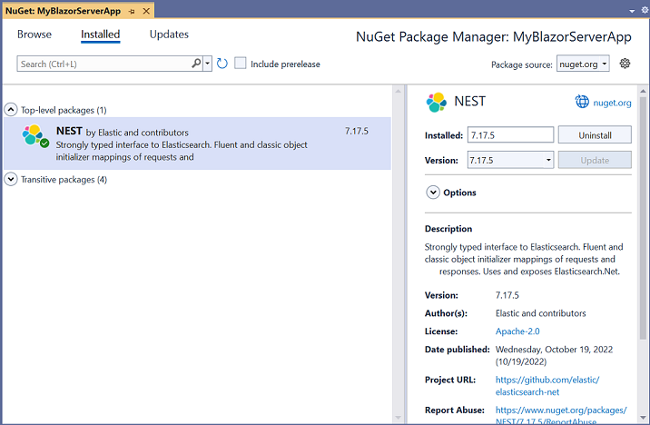
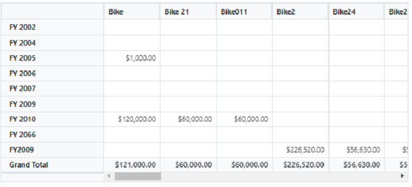
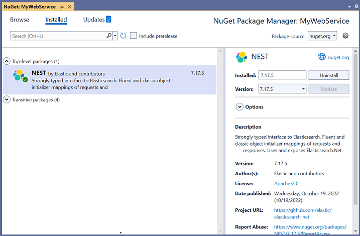
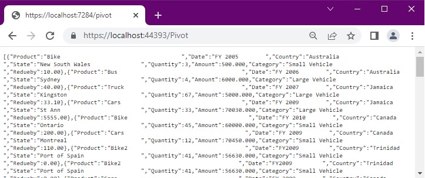

# Elasticsearch Data Binding

This section describes how to use [Nest](https://www.nuget.org/packages/Nest) to retrieve data from a Elasticsearch database and bind it to the Blazor Pivot Table.

## Connecting a Elasticsearch to a Syncfusion<sup style="font-size:70%">&reg;</sup> Blazor Pivot Table

**1.** Create a simple Blazor Pivot Table by following the **"Getting Started"** documentation [link](../getting-started).

**2.** To connect a Elasticsearch database using the Nest in our application, we need to install the [Nest](https://www.nuget.org/packages/Nest) NuGet package. To do so, open the NuGet package manager of the project solution, search for the package **Nest** and install it.



**3.** Next, in the **Index.razor** page, under the **OnInitialized** method, connect to Elasticsearch database. You can get the specified database by using the **ElasticClient**. Following that, the **Search** method of the **ElasticClient** is used to retrieve results from the database. Then populate the data collection from the **Hits** of the **SearchResponse** into a list using the **JTokenReader**.

**4.** Finally, bind the list to the [DataSource](https://help.syncfusion.com/cr/blazor/Syncfusion.Blazor.PivotView.PivotViewDataSourceSettings-1.html?&_ga=2.187712492.558891908.1675655056-779654442.1675225237#Syncfusion_Blazor_PivotView_PivotViewDataSourceSettings_1_DataSource) property in the [PivotViewDataSourceSettings](https://help.syncfusion.com/cr/blazor/Syncfusion.Blazor.PivotView.DataSourceSettingsModel-1.html?_ga=2.112723776.558891908.1675655056-779654442.1675225237) and configure the report to use the Elasticsearch data.

```cshtml
@using System.Data
@using Newtonsoft.Json
@using Newtonsoft.Json.Linq
@using Nest
@using Syncfusion.Blazor.PivotView

<SfPivotView TValue="ElasticSearchService" Width="1000" Height="300" ShowFieldList="true">
    <PivotViewDataSourceSettings TValue="ElasticSearchService" DataSource="dataList" ExpandAll=false EnableSorting=true>
        <PivotViewColumns>
            <PivotViewColumn Name="Product"></PivotViewColumn>
        </PivotViewColumns>
        <PivotViewRows>
            <PivotViewRow Name="Date"></PivotViewRow>
        </PivotViewRows>
        <PivotViewValues>
            <PivotViewValue Name="Amount"></PivotViewValue>
        </PivotViewValues>
        <PivotViewFormatSettings>
            <PivotViewFormatSetting Name="Amount" Format="C2"></PivotViewFormatSetting>
        </PivotViewFormatSettings>
    </PivotViewDataSourceSettings>
</SfPivotView>

@code {
     private static List<ElasticSearchService> dataList = new List<ElasticSearchService>();

    protected override void OnInitialized()
    {
        // Replace with your own connection string.
        var connectionString = "<Enter your valid connection string here>";
        var uri = new Uri(connectionString);
        var connectionSettings = new ConnectionSettings(uri);
        var client = new ElasticClient(connectionSettings);
        var searchResponse = client.Search<object>(s => s
            .Index("your_index")
            .Size(1000)
        );
        var serializer = new JsonSerializer();
        foreach (var hit in searchResponse.Hits)
        {
            var source = hit.Source;
            JToken sourceToken = JToken.FromObject(source);
            using (var reader = new JTokenReader(sourceToken))
            {
                ElasticSearchService elasticResult = serializer.Deserialize<ElasticSearchService>(reader);
                dataList.Add(elasticResult);
            }
        }
    }

    public class ElasticSearchService
    {
        public int Quantity { get; set; }
        public string Product { get; set; }
        public string Date { get; set; }
        public string Country { get; set; }
        public double Amount { get; set; }
    }
}
```

When you run the application, the resultant pivot table will look like this.



## Connecting a Elasticsearch to a Syncfusion<sup style="font-size:70%">&reg;</sup> Blazor Pivot Table via Web API service

### Create a Web API service to fetch Elasticsearch data

**1.** Open Visual Studio and create an ASP.NET Core Web App project type, naming it **MyWebService**. To create an ASP.NET Core Web application, follow the documentation [link](https://learn.microsoft.com/en-us/visualstudio/get-started/csharp/tutorial-aspnet-core?view=vs-2022).


**2.** To connect a Elasticsearch using the **Nest** in our application, we need to install the [Nest](https://www.nuget.org/packages/Nest) NuGet package. To do so, open the NuGet package manager of the project solution, search for the package **Nest** and install it.



**3.** Create a Web API controller (aka, PivotController.cs) file under **Controllers** folder that helps to establish data communication with the Pivot Table.

**4.** In the Web API controller (aka, PivotController), **ElasticClient** helps to connect the Elasticsearch database. Next, using **Search** method of the **ElasticClient** you can query your Elasticsearch index and retrieve results from the database.

```csharp
using Microsoft.AspNetCore.Mvc;
using Nest;
using Newtonsoft.Json;

namespace MyWebService.Controllers
{
    [ApiController]
    [Route("[controller]")]
    public class PivotController : ControllerBase
    {
        private static object FetchElasticsearchData()
        {
            // Replace with your own connection string.
            var connectionString = "<Enter your valid connection string here>";
            var uri = new Uri(connectionString);
            var connectionSettings = new ConnectionSettings(uri);
            var client = new ElasticClient(connectionSettings);
            var searchResponse = client.Search<object>(s => s
                .Index("australian_weather")
                .Size(1000)
            );
            return searchResponse.Documents;
        }
    }
}
```

**5.** In the **Get()** method of the **PivotController.cs** file, the **FetchElasticsearchData** method is used to retrieve the Elasticsearch data as a object, which is then serialized into JSON string using **JsonConvert.SerializeObject()**.

```csharp
using Microsoft.AspNetCore.Mvc;
using Nest;
using Newtonsoft.Json;

namespace MyWebService.Controllers
{
    [ApiController]
    [Route("[controller]")]
    public class PivotController : ControllerBase
    {
        [HttpGet(Name = "GetElasticSearchData")]
        public object Get()
        {
            return JsonConvert.SerializeObject(FetchElasticsearchData());
        }

        private static object FetchElasticsearchData()
        {
            // Replace with your own connection string.
            var connectionString = "<Enter your valid connection string here>";
            var uri = new Uri(connectionString);
            var connectionSettings = new ConnectionSettings(uri);
            var client = new ElasticClient(connectionSettings);
            var searchResponse = client.Search<object>(s => s
                .Index("australian_weather")
                .Size(1000)
            );
            return searchResponse.Documents;
        }
    }
}
```

**6.** Run the application and it will be hosted within the URL `https://localhost:44323`.

**7.** Finally, the retrieved data from Elasticsearch which is in the form of JSON can be found in the Web API controller available in the URL link `https://localhost:44323/Pivot`, as shown in the browser page below.



### Connecting the Pivot Table to a Elasticsearch using the Web API service

**1.** Create a simple Blazor Pivot Table by following the **"Getting Started"** documentation [link](../getting-started).

**2.** Map the hosted Web API's URL link `https://localhost:44323/Pivot` to the Pivot Table in **Index.razor** by using the [Url](https://help.syncfusion.com/cr/blazor/Syncfusion.Blazor.DataManager.html?&_ga=2.200411303.844585580.1677740066-2135459383.1677740066#Syncfusion_Blazor_DataManager_Url) property under [PivotViewDataSourceSettings](https://help.syncfusion.com/cr/blazor/Syncfusion.Blazor.PivotView.DataSourceSettingsModel-1.html?_ga=2.200411303.844585580.1677740066-2135459383.1677740066). This [Url](https://help.syncfusion.com/cr/blazor/Syncfusion.Blazor.PivotView.PivotViewDataSourceSettings-1.html#Syncfusion_Blazor_PivotView_PivotViewDataSourceSettings_1_Url) property aids in the de-serialization of Elasticsearch data into instances of your model data class (aka, TValue="ElasticSearchService") while bound to the pivot table.

```cshtml
@using Syncfusion.Blazor.PivotView

<SfPivotView TValue="ElasticSearchService" Width="1000" Height="300" ShowFieldList="true">
    <PivotViewDataSourceSettings TValue="ElasticSearchService" Url="https://localhost:44323/Pivot" ExpandAll=false EnableSorting=true>
        <PivotViewColumns>
            <PivotViewColumn Name="Product"></PivotViewColumn>
        </PivotViewColumns>
        <PivotViewRows>
            <PivotViewRow Name="Date"></PivotViewRow>
        </PivotViewRows>
        <PivotViewValues>
            <PivotViewValue Name="Amount"></PivotViewValue>
        </PivotViewValues>
        <PivotViewFormatSettings>
            <PivotViewFormatSetting Name="Amount" Format="C2"></PivotViewFormatSetting>
        </PivotViewFormatSettings>
    </PivotViewDataSourceSettings>
</SfPivotView>

@code {
    public class PostgreSQLService
    {
        public TimeSpan openinghours_practice { get; set; }
        public TimeSpan closinghours_practice { get; set; }
        public string servicetype { get; set; }
        public string servicecategory { get; set; }
        public int revenue { get; set; }
    }
}
```


When you run the application, the resultant pivot table will look like this.


> In [this](https://github.com/SyncfusionExamples/how-to-bind-Elasticsearch-database-to-pivot-table/tree/master/Blazor) GitHub repository, you can find our Blazor Pivot Table sample for binding data from a Elasticsearch using the Web API service.