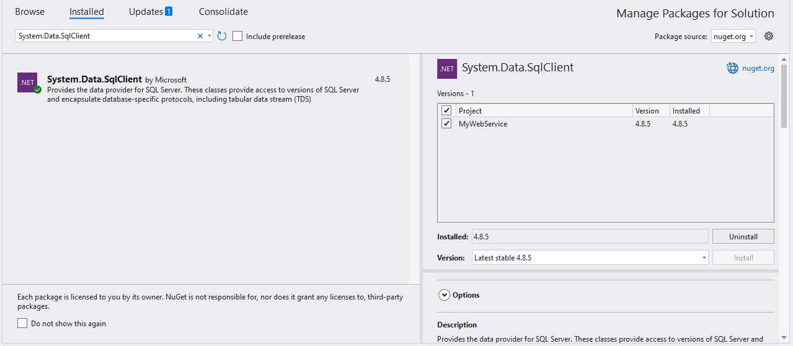
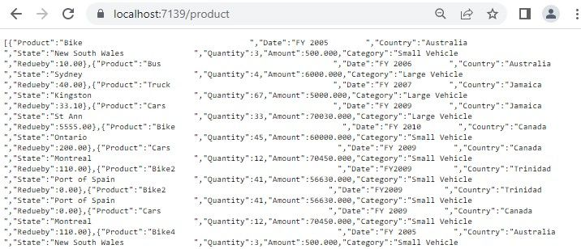

# Microsoft SQL Data Binding

This guide explains how to connect a Microsoft SQL Server database to the [Blazor Pivot Table](https://www.syncfusion.com/blazor-components/blazor-pivot-table) using the [System.Data.SqlClient](https://www.nuget.org/packages/System.Data.SqlClient/4.8.5?_src=template) library. It covers two methods: directly retrieving and binding data to the Pivot Table and using a Web API service to fetch and display Microsoft SQL data.

## Connecting a Microsoft SQL database to a Syncfusion<sup style="font-size:70%">&reg;</sup> Blazor Pivot Table

This section describes how to connect the [Blazor Pivot Table](https://www.syncfusion.com/blazor-components/blazor-pivot-table) to a Microsoft SQL database by directly retrieving data using the [System.Data.SqlClient](https://www.nuget.org/packages/System.Data.SqlClient/4.8.5?_src=template) library.

### Step 1: Set up a Blazor Pivot Table
1. Create a [Blazor Pivot Table](https://www.syncfusion.com/blazor-components/blazor-pivot-table) by following the [Getting Started](../getting-started) guide.

### Step 2: Install the System.Data.SqlClient NuGet package
1. Open the **NuGet Package Manager** in your project solution.
2. Search for and install the [System.Data.SqlClient](https://www.nuget.org/packages/System.Data.SqlClient/4.8.5?_src=template) package to enable Microsoft SQL Server connectivity.



### Step 3: Connect to the Microsoft SQL database
In the **Index.razor** file, under the `OnInitialized` method, use the [System.Data.SqlClient](https://www.nuget.org/packages/System.Data.SqlClient/4.8.5?_src=template) library to connect to a Microsoft SQL database and retrieve data for the Pivot Table.

1. **Establish connection**: Use **SqlConnection** with a valid connection string, such as `Server=localhost;Database=Database1;Trusted_Connection=True;`, to connect to the Microsoft SQL database.
2. **Query and fetch data**: Execute a SQL query, such as `SELECT * FROM table1`, using **SqlCommand** to retrieve data for the Pivot Table.
3. **Structure the data**: Use the **Fill** method of **SqlDataAdapter** to populate the query results into a **DataTable**, which is then converted to a list for binding to the Pivot Table.

### Step 4: Bind data to the Pivot Table
1. Assign the retrieved list to the [DataSource](https://help.syncfusion.com/cr/blazor/Syncfusion.Blazor.PivotView.PivotViewDataSourceSettings-1.html#Syncfusion_Blazor_PivotView_PivotViewDataSourceSettings_1_DataSource) property of the [PivotViewDataSourceSettings](https://help.syncfusion.com/cr/blazor/Syncfusion.Blazor.PivotView.DataSourceSettingsModel-1.html).
2. Configure the Pivot Table by defining fields in the [PivotViewColumns](https://help.syncfusion.com/cr/blazor/Syncfusion.Blazor.PivotView.PivotViewDataSourceSettings-1.html#Syncfusion_Blazor_PivotView_PivotViewDataSourceSettings_1_Columns), [PivotViewRows](https://help.syncfusion.com/cr/blazor/Syncfusion.Blazor.PivotView.PivotViewDataSourceSettings-1.html#Syncfusion_Blazor_PivotView_PivotViewDataSourceSettings_1_Rows), [PivotViewValues](https://help.syncfusion.com/cr/blazor/Syncfusion.Blazor.PivotView.PivotViewDataSourceSettings-1.html#Syncfusion_Blazor_PivotView_PivotViewDataSourceSettings_1_Values), and [PivotViewFormatSettings](https://help.syncfusion.com/cr/blazor/Syncfusion.Blazor.PivotView.PivotViewDataSourceSettings-1.html#Syncfusion_Blazor_PivotView_PivotViewDataSourceSettings_1_FormatSettings) to organize and format the data.

```cshtml
@using Syncfusion.Blazor.PivotView;
@using System.Data;
@using System.Data.SqlClient;

<SfPivotView TValue="OrderDetails" Width="800" Height="360">
    <PivotViewDataSourceSettings TValue="OrderDetails" DataSource="@dataSource">
        <PivotViewColumns>
            <PivotViewColumn Name="Product"></PivotViewColumn>
        </PivotViewColumns>
        <PivotViewRows>
            <PivotViewRow Name="Date"></PivotViewRow>
        </PivotViewRows>
        <PivotViewValues>
            <PivotViewValue Name="Amount"></PivotViewValue>
        </PivotViewValues>
        <PivotViewFormatSettings>
            <PivotViewFormatSetting Name="Amount" Format="C2"></PivotViewFormatSetting>
        </PivotViewFormatSettings>
    </PivotViewDataSourceSettings>
</SfPivotView>

@code {
    private List<OrderDetails> dataSource { get; set; }

    protected override void OnInitialized()
    {
        string conSTR = @"<Enter a valid connection string>";
        string xquery = "SELECT * FROM table1";
        SqlConnection sqlConnection = new(conSTR);
        sqlConnection.Open();
        SqlCommand sqlCommand = new(xquery, sqlConnection);
        SqlDataAdapter dataAdapter = new(sqlCommand);
        DataTable dataTable = new();
        dataAdapter.Fill(dataTable);
        dataSource = (from DataRow data in dataTable.Rows
                       select new OrderDetails()
                           {
                               Quantity = Convert.ToInt32(data["Quantity"]),                               
                               Product= data["Product"].ToString(),
                               Date = data["Date"].ToString(),
                               Country = data["Country"].ToString(),
                               Amount = Convert.ToDouble(data["Amount"])
                           }).ToList();
    }

    public class OrderDetails
    {
        public int Quantity { get; set; }
        public string Product { get; set; }
        public string Date { get; set; }
        public string Country { get; set; }
        public double Amount { get; set; }
    }  
}
```

### Step 5: Run and verify the Pivot Table
1. Run the Blazor application.
2. The Pivot Table will display the Microsoft SQL data, organized according to the defined configuration.
3. The resulting Pivot Table will look like this:


## Connecting a Microsoft SQL to a Syncfusion<sup style="font-size:70%">&reg;</sup> Blazor Pivot Table via Web API service

This section explains how to create a Web API service to fetch data from a Microsoft SQL database and connect it to the Blazor Pivot Table.

### Create a Web API service to fetch Microsoft SQL data

Follow these steps to set up a Web API service that retrieves Microsoft SQL data for the Pivot Table.

#### Step 1: Create an ASP.NET Core Web application
1. Open Visual Studio and create a new **ASP.NET Core Web App** project named **MyWebService**.
2. Refer to the [Microsoft documentation](https://learn.microsoft.com/en-us/visualstudio/get-started/csharp/tutorial-aspnet-core?view=vs-2022) for detailed setup instructions.


#### Step 2: Install the System.Data.SqlClient NuGet package
1. Open the **NuGet Package Manager** in your project solution.
2. Search for and install the [System.Data.SqlClient](https://www.nuget.org/packages/System.Data.SqlClient/4.8.5?_src=template) package to enable Microsoft SQL Server connectivity.


#### Step 3: Create a Web API controller
1. In the **Controllers** folder, create a new Web API controller named **PivotController.cs**.
2. This controller manages data communication between the Microsoft SQL database and the Pivot Table.

#### Step 4: Connect to Microsoft SQL and retrieve data
In the **PivotController.cs** file, use the [System.Data.SqlClient](https://www.nuget.org/packages/System.Data.SqlClient/4.8.5?_src=template) library to connect to a Microsoft SQL database and fetch data for the Pivot Table.

1. **Establish connection**: Use **SqlConnection** with a valid connection string to access the Microsoft SQL database.
2. **Fetch data**: Run a SQL query, such as `SELECT * FROM table1`, using **SqlCommand** to retrieve data.
3. **Prepare data**: Use the **Fill** method of **SqlDataAdapter** to store the query results in a **DataTable** for JSON serialization.

```csharp
using Microsoft.AspNetCore.Mvc;
using Newtonsoft.Json;
using System.Data;
using System.Data.SqlClient;

namespace MyWebService.Controllers
{
    [ApiController]
    [Route("[controller]")]
    public class PivotController : ControllerBase
    {
        private static DataTable FetchSQLResult()
        {
            string conSTR = @"<Enter a valid connection string>";
            string xquery = "SELECT * FROM table1";
            SqlConnection sqlConnection = new(conSTR);
            sqlConnection.Open();
            SqlCommand sqlCommand = new(xquery, sqlConnection);
            SqlDataAdapter dataAdapter = new(sqlCommand);
            DataTable dataTable = new();
            dataAdapter.Fill(dataTable);
            sqlConnection.Close();
            return dataTable;
        }
    }
}
```

#### Step 5: Serialize data to JSON
1. In the **PivotController.cs** file, create a **Get** method that calls **FetchSQLResult** to retrieve Microsoft SQL data.
2. Use **JsonConvert.SerializeObject** from the [Newtonsoft.Json](https://www.nuget.org/packages/Newtonsoft.Json) library to serialize the **DataTable** into JSON format.

> Ensure the **Newtonsoft.Json** NuGet package is installed in your project.

```csharp
using Microsoft.AspNetCore.Mvc;
using Newtonsoft.Json;
using System.Data;
using System.Data.SqlClient;

namespace MyWebService.Controllers
{
    [ApiController]
    [Route("[controller]")]
    public class PivotController : ControllerBase
    {
        [HttpGet(Name = "GetSQLResult")]
        public object Get()
        {
            return JsonConvert.SerializeObject(FetchSQLResult());
        }

        private static DataTable FetchSQLResult()
        {
            string conSTR = @"<Enter a valid connection string>";
            string xquery = "SELECT * FROM table1";
            SqlConnection sqlConnection = new(conSTR);
            sqlConnection.Open();
            SqlCommand sqlCommand = new(xquery, sqlConnection);
            SqlDataAdapter dataAdapter = new(sqlCommand);
            DataTable dataTable = new();
            dataAdapter.Fill(dataTable);
            sqlConnection.Close();
            return dataTable;
        }
    }
}
```

#### Step 6: Run the Web API service
1. Build and run the application.
2. The application will be hosted at `https://localhost:7139/` (the port number may vary).

#### Step 7: Verify the JSON data
1. Access the Web API endpoint at `https://localhost:7139/Pivot` to view the JSON data retrieved from the Microsoft SQL database.
2. The browser will display the JSON data, as shown below.



### Connecting the Pivot Table to a Microsoft SQL database using the Web API service

This section explains how to connect the [Blazor Pivot Table](https://www.syncfusion.com/blazor-components/blazor-pivot-table) to Microsoft SQL data retrieved via the Web API service.

#### Step 1: Set up a Blazor Pivot Table
1. Create a [Blazor Pivot Table](https://www.syncfusion.com/blazor-components/blazor-pivot-table) by following the [Getting Started](../getting-started) guide.

#### Step 2: Configure the Web API URL
1. In the **Index.razor** file, map the Web API URL (`https://localhost:7139/Pivot`) to the Pivot Table using the [Url](https://help.syncfusion.com/cr/blazor/Syncfusion.Blazor.PivotView.PivotViewDataSourceSettings-1.html#Syncfusion_Blazor_PivotView_PivotViewDataSourceSettings_1_Url) property of [PivotViewDataSourceSettings](https://help.syncfusion.com/cr/blazor/Syncfusion.Blazor.PivotView.DataSourceSettingsModel-1.html).
2. The [Url](https://help.syncfusion.com/cr/blazor/Syncfusion.Blazor.PivotView.PivotViewDataSourceSettings-1.html#Syncfusion_Blazor_PivotView_PivotViewDataSourceSettings_1_Url) property deserialize Microsoft SQL data into instances of your model data class (e.g., `TValue="OrderDetails"`) for binding to the Pivot Table.

#### Step 3: Define the Pivot Table report
1. Configure the Pivot Table by defining fields in the [PivotViewColumns](https://help.syncfusion.com/cr/blazor/Syncfusion.Blazor.PivotView.PivotViewDataSourceSettings-1.html#Syncfusion_Blazor_PivotView_PivotViewDataSourceSettings_1_Columns), [PivotViewRows](https://help.syncfusion.com/cr/blazor/Syncfusion.Blazor.PivotView.PivotViewDataSourceSettings-1.html#Syncfusion_Blazor_PivotView_PivotViewDataSourceSettings_1_Rows), [PivotViewValues](https://help.syncfusion.com/cr/blazor/Syncfusion.Blazor.PivotView.PivotViewDataSourceSettings-1.html#Syncfusion_Blazor_PivotView_PivotViewDataSourceSettings_1_Values), and [PivotViewFormatSettings](https://help.syncfusion.com/cr/blazor/Syncfusion.Blazor.PivotView.PivotViewDataSourceSettings-1.html#Syncfusion_Blazor_PivotView_PivotViewDataSourceSettings_1_FormatSettings) properties.
2. Enable the field list by setting [ShowFieldList](https://help.syncfusion.com/cr/blazor/Syncfusion.Blazor.PivotView.SfPivotView-1.html#Syncfusion_Blazor_PivotView_SfPivotView_1_ShowFieldList) to **true** for interactive field management.

```cshtml
@using Syncfusion.Blazor.PivotView

<SfPivotView TValue="OrderDetails" Width="1000" Height="300" ShowFieldList="true">
    <PivotViewDataSourceSettings TValue="OrderDetails" Url="https://localhost:7139/Pivot" ExpandAll=false EnableSorting=true>
         <PivotViewColumns>
            <PivotViewColumn Name="Product"></PivotViewColumn>
        </PivotViewColumns>
        <PivotViewRows>
            <PivotViewRow Name="Date"></PivotViewRow>
        </PivotViewRows>
        <PivotViewValues>
            <PivotViewValue Name="Amount"></PivotViewValue>
        </PivotViewValues>
        <PivotViewFormatSettings>
            <PivotViewFormatSetting Name="Amount" Format="C2"></PivotViewFormatSetting>
        </PivotViewFormatSettings>
    </PivotViewDataSourceSettings>    
    <PivotViewGridSettings ColumnWidth="120"></PivotViewGridSettings>
</SfPivotView>

@code {
    public class OrderDetails
    {
        public int Quantity { get; set; }
        public string Product { get; set; }
        public string Date { get; set; }
        public string Country { get; set; }
        public double Amount { get; set; }
    }  
}
```

#### Step 4: Run and verify the Pivot Table
1. Run the Blazor application.
2. The Pivot Table will display the Microsoft SQL data fetched via the Web API, structured according to the defined configuration.
3. The resulting Pivot Table will look like this:


### Additional resources
Explore a complete example of the Blazor Pivot Table integrated with an ASP.NET Core Web application to fetch data from a Microsoft SQL database in this [GitHub repository](https://github.com/SyncfusionExamples/how-to-bind-SQL-to-pivot-table/tree/master/Blazor).