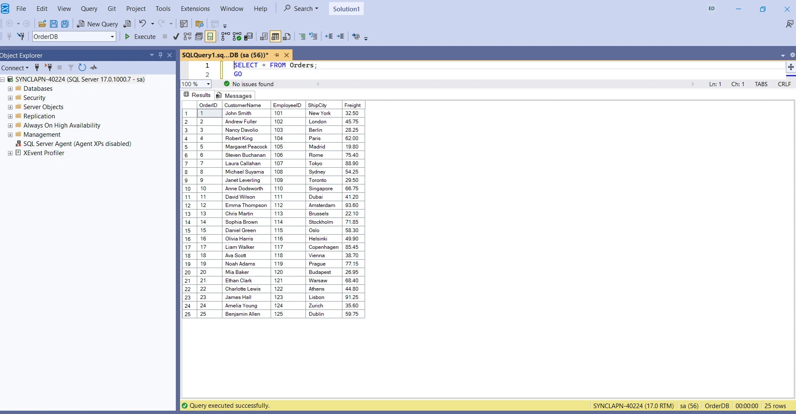
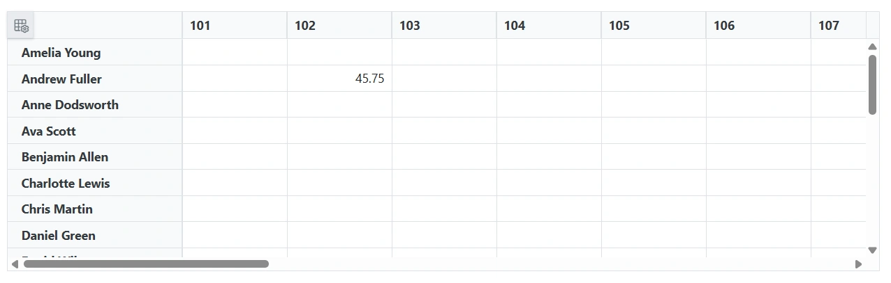
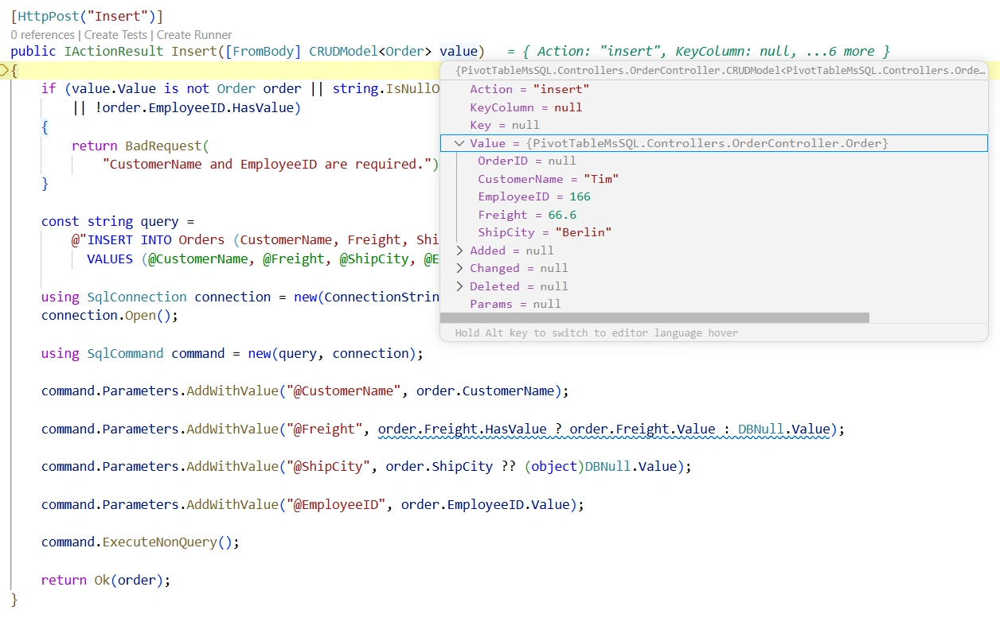
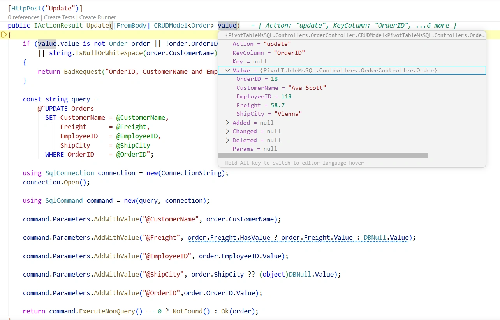
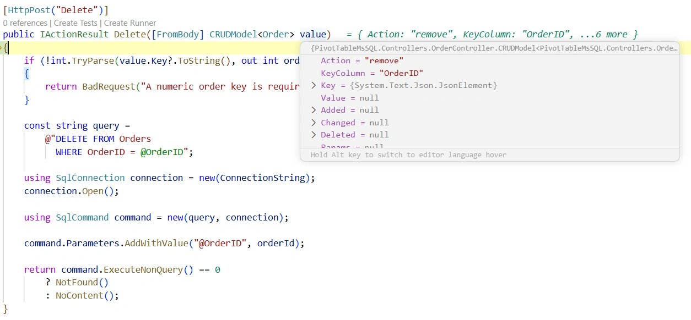

# Connecting SQL Server to Blazor Pivot Table Using URL Adaptor

The [Blazor Pivot Table](https://www.syncfusion.com/blazor-components/blazor-pivot-table) supports binding data from a Microsoft SQL Server database using the **URL Adaptor**. This remote-data binding approach exposes the database through an HTTP API controller and lets the pivot table communicate with the server over standard HTTP. Server-side query processing is required before using the pattern for large datasets.

### What is the URL Adaptor?

The URL Adaptor is a Syncfusion data adaptor that delegates every data operation—read, insert, update, and delete—to a remote endpoint. Instead of fetching the entire dataset into the browser, the pivot table posts a serialized [`DataManagerRequest`](https://help.syncfusion.com/cr/blazor/Syncfusion.Blazor.DataManagerRequest.html) to a controller action, and the server returns the processed result. This keeps the pivot table lightweight and pushes the heavy lifting to the server.

### Key Benefits of the URL Adaptor

- **Remote API contract**: The URL Adaptor sends requests to an HTTP endpoint that returns a `{ result, count }` response. The sample below loads the complete `Orders` table; add explicit `DataManagerRequest` processing before using it for large datasets.
- **RESTful contract**: A clean HTTP API that any client (Blazor, Angular, React, mobile) can consume.
- **Full CRUD Support**: Dedicated `Insert`, `Update`, and `Delete` endpoints power cell editing and the Pivot Table's Edit Dialog (drill-through) operations.
- **Loose Coupling**: The pivot component knows only the endpoint URLs, not the underlying database or data-access technology.
- **Scalability**: Stateless controllers and connection-pooled database access can scale horizontally when the API also applies server-side query operations.

### What is Microsoft.Data.SqlClient?

[Microsoft.Data.SqlClient](https://www.nuget.org/packages/Microsoft.Data.SqlClient/) is Microsoft's cross-platform, fully managed ADO.NET data provider for SQL Server (the successor to the legacy `System.Data.SqlClient`). It allows .NET applications to connect to SQL Server, execute SQL commands, and read results using `SqlConnection`, `SqlCommand`, and `SqlDataAdapter`. This sample uses the direct `Microsoft.Data.SqlClient` package and does not use Entity Framework Core.

> **SQL Server Provider Note:** SQL Server is accessed through `Microsoft.Data.SqlClient`, which supersedes `System.Data.SqlClient` and supports modern SQL Server features such as `Always Encrypted`, `UTF-8` collations, and `Microsoft Entra ID` (formerly Azure AD) authentication. For new SQL Server workloads, prefer `Microsoft.Data.SqlClient` over the legacy provider, which is frozen at its current feature set.

## Prerequisites

Ensure the following software and packages are installed before proceeding:

| Software/Package | Version | Purpose |
|-----------------|---------|---------|
| Visual Studio 2022 / VS Code | Latest | Development IDE with Blazor workload |
| .NET SDK | 10.0 | Runtime and build tools |
| Microsoft SQL Server | 2019 or later | Relational database server (incl. LocalDB / Express) |
| SQL Server Management Studio (SSMS) | Latest | SQL Server GUI management tool |
| Syncfusion.Blazor.PivotTable | 34.1.32 | Pivot Table and UI components |
| Syncfusion.Blazor.Themes | 34.1.32 | Styling for Pivot Table components |
| Microsoft.Data.SqlClient | 6.1.1 | SQL Server ADO.NET data provider |
| Newtonsoft.Json | 13.0.3 | JSON serialization for CRUD models |

The sample targets .NET 10 and the corresponding Syncfusion Blazor release. Do not use wildcard package versions. If you use another .NET or Syncfusion version, verify the API differences before applying the code.

### Step 0: Create the Blazor application

Create a **Blazor Web App** named `PivotTableMsSQL` with the .NET 10 SDK. Select **Interactive Server** interactivity and enable HTTPS. The project should contain `Program.cs`, `appsettings.json`, `wwwroot`, `Components`, and `Properties/launchSettings.json`.

If SQL Server and SQL Server Management Studio are not already installed, install them first, start the SQL Server service, and create a SQL Server login with permission to connect to `OrderDB`, read and modify `OrderDB.Orders`, and use the `IDENTITY(1,1)` sequence on the `OrderID` column.

Syncfusion packages obtained from NuGet.org also require a valid Syncfusion license or trial key. Register the key before the first Syncfusion component is initialized in production; see the [Syncfusion license-key instructions](https://blazor.syncfusion.com/documentation/getting-started/license-key/how-to-register-in-an-application). The sample project omits the registration call for brevity—add it in `Program.cs` before shipping.

## Setting Up the SQL Server Environment

### Step 1: Create the Database and Table in SQL Server

First, the **SQL Server database** structure must be created to store order records.

**UI Instructions (Using SQL Server Management Studio):**

1. **Open SQL Server Management Studio** and connect to the SQL Server instance.
2. **Create Database**:
    - In **Object Explorer**, right-click the **Databases** node → **New Database**.
    - Enter name: `OrderDB`
    - Accept the default owner and file settings (or adjust as needed).
    - Click **OK**.
3. **Create the table and sample rows using one of these methods**:
    - **UI method:** Expand `OrderDB` → **Tables**, create `dbo.Orders`, and define the columns from the SQL script; then insert the sample rows separately.
    - **SQL method:** Open a **New Query** tab (File → New → Query with Current Connection), copy the table/sample-data script below, and execute it with **F5** or **Execute**. Do not create the table manually first.

4. **Verify the table and sample rows**:
    - Open a **New Query** tab connected to `OrderDB`.
    - Run `SELECT * FROM Orders;`

**Database creation script** (run while connected to the instance, in any database context):

```sql
CREATE DATABASE OrderDB;
GO
```

After the database is created, open a **New Query** tab connected to `OrderDB` and run the following table and sample-data script:

```sql
-- Create the Orders table
USE OrderDB;
GO

CREATE TABLE Orders
(
    OrderID        INT IDENTITY(1, 1) PRIMARY KEY,
    CustomerName   VARCHAR(100) NULL,
    EmployeeID     INT NULL,
    ShipCity       VARCHAR(100) NULL,
    Freight        DECIMAL(10, 2) NULL
);
GO

-- Insert sample data
INSERT INTO Orders (CustomerName, EmployeeID, ShipCity, Freight) VALUES
('Toms',   1, 'New York',  35.30),
('Ravi',   2, 'London',    80.20),
('Sven',   1, 'Berlin',    52.10),
('Sara',   3, 'Madrid',    18.40),
('Paul',   2, 'Tokyo',     64.75);
GO
```

After executing this script, the order records are stored in the `Orders` table within the `OrderDB` database. The database is now ready for integration with the Blazor application.

> **Migration Note: MySQL → SQL Server Data Types:** MySQL uses `AUTO_INCREMENT` on an `INT` (or `BIGINT`) column declared as `PRIMARY KEY` to generate sequential surrogate keys. SQL Server replaces this with the `IDENTITY(1,1)` property on a numeric column declared as `PRIMARY KEY`. MySQL `DECIMAL(10,2)` maps directly to SQL Server `DECIMAL(10,2)` (both are exact-numeric). `VARCHAR(100)` is identical in both engines; SQL Server also supports `NVARCHAR` for Unicode storage.

**Verify the Inserted Records:**

To confirm the table and sample data were created correctly, run the following verification query in SQL Server Management Studio against `OrderDB`:

```sql
USE OrderDB;
GO
SELECT * FROM Orders;
GO
```

The screenshot below shows the records successfully inserted into the `Orders` table in SQL Server.



**Image Content:**
- SQL Server Management Studio query results grid window.
- The `SELECT * FROM Orders;` query at the top.
- The results grid below showing all sample records with columns `OrderID`, `CustomerName`, `EmployeeID`, `ShipCity`, and `Freight`.

**Purpose:** Confirms the database table and sample data are ready before the Blazor application is wired up, helping customers catch SQL Server setup issues early.

**Capture Source:** SQL Server Management Studio → `OrderDB` → New Query → run `SELECT * FROM Orders;`.

### Step 2: Install Required NuGet Packages

The `PivotTableMsSQL` Blazor Web App was created in Step 0. Install the required packages in the web project selected as the Package Manager Console's **Default project**.

**Method 1: Using Package Manager Console**

1. Open Visual Studio 2022.
2. Navigate to **Tools → NuGet Package Manager → Package Manager Console**.
3. Run the following commands:

```powershell
Install-Package Syncfusion.Blazor.PivotTable -Version 34.1.32
Install-Package Syncfusion.Blazor.Themes -Version 34.1.32
Install-Package Microsoft.Data.SqlClient -Version 6.1.1
Install-Package Newtonsoft.Json -Version 13.0.3
```

**Method 2: Using NuGet Package Manager UI**

1. Open **Visual Studio 2022 → Tools → NuGet Package Manager → Manage NuGet Packages for Solution**.
2. Search for and install each package individually:
    - **[Syncfusion.Blazor.PivotTable](https://www.nuget.org/packages/Syncfusion.Blazor.PivotTable/)** (version 34.1.32)
    - **[Syncfusion.Blazor.Themes](https://www.nuget.org/packages/Syncfusion.Blazor.Themes/)** (version 34.1.32)
    - **[Microsoft.Data.SqlClient](https://www.nuget.org/packages/Microsoft.Data.SqlClient/)** (version 6.1.1)
    - **Newtonsoft.Json** (version 13.0.3)

**Project File Reference**

The installed packages are reflected in the **PivotTableMsSQL.csproj** file:

```xml
<Project Sdk="Microsoft.NET.Sdk.Web">

  <PropertyGroup>
    <TargetFramework>net10.0</TargetFramework>
    <Nullable>enable</Nullable>
    <ImplicitUsings>enable</ImplicitUsings>
  </PropertyGroup>

  <ItemGroup>
    <PackageReference Include="Syncfusion.Blazor.PivotTable" Version="34.1.32" />
    <PackageReference Include="Syncfusion.Blazor.Themes" Version="34.1.32" />
    <PackageReference Include="Newtonsoft.Json" Version="13.0.3" />
    <PackageReference Include="Microsoft.Data.SqlClient" Version="6.1.1" />
  </ItemGroup>

</Project>
```

> **Provider Note:** This SQL Server sample uses `Microsoft.Data.SqlClient`, the supported cross-platform ADO.NET data provider for SQL Server. The controller's `CRUDModel<T>` payload uses the built-in `System.Text.Json.Serialization` `[JsonPropertyName]` attributes, so no additional JSON-serialization package is required for the controller code. The `Newtonsoft.Json` `PackageReference` is present in the project file for compatibility with samples that consume the same data layer; if you are starting from a clean project, you can omit it.

All required packages are now installed.

### Step 3: Configure the Connection String

A connection string contains the information needed to connect the application to the SQL Server database, including the server address, database name, and authentication credentials.

The sample stores the connection string in `appsettings.json` under `ConnectionStrings:SQLServer` and reads it through `IConfiguration` in the controller. This keeps credentials out of source code and follows the .NET configuration conventions.

**Instructions:**

1. Replace the contents of `appsettings.json` with the following configuration:

```json
{
  "ConnectionStrings": {
    "SQLServer": "Server=<SERVER_NAME>;Database=<DATABASE_NAME>;User Id=<USER_ID>;Password=<PASSWORD>;TrustServerCertificate=True;"
  },
  "Logging": {
    "LogLevel": {
      "Default": "Information",
      "Microsoft.AspNetCore": "Warning"
    }
  },
  "AllowedHosts": "*"
}
```

2. Inject `IConfiguration` into `OrderController` and retrieve the named connection string:

```csharp
using Microsoft.AspNetCore.Mvc;
using Microsoft.Data.SqlClient;
using Syncfusion.Blazor.Data;
using Syncfusion.Blazor;

namespace PivotTableMsSQL.Controllers
{
    [ApiController]
    [Route("api/[controller]")]
    public class OrderController : ControllerBase
    {
        private readonly string ConnectionString;

        public OrderController(IConfiguration configuration)
        {
            ConnectionString = configuration.GetConnectionString("SQLServer")
                ?? throw new InvalidOperationException(
                    "The SQL Server connection string is not configured.");
        }
    }
}
```

> **Placeholder:** Replace `<SERVER_NAME>`, `<DATABASE_NAME>`, `<USER_ID>`, and `<PASSWORD>` in `appsettings.json` with the values of your own SQL Server installation before running the sample. Use `Integrated Security=True;` instead of `User Id`/`Password` for Windows Authentication.

**Connection String Components:**

| Component | Description |
|-----------|-------------|
| Server | The address of the SQL Server instance (`localhost` for the default local instance, `.\SQLEXPRESS` for a named instance) |
| Database | The database name (in this case, `OrderDB`) |
| User Id | The SQL Server login name (e.g., `sa`). Omit when using Windows Authentication. |
| Password | The password for the SQL Server login account. Omit when using Windows Authentication. |
| TrustServerCertificate | Set to `True` to skip certificate-chain validation when encrypting the connection (common for local development) |

> **Migration Note: Connection-String Syntax:** MySQL (`MySql.Data`) uses `Server`, `Port`, `Database`, `Uid`, and `Pwd` keys. SQL Server (`Microsoft.Data.SqlClient`) uses `Server`, `Database`, `User Id`, and `Password` keys, and adds the `TrustServerCertificate` flag for encryption. The `Port` key is omitted—the default SQL Server port is `1433`, and named instances advertise their port through the SQL Browser service. Both samples read the value through `IConfiguration.GetConnectionString(...)` so only the key names differ.

> **Security Note:** Do not commit real passwords to source control. For local development, use .NET user secrets (the environment-variable override `ConnectionStrings__SQLServer` replaces the value in `appsettings.json`); for deployment, use environment variables or a secrets manager such as Azure Key Vault. Prefer Windows Authentication (`Integrated Security=True`) or Microsoft Entra ID for production deployments where possible.

The database connection string has been configured successfully.

### Step 4: Create the Controller

The controller is the heart of the URL Adaptor integration. It exposes HTTP endpoints that the pivot table calls for reading and modifying data. The sample uses raw `Microsoft.Data.SqlClient` commands to keep the data-access code explicit and easy to follow, parameterized SQL throughout to prevent SQL injection, and `IActionResult` responses so callers can distinguish success from validation errors.

**Instructions:**

1. Inside the `Controllers` folder, create a new file named **OrderController.cs**.
2. Define the `OrderController` class with the following code:

```csharp
using System.ComponentModel.DataAnnotations;
using System.Data;
using System.Text.Json.Serialization;
using Microsoft.AspNetCore.Mvc;
using Microsoft.Data.SqlClient;
using Syncfusion.Blazor;
using Syncfusion.Blazor.Data;

namespace PivotTableMsSQL.Controllers
{
    [ApiController]
    [Route("api/[controller]")]
    public class OrderController : ControllerBase
    {
        private readonly string ConnectionString;

        public OrderController(IConfiguration configuration)
        {
            ConnectionString = configuration.GetConnectionString("SQLServer")
                ?? throw new InvalidOperationException(
                    "The SQL Server connection string is not configured.");
        }

        [HttpPost]
        public object Post([FromBody] DataManagerRequest request)
        {
            _ = request;

            List<Order> dataSource = GetOrderData();

            return new
            {
                result = dataSource,
                count = dataSource.Count
            };
        }

        private List<Order> GetOrderData()
        {
            const string query =
                @"SELECT OrderID, CustomerName, EmployeeID, ShipCity, Freight
                  FROM Orders
                  ORDER BY OrderID";

            using SqlConnection connection = new(ConnectionString);
            connection.Open();

            using SqlCommand command = new(query, connection);
            using SqlDataAdapter adapter = new(command);

            DataTable dataTable = new();
            adapter.Fill(dataTable);

            return (from DataRow row in dataTable.Rows
                    select new Order
                    {
                        OrderID = Convert.ToInt32(row["OrderID"]),
                        CustomerName = row["CustomerName"]?.ToString(),
                        EmployeeID = Convert.ToInt32(row["EmployeeID"]),
                        ShipCity = row.IsNull("ShipCity") ? null : row["ShipCity"].ToString(),
                        Freight = row.IsNull("Freight") ? null : Convert.ToDecimal(row["Freight"])
                    }).ToList();
        }

        [HttpPost("Insert")]
        public IActionResult Insert([FromBody] CRUDModel<Order> value)
        {
            if (value.Value is not Order order || string.IsNullOrWhiteSpace(order.CustomerName)
                || !order.EmployeeID.HasValue)
            {
                return BadRequest(
                    "CustomerName and EmployeeID are required.");
            }

            const string query =
                @"INSERT INTO Orders (CustomerName, Freight, ShipCity, EmployeeID)
                  VALUES (@CustomerName, @Freight, @ShipCity, @EmployeeID)";

            using SqlConnection connection = new(ConnectionString);
            connection.Open();

            using SqlCommand command = new(query, connection);

            command.Parameters.AddWithValue("@CustomerName", order.CustomerName);

            command.Parameters.AddWithValue("@Freight", order.Freight.HasValue ? order.Freight.Value : DBNull.Value);

            command.Parameters.AddWithValue("@ShipCity", order.ShipCity ?? (object)DBNull.Value);

            command.Parameters.AddWithValue("@EmployeeID", order.EmployeeID.Value);

            command.ExecuteNonQuery();

            return Ok(order);
        }

        [HttpPost("Update")]
        public IActionResult Update([FromBody] CRUDModel<Order> value)
        {
            if (value.Value is not Order order || !order.OrderID.HasValue
                || string.IsNullOrWhiteSpace(order.CustomerName) || !order.EmployeeID.HasValue)
            {
                return BadRequest("OrderID, CustomerName and EmployeeID are required.");
            }

            const string query =
                @"UPDATE Orders
                  SET CustomerName = @CustomerName,
                      Freight      = @Freight,
                      EmployeeID   = @EmployeeID,
                      ShipCity     = @ShipCity
                  WHERE OrderID    = @OrderID";

            using SqlConnection connection = new(ConnectionString);
            connection.Open();

            using SqlCommand command = new(query, connection);

            command.Parameters.AddWithValue("@CustomerName", order.CustomerName);

            command.Parameters.AddWithValue("@Freight", order.Freight.HasValue ? order.Freight.Value : DBNull.Value);

            command.Parameters.AddWithValue("@EmployeeID", order.EmployeeID.Value);

            command.Parameters.AddWithValue("@ShipCity", order.ShipCity ?? (object)DBNull.Value);

            command.Parameters.AddWithValue("@OrderID", order.OrderID.Value);

            return command.ExecuteNonQuery() == 0 ? NotFound() : Ok(order);
        }

        [HttpPost("Delete")]
        public IActionResult Delete([FromBody] CRUDModel<Order> value)
        {
            if (!int.TryParse(value.Key?.ToString(), out int orderId))
            {
                return BadRequest("A numeric order key is required.");
            }

            const string query =
                @"DELETE FROM Orders
                  WHERE OrderID = @OrderID";

            using SqlConnection connection = new(ConnectionString);
            connection.Open();

            using SqlCommand command = new(query, connection);

            command.Parameters.AddWithValue("@OrderID", orderId);

            return command.ExecuteNonQuery() == 0
                ? NotFound()
                : NoContent();
        }

        public class Order
        {
            [Key]
            public int? OrderID { get; set; }

            public string? CustomerName { get; set; }

            public int? EmployeeID { get; set; }

            public decimal? Freight { get; set; }

            public string? ShipCity { get; set; }
        }

        public class CRUDModel<T> where T : class
        {
            [JsonPropertyName("action")]
            public string? Action { get; set; }

            [JsonPropertyName("keyColumn")]
            public string? KeyColumn { get; set; }

            [JsonPropertyName("key")]
            public object? Key { get; set; }

            [JsonPropertyName("value")]
            public T? Value { get; set; }

            [JsonPropertyName("added")]
            public List<T>? Added { get; set; }

            [JsonPropertyName("changed")]
            public List<T>? Changed { get; set; }

            [JsonPropertyName("deleted")]
            public List<T>? Deleted { get; set; }

            [JsonPropertyName("params")]
            public IDictionary<string, object>? Params { get; set; }
        }
    }
}
```

**Explanation:**

- **Constructor / `ConnectionString`**: The controller takes `IConfiguration` through dependency injection and reads the `ConnectionStrings:SQLServer` value set in `appsettings.json` (see Step 3). It throws if the entry is missing, so misconfiguration surfaces on the first request rather than as a silent failure.
- **`Post` action (`POST /api/Order`)**: Read endpoint of the URL Adaptor. It accepts a `DataManagerRequest` so the adaptor contract is satisfied, then returns the full dataset as `{ result, count }`. This sample intentionally does not process the request's query operations; add explicit `DataManagerRequest` processing before using it for large datasets.
- **`GetOrderData` helper**: Opens a `SqlConnection`, runs an explicit column list `SELECT ... FROM Orders ORDER BY OrderID`, fills a `DataTable` via `SqlDataAdapter`, and projects the rows into `Order` objects. Nullable `ShipCity` and `Freight` are handled with `row.IsNull(...)` so SQL `NULL` is preserved on the C# model's nullable (`string?`, `decimal?`) properties.
- **`Insert` action (`POST /api/Order/Insert`)**: Validates that `CustomerName` and `EmployeeID` are present, runs a parameterized `INSERT` (letting the `OrderID` `IDENTITY(1,1)` column populate `OrderID`), and returns `Ok(order)` so the pivot table receives the persisted row. Returns `BadRequest` on invalid input. (To echo the generated `OrderID` back to the client, append a `SELECT CAST(SCOPE_IDENTITY() AS INT);` after the `INSERT` and execute it with `ExecuteScalar`.)
- **`Update` action (`POST /api/Order/Update`)**: Validates `OrderID`, `CustomerName`, and `EmployeeID`, runs a parameterized `UPDATE` filtered by `OrderID`, and returns `NotFound` when no row was matched or `Ok(order)` on success.
- **`Delete` action (`POST /api/Order/Delete`)**: Parses a numeric `Key` from the `CRUDModel<Order>`, runs a parameterized `DELETE` filtered by `OrderID`, and returns `BadRequest` for a non-numeric key, `NotFound` when nothing was deleted, or `NoContent()` on success.
- The `[ApiController]` attribute enables automatic model validation and HTTP API conventions; `[Route("api/[controller]")]` and per-action `[HttpPost("...")]` attributes produce the four `/api/Order*` routes the URL Adaptor points at.

> **Migration Note: SQL Syntax differences.**
> - **Schema qualification**: MySQL uses the database name as the namespace and addresses the table as `Orders.orders` (or sets a default database with `USE Orders;`). SQL Server supports multiple schemas inside a database; the sample uses the default `dbo` schema and addresses the table as `Orders` (with `USE OrderDB;` or the connection's default database). The substring `SELECT OrderID, CustomerName, EmployeeID, ShipCity, Freight FROM Orders ORDER BY OrderID` replaces the MySQL `SELECT orderid, customername, employeeid, shipcity, freight FROM orders ORDER BY orderid`.
> - **Parameter prefix**: `MySql.Data` uses `@name`. `Microsoft.Data.SqlClient` also uses `@name` (named parameters are positional-only when `CommandDefinition.CommandText` is interpreted; prefer `@name` for clarity). Parameter names are case-insensitive.
> - **Identifier casing**: MySQL unquoted identifiers are lowercased on Linux (`lower_case_table_names`); the sample therefore uses lowercase `orders`. SQL Server unquoted identifiers preserve the input case but resolve case-insensitively under the default collation. The SQL Server sample uses Pascal-cased `Orders`, `OrderID`, `CustomerName`, and so on consistently.
> - **Nullable columns**: Like the MySQL sample, the SQL Server controller reads nullable `ShipCity` and `Freight` columns with `row.IsNull(...) ? null : ...` so SQL `NULL` is preserved on the C# model's nullable (`int?`, `decimal?`, `string?`) properties.
> - **Parameterized queries**: This guide uses parameterized `@named` parameters to prevent SQL injection. This is a **best-practice hardening** of the sample and is functionally equivalent for the supported fields.

> **Read endpoint contract:** The `POST /api/Order` endpoint accepts a JSON `DataManagerRequest` body and returns `{ result, count }`; it does **not** respond to a browser address-bar `GET` request. Data is only consumed through the Pivot Table's URL Adaptor.

### Step 5: Register Services in Program.cs

The `Program.cs` file is where application services are registered and configured. This file must be updated to enable Syncfusion Blazor, Razor components, and the API controllers that back the URL Adaptor.

**Instructions:**

1. Open the `Program.cs` file at the project root.
2. Replace its contents with the following code:

```csharp
using PivotTableMsSQL.Components;
using Syncfusion.Blazor;

var builder = WebApplication.CreateBuilder(args);

// ========== SYNCFUSION BLAZOR CONFIGURATION ==========
builder.Services.AddSyncfusionBlazor();

// ========== RAZOR COMPONENTS ==========
builder.Services.AddRazorComponents()
    .AddInteractiveServerComponents();

// ========== API CONTROLLERS (backs the URL Adaptor) ==========
builder.Services.AddControllers();

var app = builder.Build();

// Configure the HTTP request pipeline.
if (!app.Environment.IsDevelopment())
{
    app.UseExceptionHandler("/Error", createScopeForErrors: true);
    // The default HSTS value is 30 days. Change for production scenarios, see https://aka.ms/aspnetcore-hsts.
    app.UseHsts();
}

app.UseHttpsRedirection();
app.MapControllers();

app.UseAntiforgery();

app.MapStaticAssets();
app.MapRazorComponents<App>()
    .AddInteractiveServerRenderMode();

app.Run();
```

**Explanation:**

- **`AddSyncfusionBlazor()`**: Registers Syncfusion Blazor services, including the Pivot Table and theme resources.
- **`AddRazorComponents()` and `AddInteractiveServerComponents()`**: Enables Blazor server-side rendering with interactive components.
- **`AddControllers()`**: Registers the API controllers (`OrderController`) so the URL Adaptor endpoints are reachable; the controller's `IConfiguration` dependency is satisfied automatically by the generic host.
- **`MapControllers()`**: Adds the controller routes to the application's endpoint pipeline.
- **`UseAntiforgery()`**: Enables anti-forgery middleware for endpoints that explicitly require it. The sample API actions do not add anti-forgery validation.

> **License reminder:** Syncfusion components obtained from NuGet.org require a valid Syncfusion license or trial key. Register the key by calling `Syncfusion.Licensing.SyncfusionLicenseProvider.RegisterLicense("YOUR LICENSE KEY")` in `Program.cs` before `builder.Build()` for production deployments. The sample omits this call for brevity; add it before shipping.

> **Note:** The URL Adaptor posts JSON directly to controller endpoints; Blazor interactive-server transport does not automatically add a token to arbitrary API requests. If you add anti-forgery validation to these browser-accessible write actions, configure the adaptor to send the request token and document the matching server configuration.

The service registration has been completed successfully.

## Integrating the Blazor Pivot Table

### Step 1: Configure the Pivot Table Imports and Theme

Syncfusion provides pre-built UI components such as the Pivot Table, which summarizes large datasets into a multidimensional view.

**Instructions:**

* The `Syncfusion.Blazor.PivotTable` package was installed in **Step 2** of the previous section.
* Import the required namespaces in the `Components/_Imports.razor` file:

```csharp
@using System.Net.Http
@using System.Net.Http.Json
@using Microsoft.AspNetCore.Components.Forms
@using Microsoft.AspNetCore.Components.Routing
@using Microsoft.AspNetCore.Components.Web
@using static Microsoft.AspNetCore.Components.Web.RenderMode
@using Microsoft.AspNetCore.Components.Web.Virtualization
@using Microsoft.JSInterop
@using PivotTableMsSQL
@using PivotTableMsSQL.Components
@using Syncfusion.Blazor
@using Syncfusion.Blazor.PivotView
```

* Add the stylesheet and scripts in the `Components/App.razor` file. Find the `<head>` section and add:

```html
<!-- Syncfusion Blazor Stylesheet (bootstrap5 theme) -->
<link href="_content/Syncfusion.Blazor.Themes/bootstrap5.css" rel="stylesheet" />
```

* And include the Syncfusion script reference before the closing `</body>` tag:

```html
<script src="_framework/blazor.web.js"></script>
<script src="_content/Syncfusion.Blazor.Core/scripts/syncfusion-blazor.min.js" type="text/javascript"></script>
```

For this project, the **bootstrap5** theme is used. A different theme can be selected or customized based on project requirements. Refer to the [Blazor Components Appearance](https://blazor.syncfusion.com/documentation/appearance/themes) documentation to learn more about theming options.

The complete `App.razor` for the sample looks like this:

```html
<!DOCTYPE html>
<html lang="en">

<head>
    <meta charset="utf-8" />
    <meta name="viewport" content="width=device-width, initial-scale=1.0" />
    <base href="/" />
    <link rel="stylesheet" href="@Assets["lib/bootstrap/dist/css/bootstrap.min.css"]" />
    <link rel="stylesheet" href="@Assets["app.css"]" />
    <link rel="stylesheet" href="@Assets["PivotTableMsSQL.styles.css"]" />
    <ImportMap />
    <link rel="icon" type="image/png" href="favicon.png" />
    <HeadOutlet @rendermode="InteractiveServer" />
    <link href="_content/Syncfusion.Blazor.Themes/bootstrap5.css" rel="stylesheet" />
</head>

<body>
    <Routes @rendermode="InteractiveServer" />
    <script src="_framework/blazor.web.js"></script>
    <script src="_content/Syncfusion.Blazor.Core/scripts/syncfusion-blazor.min.js" type="text/javascript"></script>
</body>

</html>
```

Blazor components are now configured and ready to use. For additional guidance, refer to the Pivot Table [getting-started](https://blazor.syncfusion.com/documentation/pivot-table/getting-started-webapp) documentation.

### Step 2: Add the PivotTable Package Reference

Confirm the `Syncfusion.Blazor.PivotTable` package is referenced. It provides the Pivot Table and the transitive `Syncfusion.Blazor.Data` assembly used by `SfDataManager` and `Adaptors`.

The relevant section of **PivotTableMsSQL.csproj**:

```xml
<ItemGroup>
    <PackageReference Include="Syncfusion.Blazor.PivotTable" Version="34.1.32" />
    <PackageReference Include="Syncfusion.Blazor.Themes" Version="34.1.32" />
    <PackageReference Include="Newtonsoft.Json" Version="13.0.3" />
    <PackageReference Include="Microsoft.Data.SqlClient" Version="6.1.1" />
</ItemGroup>
```

The package references are now in place.

### Step 3: Configure the Pivot Table with the URL Adaptor

The pivot table binds to the SQL Server-backed API through the [`SfDataManager`](https://help.syncfusion.com/cr/blazor/Syncfusion.Blazor.Data.SfDataManager.html) configured with [`Adaptors.UrlAdaptor`](https://help.syncfusion.com/cr/blazor/Syncfusion.Blazor.Adaptors.html). The `Url`, `InsertUrl`, `UpdateUrl`, and `RemoveUrl` properties point at the controller actions created in **Step 4**.

**Instructions:**

1. Open the file named `Home.razor` in the `Components/Pages` folder.
2. Replace its contents with the following markup:

```cshtml
@page "/"
@using Syncfusion.Blazor.Data
@using Syncfusion.Blazor.PivotView

<SfPivotView TValue="Order" Width="1000" Height="300" ShowFieldList="true">
    <PivotViewDataSourceSettings TValue="Order" ExpandAll=false EnableSorting=true>
    <SfDataManager Url="http://localhost:5145/api/Order"
                   InsertUrl="http://localhost:5145/api/Order/Insert"
                   UpdateUrl="http://localhost:5145/api/Order/Update"
                   RemoveUrl="http://localhost:5145/api/Order/Delete"
                   Adaptor="Adaptors.UrlAdaptor"></SfDataManager>
        <PivotViewColumns>
            <PivotViewColumn Name="EmployeeID"></PivotViewColumn>
        </PivotViewColumns>
        <PivotViewRows>
            <PivotViewRow Name="CustomerName"></PivotViewRow>
        </PivotViewRows>
        <PivotViewValues>
            <PivotViewValue Name="Freight" Caption="Freight"></PivotViewValue>
        </PivotViewValues>
    </PivotViewDataSourceSettings>
    <PivotViewGridSettings ColumnWidth="120"></PivotViewGridSettings>
    <PivotViewEvents TValue="Order" BeginDrillThrough="beginDrillThrough"></PivotViewEvents>
    <PivotViewCellEditSettings AllowEditing=true AllowAdding=true AllowDeleting=true
                               Mode=Syncfusion.Blazor.PivotView.EditMode.Normal></PivotViewCellEditSettings>
</SfPivotView>

@code{
    private void beginDrillThrough(BeginDrillThroughEventArgs args)
    {
        // Configure BeginDrillThrough event to set the primary key for CRUD operations.
        // Iterate through all columns in the Edit Dialog grid.
        for (int i = 0; i < args.GridObj.Columns.Count; i++)
        {
            // Check if the current column is the primary key column.
            if (args.GridObj.Columns[i].Field == "OrderID")
            {
                // Mark this column as the primary key so DataManager uses it
                // to uniquely identify records during CRUD operations.
                args.GridObj.Columns[i].IsPrimaryKey = true;
            }
            else
            {
                // Ensure other columns are visible in the Edit Dialog grid.
                args.GridObj.Columns[i].Visible = true;
            }
        }
    }

    SfPivotView<Order> pivot { get; set; }

    public List<Order> Orders { get; set; }
    public class Order
    {
        public int OrderID { get; set; }
        public string CustomerName { get; set; }
        public int EmployeeID { get; set; }
        public decimal Freight { get; set; }
        public string ShipCity { get; set; }
    }
}
```

**Component Explanation:**

- **`<SfPivotView TValue="Order">`**: The pivot table component bound to the `Order` type.
- **`ShowFieldList="true"`**: Displays the field list UI so end users can drag fields between rows, columns, and values at runtime.
- **`<PivotViewDataSourceSettings>`**: Defines the default field arrangement—`EmployeeID` as a column, `CustomerName` as a row, and `Freight` as a value.
- **`<SfDataManager>`**: Wires the pivot table to the API via the URL Adaptor. The four URLs map directly to the controller actions.
- **`<PivotViewCellEditSettings>`**: Enables cell-level editing, adding, and deleting in `Normal` edit mode.
- **`BeginDrillThrough` event**: When a user opens the Edit Dialog from a pivot cell, this handler runs and marks `OrderID` as the primary key of the Edit Dialog grid so insert/update/delete operations can target the correct record.

> **URL Note (MySQL → SQL Server difference):** The MySQL sample uses absolute URLs (`http://localhost:5145/api/Order`) that match the `applicationUrl` declared in `Properties/launchSettings.json` (`http://localhost:5145`). This SQL Server sample follows the same absolute-URL convention so the same first-run-validation behaviour applies. Absolute URLs are simpler for first-run validation, but relative URLs are recommended for production so the adaptor follows scheme/port changes automatically. If you switch to HTTPS or change the port, update the absolute URLs in `Home.razor` to match `launchSettings.json`.

The Home component has been updated successfully with the Pivot Table.

**Pivot Table with SQL Server Data:**

When `dotnet run` launches the application and the browser loads the URL shown in the terminal, the Pivot Table renders the SQL Server `Orders` data with the configured field arrangement: `CustomerName` as rows, `EmployeeID` as columns, and `Freight` aggregated as a value. The Field List panel is available so end users can rearrange fields at runtime.



**Image Content:**
- The Blazor application running in the browser at `http://localhost:5145`.
- The `SfPivotView` rendered with the configured rows (`CustomerName`), columns (`EmployeeID`), and value (`Freight`).
- The **Field List** panel open or accessible, demonstrating runtime layout customization.
- Aggregated subtotals and grand totals visible in the pivot body.
- No records edited yet — this is the pristine pre-CRUD state.

**Purpose:** Confirms that the data flow (SQL Server → Microsoft.Data.SqlClient → OrderController → URL Adaptor → Pivot Table) is wired correctly before the CRUD sections show modified states.

**Capture Source:** Run `dotnet run`, open the browser at the URL shown in the terminal, and capture the full Pivot Table with the field list immediately after the first render (before any insert/update/delete).

## URL Adaptor Configuration

The URL Adaptor is the contract between the Blazor Pivot Table and the SQL Server-backed API. It works as follows:

1. The pivot table serializes its current data state into a `DataManagerRequest` object.
2. The `SfDataManager` posts that object as JSON to the `Url` endpoint (`POST /api/Order`).
3. The controller deserializes the request, queries SQL Server, and returns `{ result, count }`.
4. For write operations, the pivot table posts a `CRUDModel<Order>` payload to the matching `InsertUrl`, `UpdateUrl`, or `RemoveUrl`.

```razor
<SfDataManager Url="http://localhost:5145/api/Order"
               InsertUrl="http://localhost:5145/api/Order/Insert"
               UpdateUrl="http://localhost:5145/api/Order/Update"
               RemoveUrl="http://localhost:5145/api/Order/Delete"
               Adaptor="Adaptors.UrlAdaptor">
</SfDataManager>
```

| Property | Purpose | Controller Action |
|----------|---------|-------------------|
| `Url` | Reads data from the server | `POST /api/Order` → `Post` |
| `InsertUrl` | Adds a new record | `POST /api/Order/Insert` → `Insert` |
| `UpdateUrl` | Updates an existing record | `POST /api/Order/Update` → `Update` |
| `RemoveUrl` | Deletes a record | `POST /api/Order/Delete` → `Delete` |

> **URL Tip:** This SQL Server sample uses absolute URLs that must match the scheme and port in `Properties/launchSettings.json`. If you prefer relative URLs, change `Url` to `/api/Order`, `InsertUrl` to `/api/Order/Insert`, etc. Relative URLs keep the adaptor on the same origin and automatically use the active HTTP or HTTPS profile.

The `Insert`, `Update`, and `Delete` actions return `IActionResult` (`Ok` / `BadRequest` / `NotFound` / `NoContent`) and validate incoming payloads before touching the database; `400 Bad Request` is returned for invalid payloads and `404 NotFound` when an update or delete targets a row that does not exist. Add structured logging and a production exception handler before exposing these endpoints publicly.

The URL Adaptor has been successfully configured. The CRUD sections below include screenshots of the `CRUDModel<Order>` value received by the `Insert`, `Update`, and `Delete` controller actions.

## API Endpoints

The `OrderController` exposes the following REST endpoints:

| Method | Route | Payload | Description |
|--------|-------|---------|-------------|
| `POST` | `/api/Order` | `DataManagerRequest` | Returns all order records as `{ result, count }`. This sample does not process request operations. |
| `POST` | `/api/Order/Insert` | `CRUDModel<Order>` | Inserts a new order into the `Orders` table and returns `Ok(order)`. Returns `400` if `CustomerName` or `EmployeeID` is missing. |
| `POST` | `/api/Order/Update` | `CRUDModel<Order>` | Updates an existing order filtered by `Order ID`. Returns `Ok(order)` on success, `404` if no row was matched, or `400` if `OrderID`/`CustomerName`/`EmployeeID` is missing. |
| `POST` | `/api/Order/Delete` | `CRUDModel<Order>` | Deletes an order using the numeric `Key`. Returns `204 No Content` on success, `404` if no row was matched, or `400` for a non-numeric key. |

**Sample read response:**

```json
{
  "result": [
    { "orderID": 1, "customerName": "Toms", "employeeID": 1, "shipCity": "New York", "freight": 35.30 },
    { "orderID": 2, "customerName": "Ravi", "employeeID": 2, "shipCity": "London", "freight": 80.20 }
  ],
  "count": 2
}
```

**Sample insert payload:**

```json
{
  "action": "insert",
  "keyColumn": "orderID",
  "value": {
    "customerName": "Karen Lee",
    "employeeID": 3,
    "shipCity": "Berlin",
    "freight": 110.00
  }
}
```

## CRUD Operations

The Pivot Table performs CRUD operations through cell editing and the Edit Dialog. Each operation calls the corresponding controller endpoint, which executes the appropriate SQL Server command.

### Insert

Record insertion allows new orders to be added directly through the Edit Dialog of the Pivot Table component. The adaptor serializes the new row into a `CRUDModel<Order>` and posts it to `/api/Order/Insert`.

The `Insert` action is implemented in the complete controller in Step 4. The sample uses parameterized SQL so that `OrderID` is filled automatically by the column's `IDENTITY(1,1)` property.

**What happens behind the scenes:**

1. The user opens the Edit Dialog from a pivot cell and adds a new row.
2. The pivot table posts the new row to `InsertUrl`.
3. The controller validates the payload and builds a parameterized `INSERT` statement executed through `Microsoft.Data.SqlClient`.
4. SQL Server stores the new record (the `OrderID` `IDENTITY(1,1)` column auto-increments), and the controller returns `Ok(order)` so the pivot table refreshes by calling the read endpoint and the new record appears in the summarized view.

The screenshot below shows the `CRUDModel<Order>` value received in the `Insert` controller action — the `Value` parameter carrying the `Action`, `KeyColumn`, and the new order record (`CustomerName`, `EmployeeID`, `ShipCity`, `Freight`) that will be inserted into the `Orders` table.



**Image Content:**
- The `Insert` action of `OrderController` open in the editor.
- The `Value` parameter of type `CRUDModel<Order>` expanded to reveal its contents.
- The `Action` set to `"insert"`, the `KeyColumn` set to `"orderID"`, and the `Value` property holding the new order fields: `CustomerName`, `EmployeeID`, `ShipCity`, and `Freight`.

**Purpose:** Confirms the exact `CRUDModel<Order>` value received by the `Insert` action so customers can verify that the client-side payload maps correctly to the server-side `Value` parameter before the `INSERT` statement runs.

**Capture Source:** Trigger an insert from the Edit Dialog (double-click a pivot cell, click **Add**, fill in a row, click **Update**) and inspect the `Value` parameter received by the `Insert` controller action.

### Update

Record modification allows order details to be updated directly within the Edit Dialog. The adaptor serializes the edited row and posts it to `/api/Order/Update`.

The `Update` action is implemented in the complete controller in Step 4. It uses parameterized SQL filtered by `OrderID`.

**What happens behind the scenes:**

1. The user edits a row in the Edit Dialog and saves it.
2. The pivot table posts the edited row to `UpdateUrl`.
3. The controller builds an `UPDATE` statement filtered by `Order ID` and executes it.
4. SQL Server updates the matching record.
5. The pivot table refreshes and reflects the updated aggregated value.

The screenshot below shows the `CRUDModel<Order>` value received in the `Update` controller action — the `Value` parameter carrying the `Action`, `KeyColumn`, and the edited order record (`CustomerName`, `EmployeeID`, `ShipCity`, `Freight`, and the `OrderID` used as the update filter) that will update the matching row in the `Orders` table.



**Image Content:**
- The `Update` action of `OrderController` open in the editor.
- The `Value` parameter of type `CRUDModel<Order>` expanded to reveal its contents.
- The `Action` set to `"update"`, the `KeyColumn` set to `"orderID"`, and the `Value` property holding the modified order fields — including the changed `Freight` or `ShipCity` — along with the `OrderID` used to filter the `UPDATE`.

**Purpose:** Confirms the exact `CRUDModel<Order>` value received by the `Update` action so customers can verify that the client-side payload maps correctly to the server-side `Value` parameter and the `Order ID` filter before the `UPDATE` statement runs.

**Capture Source:** Trigger an update from the Edit Dialog (double-click a pivot cell, select a row, click **Edit**, modify a field, click **Update**) and inspect the `Value` parameter received by the `Update` controller action.

### Delete

Record deletion allows orders to be removed directly from the Edit Dialog. The adaptor posts the primary key of the deleted row to `/api/Order/Delete`.

The `Delete` action is implemented in the complete controller in Step 4. It validates the numeric primary key from `CRUDModel<T>.Key` and runs a parameterized `DELETE` filtered by `OrderID`.

**What happens behind the scenes:**

1. The user selects a row in the Edit Dialog and deletes it.
2. The pivot table posts the `Key` (primary key value) to `RemoveUrl`.
3. The controller builds a `DELETE` statement filtered by `Order ID` and executes it.
4. SQL Server removes the matching record.
5. The pivot table refreshes and the record is removed from the summarized view.

The screenshot below shows the `CRUDModel<Order>` value received in the `Delete` controller action — the `Value` parameter carrying the `Action`, `KeyColumn`, and the `Key` (primary key value of the deleted row) that the `DELETE` statement uses to filter by `Order ID`.



**Image Content:**
- The `Delete` action of `OrderController` open in the editor.
- The `Value` parameter of type `CRUDModel<Order>` expanded to reveal its contents.
- The `Action` set to `"remove"`, the `KeyColumn` set to `"orderID"`, and the `Key` containing the `Order ID` of the deleted record.

**Purpose:** Confirms the exact `CRUDModel<Order>` value received by the `Delete` action so customers can verify that the primary key (`Key`) is being received correctly before the `DELETE` statement runs.

**Capture Source:** Trigger a delete from the Edit Dialog (double-click a pivot cell, select a row, click **Delete**, confirm) and inspect the `Value` parameter received by the `Delete` controller action.

### Enabling CRUD via the Edit Dialog (`BeginDrillThrough` Event)

For CRUD operations to work in the Edit Dialog, the primary key column must be marked. The `BeginDrillThrough` event handler does this dynamically when the Edit Dialog opens:

```csharp
private void beginDrillThrough(BeginDrillThroughEventArgs args)
{
    for (int i = 0; i < args.GridObj.Columns.Count; i++)
    {
        if (args.GridObj.Columns[i].Field == "OrderID")
        {
            args.GridObj.Columns[i].IsPrimaryKey = true;
        }
        else
        {
            args.GridObj.Columns[i].Visible = true;
        }
    }
}
```

The `BeginDrillThrough` event is raised by the Pivot Table when the Edit Dialog opens. This step is required so the URL Adaptor knows which column to send as the `Key` for update and delete operations.

## Run the Application

**Build the Application**

1. Open the terminal or Package Manager Console in Visual Studio.
2. Navigate to the project directory.
3. Run the following command to restore packages and build:

```powershell
dotnet restore
dotnet build
```

**Run the Application**

Execute the following command:

```powershell
dotnet run
```

**Access the Application**

1. Open a web browser.
2. Navigate to the URL shown in the terminal output (for example, `http://localhost:5145`).
3. The SQL Server-backed Pivot Table is now running with read and CRUD support. Refer to the screenshot in [Step 3](#step-3-configure-the-pivot-table-with-the-url-adaptor) for the rendered output.

> **URL Reminder:** This SQL Server sample uses absolute URLs in `Home.razor` that must match `Properties/launchSettings.json`. If you change the port or switch to HTTPS, update the four URLs in `Home.razor`. Relative URLs are recommended for production deployments.

## Troubleshooting

| Symptom | Likely Cause | Resolution |
|---------|--------------|------------|
| Pivot table shows no data | Controller not reachable or API returned an error | Verify the application is running and inspect the browser Network panel. The read endpoint only accepts `POST` (a browser address-bar `GET` to `/api/Order` returns `405 Method Not Allowed`); data is observed through the Pivot Table, not by navigating to the API URL. |
| `405 Method Not Allowed` on read | The `POST /api/Order` action is missing or routed incorrectly | Confirm `OrderController` is decorated with `[ApiController]`, has `[HttpPost]` on `Post`, and `AddControllers()` + `MapControllers()` are present in `Program.cs`. |
| `SqlException` or `Cannot connect to server` | SQL Server is not running or configuration is wrong | Start the SQL Server service (`Get-Service -Name *SQL*`; `Start-Service -Name 'MSSQLSERVER'`) and confirm the `Server` / `Database` / `User Id` / `Password` connection-string values and the database-user privileges. |
| `Invalid object name 'Orders'` | Table not created or wrong database | Run the SQL script in **Step 1** against the `OrderDB` database. Confirm the `Orders` table exists in `dbo` (check collation/case-sensitivity on case-sensitive collations). |
| Insert/Update/Delete does nothing | The edit grid does not send a valid primary key | Confirm `OrderID` is present in the raw-item model and marked with `[Key]`; inspect the request payload for `key` or `value.orderID`. |
| CRUD changes do not persist | Validation or database command failed | Inspect the API response and server logs; verify required fields, table permissions, and the `OrderDB.dbo.Orders` schema. |
| `SCOPE_IDENTITY()` returns `NULL` after insert | The `INSERT` ran on a different connection scope, or the column is not `IDENTITY` | Read `SCOPE_IDENTITY()` on the same connection immediately after the `INSERT`, and confirm `OrderID` is declared `IDENTITY(1,1)`. |
| `The certificate chain was issued by an authority that is not trusted` | Encryption enabled without a trusted certificate | Add `TrustServerCertificate=True` to the connection string for local development, or provision a trusted certificate on the SQL Server. |
| CORS errors in browser console | API served on a different origin than the Blazor app | Serve both on the same origin, or enable CORS on the controller for the Blazor app's origin. |
| Antiforgery validation fails on POST | An antiforgery policy was added but the adaptor does not send a token | Configure the adaptor and server to exchange a request token, or use non-cookie authentication for the API; do not assume Blazor transport supplies the token. |
| Pivot table aggregates look wrong | `Freight` column type mismatch | Ensure `Freight` is a `DECIMAL(10,2)` column in SQL Server and `decimal` in the `Order` model so aggregation functions correctly. |
| Edit dialog shows unexpected columns | Raw-item grid defaults are being used | Configure the supported Pivot Table editing settings for the package version in use; do not rely on `BeginDrillThrough.GridObj` being populated. |
| `Login failed for user '<USER_ID>'` | SQL Server login not mapped to a database user, or wrong credentials | Verify the SQL Server login exists, is enabled, and is mapped to a user in `OrderDB` with `SELECT`/`INSERT`/`UPDATE`/`DELETE` permissions on `Orders`; confirm the `User Id`/`Password` values in the connection string. |
| Case-sensitivity errors on a case-sensitive collation | Collation mismatch between the controller's SQL identifiers and the table definition | Use the same casing for identifiers (`Orders`, `OrderID`, `CustomerName`, etc.) in the controller's SQL and in the table definition, or use a case-insensitive collation such as `SQL_Latin1_General_CP1_CI_AS`. |

## Complete Implementation

The complete implementation is assembled across the earlier steps:

1. The `appsettings.json` connection-string configuration and the `OrderController.cs` controller are provided in [Step 3](#step-3-configure-the-connection-string) and [Step 4](#step-4-create-the-controller).
2. Service registration for Syncfusion Blazor, Razor components, and API controllers is provided in [Step 5](#step-5-register-services-in-programcs).
3. `Home.razor`, the absolute adaptor URLs, the `[Key]` model property, and editing settings are provided in [Pivot Table Step 3](#step-3-configure-the-pivot-table-with-the-url-adaptor).

The sample uses the `appsettings.json`-based connection string, absolute API URLs, parameterized `Microsoft.Data.SqlClient` commands, `IActionResult`-based CRUD validation, nullable-column handling, and the `BeginDrillThrough` event for primary-key configuration.

## Complete Sample Repository

A complete, working sample implementation is available in the [GitHub repository](https://github.com/SyncfusionExamples/syncfusion-blazor-pivot-table-mssql-database-binding-sample).

## Summary

This guide demonstrates how to:

1. Create a SQL Server database with order records using SQL Server Management Studio.
2. Create the .NET 10 Blazor Web App and install the Syncfusion and `Microsoft.Data.SqlClient` packages.
3. Configure the connection string in `appsettings.json` and read it through `IConfiguration`, using `Server` / `Database` / `User Id` / `Password` / `TrustServerCertificate` keys.
4. Implement an `OrderController` with a read endpoint and parameterized CRUD endpoints returning `IActionResult`.
5. Register Syncfusion Blazor services and API controllers in `Program.cs`.
6. Configure the Pivot Table with absolute `SfDataManager` URLs and `Adaptors.UrlAdaptor`.
7. Run the application and verify the wired-up Pivot Table against the validation checklist and troubleshooting steps.

The application now provides a complete sample for summarizing and editing SQL Server data with a modern Pivot Table interface. The read endpoint is invoked by the URL Adaptor over `POST` and is not browsable directly in the address bar; implement server-side query processing before using this pattern for large datasets.
