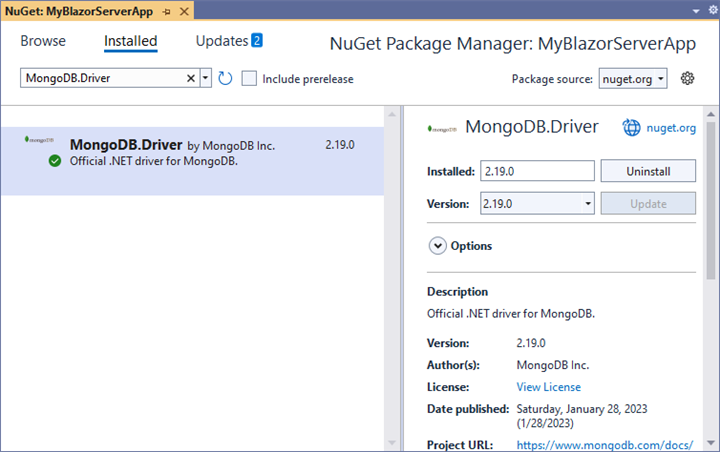
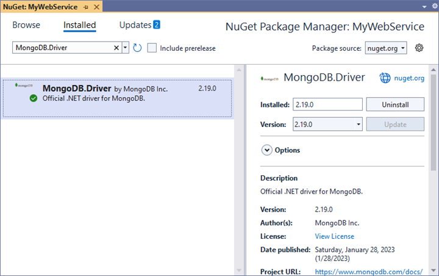
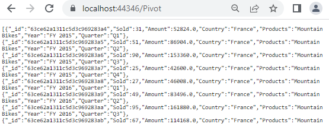

# MongoDB Data Binding

This guide explains how to connect a MongoDB database to the [Blazor Pivot Table](https://www.syncfusion.com/blazor-components/blazor-pivot-table) using the [MongoDB.Driver](https://www.nuget.org/packages/MongoDB.Driver) library. It covers two methods: directly retrieving and binding data to the Pivot Table, and using a Web API service to fetch and display MongoDB data.

## Connecting a MongoDB to a Syncfusion<sup style="font-size:70%">&reg;</sup> Blazor Pivot Table

This section describes how to connect the Blazor Pivot Table to a MongoDB database by directly retrieving data using the [MongoDB.Driver](https://www.nuget.org/packages/MongoDB.Driver) library.

### Step 1: Set Up a Blazor Pivot Table
1. Create a Blazor Pivot Table by following the [Getting Started](../getting-started) guide.

### Step 2: Install the MongoDB.Driver NuGet Package
1. Open the **NuGet Package Manager** in your project solution.
2. Search for the [MongoDB.Driver](https://www.nuget.org/packages/MongoDB.Driver) package and install it to enable MongoDB connectivity.



### Step 3: Connect to MongoDB
1. In the **Index.razor** file, under the `OnInitialized` method, use the **MongoClient** class to connect to the MongoDB database with a valid connection string.
2. Access the desired database using the **GetDatabase** method and retrieve the target collection with the **GetCollection** method.
3. Use the **Find** method with a **BsonDocument** to fetch data from the collection and convert it to a list.

### Step 4: Bind Data to the Pivot Table
1. Assign the retrieved list to the [DataSource](https://help.syncfusion.com/cr/blazor/Syncfusion.Blazor.PivotView.PivotViewDataSourceSettings-1.html#Syncfusion_Blazor_PivotView_PivotViewDataSourceSettings_1_DataSource) property of the [PivotViewDataSourceSettings](https://help.syncfusion.com/cr/blazor/Syncfusion.Blazor.PivotView.DataSourceSettingsModel-1.html).
2. Configure the Pivot Table report by defining fields in the [PivotViewRows](https://help.syncfusion.com/cr/blazor/Syncfusion.Blazor.PivotView.PivotViewDataSourceSettings-1.html#Syncfusion_Blazor_PivotView_PivotViewDataSourceSettings_1_Rows), [PivotViewColumns](https://help.syncfusion.com/cr/blazor/Syncfusion.Blazor.PivotView.PivotViewDataSourceSettings-1.html#Syncfusion_Blazor_PivotView_PivotViewDataSourceSettings_1_Columns), [PivotViewValues](https://help.syncfusion.com/cr/blazor/Syncfusion.Blazor.PivotView.PivotViewDataSourceSettings-1.html#Syncfusion_Blazor_PivotView_PivotViewDataSourceSettings_1_Values), and [PivotViewFormatSettings](https://help.syncfusion.com/cr/blazor/Syncfusion.Blazor.PivotView.PivotViewDataSourceSettings-1.html#Syncfusion_Blazor_PivotView_PivotViewDataSourceSettings_1_FormatSettings) to organize and format the data.

The following code connects to a MongoDB database, retrieves data, and binds it to the Pivot Table.

```cshtml
@using Syncfusion.Blazor.PivotView
@using MongoDB.Bson;
@using MongoDB.Driver;
@using MongoDB.Driver.Core.Authentication;

<SfPivotView TValue="ProductDetails" Width="1000" Height="300" ShowFieldList="true">
    <PivotViewDataSourceSettings TValue="ProductDetails" DataSource="@dataSource" ExpandAll=false EnableSorting=true>
        <PivotViewColumns>
            <PivotViewColumn Name="Year"></PivotViewColumn>                    
        </PivotViewColumns>
        <PivotViewRows>
            <PivotViewRow Name="Country"></PivotViewRow>
            <PivotViewRow Name="Products"></PivotViewRow>
        </PivotViewRows>
        <PivotViewValues>
            <PivotViewValue Name="Sold" Caption="Units Sold"></PivotViewValue>
            <PivotViewValue Name="Amount" Caption="Sold Amount"></PivotViewValue>
        </PivotViewValues>
        <PivotViewFormatSettings>
            <PivotViewFormatSetting Name="Sold" Format="N2"></PivotViewFormatSetting>
            <PivotViewFormatSetting Name="Amount" Format="C"></PivotViewFormatSetting>
        </PivotViewFormatSettings>
    </PivotViewDataSourceSettings>
    <PivotViewGridSettings ColumnWidth="120"></PivotViewGridSettings>
</SfPivotView>

@code {
    private List<ProductDetails> dataSource { get; set; }

    protected override void OnInitialized()
    {
        // Replace with your own connection string.
        string connectionString = "<Enter your valid connection string here>";
        MongoClient client = new MongoClient(connectionString);
        IMongoDatabase database = client.GetDatabase("sample_training");
        IMongoCollection<ProductDetails> collection = database.GetCollection<ProductDetails>("ProductDetails");
        dataSource = collection.Find(new BsonDocument()).ToList();      
    }

    public class ProductDetails
    {  
        public ObjectId _id { get; set; }
        public int Sold { get; set; }
        public double Amount { get; set; }
        public string Country { get; set; }
        public string Products { get; set; }
        public string Year { get; set; }
        public string Quarter { get; set; }
    }
}
```

### Step 5: Run and Verify the Pivot Table
1. Run the Blazor application.
2. The Pivot Table will display the MongoDB data, organized according to the defined report.
3. The resulting Pivot Table will look like this:


## Connecting a MongoDB to a Syncfusion<sup style="font-size:70%">&reg;</sup> Blazor Pivot Table via Web API service

This section explains how to create a Web API service to fetch data from a MongoDB database and connect it to the [Blazor Pivot Table](https://www.syncfusion.com/blazor-components/blazor-pivot-table) using the [MongoDB.Driver](https://www.nuget.org/packages/MongoDB.Driver).

### Create a Web API Service to Fetch MongoDB Data

Follow these steps to set up a Web API service that retrieves MongoDB data for the Pivot Table.

#### Step 1: Create an ASP.NET Core Web Application
1. Open Visual Studio and create a new **ASP.NET Core Web App** project named **MyWebService**.
2. Refer to the [Microsoft documentation](https://learn.microsoft.com/en-us/visualstudio/get-started/csharp/tutorial-aspnet-core?view=vs-2022) for detailed setup instructions.


#### Step 2: Install the MongoDB.Driver NuGet Package
1. Open the **NuGet Package Manager** in the project solution.
2. Search for and install the [MongoDB.Driver](https://www.nuget.org/packages/MongoDB.Driver) package to enable MongoDB connectivity.



#### Step 3: Create a Web API Controller
1. In the **Controllers** folder, create a new Web API controller named **PivotController.cs**.
2. This controller manages data communication between the MongoDB database and the Pivot Table.

#### Step 4: Connect to MongoDB and Retrieve Data
1. In the **PivotController.cs** file, use **MongoClient** to connect to the MongoDB database with a valid connection string.
2. Access the database with **GetDatabase** and the target collection with **GetCollection**.
3. Retrieve data using the **Find** method and convert it to a list.

```csharp
using Microsoft.AspNetCore.Mvc;
using Newtonsoft.Json;
using MongoDB.Bson;
using MongoDB.Driver;

namespace MyWebService.Controllers
{
    [ApiController]
    [Route("[controller]")]
    public class PivotController : ControllerBase
    {
        private static List<ProductDetails> FetchMongoDbResult()
        {
            // Replace with your own connection string.
            string connectionString = "<Enter your valid connection string here>";
            MongoClient client = new MongoClient(connectionString);
            IMongoDatabase database = client.GetDatabase("sample_training");
            var collection = database.GetCollection<ProductDetails>("ProductDetails");
            return collection.Find(new BsonDocument()).ToList();
        }

        public class ProductDetails
        {
            public ObjectId Id { get; set; }
            public int Sold { get; set; }
            public double Amount { get; set; }
            public string? Country { get; set; }
            public string? Products { get; set; }
            public string? Year { get; set; }
            public string? Quarter { get; set; }
        }
    }
}
```

#### Step 5: Serialize Data to JSON
1. In the **PivotController.cs** file, create a **Get** method that calls **FetchMongoDbResult** to retrieve MongoDB data.
2. Use **JsonConvert.SerializeObject** from the [Newtonsoft.Json](https://www.nuget.org/packages/Newtonsoft.Json) library to serialize the data into JSON format.

> Ensure the **Newtonsoft.Json** NuGet package is installed in your project.

The following code sets up the Web API controller to fetch and serialize MongoDB data.

```csharp
using Microsoft.AspNetCore.Mvc;
using Newtonsoft.Json;
using MongoDB.Bson;
using MongoDB.Driver;

namespace MyWebService.Controllers
{
    [ApiController]
    [Route("[controller]")]
    public class PivotController : ControllerBase
    {
        [HttpGet(Name = "GetMongoDbResult")]
        public object Get()
        {
            return JsonConvert.SerializeObject(FetchMongoDbResult());
        }

        private static List<ProductDetails> FetchMongoDbResult()
        {
            // Replace with your own connection string.
            string connectionString = "<Enter your valid connection string here>";
            MongoClient client = new MongoClient(connectionString);
            IMongoDatabase database = client.GetDatabase("sample_training");
            var collection = database.GetCollection<ProductDetails>("ProductDetails");
            return collection.Find(new BsonDocument()).ToList();
        }
        public class ProductDetails
        {
            public ObjectId Id { get; set; }
            public int Sold { get; set; }
            public double Amount { get; set; }
            public string? Country { get; set; }
            public string? Products { get; set; }
            public string? Year { get; set; }
            public string? Quarter { get; set; }
        }
    }
}
```

#### Step 6: Run the Web API Service
1. Build and run the application.
2. The application will be hosted at `https://localhost:44346/` (the port number may vary).

#### Step 7: Verify the JSON Data
1. Access the Web API endpoint at `https://localhost:44346/Pivot` to view the JSON data retrieved from MongoDB.
2. The browser will display the JSON data, as shown below.



### Connecting the Pivot Table to MongoDB Using the Web API Service

This section explains how to connect the Blazor Pivot Table to MongoDB data retrieved via the Web API service.

#### Step 1: Set Up a Blazor Pivot Table
1. Create a Blazor Pivot Table by following the [Getting Started](../getting-started) guide.

#### Step 2: Configure the Web API URL
1. In the **Index.razor** file, map the Web API URL (`https://localhost:44346/Pivot`) to the Pivot Table using the [Url](https://help.syncfusion.com/cr/blazor/Syncfusion.Blazor.PivotView.PivotViewDataSourceSettings-1.html#Syncfusion_Blazor_PivotView_PivotViewDataSourceSettings_1_Url) property of [PivotViewDataSourceSettings](https://help.syncfusion.com/cr/blazor/Syncfusion.Blazor.PivotView.DataSourceSettingsModel-1.html).
2. The [Url](https://help.syncfusion.com/cr/blazor/Syncfusion.Blazor.PivotView.PivotViewDataSourceSettings-1.html#Syncfusion_Blazor_PivotView_PivotViewDataSourceSettings_1_Url) property facilitates deserializing MongoDB data into instances of your model data class (i.e., TValue="ProductDetails") for binding to the Pivot Table.

#### Step 3: Define the Pivot Table Report
1. Configure the Pivot Table report by defining fields in the [PivotViewRows](https://help.syncfusion.com/cr/blazor/Syncfusion.Blazor.PivotView.PivotViewDataSourceSettings-1.html#Syncfusion_Blazor_PivotView_PivotViewDataSourceSettings_1_Rows), [PivotViewColumns](https://help.syncfusion.com/cr/blazor/Syncfusion.Blazor.PivotView.PivotViewDataSourceSettings-1.html#Syncfusion_Blazor_PivotView_PivotViewDataSourceSettings_1_Columns), [PivotViewValues](https://help.syncfusion.com/cr/blazor/Syncfusion.Blazor.PivotView.PivotViewDataSourceSettings-1.html#Syncfusion_Blazor_PivotView_PivotViewDataSourceSettings_1_Values), and [PivotViewFormatSettings](https://help.syncfusion.com/cr/blazor/Syncfusion.Blazor.PivotView.PivotViewDataSourceSettings-1.html#Syncfusion_Blazor_PivotView_PivotViewDataSourceSettings_1_FormatSettings) properties.
2. Enable the field list by setting [ShowFieldList](https://help.syncfusion.com/cr/blazor/Syncfusion.Blazor.PivotView.SfPivotView-1.html#Syncfusion_Blazor_PivotView_SfPivotView_1_ShowFieldList) to **true** for interactive field management.

The following code connects the Pivot Table to the Web API and configures the report.

```cshtml
@using Syncfusion.Blazor.PivotView

<SfPivotView TValue="ProductDetails" Width="1000" Height="300" ShowFieldList="true">
    <PivotViewDataSourceSettings TValue="ProductDetails" Url="https://localhost:44346/Pivot" ExpandAll="false" EnableSorting="true">
        <PivotViewColumns>
            <PivotViewColumn Name="Year"></PivotViewColumn>
        </PivotViewColumns>
        <PivotViewRows>
            <PivotViewRow Name="Country"></PivotViewRow>
            <PivotViewRow Name="Products"></PivotViewRow>
        </PivotViewRows>
        <PivotViewValues>
            <PivotViewValue Name="Sold" Caption="Units Sold"></PivotViewValue>
            <PivotViewValue Name="Amount" Caption="Sold Amount"></PivotViewValue>
        </PivotViewValues>
        <PivotViewFormatSettings>
            <PivotViewFormatSetting Name="Sold" Format="N2"></PivotViewFormatSetting>
            <PivotViewFormatSetting Name="Amount" Format="C"></PivotViewFormatSetting>
        </PivotViewFormatSettings>
    </PivotViewDataSourceSettings>
    <PivotViewGridSettings ColumnWidth="120"></PivotViewGridSettings>
</SfPivotView>

@code {
    public class ProductDetails
    {
        public ObjectId _id { get; set; }
        public int Sold { get; set; }
        public double Amount { get; set; }
        public string Country { get; set; }
        public string Products { get; set; }
        public string Year { get; set; }
        public string Quarter { get; set; }
    }
}
```

#### Step 4: Run and Verify the Pivot Table
1. Run the Blazor application.
2. The Pivot Table will display the MongoDB data fetched via the Web API, structured according to the defined report.
3. The resulting Pivot Table will look like this:


### Additional Resources
Explore a complete example of the Blazor Pivot Table integrated with MongoDB using a Web API service in this [GitHub repository](https://github.com/SyncfusionExamples/how-to-bind-MongoDB-to-pivot-table/tree/master/Blazor).