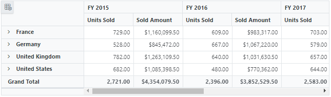

# MongoDB Data Binding

This section describes how to use [MongoDB driver](https://www.nuget.org/packages/MongoDB.Driver) to retrieve data from a MongoDB and bind it to the Blazor Pivot Table.

## Connecting a MongoDB to a Syncfusion Blazor Pivot Table within a Razor Component (aka, Index.razor) page

**1.** Create a simple Blazor Pivot Table by following the “Getting Started” documentation [link](../getting-started).

**2.** To connect a MongoDB using the MongoDB driver in our application, we need to install the [MongoDB.Driver](https://www.nuget.org/packages/MongoDB.Driver) NuGet package. To do so, open the NuGet package manager of the project solution, search for the package **MongoDB.Driver** and install it.


**3.** Connect the MongoDB in the **Index.razor** page using the **GetDatabase** method and the **MongoClient** in the **OnInitialized** method. Following that, the **GetCollection** method of the **IMongoDatabase** is used to retrieve the desired collection from the database. Then, using a **BsonDocument** instance, populate the data collection from the **IMongoCollection** into a List using the **Find** method.

**4.** Finally, use the [DataSource](https://help.syncfusion.com/cr/blazor/Syncfusion.Blazor.PivotView.PivotViewDataSourceSettings-1.html?&_ga=2.187712492.558891908.1675655056-779654442.1675225237#Syncfusion_Blazor_PivotView_PivotViewDataSourceSettings_1_DataSource) property in the [PivotViewDataSourceSettings](https://help.syncfusion.com/cr/blazor/Syncfusion.Blazor.PivotView.DataSourceSettingsModel-1.html?_ga=2.112723776.558891908.1675655056-779654442.1675225237) to bind the retrieved data from the **Find** method to the Pivot Table and set the report based on the data retrieved from the MongoDB.

```cshtml
@using Syncfusion.Blazor.PivotView
@using MongoDB.Bson;
@using MongoDB.Driver;
@using MongoDB.Driver.Core.Authentication;

<SfPivotView TValue="ProductDetails" Width="1000" Height="300" ShowFieldList="true">
    <PivotViewDataSourceSettings TValue="ProductDetails" DataSource="@dataSource" ExpandAll=false EnableSorting=true>
        <PivotViewColumns>
            <PivotViewColumn Name="Year"></PivotViewColumn>                    
        </PivotViewColumns>
        <PivotViewRows>
            <PivotViewRow Name="Country"></PivotViewRow>
            <PivotViewRow Name="Products"></PivotViewRow>
        </PivotViewRows>
        <PivotViewValues>
            <PivotViewValue Name="Sold" Caption="Units Sold"></PivotViewValue>
            <PivotViewValue Name="Amount" Caption="Sold Amount"></PivotViewValue>
        </PivotViewValues>
        <PivotViewFormatSettings>
            <PivotViewFormatSetting Name="Sold" Format="N2"></PivotViewFormatSetting>
            <PivotViewFormatSetting Name="Amount" Format="C"></PivotViewFormatSetting>
        </PivotViewFormatSettings>
    </PivotViewDataSourceSettings>
    <PivotViewGridSettings ColumnWidth="120"></PivotViewGridSettings>
</SfPivotView>

@code {
    private List<ProductDetails> dataSource { get; set; }

    protected override void OnInitialized()
    {
        // Replace with your own connection string.
        string connectionString = "<Enter your valid connection string here>";
        MongoClient client = new MongoClient(connectionString);
        IMongoDatabase database = client.GetDatabase("sample_training");
        IMongoCollection<ProductDetails> collection = database.GetCollection<ProductDetails>("ProductDetails");
        dataSource = collection.Find(new BsonDocument()).ToList();      
    }

    public class ProductDetails
    {  
        public ObjectId _id { get; set; }
        public int Sold { get; set; }
        public double Amount { get; set; }
        public string Country { get; set; }
        public string Products { get; set; }
        public string Year { get; set; }
        public string Quarter { get; set; }
    }
}
```

When you run the application, the resultant pivot table will look like this.



## Create a Web API service to fetch data from a MongoDB

**1.** Open Visual Studio and create an ASP.NET Core Web App project type, naming it **MyWebService**. To create an ASP.NET Core Web application, follow the document [link](https://learn.microsoft.com/en-us/visualstudio/get-started/csharp/tutorial-aspnet-core?view=vs-2022).


**2.** To connect a MongoDB using the MongoDB driver in our application, we need to install the [MongoDB.Driver](https://www.nuget.org/packages/MongoDB.Driver) NuGet package. To do so, open the NuGet package manager of the project solution, search for the package **MongoDB.Driver** and install it.


**3.** Create a Web API controller (aka, PivotController.cs) file under **Controllers** folder that helps to establish data communication with the Pivot Table.

**4.** In the Web API controller (aka, PivotController), **MongoClient** helps to connect the MongoDB server and retrieve databases via **GetDatabase** method. Following that, the **GetCollection** method of the **IMongoDatabase** is used to retrieve the desired collection from the database. Then, using a **BsonDocument** instance, populate the data collection from the **IMongoCollection** into a List using the **Find** method.

```csharp
using Microsoft.AspNetCore.Mvc;
using Newtonsoft.Json;
using MongoDB.Bson;
using MongoDB.Driver;

namespace MyWebService.Controllers
{
    [ApiController]
    [Route("[controller]")]
    public class PivotController : ControllerBase
    {
        private static List<ProductDetails> FetchMongoDbResult()
        {
            // Replace with your own connection string.
            string connectionString = "<Enter your valid connection string here>";
            MongoClient client = new MongoClient(connectionString);
            IMongoDatabase database = client.GetDatabase("sample_training");
            var collection = database.GetCollection<ProductDetails>("ProductDetails");
            return collection.Find(new BsonDocument()).ToList();
        }

        public class ProductDetails
        {
            public ObjectId Id { get; set; }
            public int Sold { get; set; }
            public double Amount { get; set; }
            public string? Country { get; set; }
            public string? Products { get; set; }
            public string? Year { get; set; }
            public string? Quarter { get; set; }
        }
    }
}
```

**5.** In the **Get()** method of the **PivotController.cs** file, the **FetchMongoDbResult** method is used to retrieve the MongoDB data as a List, which is then serialized into JSON string using **JsonConvert.SerializeObject()**.

```csharp
using Microsoft.AspNetCore.Mvc;
using Newtonsoft.Json;
using MongoDB.Bson;
using MongoDB.Driver;

namespace MyWebService.Controllers
{
    [ApiController]
    [Route("[controller]")]
    public class PivotController : ControllerBase
    {
        [HttpGet(Name = "GetMongoDbResult")]
        public object Get()
        {
            return JsonConvert.SerializeObject(FetchMongoDbResult());
        }

        private static List<ProductDetails> FetchMongoDbResult()
        {
            // Replace with your own connection string.
            string connectionString = "<Enter your valid connection string here>";
            MongoClient client = new MongoClient(connectionString);
            IMongoDatabase database = client.GetDatabase("sample_training");
            var collection = database.GetCollection<ProductDetails>("ProductDetails");
            return collection.Find(new BsonDocument()).ToList();
        }
        public class ProductDetails
        {
            public ObjectId Id { get; set; }
            public int Sold { get; set; }
            public double Amount { get; set; }
            public string? Country { get; set; }
            public string? Products { get; set; }
            public string? Year { get; set; }
            public string? Quarter { get; set; }
        }
    }
}
```

**6.** Run the application and it will be hosted within the URL `https://localhost:44346`.

**7.** Finally, the retrieved data from MongoDB which is in the form of JSON can be found in the Web API controller available in the URL link `https://localhost:44346/Pivot`, as shown in the browser page below.


### Connecting the Pivot Table to a MongoDB using the Web API service

**1.** Create a simple Blazor Pivot Table by following the “Getting Started” documentation [link](../getting-started).

**2.** Map the hosted Web API's URL link `https://localhost:44346/Pivot` to the Pivot Table in **Index.razor** by using the [Url](https://help.syncfusion.com/cr/blazor/Syncfusion.Blazor.DataManager.html?&_ga=2.200411303.844585580.1677740066-2135459383.1677740066#Syncfusion_Blazor_DataManager_Url) property under [PivotViewDataSourceSettings](https://help.syncfusion.com/cr/blazor/Syncfusion.Blazor.PivotView.DataSourceSettingsModel-1.html?_ga=2.200411303.844585580.1677740066-2135459383.1677740066). This [Url](https://help.syncfusion.com/cr/blazor/Syncfusion.Blazor.PivotView.PivotViewDataSourceSettings-1.html#Syncfusion_Blazor_PivotView_PivotViewDataSourceSettings_1_Url) property aids in the deserialization of MogoDB data into instances of your model data class (aka, ProductDetails) and binding it to the pivot table.

```cshtml
@using Syncfusion.Blazor.PivotView

<SfPivotView TValue="ProductDetails" Width="1000" Height="300" ShowFieldList="true">
    <PivotViewDataSourceSettings TValue="ProductDetails" Url="https://localhost:44346/Pivot" ExpandAll=false EnableSorting=true>
        <PivotViewColumns>
            <PivotViewColumn Name="Year"></PivotViewColumn>                    
        </PivotViewColumns>
        <PivotViewRows>
            <PivotViewRow Name="Country"></PivotViewRow>
            <PivotViewRow Name="Products"></PivotViewRow>
        </PivotViewRows>
        <PivotViewValues>
            <PivotViewValue Name="Sold" Caption="Units Sold"></PivotViewValue>
            <PivotViewValue Name="Amount" Caption="Sold Amount"></PivotViewValue>
        </PivotViewValues>
        <PivotViewFormatSettings>
            <PivotViewFormatSetting Name="Sold" Format="N2"></PivotViewFormatSetting>
            <PivotViewFormatSetting Name="Amount" Format="C"></PivotViewFormatSetting>
        </PivotViewFormatSettings>
    </PivotViewDataSourceSettings>
    <PivotViewGridSettings ColumnWidth="120"></PivotViewGridSettings>
</SfPivotView>

@code {
    public class ProductDetails
    {  
        public ObjectId _id { get; set; }
        public int Sold { get; set; }
        public double Amount { get; set; }
        public string Country { get; set; }
        public string Products { get; set; }
        public string Year { get; set; }
        public string Quarter { get; set; }
    }
}
```


When you run the application, the resultant pivot table will look like this.


> Explore our Blazor Pivot Table sample to bind data from a MongoDB in [this](https://github.com/SyncfusionExamples/how-to-bind-MongoDB-database-to-pivot-table/tree/master/Blazor) GitHub repository.
