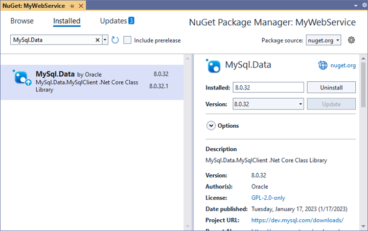

# MySQL Data Binding in Blazor Pivot Table Component

This guide explains how to connect a MySQL database to the [Blazor Pivot Table](https://www.syncfusion.com/blazor-components/blazor-pivot-table) using the [MySql.Data](https://www.nuget.org/packages/MySql.Data) library. It covers two methods: directly retrieving and binding data to the Pivot Table and using a Web API service to fetch and display MySQL data.

## Connecting a MySQL Database to a Syncfusion<sup style="font-size:70%">&reg;</sup> Blazor Pivot Table

This section describes how to connect the [Blazor Pivot Table](https://www.syncfusion.com/blazor-components/blazor-pivot-table) to a MySQL database by directly retrieving data using the [MySql.Data](https://www.nuget.org/packages/MySql.Data) library.

### Step 1: Set Up a Blazor Pivot Table
1. Create a [Blazor Pivot Table](https://www.syncfusion.com/blazor-components/blazor-pivot-table) by following the [Getting Started](../getting-started) guide.

### Step 2: Install the MySql.Data NuGet Package
1. Open the **NuGet Package Manager** in your project solution and search for **MySql.Data**.
2. Install the **MySql.Data** package to add MySQL database support.



### Step 3: Connect to MySQL
In the **Index.razor** file, under the `OnInitialized` method, use the [MySql.Data](https://www.nuget.org/packages/MySql.Data) library to connect to a MySQL database and retrieve data for the Pivot Table.

1. **Establish Connection**: Use **MySqlConnection** with a valid connection string (e.g., `Server=localhost;Database=mydb;Uid=myuser;Pwd=mypassword;`) to connect to the MySQL database.
2. **Query and Fetch Data**: Execute a SQL query (e.g., `SELECT * FROM orders`) using **MySqlCommand** to retrieve data for the Pivot Table.
3. **Structure the Data**: Use **MySqlDataAdapter**'s **Fill** method to populate the query results into a **DataTable**, which is then converted to a list for binding to the Pivot Table.

### Step 4: Bind Data to the Pivot Table
1. Assign the retrieved list to the [DataSource](https://help.syncfusion.com/cr/blazor/Syncfusion.Blazor.PivotView.PivotViewDataSourceSettings-1.html#Syncfusion_Blazor_PivotView_PivotViewDataSourceSettings_1_DataSource) property of the [PivotViewDataSourceSettings](https://help.syncfusion.com/cr/blazor/Syncfusion.Blazor.PivotView.DataSourceSettingsModel-1.html).
2. Configure the Pivot Table by defining fields in the [PivotViewColumns](https://help.syncfusion.com/cr/blazor/Syncfusion.Blazor.PivotView.PivotViewDataSourceSettings-1.html#Syncfusion_Blazor_PivotView_PivotViewDataSourceSettings_1_Columns), [PivotViewRows](https://help.syncfusion.com/cr/blazor/Syncfusion.Blazor.PivotView.PivotViewDataSourceSettings-1.html#Syncfusion_Blazor_PivotView_PivotViewDataSourceSettings_1_Rows), [PivotViewValues](https://help.syncfusion.com/cr/blazor/Syncfusion.Blazor.PivotView.PivotViewDataSourceSettings-1.html#Syncfusion_Blazor_PivotView_PivotViewDataSourceSettings_1_Values), and [PivotViewFormatSettings](https://help.syncfusion.com/cr/blazor/Syncfusion.Blazor.PivotView.PivotViewDataSourceSettings-1.html#Syncfusion_Blazor_PivotView_PivotViewDataSourceSettings_1_FormatSettings) to organize and format the data.

The following code connects to a MySQL database, retrieves data, and binds it to the Pivot Table.

```cshtml
@using Syncfusion.Blazor.PivotView
@using MySql.Data.MySqlClient;
@using Newtonsoft.Json;
@using System.Data;
@using Syncfusion.Blazor.Data;

<SfPivotView TValue="OrderDetails" Width="800" Height="340">
    <PivotViewDataSourceSettings TValue="OrderDetails" DataSource="@dataSource">
        <PivotViewColumns>
            <PivotViewColumn Name="ShipName"></PivotViewColumn>
        </PivotViewColumns>
        <PivotViewRows>
            <PivotViewRow Name="ShipCity"></PivotViewRow>
        </PivotViewRows>
        <PivotViewValues>
            <PivotViewValue Name="Freight"></PivotViewValue>
        </PivotViewValues>
        <PivotViewFormatSettings>
            <PivotViewFormatSetting Name="Freight" Format="N2"></PivotViewFormatSetting>
        </PivotViewFormatSettings>
        </PivotViewDataSourceSettings>
</SfPivotView>

@code {
    private List<OrderDetails> dataSource { get; set; }

    protected override void OnInitialized()
    {
        MySqlConnection connection = new MySqlConnection("<Enter your valid connection string here>");
        connection.Open();
        MySqlCommand command = new MySqlCommand("SELECT * FROM orders", connection);
        MySqlDataAdapter dataAdapter = new MySqlDataAdapter(command);
        DataTable dataTable = new DataTable();
        dataAdapter.Fill(dataTable);
        connection.Close();
        dataSource = (from DataRow data in dataTable.Rows
                       select new OrderDetails()
                           {
                               OrderID = Convert.ToInt32(data["OrderId"]),
                               CustomerID = data["CustomerID"].ToString(),
                               ShipCity = data["ShipCity"].ToString(),
                               ShipName = data["ShipName"].ToString(),
                               Freight = Convert.ToDouble(data["Freight"])
                           }).ToList();

    }

    public class OrderDetails
    {
        public int OrderID { get; set; }
        public string CustomerID { get; set; }
        public string ShipCity { get; set; }
        public string ShipName { get; set; }
        public double Freight { get; set; }
        }
   
}
```

### Step 5: Run and Verify the Pivot Table
1. Run the Blazor application.
2. The Pivot Table will display the MySQL data, organized according to the defined configuration.
3. The resulting Pivot Table will look like this:


## Connecting a MySQL to a Syncfusion<sup style="font-size:70%">&reg;</sup> Blazor Pivot Table via Web API service

This section explains how to create a Web API service to fetch data from a MySQL database and connect it to the Blazor Pivot Table.

### Create a Web API Service to Fetch MySQL Data

Follow these steps to set up a Web API service that retrieves MySQL data for the Pivot Table.

#### Step 1: Create an ASP.NET Core Web Application
1. Open Visual Studio and create a new **ASP.NET Core Web App** project named **MyWebService**.
2. Refer to the [Microsoft documentation](https://learn.microsoft.com/en-us/visualstudio/get-started/csharp/tutorial-aspnet-core?view=vs-2022) for detailed setup instructions.


#### Step 2: Install the MySql.Data NuGet Package
1. Install the [MySql.Data](https://www.nuget.org/packages/MySql.Data) package using the **NuGet Package Manager** to enable MySQL connectivity.


#### Step 3: Create a Web API Controller
1. In the **Controllers** folder, create a new Web API controller named **PivotController.cs**.
2. This controller manages data communication between the MySQL database and the Pivot Table.

#### Step 4: Connect to MySQL and Retrieve Data
In the **PivotController.cs** file, use the [MySql.Data](https://www.nuget.org/packages/MySql.Data) library to connect to a MySQL database and fetch data for the Pivot Table.

1. **Establish Connection**: Use **MySqlConnection** with a valid connection string to access the MySQL database.
2. **Fetch Data**: Run a SQL query (e.g., `SELECT * FROM orders`) using **MySqlCommand** to retrieve data.
3. **Prepare Data**: Use **MySqlDataAdapter**'s **Fill** method to store the query results in a **DataTable** for JSON serialization.

```csharp
    using Microsoft.AspNetCore.Mvc;
    using MySql.Data.MySqlClient;
    using Newtonsoft.Json;
    using System.Data;

    namespace MyWebService.Controllers
    {
        [ApiController]
        [Route("[controller]")]
        public class PivotController : ControllerBase
        {
            public dynamic GetMySQLResult()
            {
                // Replace with your own connection string.
                MySqlConnection connection = new MySqlConnection("<Enter your valid connection string here>");
                connection.Open();
                MySqlCommand command = new MySqlCommand("SELECT * FROM orders", connection);
                MySqlDataAdapter dataAdapter = new MySqlDataAdapter(command);
                DataTable dataTable = new DataTable();
                dataAdapter.Fill(dataTable);
                connection.Close();
                return dataTable;
            }
        }
    }

```

#### Step 5: Serialize Data to JSON
1. In the **PivotController.cs** file, create a **Get** method that calls **FetchMySQLResult** to retrieve MySQL data.
2. Use **JsonConvert.SerializeObject** from the [Newtonsoft.Json](https://www.nuget.org/packages/Newtonsoft.Json) library to serialize the **DataTable** into JSON format.

> Ensure the **Newtonsoft.Json** NuGet package is installed in your project.

The following code sets up the Web API controller to fetch and serialize MySQL data.

```csharp
    using Microsoft.AspNetCore.Mvc;
    using MySql.Data.MySqlClient;
    using Newtonsoft.Json;
    using System.Data;

    namespace MyWebService.Controllers
    {
        [ApiController]
        [Route("[controller]")]
        public class PivotController : ControllerBase
        {
            [HttpGet(Name = "GetMySQLResult")]
            public object Get()
            {
                return JsonConvert.SerializeObject(GetMySQLResult());
            }

            public dynamic GetMySQLResult()
            {
                // Replace with your own connection string.
                MySqlConnection connection = new MySqlConnection("<Enter your valid connection string here>");
                connection.Open();
                MySqlCommand command = new MySqlCommand("SELECT * FROM orders", connection);
                MySqlDataAdapter dataAdapter = new MySqlDataAdapter(command);
                DataTable dataTable = new DataTable();
                dataAdapter.Fill(dataTable);
                connection.Close();
                return dataTable;
            }
        }
    }

```

#### Step 6: Run the Web API Service
1. Build and run the application.
2. The application will be hosted at `https://localhost:7146/` (the port number may vary).

#### Step 7: Verify the JSON Data
1. Access the Web API endpoint at `https://localhost:7146/Pivot` to view the JSON data retrieved from MySQL.
2. The browser will display the JSON data, as shown below.


### Connecting the Pivot Table to MySQL Using the Web API Service

This section explains how to connect the Blazor Pivot Table to MySQL data retrieved via the Web API service.

#### Step 1: Set Up a Blazor Pivot Table
1. Create a Blazor Pivot Table by following the [Getting Started](../getting-started) guide.

#### Step 2: Configure the Web API URL
1. In the **Index.razor** file, map the Web API URL (`https://localhost:7146/Pivot`) to the Pivot Table using the [Url](https://help.syncfusion.com/cr/blazor/Syncfusion.Blazor.PivotView.PivotViewDataSourceSettings-1.html#Syncfusion_Blazor_PivotView_PivotViewDataSourceSettings_1_Url) property of [PivotViewDataSourceSettings](https://help.syncfusion.com/cr/blazor/Syncfusion.Blazor.PivotView.DataSourceSettingsModel-1.html).
2. The [Url](https://help.syncfusion.com/cr/blazor/Syncfusion.Blazor.PivotView.PivotViewDataSourceSettings-1.html#Syncfusion_Blazor_PivotView_PivotViewDataSourceSettings_1_Url) property facilitates deserializing MySQL data into instances of your model data class (i.e., TValue="OrderDetails") for binding to the Pivot Table.

#### Step 3: Define the Pivot Table Report
1. Configure the Pivot Table by defining fields in the [PivotViewColumns](https://help.syncfusion.com/cr/blazor/Syncfusion.Blazor.PivotView.PivotViewDataSourceSettings-1.html#Syncfusion_Blazor_PivotView_PivotViewDataSourceSettings_1_Columns), [PivotViewRows](https://help.syncfusion.com/cr/blazor/Syncfusion.Blazor.PivotView.PivotViewDataSourceSettings-1.html#Syncfusion_Blazor_PivotView_PivotViewDataSourceSettings_1_Rows), [PivotViewValues](https://help.syncfusion.com/cr/blazor/Syncfusion.Blazor.PivotView.PivotViewDataSourceSettings-1.html#Syncfusion_Blazor_PivotView_PivotViewDataSourceSettings_1_Values), and [PivotViewFormatSettings](https://help.syncfusion.com/cr/blazor/Syncfusion.Blazor.PivotView.PivotViewDataSourceSettings-1.html#Syncfusion_Blazor_PivotView_PivotViewDataSourceSettings_1_FormatSettings) properties.
2. Enable the field list by setting [ShowFieldList](https://help.syncfusion.com/cr/blazor/Syncfusion.Blazor.PivotView.SfPivotView-1.html#Syncfusion_Blazor_PivotView_SfPivotView_1_ShowFieldList) to **true** for interactive field management.

The following code connects the Pivot Table to the Web API and configures the report.

```cshtml
@using Syncfusion.Blazor.PivotView

<SfPivotView TValue="OrderDetails" Width="1000" Height="300" ShowFieldList="true">
    <PivotViewDataSourceSettings TValue="OrderDetails" Url="https://localhost:7146/Pivot" ExpandAll="false" EnableSorting="true">
        <PivotViewColumns>
            <PivotViewColumn Name="ShipName"></PivotViewColumn>
        </PivotViewColumns>
        <PivotViewRows>
            <PivotViewRow Name="ShipCity"></PivotViewRow>
        </PivotViewRows>
        <PivotViewValues>
            <PivotViewValue Name="Freight"></PivotViewValue>
        </PivotViewValues>
        <PivotViewFormatSettings>
            <PivotViewFormatSetting Name="Freight" Format="N2"></PivotViewFormatSetting>
        </PivotViewFormatSettings>
    </PivotViewDataSourceSettings>
    <PivotViewGridSettings ColumnWidth="120"></PivotViewGridSettings>
</SfPivotView>

@code {
    public class OrderDetails
    {
        public int OrderID { get; set; }
        public string ShipName { get; set; }
        public string CustomerID { get; set; }
        public string ShipCity { get; set; }
        public double Freight { get; set; }
    }
}
```

#### Step 4: Run and Verify the Pivot Table
1. Run the Blazor application.
2. The Pivot Table will display the MySQL data fetched via the Web API, structured according to the defined configuration.
3. The resulting Pivot Table will look like this:


### Additional Resources
Explore a complete example of the Blazor Pivot Table integrated with MySQL using a Web API service in this [GitHub repository](https://github.com/SyncfusionExamples/web-bind-MySQL-database-to-pivot-table/tree/master/Blazor).