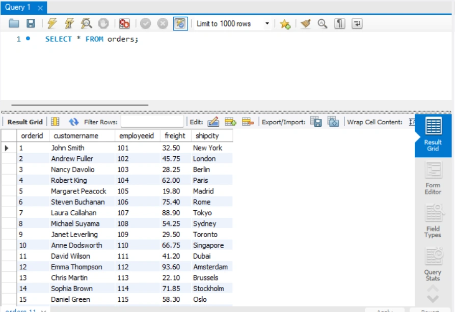
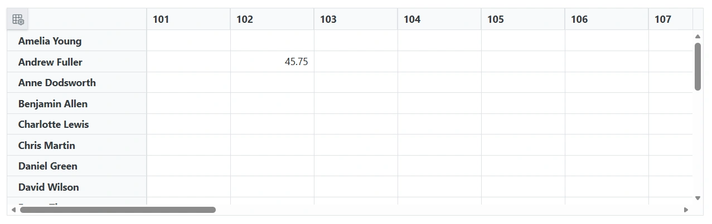
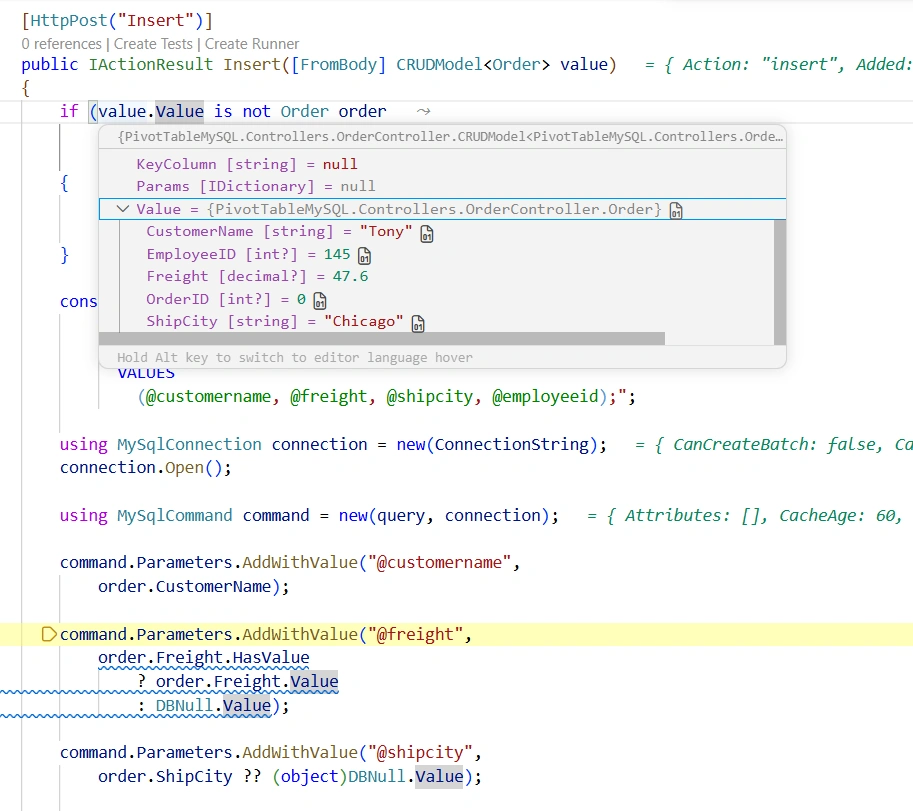
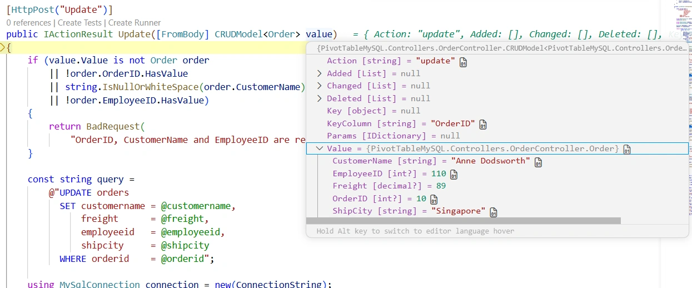
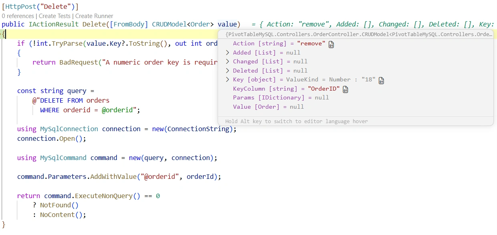
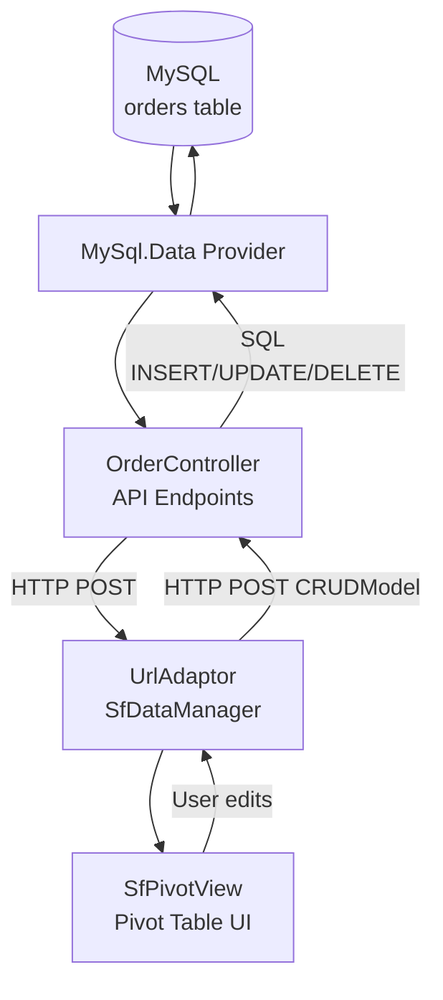

# Connecting MySQL to Blazor Pivot Table Using URL Adaptor

The [Blazor Pivot Table](https://www.syncfusion.com/blazor-components/blazor-pivot-table) supports binding data from a MySQL database using the **URL Adaptor**. This remote-data binding approach exposes the database through an HTTP API controller and lets the pivot table communicate with the server over standard HTTP. Server-side query processing is required before using the pattern for large datasets.

### What is the URL Adaptor?

The URL Adaptor is a Syncfusion data adaptor that delegates every data operation—read, insert, update, and delete—to a remote endpoint. Instead of fetching the entire dataset into the browser, the pivot table posts a serialized [`DataManagerRequest`](https://help.syncfusion.com/cr/blazor/Syncfusion.Blazor.DataManagerRequest.html) to a controller action, and the server returns the processed result. This keeps the pivot table lightweight and pushes the heavy lifting to the server.

### Key Benefits of the URL Adaptor

- **Remote API contract**: The URL Adaptor sends requests to an HTTP endpoint that returns a `{ result, count }` response. The sample below loads the complete `orders` table; add explicit `DataManagerRequest` processing before using it for large datasets.
- **RESTful contract**: A clean HTTP API that any client (Blazor, Angular, React, mobile) can consume.
- **Full CRUD Support**: Dedicated `Insert`, `Update`, and `Delete` endpoints power cell editing and the Pivot Table's Edit Dialog (drill-through) operations.
- **Loose Coupling**: The pivot component knows only the endpoint URLs, not the underlying database or data-access technology.
- **Scalability**: Stateless controllers and connection-pooled database access can scale horizontally when the API also applies server-side query operations.

### What is MySql.Data?

[MySql.Data](https://www.nuget.org/packages/MySql.Data/) is Oracle's official ADO.NET data provider for MySQL (also known as Connector/NET). It allows .NET applications to connect to MySQL, execute SQL commands, and read results using `MySqlConnection`, `MySqlCommand`, and `MySqlDataAdapter`. This sample uses the direct `MySql.Data` package and does not use Entity Framework Core.

> **MySQL vs PostgreSQL Provider Note:** The PostgreSQL sample uses `Npgsql`, while this MySQL sample uses `MySql.Data`. Both implement the standard ADO.NET interfaces (`IDbConnection`, `IDbCommand`, `IDbDataAdapter`), so the controller's data-access code follows the same pattern—only the provider types and connection-string syntax differ. For new MySQL workloads, `MySqlConnector` (a community-maintained, fully async-compatible provider) is an alternative; this sample uses `MySql.Data` for parity with the Oracle connector documentation.

## Prerequisites

Ensure the following software and packages are installed before proceeding:

| Software/Package | Version | Purpose |
|-----------------|---------|---------|
| Visual Studio 2026 | 18.0 or later | Development IDE with Blazor workload |
| .NET SDK | 10.0 | Runtime and build tools |
| MySQL Server | 8.0 or later | Relational database server |
| MySQL Workbench | Latest | MySQL GUI management tool |
| Syncfusion.Blazor.PivotTable | `{{site.blazorversion}}` | Pivot Table and UI components |
| Syncfusion.Blazor.Themes | `{{site.blazorversion}}` | Styling for Pivot Table components |
| MySql.Data | 9.4.0 | MySQL ADO.NET data provider (Oracle Connector/NET) |
| Newtonsoft.Json | 13.0.3 | JSON serialization for CRUD models |

The sample targets .NET 10 and the corresponding Syncfusion Blazor release. Do not use wildcard package versions. If you use another .NET or Syncfusion version, verify the API differences before applying the code.

`{{site.blazorversion}}` is resolved by the documentation build. When copying the commands into a standalone project, replace it with the concrete Syncfusion version used by the sample.

### Step 0: Create the Blazor application

Create a **Blazor Web App** named `PivotTableMySQL` with the .NET 10 SDK. Select **Interactive Server** interactivity and enable HTTPS. The project should contain `Program.cs`, `appsettings.json`, `wwwroot`, `Components`, and `Properties/launchSettings.json`.

If MySQL and MySQL Workbench are not already installed, install them first, start the MySQL service, and create a database user with permission to connect to `Orders`, read and modify `Orders.orders`, and use the `AUTO_INCREMENT` sequence on the `orderid` column.

Syncfusion packages obtained from NuGet.org also require a valid Syncfusion license or trial key. Register the key before the first Syncfusion component is initialized in production; see the [Syncfusion license-key instructions](https://blazor.syncfusion.com/documentation/getting-started/license-key/how-to-register-in-an-application). The sample project omits the registration call for brevity—add it in `Program.cs` before shipping.

## Setting Up the MySQL Environment

### Step 1: Create the Database and Table in MySQL

First, the **MySQL database** structure must be created to store order records.

**UI Instructions (Using MySQL Workbench):**

1. **Open MySQL Workbench** and connect to the MySQL server.
2. **Create Database**:
    - Click the **Create a new schema** icon in the toolbar (or right-click the schemas panel → **Create Schema**).
    - Enter name: `Orders`
    - Set the character set and collation (defaults `utf8mb4` / `utf8mb4_0900_ai_ci` are recommended).
    - Click **Apply**.
3. **Create the table and sample rows using one of these methods**:
    - **UI method:** Expand `Orders` → **Tables**, create `orders`, and define the columns from the SQL script; then insert the sample rows separately.
    - **SQL method:** Open a new query tab (File → New Query Tab), copy the table/sample-data script below, and execute it with **Ctrl+Enter** or the lightning-bolt Run button. Do not create the table manually first.

4. **Verify the table and sample rows**:
    - Open a new query tab against `Orders`.
    - Run `SELECT * FROM orders;`

**Database creation script** (run while connected to the server, with any schema context):

```sql
CREATE DATABASE Orders;
```

After the database is created, open a new query tab connected to `Orders` (either issue `USE Orders;` first or select the schema in the Object Browser) and run the following table and sample-data script:

```sql
-- Create orders table
USE Orders;

CREATE TABLE orders (
    orderid INT AUTO_INCREMENT PRIMARY KEY,
    customername VARCHAR(100),
    employeeid INT,
    shipcity VARCHAR(100),
    freight DECIMAL(10, 2)
);

-- Insert sample data
INSERT INTO orders (customername, employeeid, shipcity, freight)
VALUES
('Alice Johnson', 1, 'New York', 120.50),
('Bob Smith', 2, 'London', 85.20),
('Carol Davis', 1, 'New York', 210.75),
('David Brown', 3, 'Berlin', 95.00),
('Eve Wilson', 2, 'London', 150.25),
('Frank Moore', 4, 'Tokyo', 60.80),
('Grace Taylor', 1, 'New York', 180.40),
('Henry Anderson', 3, 'Berlin', 220.60),
('Ivy Thomas', 2, 'London', 75.10),
('Jack White', 4, 'Tokyo', 130.90);
```

After executing this script, the order records are stored in the `orders` table within the `Orders` database. The database is now ready for integration with the Blazor application.

> **Migration Note: PostgreSQL → MySQL Data Types:** PostgreSQL uses `SERIAL` (which is `INTEGER` plus a sequence) for auto-incrementing primary keys. MySQL replaces this with the `AUTO_INCREMENT` column attribute on an `INT` (or `BIGINT`) column declared as a `PRIMARY KEY` or indexed with a `UNIQUE` constraint. PostgreSQL `NUMERIC(12,2)` maps to MySQL `DECIMAL(10,2)` (MySQL `DECIMAL` is the exact numeric equivalent; MySQL also supports `NUMERIC` as a synonym). `VARCHAR(100)` is identical in both engines.

**Verify the Inserted Records:**

To confirm the table and sample data were created correctly, run the following verification query in MySQL Workbench against `Orders`:

```sql
SELECT * FROM orders;
```

The screenshot below shows the records successfully inserted into the `orders` table in MySQL.



**Image Content:**
- MySQL Workbench query results grid window.
- The `SELECT * FROM orders` query at the top.
- The results grid below showing all 10 sample records with columns `orderid`, `customername`, `employeeid`, `shipcity`, and `freight`.

**Purpose:** Confirms the database table and sample data are ready before the Blazor application is wired up, helping customers catch MySQL setup issues early.

**Capture Source:** MySQL Workbench → `Orders` → New Query Tab → run `SELECT * FROM orders;`.

### Step 2: Install Required NuGet Packages

The `PivotTableMySQL` Blazor Web App was created in Step 0. Install the required packages in the web project selected as the Package Manager Console's **Default project**.

**Method 1: Using Package Manager Console**

1. Open Visual Studio 2026.
2. Navigate to **Tools → NuGet Package Manager → Package Manager Console**.
3. Run the following commands:

```powershell
Install-Package Syncfusion.Blazor.PivotTable -Version {{site.blazorversion}}
Install-Package Syncfusion.Blazor.Themes -Version {{site.blazorversion}}
Install-Package MySql.Data -Version 9.4.0
Install-Package Newtonsoft.Json -Version 13.0.3
```

**Method 2: Using NuGet Package Manager UI**

1. Open **Visual Studio 2026 → Tools → NuGet Package Manager → Manage NuGet Packages for Solution**.
2. Search for and install each package individually:
    - **[Syncfusion.Blazor.PivotTable](https://www.nuget.org/packages/Syncfusion.Blazor.PivotTable/)** (version {{site.blazorversion}})
    - **[Syncfusion.Blazor.Themes](https://www.nuget.org/packages/Syncfusion.Blazor.Themes/)** (version {{site.blazorversion}})
    - **[MySql.Data](https://www.nuget.org/packages/MySql.Data/)** (version 9.4.0)
    - **Newtonsoft.Json** (version 13.0.3)

**Project File Reference**

The installed packages are reflected in the **PivotTableMySQL.csproj** file:

```xml
<Project Sdk="Microsoft.NET.Sdk.Web">

  <PropertyGroup>
    <TargetFramework>net10.0</TargetFramework>
    <Nullable>enable</Nullable>
    <ImplicitUsings>enable</ImplicitUsings>
  </PropertyGroup>

  <ItemGroup>
    <PackageReference Include="Syncfusion.Blazor.PivotTable" Version="100.2.1" />
    <PackageReference Include="Syncfusion.Blazor.Themes" Version="100.2.1" />
    <PackageReference Include="Newtonsoft.Json" Version="13.0.3" />
    <PackageReference Include="MySql.Data" Version="9.4.0" />
  </ItemGroup>

</Project>
```

> **Provider Note:** The PostgreSQL sample lists `Npgsql` here; this MySQL sample replaces it with `MySql.Data`. The controller's `CRUDModel<T>` payload uses the built-in `System.Text.Json.Serialization` `[JsonPropertyName]` attributes (the same approach as the PostgreSQL sample), so no additional JSON-serialization package is required for the controller code. The `Newtonsoft.Json` `PackageReference` is present in the project file for compatibility with samples that consume the same data layer; if you are starting from a clean project, you can omit it.

All required packages are now installed.

### Step 3: Configure the Connection String

A connection string contains the information needed to connect the application to the MySQL database, including the server address, database name, and authentication credentials.

The sample stores the connection string in `appsettings.json` under `ConnectionStrings:MySQL` and reads it through `IConfiguration` in the controller. This keeps credentials out of source code and follows the .NET configuration conventions.

**Instructions:**

1. Replace the contents of `appsettings.json` with the following configuration:

```json
{
  "ConnectionStrings": {
    "MySQL": "Server=localhost;Port=3306;Database=Orders;Uid=root;Pwd=password@123;"
  },
  "Logging": {
    "LogLevel": {
      "Default": "Information",
      "Microsoft.AspNetCore": "Warning"
    }
  },
  "AllowedHosts": "*"
}
```

2. Inject `IConfiguration` into `OrderController` and retrieve the named connection string:

```csharp
using Microsoft.AspNetCore.Mvc;
using MySql.Data.MySqlClient;
using Syncfusion.Blazor.Data;
using Syncfusion.Blazor;

namespace PivotTableMySQL.Controllers
{
    [ApiController]
    [Route("api/[controller]")]
    public class OrderController : ControllerBase
    {
        private readonly string ConnectionString;

        public OrderController(IConfiguration configuration)
        {
            ConnectionString = configuration.GetConnectionString("MySQL")
                ?? throw new InvalidOperationException(
                    "The MySQL connection string is not configured.");
        }
    }
}
```

> **Placeholder:** Replace `Pwd=password@123;` in `appsettings.json` with the password of your own MySQL user before running the sample.

**Connection String Components:**

| Component | Description |
|-----------|-------------|
| Server | The address of the MySQL server (`localhost` for local development) |
| Port | The port number on which MySQL is running (default is `3306`) |
| Database | The database name (in this case, `Orders`) |
| Uid | The MySQL username (default is `root`) |
| Pwd | The password for the MySQL user account |

> **Migration Note: Connection-String Syntax:** PostgreSQL (Npgsql) uses `Host`, `Port`, `Database`, `Username`, and `Password` keys. MySQL (`MySql.Data`) uses `Server`, `Port`, `Database`, `Uid`, and `Pwd` keys. The separator and trailing semicolon conventions are the same. Both samples read the value through `IConfiguration.GetConnectionString(...)` so only the key names and the `appsettings.json` entry name differ.

The injected `ConnectionString` field is reused by every database action when opening `MySqlConnection` instances.

> **Security Note:** Do not commit real passwords to source control. For local development, use .NET user secrets (the environment-variable override `ConnectionStrings__MySQL` replaces the value in `appsettings.json`); for deployment, use environment variables or a secrets manager such as Azure Key Vault.

The database connection string has been configured successfully.

### Step 4: Create the Controller

The controller is the heart of the URL Adaptor integration. It exposes HTTP endpoints that the pivot table calls for reading and modifying data. The sample uses raw `MySql.Data` commands to keep the data-access code explicit and easy to follow, parameterized SQL throughout to prevent SQL injection, and `IActionResult` responses so callers can distinguish success from validation errors.

**Instructions:**

1. Inside the `Controllers` folder, create a new file named **OrderController.cs**.
2. Define the `OrderController` class with the following code:

```csharp
using System.ComponentModel.DataAnnotations;
using System.Data;
using System.Text.Json.Serialization;
using Microsoft.AspNetCore.Mvc;
using MySql.Data.MySqlClient;
using Syncfusion.Blazor.Data;
using Syncfusion.Blazor;

namespace PivotTableMySQL.Controllers
{
    [ApiController]
    [Route("api/[controller]")]
    public class OrderController : ControllerBase
    {
        private readonly string ConnectionString;

        public OrderController(IConfiguration configuration)
        {
            ConnectionString = configuration.GetConnectionString("MySQL")
                ?? throw new InvalidOperationException(
                    "The MySQL connection string is not configured.");
        }

        [HttpPost]
        public object Post([FromBody] DataManagerRequest request)
        {
            // This sample intentionally returns the complete table. The request is
            // accepted to satisfy the URL Adaptor contract but is not processed.
            _ = request;

            List<Order> dataSource = GetOrderData();

            return new
            {
                result = dataSource,
                count = dataSource.Count
            };
        }

        private List<Order> GetOrderData()
        {
            const string query =
                @"SELECT orderid,
                         customername,
                         employeeid,
                         shipcity,
                         freight
                  FROM orders
                  ORDER BY orderid";

            using MySqlConnection connection = new(ConnectionString);
            connection.Open();

            using MySqlCommand command = new(query, connection);
            using MySqlDataAdapter adapter = new(command);

            DataTable dataTable = new();
            adapter.Fill(dataTable);

            return (from DataRow row in dataTable.Rows
                    select new Order
                    {
                        OrderID = Convert.ToInt32(row["orderid"]),
                        CustomerName = row["customername"].ToString(),
                        EmployeeID = Convert.ToInt32(row["employeeid"]),
                        ShipCity = row.IsNull("shipcity")
                            ? null
                            : row["shipcity"].ToString(),
                        Freight = row.IsNull("freight")
                            ? null
                            : Convert.ToDecimal(row["freight"])
                    }).ToList();
        }

        [HttpPost("Insert")]
        public IActionResult Insert([FromBody] CRUDModel<Order> value)
        {
            if (value.Value is not Order order
                || string.IsNullOrWhiteSpace(order.CustomerName)
                || !order.EmployeeID.HasValue)
            {
                return BadRequest(
                    "CustomerName and EmployeeID are required.");
            }

            const string query =
                @"INSERT INTO orders
                    (customername, freight, shipcity, employeeid)
                  VALUES
                    (@customername, @freight, @shipcity, @employeeid);";

            using MySqlConnection connection = new(ConnectionString);
            connection.Open();

            using MySqlCommand command = new(query, connection);

            command.Parameters.AddWithValue("@customername",
                order.CustomerName);

            command.Parameters.AddWithValue("@freight",
                order.Freight.HasValue
                    ? order.Freight.Value
                    : DBNull.Value);

            command.Parameters.AddWithValue("@shipcity",
                order.ShipCity ?? (object)DBNull.Value);

            command.Parameters.AddWithValue("@employeeid",
                order.EmployeeID.Value);

            command.ExecuteNonQuery();

            order.OrderID = Convert.ToInt32(command.LastInsertedId);

            return Ok(order);
        }

        [HttpPost("Update")]
        public IActionResult Update([FromBody] CRUDModel<Order> value)
        {
            if (value.Value is not Order order
                || !order.OrderID.HasValue
                || string.IsNullOrWhiteSpace(order.CustomerName)
                || !order.EmployeeID.HasValue)
            {
                return BadRequest(
                    "OrderID, CustomerName and EmployeeID are required.");
            }

            const string query =
                @"UPDATE orders
                  SET customername = @customername,
                      freight      = @freight,
                      employeeid   = @employeeid,
                      shipcity     = @shipcity
                  WHERE orderid    = @orderid";

            using MySqlConnection connection = new(ConnectionString);
            connection.Open();

            using MySqlCommand command = new(query, connection);

            command.Parameters.AddWithValue("@customername",
                order.CustomerName);

            command.Parameters.AddWithValue("@freight",
                order.Freight.HasValue
                    ? order.Freight.Value
                    : DBNull.Value);

            command.Parameters.AddWithValue("@employeeid",
                order.EmployeeID.Value);

            command.Parameters.AddWithValue("@shipcity",
                order.ShipCity ?? (object)DBNull.Value);

            command.Parameters.AddWithValue("@orderid",
                order.OrderID.Value);

            return command.ExecuteNonQuery() == 0
                ? NotFound()
                : Ok(order);
        }

        [HttpPost("Delete")]
        public IActionResult Delete([FromBody] CRUDModel<Order> value)
        {
            if (!int.TryParse(value.Key?.ToString(), out int orderId))
            {
                return BadRequest("A numeric order key is required.");
            }

            const string query =
                @"DELETE FROM orders
                  WHERE orderid = @orderid";

            using MySqlConnection connection = new(ConnectionString);
            connection.Open();

            using MySqlCommand command = new(query, connection);

            command.Parameters.AddWithValue("@orderid", orderId);

            return command.ExecuteNonQuery() == 0
                ? NotFound()
                : NoContent();
        }

        public class Order
        {
            [Key]
            public int? OrderID { get; set; }

            public string? CustomerName { get; set; }

            public int? EmployeeID { get; set; }

            public decimal? Freight { get; set; }

            public string? ShipCity { get; set; }
        }

        public class CRUDModel<T> where T : class
        {
            [JsonPropertyName("action")]
            public string? Action { get; set; }

            [JsonPropertyName("keyColumn")]
            public string? KeyColumn { get; set; }

            [JsonPropertyName("key")]
            public object? Key { get; set; }

            [JsonPropertyName("value")]
            public T? Value { get; set; }

            [JsonPropertyName("added")]
            public List<T>? Added { get; set; }

            [JsonPropertyName("changed")]
            public List<T>? Changed { get; set; }

            [JsonPropertyName("deleted")]
            public List<T>? Deleted { get; set; }

            [JsonPropertyName("params")]
            public IDictionary<string, object>? Params { get; set; }
        }
    }
}
```

**Explanation:**

- **Constructor / `ConnectionString`**: The controller takes `IConfiguration` through dependency injection and reads the `ConnectionStrings:MySQL` value set in `appsettings.json` (see Step 3). It throws if the entry is missing, so misconfiguration surfaces on the first request rather than as a silent failure.
- **`Post` action (`POST /api/Order`)**: Read endpoint of the URL Adaptor. It accepts a `DataManagerRequest` so the adaptor contract is satisfied, then returns the full dataset as `{ result, count }`. This sample intentionally does not process the request's query operations; add explicit `DataManagerRequest` processing before using it for large datasets.
- **`GetOrderData` helper**: Opens a `MySqlConnection`, runs an explicit column list `SELECT ... FROM orders ORDER BY orderid`, fills a `DataTable` via `MySqlDataAdapter`, and projects the rows into `Order` objects. Nullable `shipcity` and `freight` are handled with `row.IsNull(...)` so SQL `NULL` is preserved on the C# model's nullable (`string?`, `decimal?`) properties.
- **`Insert` action (`POST /api/Order/Insert`)**: Validates that `CustomerName` and `EmployeeID` are present, runs a parameterized `INSERT` (letting the `orderid` `AUTO_INCREMENT` column populate `orderid`), reads the generated key with `command.LastInsertedId`, and returns `Ok(order)` so the pivot table receives the persisted row. Returns `BadRequest` on invalid input.
- **`Update` action (`POST /api/Order/Update`)**: Validates `OrderID`, `CustomerName`, and `EmployeeID`, runs a parameterized `UPDATE` filtered by `orderid`, and returns `NotFound` when no row was matched or `Ok(order)` on success.
- **`Delete` action (`POST /api/Order/Delete`)**: Parses a numeric `Key` from the `CRUDModel<Order>`, runs a parameterized `DELETE` filtered by `orderid`, and returns `BadRequest` for a non-numeric key, `NotFound` when nothing was deleted, or `NoContent()` on success.
- The `[ApiController]` attribute enables automatic model validation and HTTP API conventions; `[Route("api/[controller]")]` and per-action `[HttpPost("...")]` attributes produce the four `/api/Order*` routes the URL Adaptor points at.

> **Migration Note: SQL Syntax differences.**
> - **Schema qualification**: PostgreSQL addresses the table as `public.orders`. MySQL does not use the `public` schema concept; the database name effectively serves as the schema. The sample therefore uses `orders` (with `USE Orders;` or the connection's default database) and the substring `SELECT orderid, customername, employeeid, shipcity, freight FROM orders ORDER BY orderid` replaces the PostgreSQL `SELECT orderid, customername, employeeid, shipcity, freight FROM public.orders ORDER BY orderid`.
> - **Parameter prefix**: Npgsql uses `@name` or `:name`. `MySql.Data` uses `@name` (the `?` positional marker is also supported but not used here).
> - **Identifier casing**: PostgreSQL lowercases unquoted identifiers by default; `public.orders` is lowercase. On Windows the default MySQL installation lowercases table names (`lower_case_table_names=1`), but on Linux `Orders.orders` and `Orders.ORDERS` differ. Use `orders` consistently and set the same `lower_case_table_names` policy on every platform to avoid migration surprises.
> - **Nullable columns**: Like the PostgreSQL sample, the MySQL controller reads nullable `shipcity` and `freight` columns with `row.IsNull(...) ? null : ...` so SQL `NULL` is preserved on the C# model's nullable (`int?`, `decimal?`, `string?`) properties.
> - **Parameterized queries**: This guide replaces the pooled-string-concatenation (`$"INSERT... '{Value.Value.CustomerName}' ...`) found in the original project's controller with parameterized `@named` parameters to prevent SQL injection and provide parity with the PostgreSQL guide's defensive coding style. This is a **best-practice hardening** of the sample and is functionally equivalent for the supported fields.

> **Read endpoint contract:** The `POST /api/Order` endpoint accepts a JSON `DataManagerRequest` body and returns `{ result, count }`; it does **not** respond to a browser address-bar `GET` request. Data is only consumed through the Pivot Table's URL Adaptor.

### Step 5: Register Services in Program.cs

The `Program.cs` file is where application services are registered and configured. This file must be updated to enable Syncfusion Blazor, Razor components, and the API controllers that back the URL Adaptor.

**Instructions:**

1. Open the `Program.cs` file at the project root.
2. Replace its contents with the following code:

```csharp
using PivotTableMySQL.Components;
using Syncfusion.Blazor;

var builder = WebApplication.CreateBuilder(args);

// ========== SYNCFUSION BLAZOR CONFIGURATION ==========
builder.Services.AddSyncfusionBlazor();

// ========== RAZOR COMPONENTS ==========
builder.Services.AddRazorComponents()
    .AddInteractiveServerComponents();

// ========== API CONTROLLERS (backs the URL Adaptor) ==========
builder.Services.AddControllers();

var app = builder.Build();

// Configure the HTTP request pipeline.
if (!app.Environment.IsDevelopment())
{
    app.UseExceptionHandler("/Error", createScopeForErrors: true);
    // The default HSTS value is 30 days. Change for production scenarios, see https://aka.ms/aspnetcore-hsts.
    app.UseHsts();
}

app.UseHttpsRedirection();
app.MapControllers();

app.UseAntiforgery();

app.MapStaticAssets();
app.MapRazorComponents<App>()
    .AddInteractiveServerRenderMode();

app.Run();
```

**Explanation:**

- **`AddSyncfusionBlazor()`**: Registers Syncfusion Blazor services, including the Pivot Table and theme resources.
- **`AddRazorComponents()` and `AddInteractiveServerComponents()`**: Enables Blazor server-side rendering with interactive components.
- **`AddControllers()`**: Registers the API controllers (`OrderController`) so the URL Adaptor endpoints are reachable; the controller's `IConfiguration` dependency is satisfied automatically by the generic host.
- **`MapControllers()`**: Adds the controller routes to the application's endpoint pipeline.
- **`UseAntiforgery()`**: Enables anti-forgery middleware for endpoints that explicitly require it. The sample API actions do not add anti-forgery validation.

> **License reminder:** Syncfusion components obtained from NuGet.org require a valid Syncfusion license or trial key. Register the key by calling `Syncfusion.Licensing.SyncfusionLicenseProvider.RegisterLicense("YOUR LICENSE KEY")` in `Program.cs` before `builder.Build()` for production deployments. The sample omits this call for brevity; add it before shipping.

> **Note:** The URL Adaptor posts JSON directly to controller endpoints; Blazor interactive-server transport does not automatically add a token to arbitrary API requests. If you add anti-forgery validation to these browser-accessible write actions, configure the adaptor to send the request token and document the matching server configuration.

The service registration has been completed successfully.

## Integrating the Blazor Pivot Table

### Step 1: Configure the Pivot Table Imports and Theme

Syncfusion provides pre-built UI components such as the Pivot Table, which summarizes large datasets into a multidimensional view.

**Instructions:**

* The `Syncfusion.Blazor.PivotTable` package was installed in **Step 2** of the previous section.
* Import the required namespaces in the `Components/_Imports.razor` file:

```csharp
@using System.Net.Http
@using System.Net.Http.Json
@using Microsoft.AspNetCore.Components.Forms
@using Microsoft.AspNetCore.Components.Routing
@using Microsoft.AspNetCore.Components.Web
@using static Microsoft.AspNetCore.Components.Web.RenderMode
@using Microsoft.AspNetCore.Components.Web.Virtualization
@using Microsoft.JSInterop
@using PivotTableMySQL
@using PivotTableMySQL.Components
@using Syncfusion.Blazor
@using Syncfusion.Blazor.PivotView
```

* Add the stylesheet and scripts in the `Components/App.razor` file. Find the `<head>` section and add:

```html
<!-- Syncfusion Blazor Stylesheet (bootstrap5 theme) -->
<link href="_content/Syncfusion.Blazor.Themes/bootstrap5.css" rel="stylesheet" />
```

* And include the Syncfusion script reference before the closing `</body>` tag:

```html
<script src="_framework/blazor.web.js"></script>
<script src="_content/Syncfusion.Blazor.Core/scripts/syncfusion-blazor.min.js" type="text/javascript"></script>
```

For this project, the **bootstrap5** theme is used. A different theme can be selected or customized based on project requirements. Refer to the [Blazor Components Appearance](https://blazor.syncfusion.com/documentation/appearance/themes) documentation to learn more about theming options.

The complete `App.razor` for the sample looks like this:

```html
<!DOCTYPE html>
<html lang="en">

<head>
    <meta charset="utf-8" />
    <meta name="viewport" content="width=device-width, initial-scale=1.0" />
    <base href="/" />
    <link rel="stylesheet" href="@Assets["lib/bootstrap/dist/css/bootstrap.min.css"]" />
    <link rel="stylesheet" href="@Assets["app.css"]" />
    <link rel="stylesheet" href="@Assets["PivotTableMySQL.styles.css"]" />
    <ImportMap />
    <link rel="icon" type="image/png" href="favicon.png" />
    <HeadOutlet @rendermode="InteractiveServer" />
    <link href="_content/Syncfusion.Blazor.Themes/bootstrap5.css" rel="stylesheet" />
</head>

<body>
    <Routes @rendermode="InteractiveServer" />
    <script src="_framework/blazor.web.js"></script>
    <script src="_content/Syncfusion.Blazor.Core/scripts/syncfusion-blazor.min.js" type="text/javascript"></script>
</body>

</html>
```

Blazor components are now configured and ready to use. For additional guidance, refer to the Pivot Table [getting-started](https://blazor.syncfusion.com/documentation/pivot-table/getting-started-webapp) documentation.

### Step 2: Add the PivotTable Package Reference

Confirm the `Syncfusion.Blazor.PivotTable` package is referenced. It provides the Pivot Table and the transitive `Syncfusion.Blazor.Data` assembly used by `SfDataManager` and `Adaptors`.

The relevant section of **PivotTableMySQL.csproj**:

```xml
<ItemGroup>
    <PackageReference Include="Syncfusion.Blazor.PivotTable" Version="100.2.1" />
    <PackageReference Include="Syncfusion.Blazor.Themes" Version="100.2.1" />
    <PackageReference Include="Newtonsoft.Json" Version="13.0.3" />
    <PackageReference Include="MySql.Data" Version="9.4.0" />
</ItemGroup>
```

The package references are now in place.

### Step 3: Configure the Pivot Table with the URL Adaptor

The pivot table binds to the MySQL-backed API through the [`SfDataManager`](https://help.syncfusion.com/cr/blazor/Syncfusion.Blazor.Data.SfDataManager.html) configured with [`Adaptors.UrlAdaptor`](https://help.syncfusion.com/cr/blazor/Syncfusion.Blazor.Adaptors.html). The `Url`, `InsertUrl`, `UpdateUrl`, and `RemoveUrl` properties point at the controller actions created in **Step 4**.

**Instructions:**

1. Open the file named `Home.razor` in the `Components/Pages` folder.
2. Replace its contents with the following markup:

```cshtml
@page "/"
@using Syncfusion.Blazor.Data
@using Syncfusion.Blazor.PivotView

<SfPivotView TValue="Order" Width="1000" Height="300" ShowFieldList="true">
    <PivotViewDataSourceSettings TValue="Order" ExpandAll=false EnableSorting=true>
    <SfDataManager Url="http://localhost:5145/api/Order"
                   InsertUrl="http://localhost:5145/api/Order/Insert"
                   UpdateUrl="http://localhost:5145/api/Order/Update"
                   RemoveUrl="http://localhost:5145/api/Order/Delete"
                   Adaptor="Adaptors.UrlAdaptor"></SfDataManager>
        <PivotViewColumns>
            <PivotViewColumn Name="EmployeeID"></PivotViewColumn>
        </PivotViewColumns>
        <PivotViewRows>
            <PivotViewRow Name="CustomerName"></PivotViewRow>
        </PivotViewRows>
        <PivotViewValues>
            <PivotViewValue Name="Freight" Caption="Freight"></PivotViewValue>
        </PivotViewValues>
    </PivotViewDataSourceSettings>
    <PivotViewGridSettings ColumnWidth="120"></PivotViewGridSettings>
    <PivotViewEvents TValue="Order" BeginDrillThrough="beginDrillThrough"></PivotViewEvents>
    <PivotViewCellEditSettings AllowEditing=true AllowAdding=true AllowDeleting=true
                               Mode=Syncfusion.Blazor.PivotView.EditMode.Normal></PivotViewCellEditSettings>
</SfPivotView>

@code{
    private void beginDrillThrough(BeginDrillThroughEventArgs args)
    {
        // Configure BeginDrillThrough event to set the primary key for CRUD operations.
        // Iterate through all columns in the Edit Dialog grid.
        for (int i = 0; i < args.GridObj.Columns.Count; i++)
        {
            // Check if the current column is the primary key column.
            if (args.GridObj.Columns[i].Field == "OrderID")
            {
                // Mark this column as the primary key so DataManager uses it
                // to uniquely identify records during CRUD operations.
                args.GridObj.Columns[i].IsPrimaryKey = true;
            }
            else
            {
                // Ensure other columns are visible in the Edit Dialog grid.
                args.GridObj.Columns[i].Visible = true;
            }
        }
    }

    SfPivotView<Order> pivot { get; set; }

    public List<Order> Orders { get; set; }
    public class Order
    {
        public int OrderID { get; set; }
        public string CustomerName { get; set; }
        public int EmployeeID { get; set; }
        public decimal Freight { get; set; }
        public string ShipCity { get; set; }
    }
}
```

**Component Explanation:**

- **`<SfPivotView TValue="Order">`**: The pivot table component bound to the `Order` type.
- **`ShowFieldList="true"`**: Displays the field list UI so end users can drag fields between rows, columns, and values at runtime.
- **`<PivotViewDataSourceSettings>`**: Defines the default field arrangement—`EmployeeID` as a column, `CustomerName` as a row, and `Freight` as a value.
- **`<SfDataManager>`**: Wires the pivot table to the API via the URL Adaptor. The four URLs map directly to the controller actions.
- **`<PivotViewCellEditSettings>`**: Enables cell-level editing, adding, and deleting in `Normal` edit mode.
- **`BeginDrillThrough` event**: When a user opens the Edit Dialog from a pivot cell, this handler runs and marks `OrderID` as the primary key of the Edit Dialog grid so insert/update/delete operations can target the correct record.

> **URL Note (PostgreSQL → MySQL difference):** The PostgreSQL sample uses relative URLs (`/api/Order`, `/api/Order/Insert`, etc.) so the app automatically follows the active HTTP/HTTPS profile. This MySQL sample uses absolute URLs (`http://localhost:5145/api/Order`) that match the `applicationUrl` declared in `Properties/launchSettings.json` (`http://localhost:5145`). Absolute URLs are simpler for first-run validation, but relative URLs are recommended for production so the adaptor follows scheme/port changes automatically. If you switch to HTTPS or change the port, update the absolute URLs in `Home.razor` to match `launchSettings.json`.

The Home component has been updated successfully with the Pivot Table.

**Pivot Table with MySQL Data:**

When `dotnet run` launches the application and the browser loads the URL shown in the terminal, the Pivot Table renders the MySQL `orders` data with the configured field arrangement: `CustomerName` as rows, `EmployeeID` as columns, and `Freight` aggregated as a value. The Field List panel is available so end users can rearrange fields at runtime.



**Image Content:**
- The Blazor application running in the browser at `http://localhost:5145`.
- The `SfPivotView` rendered with the configured rows (`CustomerName`), columns (`EmployeeID`), and value (`Freight`).
- The **Field List** panel open or accessible, demonstrating runtime layout customization.
- Aggregated subtotals and grand totals visible in the pivot body.
- No records edited yet — this is the pristine pre-CRUD state.

**Purpose:** Confirms that the data flow (MySQL → MySql.Data → OrderController → URL Adaptor → Pivot Table) is wired correctly before the CRUD sections show modified states.

**Capture Source:** Run `dotnet run`, open the browser at the URL shown in the terminal, and capture the full Pivot Table with the field list immediately after the first render (before any insert/update/delete).

## URL Adaptor Configuration

The URL Adaptor is the contract between the Blazor Pivot Table and the MySQL-backed API. It works as follows:

1. The pivot table serializes its current data state into a `DataManagerRequest` object.
2. The `SfDataManager` posts that object as JSON to the `Url` endpoint (`POST /api/Order`).
3. The controller deserializes the request, queries MySQL, and returns `{ result, count }`.
4. For write operations, the pivot table posts a `CRUDModel<Order>` payload to the matching `InsertUrl`, `UpdateUrl`, or `RemoveUrl`.

```razor
<SfDataManager Url="http://localhost:5145/api/Order"
               InsertUrl="http://localhost:5145/api/Order/Insert"
               UpdateUrl="http://localhost:5145/api/Order/Update"
               RemoveUrl="http://localhost:5145/api/Order/Delete"
               Adaptor="Adaptors.UrlAdaptor">
</SfDataManager>
```

| Property | Purpose | Controller Action |
|----------|---------|-------------------|
| `Url` | Reads data from the server | `POST /api/Order` → `Post` |
| `InsertUrl` | Adds a new record | `POST /api/Order/Insert` → `Insert` |
| `UpdateUrl` | Updates an existing record | `POST /api/Order/Update` → `Update` |
| `RemoveUrl` | Deletes a record | `POST /api/Order/Delete` → `Delete` |

> **URL Tip:** This MySQL sample uses absolute URLs that must match the scheme and port in `Properties/launchSettings.json`. If you prefer relative URLs (as the PostgreSQL sample does), change `Url` to `/api/Order`, `InsertUrl` to `/api/Order/Insert`, etc. Relative URLs keep the adaptor on the same origin and automatically use the active HTTP or HTTPS profile.

The `Insert`, `Update`, and `Delete` actions return `IActionResult` (`Ok` / `BadRequest` / `NotFound` / `NoContent`) and validate incoming payloads before touching the database; `400 Bad Request` is returned for invalid payloads and `404 NotFound` when an update or delete targets a row that does not exist. Add structured logging and a production exception handler before exposing these endpoints publicly.

The URL Adaptor has been successfully configured. The CRUD sections below include screenshots of the `CRUDModel<Order>` value received by the `Insert`, `Update`, and `Delete` controller actions.

## API Endpoints

The `OrderController` exposes the following REST endpoints:

| Method | Route | Payload | Description |
|--------|-------|---------|-------------|
| `POST` | `/api/Order` | `DataManagerRequest` | Returns all order records as `{ result, count }`. This sample does not process request operations. |
| `POST` | `/api/Order/Insert` | `CRUDModel<Order>` | Inserts a new order into the `orders` table and returns `Ok(order)` with the generated `OrderID`. Returns `400` if `CustomerName` or `EmployeeID` is missing. |
| `POST` | `/api/Order/Update` | `CRUDModel<Order>` | Updates an existing order filtered by `Order ID`. Returns `Ok(order)` on success, `404` if no row was matched, or `400` if `OrderID`/`CustomerName`/`EmployeeID` is missing. |
| `POST` | `/api/Order/Delete` | `CRUDModel<Order>` | Deletes an order using the numeric `Key`. Returns `204 No Content` on success, `404` if no row was matched, or `400` for a non-numeric key. |

**Sample read response:**

```json
{
  "result": [
    { "orderID": 1, "customerName": "Alice Johnson", "employeeID": 1, "shipCity": "New York", "freight": 120.50 },
    { "orderID": 2, "customerName": "Bob Smith", "employeeID": 2, "shipCity": "London", "freight": 85.20 }
  ],
  "count": 2
}
```

**Sample insert payload:**

```json
{
  "action": "insert",
  "keyColumn": "orderID",
  "value": {
    "customerName": "Karen Lee",
    "employeeID": 3,
    "shipCity": "Berlin",
    "freight": 110.00
  }
}
```

## CRUD Operations

The Pivot Table performs CRUD operations through cell editing and the Edit Dialog. Each operation calls the corresponding controller endpoint, which executes the appropriate MySQL command.

### Insert

Record insertion allows new orders to be added directly through the Edit Dialog of the Pivot Table component. The adaptor serializes the new row into a `CRUDModel<Order>` and posts it to `/api/Order/Insert`.

The `Insert` action is implemented in the complete controller in Step 4. The sample uses parameterized SQL so that `orderid` is filled automatically by the column's `AUTO_INCREMENT` attribute.

**What happens behind the scenes:**

1. The user opens the Edit Dialog from a pivot cell and adds a new row.
2. The pivot table posts the new row to `InsertUrl`.
3. The controller validates the payload and builds a parameterized `INSERT` statement executed through `MySql.Data`.
4. MySQL stores the new record (the `orderid` `AUTO_INCREMENT` column auto-increments), and the controller reads the generated key from `command.LastInsertedId`.
5. The controller returns `Ok(order)` with the new `OrderID` populated; the pivot table refreshes by calling the read endpoint and the new record appears in the summarized view.

The screenshot below shows the `CRUDModel<Order>` value received in the `Insert` controller action — the `Value` parameter carrying the `Action`, `KeyColumn`, and the new order record (`CustomerName`, `EmployeeID`, `ShipCity`, `Freight`) that will be inserted into the `orders` table.



**Image Content:**
- The `Insert` action of `OrderController` open in the editor.
- The `Value` parameter of type `CRUDModel<Order>` expanded to reveal its contents.
- The `Action` set to `"insert"`, the `KeyColumn` set to `"orderID"`, and the `Value` property holding the new order fields: `CustomerName`, `EmployeeID`, `ShipCity`, and `Freight`.

**Purpose:** Confirms the exact `CRUDModel<Order>` value received by the `Insert` action so customers can verify that the client-side payload maps correctly to the server-side `Value` parameter before the `INSERT` statement runs.

**Capture Source:** Trigger an insert from the Edit Dialog (double-click a pivot cell, click **Add**, fill in a row, click **Update**) and inspect the `Value` parameter received by the `Insert` controller action.

### Update

Record modification allows order details to be updated directly within the Edit Dialog. The adaptor serializes the edited row and posts it to `/api/Order/Update`.

The `Update` action is implemented in the complete controller in Step 4. It uses parameterized SQL filtered by `orderid`.

**What happens behind the scenes:**

1. The user edits a row in the Edit Dialog and saves it.
2. The pivot table posts the edited row to `UpdateUrl`.
3. The controller builds an `UPDATE` statement filtered by `Order ID` and executes it.
4. MySQL updates the matching record.
5. The pivot table refreshes and reflects the updated aggregated value.

The screenshot below shows the `CRUDModel<Order>` value received in the `Update` controller action — the `Value` parameter carrying the `Action`, `KeyColumn`, and the edited order record (`CustomerName`, `EmployeeID`, `ShipCity`, `Freight`, and the `OrderID` used as the update filter) that will update the matching row in the `orders` table.



**Image Content:**
- The `Update` action of `OrderController` open in the editor.
- The `Value` parameter of type `CRUDModel<Order>` expanded to reveal its contents.
- The `Action` set to `"update"`, the `KeyColumn` set to `"orderID"`, and the `Value` property holding the modified order fields — including the changed `Freight` or `ShipCity` — along with the `OrderID` used to filter the `UPDATE`.

**Purpose:** Confirms the exact `CRUDModel<Order>` value received by the `Update` action so customers can verify that the client-side payload maps correctly to the server-side `Value` parameter and the `Order ID` filter before the `UPDATE` statement runs.

**Capture Source:** Trigger an update from the Edit Dialog (double-click a pivot cell, select a row, click **Edit**, modify a field, click **Update**) and inspect the `Value` parameter received by the `Update` controller action.

### Delete

Record deletion allows orders to be removed directly from the Edit Dialog. The adaptor posts the primary key of the deleted row to `/api/Order/Delete`.

The `Delete` action is implemented in the complete controller in Step 4. It validates the numeric primary key from `CRUDModel<T>.Key` and runs a parameterized `DELETE` filtered by `orderid`.

**What happens behind the scenes:**

1. The user selects a row in the Edit Dialog and deletes it.
2. The pivot table posts the `Key` (primary key value) to `RemoveUrl`.
3. The controller builds a `DELETE` statement filtered by `Order ID` and executes it.
4. MySQL removes the matching record.
5. The pivot table refreshes and the record is removed from the summarized view.

The screenshot below shows the `CRUDModel<Order>` value received in the `Delete` controller action — the `Value` parameter carrying the `Action`, `KeyColumn`, and the `Key` (primary key value of the deleted row) that the `DELETE` statement uses to filter by `Order ID`.



**Image Content:**
- The `Delete` action of `OrderController` open in the editor.
- The `Value` parameter of type `CRUDModel<Order>` expanded to reveal its contents.
- The `Action` set to `"remove"`, the `KeyColumn` set to `"orderID"`, and the `Key` containing the `Order ID` of the deleted record.

**Purpose:** Confirms the exact `CRUDModel<Order>` value received by the `Delete` action so customers can verify that the primary key (`Key`) is being received correctly before the `DELETE` statement runs.

**Capture Source:** Trigger a delete from the Edit Dialog (double-click a pivot cell, select a row, click **Delete**, confirm) and inspect the `Value` parameter received by the `Delete` controller action.

### Enabling CRUD via the Edit Dialog (`BeginDrillThrough` Event)

For CRUD operations to work in the Edit Dialog, the primary key column must be marked. The `BeginDrillThrough` event handler does this dynamically when the Edit Dialog opens:

```csharp
private void beginDrillThrough(BeginDrillThroughEventArgs args)
{
    for (int i = 0; i < args.GridObj.Columns.Count; i++)
    {
        if (args.GridObj.Columns[i].Field == "OrderID")
        {
            args.GridObj.Columns[i].IsPrimaryKey = true;
        }
        else
        {
            args.GridObj.Columns[i].Visible = true;
        }
    }
}
```

The `BeginDrillThrough` event is raised by the Pivot Table when the Edit Dialog opens. This step is required so the URL Adaptor knows which column to send as the `Key` for update and delete operations. The handler is identical in the PostgreSQL and MySQL samples because it operates purely on the Pivot Table's client-side grid and does not touch the database.

## Data Flow Diagram

The following diagram illustrates how data flows from MySQL to the Pivot Table:


```mermaid
flowchart TD
    A[(MySQL<br/>orders table)] --> B[MySql.Data Provider]
    B --> C[OrderController<br/>API Endpoints]
    C -->|HTTP POST| D[UrlAdaptor<br/>SfDataManager]
    D --> E[SfPivotView<br/>Pivot Table UI]
    E -->|User edits| D
    D -->|HTTP POST CRUDModel| C
    C -->|SQL INSERT/UPDATE/DELETE| B
    B --> A
```

1. **MySQL** stores the `orders` records.
2. The **MySql.Data data provider** executes parameterized SQL commands over pooled connections.
3. The **`OrderController`** exposes HTTP endpoints and orchestrates reads and writes.
4. The **URL Adaptor** inside `SfDataManager` posts `DataManagerRequest` and `CRUDModel<Order>` payloads to those endpoints.
5. The **`SfPivotView`** renders the summarized data and its raw-item edit grid triggers the write endpoints.

## PostgreSQL-to-MySQL Mapping Table

The following mapping summarizes every PostgreSQL concept converted for this sample, so reviewers can verify the conversion in one place.

### Database Server & Schema

| PostgreSQL Concept | MySQL Equivalent | Notes |
|--------------------|-------------------|-------|
| PostgreSQL Server | MySQL Server 8.0+ | Different default ports (5432 → 3306), different user model (`postgres` → `root`). |
| `pgAdmin 4` | MySQL Workbench | Equivalent GUI tool for running SQL and inspecting tables. |
| `public` schema | Database name (`Orders`) | MySQL uses the database name as the namespace; there is no separate `public` schema prefix. `public.orders` becomes `orders` (with `USE Orders;`). |
| `OrderDB` database | `Orders` database | Renamed to match the sample's existing connection string. |
| `orders_orderid_seq` sequence | `AUTO_INCREMENT` attribute | MySQL manages the auto-increment counter internally on the column. No separate sequence object exists. |

### Data Types

| PostgreSQL Type | MySQL Type | Notes |
|-----------------|------------|-------|
| `SERIAL` (auto-incrementing `INTEGER` + sequence) | `INT AUTO_INCREMENT PRIMARY KEY` | MySQL requires the column to be a `PRIMARY KEY` (or have a `UNIQUE` index) to use `AUTO_INCREMENT`. |
| `INTEGER` / `INT` | `INT` | Identical default range (`-2,147,483,648` to `2,147,483,647`). |
| `VARCHAR(100)` | `VARCHAR(100)` | Identical. |
| `NUMERIC(12,2)` | `DECIMAL(10,2)` | Both are exact-numeric. MySQL also accepts `NUMERIC` as a synonym for `DECIMAL`. The sample widens precision to `(12,2)` only if you carry over the PostgreSQL DDL; `(10,2)` suffices for freight values up to `99,999,999.99`. |
| `NULL` semantics | `NULL` semantics | Identical at the SQL level. |

### ADO.NET Provider

| PostgreSQL (Npgsql) | MySQL (MySql.Data) | Notes |
|---------------------|--------------------|-------|
| `NpgsqlConnection` | `MySqlConnection` | Both implement `IDbConnection`. |
| `NpgsqlCommand` | `MySqlCommand` | Both implement `IDbCommand`. |
| `NpgsqlDataAdapter` | `MySqlDataAdapter` | Both implement `IDbDataAdapter`. |
| `@param` / `:param` parameter syntax | `@param` parameter syntax | MySql.Data supports named `@param` parameters (and positional `?` placeholders). Use `@param` to mirror the PostgreSQL guide. |
| `Npgsql` NuGet package | `MySql.Data` NuGet package (Oracle Connector/NET) | Alternative: `MySqlConnector` (community, fully async). |

### Connection String

| PostgreSQL Key | MySQL Key | Notes |
|----------------|-----------|-------|
| `Host` | `Server` | Both accept hostnames or IPs. |
| `Port` | `Port` | Default differs: `5432` → `3306`. |
| `Database` | `Database` | Identical. |
| `Username` | `Uid` | MySql.Data-specific alias; `User Id` is also accepted. |
| `Password` | `Pwd` | MySql.Data-specific alias; `Password` is also accepted. |

### SQL Statements

| PostgreSQL Statement | MySQL Statement | Notes |
|----------------------|------------------|-------|
| `SELECT orderid, customername, employeeid, shipcity, freight FROM public.orders ORDER BY orderid` | `SELECT orderid, customername, employeeid, shipcity, freight FROM orders ORDER BY orderid` | Drop the `public.` schema prefix. Use the database's default schema (set via `USE Orders;` or the connection string `Database`). |
| `INSERT INTO public.orders (...) VALUES (@customername, ...)` | `INSERT INTO orders (...) VALUES (@customername, ...)` | Same parameterized form; the `orderid` `AUTO_INCREMENT` column is omitted from the column list and MySQL populates it. |
| `UPDATE public.orders SET ... WHERE orderid=@orderid` | `UPDATE orders SET ... WHERE orderid=@orderid` | Drop the `public.` prefix. |
| `DELETE FROM public.orders WHERE orderid=@orderid` | `DELETE FROM orders WHERE orderid=@orderid` | Drop the `public.` prefix. |
| `SERIAL PRIMARY KEY` in `CREATE TABLE` | `INT AUTO_INCREMENT PRIMARY KEY` | See **Data Types** above. |

### JSON Serialization

| PostgreSQL Sample | MySQL Sample | Notes |
|-------------------|--------------|-------|
| `System.Text.Json` `[JsonPropertyName("...")]` | `System.Text.Json` `[JsonPropertyName("...")]` | Both samples use the built-in `System.Text.Json` serializer on `CRUDModel<T>`. No extra JSON-serialization package is required for the controller code. |
| `using System.Text.Json.Serialization;` | `using System.Text.Json.Serialization;` | Match the `using` to the serializer used in the controller. |

### URLs in the Pivot Table

| PostgreSQL Sample | MySQL Sample | Notes |
|-------------------|--------------|-------|
| Relative URLs: `/api/Order`, `/api/Order/Insert`, etc. | Absolute URLs: `http://localhost:5145/...` | Both are valid. Absolute URLs match `launchSettings.json` and are easier for first-run validation. Relative URLs follow scheme/port changes automatically and are recommended for production. |

## Notes on Functionality Without a Direct MySQL Equivalent

The following PostgreSQL features in the original UG have no exact one-to-one MySQL counterpart and require conscious handling during migration:

1. **Schemas other than the database itself.** PostgreSQL supports multiple named schemas inside a database (e.g., `public`). MySQL flattens this: the database name is the schema. Any code that references `schema.table` (such as `public.orders`) must drop the schema prefix and rely on the default database set by the connection. To emulate multi-schema layouts in MySQL, use separate databases and qualify as `Orders.orders` when cross-database access is needed (and the user has `SELECT`/`UPDATE` privileges on both).

2. **Sequence objects.** PostgreSQL exposes the auto-increment counter as a separate sequence object (`orders_orderid_seq`) that can be reset, advanced, or shared between columns. MySQL has no separate sequence object—`AUTO_INCREMENT` is a column attribute owned by a single table and managed by the storage engine (InnoDB). To retrieve the last generated value, use `LAST_INSERT_ID()` (return `SELECT LAST_INSERT_ID();` after an `INSERT` if you need the new `orderid` server-side).

3. **`NUMERIC` arbitrary precision.** PostgreSQL `NUMERIC` allows arbitrary precision and scale. MySQL `DECIMAL` is exact-numeric with a maximum precision of 65 digits and maximum scale of 30; `NUMERIC` is a synonym. For the `freight` column, `DECIMAL(10,2)` is sufficient, but verify scale when migrating columns declared as `NUMERIC(p, s)` with very large precision.

4. **Schema-qualified grants.** PostgreSQL grants are often `GRANT ... ON SCHEMA public`. MySQL grants are database- or table-level: `GRANT SELECT, INSERT, UPDATE, DELETE ON Orders.orders TO 'appuser'@'localhost';` along with a separate `GRANT USAGE ON Orders.* TO ...`. There is no schema-scope grant.

5. **`row.IsNull("col")` pattern.** The PostgreSQL sample reads nullable columns explicitly with `row.IsNull("shipcity") ? null : row["shipcity"].ToString()`. The same `DataRow.IsNull` API works in the MySQL sample because `MySqlDataAdapter.Fill` produces a `DataTable` with the same `DataRow` semantics. The MySQL controller uses the same `row.IsNull(...)` checks for `shipcity` and `freight`, mapping onto the nullable C# model (`string?`, `decimal?`, `int?`).

6. **SSL/TLS configuration.** Npgsql enables TLS through connection-string keywords (`SslMode=Require`). MySql.Data enables TLS through `SslMode=Required` (and `SslCa` / `CertificateFile` parameters). The provider keyword names and accepted values differ—the names look similar but the value sets are not interchangeable. See the [MySql.Data connection-string reference](https://www.connectionstrings.com/mysql/) for all options.

7. **Returning the inserted key.** PostgreSQL can return the inserted row (including the generated `orderid`) using `RETURNING orderid`. MySQL has no `RETURNING` clause; the MySQL sample reads `command.LastInsertedId` immediately after the `INSERT` (on the same connection), populates `order.OrderID`, and returns `Ok(order)` so the pivot table receives the persisted row. `SELECT LAST_INSERT_ID();` is the SQL-level equivalent if you need the value inside a multi-statement batch.

## Validation Checklist

Use the following checklist to verify the MySQL implementation after migration from PostgreSQL:

- [ ] MySQL Server 8.0 or later service is running and reachable at `Server=localhost;Port=3306`.
- [ ] `Orders` database exists and `SELECT * FROM orders;` returns the sample rows (or your production data).
- [ ] `orders.orderid` is declared `INT AUTO_INCREMENT PRIMARY KEY` (not `SERIAL`).
- [ ] `orders.freight` is declared `DECIMAL(10,2)` (or `DECIMAL(12,2)` if you carried over the PostgreSQL precision).
- [ ] `PivotTableMySQL.csproj` references `MySql.Data` (not `Npgsql`).
- [ ] `OrderController.cs` `using` directives include `MySql.Data.MySqlClient`, `System.Data`, `System.ComponentModel.DataAnnotations`, and `System.Text.Json.Serialization` (not `Npgsql` or `Newtonsoft.Json`).
- [ ] `appsettings.json` contains a `ConnectionStrings:MySQL` entry and `OrderController` reads it through `IConfiguration.GetConnectionString("MySQL")`.
- [ ] The connection string uses `Server`, `Port`, `Database`, `Uid`, `Pwd` (not `Host`, `Username`, `Password`).
- [ ] All SQL statements reference `orders` (no `public.` schema prefix).
- [ ] `Insert`, `Update`, and `Delete` use parameterized `@named` parameters (not string concatenation).
- [ ] `Insert`, `Update`, and `Delete` return `IActionResult` with `BadRequest` / `NotFound` / `Ok` / `NoContent` responses.
- [ ] `Program.cs` calls `AddSyncfusionBlazor()`, `AddControllers()`, and `MapControllers()`.
- [ ] `Program.cs` constructs the app and calls `app.UseAntiforgery()`.
- [ ] `Components/App.razor` references the `bootstrap5.css` theme stylesheet and `syncfusion-blazor.min.js`.
- [ ] `Components/_Imports.razor` includes `@using PivotTableMySQL`, `@using PivotTableMySQL.Components`, `@using Syncfusion.Blazor`, and `@using Syncfusion.Blazor.PivotView`.
- [ ] `Components/Pages/Home.razor` uses `Adaptors.UrlAdaptor` and maps the four endpoints to the controller actions.
- [ ] The `beginDrillThrough` handler sets `IsPrimaryKey = true` on the `OrderID` column.
- [ ] `Properties/launchSettings.json` exposes `http://localhost:5145` and the absolute URLs in `Home.razor` match it.
- [ ] The Pivot Table renders with data from the `POST /api/Order` endpoint (a browser address-bar `GET` to `/api/Order` is **not** a valid test—it returns `405 Method Not Allowed`).
- [ ] An insert from the Pivot Table's Edit Dialog produces a new row in `orders`, and the controller returns the new `OrderID` via `Ok(order)`.
- [ ] An update from the pivot edit dialog changes the matching `orders` row; the controller returns `Ok(order)` (or `404` if no row matched).
- [ ] A delete from the pivot edit dialog removes the matching `orders` row; the controller returns `204 No Content` (or `404` if no row matched).
- [ ] No `public.` schema references, `Npgsql` import, `Newtonsoft.Json` `[JsonProperty]` usage, or `Host=`/`Username=` connection keys remain in the codebase.

## Run the Application

**Build the Application**

1. Open the terminal or Package Manager Console in Visual Studio.
2. Navigate to the project directory.
3. Run the following command to restore packages and build:

```powershell
dotnet restore
dotnet build
```

**Run the Application**

Execute the following command:

```powershell
dotnet run
```

**Access the Application**

1. Open a web browser.
2. Navigate to the URL shown in the terminal output (for example, `http://localhost:5145`).
3. The MySQL-backed Pivot Table is now running with read and CRUD support. Refer to the screenshot in [Step 3](#step-3-configure-the-pivot-table-with-the-url-adaptor) for the rendered output.

> **URL Reminder:** This MySQL sample uses absolute URLs in `Home.razor` that must match `Properties/launchSettings.json`. If you change the port or switch to HTTPS, update the four URLs in `Home.razor`. Relative URLs are recommended for production deployments.

## Troubleshooting

| Symptom | Likely Cause | Resolution |
|---------|--------------|------------|
| Pivot table shows no data | Controller not reachable or API returned an error | Verify the application is running and inspect the browser Network panel. The read endpoint only accepts `POST` (a browser address-bar `GET` to `/api/Order` returns `405 Method Not Allowed`); data is observed through the Pivot Table, not by navigating to the API URL. |
| `405 Method Not Allowed` on read | The `POST /api/Order` action is missing or routed incorrectly | Confirm `OrderController` is decorated with `[ApiController]`, has `[HttpPost]` on `Post`, and `AddControllers()` + `MapControllers()` are present in `Program.cs`. |
| `Unable to connect to any of the specified MySQL hosts` or `MySqlException` | MySQL Server is not running or configuration is wrong | Start the MySQL service (`Get-Service mysql*`; `Start-Service mysql*`) and confirm the `Server` / `Port` / `Database` / `Uid` / `Pwd` connection-string values and the database-user privileges. |
| `Table 'Orders.orders' doesn't exist` | Table not created or wrong database | Run the SQL script in **Step 1** against the `Orders` database. Confirm the `orders` table exists (lowercase, especially on Linux where `lower_case_table_names` matters). |
| Insert/Update/Delete does nothing | The edit grid does not send a valid primary key | Confirm `OrderID` is present in the raw-item model and marked with `[Key]`; inspect the request payload for `key` or `value.orderID`. |
| CRUD changes do not persist | Validation or database command failed | Inspect the API response and server logs; verify required fields, table permissions, and the `Orders.orders` schema. |
| `LAST_INSERT_ID()` returns 0 after insert | A different `MySqlConnection` read the value or the column is not `AUTO_INCREMENT` | Read `LAST_INSERT_ID()` on the same connection that ran the `INSERT`, and confirm `orderid` is declared `AUTO_INCREMENT`. |
| CORS errors in browser console | API served on a different origin than the Blazor app | Serve both on the same origin, or enable CORS on the controller for the Blazor app's origin. |
| Antiforgery validation fails on POST | An antiforgery policy was added but the adaptor does not send a token | Configure the adaptor and server to exchange a request token, or use non-cookie authentication for the API; do not assume Blazor transport supplies the token. |
| Pivot table aggregates look wrong | `Freight` column type mismatch | Ensure `Freight` is a `DECIMAL(10,2)` column in MySQL and `decimal` in the `Order` model so aggregation functions correctly. |
| Edit dialog shows unexpected columns | Raw-item grid defaults are being used | Configure the supported Pivot Table editing settings for the package version in use; do not rely on `BeginDrillThrough.GridObj` being populated. |
| `Authentication method 'caching_sha2_password' ... cannot be found` | MySql.Data version older than the server's default auth plugin | Upgrade `MySql.Data` to 8.0.24+ (this guide specifies 9.4.0) or change the user's authentication plugin to `mysql_native_password` for local development. |
| Case-sensitivity errors on Linux (`Orders` vs `orders`) | `lower_case_table_names` policy mismatch | Use the same `lower_case_table_names` setting on all platforms, reference the table as `orders` consistently, and recreate the table if the server's case-handling setting changed after creation. |

## Complete Implementation

The complete implementation is assembled across the earlier steps:

1. The `appsettings.json` connection-string configuration and the `OrderController.cs` controller are provided in [Step 3](#step-3-configure-the-connection-string) and [Step 4](#step-4-create-the-controller).
2. Service registration for Syncfusion Blazor, Razor components, and API controllers is provided in [Step 5](#step-5-register-services-in-programcs).
3. `Home.razor`, the absolute adaptor URLs, the `[Key]` model property, and editing settings are provided in [Pivot Table Step 3](#step-3-configure-the-pivot-table-with-the-url-adaptor).

The sample uses the `appsettings.json`-based connection string, absolute API URLs, parameterized MySql.Data commands, `IActionResult`-based CRUD validation, nullable-column handling, and the `BeginDrillThrough` event for primary-key configuration.

## Complete Sample Repository

A complete, working sample implementation is available in the [GitHub repository](https://github.com/SyncfusionExamples/syncfusion-blazor-pivot-table-mysql-database-binding-sample).

## Summary

This guide demonstrates how to:

1. Create a MySQL database with order records using MySQL Workbench.
2. Create the .NET 10 Blazor Web App and install the Syncfusion and `MySql.Data` packages.
3. Configure the connection string in `appsettings.json` and read it through `IConfiguration`, using `Server` / `Port` / `Database` / `Uid` / `Pwd` keys.
4. Implement an `OrderController` with a read endpoint and parameterized CRUD endpoints returning `IActionResult`.
5. Register Syncfusion Blazor services and API controllers in `Program.cs`.
6. Configure the Pivot Table with absolute `SfDataManager` URLs and `Adaptors.UrlAdaptor`.
7. Run the application and verify the wired-up Pivot Table against the validation checklist and troubleshooting steps.

The application now provides a complete sample for summarizing and editing MySQL data with a modern Pivot Table interface. The read endpoint is invoked by the URL Adaptor over `POST` and is not browsable directly in the address bar; implement server-side query processing before using this pattern for large datasets.
