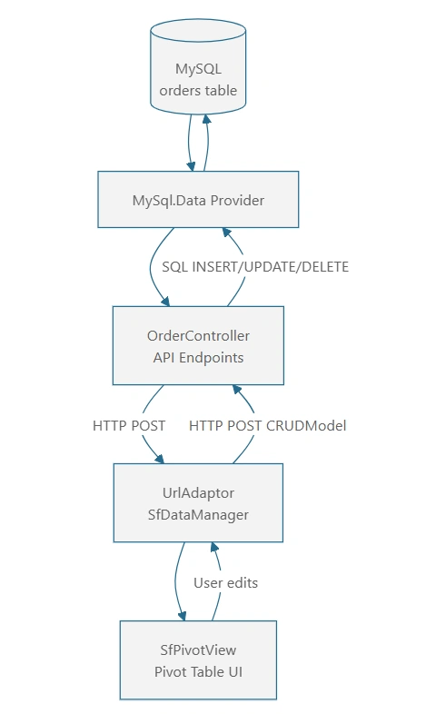

# Connecting MySQL to Blazor Pivot Table Using URL Adaptor

The [Blazor Pivot Table](https://www.syncfusion.com/blazor-components/blazor-pivot-table) can load and edit MySQL data through an ASP.NET Core API and the Syncfusion URL Adaptor. The adaptor sends read and CRUD requests to controller endpoints; the controller uses `MySql.Data` to execute parameterized SQL against MySQL.

This tutorial is a small-data sample. Its read endpoint returns every raw order because the Pivot Table's built-in engine needs the complete raw dataset to calculate accurate aggregates. For large datasets, use the [Syncfusion server-side Pivot Engine](https://blazor.syncfusion.com/documentation/pivot-table/server-side-pivot-engine) instead of applying ordinary paging to this endpoint.

## Prerequisites

The sample was tested with the following versions:

| Software or package | Version |
|---------------------|---------|
| .NET SDK | 10.0 |
| MySQL Server | 8.0 or later |
| MySQL Workbench | 8.0 or later |
| Syncfusion.Blazor.PivotTable | `{{site.blazorversion}}` |
| Syncfusion.Blazor.Themes | `{{site.blazorversion}}` |
| MySql.Data | 9.4.0 |

Use the same version for all Syncfusion packages. Later compatible patch releases can be used, but verify the Syncfusion release notes before changing versions.

You also need:

- A MySQL account allowed to create the sample database and application user.
- A valid Syncfusion license or trial key.
- An available local HTTPS development certificate. Run `dotnet dev-certs https --trust` if the certificate is not already trusted.

## MySQL Database Setup and Application Configuration

### Step 1: Create the Blazor Web App

Create an Interactive Server Blazor Web App:

```powershell
dotnet new blazor --name PivotTableMySQL --framework net10.0 --interactivity Server --all-interactive
cd PivotTableMySQL
```

The remaining commands in this guide must be run from the `PivotTableMySQL` project directory.

### Step 2: Create the MySQL Database and User

Open MySQL Workbench, connect with an administrative account, open a query tab, and run the following script. Replace `CHOOSE_A_STRONG_PASSWORD` before executing it.

```sql
CREATE DATABASE IF NOT EXISTS Orders
    CHARACTER SET utf8mb4
    COLLATE utf8mb4_0900_ai_ci;

CREATE USER IF NOT EXISTS 'pivotapp'@'localhost'
    IDENTIFIED BY 'CHOOSE_A_STRONG_PASSWORD';

ALTER USER 'pivotapp'@'localhost'
    IDENTIFIED BY 'CHOOSE_A_STRONG_PASSWORD';

USE Orders;

CREATE TABLE IF NOT EXISTS orders (
    orderid INT NOT NULL AUTO_INCREMENT,
    customername VARCHAR(100) NOT NULL,
    employeeid INT NOT NULL,
    shipcity VARCHAR(100) NULL,
    freight DECIMAL(12, 2) NULL,
    PRIMARY KEY (orderid)
);

GRANT SELECT, INSERT, UPDATE, DELETE
    ON Orders.orders
    TO 'pivotapp'@'localhost';

INSERT INTO orders (customername, employeeid, shipcity, freight)
VALUES
    ('Alice Johnson', 1, 'New York', 120.50),
    ('Bob Smith', 2, 'London', 85.20),
    ('Carol Davis', 1, 'New York', 210.75),
    ('David Brown', 3, 'Berlin', 95.00),
    ('Eve Wilson', 2, 'London', 150.25),
    ('Frank Moore', 4, 'Tokyo', 60.80),
    ('Grace Taylor', 1, 'New York', 180.40),
    ('Henry Anderson', 3, 'Berlin', 220.60),
    ('Ivy Thomas', 2, 'London', 75.10),
    ('Jack White', 4, 'Tokyo', 130.90);
```

The host portion of a MySQL account is significant. The account above is for an application running on the same computer as MySQL. Use the appropriate restricted host value when the application runs elsewhere.

Verify the setup:

```sql
SELECT * FROM Orders.orders ORDER BY orderid;
SHOW GRANTS FOR 'pivotapp'@'localhost';
```

### Step 3: Install the NuGet Packages

Install the tested package versions:

```powershell
dotnet add package Syncfusion.Blazor.PivotTable --version {{site.blazorversion}}
dotnet add package Syncfusion.Blazor.Themes --version {{site.blazorversion}}
dotnet add package MySql.Data --version 9.4.0
```

The resulting package references are:

```xml
<ItemGroup>
  <PackageReference Include="MySql.Data" Version="9.4.0" />
  <PackageReference Include="Syncfusion.Blazor.PivotTable" Version="{{site.blazorversion}}" />
  <PackageReference Include="Syncfusion.Blazor.Themes" Version="{{site.blazorversion}}" />
</ItemGroup>
```

This sample uses `System.Text.Json`, which is included with ASP.NET Core. `Newtonsoft.Json` is not required.

### Step 4: Store the Connection String and License Key

Do not put database passwords or license keys in `appsettings.json`. Initialize .NET user secrets and store both values outside the project files:

```powershell
dotnet user-secrets init
dotnet user-secrets set "ConnectionStrings:MySQL" "Server=localhost;Port=3306;Database=Orders;Uid=pivotapp;Pwd=CHOOSE_A_STRONG_PASSWORD;SslMode=Preferred;"
dotnet user-secrets set "SyncfusionLicenseKey" "YOUR_SYNCFUSION_LICENSE_KEY"
```

Replace both placeholder values. For deployment, set `ConnectionStrings__MySQL` and `SyncfusionLicenseKey` through the hosting platform's secret store.

The connection-string components used by the sample are:

| Component | Description |
|-----------|-------------|
| `Server` | MySQL host name or IP address |
| `Port` | MySQL port; the default is `3306` |
| `Database` | Default database, `Orders` |
| `Uid` | Dedicated application account, `pivotapp` |
| `Pwd` | Application-account password |
| `SslMode` | TLS behavior; use `Required` with a correctly configured production server |

### Step 5: Create the Shared Order Model

Create a `Models` folder and add `Models/Order.cs`:

```csharp
using System.ComponentModel.DataAnnotations;

namespace PivotTableMySQL.Models;

public class Order
{
    [Key]
    public int OrderID { get; set; }

    [Required]
    [StringLength(100)]
    public string CustomerName { get; set; } = string.Empty;

    [Range(1, int.MaxValue)]
    public int EmployeeID { get; set; }

    [Range(typeof(decimal), "0", "9999999999.99")]
    public decimal? Freight { get; set; }

    [StringLength(100)]
    public string? ShipCity { get; set; }
}
```

The same model is used by the controller and Razor component. The `[Key]` annotation identifies `OrderID` as the primary key when the Pivot Table creates its raw-item edit grid. Do not attempt to access `BeginDrillThroughEventArgs.GridObj`; the [current event documentation](https://blazor.syncfusion.com/documentation/pivot-table/events#begindrillthrough) states that this property is returned as null.

### Step 6: Create the API Controller

Create a `Controllers` folder and add `Controllers/OrderController.cs`:

```csharp
using System.Data.Common;
using Microsoft.AspNetCore.Mvc;
using MySql.Data.MySqlClient;
using PivotTableMySQL.Models;
using Syncfusion.Blazor;
using Syncfusion.Blazor.Data;

namespace PivotTableMySQL.Controllers;

[ApiController]
[Route("api/[controller]")]
public class OrderController : ControllerBase
{
    private readonly string connectionString;

    public OrderController(IConfiguration configuration)
    {
        connectionString = configuration.GetConnectionString("MySQL")
            ?? throw new InvalidOperationException(
                "ConnectionStrings:MySQL is not configured.");

        if (string.IsNullOrWhiteSpace(connectionString))
        {
            throw new InvalidOperationException(
                "ConnectionStrings:MySQL must not be empty.");
        }
    }

    [HttpPost]
    public async Task<ActionResult<object>> Read(
        [FromBody] DataManagerRequest request,
        CancellationToken cancellationToken)
    {
        // The built-in Pivot Table engine requires the complete raw dataset.
        // DataManagerRequest paging must not be applied to this endpoint.
        _ = request;

        List<Order> orders = [];

        const string sql = """
            SELECT orderid, customername, employeeid, shipcity, freight
            FROM orders
            ORDER BY orderid;
            """;

        await using MySqlConnection connection = new(connectionString);
        await connection.OpenAsync(cancellationToken);

        await using MySqlCommand command = new(sql, connection);
        await using DbDataReader reader =
            await command.ExecuteReaderAsync(cancellationToken);

        int orderIdOrdinal = reader.GetOrdinal("orderid");
        int customerNameOrdinal = reader.GetOrdinal("customername");
        int employeeIdOrdinal = reader.GetOrdinal("employeeid");
        int shipCityOrdinal = reader.GetOrdinal("shipcity");
        int freightOrdinal = reader.GetOrdinal("freight");

        while (await reader.ReadAsync(cancellationToken))
        {
            orders.Add(new Order
            {
                OrderID = reader.GetInt32(orderIdOrdinal),
                CustomerName = reader.GetString(customerNameOrdinal),
                EmployeeID = reader.GetInt32(employeeIdOrdinal),
                ShipCity = reader.IsDBNull(shipCityOrdinal)
                    ? null
                    : reader.GetString(shipCityOrdinal),
                Freight = reader.IsDBNull(freightOrdinal)
                    ? null
                    : reader.GetDecimal(freightOrdinal)
            });
        }

        return Ok(new
        {
            result = orders,
            count = orders.Count
        });
    }

    [HttpPost("Insert")]
    public async Task<ActionResult<Order>> Insert(
        [FromBody] CRUDModel<Order> request,
        CancellationToken cancellationToken)
    {
        if (request.Value is not Order order)
        {
            return BadRequest("The request must contain an order value.");
        }

        const string sql = """
            INSERT INTO orders
                (customername, employeeid, shipcity, freight)
            VALUES
                (@customername, @employeeid, @shipcity, @freight);
            """;

        await using MySqlConnection connection = new(connectionString);
        await connection.OpenAsync(cancellationToken);

        await using MySqlCommand command = new(sql, connection);
        command.Parameters.Add("@customername", MySqlDbType.VarChar, 100)
            .Value = order.CustomerName;
        command.Parameters.Add("@employeeid", MySqlDbType.Int32)
            .Value = order.EmployeeID;
        command.Parameters.Add("@shipcity", MySqlDbType.VarChar, 100)
            .Value = order.ShipCity ?? (object)DBNull.Value;
        command.Parameters.Add("@freight", MySqlDbType.Decimal)
            .Value = order.Freight ?? (object)DBNull.Value;

        await command.ExecuteNonQueryAsync(cancellationToken);
        order.OrderID = checked((int)command.LastInsertedId);

        return Ok(order);
    }

    [HttpPost("Update")]
    public async Task<ActionResult<Order>> Update(
        [FromBody] CRUDModel<Order> request,
        CancellationToken cancellationToken)
    {
        if (request.Value is not Order order || order.OrderID <= 0)
        {
            return BadRequest(
                "The request must contain an order with a valid OrderID.");
        }

        const string sql = """
            UPDATE orders
            SET customername = @customername,
                employeeid = @employeeid,
                shipcity = @shipcity,
                freight = @freight
            WHERE orderid = @orderid;
            """;

        await using MySqlConnection connection = new(connectionString);
        await connection.OpenAsync(cancellationToken);

        await using MySqlCommand command = new(sql, connection);
        command.Parameters.Add("@customername", MySqlDbType.VarChar, 100)
            .Value = order.CustomerName;
        command.Parameters.Add("@employeeid", MySqlDbType.Int32)
            .Value = order.EmployeeID;
        command.Parameters.Add("@shipcity", MySqlDbType.VarChar, 100)
            .Value = order.ShipCity ?? (object)DBNull.Value;
        command.Parameters.Add("@freight", MySqlDbType.Decimal)
            .Value = order.Freight ?? (object)DBNull.Value;
        command.Parameters.Add("@orderid", MySqlDbType.Int32)
            .Value = order.OrderID;

        int affectedRows =
            await command.ExecuteNonQueryAsync(cancellationToken);

        return affectedRows == 0 ? NotFound() : Ok(order);
    }

    [HttpPost("Delete")]
    public async Task<IActionResult> Delete(
        [FromBody] CRUDModel<Order> request,
        CancellationToken cancellationToken)
    {
        if (!int.TryParse(request.Key?.ToString(), out int orderId)
            || orderId <= 0)
        {
            return BadRequest("A positive numeric order key is required.");
        }

        const string sql =
            "DELETE FROM orders WHERE orderid = @orderid;";

        await using MySqlConnection connection = new(connectionString);
        await connection.OpenAsync(cancellationToken);

        await using MySqlCommand command = new(sql, connection);
        command.Parameters.Add("@orderid", MySqlDbType.Int32)
            .Value = orderId;

        int affectedRows =
            await command.ExecuteNonQueryAsync(cancellationToken);

        return affectedRows == 0
            ? NotFound()
            : Ok(new { key = orderId });
    }
}
```

The controller uses the built-in `Syncfusion.Blazor.Data.CRUDModel<T>` request type. ASP.NET Core automatically returns validation responses for invalid annotated model values. Unhandled database exceptions are converted to Problem Details responses by the middleware configured in the next step.

### Step 7: Configure Program.cs

Replace `Program.cs` with:

```csharp
using PivotTableMySQL.Components;
using Syncfusion.Blazor;
using Syncfusion.Licensing;

var builder = WebApplication.CreateBuilder(args);

string licenseKey = builder.Configuration["SyncfusionLicenseKey"]
    ?? throw new InvalidOperationException(
        "SyncfusionLicenseKey is not configured.");

SyncfusionLicenseProvider.RegisterLicense(licenseKey);

builder.Services.AddSyncfusionBlazor();
builder.Services.AddProblemDetails();
builder.Services.AddControllers();
builder.Services.AddRazorComponents()
    .AddInteractiveServerComponents();

var app = builder.Build();

app.UseExceptionHandler();

if (!app.Environment.IsDevelopment())
{
    app.UseHsts();
}

app.UseHttpsRedirection();
app.UseAntiforgery();

app.MapStaticAssets();
app.MapControllers();
app.MapRazorComponents<App>()
    .AddInteractiveServerRenderMode();

app.Run();
```

The sample API is same-origin and does not require CORS. If the API and Blazor application are deployed on different origins, configure a named CORS policy that allows only the Blazor application's origin.

### Step 8: Add Imports, Theme, and Scripts

Add these imports to `Components/_Imports.razor`:

```cshtml
@using PivotTableMySQL.Models
@using Syncfusion.Blazor
@using Syncfusion.Blazor.Data
@using Syncfusion.Blazor.PivotView
```

In the `<head>` element of `Components/App.razor`, add:

```html
<link href="_content/Syncfusion.Blazor.Themes/bootstrap5.css"
      rel="stylesheet" />
```

Before the closing `</body>` tag, add the Syncfusion script after the existing Blazor script:

```html
<script src="_framework/blazor.web.js"></script>
<script src="_content/Syncfusion.Blazor.Core/scripts/syncfusion-blazor.min.js"
        type="text/javascript"></script>
```

Do not add a second `_framework/blazor.web.js` reference if the template already contains it.

### Step 9: Configure the Pivot Table

Replace `Components/Pages/Home.razor` with:

```cshtml
@page "/"

<PageTitle>MySQL Pivot Table</PageTitle>

<SfPivotView TValue="Order"
             Width="100%"
             Height="400"
             ShowFieldList="true">
    <PivotViewDataSourceSettings TValue="Order"
                                 ExpandAll="false"
                                 EnableSorting="true">
        <SfDataManager Url="/api/Order"
                       InsertUrl="/api/Order/Insert"
                       UpdateUrl="/api/Order/Update"
                       RemoveUrl="/api/Order/Delete"
                       Adaptor="Adaptors.UrlAdaptor">
        </SfDataManager>
        <PivotViewColumns>
            <PivotViewColumn Name="@nameof(Order.EmployeeID)">
            </PivotViewColumn>
        </PivotViewColumns>
        <PivotViewRows>
            <PivotViewRow Name="@nameof(Order.CustomerName)">
            </PivotViewRow>
        </PivotViewRows>
        <PivotViewValues>
            <PivotViewValue Name="@nameof(Order.Freight)"
                            Caption="Freight">
            </PivotViewValue>
        </PivotViewValues>
    </PivotViewDataSourceSettings>
    <PivotViewGridSettings ColumnWidth="120">
    </PivotViewGridSettings>
    <PivotViewCellEditSettings AllowEditing="true"
                               AllowAdding="true"
                               AllowDeleting="true"
                               Mode="EditMode.Normal">
    </PivotViewCellEditSettings>
</SfPivotView>
```

Relative URLs keep all requests on the application's current scheme, host, and port. They work with both the HTTP and HTTPS launch profiles and avoid mixed-content and CORS failures.

The `[Key]` annotation on the shared `Order.OrderID` property supplies the raw-item grid's primary key. Current Blazor Pivot Table releases return `BeginDrillThroughEventArgs.GridObj` as null, so the component does not use a `BeginDrillThrough` handler to configure columns.

## API Contract

The URL Adaptor uses these endpoints:

| Method | Route | Request body | Success response |
|--------|-------|--------------|------------------|
| `POST` | `/api/Order` | `DataManagerRequest` | `{ "result": [...], "count": n }` |
| `POST` | `/api/Order/Insert` | `CRUDModel<Order>` | Inserted `Order`, including its generated `OrderID` |
| `POST` | `/api/Order/Update` | `CRUDModel<Order>` | Updated `Order` |
| `POST` | `/api/Order/Delete` | `CRUDModel<Order>` | `{ "key": orderId }` |

Example insert request:

```json
{
  "action": "add",
  "keyColumn": "OrderID",
  "value": {
    "orderID": 0,
    "customerName": "Karen Lee",
    "employeeID": 3,
    "shipCity": "Berlin",
    "freight": 110.00
  }
}
```

Example update request:

```json
{
  "action": "update",
  "keyColumn": "OrderID",
  "key": 1,
  "value": {
    "orderID": 1,
    "customerName": "Alice Johnson",
    "employeeID": 1,
    "shipCity": "Boston",
    "freight": 125.00
  }
}
```

Example delete request:

```json
{
  "action": "remove",
  "keyColumn": "OrderID",
  "key": 1
}
```

Property-name casing in captured requests can vary with the serializer settings used by a specific package release. ASP.NET Core's default web serializer matches property names case-insensitively.

## Run and Verify the Application

Restore, build, and run the project:

```powershell
dotnet restore
dotnet build
dotnet run
```

Open the HTTPS URL printed in the terminal. Then verify:

- The Pivot Table displays the ten sample orders.
- Adding a raw record creates a new row in `Orders.orders`.
- Editing a raw record changes the matching `orderid`.
- Deleting a raw record removes the matching `orderid`.
- The browser Network panel shows `POST` requests to the four `/api/Order` endpoints.


Verify the database after CRUD testing:

```sql
SELECT * FROM Orders.orders ORDER BY orderid;
```

The read endpoint accepts only `POST`; navigating to `/api/Order` in the browser address bar sends `GET` and correctly returns `405 Method Not Allowed`.

## Data Flow Diagram

The following image illustrates how data flows between MySQL, the ASP.NET Core controller, and the Syncfusion Blazor Pivot Table.



## Production Security

This tutorial's CRUD endpoints are intentionally unauthenticated for local development. Do not expose them publicly in this form.

Before deployment:

1. Configure an ASP.NET Core authentication scheme appropriate for the application.
2. Add `[Authorize]` to `OrderController` or an equivalent authorization policy.
3. Restrict the MySQL application account to the required database, operations, and source host.
4. Use `SslMode=Required` with a trusted MySQL server certificate.
5. Keep the connection string and license key in the deployment platform's secret store.
6. If cookie authentication protects the API, configure antiforgery tokens for adaptor write requests; otherwise use an appropriate non-cookie API authentication scheme.
7. Restrict CORS to known origins if the client and API are hosted separately.

## Large Datasets

Do not apply `Skip`, `Take`, or ordinary DataManager paging to the read action in this sample. Doing so sends only part of the raw dataset to the built-in Pivot Table engine and produces incomplete aggregates.

For large datasets, follow the [server-side Pivot Engine guide](https://blazor.syncfusion.com/documentation/pivot-table/server-side-pivot-engine). The server-side engine performs aggregation, filtering, grouping, and sorting on the server and sends only the required pivot results to the browser.

## Troubleshooting

| Symptom | Resolution |
|---------|------------|
| `ConnectionStrings:MySQL is not configured` | Run the `dotnet user-secrets set "ConnectionStrings:MySQL" "..."` command from the project directory or configure `ConnectionStrings__MySQL`. |
| `SyncfusionLicenseKey is not configured` | Store a valid key with user secrets or the deployment secret store. |
| `Unable to connect to any of the specified MySQL hosts` | Confirm that MySQL is running and verify `Server`, `Port`, TLS settings, and firewall access. |
| `Access denied for user 'pivotapp'` | Verify the password, account host, and `SHOW GRANTS FOR 'pivotapp'@'localhost'`. |
| `Table 'Orders.orders' doesn't exist` | Run the database script and preserve the lowercase `orders` table name, especially on Linux. |
| `405 Method Not Allowed` for `/api/Order` | Test through the Pivot Table or send a `POST` request; an address-bar request is `GET`. |
| CRUD returns `400 Bad Request` | Inspect the Problem Details response and confirm required fields, field lengths, numeric ranges, and request shape. |
| Update or delete returns `404 Not Found` | Confirm that the request contains an existing positive `OrderID` key. |
| Editing affects the wrong row | Confirm that the shared model includes `[Key]` on `OrderID` and that the client and controller both use that model. |
| Browser reports mixed content or CORS | Keep the relative `/api/Order` URLs for same-origin hosting; otherwise configure HTTPS and a restricted CORS policy. |
| Authentication plugin error | Keep MySQL's `caching_sha2_password` authentication and use the documented `MySql.Data` version or a later compatible release; do not switch to deprecated `mysql_native_password`. |
| Pivot values are incomplete for a large dataset | Remove ordinary endpoint paging and migrate to the Syncfusion server-side Pivot Engine. |

## Complete Sample Repository

A complete, working sample implementation is available in the [GitHub repository](https://github.com/SyncfusionExamples/syncfusion-blazor-pivot-table-mysql-database-binding-sample).

## Summary

The application now:

1. Connects to MySQL with a dedicated least-privilege account.
2. Keeps credentials and the Syncfusion license key outside source control.
3. Shares one annotated `Order` model between the controller and Pivot Table.
4. Uses asynchronous, parameterized MySQL commands.
5. Exposes documented URL Adaptor read and CRUD endpoints.
6. Uses relative same-origin URLs and standardized Problem Details errors.
7. Identifies the supported server-side approach for large datasets.
