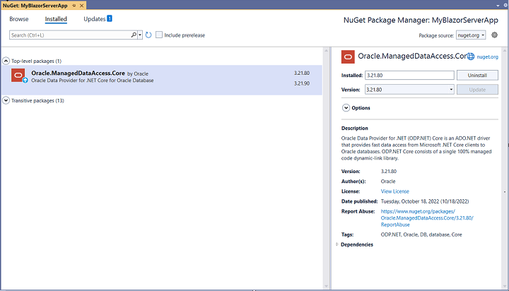
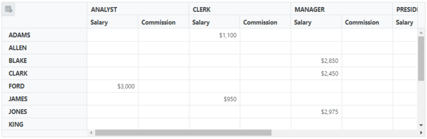
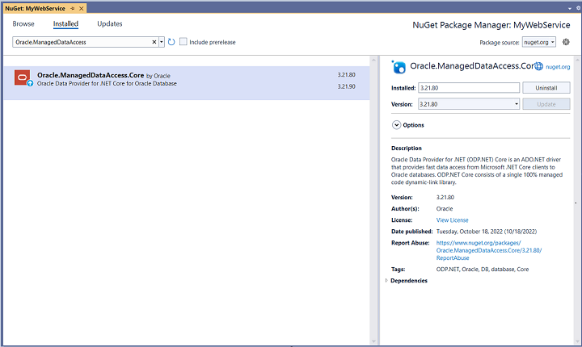
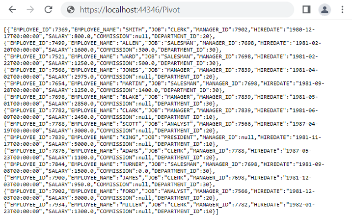

# Oracle Data Binding

This guide explains how to connect an Oracle database to the [Blazor Pivot Table](https://www.syncfusion.com/blazor-components/blazor-pivot-table) using the [Oracle.ManagedDataAccess](https://www.nuget.org/packages/Oracle.ManagedDataAccess) library. It covers two methods: directly retrieving and binding data to the Pivot Table and using a Web API service to fetch and display Oracle data.

## Connecting an Oracle database to a Syncfusion<sup style="font-size:70%">&reg;</sup> Blazor Pivot Table

This section describes how to connect the [Blazor Pivot Table](https://www.syncfusion.com/blazor-components/blazor-pivot-table) to an Oracle database by directly retrieving data using the [Oracle.ManagedDataAccess](https://www.nuget.org/packages/Oracle.ManagedDataAccess) library.

### Step 1: Set up a Blazor Pivot Table
1. Create a [Blazor Pivot Table](https://www.syncfusion.com/blazor-components/blazor-pivot-table) by following the [Getting Started](../getting-started) guide.

### Step 2: Install the Oracle.ManagedDataAccess NuGet package
1. Open the **NuGet Package Manager** in your project solution and search for [Oracle.ManagedDataAccess.Core](https://www.nuget.org/packages/Oracle.ManagedDataAccess.Core/).
2. Install the [Oracle.ManagedDataAccess.Core](https://www.nuget.org/packages/Oracle.ManagedDataAccess.Core/) package to add Oracle support.



### Step 3: Connect to the Oracle database
In the **Index.razor** file, under the `OnInitialized` method, use the [Oracle.ManagedDataAccess](https://www.nuget.org/packages/Oracle.ManagedDataAccess) library to connect to an Oracle database and retrieve data for the Pivot Table.

1. **Establish connection**: Use **OracleConnection** with a valid connection string, for example, `Data Source=localhost;User Id=myuser;Password=mypassword;`, to connect to the Oracle database.
2. **Query and fetch data**: Execute a SQL query, such as `SELECT * FROM EMPLOYEES`, using **OracleCommand** to retrieve data for the Pivot Table.
3. **Structure the data**: Use **OracleDataAdapter**'s **Fill** method to populate the query results into a **DataTable**, which is then converted to a list for binding to the Pivot Table.

### Step 4: Bind data to the Pivot Table
1. Assign the retrieved list to the [DataSource](https://help.syncfusion.com/cr/blazor/Syncfusion.Blazor.PivotView.PivotViewDataSourceSettings-1.html#Syncfusion_Blazor_PivotView_PivotViewDataSourceSettings_1_DataSource) property of the [PivotViewDataSourceSettings](https://help.syncfusion.com/cr/blazor/Syncfusion.Blazor.PivotView.DataSourceSettingsModel-1.html).
2. Configure the Pivot Table by defining fields in the [PivotViewColumns](https://help.syncfusion.com/cr/blazor/Syncfusion.Blazor.PivotView.PivotViewDataSourceSettings-1.html#Syncfusion_Blazor_PivotView_PivotViewDataSourceSettings_1_Columns), [PivotViewRows](https://help.syncfusion.com/cr/blazor/Syncfusion.Blazor.PivotView.PivotViewDataSourceSettings-1.html#Syncfusion_Blazor_PivotView_PivotViewDataSourceSettings_1_Rows), [PivotViewValues](https://help.syncfusion.com/cr/blazor/Syncfusion.Blazor.PivotView.PivotViewDataSourceSettings-1.html#Syncfusion_Blazor_PivotView_PivotViewDataSourceSettings_1_Values), and [PivotViewFormatSettings](https://help.syncfusion.com/cr/blazor/Syncfusion.Blazor.PivotView.PivotViewDataSourceSettings-1.html#Syncfusion_Blazor_PivotView_PivotViewDataSourceSettings_1_FormatSettings) to organize and format the data.

```cshtml
@using System.Data
@using Oracle.ManagedDataAccess.Client
@using Syncfusion.Blazor.PivotView

<SfPivotView TValue="EmployeeDetails" Width="1000" Height="300" ShowFieldList="true">
    <PivotViewDataSourceSettings TValue="EmployeeDetails" DataSource="@dataSource" ExpandAll=false EnableSorting=true>
        <PivotViewColumns>
            <PivotViewColumn Name="JOB" Caption="Designation"></PivotViewColumn>
        </PivotViewColumns>
        <PivotViewRows>
            <PivotViewRow Name="EMPLOYEE_NAME" Caption="Employee Name"></PivotViewRow>
        </PivotViewRows>
        <PivotViewValues>
            <PivotViewValue Name="SALARY" Caption="Salary"></PivotViewValue>
            <PivotViewValue Name="COMMISSION" Caption="Commission"></PivotViewValue>
        </PivotViewValues>
        <PivotViewFormatSettings>
            <PivotViewFormatSetting Name="SALARY" Format="C0"></PivotViewFormatSetting>
            <PivotViewFormatSetting Name="COMMISSION" Format="C0"></PivotViewFormatSetting>
        </PivotViewFormatSettings>
    </PivotViewDataSourceSettings>
    <PivotViewGridSettings ColumnWidth="120"></PivotViewGridSettings>
</SfPivotView>

@code {
    private List<EmployeeDetails> dataSource { get; set; }

    protected override void OnInitialized()
    {
        List<EmployeeDetails> employeeData = new List<EmployeeDetails>();
        // Replace with your own connection string.
        string connectionString = "<Enter your valid connection string here>";
        OracleConnection connection = new OracleConnection(connectionString);
        connection.Open();
        OracleCommand command = new OracleCommand("SELECT * FROM EMPLOYEES", connection);
        using (OracleDataReader reader = command.ExecuteReader())
        {
            while (reader.Read())
            {
                employeeData.Add(new EmployeeDetails()
                {
                    DEPARTMENT_ID = Convert.ToInt32(reader["DEPARTMENT_ID"]),
                    EMPLOYEE_ID = Convert.ToInt32(reader["EMPLOYEE_ID"]),
                    EMPLOYEE_NAME = reader["EMPLOYEE_NAME"].ToString(),
                    JOB = reader["JOB"].ToString(),
                    MANAGER_ID = Convert.IsDBNull(reader["MANAGER_ID"]) ? null : Convert.ToInt32(reader["MANAGER_ID"]),
                    SALARY = Convert.ToSingle(reader["SALARY"]),
                    COMMISSION = Convert.IsDBNull(reader["COMMISSION"]) ? null : Convert.ToSingle(reader["COMMISSION"]),
                    HIREDATE = Convert.ToDateTime(reader["HIREDATE"])
                });
            }
        }
        connection.Close();   
        this.dataSource = employeeData;
    }

    public class EmployeeDetails
    {
        public int EMPLOYEE_ID { get; set; }
        public string EMPLOYEE_NAME { get; set; }
        public string JOB { get; set; }
        public int? MANAGER_ID { get; set; }
        public Single SALARY { get; set; }
        public Single? COMMISSION { get; set; }
        public int DEPARTMENT_ID { get; set; }
        public DateTime HIREDATE { get; set; }
    }
}
```

### Step 5: Run and verify the Pivot Table
1. Run the Blazor application.
2. The Pivot Table will display the Oracle data, organized according to the defined configuration.
3. The resulting Pivot Table will look like this:



## Connecting an Oracle database to a Syncfusion<sup style="font-size:70%">&reg;</sup> Blazor Pivot Table via Web API service

This section explains how to create a Web API service to fetch data from an Oracle database and connect it to the Blazor Pivot Table.

### Create a Web API service to fetch Oracle data

Follow these steps to set up a Web API service that retrieves Oracle data for the Pivot Table.

#### Step 1: Create an ASP.NET Core Web application
1. Open Visual Studio and create a new **ASP.NET Core Web App** project named **MyWebService**.
2. Refer to the [Microsoft documentation](https://learn.microsoft.com/en-us/visualstudio/get-started/csharp/tutorial-aspnet-core?view=vs-2022) for detailed setup instructions.


#### Step 2: Install the Oracle NuGet package
1. Install the [Oracle.ManagedDataAccess.Core](https://www.nuget.org/packages/Oracle.ManagedDataAccess.Core/) package using the **NuGet Package Manager** to enable Oracle connectivity.



#### Step 3: Create a Web API controller
1. In the **Controllers** folder, create a new Web API controller named **PivotController.cs**.
2. This controller manages data communication between the Oracle database and the Pivot Table.

#### Step 4: Connect to Oracle and retrieve data
In the **PivotController.cs** file, use the [Oracle.ManagedDataAccess](https://www.nuget.org/packages/Oracle.ManagedDataAccess) library to connect to an Oracle database and fetch data for the Pivot Table.

1. **Establish connection**: Use **OracleConnection** with a valid connection string to access the Oracle database.
2. **Fetch data**: Run a SQL query, such as `SELECT * FROM EMPLOYEES`, using **OracleCommand** to retrieve data.
3. **Prepare data**: Use **OracleDataAdapter**'s **Fill** method to store the query results in a **DataTable** for JSON serialization.

```csharp
using Microsoft.AspNetCore.Mvc;
using Newtonsoft.Json;
using Oracle.ManagedDataAccess.Client;
using System.Data;

namespace MyWebService.Controllers
{
    [ApiController]
    [Route("[controller]")]
    public class PivotController : ControllerBase
    {
        private static DataTable FetchOracleResult()
        {
            // Replace with your own connection string.
            string connectionString = "<Enter your valid connection string here>";
            OracleConnection oracleConnection = new OracleConnection(connectionString);
            oracleConnection.Open();
            OracleCommand command = new OracleCommand("SELECT * FROM EMPLOYEES", oracleConnection);
            OracleDataAdapter dataAdapter = new OracleDataAdapter(command);
            DataTable dataTable = new DataTable();
            dataAdapter.Fill(dataTable);
            oracleConnection.Close();
            return dataTable;
        }
    }
}
```

#### Step 5: Serialize data to JSON
1. In the **PivotController.cs** file, create a **Get** method that calls **FetchOracleResult** to retrieve Oracle data.
2. Use **JsonConvert.SerializeObject** from the [Newtonsoft.Json](https://www.nuget.org/packages/Newtonsoft.Json) library to serialize the **DataTable** into JSON format.

> Ensure the **Newtonsoft.Json** NuGet package is installed in your project.

```csharp
using Microsoft.AspNetCore.Mvc;
using Newtonsoft.Json;
using Oracle.ManagedDataAccess.Client;
using System.Data;

namespace MyWebService.Controllers
{
    [ApiController]
    [Route("[controller]")]
    public class PivotController : ControllerBase
    {
        [HttpGet(Name = "GetOracleResult")]
        public object Get()
        {
            return JsonConvert.SerializeObject(FetchOracleResult());
        }

        private static DataTable FetchOracleResult()
        {
            // Replace with your own connection string.
            string connectionString = "<Enter your valid connection string here>";
            OracleConnection oracleConnection = new OracleConnection(connectionString);
            oracleConnection.Open();
            OracleCommand command = new OracleCommand("SELECT * FROM EMPLOYEES", oracleConnection);
            OracleDataAdapter dataAdapter = new OracleDataAdapter(command);
            DataTable dataTable = new DataTable();
            dataAdapter.Fill(dataTable);
            oracleConnection.Close();
            return dataTable;
        }
    }
}
```

#### Step 6: Run the Web API service
1. Build and run the application.
2. The application will be hosted at `https://localhost:44346/` (the port number may vary).

#### Step 7: Verify the JSON data
1. Access the Web API endpoint at `https://localhost:44346/Pivot` to view the JSON data retrieved from Oracle.
2. The browser will display the JSON data, as shown below.



### Connecting the Pivot Table to a Oracle database using the Web API service

This section explains how to connect the Blazor Pivot Table to Oracle data retrieved via the Web API service.

#### Step 1: Set up a Blazor Pivot Table
1. Create a Blazor Pivot Table by following the [Getting Started](../getting-started) guide.

#### Step 2: Configure the Web API URL
1. In the **Index.razor** file, map the Web API URL (`https://localhost:44346/Pivot`) to the Pivot Table using the [Url](https://help.syncfusion.com/cr/blazor/Syncfusion.Blazor.PivotView.PivotViewDataSourceSettings-1.html#Syncfusion_Blazor_PivotView_PivotViewDataSourceSettings_1_Url) property of [PivotViewDataSourceSettings](https://help.syncfusion.com/cr/blazor/Syncfusion.Blazor.PivotView.DataSourceSettingsModel-1.html).
2. The [Url](https://help.syncfusion.com/cr/blazor/Syncfusion.Blazor.PivotView.PivotViewDataSourceSettings-1.html#Syncfusion_Blazor_PivotView_PivotViewDataSourceSettings_1_Url) property deserializes Oracle data into instances of your model data class (e.g., TValue="EmployeeDetails") for binding to the Pivot Table.

#### Step 3: Define the Pivot Table report
1. Configure the Pivot Table by defining fields in the [PivotViewColumns](https://help.syncfusion.com/cr/blazor/Syncfusion.Blazor.PivotView.PivotViewDataSourceSettings-1.html#Syncfusion_Blazor_PivotView_PivotViewDataSourceSettings_1_Columns), [PivotViewRows](https://help.syncfusion.com/cr/blazor/Syncfusion.Blazor.PivotView.PivotViewDataSourceSettings-1.html#Syncfusion_Blazor_PivotView_PivotViewDataSourceSettings_1_Rows), [PivotViewValues](https://help.syncfusion.com/cr/blazor/Syncfusion.Blazor.PivotView.PivotViewDataSourceSettings-1.html#Syncfusion_Blazor_PivotView_PivotViewDataSourceSettings_1_Values), and [PivotViewFormatSettings](https://help.syncfusion.com/cr/blazor/Syncfusion.Blazor.PivotView.PivotViewDataSourceSettings-1.html#Syncfusion_Blazor_PivotView_PivotViewDataSourceSettings_1_FormatSettings) properties.
2. Enable the field list by setting [ShowFieldList](https://help.syncfusion.com/cr/blazor/Syncfusion.Blazor.PivotView.SfPivotView-1.html#Syncfusion_Blazor_PivotView_SfPivotView_1_ShowFieldList) to **true** for interactive field management.

```cshtml
@using Syncfusion.Blazor.PivotView

<SfPivotView TValue="EmployeeDetails" Width="1000" Height="300" ShowFieldList="true">
    <PivotViewDataSourceSettings TValue="EmployeeDetails" Url="https://localhost:44346/Pivot" ExpandAll=false EnableSorting=true>
        <PivotViewColumns>
            <PivotViewColumn Name="JOB" Caption="Designation"></PivotViewColumn>
        </PivotViewColumns>
        <PivotViewRows>
            <PivotViewRow Name="EMPLOYEE_NAME" Caption="Employee Name"></PivotViewRow>
        </PivotViewRows>
        <PivotViewValues>
            <PivotViewValue Name="SALARY" Caption="Salary"></PivotViewValue>
            <PivotViewValue Name="COMMISSION" Caption="Commission"></PivotViewValue>
        </PivotViewValues>
        <PivotViewFormatSettings>
            <PivotViewFormatSetting Name="SALARY" Format="C0"></PivotViewFormatSetting>
            <PivotViewFormatSetting Name="COMMISSION" Format="C0"></PivotViewFormatSetting>
        </PivotViewFormatSettings>
    </PivotViewDataSourceSettings>
    <PivotViewGridSettings ColumnWidth="120"></PivotViewGridSettings>
</SfPivotView>

@code {
    public class EmployeeDetails
    {
        public int EMPLOYEE_ID { get; set; }
        public string EMPLOYEE_NAME { get; set; }
        public string JOB { get; set; }
        public int? MANAGER_ID { get; set; }
        public Single SALARY { get; set; }
        public Single? COMMISSION { get; set; }
        public int DEPARTMENT_ID { get; set; }
        public DateTime HIREDATE { get; set; }
    }
}
```

#### Step 4: Run and verify the Pivot Table
1. Run the Blazor application.
2. The Pivot Table will display the Oracle data fetched via the Web API, structured according to the defined configuration.
3. The resulting Pivot Table will look like this:


### Additional resources
Explore a complete example of the Blazor Pivot Table integrated with an ASP.NET Core Web application to fetch data from an Oracle database in this [GitHub repository](https://github.com/SyncfusionExamples/how-to-bind-Oracle-database-to-pivot-table/tree/master/Blazor).