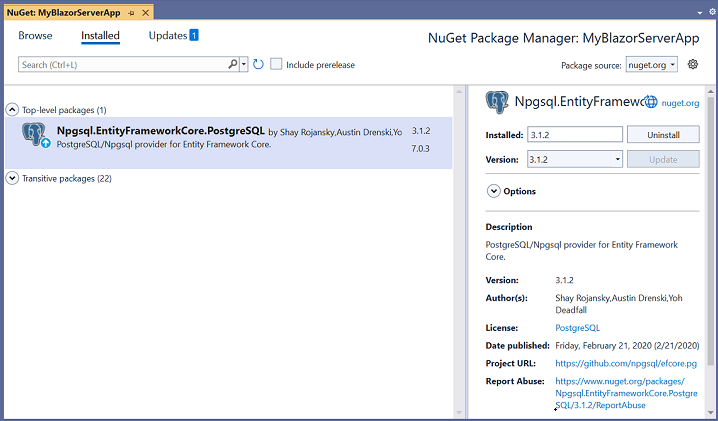
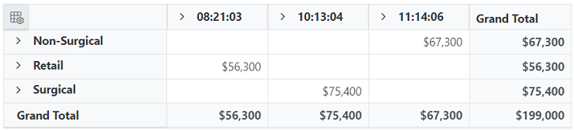
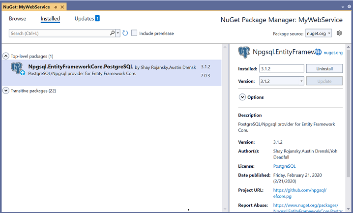
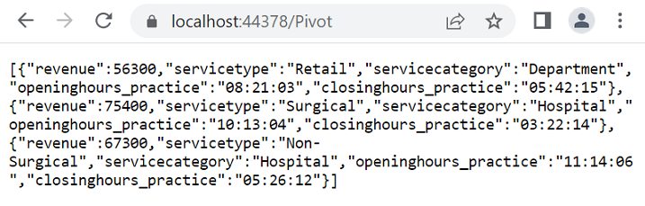
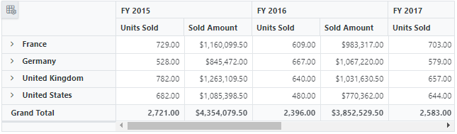

# PostgreSQL Data Binding

This guide explains how to connect a PostgreSQL database to the [Blazor Pivot Table](https://www.syncfusion.com/blazor-components/blazor-pivot-table) using the [Npgsql.EntityFrameworkCore.PostgreSQL](https://www.nuget.org/packages/Npgsql.EntityFrameworkCore.PostgreSQL) library. It covers two methods: directly retrieving and binding data to the Pivot Table and using a Web API service to fetch and display PostgreSQL data.

## Connecting a PostgreSQL to a Syncfusion<sup style="font-size:70%">&reg;</sup> Blazor Pivot Table

This section explains how to connect a PostgreSQL database to the Blazor Pivot Table by directly retrieving data using the [Npgsql.EntityFrameworkCore.PostgreSQL](https://www.nuget.org/packages/Npgsql.EntityFrameworkCore.PostgreSQL) library.

### Step 1: Set Up a Blazor Pivot Table
1. Create a [Blazor Pivot Table](https://www.syncfusion.com/blazor-components/blazor-pivot-table) by following the [Getting Started](../getting-started) guide.

### Step 2: Install the Npgsql.EntityFrameworkCore.PostgreSQL NuGet Package
1. Open the **NuGet Package Manager** in your project solution and search for **Npgsql.EntityFrameworkCore.PostgreSQL**.
2. Install the **Npgsql.EntityFrameworkCore.PostgreSQL** package to add PostgreSQL support.



### Step 3: Connect to the PostgreSQL Database
In the **Index.razor** file, under the `OnInitialized` method, use the [Npgsql.EntityFrameworkCore.PostgreSQL](https://www.nuget.org/packages/Npgsql.EntityFrameworkCore.PostgreSQL) library to connect to the PostgreSQL database and retrieve data.

1. **Establish Connection**: Use `NpgsqlConnection` with a valid connection string (e.g., `Server=localhost;Database=mydb;User Id=myuser;Password=mypassword;`) to connect to the PostgreSQL database.
2. **Query and Fetch Data**: Execute a SQL query, such as `SELECT * FROM apxtimestamp`, using `NpgsqlCommand` to retrieve data for the Pivot Table.
3. **Structure Data**: Use `NpgsqlDataReader` to read the query results and populate them into a list for binding to the Pivot Table.

### Step 4: Bind Data to the Pivot Table
1. Assign the retrieved list to the [DataSource](https://help.syncfusion.com/cr/blazor/Syncfusion.Blazor.PivotView.PivotViewDataSourceSettings-1.html#Syncfusion_Blazor_PivotView_PivotViewDataSourceSettings_1_DataSource) property of the [PivotViewDataSourceSettings](https://help.syncfusion.com/cr/blazor/Syncfusion.Blazor.PivotView.DataSourceSettingsModel-1.html).
2. Configure the Pivot Table by defining fields in the [PivotViewColumns](https://help.syncfusion.com/cr/blazor/Syncfusion.Blazor.PivotView.PivotViewDataSourceSettings-1.html#Syncfusion_Blazor_PivotView_PivotViewDataSourceSettings_1_Columns), [PivotViewRows](https://help.syncfusion.com/cr/blazor/Syncfusion.Blazor.PivotView.PivotViewDataSourceSettings-1.html#Syncfusion_Blazor_PivotView_PivotViewDataSourceSettings_1_Rows), [PivotViewValues](https://help.syncfusion.com/cr/blazor/Syncfusion.Blazor.PivotView.PivotViewDataSourceSettings-1.html#Syncfusion_Blazor_PivotView_PivotViewDataSourceSettings_1_Values), and [PivotViewFormatSettings](https://help.syncfusion.com/cr/blazor/Syncfusion.Blazor.PivotView.PivotViewDataSourceSettings-1.html#Syncfusion_Blazor_PivotView_PivotViewDataSourceSettings_1_FormatSettings) to organize and format the data.

```cshtml
@using System.Data
@using Npgsql
@using Syncfusion.Blazor.PivotView

<SfPivotView TValue="PostgreSQLService" Width="1000" Height="300" ShowFieldList="true">
    <PivotViewDataSourceSettings TValue="PostgreSQLService" DataSource="@dataSource" ExpandAll=false EnableSorting=true>
        <PivotViewColumns>
            <PivotViewColumn Name="openinghours_practice" Caption="Openinghours Practice"></PivotViewColumn>
            <PivotViewColumn Name="closinghours_practice" Caption="Closinghours Practice"></PivotViewColumn>
        </PivotViewColumns>
        <PivotViewRows>
            <PivotViewRow Name="servicetype" Caption="Service Type"></PivotViewRow>
            <PivotViewRow Name="servicecategory" Caption="Service Category"></PivotViewRow>
        </PivotViewRows>
        <PivotViewValues>
            <PivotViewValue Name="revenue" Caption="Revenue"></PivotViewValue>
        </PivotViewValues>
        <PivotViewFormatSettings>
            <PivotViewFormatSetting Name="revenue" Format="C0"></PivotViewFormatSetting>
        </PivotViewFormatSettings>
    </PivotViewDataSourceSettings>
    <PivotViewGridSettings ColumnWidth="120"></PivotViewGridSettings>
</SfPivotView>

@code {
    private List<PostgreSQLService> dataSource { get; set; }

    protected override void OnInitialized()
    {
        List<PostgreSQLService> postGreSqlData = new List<PostgreSQLService>();
        // Replace with your own connection string.
        NpgsqlConnection connection = new NpgsqlConnection("<Enter your valid connection string here>");
        connection.Open();
        NpgsqlCommand cmd = new NpgsqlCommand("SELECT * FROM apxtimestamp", connection);
        using (NpgsqlDataReader reader = cmd.ExecuteReader())
        {
            while (reader.Read())
            {
                postGreSqlData.Add(new PostgreSQLService()
                {
                    openinghours_practice = (TimeSpan)reader["openinghours_practice"],
                    closinghours_practice = (TimeSpan)reader["closinghours_practice"],
                    servicetype = reader["servicetype"].ToString(),
                    servicecategory = reader["servicecategory"].ToString(),
                    revenue = Convert.ToInt32(reader["revenue"])
                });
            }
        }
        connection.Close();   
        this.dataSource = postGreSqlData;
    }

    public class PostgreSQLService
    {
        public TimeSpan openinghours_practice { get; set; }
        public TimeSpan closinghours_practice { get; set; }
        public string servicetype { get; set; }
        public string servicecategory { get; set; }
        public int revenue { get; set; }
    }
}
```

### Step 5: Run and Verify the Pivot Table
1. Run the Blazor application.
2. The Pivot Table will display the PostgreSQL data, organized based on the defined configuration.
3. The resulting Pivot Table will look like this:



## Connecting a PostgreSQL Database to a Syncfusion<sup style="font-size:70%">&reg;</sup> Blazor Pivot Table via Web API Service

This section explains how to create a Web API service to fetch data from a PostgreSQL database and connect it to the Blazor Pivot Table.

### Create a Web API service to fetch PostgreSQL data

Follow these steps to set up a Web API service that retrieves PostgreSQL data for the Pivot Table.

#### Step 1: Create an ASP.NET Core Web Application
1. Open Visual Studio and create a new ASP.NET Core Web App project named **MyWebService**.
2. Refer to the [Microsoft documentation](https://learn.microsoft.com/en-us/visualstudio/get-started/csharp/tutorial-aspnet-core?view=vs-2022) for detailed setup instructions.


#### Step 2: Install the Npgsql NuGet Package
1. Install the [Npgsql.EntityFrameworkCore.PostgreSQL](https://www.nuget.org/packages/Npgsql.EntityFrameworkCore.PostgreSQL) package using the **NuGet Package Manager** to enable PostgreSQL connectivity.



#### Step 3: Create a Web API Controller
1. In the **Controllers** folder, create a new Web API controller named **PivotController.cs**.
2. This controller handles data communication between the PostgreSQL database and the Pivot Table.

#### Step 4: Connect to PostgreSQL and Retrieve Data
In the **PivotController.cs** file, use the [Npgsql.EntityFrameworkCore.PostgreSQL](https://www.nuget.org/packages/Npgsql.EntityFrameworkCore.PostgreSQL) library to connect to the PostgreSQL database and fetch data.

1. **Establish Connection**: Use `NpgsqlConnection` with a valid connection string to access the PostgreSQL database.
2. **Fetch Data**: Execute a SQL query, such as `SELECT * FROM apxtimestamp`, using `NpgsqlCommand` to retrieve data.
3. **Prepare Data**: Use `NpgsqlDataAdapter`’s `Fill` method to store the query results in a `DataTable` for JSON serialization.

```csharp
using Microsoft.AspNetCore.Mvc;
using Newtonsoft.Json;
using System.Data;
using Npgsql;

namespace MyWebService.Controllers
{
    [ApiController]
    [Route("[controller]")]
    public class PivotController : ControllerBase
    {
        private dynamic GetPostgreSQLResult()
        {
            // Replace with your own connection string.
            NpgsqlConnection connection = new NpgsqlConnection("<Enter your valid connection string here>");
            connection.Open();
            NpgsqlCommand command = new NpgsqlCommand("SELECT * FROM apxtimestamp", connection);
            NpgsqlDataAdapter dataAdapter = new NpgsqlDataAdapter(command);
            DataTable dataTable = new DataTable();
            dataAdapter.Fill(dataTable);
            connection.Close();
            return dataTable;
        }
    }
}
```

#### Step 5: Serialize Data to JSON
1. In the **PivotController.cs** file, create a `Get` method that calls `GetPostgreSQLResult` to retrieve PostgreSQL data.
2. Use `JsonConvert.SerializeObject` from the [Newtonsoft.Json](https://www.nuget.org/packages/Newtonsoft.Json) library to serialize the `DataTable` into JSON format.

> Ensure the **Newtonsoft.Json** NuGet package is installed in your project.

```csharp
using Microsoft.AspNetCore.Mvc;
using Newtonsoft.Json;
using System.Data;
using Npgsql;

namespace MyWebService.Controllers
{
    [ApiController]
    [Route("[controller]")]
    public class PivotController : ControllerBase
    {
        [HttpGet(Name = "GetPostgreSQLResult")]
        public object Get()
        {
            return JsonConvert.SerializeObject(GetPostgreSQLResult());
        }

        private dynamic GetPostgreSQLResult()
        {
            // Replace with your own connection string.
            NpgsqlConnection connection = new NpgsqlConnection("<Enter your valid connection string here>");
            connection.Open();
            NpgsqlCommand command = new NpgsqlCommand("SELECT * FROM apxtimestamp", connection);
            NpgsqlDataAdapter dataAdapter = new NpgsqlDataAdapter(command);
            DataTable dataTable = new DataTable();
            dataAdapter.Fill(dataTable);
            connection.Close();
            return dataTable;
        }
    }
}
```

#### Step 6: Run the Web API Service
1. Build and run the application.
2. The application will be hosted at `https://localhost:44378/` (the port number may vary).

#### Step 7: Verify the JSON Data
1. Access the Web API endpoint at `https://localhost:44378/Pivot` to view the JSON data retrieved from PostgreSQL.
2. The browser will display the JSON data, as shown below.



### Connecting the Pivot Table to a PostgreSQL Database Using the Web API Service

This section explains how to connect the Blazor Pivot Table to PostgreSQL data retrieved via the Web API service.

#### Step 1: Set Up a Blazor Pivot Table
1. Create a Blazor Pivot Table by following the [Getting Started](../getting-started) guide.

#### Step 2: Configure the Web API URL
1. In the **Index.razor** file, map the Web API URL (`https://localhost:44378/Pivot`) to the Pivot Table using the [Url](https://help.syncfusion.com/cr/blazor/Syncfusion.Blazor.PivotView.PivotViewDataSourceSettings-1.html#Syncfusion_Blazor_PivotView_PivotViewDataSourceSettings_1_Url) property of [PivotViewDataSourceSettings](https://help.syncfusion.com/cr/blazor/Syncfusion.Blazor.PivotView.DataSourceSettingsModel-1.html).
2. The [Url](https://help.syncfusion.com/cr/blazor/Syncfusion.Blazor.PivotView.PivotViewDataSourceSettings-1.html#Syncfusion_Blazor_PivotView_PivotViewDataSourceSettings_1_Url) property deserializes PostgreSQL data into instances of your model data class (e.g., `TValue="PostgreSQLService"`) for binding to the Pivot Table.

#### Step 3: Define the Pivot Table Report
1. Configure the Pivot Table by defining fields in the [PivotViewColumns](https://help.syncfusion.com/cr/blazor/Syncfusion.Blazor.PivotView.PivotViewDataSourceSettings-1.html#Syncfusion_Blazor_PivotView_PivotViewDataSourceSettings_1_Columns), [PivotViewRows](https://help.syncfusion.com/cr/blazor/Syncfusion.Blazor.PivotView.PivotViewDataSourceSettings-1.html#Syncfusion_Blazor_PivotView_PivotViewDataSourceSettings_1_Rows), [PivotViewValues](https://help.syncfusion.com/cr/blazor/Syncfusion.Blazor.PivotView.PivotViewDataSourceSettings-1.html#Syncfusion_Blazor_PivotView_PivotViewDataSourceSettings_1_Values), and [PivotViewFormatSettings](https://help.syncfusion.com/cr/blazor/Syncfusion.Blazor.PivotView.PivotViewDataSourceSettings-1.html#Syncfusion_Blazor_PivotView_PivotViewDataSourceSettings_1_FormatSettings) properties.
2. Enable the field list by setting [ShowFieldList](https://help.syncfusion.com/cr/blazor/Syncfusion.Blazor.PivotView.SfPivotView-1.html#Syncfusion_Blazor_PivotView_SfPivotView_1_ShowFieldList) to `true` for interactive field management.

```cshtml
@using Syncfusion.Blazor.PivotView

<SfPivotView TValue="PostgreSQLService" Width="1000" Height="300" ShowFieldList="true">
    <PivotViewDataSourceSettings TValue="PostgreSQLService" Url="https://localhost:44378/Pivot" ExpandAll=false EnableSorting=true>
        <PivotViewColumns>
            <PivotViewColumn Name="openinghours_practice" Caption="Openinghours Practice"></PivotViewColumn>
            <PivotViewColumn Name="closinghours_practice" Caption="Closinghours Practice"></PivotViewColumn>
        </PivotViewColumns>
        <PivotViewRows>
            <PivotViewRow Name="servicetype" Caption="Service Type"></PivotViewRow>
            <PivotViewRow Name="servicecategory" Caption="Service Category"></PivotViewRow>
        </PivotViewRows>
        <PivotViewValues>
            <PivotViewValue Name="revenue" Caption="Revenue"></PivotViewValue>
        </PivotViewValues>
        <PivotViewFormatSettings>
            <PivotViewFormatSetting Name="revenue" Format="C0"></PivotViewFormatSetting>
        </PivotViewFormatSettings>
    </PivotViewDataSourceSettings>
    <PivotViewGridSettings ColumnWidth="120"></PivotViewGridSettings>
</SfPivotView>

@code {
    public class PostgreSQLService
    {
        public TimeSpan openinghours_practice { get; set; }
        public TimeSpan closinghours_practice { get; set; }
        public string servicetype { get; set; }
        public string servicecategory { get; set; }
        public int revenue { get; set; }
    }
}
```

#### Step 4: Run and Verify the Pivot Table
1. Run the Blazor application.
2. The Pivot Table will display the PostgreSQL data fetched via the Web API, structured according to the defined configuration.
3. The resulting Pivot Table will look like this:



### Additional Resources
Explore a complete example of the Blazor Pivot Table integrated with an ASP.NET Core Web application to fetch data from a PostgreSQL database in this [GitHub repository](https://github.com/SyncfusionExamples/how-to-bind-PostgreSQL-database-to-pivot-table/tree/master/Blazor).