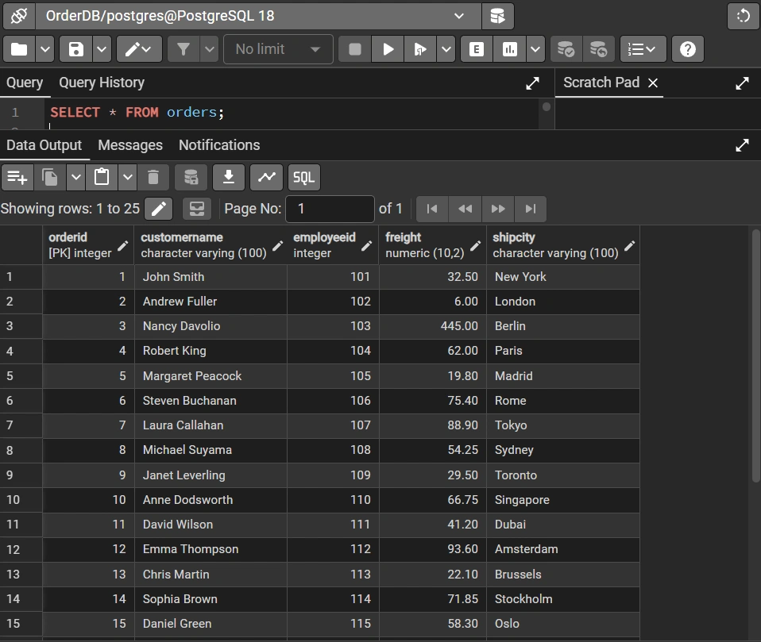
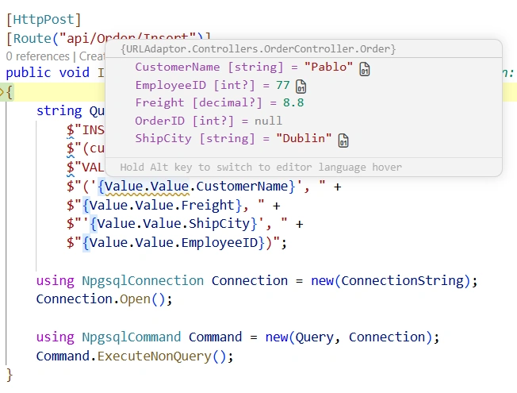
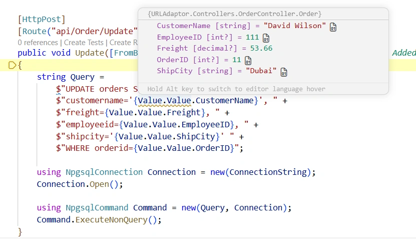
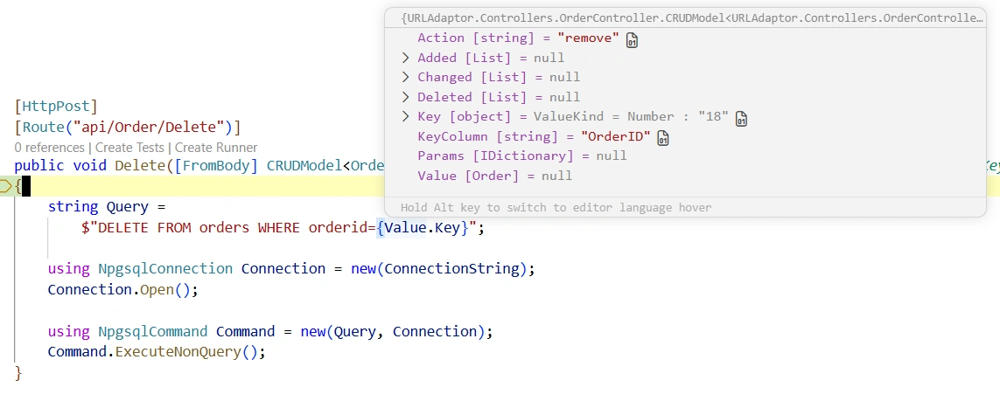
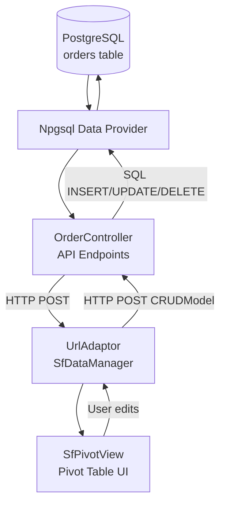

# Connecting PostgreSQL to Blazor Pivot Table Using URL Adaptor

The [Blazor Pivot Table](https://www.syncfusion.com/blazor-components/blazor-pivot-table) supports binding data from a PostgreSQL database using the **URL Adaptor**. This remote-data binding approach exposes the database through a RESTful API controller and lets the pivot table communicate with the server over standard HTTP, making it ideal for large datasets and shared back-ends.

**What is the URL Adaptor?**

The URL Adaptor is a Syncfusion data adaptor that delegates every data operation—read, insert, update, and delete—to a remote endpoint. Instead of fetching the entire dataset into the browser, the pivot table posts a serialized [`DataManagerRequest`](https://help.syncfusion.com/cr/blazor/Syncfusion.Blazor.DataManagerRequest.html) to a controller action, and the server returns the processed result. This keeps the pivot table lightweight and pushes the heavy lifting to the server.

**Key Benefits of the URL Adaptor**

- **Server-Side Processing**: Searching, filtering, sorting, aggregation, and paging run on the server, so only the required slice of data travels over the network.
- **RESTful contract**: A clean HTTP API that any client (Blazor, Angular, React, mobile) can consume.
- **Full CRUD Support**: Dedicated `Insert`, `Update`, and `Remove` endpoints power cell editing and drill-through operations in the pivot table.
- **Loose Coupling**: The pivot component knows only the endpoint URLs, not the underlying database or data-access technology.
- **Scalability**: Stateless controllers and connection-pooled database access scale horizontally.

**What is Npgsql?**

[Npgsql](https://www.npgsql.org/) is the open-source ADO.NET data provider for PostgreSQL. It allows .NET applications to connect to PostgreSQL, execute SQL commands, and read results using the familiar `DbConnection`, `DbCommand`, and `DbDataAdapter` primitives. The `Npgsql.EntityFrameworkCore.PostgreSQL` NuGet package ships the Npgsql provider and is everything the sample needs to talk to PostgreSQL.

## Prerequisites

Ensure the following software and packages are installed before proceeding:

| Software/Package | Version | Purpose |
|-----------------|---------|---------|
| Visual Studio 2026 | 18.0 or later | Development IDE with Blazor workload |
| .NET SDK | net10.0 or compatible | Runtime and build tools |
| PostgreSQL Server | 12 or later | Database server |
| pgAdmin 4 | Latest | PostgreSQL GUI management tool |
| Syncfusion.Blazor.PivotTable | Latest | Pivot Table and UI components |
| Syncfusion.Blazor.Themes | Latest | Styling for Pivot Table components |
| Npgsql.EntityFrameworkCore.PostgreSQL | 10.0.0 or later | PostgreSQL data provider for .NET |
| Newtonsoft.Json | 13.0.3 or later | JSON serialization for CRUD models |

## Setting Up the PostgreSQL Environment

### Step 1: Create the Database and Table in PostgreSQL

First, the **PostgreSQL database** structure must be created to store order records.

**UI Instructions (Using pgAdmin 4):**

1. **Open pgAdmin 4** and connect to the PostgreSQL server.
2. **Create Database**:
   - Right-click on **Databases** → Select **Create** → **Database**
   - Enter name: `OrderDB`
   - Click **Save**
3. **Create Table**:
   - Expand `OrderDB` → Right-click on **Schemas** → **public** → **Tables**
   - Click **Create** → **Table**
   - Enter table name: `orders`
   - Define columns as per the script below
4. **Execute SQL Script** (Alternative method):
   - Right-click on `OrderDB` → **Query Tool**
   - Copy and paste the SQL script below
   - Execute (F5 or Run button)

**SQL Script for PostgreSQL:**

```sql
-- Create Database
CREATE DATABASE OrderDB;

-- Connect to the database
\c OrderDB;

-- Create orders Table
CREATE TABLE public.orders (
    orderid SERIAL PRIMARY KEY,
    customername VARCHAR(100) NOT NULL,
    employeeid INTEGER NOT NULL,
    shipcity VARCHAR(100),
    freight NUMERIC(12,2)
);

-- Insert Sample Data
INSERT INTO public.orders (customername, employeeid, shipcity, freight)
VALUES
('Alice Johnson', 1, 'New York', 120.50),
('Bob Smith', 2, 'London', 85.20),
('Carol Davis', 1, 'New York', 210.75),
('David Brown', 3, 'Berlin', 95.00),
('Eve Wilson', 2, 'London', 150.25),
('Frank Moore', 4, 'Tokyo', 60.80),
('Grace Taylor', 1, 'New York', 180.40),
('Henry Anderson', 3, 'Berlin', 220.60),
('Ivy Thomas', 2, 'London', 75.10),
('Jack White', 4, 'Tokyo', 130.90);
```

After executing this script, the order records are stored in the `orders` table within the `OrderDB` database. The database is now ready for integration with the Blazor application.

**Verify the Inserted Records:**

To confirm the table and sample data were created correctly, run the following verification query in the pgAdmin **Query Tool** against `OrderDB`:

```sql
SELECT * FROM public.orders;
```

The screenshot below shows the records successfully inserted into the `orders` table in PostgreSQL.



**Image Content:**
- pgAdmin Query Tool window.
- The `SELECT * FROM public.orders` query at the top.
- The results grid below showing all 10 sample records with columns `orderid`, `customername`, `employeeid`, `shipcity`, and `freight`.

**Purpose:** Confirms the database table and sample data are ready before the Blazor application is wired up, helping customers catch PostgreSQL setup issues early.

**Capture Source:** pgAdmin 4 → `OrderDB` → right-click → **Query Tool** → run `SELECT * FROM public.orders;`.


### Step 2: Install Required NuGet Packages

Before installing the necessary NuGet packages, a new Blazor Web Application must be created using the default template. This template automatically generates essential starter files—such as **Program.cs, appsettings.json, the wwwroot folder, and the Components folder**.

For this guide, a Blazor application named **URLAdaptor** has been created. Once the project is set up, the next step involves installing the required NuGet packages.

**Method 1: Using Package Manager Console**

1. Open Visual Studio 2026.
2. Navigate to **Tools → NuGet Package Manager → Package Manager Console**.
3. Run the following commands:

```powershell
Install-Package Syncfusion.Blazor.PivotTable -Version {{site.blazorversion}};
Install-Package Syncfusion.Blazor.Themes -Version {{site.blazorversion}};
Install-Package Npgsql.EntityFrameworkCore.PostgreSQL -Version 10.0.3;
Install-Package Newtonsoft.Json -Version 13.0.3
```

**Method 2: Using NuGet Package Manager UI**

1. Open **Visual Studio 2026 → Tools → NuGet Package Manager → Manage NuGet Packages for Solution**.
2. Search for and install each package individually:
   - **[Syncfusion.Blazor.PivotTable](https://www.nuget.org/packages/Syncfusion.Blazor.PivotTable/)** (version {{site.blazorversion}})
   - **[Syncfusion.Blazor.Themes](https://www.nuget.org/packages/Syncfusion.Blazor.Themes/)** (version {{site.blazorversion}})
   - **Npgsql.EntityFrameworkCore.PostgreSQL** (version 10.0.3 or later)
   - **Newtonsoft.Json** (version 13.0.3 or later)

**Project File Reference**

The installed packages are reflected in the **URLAdaptor.csproj** file:

```xml
<Project Sdk="Microsoft.NET.Sdk.Web">

  <PropertyGroup>
    <TargetFramework>net10.0</TargetFramework>
    <Nullable>enable</Nullable>
    <ImplicitUsings>enable</ImplicitUsings>
  </PropertyGroup>

  <ItemGroup>
    <PackageReference Include="Syncfusion.Blazor.PivotTable" Version="*" />
    <PackageReference Include="Syncfusion.Blazor.Themes" Version="*" />
    <PackageReference Include="Newtonsoft.Json" Version="13.0.3" />
    <PackageReference Include="Npgsql.EntityFrameworkCore.PostgreSQL" Version="10.0.3" />
  </ItemGroup>

</Project>
```

All required packages are now installed.

### Step 3: Configure the Connection String

A connection string contains the information needed to connect the application to the PostgreSQL database, including the server address, database name, and authentication credentials.

The sample project defines the connection string as a private field directly inside `OrderController.cs`. This keeps the data-access configuration alongside the controller that consumes it, and is the pattern used throughout this guide.

**Instructions:**

1. Open the `Controllers/OrderController.cs` file (created in [Step 4](#step-4-create-the-controller)).
2. Add the connection string as a field at the top of the `OrderController` class:

```csharp
[ApiController]
public class OrderController : ControllerBase
{
    string ConnectionString = @"Host=localhost;Port=5432;Database=OrderDB;Username=postgres;Password=password@123;";
}
```

**Connection String Components:**

| Component | Description |
|-----------|-------------|
| Host | The address of the PostgreSQL server (`localhost` for local development) |
| Port | The port number on which PostgreSQL is running (default is `5432`) |
| Database | The database name (in this case, `OrderDB`) |
| Username | The PostgreSQL username (default is `postgres`) |
| Password | The password for the PostgreSQL user account |

This `ConnectionString` field is reused by every action in the controller (`Post`, `GetOrderData`, `Insert`, `Update`, and `Delete`) when opening Npgsql connections.

> **Security Note:** For production environments, do not hard-code credentials in source files. Move the connection string to environment variables or a secrets manager such as Azure Key Vault, and read it at runtime. Example: `Password=${DB_PASSWORD}` and set the environment variable `DB_PASSWORD` on the deployment server.

The database connection string has been configured successfully.


### Step 4: Create the Controller

The controller is the heart of the URL Adaptor integration. It exposes HTTP endpoints that the pivot table calls for reading and modifying data. The sample uses raw Npgsql commands to keep the data-access code explicit and easy to follow.

**Instructions:**

1. Inside the `Controllers` folder, create a new file named **OrderController.cs**.
2. Define the `OrderController` class with the following code:

```csharp
using Microsoft.AspNetCore.Mvc;
using Syncfusion.Blazor.Data;
using Syncfusion.Blazor;
using Npgsql;
using System.Data;
using System.ComponentModel.DataAnnotations;
using Newtonsoft.Json;
using Microsoft.EntityFrameworkCore.Metadata.Internal;

namespace URLAdaptor.Controllers
{
    [ApiController]
    public class OrderController : ControllerBase
    {
        string ConnectionString = @"Host=localhost;Port=5432;Database=OrderDB;Username=postgres;Password=password@123;";

        [HttpPost]
        [Route("api/[controller]")]
        /// <summary>
        /// Returns the data collection as result and count after performing data operations
        /// based on the request from <see cref="DataManagerRequest"/>.
        /// </summary>
        /// <param name="DataManagerRequest">Contains searching, filtering, sorting, aggregates
        /// and paging information sent from the Blazor Pivot Table component side.</param>
        /// <returns>The data collection's type is determined by how this method has been implemented.</returns>
        public object Post([FromBody] DataManagerRequest DataManagerRequest)
        {
            IEnumerable<Order> DataSource = GetOrderData();

            int count = DataSource.Cast<Order>().Count();

            // RequiresCount is passed from the control side itself. Wherever on-demand data
            // fetching is needed, RequiresCount is set as true on the component side. Here paging
            // loads data on demand whenever the next page is clicked on the Blazor Pivot Table side.
            return new { result = DataSource, count = count };
        }

        [Route("api/[controller]")]
        public List<Order> GetOrderData()
        {
            string QueryStr = "SELECT * FROM public.orders ORDER BY orderid";

            using NpgsqlConnection sqlConnection = new(ConnectionString);
            sqlConnection.Open();

            using NpgsqlCommand SqlCommand = new(QueryStr, sqlConnection);
            using NpgsqlDataAdapter DataAdapter = new(SqlCommand);

            DataTable DataTable = new();
            DataAdapter.Fill(DataTable);

            var DataSource = (from DataRow Data in DataTable.Rows
                              select new Order()
                              {
                                  OrderID = Convert.ToInt32(Data["orderid"]),
                                  CustomerName = Data["customername"].ToString(),
                                  EmployeeID = Convert.ToInt32(Data["employeeid"]),
                                  ShipCity = Data["shipcity"].ToString(),
                                  Freight = Convert.ToDecimal(Data["freight"])
                              }).ToList();

            return DataSource;
        }

        [HttpPost]
        [Route("api/Order/Insert")]
        public void Insert([FromBody] CRUDModel<Order> Value)
        {
            string Query =
                $"INSERT INTO orders " +
                $"(customername, freight, shipcity, employeeid) " +
                $"VALUES " +
                $"('{Value.Value.CustomerName}', " +
                $"{Value.Value.Freight}, " +
                $"'{Value.Value.ShipCity}', " +
                $"{Value.Value.EmployeeID})";

            using NpgsqlConnection Connection = new(ConnectionString);
            Connection.Open();

            using NpgsqlCommand Command = new(Query, Connection);
            Command.ExecuteNonQuery();
        }

        [HttpPost]
        [Route("api/Order/Update")]
        public void Update([FromBody] CRUDModel<Order> Value)
        {
            string Query =
                $"UPDATE orders SET " +
                $"customername='{Value.Value.CustomerName}', " +
                $"freight={Value.Value.Freight}, " +
                $"employeeid={Value.Value.EmployeeID}, " +
                $"shipcity='{Value.Value.ShipCity}' " +
                $"WHERE orderid={Value.Value.OrderID}";

            using NpgsqlConnection Connection = new(ConnectionString);
            Connection.Open();

            using NpgsqlCommand Command = new(Query, Connection);
            Command.ExecuteNonQuery();
        }

        [HttpPost]
        [Route("api/Order/Delete")]
        public void Delete([FromBody] CRUDModel<Order> Value)
        {
            string Query =
                $"DELETE FROM orders WHERE orderid={Value.Key}";

            using NpgsqlConnection Connection = new(ConnectionString);
            Connection.Open();

            using NpgsqlCommand Command = new(Query, Connection);
            Command.ExecuteNonQuery();
        }

        public class Order
        {
            [Key]
            public int? OrderID { get; set; }
            public string? CustomerName { get; set; }
            public int? EmployeeID { get; set; }
            public decimal? Freight { get; set; }
            public string? ShipCity { get; set; }
        }

        public class CRUDModel<T> where T : class
        {
            [JsonProperty("action")]
            public string? Action { get; set; }
            [JsonProperty("keyColumn")]
            public string? KeyColumn { get; set; }
            [JsonProperty("key")]
            public object? Key { get; set; }
            [JsonProperty("value")]
            public T? Value { get; set; }
            [JsonProperty("added")]
            public List<T>? Added { get; set; }
            [JsonProperty("changed")]
            public List<T>? Changed { get; set; }
            [JsonProperty("deleted")]
            public List<T>? Deleted { get; set; }
            [JsonProperty("params")]
            public IDictionary<string, object>? Params { get; set; }
        }
    }
}
```

**Explanation:**

- **`Post` action (`POST /api/Order`)**: Reads the full dataset from PostgreSQL and returns it as `{ result, count }`. The pivot table calls this endpoint on initialization and whenever a data operation is performed.
- **`GetOrderData` helper**: Opens a pooled Npgsql connection, runs a `SELECT` against the `orders` table, fills a `DataTable`, and projects the rows into `Order` objects.
- **`Insert` action (`POST /api/Order/Insert`)**: Receives a `CRUDModel<Order>` and runs an `INSERT` against PostgreSQL.
- **`Update` action (`POST /api/Order/Update`)**: Receives a `CRUDModel<Order>` and runs an `UPDATE` filtered by `orderid`.
- **`Delete` action (`POST /api/Order/Delete`)**: Receives a `CRUDModel<Order>` and runs a `DELETE` filtered by the `Key` (primary key value).
- The `[ApiController]` attribute enables automatic model validation and HTTP API conventions for the controller.

The controller has been successfully created with read and full CRUD support.

**Verify the Read Endpoint:**

Before wiring up the Pivot Table, confirm the API is returning data correctly. With the application running, open a browser and navigate to `http://localhost:5145/api/Order` (using a REST client such as Postman, or by submitting a `POST` with an empty `DataManagerRequest` body). The response should contain the order records along with a count.

The screenshot below shows the JSON response returned by the `POST /api/Order` endpoint.


**Image Content:**
- A REST client (Postman) or browser window.
- A `POST` request to `http://localhost:5145/api/Order`.
- The JSON response body containing `result` (array of `Order` objects) and `count` (integer).
- HTTP `200 OK` status.

**Purpose:** Verifies that the controller, Npgsql connection, and PostgreSQL query all work end-to-end before the Pivot Table consumes the endpoint.

**Capture Source:** Postman / browser Developer Tools after running the Blazor app and posting to `/api/Order`.

### Step 5: Register Services in Program.cs

The `Program.cs` file is where application services are registered and configured. This file must be updated to enable Syncfusion Blazor, Razor components, and the API controllers that back the URL Adaptor.

**Instructions:**

1. Open the `Program.cs` file at the project root.
2. Replace its contents with the following code:

```csharp
using URLAdaptor.Components;
using Syncfusion.Blazor;

var builder = WebApplication.CreateBuilder(args);

// ========== SYNCFUSION BLAZOR CONFIGURATION ==========
builder.Services.AddSyncfusionBlazor();

// ========== RAZOR COMPONENTS ==========
builder.Services.AddRazorComponents()
    .AddInteractiveServerComponents();

// ========== API CONTROLLERS (backs the URL Adaptor) ==========
builder.Services.AddControllers();

var app = builder.Build();

// Configure the HTTP request pipeline.
if (!app.Environment.IsDevelopment())
{
    app.UseExceptionHandler("/Error", createScopeForErrors: true);
    // The default HSTS value is 30 days. Change for production scenarios, see https://aka.ms/aspnetcore-hsts.
    app.UseHsts();
}

app.UseHttpsRedirection();
app.MapControllers();

app.UseAntiforgery();

app.MapStaticAssets();
app.MapRazorComponents<App>()
    .AddInteractiveServerRenderMode();

app.Run();
```

**Explanation:**

- **`AddSyncfusionBlazor()`**: Registers Syncfusion Blazor services, including the Pivot Table and theme resources.
- **`AddRazorComponents()` and `AddInteractiveServerComponents()`**: Enables Blazor server-side rendering with interactive components.
- **`AddControllers()`**: Registers the API controllers (`OrderController`) so the URL Adaptor endpoints are reachable.
- **`MapControllers()`**: Adds the controller routes to the application's endpoint pipeline.
- **`UseAntiforgery()`**: Required by Blazor interactive components for form and antiforgery handling.

> **Note:** The Sample posts JSON to the controller endpoints. Because the project is a Blazor Web App with interactive server rendering, the antiforgery token is handled by the framework. For deployed scenarios, ensure the URL Adaptor requests include a valid antiforgery header if antiforgery is enforced on the controller.

The service registration has been completed successfully.

## Integrating the Blazor Pivot Table

### Step 1: Configure the Pivot Table Imports and Theme

Syncfusion provides pre-built UI components such as the Pivot Table, which summarizes large datasets into a multidimensional view.

**Instructions:**

* The `Syncfusion.Blazor.PivotTable` package was installed in **Step 2** of the previous section.
* Import the required namespaces in the `Components/_Imports.razor` file:

```csharp
@using System.Net.Http
@using System.Net.Http.Json
@using Microsoft.AspNetCore.Components.Forms
@using Microsoft.AspNetCore.Components.Routing
@using Microsoft.AspNetCore.Components.Web
@using static Microsoft.AspNetCore.Components.Web.RenderMode
@using Microsoft.AspNetCore.Components.Web.Virtualization
@using Microsoft.JSInterop
@using URLAdaptor
@using URLAdaptor.Components
@using Syncfusion.Blazor
@using Syncfusion.Blazor.PivotView
```

* Add the stylesheet and scripts in the `Components/App.razor` file. Find the `<head>` section and add:

```html
<!-- Syncfusion Blazor Stylesheet (bootstrap5 theme) -->
<link href="_content/Syncfusion.Blazor.Themes/bootstrap5.css" rel="stylesheet" />
```

* And include the Syncfusion script reference before the closing `</body>` tag:

```html
<script src="_framework/blazor.web.js"></script>
<script src="_content/Syncfusion.Blazor.Core/scripts/syncfusion-blazor.min.js" type="text/javascript"></script>
```

For this project, the **bootstrap5** theme is used. A different theme can be selected or customized based on project requirements. Refer to the [Blazor Components Appearance](https://blazor.syncfusion.com/documentation/appearance/themes) documentation to learn more about theming options.

The complete `App.razor` for the sample looks like this:

```html
<!DOCTYPE html>
<html lang="en">

<head>
    <meta charset="utf-8" />
    <meta name="viewport" content="width=device-width, initial-scale=1.0" />
    <base href="/" />
    <link rel="stylesheet" href="@Assets["lib/bootstrap/dist/css/bootstrap.min.css"]" />
    <link rel="stylesheet" href="@Assets["app.css"]" />
    <link rel="stylesheet" href="@Assets["URLAdaptor.styles.css"]" />
    <ImportMap />
    <link rel="icon" type="image/png" href="favicon.png" />
    <HeadOutlet @rendermode="InteractiveServer" />
    <link href="_content/Syncfusion.Blazor.Themes/bootstrap5.css" rel="stylesheet" />
</head>

<body>
    <Routes @rendermode="InteractiveServer" />
    <script src="_framework/blazor.web.js"></script>
    <script src="_content/Syncfusion.Blazor.Core/scripts/syncfusion-blazor.min.js" type="text/javascript"></script>
</body>

</html>
```

Blazor components are now configured and ready to use. For additional guidance, refer to the Pivot Table [getting-started](https://blazor.syncfusion.com/documentation/pivotview/getting-started) documentation.

### Step 2: Add the PivotTable Package Reference

Confirm the `Syncfusion.Blazor.PivotTable` and `Syncfusion.Blazor.Data` packages are referenced. `Syncfusion.Blazor.Data` is brought in transitively by `Syncfusion.Blazor.PivotTable` and provides `SfDataManager` and the `Adaptors` enum used in the next steps.

The relevant section of **URLAdaptor.csproj**:

```xml
<ItemGroup>
    <PackageReference Include="Syncfusion.Blazor.PivotTable" Version="*" />
    <PackageReference Include="Syncfusion.Blazor.Themes" Version="*" />
    <PackageReference Include="Newtonsoft.Json" Version="13.0.3" />
    <PackageReference Include="Npgsql.EntityFrameworkCore.PostgreSQL" Version="10.0.3" />
</ItemGroup>
```

The package references are now in place.

### Step 3: Configure the Pivot Table with the URL Adaptor

The pivot table binds to the PostgreSQL-backed API through the [`SfDataManager`](https://help.syncfusion.com/cr/blazor/Syncfusion.Blazor.Data.SfDataManager.html) configured with [`Adaptors.UrlAdaptor`](https://help.syncfusion.com/cr/blazor/Syncfusion.Blazor.Adaptors.html). The `Url`, `InsertUrl`, `UpdateUrl`, and `RemoveUrl` properties point at the controller actions created in **Step 6**.

**Instructions:**

1. Open the file named `Home.razor` in the `Components/Pages` folder.
2. Replace its contents with the following markup:

```cshtml
@page "/"
@using Syncfusion.Blazor.Data
@using Syncfusion.Blazor.PivotView

<SfPivotView TValue="Order" Width="1000" Height="300" ShowFieldList="true">
    <PivotViewDataSourceSettings TValue="Order" ExpandAll=false EnableSorting=true>
    <SfDataManager Url="http://localhost:5145/api/Order"
                   InsertUrl="http://localhost:5145/api/Order/Insert"
                   UpdateUrl="http://localhost:5145/api/Order/Update"
                   RemoveUrl="http://localhost:5145/api/Order/Delete"
                   Adaptor="Adaptors.UrlAdaptor"></SfDataManager>
        <PivotViewColumns>
            <PivotViewColumn Name="EmployeeID"></PivotViewColumn>
        </PivotViewColumns>
        <PivotViewRows>
            <PivotViewRow Name="CustomerName"></PivotViewRow>
        </PivotViewRows>
        <PivotViewValues>
            <PivotViewValue Name="Freight" Caption="Freight"></PivotViewValue>
        </PivotViewValues>
    </PivotViewDataSourceSettings>
    <PivotViewGridSettings ColumnWidth="120"></PivotViewGridSettings>
    <PivotViewEvents TValue="Order" BeginDrillThrough="beginDrillThrough"></PivotViewEvents>
    <PivotViewCellEditSettings AllowEditing=true AllowAdding=true AllowDeleting=true
                               Mode=Syncfusion.Blazor.PivotView.EditMode.Normal></PivotViewCellEditSettings>
</SfPivotView>

@code{
    private void beginDrillThrough(BeginDrillThroughEventArgs args)
    {
        // Configure the BeginDrillThrough event to set the primary key for CRUD operations.
        // Iterate through all columns in the edit dialog grid.
        for (int i = 0; i < args.GridObj.Columns.Count; i++)
        {
            // Check if the current column is the primary key column.
            if (args.GridObj.Columns[i].Field == "OrderID")
            {
                // Mark this column as the primary key so DataManager uses it
                // to uniquely identify records during CRUD operations.
                args.GridObj.Columns[i].IsPrimaryKey = true;
            }
            else
            {
                // Ensure other columns are visible in the edit dialog grid.
                args.GridObj.Columns[i].Visible = true;
            }
        }
    }

    SfPivotView<Order> pivot { get; set; }

    public List<Order> Orders { get; set; }

    public class Order
    {
        public int OrderID { get; set; }
        public string CustomerName { get; set; }
        public int EmployeeID { get; set; }
        public decimal Freight { get; set; }
        public string ShipCity { get; set; }
    }
}
```

**Component Explanation:**

- **`<SfPivotView TValue="Order">`**: The pivot table component bound to the `Order` type.
- **`ShowFieldList="true"`**: Displays the field list UI so end users can drag fields between rows, columns, and values at runtime.
- **`<PivotViewDataSourceSettings>`**: Defines the default field arrangement—`EmployeeID` as a column, `CustomerName` as a row, and `Freight` as a value.
- **`<SfDataManager>`**: Wires the pivot table to the API via the URL Adaptor. The four URLs map directly to the controller actions.
- **`<PivotViewCellEditSettings>`**: Enables cell-level editing, adding, and deleting in `Normal` edit mode.
- **`BeginDrillThrough` event**: When a user opens the edit dialog from a pivot cell, this handler runs and marks `OrderID` as the primary key of the edit dialog grid so insert/update/delete operations can target the correct record.

The Home component has been updated successfully with the Pivot Table.

**Pivot Table with PostgreSQL Data:**

When `dotnet run` launches the application and the browser loads `http://localhost:5145`, the Pivot Table renders the PostgreSQL `orders` data with the configured field arrangement: `CustomerName` as rows, `EmployeeID` as columns, and `Freight` aggregated as a value. The Field List panel is available so end users can rearrange fields at runtime.


**Image Content:**
- The Blazor application running in the browser at `http://localhost:5145`.
- The `SfPivotView` rendered with the configured rows (`CustomerName`), columns (`EmployeeID`), and value (`Freight`).
- The **Field List** panel open or accessible, demonstrating runtime layout customization.
- Aggregated subtotals and grand totals visible in the pivot body.
- No records edited yet — this is the pristine pre-CRUD state.

**Purpose:** Confirms that the data flow (PostgreSQL → Npgsql → OrderController → URL Adaptor → Pivot Table) is wired correctly before the CRUD sections show modified states.

**Capture Source:** Run `dotnet run`, open the browser at the application URL, and capture the full Pivot Table with the field list immediately after the first render (before any insert/update/delete).

## URL Adaptor Configuration

The URL Adaptor is the contract between the Blazor Pivot Table and the PostgreSQL-backed API. It works as follows:

1. The pivot table serializes its current data state into a `DataManagerRequest` object.
2. The `SfDataManager` posts that object as JSON to the `Url` endpoint (`POST /api/Order`).
3. The controller deserializes the request, queries PostgreSQL, and returns `{ result, count }`.
4. For write operations, the pivot table posts a `CRUDModel<Order>` payload to the matching `InsertUrl`, `UpdateUrl`, or `RemoveUrl`.

```razor
<SfDataManager Url="http://localhost:5145/api/Order"
               InsertUrl="http://localhost:5145/api/Order/Insert"
               UpdateUrl="http://localhost:5145/api/Order/Update"
               RemoveUrl="http://localhost:5145/api/Order/Delete"
               Adaptor="Adaptors.UrlAdaptor">
</SfDataManager>
```

| Property | Purpose | Controller Action |
|----------|---------|-------------------|
| `Url` | Reads data from the server | `POST /api/Order` → `Post` |
| `InsertUrl` | Adds a new record | `POST /api/Order/Insert` → `Insert` |
| `UpdateUrl` | Updates an existing record | `POST /api/Order/Update` → `Update` |
| `RemoveUrl` | Deletes a record | `POST /api/Order/Delete` → `Delete` |

> **Port Tip:** The URLs above use port `5145`, which is the HTTP port defined in `Properties/launchSettings.json`. Update the port to match the profile the application is launched with (for example, `7169` for the HTTPS profile).

The URL Adaptor has been successfully configured. The CRUD sections below include screenshots of the `CRUDModel<Order>` value received by the `Insert`, `Update`, and `Delete` controller actions.

## API Endpoints

The `OrderController` exposes the following REST endpoints:

| Method | Route | Payload | Description |
|--------|-------|---------|-------------|
| `POST` | `/api/Order` | `DataManagerRequest` | Returns all order records as `{ result, count }`. Called on pivot initialization and on every data operation. |
| `POST` | `/api/Order/Insert` | `CRUDModel<Order>` | Inserts a new order into the `orders` table. |
| `POST` | `/api/Order/Update` | `CRUDModel<Order>` | Updates an existing order filtered by `orderid`. |
| `POST` | `/api/Order/Delete` | `CRUDModel<Order>` | Deletes an order using the `Key` (primary key value). |

**Sample read response:**

```json
{
  "result": [
    { "orderID": 1, "customerName": "Alice Johnson", "employeeID": 1, "shipCity": "New York", "freight": 120.50 },
    { "orderID": 2, "customerName": "Bob Smith", "employeeID": 2, "shipCity": "London", "freight": 85.20 }
  ],
  "count": 2
}
```

**Sample insert payload:**

```json
{
  "action": "insert",
  "keyColumn": "orderID",
  "value": {
    "customerName": "Karen Lee",
    "employeeID": 3,
    "shipCity": "Berlin",
    "freight": 110.00
  }
}
```

## CRUD Operations

The Pivot Table performs CRUD operations through cell editing and the edit dialog. Each operation calls the corresponding controller endpoint, which executes the appropriate PostgreSQL command.

### Insert

Record insertion allows new orders to be added directly through the edit dialog of the Pivot Table component. The adaptor serializes the new row into a `CRUDModel<Order>` and posts it to `/api/Order/Insert`.

**Controller snippet:**

```csharp
[HttpPost]
[Route("api/Order/Insert")]
public void Insert([FromBody] CRUDModel<Order> Value)
{
    string Query =
        $"INSERT INTO orders " +
        $"(customername, freight, shipcity, employeeid) " +
        $"VALUES " +
        $"('{Value.Value.CustomerName}', " +
        $"{Value.Value.Freight}, " +
        $"'{Value.Value.ShipCity}', " +
        $"{Value.Value.EmployeeID})";

    using NpgsqlConnection Connection = new(ConnectionString);
    Connection.Open();

    using NpgsqlCommand Command = new(Query, Connection);
    Command.ExecuteNonQuery();
}
```

**What happens behind the scenes:**

1. The user opens the edit dialog from a pivot cell and adds a new row.
2. The pivot table posts the new row to `InsertUrl`.
3. The controller builds an `INSERT` statement and executes it through Npgsql.
4. PostgreSQL stores the new record (the `orderid` SERIAL column auto-increments).
5. The pivot table refreshes by calling the read endpoint, and the new record appears in the summarized view.

The screenshot below shows the `CRUDModel<Order>` value received in the `Insert` controller action — the `Value` parameter carrying the `Action`, `KeyColumn`, and the new order record (`CustomerName`, `EmployeeID`, `ShipCity`, `Freight`) that will be inserted into the `orders` table.



**Image Content:**
- The `Insert` action of `OrderController` open in the editor.
- The `Value` parameter of type `CRUDModel<Order>` expanded to reveal its contents.
- The `Action` set to `"insert"`, the `KeyColumn` set to `"orderID"`, and the `Value` property holding the new order fields: `CustomerName`, `EmployeeID`, `ShipCity`, and `Freight`.

**Purpose:** Confirms the exact `CRUDModel<Order>` value received by the `Insert` action so customers can verify that the client-side payload maps correctly to the server-side `Value` parameter before the `INSERT` statement runs.

**Capture Source:** Trigger an insert from the edit dialog (double-click a pivot cell, click **Add**, fill in a row, click **Update**) and inspect the `Value` parameter received by the `Insert` controller action.

### Update

Record modification allows order details to be updated directly within the edit dialog. The adaptor serializes the edited row and posts it to `/api/Order/Update`.

**Controller snippet:**

```csharp
[HttpPost]
[Route("api/Order/Update")]
public void Update([FromBody] CRUDModel<Order> Value)
{
    string Query =
        $"UPDATE orders SET " +
        $"customername='{Value.Value.CustomerName}', " +
        $"freight={Value.Value.Freight}, " +
        $"employeeid={Value.Value.EmployeeID}, " +
        $"shipcity='{Value.Value.ShipCity}' " +
        $"WHERE orderid={Value.Value.OrderID}";

    using NpgsqlConnection Connection = new(ConnectionString);
    Connection.Open();

    using NpgsqlCommand Command = new(Query, Connection);
    Command.ExecuteNonQuery();
}
```

**What happens behind the scenes:**

1. The user edits a row in the edit dialog and saves it.
2. The pivot table posts the edited row to `UpdateUrl`.
3. The controller builds an `UPDATE` statement filtered by `orderid` and executes it.
4. PostgreSQL updates the matching record.
5. The pivot table refreshes and reflects the updated aggregated value.

The screenshot below shows the `CRUDModel<Order>` value received in the `Update` controller action — the `Value` parameter carrying the `Action`, `KeyColumn`, and the edited order record (`CustomerName`, `EmployeeID`, `ShipCity`, `Freight`, and the `OrderID` used as the update filter) that will update the matching row in the `orders` table.



**Image Content:**
- The `Update` action of `OrderController` open in the editor.
- The `Value` parameter of type `CRUDModel<Order>` expanded to reveal its contents.
- The `Action` set to `"update"`, the `KeyColumn` set to `"orderID"`, and the `Value` property holding the modified order fields — including the changed `Freight` or `ShipCity` — along with the `OrderID` used to filter the `UPDATE`.

**Purpose:** Confirms the exact `CRUDModel<Order>` value received by the `Update` action so customers can verify that the client-side payload maps correctly to the server-side `Value` parameter and the `orderid` filter before the `UPDATE` statement runs.

**Capture Source:** Trigger an update from the edit dialog (double-click a pivot cell, select a row, click **Edit**, modify a field, click **Update**) and inspect the `Value` parameter received by the `Update` controller action.

### Delete

Record deletion allows orders to be removed directly from the edit dialog. The adaptor posts the primary key of the deleted row to `/api/Order/Delete`.

**Controller snippet:**

```csharp
[HttpPost]
[Route("api/Order/Delete")]
public void Delete([FromBody] CRUDModel<Order> Value)
{
    string Query =
        $"DELETE FROM orders WHERE orderid={Value.Key}";

    using NpgsqlConnection Connection = new(ConnectionString);
    Connection.Open();

    using NpgsqlCommand Command = new(Query, Connection);
    Command.ExecuteNonQuery();
}
```

**What happens behind the scenes:**

1. The user selects a row in the edit dialog and deletes it.
2. The pivot table posts the `Key` (primary key value) to `RemoveUrl`.
3. The controller builds a `DELETE` statement filtered by `orderid` and executes it.
4. PostgreSQL removes the matching record.
5. The pivot table refreshes and the record is removed from the summarized view.

The screenshot below shows the `CRUDModel<Order>` value received in the `Delete` controller action — the `Value` parameter carrying the `Action`, `KeyColumn`, and the `Key` (primary key value of the deleted row) that the `DELETE` statement uses to filter by `orderid`.



**Image Content:**
- The `Delete` action of `OrderController` open in the editor.
- The `Value` parameter of type `CRUDModel<Order>` expanded to reveal its contents.
- The `Action` set to `"remove"`, the `KeyColumn` set to `"orderID"`, and the `Key` containing the `orderid` of the deleted record.

**Purpose:** Confirms the exact `CRUDModel<Order>` value received by the `Delete` action so customers can verify that the primary key (`Key`) is being received correctly before the `DELETE` statement runs.

**Capture Source:** Trigger a delete from the edit dialog (double-click a pivot cell, select a row, click **Delete**, confirm) and inspect the `Value` parameter received by the `Delete` controller action.

### Enabling CRUD via the BeginDrillThrough Event

For CRUD operations to work in the edit dialog, the primary key column must be marked. The `BeginDrillThrough` event handler does this dynamically when the edit dialog opens:

```csharp
private void beginDrillThrough(BeginDrillThroughEventArgs args)
{
    for (int i = 0; i < args.GridObj.Columns.Count; i++)
    {
        if (args.GridObj.Columns[i].Field == "OrderID")
        {
            args.GridObj.Columns[i].IsPrimaryKey = true;
        }
        else
        {
            args.GridObj.Columns[i].Visible = true;
        }
    }
}
```

This step is required so the URL Adaptor knows which column to send as the `Key` for update and delete operations.

## Data Flow Diagram

The following diagram illustrates how data flows from PostgreSQL to the Pivot Table:


```mermaid
flowchart TD
    A[(PostgreSQL<br/>orders table)] --> B[Npgsql Data Provider]
    B --> C[OrderController<br/>API Endpoints]
    C -->|HTTP POST| D[UrlAdaptor<br/>SfDataManager]
    D --> E[SfPivotView<br/>Pivot Table UI]
    E -->|User edits| D
    D -->|HTTP POST CRUDModel| C
    C -->|SQL INSERT/UPDATE/DELETE| B
    B --> A
```

1. **PostgreSQL** stores the `orders` records.
2. The **Npgsql data provider** executes SQL commands over a pooled connection.
3. The **`OrderController`** exposes REST endpoints and orchestrates reads and writes.
4. The **URL Adaptor** inside `SfDataManager` posts `DataManagerRequest` and `CRUDModel<Order>` payloads to those endpoints.
5. The **`SfPivotView`** renders the summarized data and raises edit dialog events that trigger the write endpoints.

## Run the Application

**Build the Application**

1. Open the terminal or Package Manager Console in Visual Studio.
2. Navigate to the project directory.
3. Run the following command to restore packages and build:

```powershell
dotnet restore
dotnet build
```

**Run the Application**

Execute the following command:

```powershell
dotnet run
```

**Access the Application**

1. Open a web browser.
2. Navigate to the URL shown in the terminal output (for example, `http://localhost:5145`).
3. The PostgreSQL-backed Pivot Table is now running with full read and CRUD support. Refer to the screenshot in [Step 3](#step-3-configure-the-pivot-table-with-the-url-adaptor) for the rendered output.

> **Port Reminder:** The `SfDataManager` URLs in `Home.razor` point to `http://localhost:5145`. If the application launches on a different port (for example, the HTTPS profile on `7169`), update those URLs accordingly before running. The active ports are defined in `Properties/launchSettings.json`.


## Troubleshooting

| Symptom | Likely Cause | Resolution |
|---------|--------------|------------|
| Pivot table shows no data | Controller not reachable or wrong port in `SfDataManager` URLs | Verify the application is running and the port in `Home.razor` matches `launchSettings.json`. Open `http://localhost:<port>/api/Order` directly in a browser—expect a JSON response. |
| `405 Method Not Allowed` on read | The `POST /api/Order` action is missing or routed incorrectly | Confirm `OrderController` is decorated with `[ApiController]`, has `[HttpPost]` on `Post`, and `AddControllers()` + `MapControllers()` are present in `Program.cs`. |
| `Connection refused` or `NpgsqlException` | PostgreSQL is not running or credentials are wrong | Start the PostgreSQL service, confirm `Host`, `Port`, `Database`, `Username`, and `Password` in the connection string. Use `Password=password@123` as configured. |
| `relation "orders" does not exist` | Table not created or wrong schema | Run the SQL script in **Step 1** against `OrderDB`. Confirm the table is in the `public` schema and named `orders` (lowercase). |
| Insert/Update/Delete does nothing | Primary key column not marked in the edit dialog | Ensure the `BeginDrillThrough` event handler sets `IsPrimaryKey = true` on the `OrderID` column. |
| CRUD changes do not persist | `CRUDModel<Order>` JSON property names do not match | Confirm `Newtonsoft.Json` is referenced and `[JsonProperty("...")]` attributes are present on `CRUDModel<T>`. |
| CORS errors in browser console | API served on a different origin than the Blazor app | Serve both on the same origin, or enable CORS on the controller for the Blazor app's origin. |
| Antiforgery validation fails on POST | Antiforgery token enforced but not sent by the adaptor | For the sample, rely on Blazor's interactive server transport. For deployed scenarios, add an antiforgery header or relax the policy on the API endpoints. |
| Pivot table aggregates look wrong | `Freight` column type mismatch | Ensure `Freight` is a numeric column in PostgreSQL and `decimal` in the `Order` model so aggregation functions correctly. |
| Edit dialog shows all columns as editable | Visibility not configured in `BeginDrillThrough` | Use the same loop to set `Visible`, `AllowEditing`, and other column flags as needed. |

## Complete Code

The following is the complete `Home.razor` implementation that integrates all steps and features:

```cshtml
@page "/"
@using Syncfusion.Blazor.Data
@using Syncfusion.Blazor.PivotView

<SfPivotView TValue="Order" Width="1000" Height="300" ShowFieldList="true">
    <PivotViewDataSourceSettings TValue="Order" ExpandAll=false EnableSorting=true>
    <SfDataManager Url="http://localhost:5145/api/Order"
                   InsertUrl="http://localhost:5145/api/Order/Insert"
                   UpdateUrl="http://localhost:5145/api/Order/Update"
                   RemoveUrl="http://localhost:5145/api/Order/Delete"
                   Adaptor="Adaptors.UrlAdaptor"></SfDataManager>
        <PivotViewColumns>
            <PivotViewColumn Name="EmployeeID"></PivotViewColumn>
        </PivotViewColumns>
        <PivotViewRows>
            <PivotViewRow Name="CustomerName"></PivotViewRow>
        </PivotViewRows>
        <PivotViewValues>
            <PivotViewValue Name="Freight" Caption="Freight"></PivotViewValue>
        </PivotViewValues>
    </PivotViewDataSourceSettings>
    <PivotViewGridSettings ColumnWidth="120"></PivotViewGridSettings>
    <PivotViewEvents TValue="Order" BeginDrillThrough="beginDrillThrough"></PivotViewEvents>
    <PivotViewCellEditSettings AllowEditing=true AllowAdding=true AllowDeleting=true
                               Mode=Syncfusion.Blazor.PivotView.EditMode.Normal></PivotViewCellEditSettings>
</SfPivotView>

@code{
    private void beginDrillThrough(BeginDrillThroughEventArgs args)
    {
        for (int i = 0; i < args.GridObj.Columns.Count; i++)
        {
            if (args.GridObj.Columns[i].Field == "OrderID")
            {
                args.GridObj.Columns[i].IsPrimaryKey = true;
            }
            else
            {
                args.GridObj.Columns[i].Visible = true;
            }
        }
    }

    SfPivotView<Order> pivot { get; set; }

    public List<Order> Orders { get; set; }

    public class Order
    {
        public int OrderID { get; set; }
        public string CustomerName { get; set; }
        public int EmployeeID { get; set; }
        public decimal Freight { get; set; }
        public string ShipCity { get; set; }
    }
}
```

**Key Features of the Complete Implementation:**

1. **URL Adaptor binding**: The pivot table reads and writes via REST endpoints backed by PostgreSQL.
2. **Field List**: End users can rearrange `EmployeeID`, `CustomerName`, and `Freight` at runtime.
3. **Edit dialog CRUD**: The `BeginDrillThrough` handler marks the primary key so insert, update, and delete operations target the correct record.
4. **Cell Editing**: `AllowEditing`, `AllowAdding`, and `AllowDeleting` are enabled in `Normal` edit mode.
5. **RESTful API**: Four clearly named endpoints (`/api/Order`, `/api/Order/Insert`, `/api/Order/Update`, `/api/Order/Delete`) keep the contract simple.
6. **Npgsql Data Access**: Raw SQL over pooled Npgsql connections keeps the data layer explicit and easy to debug.

## Complete Sample Repository

A complete, working sample implementation is available in the [GitHub repository]().


## Summary

This guide demonstrates how to:

1. Create a PostgreSQL database with order records using pgAdmin 4. [🔗](#step-1-create-the-database-and-table-in-postgresql)
2. Install the necessary NuGet packages for Syncfusion Pivot Table, Npgsql, and Newtonsoft.Json. [🔗](#step-2-install-required-nuget-packages)
3. Configure the connection string with `Password=password@123`. [🔗](#step-3-configure-the-connection-string)
4. Implement an `OrderController` with read and CRUD endpoints backed by Npgsql. [🔗](#step-4-create-the-controller)
5. Register Syncfusion Blazor services and API controllers in `Program.cs`. [🔗](#step-5-register-services-in-programcs)
6. Configure the Pivot Table with `SfDataManager` and `Adaptors.UrlAdaptor` to bind PostgreSQL data remotely. [🔗](#step-3-configure-the-pivot-table-with-the-url-adaptor)
7. Enable edit dialog CRUD through the `BeginDrillThrough` event. [🔗](#enabling-crud-via-the-begindrillthrough-event)

The application now provides a complete solution for summarizing and editing PostgreSQL data with a modern, user-friendly Pivot Table interface.
