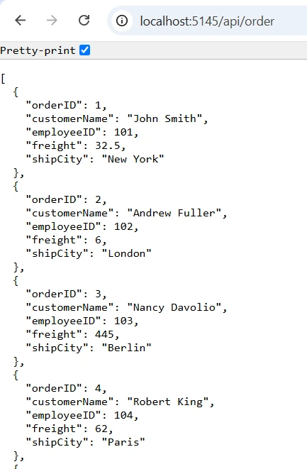
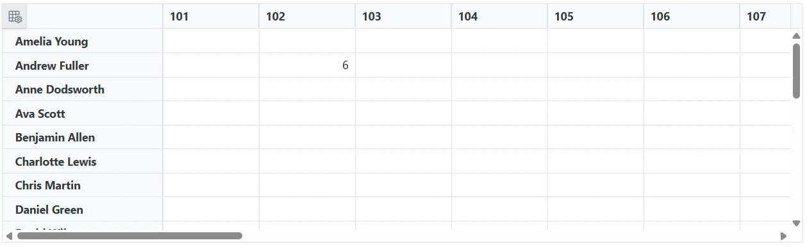
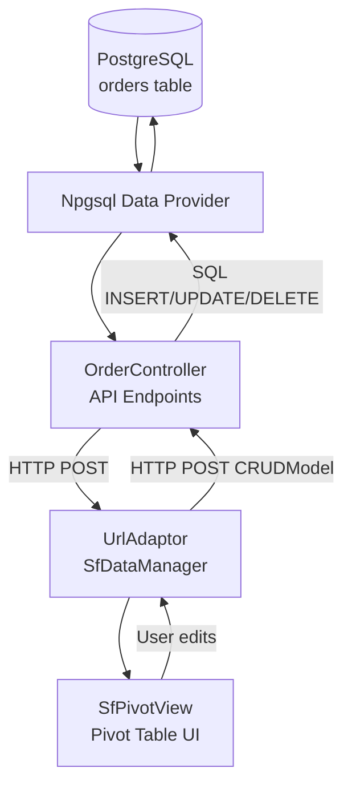

# Connecting PostgreSQL to Blazor Pivot Table Using URL Adaptor

The [Blazor Pivot Table](https://www.syncfusion.com/blazor-components/blazor-pivot-table) supports binding data from a PostgreSQL database using the **URL Adaptor**. This remote-data binding approach exposes the database through an HTTP API controller and lets the pivot table communicate with the server over standard HTTP. Server-side query processing is required before using the pattern for large datasets.

### What is the URL Adaptor?

The URL Adaptor is a Syncfusion data adaptor that delegates every data operation—read, insert, update, and delete—to a remote endpoint. Instead of fetching the entire dataset into the browser, the pivot table posts a serialized [`DataManagerRequest`](https://help.syncfusion.com/cr/blazor/Syncfusion.Blazor.DataManagerRequest.html) to a controller action, and the server returns the processed result. This keeps the pivot table lightweight and pushes the heavy lifting to the server.

### Key Benefits of the URL Adaptor

- **Remote API contract**: The URL Adaptor sends requests to an HTTP endpoint that returns a `{ result, count }` response. The sample below loads the complete `orders` table; add explicit `DataManagerRequest` processing before using it for large datasets.
- **RESTful contract**: A clean HTTP API that any client (Blazor, Angular, React, mobile) can consume.
- **Full CRUD Support**: Dedicated `Insert`, `Update`, and `Remove` endpoints power cell editing and drill-through operations in the pivot table.
- **Loose Coupling**: The pivot component knows only the endpoint URLs, not the underlying database or data-access technology.
- **Scalability**: Stateless controllers and connection-pooled database access can scale horizontally when the API also applies server-side query operations.

### What is Npgsql?

[Npgsql](https://www.npgsql.org/) is the open-source ADO.NET data provider for PostgreSQL. It allows .NET applications to connect to PostgreSQL, execute SQL commands, and read results using `NpgsqlConnection`, `NpgsqlCommand`, and `NpgsqlDataAdapter`. This sample uses the direct `Npgsql` package and does not use Entity Framework Core.

## Prerequisites

Ensure the following software and packages are installed before proceeding:

| Software/Package | Version | Purpose |
|-----------------|---------|---------|
| Visual Studio 2026 | 18.0 or later | Development IDE with Blazor workload |
| .NET SDK | 10.0 | Runtime and build tools |
| PostgreSQL Server | 12 or later | Database server |
| pgAdmin 4 | Latest | PostgreSQL GUI management tool |
| Syncfusion.Blazor.PivotTable | `{{site.blazorversion}}` | Pivot Table and UI components |
| Syncfusion.Blazor.Themes | `{{site.blazorversion}}` | Styling for Pivot Table components |
| Npgsql | 10.0.3 | PostgreSQL data provider for .NET |

The sample targets .NET 10 and the corresponding Syncfusion Blazor release. Do not use wildcard package versions. If you use another .NET or Syncfusion version, verify the API differences before applying the code.

`{{site.blazorversion}}` is resolved by the documentation build. When copying the commands into a standalone project, replace it with the concrete Syncfusion version used by the sample.

### Step 0: Create the Blazor application

Create a **Blazor Web App** named `URLAdaptor` with the .NET 10 SDK. Select **Interactive Server** interactivity and enable HTTPS. The project should contain `Program.cs`, `appsettings.json`, `wwwroot`, `Components`, and `Properties/launchSettings.json`.

If PostgreSQL and pgAdmin are not already installed, install them first, start the PostgreSQL service, and create a database user with permission to connect to `OrderDB`, use the `public` schema, read and modify `public.orders`, and use the `orders_orderid_seq` sequence.

Syncfusion packages obtained from NuGet.org also require a valid Syncfusion license or trial key. Register the key before the first Syncfusion component is initialized; see the [Syncfusion license-key instructions](https://blazor.syncfusion.com/documentation/getting-started/license-key/how-to-register-in-an-application).

## Setting Up the PostgreSQL Environment

### Step 1: Create the Database and Table in PostgreSQL

First, the **PostgreSQL database** structure must be created to store order records.

**UI Instructions (Using pgAdmin 4):**

1. **Open pgAdmin 4** and connect to the PostgreSQL server.
2. **Create Database**:
   - Right-click on **Databases** → Select **Create** → **Database**
   - Enter name: `OrderDB`
   - Click **Save**
3. **Create the table and sample rows using one of these methods**:
    - **UI method:** Expand `OrderDB` → **Schemas** → **public** → **Tables**, create `orders`, and define the columns from the SQL script; then insert the sample rows separately.
    - **SQL method:** Right-click on `OrderDB` → **Query Tool**, copy the table/sample-data script below, and execute it with F5 or the Run button. Do not create the table manually first.

If you prefer SQL for database creation, run the separate database-creation script while connected to the maintenance database, then open a new Query Tool connection to `OrderDB` for the table/sample-data script.

4. **Verify the table and sample rows**:
    - Right-click on `OrderDB` → **Query Tool**
    - Run `SELECT * FROM public.orders;`

**Database creation script** (run while connected to the maintenance database, such as `postgres`):

```sql
CREATE DATABASE OrderDB;
```

After the database is created, open a new pgAdmin Query Tool connection to `OrderDB` and run the following table and sample-data script:

```sql
-- Create orders table
CREATE TABLE public.orders (
    orderid SERIAL PRIMARY KEY,
    customername VARCHAR(100) NOT NULL,
    employeeid INTEGER NOT NULL,
    shipcity VARCHAR(100),
    freight NUMERIC(12,2)
);

-- Insert sample data
INSERT INTO public.orders (customername, employeeid, shipcity, freight)
VALUES
('Alice Johnson', 1, 'New York', 120.50),
('Bob Smith', 2, 'London', 85.20),
('Carol Davis', 1, 'New York', 210.75),
('David Brown', 3, 'Berlin', 95.00),
('Eve Wilson', 2, 'London', 150.25),
('Frank Moore', 4, 'Tokyo', 60.80),
('Grace Taylor', 1, 'New York', 180.40),
('Henry Anderson', 3, 'Berlin', 220.60),
('Ivy Thomas', 2, 'London', 75.10),
('Jack White', 4, 'Tokyo', 130.90);
```

After executing this script, the order records are stored in the `orders` table within the `OrderDB` database. The database is now ready for integration with the Blazor application.

**Verify the Inserted Records:**

To confirm the table and sample data were created correctly, run the following verification query in the pgAdmin **Query Tool** against `OrderDB`:

```sql
SELECT * FROM public.orders;
```

The screenshot below shows the records successfully inserted into the `orders` table in PostgreSQL.


**Image Content:**
- pgAdmin Query Tool window.
- The `SELECT * FROM public.orders` query at the top.
- The results grid below showing all 10 sample records with columns `orderid`, `customername`, `employeeid`, `shipcity`, and `freight`.

**Purpose:** Confirms the database table and sample data are ready before the Blazor application is wired up, helping customers catch PostgreSQL setup issues early.

**Capture Source:** pgAdmin 4 → `OrderDB` → right-click → **Query Tool** → run `SELECT * FROM public.orders;`.


### Step 2: Install Required NuGet Packages

The `URLAdaptor` Blazor Web App was created in Step 0. Install the required packages in the web project selected as the Package Manager Console's **Default project**.

**Method 1: Using Package Manager Console**

1. Open Visual Studio 2026.
2. Navigate to **Tools → NuGet Package Manager → Package Manager Console**.
3. Run the following commands:

```powershell
Install-Package Syncfusion.Blazor.PivotTable -Version {{site.blazorversion}}
Install-Package Syncfusion.Blazor.Themes -Version {{site.blazorversion}}
Install-Package Npgsql -Version 10.0.3
```

**Method 2: Using NuGet Package Manager UI**

1. Open **Visual Studio 2026 → Tools → NuGet Package Manager → Manage NuGet Packages for Solution**.
2. Search for and install each package individually:
   - **[Syncfusion.Blazor.PivotTable](https://www.nuget.org/packages/Syncfusion.Blazor.PivotTable/)** (version {{site.blazorversion}})
   - **[Syncfusion.Blazor.Themes](https://www.nuget.org/packages/Syncfusion.Blazor.Themes/)** (version {{site.blazorversion}})
   - **Npgsql** (version 10.0.3)

**Project File Reference**

The installed packages are reflected in the **URLAdaptor.csproj** file:

```xml
<Project Sdk="Microsoft.NET.Sdk.Web">

  <PropertyGroup>
    <TargetFramework>net10.0</TargetFramework>
    <Nullable>enable</Nullable>
    <ImplicitUsings>enable</ImplicitUsings>
  </PropertyGroup>

  <ItemGroup>
    <PackageReference Include="Syncfusion.Blazor.PivotTable" Version="{{site.blazorversion}}" />
    <PackageReference Include="Syncfusion.Blazor.Themes" Version="{{site.blazorversion}}" />
    <PackageReference Include="Npgsql" Version="10.0.3" />
  </ItemGroup>

</Project>
```

All required packages are now installed.

### Step 3: Configure the Connection String

A connection string contains the information needed to connect the application to the PostgreSQL database, including the server address, database name, and authentication credentials.

The sample stores the connection string in configuration and injects it into `OrderController`. This keeps credentials out of source code and allows each environment to provide its own database settings.

**Instructions:**

1. Open `appsettings.json` and add the following configuration:

```json
{
  "ConnectionStrings": {
    "PostgreSQL": "Host=localhost;Port=5432;Database=OrderDB;Username=postgres;Password=replace-with-your-password;"
  }
}
```

2. In `OrderController`, inject `IConfiguration` and retrieve the named connection string:

```csharp
private readonly string ConnectionString;

public OrderController(IConfiguration configuration)
{
    ConnectionString = configuration.GetConnectionString("PostgreSQL")
        ?? throw new InvalidOperationException("The PostgreSQL connection string is not configured.");
}
```

**Connection String Components:**

| Component | Description |
|-----------|-------------|
| Host | The address of the PostgreSQL server (`localhost` for local development) |
| Port | The port number on which PostgreSQL is running (default is `5432`) |
| Database | The database name (in this case, `OrderDB`) |
| Username | The PostgreSQL username (default is `PostgreSQL`) |
| Password | The password for the PostgreSQL user account |

This `ConnectionString` field is reused by every database action when opening Npgsql connections.

> **Security Note:** Do not commit passwords to source control. For local development, use .NET user secrets; for deployment, use environment variables or a secrets manager such as Azure Key Vault. The environment-variable form is `ConnectionStrings__PostgreSQL`.

The database connection string has been configured successfully.


### Step 4: Create the Controller

The controller is the heart of the URL Adaptor integration. It exposes HTTP endpoints that the pivot table calls for reading and modifying data. The sample uses raw Npgsql commands to keep the data-access code explicit and easy to follow.

**Instructions:**

1. Inside the `Controllers` folder, create a new file named **OrderController.cs**.
2. Define the `OrderController` class with the following code:

```csharp
using Microsoft.AspNetCore.Mvc;
using Syncfusion.Blazor.Data;
using Npgsql;
using System.Data;
using System.ComponentModel.DataAnnotations;
using System.Text.Json.Serialization;

namespace URLAdaptor.Controllers
{
    [ApiController]
    [Route("api/[controller]")]
    public class OrderController : ControllerBase
    {
        private readonly string ConnectionString;

        public OrderController(IConfiguration configuration)
        {
            ConnectionString = configuration.GetConnectionString("PostgreSQL")
                ?? throw new InvalidOperationException("The PostgreSQL connection string is not configured.");
        }

        [HttpPost]
        public object Post([FromBody] DataManagerRequest request)
        {
            // This sample intentionally returns the complete table. The request is
            // accepted to satisfy the URL Adaptor contract but is not processed.
            _ = request;
            List<Order> dataSource = GetOrderData();

            return new { result = dataSource, count = dataSource.Count };
        }

        private List<Order> GetOrderData()
        {
            const string query = "SELECT orderid, customername, employeeid, shipcity, freight FROM public.orders ORDER BY orderid";

            using NpgsqlConnection connection = new(ConnectionString);
            connection.Open();

            using NpgsqlCommand command = new(query, connection);
            using NpgsqlDataAdapter dataAdapter = new(command);

            DataTable dataTable = new();
            dataAdapter.Fill(dataTable);

            return (from DataRow row in dataTable.Rows
                    select new Order
                    {
                        OrderID = Convert.ToInt32(row["orderid"]),
                        CustomerName = row["customername"].ToString(),
                        EmployeeID = Convert.ToInt32(row["employeeid"]),
                        ShipCity = row.IsNull("shipcity") ? null : row["shipcity"].ToString(),
                        Freight = row.IsNull("freight") ? null : Convert.ToDecimal(row["freight"])
                    }).ToList();
        }

        [HttpPost]
        [Route("Insert")]
        public IActionResult Insert([FromBody] CRUDModel<Order> value)
        {
            if (value.Value is not Order order || string.IsNullOrWhiteSpace(order.CustomerName) || !order.EmployeeID.HasValue)
            {
                return BadRequest("CustomerName and EmployeeID are required.");
            }

            const string query = "INSERT INTO public.orders (customername, freight, shipcity, employeeid) " +
                                 "VALUES (@customername, @freight, @shipcity, @employeeid)";

            using NpgsqlConnection connection = new(ConnectionString);
            connection.Open();

            using NpgsqlCommand command = new(query, connection);
            command.Parameters.AddWithValue("customername", order.CustomerName);
            command.Parameters.AddWithValue("freight", order.Freight.HasValue ? order.Freight.Value : (object)DBNull.Value);
            command.Parameters.AddWithValue("shipcity", order.ShipCity ?? (object)DBNull.Value);
            command.Parameters.AddWithValue("employeeid", order.EmployeeID.Value);
            command.ExecuteNonQuery();

            return Ok(order);
        }

        [HttpPost]
        [Route("Update")]
        public IActionResult Update([FromBody] CRUDModel<Order> value)
        {
            if (value.Value is not Order order || !order.OrderID.HasValue || string.IsNullOrWhiteSpace(order.CustomerName) || !order.EmployeeID.HasValue)
            {
                return BadRequest("OrderID, CustomerName, and EmployeeID are required.");
            }

            const string query = "UPDATE public.orders SET customername=@customername, freight=@freight, " +
                                 "employeeid=@employeeid, shipcity=@shipcity WHERE orderid=@orderid";

            using NpgsqlConnection connection = new(ConnectionString);
            connection.Open();

            using NpgsqlCommand command = new(query, connection);
            command.Parameters.AddWithValue("customername", order.CustomerName);
            command.Parameters.AddWithValue("freight", order.Freight.HasValue ? order.Freight.Value : (object)DBNull.Value);
            command.Parameters.AddWithValue("employeeid", order.EmployeeID.Value);
            command.Parameters.AddWithValue("shipcity", order.ShipCity ?? (object)DBNull.Value);
            command.Parameters.AddWithValue("orderid", order.OrderID.Value);

            return command.ExecuteNonQuery() == 0
                ? NotFound()
                : Ok(order);
        }

        [HttpPost]
        [Route("Delete")]
        public IActionResult Delete([FromBody] CRUDModel<Order> value)
        {
            if (!int.TryParse(value.Key?.ToString(), out int orderId))
            {
                return BadRequest("A numeric order key is required.");
            }

            const string query = "DELETE FROM public.orders WHERE orderid=@orderid";

            using NpgsqlConnection connection = new(ConnectionString);
            connection.Open();

            using NpgsqlCommand command = new(query, connection);
            command.Parameters.AddWithValue("orderid", orderId);

            return command.ExecuteNonQuery() == 0
                ? NotFound()
                : NoContent();
        }

        public class Order
        {
            [Key]
            public int? OrderID { get; set; }
            public string? CustomerName { get; set; }
            public int? EmployeeID { get; set; }
            public decimal? Freight { get; set; }
            public string? ShipCity { get; set; }
        }

        public class CRUDModel<T> where T : class
        {
            [JsonPropertyName("action")]
            public string? Action { get; set; }
            [JsonPropertyName("keyColumn")]
            public string? KeyColumn { get; set; }
            [JsonPropertyName("key")]
            public object? Key { get; set; }
            [JsonPropertyName("value")]
            public T? Value { get; set; }
            [JsonPropertyName("added")]
            public List<T>? Added { get; set; }
            [JsonPropertyName("changed")]
            public List<T>? Changed { get; set; }
            [JsonPropertyName("deleted")]
            public List<T>? Deleted { get; set; }
            [JsonPropertyName("params")]
            public IDictionary<string, object>? Params { get; set; }
        }
    }
}
```

**Explanation:**

- **`Post` action (`POST /api/Order`)**: Reads the full dataset from PostgreSQL and returns it as `{ result, count }`. The sample accepts `DataManagerRequest` but does not process its query operations.
- **`GetOrderData` helper**: Opens an Npgsql connection, runs a `SELECT` against `public.orders`, handles nullable columns, and projects the rows into `Order` objects.
- **`Insert` action (`POST /api/Order/Insert`)**: Validates a `CRUDModel<Order>`, executes a parameterized `INSERT`, and returns the inserted record.
- **`Update` action (`POST /api/Order/Update`)**: Validates the primary key, executes a parameterized `UPDATE`, and returns `404` when no row matches.
- **`Delete` action (`POST /api/Order/Delete`)**: Validates the numeric `Key`, executes a parameterized `DELETE`, and returns `404` when no row matches.
- The `[ApiController]` attribute enables automatic model validation and HTTP API conventions for the controller.

The controller has been successfully created with read and full CRUD support.

**Verify the Read Endpoint:**

Before wiring up the Pivot Table, confirm the API is returning data correctly. With the application running, use a REST client such as Postman or `curl` to submit a `POST` request to `http://localhost:5145/api/Order` with `Content-Type: application/json` and body `{}`. A browser address-bar request uses `GET` and will return `405 Method Not Allowed`.

The screenshot below shows the JSON response returned by the `POST /api/Order` endpoint.



**Image Content:**
- A REST client (Postman) or browser window.
- A `POST` request to `http://localhost:5145/api/Order`.
- The JSON response body containing `result` (array of `Order` objects) and `count` (integer).
- HTTP `200 OK` status.

**Purpose:** Verifies that the controller, Npgsql connection, and PostgreSQL query all work end-to-end before the Pivot Table consumes the endpoint.

**Capture Source:** Postman / browser Developer Tools after running the Blazor app and posting to `/api/Order`.

### Step 5: Register Services in Program.cs

The `Program.cs` file is where application services are registered and configured. This file must be updated to enable Syncfusion Blazor, Razor components, and the API controllers that back the URL Adaptor.

**Instructions:**

1. Open the `Program.cs` file at the project root.
2. Replace its contents with the following code:

```csharp
using URLAdaptor.Components;
using Syncfusion.Blazor;

var builder = WebApplication.CreateBuilder(args);

// ========== SYNCFUSION BLAZOR CONFIGURATION ==========
builder.Services.AddSyncfusionBlazor();

// ========== RAZOR COMPONENTS ==========
builder.Services.AddRazorComponents()
    .AddInteractiveServerComponents();

// ========== API CONTROLLERS (backs the URL Adaptor) ==========
builder.Services.AddControllers();

var app = builder.Build();

// Register the Syncfusion license before any Syncfusion component is initialized.
Syncfusion.Licensing.SyncfusionLicenseProvider.RegisterLicense("YOUR LICENSE KEY");

// Configure the HTTP request pipeline.
if (!app.Environment.IsDevelopment())
{
    app.UseExceptionHandler("/Error", createScopeForErrors: true);
    // The default HSTS value is 30 days. Change for production scenarios, see https://aka.ms/aspnetcore-hsts.
    app.UseHsts();
}

app.UseHttpsRedirection();
app.MapControllers();

app.UseAntiforgery();

app.MapStaticAssets();
app.MapRazorComponents<App>()
    .AddInteractiveServerRenderMode();

app.Run();
```

**Explanation:**

- **`AddSyncfusionBlazor()`**: Registers Syncfusion Blazor services, including the Pivot Table and theme resources.
- **`AddRazorComponents()` and `AddInteractiveServerComponents()`**: Enables Blazor server-side rendering with interactive components.
- **`AddControllers()`**: Registers the API controllers (`OrderController`) so the URL Adaptor endpoints are reachable.
- **`MapControllers()`**: Adds the controller routes to the application's endpoint pipeline.
- **`UseAntiforgery()`**: Enables anti-forgery middleware for endpoints that explicitly require it. The sample API actions do not add anti-forgery validation.

> **Note:** The URL Adaptor posts JSON directly to controller endpoints; Blazor interactive-server transport does not automatically add a token to arbitrary API requests. If you add anti-forgery validation to these browser-accessible write actions, configure the adaptor to send the request token and document the matching server configuration.

The service registration has been completed successfully.

## Integrating the Blazor Pivot Table

### Step 1: Configure the Pivot Table Imports and Theme

Syncfusion provides pre-built UI components such as the Pivot Table, which summarizes large datasets into a multidimensional view.

**Instructions:**

* The `Syncfusion.Blazor.PivotTable` package was installed in **Step 2** of the previous section.
* Import the required namespaces in the `Components/_Imports.razor` file:

```csharp
@using System.Net.Http
@using System.Net.Http.Json
@using Microsoft.AspNetCore.Components.Forms
@using Microsoft.AspNetCore.Components.Routing
@using Microsoft.AspNetCore.Components.Web
@using static Microsoft.AspNetCore.Components.Web.RenderMode
@using Microsoft.AspNetCore.Components.Web.Virtualization
@using Microsoft.JSInterop
@using URLAdaptor
@using URLAdaptor.Components
@using Syncfusion.Blazor
@using Syncfusion.Blazor.PivotView
```

* Add the stylesheet and scripts in the `Components/App.razor` file. Find the `<head>` section and add:

```html
<!-- Syncfusion Blazor Stylesheet (bootstrap5 theme) -->
<link href="_content/Syncfusion.Blazor.Themes/bootstrap5.css" rel="stylesheet" />
```

* And include the Syncfusion script reference before the closing `</body>` tag:

```html
<script src="_framework/blazor.web.js"></script>
<script src="_content/Syncfusion.Blazor.Core/scripts/syncfusion-blazor.min.js" type="text/javascript"></script>
```

For this project, the **bootstrap5** theme is used. A different theme can be selected or customized based on project requirements. Refer to the [Blazor Components Appearance](https://blazor.syncfusion.com/documentation/appearance/themes) documentation to learn more about theming options.

The complete `App.razor` for the sample looks like this:

```html
<!DOCTYPE html>
<html lang="en">

<head>
    <meta charset="utf-8" />
    <meta name="viewport" content="width=device-width, initial-scale=1.0" />
    <base href="/" />
    <link rel="stylesheet" href="@Assets["lib/bootstrap/dist/css/bootstrap.min.css"]" />
    <link rel="stylesheet" href="@Assets["app.css"]" />
    <link rel="stylesheet" href="@Assets["URLAdaptor.styles.css"]" />
    <ImportMap />
    <link rel="icon" type="image/png" href="favicon.png" />
    <HeadOutlet @rendermode="InteractiveServer" />
    <link href="_content/Syncfusion.Blazor.Themes/bootstrap5.css" rel="stylesheet" />
</head>

<body>
    <Routes @rendermode="InteractiveServer" />
    <script src="_framework/blazor.web.js"></script>
    <script src="_content/Syncfusion.Blazor.Core/scripts/syncfusion-blazor.min.js" type="text/javascript"></script>
</body>

</html>
```

Blazor components are now configured and ready to use. For additional guidance, refer to the Pivot Table [getting-started](https://blazor.syncfusion.com/documentation/pivot-table/getting-started-webapp) documentation.

### Step 2: Add the PivotTable Package Reference

Confirm the `Syncfusion.Blazor.PivotTable` package is referenced. It provides the Pivot Table and the transitive `Syncfusion.Blazor.Data` assembly used by `SfDataManager` and `Adaptors`.

The relevant section of **URLAdaptor.csproj**:

```xml
<ItemGroup>
    <PackageReference Include="Syncfusion.Blazor.PivotTable" Version="{{site.blazorversion}}" />
    <PackageReference Include="Syncfusion.Blazor.Themes" Version="{{site.blazorversion}}" />
    <PackageReference Include="Npgsql" Version="10.0.3" />
</ItemGroup>
```

The package references are now in place.

### Step 3: Configure the Pivot Table with the URL Adaptor

The pivot table binds to the PostgreSQL-backed API through the [`SfDataManager`](https://help.syncfusion.com/cr/blazor/Syncfusion.Blazor.Data.SfDataManager.html) configured with [`Adaptors.UrlAdaptor`](https://help.syncfusion.com/cr/blazor/Syncfusion.Blazor.Adaptors.html). The `Url`, `InsertUrl`, `UpdateUrl`, and `RemoveUrl` properties point at the controller actions created in **Step 4**.

**Instructions:**

1. Open the file named `Home.razor` in the `Components/Pages` folder.
2. Replace its contents with the following markup:

```cshtml
@page "/"
@using System.ComponentModel.DataAnnotations
@using Syncfusion.Blazor.Data
@using Syncfusion.Blazor.PivotView

<SfPivotView TValue="Order" Width="1000" Height="300" ShowFieldList="true">
    <PivotViewDataSourceSettings TValue="Order" ExpandAll=false EnableSorting=true>
    <SfDataManager Url="/api/Order"
                   InsertUrl="/api/Order/Insert"
                   UpdateUrl="/api/Order/Update"
                   RemoveUrl="/api/Order/Delete"
                   Adaptor="Adaptors.UrlAdaptor"></SfDataManager>
        <PivotViewColumns>
            <PivotViewColumn Name="EmployeeID"></PivotViewColumn>
        </PivotViewColumns>
        <PivotViewRows>
            <PivotViewRow Name="CustomerName"></PivotViewRow>
        </PivotViewRows>
        <PivotViewValues>
            <PivotViewValue Name="Freight" Caption="Freight"></PivotViewValue>
        </PivotViewValues>
    </PivotViewDataSourceSettings>
    <PivotViewGridSettings ColumnWidth="120"></PivotViewGridSettings>
    <PivotViewCellEditSettings AllowEditing=true AllowAdding=true AllowDeleting=true
                               Mode=Syncfusion.Blazor.PivotView.EditMode.Normal></PivotViewCellEditSettings>
    <PivotViewEvents TValue="Order" BeginDrillThrough="beginDrillThrough"></PivotViewEvents>
</SfPivotView>

@code{
    public List<Order> Orders { get; set; } = new();

    private void beginDrillThrough(BeginDrillThroughEventArgs args)
    {
        // Configure the BeginDrillThrough event to set the primary key for CRUD operations.
        // Iterate through all columns in the edit dialog grid.
        for (int i = 0; i < args.GridObj.Columns.Count; i++)
        {
            // Check if the current column is the primary key column.
            if (args.GridObj.Columns[i].Field == "OrderID")
            {
                // Mark this column as the primary key so DataManager uses it
                // to uniquely identify records during CRUD operations.
                args.GridObj.Columns[i].IsPrimaryKey = true;
            }
            else
            {
                // Ensure other columns are visible in the edit dialog grid.
                args.GridObj.Columns[i].Visible = true;
            }
        }
    }

    public class Order
    {
        public int OrderID { get; set; }
        public string? CustomerName { get; set; }
        public int EmployeeID { get; set; }
        public decimal? Freight { get; set; }
        public string? ShipCity { get; set; }
    }
}
```

**Component Explanation:**

- **`<SfPivotView TValue="Order">`**: The pivot table component bound to the `Order` type.
- **`ShowFieldList="true"`**: Displays the field list UI so end users can drag fields between rows, columns, and values at runtime.
- **`<PivotViewDataSourceSettings>`**: Defines the default field arrangement—`EmployeeID` as a column, `CustomerName` as a row, and `Freight` as a value.
- **`<SfDataManager>`**: Wires the pivot table to the API via the URL Adaptor. The four URLs map directly to the controller actions.
- **`<PivotViewCellEditSettings>`**: Enables cell-level editing, adding, and deleting in `Normal` edit mode.
- **`BeginDrillThrough` event**: When a user opens the edit dialog from a pivot cell, this handler runs and marks `OrderID` as the primary key of the edit dialog grid so insert/update/delete operations can target the correct record.

The Home component has been updated successfully with the Pivot Table.

**Pivot Table with PostgreSQL Data:**

When `dotnet run` launches the application and the browser loads the URL shown in the terminal, the Pivot Table renders the PostgreSQL `orders` data with the configured field arrangement: `CustomerName` as rows, `EmployeeID` as columns, and `Freight` aggregated as a value. The Field List panel is available so end users can rearrange fields at runtime.



**Image Content:**
- The Blazor application running in the browser at `http://localhost:5145`.
- The `SfPivotView` rendered with the configured rows (`CustomerName`), columns (`EmployeeID`), and value (`Freight`).
- The **Field List** panel open or accessible, demonstrating runtime layout customization.
- Aggregated subtotals and grand totals visible in the pivot body.
- No records edited yet — this is the pristine pre-CRUD state.

**Purpose:** Confirms that the data flow (PostgreSQL → Npgsql → OrderController → URL Adaptor → Pivot Table) is wired correctly before the CRUD sections show modified states.

**Capture Source:** Run `dotnet run`, open the browser at the URL shown in the terminal, and capture the full Pivot Table with the field list immediately after the first render (before any insert/update/delete).

## URL Adaptor Configuration

The URL Adaptor is the contract between the Blazor Pivot Table and the PostgreSQL-backed API. It works as follows:

1. The pivot table serializes its current data state into a `DataManagerRequest` object.
2. The `SfDataManager` posts that object as JSON to the `Url` endpoint (`POST /api/Order`).
3. The controller deserialize the request, queries PostgreSQL, and returns `{ result, count }`.
4. For write operations, the pivot table posts a `CRUDModel<Order>` payload to the matching `InsertUrl`, `UpdateUrl`, or `RemoveUrl`.

```razor
<SfDataManager Url="/api/Order"
               InsertUrl="/api/Order/Insert"
               UpdateUrl="/api/Order/Update"
               RemoveUrl="/api/Order/Delete"
               Adaptor="Adaptors.UrlAdaptor">
</SfDataManager>
```

| Property | Purpose | Controller Action |
|----------|---------|-------------------|
| `Url` | Reads data from the server | `POST /api/Order` → `Post` |
| `InsertUrl` | Adds a new record | `POST /api/Order/Insert` → `Insert` |
| `UpdateUrl` | Updates an existing record | `POST /api/Order/Update` → `Update` |
| `RemoveUrl` | Deletes a record | `POST /api/Order/Delete` → `Delete` |

> **URL Tip:** Relative URLs keep the adaptor on the same origin and automatically use the active HTTP or HTTPS profile. If absolute URLs are required, update both the scheme and port to match `Properties/launchSettings.json`.

The sample returns `400` for invalid CRUD payloads, `404` when an update or delete key does not exist, and `500` for unhandled database exceptions. Add structured logging and a production exception handler before exposing these endpoints publicly.

The URL Adaptor has been successfully configured. The CRUD sections below include screenshots of the `CRUDModel<Order>` value received by the `Insert`, `Update`, and `Delete` controller actions.

## API Endpoints

The `OrderController` exposes the following REST endpoints:

| Method | Route | Payload | Description |
|--------|-------|---------|-------------|
| `POST` | `/api/Order` | `DataManagerRequest` | Returns all order records as `{ result, count }`; this sample does not process request operations. |
| `POST` | `/api/Order/Insert` | `CRUDModel<Order>` | Inserts a new order into the `orders` table. |
| `POST` | `/api/Order/Update` | `CRUDModel<Order>` | Updates an existing order filtered by `Order ID`. |
| `POST` | `/api/Order/Delete` | `CRUDModel<Order>` | Deletes an order using the `Key` (primary key value). |

**Sample read response:**

```json
{
  "result": [
    { "orderID": 1, "customerName": "Alice Johnson", "employeeID": 1, "shipCity": "New York", "freight": 120.50 },
    { "orderID": 2, "customerName": "Bob Smith", "employeeID": 2, "shipCity": "London", "freight": 85.20 }
  ],
  "count": 2
}
```

**Sample insert payload:**

```json
{
  "action": "insert",
  "keyColumn": "orderID",
  "value": {
    "customerName": "Karen Lee",
    "employeeID": 3,
    "shipCity": "Berlin",
    "freight": 110.00
  }
}
```

## CRUD Operations

The Pivot Table performs CRUD operations through cell editing and the edit dialog. Each operation calls the corresponding controller endpoint, which executes the appropriate PostgreSQL command.

### Insert

Record insertion allows new orders to be added directly through the edit dialog of the Pivot Table component. The adaptor serializes the new row into a `CRUDModel<Order>` and posts it to `/api/Order/Insert`.

The `Insert` action is implemented in the complete controller in Step 4. It validates required fields and uses parameterized SQL.

**What happens behind the scenes:**

1. The user opens the edit dialog from a pivot cell and adds a new row.
2. The pivot table posts the new row to `InsertUrl`.
3. The controller builds an `INSERT` statement and executes it through Npgsql.
4. PostgreSQL stores the new record (the `Order ID` SERIAL column auto-increments).
5. The pivot table refreshes by calling the read endpoint, and the new record appears in the summarized view.

The screenshot below shows the `CRUDModel<Order>` value received in the `Insert` controller action — the `Value` parameter carrying the `Action`, `KeyColumn`, and the new order record (`CustomerName`, `EmployeeID`, `ShipCity`, `Freight`) that will be inserted into the `orders` table.


**Image Content:**
- The `Insert` action of `OrderController` open in the editor.
- The `Value` parameter of type `CRUDModel<Order>` expanded to reveal its contents.
- The `Action` set to `"insert"`, the `KeyColumn` set to `"orderID"`, and the `Value` property holding the new order fields: `CustomerName`, `EmployeeID`, `ShipCity`, and `Freight`.

**Purpose:** Confirms the exact `CRUDModel<Order>` value received by the `Insert` action so customers can verify that the client-side payload maps correctly to the server-side `Value` parameter before the `INSERT` statement runs.

**Capture Source:** Trigger an insert from the edit dialog (double-click a pivot cell, click **Add**, fill in a row, click **Update**) and inspect the `Value` parameter received by the `Insert` controller action.

### Update

Record modification allows order details to be updated directly within the edit dialog. The adaptor serializes the edited row and posts it to `/api/Order/Update`.

The `Update` action is implemented in the complete controller in Step 4. It validates `OrderID`, uses parameterized SQL, and reports a missing row as `404 Not Found`.

**What happens behind the scenes:**

1. The user edits a row in the edit dialog and saves it.
2. The pivot table posts the edited row to `UpdateUrl`.
3. The controller builds an `UPDATE` statement filtered by `Order ID` and executes it.
4. PostgreSQL updates the matching record.
5. The pivot table refreshes and reflects the updated aggregated value.

The screenshot below shows the `CRUDModel<Order>` value received in the `Update` controller action — the `Value` parameter carrying the `Action`, `KeyColumn`, and the edited order record (`CustomerName`, `EmployeeID`, `ShipCity`, `Freight`, and the `OrderID` used as the update filter) that will update the matching row in the `orders` table.


**Image Content:**
- The `Update` action of `OrderController` open in the editor.
- The `Value` parameter of type `CRUDModel<Order>` expanded to reveal its contents.
- The `Action` set to `"update"`, the `KeyColumn` set to `"orderID"`, and the `Value` property holding the modified order fields — including the changed `Freight` or `ShipCity` — along with the `OrderID` used to filter the `UPDATE`.

**Purpose:** Confirms the exact `CRUDModel<Order>` value received by the `Update` action so customers can verify that the client-side payload maps correctly to the server-side `Value` parameter and the `Order ID` filter before the `UPDATE` statement runs.

**Capture Source:** Trigger an update from the edit dialog (double-click a pivot cell, select a row, click **Edit**, modify a field, click **Update**) and inspect the `Value` parameter received by the `Update` controller action.

### Delete

Record deletion allows orders to be removed directly from the edit dialog. The adaptor posts the primary key of the deleted row to `/api/Order/Delete`.

The `Delete` action is implemented in the complete controller in Step 4. It validates the numeric primary key and reports a missing row as `404 Not Found`.

**What happens behind the scenes:**

1. The user selects a row in the edit dialog and deletes it.
2. The pivot table posts the `Key` (primary key value) to `RemoveUrl`.
3. The controller builds a `DELETE` statement filtered by `Order ID` and executes it.
4. PostgreSQL removes the matching record.
5. The pivot table refreshes and the record is removed from the summarized view.

The screenshot below shows the `CRUDModel<Order>` value received in the `Delete` controller action — the `Value` parameter carrying the `Action`, `KeyColumn`, and the `Key` (primary key value of the deleted row) that the `DELETE` statement uses to filter by `Order ID`.


**Image Content:**
- The `Delete` action of `OrderController` open in the editor.
- The `Value` parameter of type `CRUDModel<Order>` expanded to reveal its contents.
- The `Action` set to `"remove"`, the `KeyColumn` set to `"orderID"`, and the `Key` containing the `Order ID` of the deleted record.

**Purpose:** Confirms the exact `CRUDModel<Order>` value received by the `Delete` action so customers can verify that the primary key (`Key`) is being received correctly before the `DELETE` statement runs.

**Capture Source:** Trigger a delete from the edit dialog (double-click a pivot cell, select a row, click **Delete**, confirm) and inspect the `Value` parameter received by the `Delete` controller action.

### Enabling CRUD via the BeginDrillThrough Event

For CRUD operations to work in the edit dialog, the primary key column must be marked. The `BeginDrillThrough` event handler does this dynamically when the edit dialog opens:

```csharp
private void beginDrillThrough(BeginDrillThroughEventArgs args)
{
    for (int i = 0; i < args.GridObj.Columns.Count; i++)
    {
        if (args.GridObj.Columns[i].Field == "OrderID")
        {
            args.GridObj.Columns[i].IsPrimaryKey = true;
        }
        else
        {
            args.GridObj.Columns[i].Visible = true;
        }
    }
}
```

This step is required so the URL Adaptor knows which column to send as the `Key` for update and delete operations.

## Data Flow Diagram

The following diagram illustrates how data flows from PostgreSQL to the Pivot Table:


```mermaid
flowchart TD
    A[(PostgreSQL<br/>orders table)] --> B[Npgsql Data Provider]
    B --> C[OrderController<br/>API Endpoints]
    C -->|HTTP POST| D[UrlAdaptor<br/>SfDataManager]
    D --> E[SfPivotView<br/>Pivot Table UI]
    E -->|User edits| D
    D -->|HTTP POST CRUDModel| C
    C -->|SQL INSERT/UPDATE/DELETE| B
    B --> A
```

1. **PostgreSQL** stores the `orders` records.
2. The **Npgsql data provider** executes parameterized SQL commands over pooled connections.
3. The **`OrderController`** exposes HTTP endpoints and orchestrates reads and writes.
4. The **URL Adaptor** inside `SfDataManager` posts `DataManagerRequest` and `CRUDModel<Order>` payloads to those endpoints.
5. The **`SfPivotView`** renders the summarized data and its raw-item edit grid triggers the write endpoints.

## Run the Application

**Build the Application**

1. Open the terminal or Package Manager Console in Visual Studio.
2. Navigate to the project directory.
3. Run the following command to restore packages and build:

```powershell
dotnet restore
dotnet build
```

**Run the Application**

Execute the following command:

```powershell
dotnet run
```

**Access the Application**

1. Open a web browser.
2. Navigate to the URL shown in the terminal output (for example, `http://localhost:5145`).
3. The PostgreSQL-backed Pivot Table is now running with read and CRUD support. Refer to the screenshot in [Step 3](#step-3-configure-the-pivot-table-with-the-url-adaptor) for the rendered output.

> **URL Reminder:** `Home.razor` uses relative API URLs, so no port change is required. If you replace them with absolute URLs, match the scheme and port shown in `Properties/launchSettings.json`.


## Troubleshooting

| Symptom | Likely Cause | Resolution |
|---------|--------------|------------|
| Pivot table shows no data | Controller not reachable or API returned an error | Verify the application is running, inspect the browser Network panel, and send a `POST` with `{}` to `/api/Order`; a browser address-bar `GET` is not a valid read test. |
| `405 Method Not Allowed` on read | The `POST /api/Order` action is missing or routed incorrectly | Confirm `OrderController` is decorated with `[ApiController]`, has `[HttpPost]` on `Post`, and `AddControllers()` + `MapControllers()` are present in `Program.cs`. |
| `Connection refused` or `NpgsqlException` | PostgreSQL is not running or configuration is wrong | Start the PostgreSQL service and confirm the `ConnectionStrings:PostgreSQL` settings and database-user permissions. |
| `relation "orders" does not exist` | Table not created or wrong schema | Run the SQL script in **Step 1** against `OrderDB`. Confirm the table is in the `public` schema and named `orders` (lowercase). |
| Insert/Update/Delete does nothing | The edit grid does not send a valid primary key | Confirm `OrderID` is present in the raw-item model and marked with `[Key]`; inspect the request payload for `key` or `value.orderID`. |
| CRUD changes do not persist | Validation or database command failed | Inspect the API response and server logs; verify required fields, table permissions, and the `public.orders` schema. |
| CORS errors in browser console | API served on a different origin than the Blazor app | Serve both on the same origin, or enable CORS on the controller for the Blazor app's origin. |
| Antiforgery validation fails on POST | An antiforgery policy was added but the adaptor does not send a token | Configure the adaptor and server to exchange a request token, or use non-cookie authentication for the API; do not assume Blazor transport supplies the token. |
| Pivot table aggregates look wrong | `Freight` column type mismatch | Ensure `Freight` is a numeric column in PostgreSQL and `decimal` in the `Order` model so aggregation functions correctly. |
| Edit dialog shows unexpected columns | Raw-item grid defaults are being used | Configure the supported Pivot Table editing settings for the package version in use; do not rely on `BeginDrillThrough.GridObj` being populated. |

## Complete Implementation

The complete implementation is assembled across the earlier steps:

1. `appsettings.json` and `OrderController.cs` are provided in [Step 3](#step-3-configure-the-connection-string) and [Step 4](#step-4-create-the-controller).
2. Service registration and license registration are provided in [Step 5](#step-5-register-services-in-programcs).
3. `Home.razor`, the relative adaptor URLs, the `[Key]` model property, and editing settings are provided in [Pivot Table Step 3](#step-3-configure-the-pivot-table-with-the-url-adaptor).

The sample uses relative API URLs, parameterized Npgsql commands, nullable-column handling, and explicit validation for CRUD requests.

## Complete Sample Repository

A complete, working sample implementation is available in the [GitHub repository](https://github.com/SyncfusionExamples/syncfusion-blazor-pivot-table-PostgreSQL-database-binding-sample).

## Summary

This guide demonstrates how to:

1. Create a PostgreSQL database with order records using pgAdmin 4.
2. Create the .NET 10 Blazor Web App and install the Syncfusion and Npgsql packages.
3. Configure the connection string without committing credentials.
4. Implement an `OrderController` with read and parameterized CRUD endpoints.
5. Register Syncfusion Blazor services, the license key, and API controllers in `Program.cs`.
6. Configure the Pivot Table with relative `SfDataManager` URLs and `Adaptors.UrlAdaptor`.
7. Run and verify the application using the documented POST request and troubleshooting steps.

The application now provides a complete sample for summarizing and editing PostgreSQL data with a modern Pivot Table interface. The read action intentionally returns the full table; implement server-side query processing before using this pattern for large datasets.