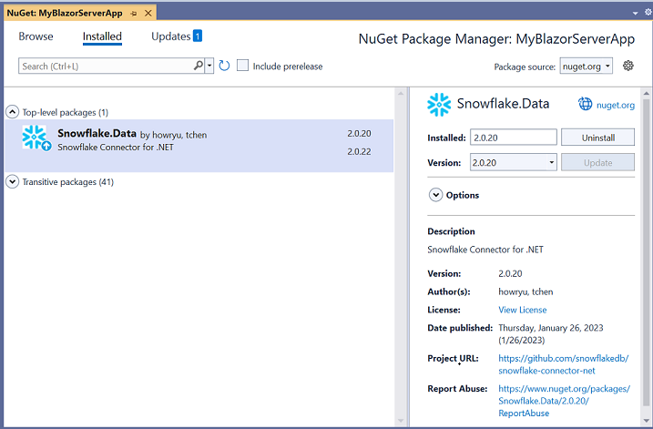
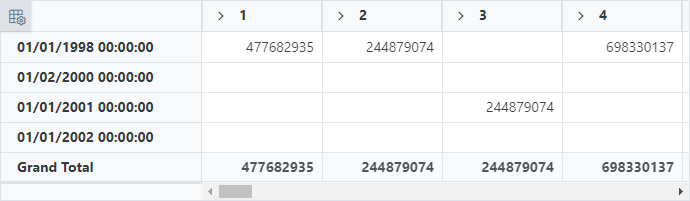
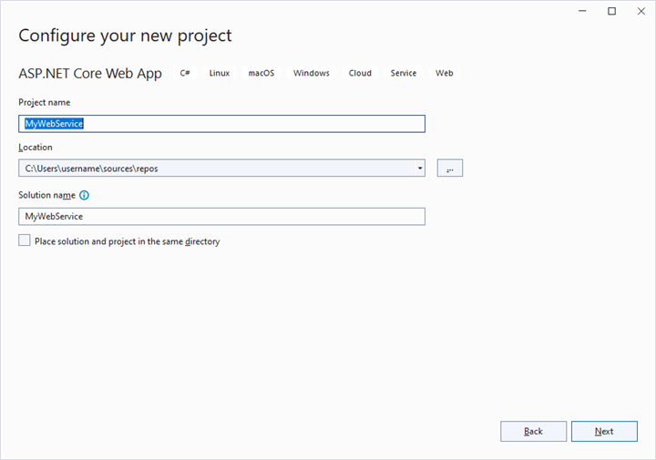
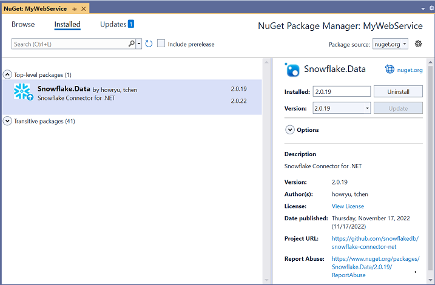
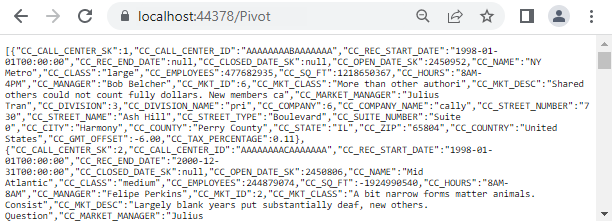

# Snowflake Data Binding in Blazor Pivot Table Component

This guide explains how to connect a Snowflake database to the [Blazor Pivot Table](https://www.syncfusion.com/blazor-components/blazor-pivot-table) using the [Snowflake.Data](https://www.nuget.org/packages/Snowflake.Data) NuGet package. It covers two methods: directly retrieving and binding Snowflake data to the Pivot Table and using a Web API service to fetch and display Snowflake data.

## Connecting a Snowflake to a Syncfusion<sup style="font-size:70%">&reg;</sup> Blazor Pivot Table

This section describes how to connect the [Blazor Pivot Table](https://www.syncfusion.com/blazor-components/blazor-pivot-table) to a Snowflake database by directly retrieving data using the [Snowflake.Data](https://www.nuget.org/packages/Snowflake.Data) library.

### Step 1: Set up a Blazor Pivot Table
1. Create a [Blazor Pivot Table](https://www.syncfusion.com/blazor-components/blazor-pivot-table) by following the [Getting Started](../getting-started) guide.

### Step 2: Install the Snowflake.Data NuGet Package
1. Open the **NuGet Package Manager** in your project solution and search for [Snowflake.Data](https://www.nuget.org/packages/Snowflake.Data/).
2. Install the [Snowflake.Data](https://www.nuget.org/packages/Snowflake.Data/) package to add Snowflake support.



### Step 3: Connect to the Snowflake Database
In the **Index.razor** file, under the `OnInitialized` method, use the [Snowflake.Data](https://www.nuget.org/packages/Snowflake.Data) library to connect to the Snowflake database and retrieve data for the Pivot Table.

1. **Establish connection**: Use `SnowflakeDbConnection` with a valid connection string, such as `account=myaccount;user=myuser;password=mypassword;db=mydb;schema=myschema;`, to connect to the Snowflake database.
2. **Query and fetch data**: Execute a SQL query, such as `SELECT * FROM CALL_CENTER`, using `SnowflakeDbDataAdapter` to retrieve data.
3. **Structure the data**: Use the `Fill` method of `SnowflakeDbDataAdapter` to populate the query results into a `DataTable`, which is then converted to a list for binding to the Pivot Table.

### Step 4: Bind Data to the Pivot Table
1. Assign the retrieved list to the [DataSource](https://help.syncfusion.com/cr/blazor/Syncfusion.Blazor.PivotView.PivotViewDataSourceSettings-1.html#Syncfusion_Blazor_PivotView_PivotViewDataSourceSettings_1_DataSource) property of the [PivotViewDataSourceSettings](https://help.syncfusion.com/cr/blazor/Syncfusion.Blazor.PivotView.DataSourceSettingsModel-1.html).
2. Configure the Pivot Table by defining fields in the [PivotViewColumns](https://help.syncfusion.com/cr/blazor/Syncfusion.Blazor.PivotView.PivotViewDataSourceSettings-1.html#Syncfusion_Blazor_PivotView_PivotViewDataSourceSettings_1_Columns), [PivotViewRows](https://help.syncfusion.com/cr/blazor/Syncfusion.Blazor.PivotView.PivotViewDataSourceSettings-1.html#Syncfusion_Blazor_PivotView_PivotViewDataSourceSettings_1_Rows), [PivotViewValues](https://help.syncfusion.com/cr/blazor/Syncfusion.Blazor.PivotView.PivotViewDataSourceSettings-1.html#Syncfusion_Blazor_PivotView_PivotViewDataSourceSettings_1_Values), and [PivotViewFormatSettings](https://help.syncfusion.com/cr/blazor/Syncfusion.Blazor.PivotView.PivotViewDataSourceSettings-1.html#Syncfusion_Blazor_PivotView_PivotViewDataSourceSettings_1_FormatSettings) to organize and format the data.

```cshtml
@using Syncfusion.Blazor.PivotView
@using Snowflake.Data.Client
@using System.Data

<SfPivotView TValue="SnowflakeService" Width="1000" Height="300" ShowFieldList="true">
    <PivotViewDataSourceSettings TValue="SnowflakeService" DataSource="@dataSource" ExpandAll=false EnableSorting=true>
        <PivotViewColumns>
            <PivotViewColumn Name="CC_CALL_CENTER_SK"></PivotViewColumn>
            <PivotViewColumn Name="CC_SQ_FT"></PivotViewColumn>
        </PivotViewColumns>
        <PivotViewRows>
            <PivotViewRow Name="CC_REC_START_DATE"></PivotViewRow>
        </PivotViewRows>
        <PivotViewValues>
            <PivotViewValue Name="CC_EMPLOYEES"></PivotViewValue>
        </PivotViewValues>
        <PivotViewFormatSettings>
            <PivotViewFormatSetting Name="CC_EMPLOYEES" Format="N0"></PivotViewFormatSetting>
        </PivotViewFormatSettings>
    </PivotViewDataSourceSettings>
    <PivotViewGridSettings ColumnWidth="120"></PivotViewGridSettings>
</SfPivotView>

@code {
    private List<SnowflakeService> dataSource;

    protected override void OnInitialized()
    {
        using (SnowflakeDbConnection snowflakeConnection = new SnowflakeDbConnection())
        {
            List<SnowflakeService> snowflakeList = new List<SnowflakeService>();
            // Replace with your own connection string.
            snowflakeConnection.ConnectionString = "<Enter your valid connection string here>";
            snowflakeConnection.Open();
            SnowflakeDbDataAdapter adapter = new SnowflakeDbDataAdapter("select * from CALL_CENTER", snowflakeConnection);
            DataTable dataTable = new DataTable();
            adapter.Fill(dataTable);
            snowflakeConnection.Close();
            snowflakeList = dataTable.AsEnumerable().Select(r => new SnowflakeService
            {
                CC_CALL_CENTER_SK = r.Field<int>("CC_CALL_CENTER_SK"),
                CC_CALL_CENTER_ID = r.Field<string>("CC_CALL_CENTER_ID"),
                CC_EMPLOYEES = r.Field<int?>("CC_EMPLOYEES"),
                CC_SQ_FT = r.Field<int>("CC_SQ_FT"),
                CC_REC_END_DATE = r.Field<DateTime?>("CC_REC_END_DATE"),
                CC_REC_START_DATE = r.Field<DateTime?>("CC_REC_START_DATE"),
            }).ToList();
            this.dataSource = snowflakeList;
        }
    }

    public class SnowflakeService
    {
        public int CC_CALL_CENTER_SK { get; set; }
        public string CC_CALL_CENTER_ID { get; set; }
        public int? CC_EMPLOYEES { get; set; }
        public int CC_SQ_FT { get; set; }
        public DateTime? CC_REC_END_DATE { get; set; }
        public DateTime? CC_REC_START_DATE { get; set; }
    }
}
```

### Step 5: Run and Verify the Pivot Table
1. Run the Blazor application.
2. The Pivot Table displays the Snowflake data, organized according to the defined configuration.
3. The resulting Pivot Table will look like this:



## Connecting a Snowflake database to a Syncfusion<sup style="font-size:70%">&reg;</sup> Blazor Pivot Table via Web API service

This section explains how to create a Web API service to fetch data from a Snowflake database and connect it to the [Blazor Pivot Table](https://www.syncfusion.com/blazor-components/blazor-pivot-table).

### Create a Web API Service to Fetch Snowflake Data

Follow these steps to set up a Web API service that retrieves Snowflake data for the Pivot Table.

#### Step 1: Create an ASP.NET Core Web Application
1. Open Visual Studio and create a new ASP.NET Core Web App project named **MyWebService**.
2. Refer to the [Microsoft documentation](https://learn.microsoft.com/en-us/visualstudio/get-started/csharp/tutorial-aspnet-core?view=vs-2022) for detailed setup instructions.



#### Step 2: Install the Snowflake.Data NuGet Package
1. Open the NuGet Package Manager in your project solution.
2. Search for and install the [Snowflake.Data](https://www.nuget.org/packages/Snowflake.Data) package to enable Snowflake connectivity.



#### Step 3: Create a Web API Controller
1. In the **Controllers** folder, create a new Web API controller named **PivotController.cs**.
2. This controller manages data communication between the Snowflake database and the Pivot Table.

#### Step 4: Connect to Snowflake and Retrieve Data
In the **PivotController.cs** file, use the [Snowflake.Data](https://www.nuget.org/packages/Snowflake.Data) library to connect to the Snowflake database and fetch data.

1. **Establish connection**: Use `SnowflakeDbConnection` with a valid connection string to access the Snowflake database.
2. **Fetch data**: Run a SQL query, such as `SELECT * FROM CALL_CENTER`, using `SnowflakeDbDataAdapter` to retrieve data.
3. **Prepare data**: Use the `Fill` method of `SnowflakeDbDataAdapter` to store the query results in a `DataTable` for JSON serialization.

```csharp
using Microsoft.AspNetCore.Mvc;
using Snowflake.Data.Client;
using Newtonsoft.Json;
using System.Data;

namespace MyWebService.Controllers
{
    [ApiController]
    [Route("[controller]")]
    public class PivotController : ControllerBase
    {
        public static DataTable FetchSnowflakeResult()
        {
            using (SnowflakeDbConnection snowflakeConnection = new SnowflakeDbConnection())
            {
                // Replace with your own connection string.
                snowflakeConnection.ConnectionString = "<Enter your valid connection string here>";
                snowflakeConnection.Open();
                SnowflakeDbDataAdapter adapter = new SnowflakeDbDataAdapter("select * from CALL_CENTER", snowflakeConnection);
                DataTable dataTable = new DataTable();
                adapter.Fill(dataTable);
                snowflakeConnection.Close();
                return dataTable;
            }
        }
    }
}
```

#### Step 5: Serialize Data to JSON
1. In the **PivotController.cs** file, create a `Get` method that calls `FetchSnowflakeResult` to retrieve Snowflake data.
2. Use `JsonConvert.SerializeObject` from the [Newtonsoft.Json](https://www.nuget.org/packages/Newtonsoft.Json) library to serialize the `DataTable` into JSON format.

> Ensure the [Newtonsoft.Json](https://www.nuget.org/packages/Newtonsoft.Json) NuGet package is installed in your project.

```csharp
using Microsoft.AspNetCore.Mvc;
using Snowflake.Data.Client;
using Newtonsoft.Json;
using System.Data;

namespace MyWebService.Controllers
{
    [ApiController]
    [Route("[controller]")]
    public class PivotController : ControllerBase
    {
        [HttpGet(Name = "GetSnowflakeResult")]
        public object Get()
        {
            return JsonConvert.SerializeObject(FetchSnowflakeResult());
        }

        public static DataTable FetchSnowflakeResult()
        {
            using (SnowflakeDbConnection snowflakeConnection = new SnowflakeDbConnection())
            {
                // Replace with your own connection string.
                snowflakeConnection.ConnectionString = "<Enter your valid connection string here>";
                snowflakeConnection.Open();
                SnowflakeDbDataAdapter adapter = new SnowflakeDbDataAdapter("select * from CALL_CENTER", snowflakeConnection);
                DataTable dataTable = new DataTable();
                adapter.Fill(dataTable);
                snowflakeConnection.Close();
                return dataTable;
            }
        }
    }
}
```

#### Step 6: Run the Web API Service
1. Build and run the application.
2. The application will be hosted at `https://localhost:44378/` (the port number may vary).

#### Step 7: Verify the JSON Data
1. Access the Web API endpoint at `https://localhost:44378/Pivot` to view the JSON data retrieved from the Snowflake database.
2. The browser will display the JSON data, as shown below.



### Connecting the Pivot Table to a Snowflake Database Using the Web API Service

This section explains how to connect the [Blazor Pivot Table](https://www.syncfusion.com/blazor-components/blazor-pivot-table) to Snowflake data retrieved via the Web API service.

#### Step 1: Set up a Blazor Pivot Table
1. Create a [Blazor Pivot Table](https://www.syncfusion.com/blazor-components/blazor-pivot-table) by following the [Getting Started](../getting-started) guide.

#### Step 2: Configure the Web API URL
1. In the **Index.razor** file, map the Web API URL (`https://localhost:44378/Pivot`) to the Pivot Table using the [Url](https://help.syncfusion.com/cr/blazor/Syncfusion.Blazor.PivotView.PivotViewDataSourceSettings-1.html#Syncfusion_Blazor_PivotView_PivotViewDataSourceSettings_1_Url) property of [PivotViewDataSourceSettings](https://help.syncfusion.com/cr/blazor/Syncfusion.Blazor.PivotView.DataSourceSettingsModel-1.html).
2. The [Url](https://help.syncfusion.com/cr/blazor/Syncfusion.Blazor.PivotView.PivotViewDataSourceSettings-1.html#Syncfusion_Blazor_PivotView_PivotViewDataSourceSettings_1_Url) property deserialize Snowflake data into instances of your model data class (e.g., `TValue="SnowflakeService"`) for binding to the Pivot Table.

#### Step 3: Define the Pivot Table Report
1. Configure the Pivot Table by defining fields in the [PivotViewColumns](https://help.syncfusion.com/cr/blazor/Syncfusion.Blazor.PivotView.PivotViewDataSourceSettings-1.html#Syncfusion_Blazor_PivotView_PivotViewDataSourceSettings_1_Columns), [PivotViewRows](https://help.syncfusion.com/cr/blazor/Syncfusion.Blazor.PivotView.PivotViewDataSourceSettings-1.html#Syncfusion_Blazor_PivotView_PivotViewDataSourceSettings_1_Rows), [PivotViewValues](https://help.syncfusion.com/cr/blazor/Syncfusion.Blazor.PivotView.PivotViewDataSourceSettings-1.html#Syncfusion_Blazor_PivotView_PivotViewDataSourceSettings_1_Values), and [PivotViewFormatSettings](https://help.syncfusion.com/cr/blazor/Syncfusion.Blazor.PivotView.PivotViewDataSourceSettings-1.html#Syncfusion_Blazor_PivotView_PivotViewDataSourceSettings_1_FormatSettings) properties.
2. Enable the field list by setting [ShowFieldList](https://help.syncfusion.com/cr/blazor/Syncfusion.Blazor.PivotView.SfPivotView-1.html#Syncfusion_Blazor_PivotView_SfPivotView_1_ShowFieldList) to `true` for interactive field management.

```cshtml
@using Syncfusion.Blazor.PivotView

<SfPivotView TValue="SnowflakeService" Width="1000" Height="300" ShowFieldList="true">
    <PivotViewDataSourceSettings TValue="SnowflakeService" Url="https://localhost:44378/Pivot" ExpandAll=false EnableSorting=true>
        <PivotViewColumns>
            <PivotViewColumn Name="CC_CALL_CENTER_SK"></PivotViewColumn>
            <PivotViewColumn Name="CC_SQ_FT"></PivotViewColumn>
        </PivotViewColumns>
        <PivotViewRows>
            <PivotViewRow Name="CC_REC_START_DATE"></PivotViewRow>
        </PivotViewRows>
        <PivotViewValues>
            <PivotViewValue Name="CC_EMPLOYEES"></PivotViewValue>
        </PivotViewValues>
        <PivotViewFormatSettings>
            <PivotViewFormatSetting Name="CC_EMPLOYEES" Format="N0"></PivotViewFormatSetting>
        </PivotViewFormatSettings>
    </PivotViewDataSourceSettings>
    <PivotViewGridSettings ColumnWidth="120"></PivotViewGridSettings>
</SfPivotView>

@code {
    public class SnowflakeService
    {
        public int CC_CALL_CENTER_SK { get; set; }
        public string CC_CALL_CENTER_ID { get; set; }
        public int? CC_EMPLOYEES { get; set; }
        public int CC_SQ_FT { get; set; }
        public DateTime? CC_REC_END_DATE { get; set; }
        public DateTime? CC_REC_START_DATE { get; set; }
    }
}
```

#### Step 4: Run and Verify the Pivot Table
1. Run the Blazor application.
2. The Pivot Table displays the Snowflake data fetched via the Web API, structured according to the defined configuration.
3. The resulting Pivot Table will look like this:


### Additional Resources
Explore a complete example of the [Blazor Pivot Table](https://www.syncfusion.com/blazor-components/blazor-pivot-table) integrated with an ASP.NET Core Web application to fetch data from a Snowflake database in this [GitHub repository](https://github.com/SyncfusionExamples/web-bind-Snowflake-database-to-pivot-table/tree/master/Blazor).