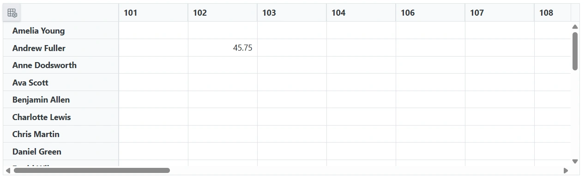

# Connect SQLite to a Blazor Pivot Table Using the URL Adaptor

The [Blazor Pivot Table](https://www.syncfusion.com/blazor-components/blazor-pivot-table) can load and edit SQLite data through an ASP.NET Core API. [`SfDataManager`](https://help.syncfusion.com/cr/blazor/Syncfusion.Blazor.Data.SfDataManager.html) sends HTTP requests to the API, and the API uses [`Microsoft.Data.Sqlite`](https://www.nuget.org/packages/Microsoft.Data.Sqlite/) to access the SQLite database.

This guide uses same-origin relative API URLs. The sample read action returns the complete `Orders` table and does not apply `DataManagerRequest` operations. Add server-side filtering, sorting, and paging before using this design with large datasets.

## Prerequisites

The sample was tested with the following versions and configuration:

| Software or package | Version | Notes |
|---|---:|---|
| .NET SDK | 10.0 | Required to target `net10.0` |
| Visual Studio | 2022 17.14 or later | Install the ASP.NET and web development workload; VS Code and the .NET CLI are also supported |
| SQLite | 3.x or later | The engine ships with the database file; a command-line or GUI tool is needed to create the schema |
| Syncfusion.Blazor.PivotTable | `{{site.blazorversion}}` | Keep all Syncfusion packages on the same version |
| Syncfusion.Blazor.Themes | `{{site.blazorversion}}` | Provides the component theme |
| Microsoft.Data.Sqlite | 9.0.0 | SQLite ADO.NET provider |
| Newtonsoft.Json | 13.0.3 | JSON serialization support for the CRUD models |

The application uses the Blazor Web App template with Interactive Server rendering. Syncfusion packages from NuGet.org require a valid license or trial key; follow the [license-key registration instructions](https://blazor.syncfusion.com/documentation/getting-started/license-key/how-to-register-in-an-application).

## Step 1: Create the Blazor Web App

Create an Interactive Server Blazor Web App:

```powershell
dotnet new blazor -n PivotTableSQLite -f net10.0 -int Server
cd PivotTableSQLite
```

In Visual Studio, the equivalent choices are **Blazor Web App**, **.NET 10**, **Interactive render mode: Server**, and **Interactivity location: Global**.

## Step 2: Create the SQLite Database

SQLite stores an entire database in a single file, so there is no server to install or configure. Download the SQLite tools from the [SQLite download page](https://www.sqlite.org/download.html) and use either the `sqlite3` command-line shell or a GUI client such as DB Browser for SQLite.

Create the database file `Orders.db` and open it:

```powershell
sqlite3 Orders.db
```

Run the following script to create the `Orders` table and seed it with sample rows:

```sql
CREATE TABLE IF NOT EXISTS Orders
(
    OrderID      INTEGER PRIMARY KEY AUTOINCREMENT,
    CustomerName TEXT    NULL,
    EmployeeID   INTEGER NULL,
    ShipCity     TEXT    NULL,
    Freight      REAL    NULL
);

INSERT INTO Orders (CustomerName, EmployeeID, ShipCity, Freight)
VALUES
    ('Toms', 1, 'New York', 35.30),
    ('Ravi', 2, 'London',   80.20),
    ('Sven', 1, 'Berlin',   52.10),
    ('Sara', 3, 'Madrid',   18.40),
    ('Paul', 2, 'Tokyo',    64.75);
```

Verify the inserted data:

```sql
SELECT OrderID, CustomerName, EmployeeID, ShipCity, Freight
FROM Orders
ORDER BY OrderID;
```

Expected output:

| OrderID | CustomerName | EmployeeID | ShipCity  | Freight |
|---:|---|---:|---|---:|
| 1 | Toms | 1 | New York | 35.30 |
| 2 | Ravi | 2 | London  | 80.20 |
| 3 | Sven | 1 | Berlin  | 52.10 |
| 4 | Sara | 3 | Madrid  | 18.40 |
| 5 | Paul | 2 | Tokyo   | 64.75 |

Copy the generated `Orders.db` file to a location the ASP.NET Core application can read, and use that path in the connection string configured in the next steps.

## Step 3: Install the Required NuGet Packages

Run these commands in the `PivotTableSQLite` project directory:

```powershell
dotnet add package Syncfusion.Blazor.PivotTable --version {{site.blazorversion}}
dotnet add package Syncfusion.Blazor.Themes --version {{site.blazorversion}}
dotnet add package Microsoft.Data.Sqlite --version 9.0.0
dotnet add package Newtonsoft.Json --version 13.0.3
```

The project file should contain:

```xml
<ItemGroup>
  <PackageReference Include="Microsoft.Data.Sqlite" Version="9.0.0" />
  <PackageReference Include="Newtonsoft.Json" Version="13.0.3" />
  <PackageReference Include="Syncfusion.Blazor.PivotTable" Version="{{site.blazorversion}}" />
  <PackageReference Include="Syncfusion.Blazor.Themes" Version="{{site.blazorversion}}" />
</ItemGroup>
```

## Step 4: Configure the Connection String

Store the SQLite connection string in `appsettings.json`:

```json
{
  "ConnectionStrings": {
    "SQLite": "Data Source=<DATABASE_FILE_NAME>"
  },
  "Logging": {
    "LogLevel": {
      "Default": "Information",
      "Microsoft.AspNetCore": "Warning"
    }
  },
  "AllowedHosts": "*"
}
```

> **Note:** Replace `<DATABASE_FILE_NAME>` with the actual SQLite database file name or the full path to the database file used in your environment. For example, `Data Source=Orders.db` for a file in the application working directory, or `Data Source=C:/Data/Orders.db` for an absolute path.

For deployment, store the connection string through the hosting environment or a secrets manager (such as .NET user secrets for local development) rather than committing production paths to source control.

## Step 5: Create the API Controller

Create a `Controllers` folder at the project root, and then create `Controllers/OrderController.cs`. In this sample, the `Order` model and the `CRUDModel<T>` wrapper are defined inside `OrderController.cs` rather than in a separate file. The same `Order` shape is also declared in the Pivot Table page (`Home.razor`) so the component can strongly type its data source. Keeping the model close to the code that uses it makes the contract between the controller and the page easy to follow.

```csharp
using System.ComponentModel.DataAnnotations;
using System.Text.Json.Serialization;
using Microsoft.AspNetCore.Mvc;
using Microsoft.Data.Sqlite;
using Syncfusion.Blazor.Data;
using Syncfusion.Blazor;

namespace PivotTableSQLite.Controllers
{
    [ApiController]
    [Route("api/[controller]")]
    public class OrderController : ControllerBase
    {
        private readonly string connectionString;

        public OrderController(IConfiguration configuration)
        {
            connectionString = configuration.GetConnectionString("SQLite")
                ?? throw new InvalidOperationException(
                    "The SQLite connection string is not configured.");
        }

        [HttpPost]
        public object Post([FromBody] DataManagerRequest request)
        {
            _ = request;

            List<Order> dataSource = GetOrderData();

            return new
            {
                result = dataSource,
                count = dataSource.Count
            };
        }

        private List<Order> GetOrderData()
        {
            List<Order> orders = new();

            const string query =
                @"SELECT
                    OrderID,
                    CustomerName,
                    EmployeeID,
                    Freight,
                    ShipCity
                  FROM Orders
                  ORDER BY OrderID";

            using SqliteConnection connection = new(connectionString);
            connection.Open();

            using SqliteCommand command = new(query, connection);
            using SqliteDataReader reader = command.ExecuteReader();

            while (reader.Read())
            {
                orders.Add(new Order
                {
                    OrderID = reader.IsDBNull(0) ? null : reader.GetInt32(0),
                    CustomerName = reader.IsDBNull(1) ? null : reader.GetString(1),
                    EmployeeID = reader.IsDBNull(2) ? null : reader.GetInt32(2),
                    Freight = reader.IsDBNull(3) ? null : Convert.ToDecimal(reader.GetDouble(3)),
                    ShipCity = reader.IsDBNull(4) ? null : reader.GetString(4)
                });
            }

            return orders;
        }

        [HttpPost("Insert")]
        public IActionResult Insert([FromBody] CRUDModel<Order> value)
        {
            if (value.Value is not Order order
                || string.IsNullOrWhiteSpace(order.CustomerName)
                || !order.EmployeeID.HasValue)
            {
                return BadRequest(
                    "CustomerName and EmployeeID are required.");
            }

            const string query =
                @"INSERT INTO Orders
                    (CustomerName, EmployeeID, Freight, ShipCity)
                  VALUES
                    (@CustomerName, @EmployeeID, @Freight, @ShipCity)";

            using SqliteConnection connection = new(connectionString);
            connection.Open();

            using SqliteCommand command = new(query, connection);

            command.Parameters.AddWithValue(
                "@CustomerName",
                order.CustomerName);

            command.Parameters.AddWithValue(
                "@EmployeeID",
                order.EmployeeID.Value);

            command.Parameters.AddWithValue(
                "@Freight",
                order.Freight.HasValue
                    ? order.Freight.Value
                    : DBNull.Value);

            command.Parameters.AddWithValue(
                "@ShipCity",
                order.ShipCity ?? (object)DBNull.Value);

            command.ExecuteNonQuery();

            return Ok(order);
        }

        [HttpPost("Update")]
        public IActionResult Update([FromBody] CRUDModel<Order> value)
        {
            if (value.Value is not Order order
                || !order.OrderID.HasValue
                || string.IsNullOrWhiteSpace(order.CustomerName)
                || !order.EmployeeID.HasValue)
            {
                return BadRequest(
                    "OrderID, CustomerName and EmployeeID are required.");
            }

            const string query =
                @"UPDATE Orders
                  SET CustomerName = @CustomerName,
                      EmployeeID = @EmployeeID,
                      Freight = @Freight,
                      ShipCity = @ShipCity
                  WHERE OrderID = @OrderID";

            using SqliteConnection connection = new(connectionString);
            connection.Open();

            using SqliteCommand command = new(query, connection);

            command.Parameters.AddWithValue(
                "@CustomerName",
                order.CustomerName);

            command.Parameters.AddWithValue(
                "@EmployeeID",
                order.EmployeeID.Value);

            command.Parameters.AddWithValue(
                "@Freight",
                order.Freight.HasValue
                    ? order.Freight.Value
                    : DBNull.Value);

            command.Parameters.AddWithValue(
                "@ShipCity",
                order.ShipCity ?? (object)DBNull.Value);

            command.Parameters.AddWithValue(
                "@OrderID",
                order.OrderID.Value);

            int rowsAffected = command.ExecuteNonQuery();

            return rowsAffected == 0
                ? NotFound()
                : Ok(order);
        }

        [HttpPost("Delete")]
        public IActionResult Delete([FromBody] CRUDModel<Order> value)
        {
            if (!int.TryParse(value.Key?.ToString(), out int orderId))
            {
                return BadRequest(
                    "A numeric order key is required.");
            }

            const string query =
                @"DELETE FROM Orders
                  WHERE OrderID = @OrderID";

            using SqliteConnection connection = new(connectionString);
            connection.Open();

            using SqliteCommand command = new(query, connection);

            command.Parameters.AddWithValue(
                "@OrderID",
                orderId);

            int rowsAffected = command.ExecuteNonQuery();

            return rowsAffected == 0
                ? NotFound()
                : NoContent();
        }

        public class Order
        {
            [Key]
            public int? OrderID { get; set; }

            public string? CustomerName { get; set; }

            public int? EmployeeID { get; set; }

            public decimal? Freight { get; set; }

            public string? ShipCity { get; set; }
        }

        public class CRUDModel<T> where T : class
        {
            [JsonPropertyName("action")]
            public string? Action { get; set; }

            [JsonPropertyName("keyColumn")]
            public string? KeyColumn { get; set; }

            [JsonPropertyName("key")]
            public object? Key { get; set; }

            [JsonPropertyName("value")]
            public T? Value { get; set; }

            [JsonPropertyName("added")]
            public List<T>? Added { get; set; }

            [JsonPropertyName("changed")]
            public List<T>? Changed { get; set; }

            [JsonPropertyName("deleted")]
            public List<T>? Deleted { get; set; }

            [JsonPropertyName("params")]
            public IDictionary<string, object>? Params { get; set; }
        }
    }
}
```

### CRUD Operations and the URL Adaptor Contract

The controller exposes four endpoints that together provide full create, read, update, and delete behavior for the Pivot Table drill-through editor. The Syncfusion URL Adaptor translates component data operations into `POST` requests with a JSON body, and the Pivot Table's `SfDataManager` is configured with `Adaptor="Adaptors.UrlAdaptor"` and four URLs: `Url` (read/refresh), `InsertUrl`, `UpdateUrl`, and `RemoveUrl`. Each request body uses the `CRUDModel<Order>` shape (for write actions) or the `DataManagerRequest` shape (for the read action), so the controller and the adaptor share a common contract.

**Read** — `POST /api/Order` (the `Url` endpoint)

The default `Post` action accepts a `DataManagerRequest` to satisfy the URL Adaptor read contract. The sample deliberately ignores the request's server-side `where`, `sorted`, and `skip/take` parameters and returns the entire `Orders` table, ordered by `OrderID`. The response shape is `{ result, count }`, which the URL Adaptor expects.

**Insert** — `POST /api/Order/Insert` (the `InsertUrl` endpoint)

The `Insert` action receives a `CRUDModel<Order>` whose `Value` property carries the new record. It validates that `CustomerName` and `EmployeeID` are present, then runs a parameterized `INSERT` against the `Orders` table. Because `OrderID` is an `INTEGER PRIMARY KEY AUTOINCREMENT` column, SQLite generates the value automatically.

**Update** — `POST /api/Order/Update` (the `UpdateUrl` endpoint)

The `Update` action receives a `CRUDModel<Order>` whose `Value` contains the modified record, including the key field `OrderID`. It runs a parameterized `UPDATE` statement scoped to that `OrderID` and returns `404` when no row matches.

**Delete** — `POST /api/Order/Delete` (the `RemoveUrl` endpoint)

The `Delete` action receives a `CRUDModel<Order>` whose `Key` property holds the primary key of the record to remove. It parses the key, runs a parameterized `DELETE`, and returns `204` on success or `404` when the row does not exist.

## Step 6: Configure Program.cs

Replace `Program.cs` with:

```csharp
using PivotTableSQLite.Components;
using Syncfusion.Blazor;

var builder = WebApplication.CreateBuilder(args);

// Register the Syncfusion license before builder.Build().
// Syncfusion packages require a valid license or trial key.
// Syncfusion.Licensing.SyncfusionLicenseProvider.RegisterLicense(
//     "YOUR LICENSE KEY");

builder.Services.AddSyncfusionBlazor();

// Add services to the container.
builder.Services.AddRazorComponents()
    .AddInteractiveServerComponents();

builder.Services.AddControllers();

var app = builder.Build();

// Configure the HTTP request pipeline.
if (!app.Environment.IsDevelopment())
{
    app.UseExceptionHandler("/Error", createScopeForErrors: true);
    app.UseHsts();
}

app.UseHttpsRedirection();

app.MapControllers();

app.UseAntiforgery();

app.MapStaticAssets();

app.MapRazorComponents<App>()
    .AddInteractiveServerRenderMode();

app.Run();
```

Key registration points:

- `AddSyncfusionBlazor()` registers the Syncfusion Blazor services required by the Pivot Table.
- `AddRazorComponents().AddInteractiveServerComponents()` enables Interactive Server rendering.
- `AddControllers()` registers the API controllers, including `OrderController`.
- `MapControllers()` routes requests to the API endpoints.
- `MapStaticAssets()` serves the Syncfusion theme stylesheet and scripts.

> **Note:** Remove the comment markers and fill in your Syncfusion license or trial key in `Program.cs` before running the application. Follow the [license-key registration instructions](https://blazor.syncfusion.com/documentation/getting-started/license-key/how-to-register-in-an-application) for details.

The API is same-origin, so CORS configuration is not required. If the API is later hosted on another origin, configure an explicit CORS policy that allows only the Blazor application's origin.

Protect the write endpoints with the authentication and authorization mechanism used by your application before production deployment. If cookie-authenticated API actions require antiforgery validation, configure `SfDataManager` to send the request token expected by the server.

## Step 7: Configure the Pivot Table

Add these namespaces to `Components/_Imports.razor`:

```cshtml
@using Syncfusion.Blazor
@using Syncfusion.Blazor.PivotView
```

In `Components/App.razor`, add the Syncfusion stylesheet inside `<head>`:

```html
<link href="_content/Syncfusion.Blazor.Themes/bootstrap5.css"
      rel="stylesheet" />
```

Add the Syncfusion script immediately before `</body>`, after the template's existing `_framework/blazor.web.js` reference:

```html
<script src="_content/Syncfusion.Blazor.Core/scripts/syncfusion-blazor.min.js"
        type="text/javascript"></script>
```

Do not add a second `_framework/blazor.web.js` reference if the template already contains one. The completed `App.razor` should look like:

```html
<!DOCTYPE html>
<html lang="en">

<head>
    <meta charset="utf-8" />
    <meta name="viewport" content="width=device-width, initial-scale=1.0" />
    <base href="/" />
    <link rel="stylesheet" href="@Assets["lib/bootstrap/dist/css/bootstrap.min.css"]" />
    <link rel="stylesheet" href="@Assets["app.css"]" />
    <link rel="stylesheet" href="@Assets["PivotTableSQLite.styles.css"]" />
    <ImportMap />
    <link rel="icon" type="image/png" href="favicon.png" />
    <HeadOutlet @rendermode="InteractiveServer" />
    <link href="_content/Syncfusion.Blazor.Themes/bootstrap5.css" rel="stylesheet" />
</head>

<body>
    <Routes @rendermode="InteractiveServer" />
    <script src="_framework/blazor.web.js"></script>
    <script src="_content/Syncfusion.Blazor.Core/scripts/syncfusion-blazor.min.js" type="text/javascript"></script>
</body>

</html>
```

Replace `Components/Pages/Home.razor` with the following markup. The `SfDataManager` URLs use same-origin relative paths (`/api/Order`, `/api/Order/Insert`, etc.) so they resolve against whatever port the application is launched on, avoiding hard-coded development ports and HTTP-to-HTTPS mixed-content failures:

```cshtml
@page "/"
@using Syncfusion.Blazor.Data
@using Syncfusion.Blazor.PivotView

<SfPivotView TValue="Order" Width="1000" Height="300" ShowFieldList="true">
    <PivotViewDataSourceSettings TValue="Order" ExpandAll=false EnableSorting=true>
    <SfDataManager Url="http://localhost:5145/api/Order" InsertUrl="http://localhost:5145/api/Order/Insert" UpdateUrl="http://localhost:5145/api/Order/Update" RemoveUrl="http://localhost:5145/api/Order/Delete" Adaptor="Adaptors.UrlAdaptor"></SfDataManager>
        <PivotViewColumns>
            <PivotViewColumn Name="EmployeeID"></PivotViewColumn>
        </PivotViewColumns>
        <PivotViewRows>
            <PivotViewRow Name="CustomerName"></PivotViewRow>
        </PivotViewRows>
        <PivotViewValues>
            <PivotViewValue Name="Freight" Caption="Freight"></PivotViewValue>
        </PivotViewValues>
    </PivotViewDataSourceSettings>
    <PivotViewGridSettings ColumnWidth="120"></PivotViewGridSettings>
    <PivotViewEvents TValue="Order" BeginDrillThrough="beginDrillThrough"></PivotViewEvents>
    <PivotViewCellEditSettings AllowEditing=true AllowAdding=true AllowDeleting=true Mode=Syncfusion.Blazor.PivotView.EditMode.Normal></PivotViewCellEditSettings>
</SfPivotView>

@code{
    private void beginDrillThrough(BeginDrillThroughEventArgs args)
    {
        // Configure beginDrillThrough event to set the primary key for CRUD operations
        // Iterate through all columns in the drill-through Order
        for (int i = 0; i < args.GridObj.Columns.Count; i++)
        {
            // Check if the current column is the primary key column
            if (args.GridObj.Columns[i].Field == "OrderID")
            {
                // Mark this column as the primary key
                // This tells DataManager to use this column's value to uniquely identify records
                args.GridObj.Columns[i].IsPrimaryKey = true;
            }
            else
            {
                 args.GridObj.Columns[i].Visible = true; // Ensure other columns are visible in the drill-through grid
            }
        }
    }
    SfPivotView<Order> pivot { get; set; }

    public List<Order> Orders { get; set; }
    public class Order
    {
        public int OrderID { get; set; }
        public string CustomerName { get; set; }
        public int EmployeeID { get; set; }
        public decimal Freight { get; set; }
        public string ShipCity { get; set; }
    }
}
```

The `BeginDrillThrough` event is used to mark `OrderID` as the primary key on the drill-through grid. This tells the DataManager which column uniquely identifies each record so that insert, update, and delete requests carry the correct key. Without this configuration, the write operations cannot target the intended row.

> **Note:** Replace the `http://localhost:5145` base in the URLs with the actual port assigned to your application, or use same-origin relative URLs such as `/api/Order` to avoid hard-coded development ports and HTTP-to-HTTPS mixed-content failures.

## API Contract

| Method | Route | Payload | Success response |
|---|---|---|---|
| `POST` | `/api/Order` | `DataManagerRequest` | `200` with `{ result, count }` |
| `POST` | `/api/Order/Insert` | `CRUDModel<Order>` | `200` with the inserted record |
| `POST` | `/api/Order/Update` | `CRUDModel<Order>` | `200` with the updated record |
| `POST` | `/api/Order/Delete` | `CRUDModel<Order>` | `204` with no body |

The API uses action-oriented routes because they match the URL Adaptor's `InsertUrl`, `UpdateUrl`, and `RemoveUrl` contract.

Example read response:

```json
{
  "result": [
    {
      "orderID": 2,
      "customerName": "Ravi",
      "employeeID": 2,
      "freight": 80.20,
      "shipCity": "London"
    }
  ],
  "count": 1
}
```

Example insert request:

```json
{
  "action": "insert",
  "keyColumn": "orderID",
  "value": {
    "customerName": "Mei Chen",
    "employeeID": 4,
    "shipCity": "Sydney",
    "freight": 142.50
  }
}
```

Example update request:

```json
{
  "action": "update",
  "keyColumn": "orderID",
  "value": {
    "orderID": 3,
    "customerName": "Sven",
    "employeeID": 1,
    "shipCity": "Hamburg",
    "freight": 60.00
  }
}
```

Example delete request:

```json
{
  "action": "remove",
  "keyColumn": "orderID",
  "key": 5
}
```

## Run and Verify the Application

Restore, build, and run the project:

```powershell
dotnet restore
dotnet build
dotnet run
```

Open the URL shown in the terminal. Verify the following:

1. The Pivot Table displays `CustomerName` as rows, `EmployeeID` as columns, and the sum of `Freight` as values.
2. The browser Network panel shows `POST /api/Order` returning `200` with `result` and `count`.
3. Double-click a value (summary) cell to open its raw-record editor.
4. Add, edit, and delete a record, and confirm the corresponding API request succeeds.
5. Query the `Orders` table (using your SQLite client) to confirm the change was persisted locally. For deployed apps with no direct database access, re-open the drill-through editor and confirm the row reflects the change.



## Production Considerations

SQLite is ideal for local development, embedded scenarios, and small-to-medium workloads. Before using this design in production, consider the following:

- **Concurrency:** SQLite allows multiple readers but serializes writers. For write-heavy workloads, switch to a client-server database such as SQL Server or PostgreSQL.
- **Server-side data operations:** The sample returns the entire `Orders` table. Apply `DataManagerRequest` `where`, `sorted`, `skip`, and `take` parameters on the server before using this design with large datasets.
- **Connection string:** Store the connection string through the hosting environment or a secrets manager rather than committing production paths to source control.
- **File location:** Place the database file on durable storage with appropriate backup and recovery procedures. SQLite keeps the entire database in a single file.
- **Authentication and authorization:** Protect the write endpoints with the authentication and authorization mechanism used by your application.
- **Antiforgery:** If cookie-authenticated API actions require antiforgery validation, configure `SfDataManager` to send the request token expected by the server.
- **WAL mode:** For better concurrent read/write performance, consider enabling Write-Ahead Logging (`PRAGMA journal_mode=WAL;`) on the database.
- **Deployment:** For cross-origin hosting, configure an explicit CORS policy that allows only the Blazor application's origin.

## Troubleshooting

| Symptom | Resolution |
|---|---|
| Pivot Table shows no data | Inspect `POST /api/Order` in the browser Network panel and check the server log. A `GET` request from the browser address bar returns `405`. |
| `405 Method Not Allowed` | Confirm `[HttpPost]`, `AddControllers()`, and `MapControllers()` are present. |
| `No such table: Orders` | Create the `Orders` table in the database file pointed to by the connection string and confirm the connection string selects that file. |
| `The SQLite connection string is not configured.` | Add a `ConnectionStrings:SQLite` entry to `appsettings.json` and restart the application. |
| `Unable to open database file` | Confirm the database file path is valid and that the application process has read/write permission on the file and its folder. |
| The database file is locked | Ensure no other process holds an exclusive lock, and consider enabling WAL mode for concurrent access. |
| CRUD returns `400` | Inspect the request JSON and confirm required fields (`CustomerName`, `EmployeeID`) and a numeric key are present. |
| CRUD returns `404` | Confirm that the supplied `OrderID` exists and that `OrderID` is marked as the primary key in the `BeginDrillThrough` event handler. |
| CRUD returns `500` | Check the server log and verify the table schema, connection string, and file permissions. |
| Browser reports mixed content or a redirect failure | Confirm `Home.razor` uses same-origin relative URLs (for example `/api/Order`) rather than hard-coded HTTP URLs. |
| Cross-origin request is blocked | Prefer same-origin relative URLs; otherwise configure `AddCors` and `UseCors` for the exact Blazor application origin. |
| Antiforgery validation fails | Configure the adaptor to send the expected request token, or use an appropriate non-cookie API authentication scheme. |
| Large datasets are slow | Process `DataManagerRequest` operations on the server instead of returning the entire table. |

For current component behavior, see the [Pivot Table editing documentation](https://blazor.syncfusion.com/documentation/pivot-table/editing) and [Pivot Table data-binding documentation](https://blazor.syncfusion.com/documentation/pivot-table/data-binding).

## Complete Sample Repository

A complete, working sample implementation is available in the [GitHub repository](https://github.com/SyncfusionExamples/syncfusion-blazor-pivot-table-sqlite-database-binding-sample/tree/master).
