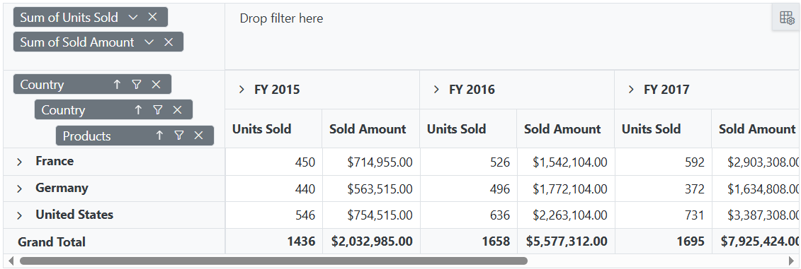

# CSS Customization in Blazor Pivot Table Component

## Hiding Axis

The visibility of row, column, value and filter axis in Field List and Grouping Bar can be changed using custom CSS setting.

```cshtml
@using Syncfusion.Blazor.PivotView
<SfPivotView TValue="ProductDetails" ID="PivotView" ShowGroupingBar="true" ShowFieldList="true">
    <PivotViewDataSourceSettings DataSource="@data">
        <PivotViewColumns>
            <PivotViewColumn Name="Year"></PivotViewColumn>
            <PivotViewColumn Name="Quarter"></PivotViewColumn>
        </PivotViewColumns>
        <PivotViewRows>
            <PivotViewRow Name="Country" ></PivotViewRow>
            <PivotViewRow Name="Country" ></PivotViewRow>
            <PivotViewRow Name="Products"></PivotViewRow>
        </PivotViewRows>
        <PivotViewValues>
            <PivotViewValue Name="Sold" Caption="Units Sold"></PivotViewValue>
            <PivotViewValue Name="Amount" Caption="Sold Amount"></PivotViewValue>
        </PivotViewValues>
        <PivotViewFormatSettings>
            <PivotViewFormatSetting Name="Amount" Format="C"></PivotViewFormatSetting>
        </PivotViewFormatSettings>
    </PivotViewDataSourceSettings>
</SfPivotView>

<style>

    /* Hiding column axis in grouping bar */
    #PivotView .e-group-columns {
        display: none;
    }
    /* Increasing filter axis height to fill column axis portion */
    #PivotView .e-group-filters {
        min-height: 74.67px !important;
    }

    /* Hiding column axis in field list */
    .e-pivotfieldlist-container .e-field-list-columns {
        display: none;
    }
    /* Increasing value axis height to fill column axis portion */
    .e-pivotfieldlist-container .e-field-list-values {
        margin-top: 0px !important;
        min-height: 338px !important;
    }
    .e-pivotfieldlist-container .e-values {
        height: 310px !important;
    }

    /* Hiding row axis in grouping bar */
    // #PivotView .e-group-rows {
    //     display: none;
    // }

    /* Hiding row axis in field list */
    // .e-pivotfieldlist-container .e-field-list-rows {
    //     display: none;
    // }

    /* Hiding value axis in grouping bar */
    // #PivotView .e-group-values {
    //     display: none;
    // }

    /* Hiding value axis in field list */
    // .e-pivotfieldlist-container .e-field-list-values {
    //     display: none;
    // }

    /* Hiding filter axis in grouping bar */
    // #PivotView .e-group-filters {
    //     display: none;
    // }

    /* Hiding filter axis in field list */
    //.e-pivotfieldlist-container .e-field-list-filters {
    //    display: none;
    //}

</style>

@code{
    public List<ProductDetails> data { get; set; }
    protected override void OnInitialized()
    {
        this.data = ProductDetails.GetProductData().ToList();
        //Bind the data source collection here. Refer "Assigning sample data to the pivot table" section in getting started for more details.
    }
}

```




## Text Alignment

The alignment of text inside row headers, column headers, value cells and summary cells can be changed using custom CSS setting.

```cshtml
@using Syncfusion.Blazor.PivotView
<SfPivotView TValue="ProductDetails">
    <PivotViewDataSourceSettings DataSource="@dataSource">
        <PivotViewColumns>
            <PivotViewColumn Name="Year"></PivotViewColumn>
            <PivotViewColumn Name="Quarter"></PivotViewColumn>
        </PivotViewColumns>
        <PivotViewRows>
            <PivotViewRow Name="Country" ></PivotViewRow>
            <PivotViewRow Name="Country" ></PivotViewRow>
            <PivotViewRow Name="Products"></PivotViewRow>
        </PivotViewRows>
        <PivotViewValues>
            <PivotViewValue Name="Sold" Caption="Units Sold"></PivotViewValue>
            <PivotViewValue Name="Amount" Caption="Sold Amount"></PivotViewValue>
        </PivotViewValues>
        <PivotViewFormatSettings>
            <PivotViewFormatSetting Name="Amount" Format="C"></PivotViewFormatSetting>
        </PivotViewFormatSettings>
    </PivotViewDataSourceSettings>
</SfPivotView>

<style>

/*Value Cells*/
.e-pivotview .e-valuescontent {
    text-align: center !important;
}

/*Columns Headers*/
/*.e-pivotview .e-columnsheader {
    text-align: center !important;
}*/

/*Rows Headers*/
/*.e-pivotview .e-rowsheader {
    text-align: center !important;
}*/

/*Summary Cells*/
/*.e-pivotview .e-summary {
    text-align: center !important;
}*/

</style>

@code{
    public List<ProductDetails> data { get; set; }
    protected override void OnInitialized()
    {
        this.data = ProductDetails.GetProductData().ToList();
        //Bind the data source collection here. Refer "Assigning sample data to the pivot table" section in getting started for more details.
    }
}

```


## Customize header, value and summary cell style

The elements in pivot table like header cell, value cell and summary cell style can be customized using built-in CSS names.

```cshtml
@using Syncfusion.Blazor.PivotView
<SfPivotView TValue="ProductDetails" ID="PivotView" ShowFieldList="true">
    <PivotViewDataSourceSettings DataSource="@data">
        <PivotViewColumns>
            <PivotViewColumn Name="Year"></PivotViewColumn>
            <PivotViewColumn Name="Quarter"></PivotViewColumn>
        </PivotViewColumns>
        <PivotViewRows>
            <PivotViewRow Name="Country" ></PivotViewRow>
            <PivotViewRow Name="Products"></PivotViewRow>
        </PivotViewRows>
        <PivotViewValues>
            <PivotViewValue Name="Sold" Caption="Units Sold"></PivotViewValue>
            <PivotViewValue Name="Amount" Caption="Sold Amount"></PivotViewValue>
        </PivotViewValues>
        <PivotViewFormatSettings>
            <PivotViewFormatSetting Name="Amount" Format="C"></PivotViewFormatSetting>
        </PivotViewFormatSettings>
    </PivotViewDataSourceSettings>
</SfPivotView>

<style>

.e-pivotview .e-headercell {
    background-color: thistle !important;
}

.e-pivotview .e-rowsheader {
    background-color: skyblue !important;
}

.e-pivotview .e-summary:not(.e-gtot)  {
    background-color: pink !important;
}

.e-pivotview .e-gtot  {
    background-color: greenYellow !important;
}

</style>

@code{
    public List<ProductDetails> data { get; set; }
    protected override void OnInitialized()
    {
        this.data = ProductDetails.GetProductData().ToList();
        //Bind the data source collection here. Refer "Assigning sample data to the pivot table" section in getting started for more details.
    }
}

```


N> You can refer to the [Blazor Pivot Table](https://www.syncfusion.com/blazor-components/blazor-pivot-table) feature tour page for its groundbreaking feature representations. You can also explore the [Blazor Pivot Table example](https://blazor.syncfusion.com/demos/pivot-table/default-functionalities?theme=bootstrap5) to know how to render and configure the pivot table.