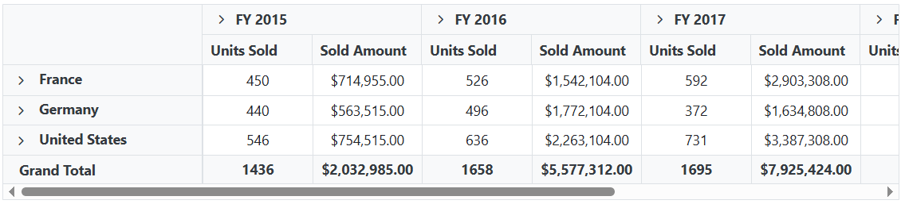

# CSS Customization in Blazor Pivot Table Component

The Blazor Pivot Table component provides extensive CSS customization options, allowing users to modify the visual appearance and layout of various pivot table elements. This includes styling row headers, column headers, value cells, summary cells, Field List components, and Grouping Bar areas to match application themes and design requirements.

## Hiding Axis

The visibility of the row, column, value, and filter axis areas in both the Field List dialog and Grouping Bar can be controlled using custom CSS styling. Each axis area has specific CSS classes that allow precise targeting for customization.

The following code example demonstrates how to hide the column axis in both the Grouping Bar and Field List within the Pivot Table. The CSS includes necessary height and spacing adjustments to prevent layout gaps and maintain visual consistency:

```cshtml
@using Syncfusion.Blazor.PivotView
<SfPivotView TValue="ProductDetails" ID="PivotView" ShowGroupingBar="true" ShowFieldList="true">
    <PivotViewDataSourceSettings DataSource="@data">
        <PivotViewColumns>
            <PivotViewColumn Name="Year"></PivotViewColumn>
            <PivotViewColumn Name="Quarter"></PivotViewColumn>
        </PivotViewColumns>
        <PivotViewRows>
            <PivotViewRow Name="Country" ></PivotViewRow>
            <PivotViewRow Name="Country" ></PivotViewRow>
            <PivotViewRow Name="Products"></PivotViewRow>
        </PivotViewRows>
        <PivotViewValues>
            <PivotViewValue Name="Sold" Caption="Units Sold"></PivotViewValue>
            <PivotViewValue Name="Amount" Caption="Sold Amount"></PivotViewValue>
        </PivotViewValues>
        <PivotViewFormatSettings>
            <PivotViewFormatSetting Name="Amount" Format="C"></PivotViewFormatSetting>
        </PivotViewFormatSettings>
    </PivotViewDataSourceSettings>
</SfPivotView>

<style>

    /* Hiding column axis in grouping bar */
    #PivotView .e-group-columns {
        display: none;
    }
    /* Increasing filter axis height to fill column axis portion */
    #PivotView .e-group-filters {
        min-height: 74.67px !important;
    }

    /* Hiding column axis in field list */
    .e-pivotfieldlist-container .e-field-list-columns {
        display: none;
    }
    /* Increasing value axis height to fill column axis portion */
    .e-pivotfieldlist-container .e-field-list-values {
        margin-top: 0px !important;
        min-height: 338px !important;
    }
    .e-pivotfieldlist-container .e-values {
        height: 310px !important;
    }

    /* Hiding row axis in grouping bar */
    // #PivotView .e-group-rows {
    //     display: none;
    // }

    /* Hiding row axis in field list */
    // .e-pivotfieldlist-container .e-field-list-rows {
    //     display: none;
    // }

    /* Hiding value axis in grouping bar */
    // #PivotView .e-group-values {
    //     display: none;
    // }

    /* Hiding value axis in field list */
    // .e-pivotfieldlist-container .e-field-list-values {
    //     display: none;
    // }

    /* Hiding filter axis in grouping bar */
    // #PivotView .e-group-filters {
    //     display: none;
    // }

    /* Hiding filter axis in field list */
    //.e-pivotfieldlist-container .e-field-list-filters {
    //    display: none;
    //}

</style>

@code{
    public List<ProductDetails> data { get; set; }
    protected override void OnInitialized()
    {
        this.data = ProductDetails.GetProductData().ToList();
        //Bind the data source collection here. Refer "Assigning sample data to the pivot table" section in getting started for more details.
    }
}

```

**Note:** The CSS selectors above assume the Pivot Table component has the ID **PivotView**. Replace this with your actual component ID or use appropriate class-based selectors for your implementation.

The CSS selectors target the following Pivot Table elements:
- `.e-group-columns`: Hides the column axis in the Grouping Bar.
- `.e-group-filters`: Adjusts the height of the filter axis to compensate for the hidden column axis in the Grouping Bar.
- `.e-field-list-columns`: Hides the column axis in the Field List dialog.
- `.e-field-list-values`: Adjusts the layout of the values axis when the column section is hidden in the Field List dialog.


## Text Alignment

The alignment of text inside row headers, column headers, value cells, and summary cells can be customized using CSS styling. The following example demonstrates how to center-align text in value cells:

```cshtml
@using Syncfusion.Blazor.PivotView
<SfPivotView TValue="ProductDetails">
    <PivotViewDataSourceSettings DataSource="@dataSource">
        <PivotViewColumns>
            <PivotViewColumn Name="Year"></PivotViewColumn>
            <PivotViewColumn Name="Quarter"></PivotViewColumn>
        </PivotViewColumns>
        <PivotViewRows>
            <PivotViewRow Name="Country" ></PivotViewRow>
            <PivotViewRow Name="Country" ></PivotViewRow>
            <PivotViewRow Name="Products"></PivotViewRow>
        </PivotViewRows>
        <PivotViewValues>
            <PivotViewValue Name="Sold" Caption="Units Sold"></PivotViewValue>
            <PivotViewValue Name="Amount" Caption="Sold Amount"></PivotViewValue>
        </PivotViewValues>
        <PivotViewFormatSettings>
            <PivotViewFormatSetting Name="Amount" Format="C"></PivotViewFormatSetting>
        </PivotViewFormatSettings>
    </PivotViewDataSourceSettings>
</SfPivotView>

<style>

/*Value Cells*/
.e-pivotview .e-valuescontent {
    text-align: center !important;
}

/*Columns Headers*/
/*.e-pivotview .e-columnsheader {
    text-align: center !important;
}*/

/*Rows Headers*/
/*.e-pivotview .e-rowsheader {
    text-align: center !important;
}*/

/*Summary Cells*/
/*.e-pivotview .e-summary {
    text-align: center !important;
}*/

</style>

@code{
    public List<ProductDetails> data { get; set; }
    protected override void OnInitialized()
    {
        this.data = ProductDetails.GetProductData().ToList();
        //Bind the data source collection here. Refer "Assigning sample data to the pivot table" section in getting started for more details.
    }
}
```



## Customize header, value and summary cell styles

The Pivot Table component elements including header cells, value cells, and summary cells can be styled using built-in CSS class names. This enables comprehensive visual customization of the component's appearance to match application themes and design requirements.

The following code sample demonstrates how to apply custom background colors to different cell types:

```cshtml
@using Syncfusion.Blazor.PivotView
<SfPivotView TValue="ProductDetails" ID="PivotView" ShowFieldList="true">
    <PivotViewDataSourceSettings DataSource="@data">
        <PivotViewColumns>
            <PivotViewColumn Name="Year"></PivotViewColumn>
            <PivotViewColumn Name="Quarter"></PivotViewColumn>
        </PivotViewColumns>
        <PivotViewRows>
            <PivotViewRow Name="Country" ></PivotViewRow>
            <PivotViewRow Name="Products"></PivotViewRow>
        </PivotViewRows>
        <PivotViewValues>
            <PivotViewValue Name="Sold" Caption="Units Sold"></PivotViewValue>
            <PivotViewValue Name="Amount" Caption="Sold Amount"></PivotViewValue>
        </PivotViewValues>
        <PivotViewFormatSettings>
            <PivotViewFormatSetting Name="Amount" Format="C"></PivotViewFormatSetting>
        </PivotViewFormatSettings>
    </PivotViewDataSourceSettings>
</SfPivotView>

<style>

.e-pivotview .e-headercell {
    background-color: thistle !important;
}

.e-pivotview .e-rowsheader {
    background-color: skyblue !important;
}

.e-pivotview .e-summary:not(.e-gtot)  {
    background-color: pink !important;
}

.e-pivotview .e-gtot  {
    background-color: greenYellow !important;
}

</style>

@code{
    public List<ProductDetails> data { get; set; }
    protected override void OnInitialized()
    {
        this.data = ProductDetails.GetProductData().ToList();
        //Bind the data source collection here. Refer "Assigning sample data to the pivot table" section in getting started for more details.
    }
}
```

The CSS classes target the following Pivot Table elements:
- `.e-headercell`: Styles column header cells
- `.e-rowsheader`: Styles row header cells  
- `.e-summary:not(.e-gtot)`: Styles subtotal summary cells (excluding grand totals)
- `.e-gtot`: Styles grand total cells


N> You can refer to the [Blazor Pivot Table](https://www.syncfusion.com/blazor-components/blazor-pivot-table) feature tour page for its groundbreaking feature representations. You can also explore the [Blazor Pivot Table example](https://blazor.syncfusion.com/demos/pivot-table/default-functionalities?theme=bootstrap5) to know how to render and configure the pivot table.